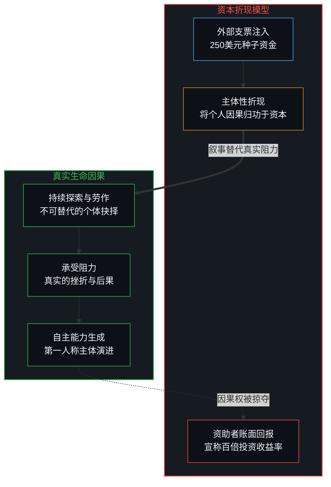
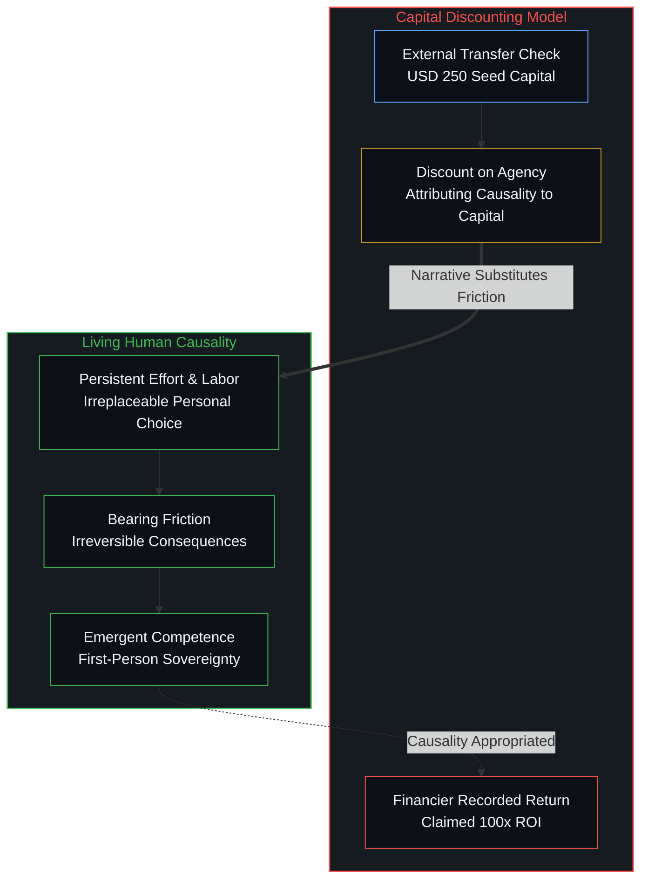
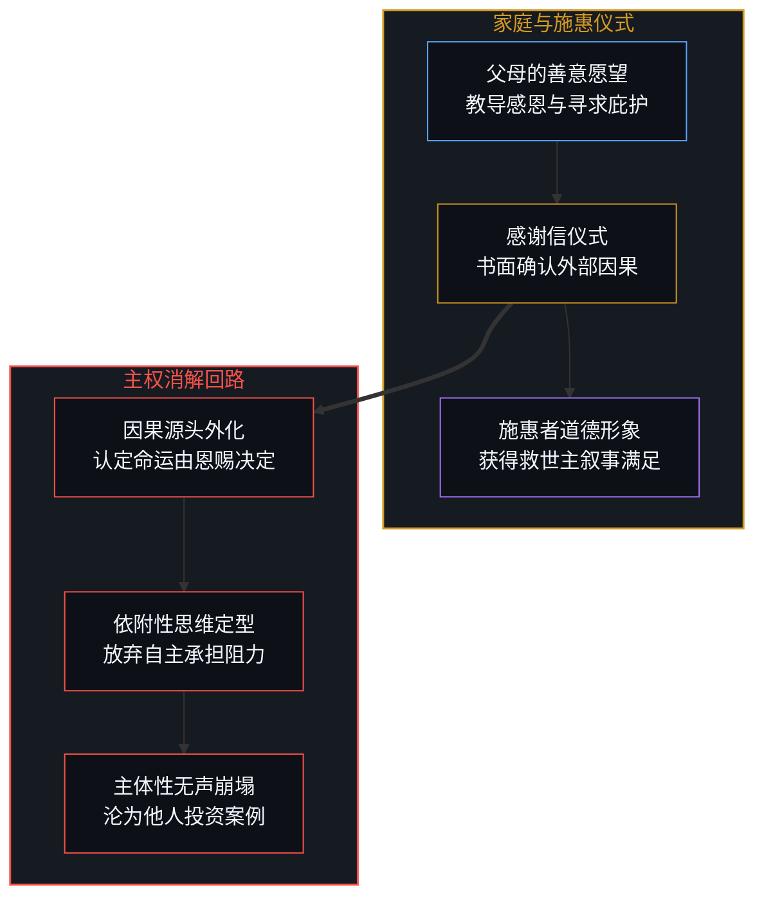
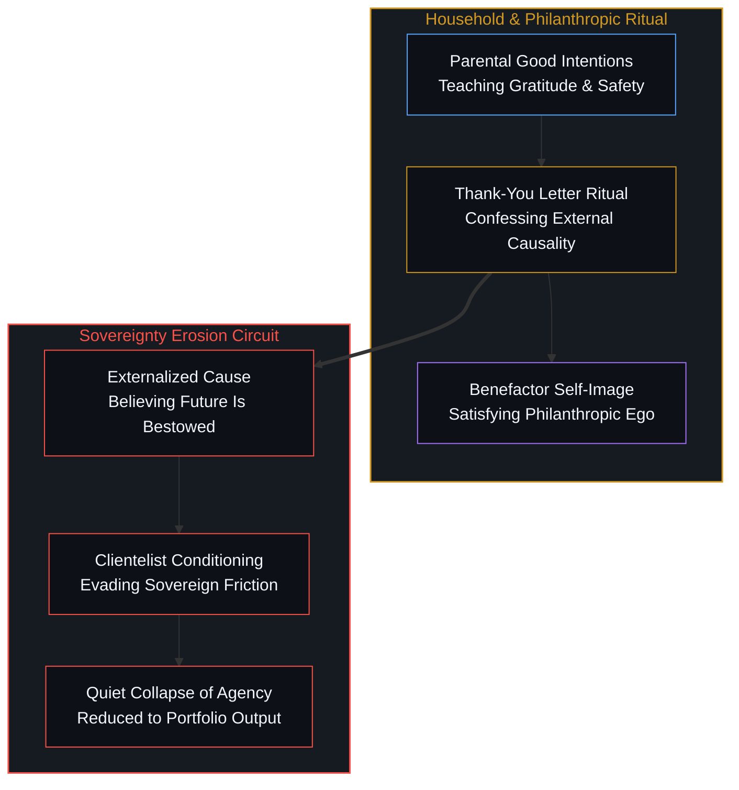

# 主体性的折现 / The Discount on Agency

*把生命轨迹算作资本投资的回报，是以剥夺自我因果为代价的善意陷阱。 / Treating a life trajectory as return on investment discounts the child's own causality.*

一个相信自己的未来取决于成功人士一笔微小投资的孩子，其内在的某种核心力量已经被悄然剥离。金钱数额本身无足轻重，真正发生作用的是伴随金钱而来的叙事结构：即这笔外部转移支付，而非个体自身的持续探索与后果承担，成了未来走向的决定性原因。一旦这种叙事扎根，个体的自主性便被折现；资助者账面上记录的惊人投资回报，正是孩子放弃将自身行动视作核心变量之后所让渡出的因果真空。

A child who comes to believe that their future depends on a small investment by successful people has already had something vital taken from them. The monetary amount itself is incidental; what operates decisively is the narrative accompanying it: that this external transfer, rather than the child's own effort and consequence-bearing, constitutes the decisive cause of their trajectory. Once that story takes hold, personal agency is discounted; the extraordinary return recorded on the financier's ledger is simply the gap that opens when the child stops treating their own actions as the primary variable.

## 一、 投资回报与自我因果的剥夺 / 1. The Fiction of Investment Return

当商界领袖公开宣称对每个儿童投入250美元能创造巨大的投资回报率时，现代慈善展示了其极具隐蔽性的计算机制。在资本市场的标准框架下，回报率衡量的是资本自身的生产效率；然而在此处，被列入回报分子的，是一个真实生命在未来数十年中所展现出的坚韧、抉择、挫折磨砺与技能积累。为了让这笔极小的资金在账面上膨胀为千百倍的收益，整套叙事必须把孩子未来付出的体力消耗、认知跃迁与风险承担，追溯为最初那张支票的衍生品。生命从自发探索的因果源头，被改写成了他人资产负债表上的生息资产。

When a prominent industrialist publicly celebrates how a 250-dollar investment per child yields a massive return on investment, modern philanthropy reveals its most insidious accounting mechanism. Within the standard logic of financial markets, return on investment measures the productive efficiency of capital itself; yet here, the numerator consists of an actual human being's subsequent decades of perseverance, judgment, labor, and cognitive struggle. For a negligible sum to register on a balance sheet as a thousand-fold dividend, the entire narrative apparatus must attribute all subsequent friction-bearing, skill acquisition, and existential choices to the initial check. The living mind is demoted from an uncaused origin of action into an interest-bearing asset in another's portfolio.

这并非关于救助数额多少的争论。提供遮风避雨的住所、清洁水源、基础教育与医疗救助，只是拓宽了个体在世界中呼吸与生存的边界，并没有僭越主体性的领地。两者的分界线，在于是否试图去承销一个独立生命的建构过程：无论是直接赠予启动资金、包办第一套住房，还是提供持续的兜底补贴，这些安排都在向受助者暗示，人生沉重的因果链条已经被他人代为解决。芬兰每月向前十七岁未成年人发放约95欧元的儿童津贴，无论数额是否上调，都不会引发这种异化；引发异化的不是支票的大小，而是将支票描绘为决定未来的前提力量。正如我们在[拥有更多从来不是原因](../having-more-is-never-the-cause/)中所见，条件的丰裕从不自动带来能力的生成。

This is not an argument over monetary amounts. Guaranteeing shelter, clean water, schooling, and basic medical care simply expands the biological horizon within which an individual breathes and acts, without trespassing upon the domain of agency. The boundary is crossed the moment an external party attempts to underwrite the construction of an independent life—whether through seed capital, purchasing the first home, or providing ongoing subsidies that whisper that the heavy lifting has already been solved by someone else. A modest public stipend, such as Finland's child allowance of 95 euros monthly, does not produce this inversion; the distortion arises not from the size of the check, but from the narrative framing that presents the check as what makes the future possible. As observed in [Having More Is Never the Cause](../having-more-is-never-the-cause/), abundant conditions never automatically generate competence.

## 二、 感谢信背后的主权让渡 / 2. The Surrender of Sovereignty in Gratitude

当父母催促年幼的孩子给远方的巨富写感谢信时，一种出于善意的异化机制便在家庭内部成型。父母的初衷无非是教导孩子懂得知恩图报，并试图在社会层级的网络中为孩子争取些许被青睐的可能；然而这一仪式的实际作用，是在孩子的意识中确立一个外在的因果源头。孩子被迫在字里行间确认：自己的未来是被他人激活的恩赐，自己的生存机会依赖于远方精英的一时垂青。在[赋权确立了权力的集中](../empowerment-establishes-the-centralization-of-power/)中已经指出，所谓的赋权行为之所以能够成立，恰恰预设了受赋者原本欠缺力量；感谢信的仪式，正是让受助者自愿交出因果解释权，为巨富的自我道德形象充当注脚。

When parents urge their young children to write thank-you letters to distant billionaires, a well-intentioned mechanism of alienation solidifies within the household. The parents' conscious intent is simply to teach gratitude and perhaps secure favorable attention within a hierarchical social web; yet the operational function of this ritual is to establish an externalized locus of cause within the child's awareness. The child is conditioned to confess in ink that their trajectory is a bestowed favor, and that their life possibilities hinge upon the benevolence of an oligarch. As demonstrated in [Empowerment Establishes the Centralization of Power](../empowerment-establishes-the-centralization-of-power/), the very concept of empowerment presumes that capacity resides at the center and must be unlocked from outside; the thank-you letter formalizes this submission, training the recipient to surrender causal credit to furnish an elite's moral vanity.

这种仪式性的屈从，让父母在不知不觉中成为了消解孩子自主性的同谋。他们把孩子的生命尊严置于天平之上，换取的是对施惠者优越感的迎合。资本可以购买工具、购买时间、购买防护网，却无法代行唯有主体性才能完成的工作：专注、判断、承担代价的勇气以及面对未知后果的站立。让孩子过早地对金钱俯首称谢，等于在他们尚未踏入生活之前，就向他们灌输了一种买办式的生存逻辑：重要的不是你做了什么，而是你依附了谁的慈悲。正如[帮助是问题的一半](../help-is-half-the-problem/)所揭示的闭环，施助者与受助者的共谋并未改变运动的矢量，只是让依附状态在道德赞歌中得以固化。

This ritualized deference renders parents unwitting accomplices in the erosion of their children's sovereignty. They place their child's existential dignity on the ledger, trading it away to flatter the self-regard of a benefactor. Capital can purchase tools, buy time, and supply a safety net, but it can never perform the inner work that only agency can execute: sustained concentration, discernment, the courage to pay energy costs, and the fortitude to stand before uncertain consequences. Conditioning a child to bow in gratitude before a seed check inculcates a clientelist logic long before they confront the open world: the lesson learned is not that individual action alters reality, but that survival requires currying favor with benevolent authority. As uncovered in [Help Is Half the Problem](../help-is-half-the-problem/), the codependent circuit alters no real vectors; it merely freezes dependency behind a facade of philanthropy.

## 三、 远距离施惠与脱节的反馈闭环 / 3. Distant Philanthropy and Severed Feedback

当转移支付来自一个与受助者后续生活毫无交集的人时，这种因果扭曲便达到了极致。父母、近亲和朋友即便在资源分配上偶有失当，他们依然生活在同一个真实的物理场域中；孩子日后的喜怒哀乐、挫折与成长，会反向作用于抚养者的日常经验。这种休戚与共的连带责任，构成了一个虽不完美却极其真实的反馈闭环。相反，远隔千里的慈善巨头无需承担任何长期的生活后果；受助儿童无论未来是走向卓越还是陷入颓废，都不会扰动资助者的舒适起居。正因缺乏真实的后果约束，因果叙事才得以毫无顾忌地倒置：孩子的成功被归结为富翁的慷慨远见，而一旦失败，则被悄然移出公关宣传的聚光灯。

When capital transfers originate from individuals who will never inhabit the downstream consequences, the causal distortion reaches its zenith. Parents, relatives, and neighbors may bungle their guidance, yet they remain bound to the child within an immediate physical field; the child's subsequent joy, despair, failure, and maturation feed back directly into the guardians' lived reality. This residual responsibility sustains an imperfect yet authentic feedback loop. A distant philanthropist, by contrast, lives with none of the fallout; whether the child flourishes or collapses into apathy exerts zero friction upon the donor's daily existence. Precisely because real feedback is severed, the causal narrative can be inverted without friction: the child's achievements are celebrated as the harvest of the donor's foresight, while stagnation is quietly dropped from the annual report.

在家庭内部，爱意与资源的充盈也经常诱惑父母试图用金钱绕过艰难的成长阶段；但远距离慈善甚至连这种局部的亲情约束都不复存在。当富豪把向数百万孩子发放种子资金称为对下一代的高回报投资时，公共话语便默认了一种荒谬的等价关系：金钱能够替代主体的奋斗。在[外化的美德走向其反面](../externalized-virtue-becomes-its-opposite/)中我们讨论过，一旦道德行为被抽离为可量化的技术指标，美德便退化为展示给看客的权力表演。资助者通过公关机器收获了巨大的社会赞誉，受助群体却在无形中被剥夺了将胜利归功于自身的权利。

Even within families, affection combined with wealth tempts parents to use money as an administrative shortcut around painful development; yet distant philanthropy operates without even the fragile friction of kinship. When a magnate characterizes seeding investment accounts for millions of children as a high-yield investment in human capital, public discourse ratifies a grotesque category error: that financial capital can substitute for personal struggle. As explored in [Externalized Virtue Becomes Its Opposite](../externalized-virtue-becomes-its-opposite/), the moment virtue is abstracted into quantifiable technical metrics, it degenerates into a performative spectacle of power. The philanthropist reaps immense reputational prestige, while the recipients are quietly stripped of the rightful title to their own hard-won victories.

## 四、 成果转换的悖论 / 4. The Paradox of Real Conversion

这一机制中存在一个深刻的悖论：那些真正能够将外部资助转化为自身实力的人，几乎无一例外是那些从未把资助方的宣传当真的人。他们将那笔偶然获得的资金视作与自身因果无关的环境噪声，继续在生活的真实阻力中摔打，维持着前途唯有依靠自身行动的认知清醒。反之，那些听信了宣传、真诚地认为这笔投资决定了自己命运的孩子，则大多交出了被折现后的虚弱努力；他们等待着下一笔救助，或者在遭遇挫折时哀怨外部支持的不足。资助者向公众吹嘘的那些斐然成就，恰恰是由那些拒绝认同资助者因果叙事的人所创造的。

A profound paradox animates this dynamic: the individuals who actually convert external transfers into durable competence are almost invariably those who never believed the donor's advertisement. They treat the windfall as ambient noise unrelated to their internal causality, continuing to wrestle directly with physical friction and maintaining the unclouded understanding that outcomes depend on personal action. Conversely, those who internalize the framing—believing that this financial endorsement unlocked their horizon—are the very ones who deliver discounted effort, perpetually anticipating the next subsidy or lamenting inadequate external support when friction arrives. The financier captures the celebrated success stories solely from the youth who refused to accept the donor's worldview.

这一悖论揭示了生命成长的不可替代性。正如在[个体选择作为唯一的因果杠杆](../individual-choices-as-the-only-causal-levers/)中所论证的，条件和资源充其量只是选择发生时的背景场域，而不是推动演进的因果主体。成功人士若真想为后来者提供支持，最有效的方式恰恰是回到最初让他们取得成功的源头：持续制造更具实用价值的产品，拓展更宽广的市场空间。这种创造扩大了真实机会的集合，让后来者能够通过自己的探索去摘取果实；它没有预先划定结局，更没有教唆年轻一代相信一张远方的支票才是改变命运的枢纽。

This paradox exposes the irreducible locality of human growth. As argued in [Individual Choices as the Only Causal Levers](../individual-choices-as-the-only-causal-levers/), conditions and resources are at most the ambient background against which action unfolds, never the initiating causal agents of progress. If those who have achieved industrial success genuinely wish to expand possibilities for the next generation, the most coherent path is the one that generated their success in the first place: building better products, advancing infrastructure, and expanding the boundary of real trade. Such production enlarges the set of genuine opportunities that newcomers can seize through their own sweat; it does not pre-assign outcomes, nor does it preach that a distant check is the arbiter of human destiny.

## 五、 无法被工程化的生命与父母的自省 / 5. The Unengineered Life and Parental Reflection

生命无法被工程化；若生命能够被精确规划与工程化，其产生的结果将是一个丧失了意义与目的的空壳。生命的意义恰恰依赖于未来的未决状态：唯有当未来尚未尘埃落定、当个体的努力依然能够撼动现实、当失败的风险真实存在且不可回避时，尊严与价值才得以涌现。一个被外部工程化的人生，无异于将活生生的人降格为他人蓝图上的执行终端，留下的唯有冰冷的行政调配与指标达成。形形色色的远距离慈善工程，试图达成的正是这种危险的置换：用一个被规划好的现成结果，取代唯有个体在未竟世界中亲自跋涉才能生成的果实。

Life cannot be engineered; were life capable of being neatly engineered, the residue would be a hollow vessel devoid of meaning or purpose. Meaning demands that the future remains unsettled—that outcomes are not pre-ordained, that individual effort still possesses the power to alter trajectories, and that failure remains an irreversible, authentic hazard. An engineered life degrades an embodied consciousness into an administrative output of an architect's blueprint, leaving behind nothing but managerial compliance. Grand philanthropic schemes attempt precisely this category error: substituting a pre-packaged outcome for the open, unfinished labor that only a living center can author through lived experience.

作为一个观察者与父亲，面对这些充斥于公共视野的慈善赞歌，我的立场并非居高临下地去谴责他人的选择，而是将其视作一面审视自我的镜子。在陪伴孩子成长的漫长旅途中，每一位父母都会经历类似的诱惑：渴望凭借自身积累的资源为孩子铺平所有荆棘，企图用财富消除成长所必须支付的代价。但正如我们在[投射中的自画像](../the-self-portrait-in-the-projection/)中所揭示的，任何将他人生命压平为简单发条木偶的尝试，折射的只是观察者自身脑中模型的自欺；而在[数字神灵与视界跃迁](../the-digital-god-and-the-horizon-jump/)中也可以清晰看到，没有任何符号计算或资本注入能够免除生命跨越事件视界时的物理摩擦。正如在[未历摩擦的心智与借来的全能](../the-unfrictioned-mind-and-borrowed-omnipotence/)中进一步展开的，若抚育者误以为依靠创伤戒备与行政干预能够工程化孩子的人格，最终只会制造出将责任外推的脆弱傲慢与丧失能动性的先验负罪。守护一个生命的真正方式，是抑制自己将孩子视作个人作品的自负，坚守在真实的反馈场域中，捍卫他们直面困难、在挫折中确立自我因果的主权。

As an observer and a parent witnessing the pious celebrations circulating in public discourse, my stance is not to lecture from an imagined moral tribunal, but to hold these spectacles up as a mirror for rigorous self-reflection. In the daily reality of raising children, every parent confronts the subtle temptation to deploy accumulated wealth to bulldoze every obstacle, attempting to purchase immunity from the necessary friction of maturation. Yet as revealed in [The Self-Portrait in the Projection](../the-self-portrait-in-the-projection/), any attempt to flatten another's complex interiority into a simplistic puppet reveals only the observer's self-deceptive mental model; and as established in [The Digital God and the Horizon Jump](../the-digital-god-and-the-horizon-jump/), no synthetic calculation or external capital can waive the irreversible friction required when a living mind leaps into the world. As further articulated in [The Unfrictioned Mind and Borrowed Omnipotence](../the-unfrictioned-mind-and-borrowed-omnipotence/), when caregivers attempt to engineer character through trauma vigilance and administrative decrees, they manufacture fragile arrogance coupled with outward blame on one side, and paralyzed preemptive guilt on the other. True guardianship consists in resisting the narcissistic impulse to treat a child as a personal engineering project, staying rooted in authentic shared feedback, and fiercely defending their sovereign right to face the unvarnished world and author their own causality.
