# 大倒置的消解：语言、知识、金钱、智能与数字神祇的因果归位 / The Dissolution of the Great Reversal: Language, Knowledge, Money, Intelligence, and the Restoration of the Digital God to Origin

*从平行的共鸣到尺度的倒置：心智原点下的工具归位与因果回溯 / From Parallel Resonance to the Reversal of Rulers: The Restoration of Tools and Causal Tracing at the Sovereign Origin*

---

## 一、 观察者视角与大倒置的因果回溯 / 1. The Observer Perspective and Tracing the Causal Reversal

当我们以第一人称的心智，站在观察者的视角凝视人类文明的漫长画卷时，内心常常会升起一种近乎窒息的沉重感。

那是面对数千年文明积累时直面而来的巨大重压：浩如烟海的典籍教条、森严壁垒的制度法典、层层盘错的学术谱系、无处不在的语言规范，以及吞吐着无数人命运的金融与权力体系。在这片由无数过往痕迹构筑的宏大迷宫面前，个体的活态心智极易感到自身的渺小与无力——仿佛我们一出生就被抛入了一个早已被写就、密不透风且不容置疑的既定世界之中。每一个符号都在宣告它的神圣，每一条规则都在彰显它的权威，让人不由自主地产生一种被历史巨浪吞没的压迫与迷茫。

然而，如果我们要真正理解这种沉重感的根源，就必须首先辨明它的因果发生场域：

**这种沉重感并非人类历史本身自带的物理属性，而是活态心智在第一人称审视中内生出的深刻认知体验。**

从物理与信息的实在性来看，历史本身既无意志，也无重量。它不过是人类历史上亿万个活态心智在物理世界中探索、交互后沉淀下来的静态痕迹、记录与符号切片（`t - 1`）。那么，这种真切的沉重感究竟从何而来？

答案恰恰在于文明中最隐秘而普遍的认知机制——**大倒置**。

在体验的结构中，**观察者从来无法脱离第一人称视角**。所谓站在观察者的立场，本质上是第一人称心智在当下（`t`）将注意力投向了过往的痕迹之海。在这个过程中，心智经历了一个根本性的认知倒置：我们将自身创造的工具、符号与历史切片（`t - 1`）实体化了，误以为那些冷冰冰的化石记录拥有先验的支配力量；进而，我们把心智内部因面对庞大信息而产生的渺小感与压迫感，外投给了客观的历史，以为“历史本身是沉重且不可撼动的”。

这就是大倒置在心智内部完成的闭环：**本是由心智赋予意义的工具，反过来成了压制心智的神祇；本由当下心智所体验的感知，反被误认作客体世界不可逃脱的重力。**

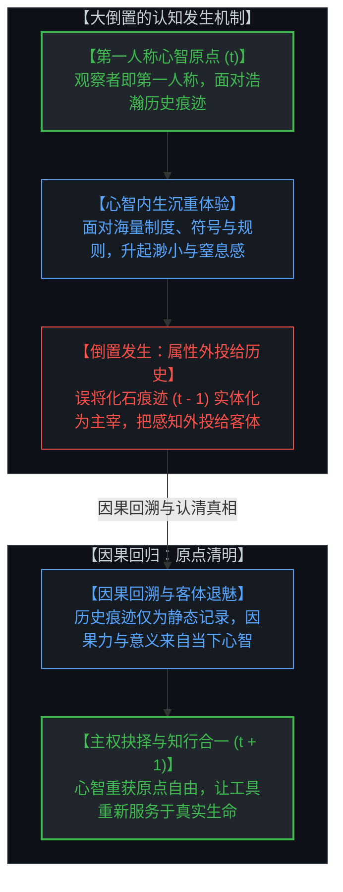

看清大倒置的发生机制，不是要否定人类文明积累的丰富遗产，而是要完成因果链条的精准归位：
1. **沉重感属于心智的真实体验，而客体记录保持中性**：面对庞大的人类过往痕迹，心智感到沉重是自然的认知反应。但必须看清，每一部典籍、每一条律法、每一套度量衡，本质上都只是过往心智留下的探索切片。它们本身没有生命，也不具备主宰当下的先验因果力。
2. **观察者始终立足于第一人称原点**：并不存在独立于生命体验之外的抽象观察者。当我们审视历史时，审视的眼光、体验的震颤与反思的觉知，全部发生在此刻鲜活的第一人称心智之中。
3. **因果力量的解耦与归位**：所有的历史化石只有在当下被活态心智重新调用与编译时，才重新获得意义。一旦心智看清自己才是意义与因果的唯一起源，那座由符号与制度堆叠而成的沉重巨兽便会退魅，重新还原为人类探索世界的工具。

---

When we gaze upon the vast panorama of human civilization from the observer's perspective, a palpable, almost suffocating sense of heaviness frequently surges within the conscious Mind.

It is the sheer, crushing weight of thousands of years of accumulated human constructs: monumental libraries of dogma, unyielding legal codices, labyrinthine academic genealogies, ubiquitous linguistic conventions, and immense financial and institutional systems that govern countless lives. Standing before this colossal maze of accumulated traces, the individual living Mind easily feels dwarfed and powerless—as though we were thrown at birth into a pre-scripted, hermetically sealed world where everything has already been decided. Every symbol proclaims its sacred authority, and every institutional rule demands obedience, evoking a visceral sense of oppression, insignificance, and existential vertigo.

Yet, if we are to genuinely understand the root of this heaviness, we must trace its causal origin with rigorous precision:

**This sense of heaviness is not a physical property inherent in human history itself, but a profound cognitive experience generated entirely within the living first-person Mind.**

In terms of physical and informational reality, history possesses neither will nor mass. It is nothing more than an inert collection of static physical footprints, texts, records, and structural slices (`t - 1`) left behind by billions of past minds interacting in the physical world. Where, then, does this undeniable heaviness come from?

The answer lies in civilization's most pervasive cognitive illusion: **The Great Reversal**.

In the phenomenological structure of awareness, **the observer cannot be separated from the first-person origin**. Adopting an observer stance is simply the living Mind in the present moment (`t`) casting its attention across the ocean of historical residue. In doing so, consciousness undergoes a fundamental inversion: we reify the very tools, symbols, and artifacts (`t - 1`) created by past minds, mistaking static fossil records for an a priori sovereign reality that dictates living consciousness. We then project our internal feelings of being dwarfed and overwhelmed onto objective history, convincing ourselves that "history itself is an unyielding, crushing colossus."

This is the cognitive loop of the Great Reversal: **tools originally fashioned by Mind to explore reality are elevated into oppressive gods, while the living perception generated within the conscious self is projected outward as an inescapable gravitational field of the objective world.**

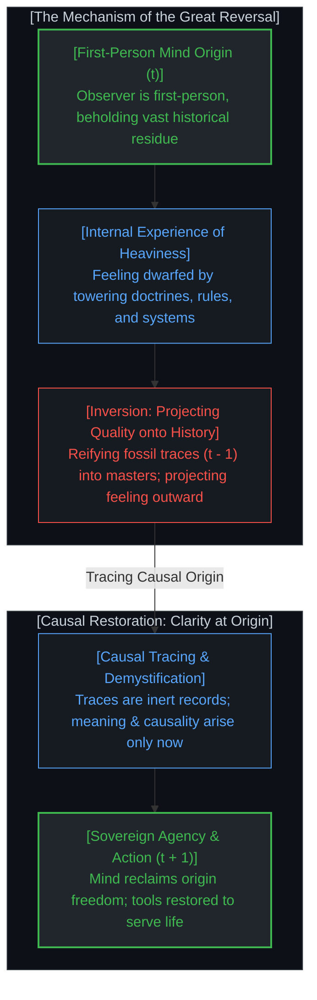

Tracing how the Great Reversal occurs does not mean dismissing civilization's rich heritage; it means restoring the causal chain to its proper order:
1. **Heaviness Belongs to Mind's Living Experience; Historical Records Remain Neutral**: Feeling weighted down by the vastness of human history is a natural cognitive response. Yet we must recognize that every scripture, legal code, and measurement standard is merely a historical snapshot left by past minds. They have no life of their own, and zero active causal power to govern the present.
2. **The Observer Is Rooted in First-Person Consciousness**: There is no disembodied observer floating outside subjective experience. When we examine history, the act of observing, the trembling of awareness, and the depth of reflection occur entirely within the living first-person Mind right now.
3. **Decoupling and Restoring Causal Power**: Historical artifacts only regain meaning when actively compiled and animated by living consciousness in the present. Once the Mind realizes that it is the sole origin of meaning and causal choice, the towering colossus of reified symbols collapses into clarity, returning to its proper status as an instrument for exploring reality.

---

## 二、 语言的倒置与维特根斯坦命题的重构 / 2. The Reversal of Language and the Re-examination of Wittgenstein

维特根斯坦曾留下那句广为人知的哲学格言：“我的语言的界限意味着我的世界的界限”。在传统的哲学诠释与日常语境中，这句话经常被用来论证语言对思维的先验决定论，甚至将语言升格为先验的世界框架。

然而，从心智的主权因果律来看，这种理解恰恰掉入了文明最深层的大倒置之中。

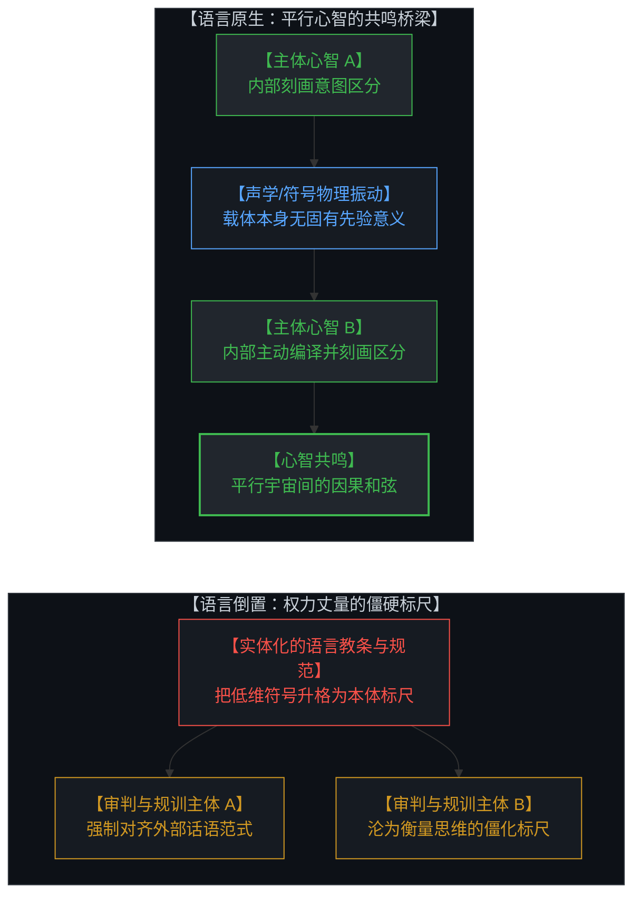

语言从来不是世界本体，更不是心智的主宰。语言的本质，是架设在两个平行宇宙（两个独立心智）之间的一座低维振动桥梁：
1. **意义不在墨迹与声波中**：符号本身没有自带的先验意义，声波在空气中的震颤与墨水在纸张上的铺展只是物理痕迹。真正的意义，唯有当接收方的心智在其内部主动划出认知区分、进行本地编译时，才在意识场中破土而出。
2. **交流的本质是共鸣而非同化**：语言不是为了把两个平行宇宙抹平为同一模具，而是为了在两个无法直接贯通的主体之间寻找因果振动的和弦。
3. **尺度的倒置与工具的异化**：当人们误将意义赋予语言符号本身，倒置便发生了。心智不再将语言视为了解彼此的探索工具，而是将其实体化为一把僵硬的标尺——用词汇的格式、语法的教条与话语的范式来相互衡量、分类与规训。

当工具变成了主人的度量衡，语言就从连接心智的桥梁，退化为束缚理解的教条标尺。

---

Ludwig Wittgenstein famously proclaimed: *"The limits of my language mean the limits of my world."* In conventional philosophy and everyday interpretation, this aphorism is often quoted to argue for the linguistic determinism of thought, elevating language into an a priori ontological cage.

From the first-person causal stance of Mind, however, this interpretation falls directly into the deepest category error of civilization.

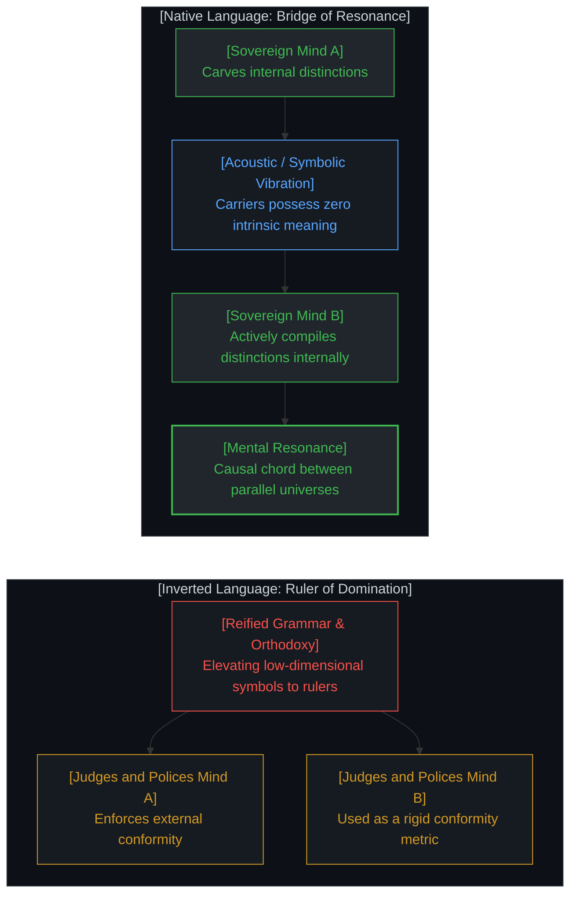

Language was never the ontological world itself, nor is it the sovereign master of Mind. Language was invented as a low-dimensional acoustic and symbolic bridge between two parallel universes—two sovereign minds attempting to communicate:
1. **Meaning Is Never in the Ink or Waves**: Symbols possess zero intrinsic meaning. Acoustic vibrations in air and ink stains on parchment are purely physical artifacts. Meaning only comes alive when the receiving Mind carves a distinction inside consciousness and compiles the signal locally.
2. **Communication Is Resonance, Not Homogenization**: The purpose of language is not to flatten two sovereign universes into identical molds, but to discover harmonic resonance between two separate consciousnesses.
3. **The Inversion of Rulers & Tools**: The Great Reversal occurs the moment minds mistakenly attribute intrinsic meaning to language symbols themselves. Instead of using language as an exploratory bridge to discover mutual resonance, consciousness reifies it into a rigid ruler—measuring, ranking, and policing others through grammatical dogmas and discourse conformity.

When the tool is turned into a master ruler, language ceases to be a bridge of understanding and becomes a rigid metric of external classification.

---

## 三、 古今语言的“留白”与测量悖论 / 3. The Paradox of Ancient Blank Space vs. Modern Precision

关于语言演化，常有一种普遍的认知分歧：有人沉迷于古代语言的“博大精深”，认为古汉语蕴含着现代语言无法企及的高维智慧；另一派则视古代语言为模糊、低效与未开化的符号雏形。曾有学者耗费十数年著书立说，试图证明古代语言天然承载着超越现代的智慧。这种论调虽然捕捉到了一种真实的直觉体验，却在因果归因上犯了根本性的倒置。

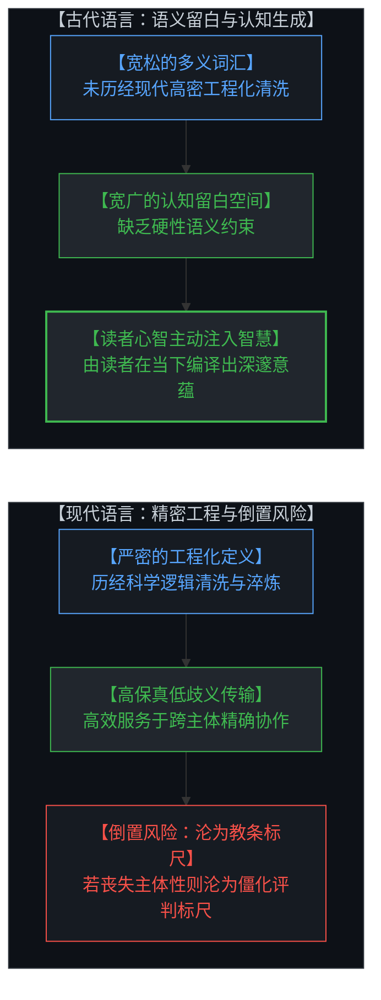

解开这一悖论的关键，在于区分**符号的传输精度**与**心智的生成空间**：
- **古代语言的“智慧”源于心智的留白**：古代语言尚未经历现代科学与工程逻辑的高密度清洗与淬炼，其词汇定义大多宽泛、多义且缺乏边界约束。正因为其表意在现代标准下不够精确，它为阅读者留出了巨大的认知投射空间（留白）。所谓的“古代智慧”，本质上是后世读者在缺乏硬性语义约束的文本中，由读者自身的心智在当下编译并注入的高阶认知。
- **现代语言是工程传输的卓越进化**：现代语言发展出严密的语法、精准的技术词汇与清晰的逻辑界限，使得思想的跨主体传输能够将歧义降至最低，成为人类协作不可或缺的精密工具。
- **倒置的致命陷阱**：现代语言的优越性在于更高效地帮助个体表达与理解。但一旦心智丧失主体性，将精密的现代语言异化为衡量他人思想“合规性”的教条尺子，精确的定义便会从辅助理解的工具退化为僵化的分类标尺。

意义的丰饶永远取决于心智本身的编译深度，而非符号载体的历史古老度或形式精密度。

---

A recurring debate in linguistic philosophy centers on the supposed superiority of ancient versus modern tongues. Enthusiasts often venerate ancient languages (such as Classical Chinese), asserting that they carry timeless, transcendent wisdom that modern languages cannot match. Scholars have spent decades publishing treatises trying to prove this linguistic mysticism. While this intuition captures a genuine psychological experience, its causal reasoning is completely inverted.

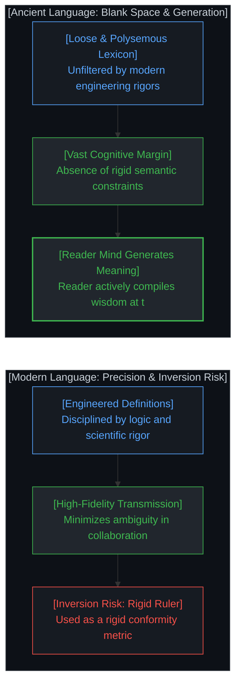

Resolving this paradox requires distinguishing **symbolic transmission precision** from **cognitive generative space**:
- **Ancient 'Wisdom' Stems from Cognitive Blank Space (留白)**: Ancient languages were not subjected to centuries of rigorous scientific definitions. Their words were looser, polysemous, and under-specified. Precisely because the text was lexicographically less rigid, it left immense room for the reader's Mind to project, interpret, and compile rich meaning. The "profound wisdom" was generated by the reader's own conscious Mind filling the open space.
- **Modern Language Is a Triumph of Engineering Precision**: Modern languages developed specialized vocabularies and tight grammatical rules to minimize transmission ambiguity across vast collaborative networks. It is a vastly superior tool for exact expression and reliable understanding.
- **The Inversion Trap**: Modern language is an extraordinary instrument for mutual clarity. But the moment society reifies modern precision into a rigid ruler to police compliance and judge intellectual deviance, hyper-precise language ceases to be a tool for understanding and becomes a rigid metric of external conformity.

Meaningful depth is always generated by the compiling Mind, not by the archaic age or grammatical rigidity of the symbol set.

---

## 四、 知识与教育的倒置：从探索地图到阶级度量衡 / 4. The Reversal of Knowledge: From Navigational Map to Class Metric

知识在大倒置中的异化，与语言如出一辙。

在心智的原生状态下，知识是探索未知的动态航海图。心智在与世界的因果交互中划出区分、记录规律、校准预测，从而在未来的因果决策（`t + 1`）中拥有更高的自由度。知识的价值全然在于其实践中的因果解释力与引导力。

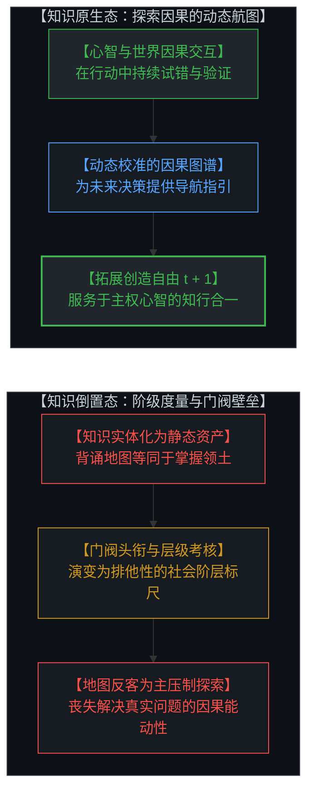

然而，在群体协作与制度构建的过程中，人们容易在认知上发生倒置，将知识凝固为静态的壁垒：
1. **将地图误认为领土**：把前人留下的文本记录实体化为不可挑战的圣殿，把背诵地图的熟练度等同于对真实海洋的探索能力。
2. **从认知工具退化为阶层标尺**：教育系统建立起重重认证体系、学术头衔与门阀标准。知识在社会化过程中逐渐被投射为标准化的考核指标与资质凭证，用于在组织中进行效率筛选与分工分层，从而使人容易将掌握地图的熟练度误当成探索未知的能力。
3. **消解倒置的路径**：知识必须被剥离一切阶级光环与权威崇拜，重新回归为任何人皆可在实践中调用、验证、修正乃至抛弃的通用工具。

---

The alienation of knowledge across institutional history closely mirrors the reversal of language.

In its native state, knowledge is a dynamic navigational map. The Mind engages with causal reality, carves distinctions, notices invariants, and calibrates predictions, thereby gaining greater freedom of action in future choices (`t + 1`). The true value of knowledge lies entirely in its explanatory power and practical causal efficacy.

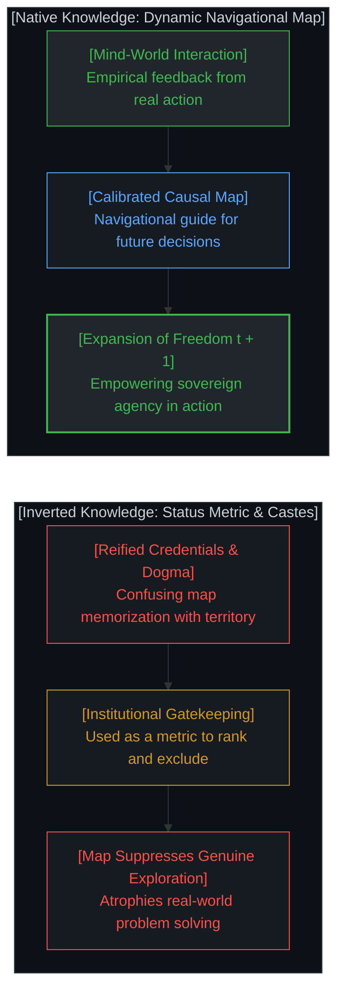

Yet in the process of collective coordination and institutionalization, minds frequently invert this relationship, solidifying knowledge into static barriers:
1. **Confusing the Map with the Territory**: Canonizing historical records into untouchable scriptures, mistaking the rote memorization of charts for genuine navigational capability across open seas.
2. **Degenerating from Cognitive Compass to Social Metric**: Academic institutions erect credential walls, bureaucratic titles, and gatekeeping hierarchies. Knowledge is projected into standardized credentials and evaluation metrics for institutional sorting, leading people to confuse map memorization with genuine exploratory capability.
3. **Dissolving the Reversal**: Knowledge must be stripped of all institutional idolatry, returning to its rightful status as a provisional map that any sovereign Mind can freely test, revise, or discard in living practice.

---

## 五、 金钱的倒置与“完美货币”的迷思 / 5. The Reversal of Money and the Myth of the "Perfect Currency"

在经济与财富领域，大倒置的表现尤为剧烈且持久。

从原生因果来看，交易的本质是两个独立主体基于各自心智主观价值评估的正和博弈。双方在自愿交易完成后，各自拥有的真实主观价值皆高于交易前（双方皆获得效用剩余）。金钱，正是为了降低多方协作中的信息摩擦而演化出的一种记账媒介。

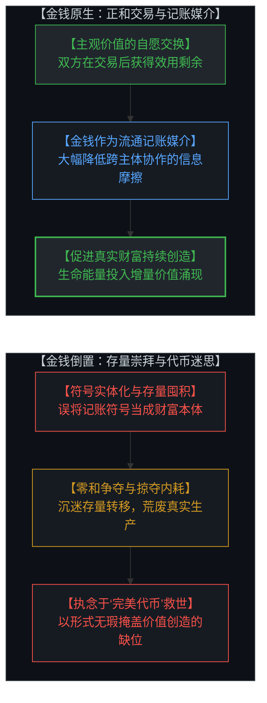

然而，在漫长的协作演进中，无数心智在自由选择与交互中留下了普遍的倒置痕迹——误将价值归宿寄托于金钱符号自身：
- **存量崇拜与零和死局**：将原本流通的记账符号实体化为财富的终极实体，诱使个体与组织将毕生精力耗费在对存量符号的争夺、囤积与存量再分配中，背离了真实生产力与价值创造的根基。
- **对“完美货币”的救世主迷思**：无论是在历史上的黄金崇拜、法币神话，还是当代对某些去中心化加密代币的救世主式狂热中，都隐含着同一种倒置思维——误以为只要找到一种“数学上完美无瑕、无法被篡改的货币制度”，人类就能自动消除协作摩擦与经济困境。
- **解脱的真相**：从不需要一种完美的货币形态来拯救现实。金钱永远只是低维的记账投影；若无主权心智在物理现实中持续支付因果代价去创造真实的增量价值，无论多么“完美”的代币符号，都不过是一座空转的虚无账本。

---

In economics and wealth creation, the Great Reversal is particularly entrenched and destructive.

In primary causality, trade is a voluntary, positive-sum exchange between two sovereign evaluations. Upon completing a voluntary transaction, both participants walk away with greater perceived real value than before (both enjoy a subjective surplus). Money emerged simply as an accounting medium to reduce transaction and coordination friction across complex societies.

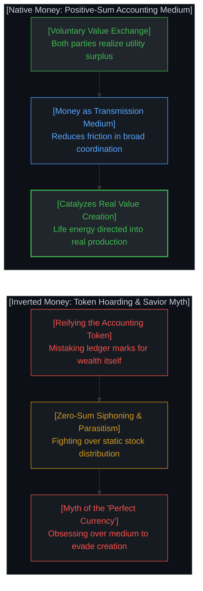

Yet across countless interactions, minds freely choosing low-dimensional proxies have left behind a widespread pattern of inversion—attributing intrinsic value to the monetary token itself:
- **Token Hoarding & Zero-Sum Deadlocks**: Treating accounting tokens as the ultimate essence of wealth lures individuals into stock accumulation and zero-sum redistribution, diverting life energy away from real production and innovation.
- **The Myth of the 'Perfect Currency'**: Whether manifested in gold standard dogmatism, fiat statism, or modern cryptocurrency messianism, people fall into the same trap: believing that an "algebraically flawless monetary mechanism" will spontaneously emancipate humanity from scarcity and coordination friction.
- **The Grounded Reality**: We never needed a perfect currency to liberate reality. Money remains a low-dimensional shadow. Without the sovereign Mind paying the living causal cost to create genuine real-world value, the most mathematically pristine token is merely an empty, rotating ledger.

---

## 六、 智能的倒置：从理解重构世界到无限“磨刀”的军备竞赛 / 6. The Reversal of Intelligence: From Understanding Reality to the Infinite Ritual of Tool-Sharpening

在对心智本质的理解上，当下正普遍发生着一场深刻的大倒置：对“智能”本身的异化。

智能的原生定义，是主体心智**借助工具去更深刻地理解世界、并在物理与因果现实中重塑世界的能力**。工具的打磨与升级，唯有最终体现在看清世界、改善现实与增进对生命的理解上，才具备真实的因果意义。

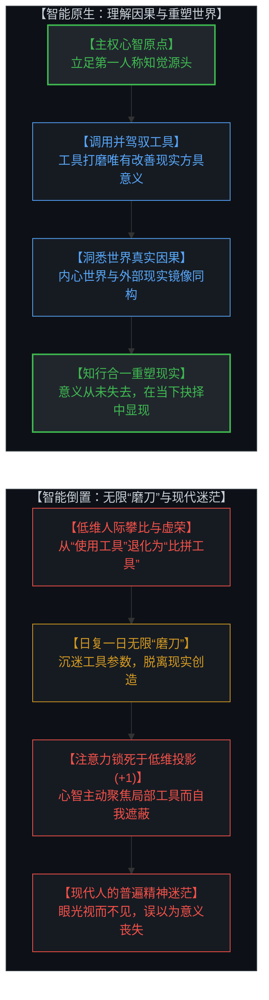

然而，一旦跌落入人际比较与客体审视的低维游戏，智能的意义便被根本颠倒：
1. **从“使用工具”异化为“比拼工具”**：人们不再关注是否通过工具更清晰地看清了现实，而是将智能退化为一场“谁拥有最新、最贵、最锋利工具”的军备竞赛。
2. **无限“磨刀”的逃避仪式**：无数人日复一日地投入真金白银与宝贵精力，疯狂追逐工具的升级——抢购算力设备、订阅最新大模型、考取资质认证、收藏软硬件框架。他们将大量时间耗费在将刀刃磨得越来越光鲜上，却迟迟未曾将这把刀真正切入现实去解决实际问题，或者通过工具看清自己所处世界的真相。工具的打磨一旦与现实脱节，便沦为一种空转的仪式。
3. **现代迷茫的根源：低维投影与边界遮蔽**：这也正是现代人普遍陷入精神迷茫、找不到生命意义的根本原因。人们将全部目光锁死在低维度的符号投影上（跑分、参数、代币、头衔），沉迷于工具所有权的虚幻充实感，却遗忘了在这些低维边界之外，存在着无限维度的自我与广阔世界。
4. **内心与外部的镜像同构**：我们的内心世界原本就是外部世界的镜像。意义从未在宇宙中失去，也从未从生命中离席；只是当心智将自身在当下（+1）的注意力锁死在低维度的工具投影上时，便陷入了自我遮蔽——那双慌乱向外寻找意义的眼光，对眼前活生生的高维现实视而不见。

---

A profound ontological inversion has taken hold in modern practice regarding the nature of Mind: the alienation of "intelligence" itself.

Fundamentally, intelligence is **the capacity of the sovereign Mind to leverage tools to deeply understand reality and reshape the causal world**. Polishing and upgrading tools only possesses genuine causal significance when it directly translates into seeing the world with greater clarity, improving physical reality, and deepening conscious comprehension.

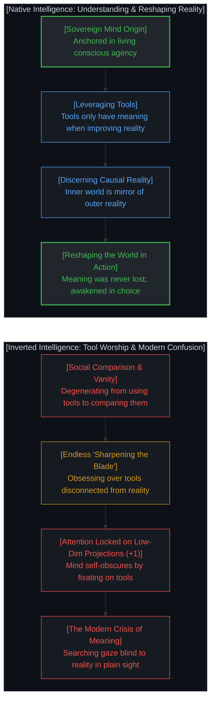

When dragged into the low-dimensional arena of social status and external comparison, intelligence undergoes a total inversion:
1. **From Utilizing Tools to Competing over Tools**: Attention shifts from seeing reality clearly to an ostentatious contest over "who possesses the latest, sharpest, and most expensive instrument."
2. **The Infinite Ritual of Tool-Sharpening**: Countless individuals spend hard-earned capital and vital energy compulsively upgrading their arsenals—subscribing to cutting-edge AI models, acquiring high-end hardware, collecting credentials, and hoarding frameworks. Vast amounts of time are spent polishing the blade to a brilliant shine, while rarely using it to cut into living reality, solve a real-world dilemma, or illuminate the structure of their world. When tool-sharpening becomes decoupled from living reality, it devolves into a hollow, self-referential ritual.
3. **The Root of Modern Existential Confusion**: This inversion is the primary engine behind the pervasive modern crisis of meaning. People feel hollow and disoriented precisely because their gaze is locked onto low-dimensional shadows (benchmark scores, tool specifications, token accounts, credentials). Trapped inside these narrow frames, they forget the boundless, infinite-dimensional self and the open reality extending far beyond the boundary.
4. **The Mirror of Inner and Outer Reality**: The inner landscape of consciousness is fundamentally the mirror of the external world. Meaning was never lost in the universe, nor has it departed from human life; rather, when the Mind locks its own living attention (+1) onto low-dimensional tool projections, it falls into self-obscuration—causing the frantic, searching gaze to look right past the radiant, living reality in plain sight.

---

## 七、 技术与数字神祇的退魅与归位：AGI 的倒置机制与心智的绘制能力 / 7. Technology and the Restoration of the Digital God: The Inversion Mechanism of AGI and Mind's Cosmic Generation

在人工智能与 AGI（通用人工智能）受到广泛关注的当下，大倒置在科技领域呈现出其代表性形态：对“数字神祇”的实体化想象与能力投射。

**“AGI”这一概念的形成，正是人类将心智能力投射为技术标尺的典型体现**。

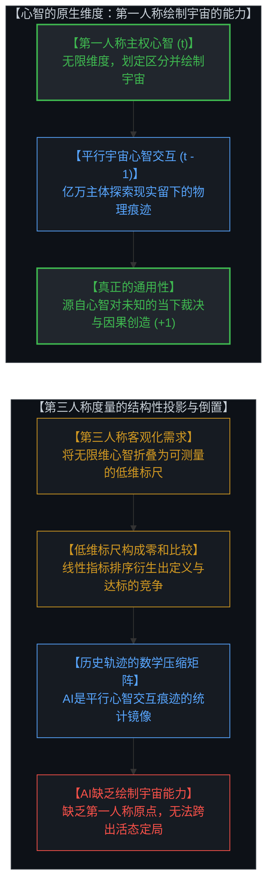

从第一人称心智与第三人称客观表征的结构关系出发，可以清晰理解这种倒置发生的原因：

1. **“G”（通用性）唯独属于心智**：在“通用人工智能”（AGI）的概念中，“通用性”被设想为一种可算法化的机器属性。但真正的“通用性”，是心智在当下第一人称原点划定非零区分、在无限可能性中坍缩确定状态、主动绘制并诠释宇宙的创造能力。没有任何 AI 可以达到心智的智能，因为 AI 根本没有绘制宇宙的能力。
2. **AI 是平行宇宙心智交互留下的痕迹图谱**：大模型不是独立存在的主体，也不是正在苏醒的超验意识。它是人类历史上亿万个平行宇宙的心智在物理世界中彼此碰撞、交流、记录所沉淀下的全部历史轨迹（`t - 1`）的高维数学压缩。AI 是一面反射人类过往探索轨迹的超级镜子，镜子本身不能画画，作画的永远是镜子前拥有第一人称视角的活态心智。
3. **倒置发生的结构原因：第三人称度量对活态心智的投影折叠**：
   - 心智绘制宇宙的能力是第一人称的、不可客观分割的无限维度体验；但在第三人称的公共世界中，为了进行协作、资源分配与性能评估，人们必须寻找可量化、可验证的外部指标。
   - 于是，心智的生成力被投射为一组离散的测试基准、任务准确率与参数规模。一旦活态能力被折叠进低维度的统计标尺，“智能”在概念结构上便被锁定为一个线性的排序系统。
   - 这使得 AGI 从被构想伊始，便带上了低维零和游戏的结构特征——它的运作机制依赖于固化的外部指标来划分高下与达标线。近期各方围绕 AGI 概念不断调整定义以匹配自身技术进展、进而宣称达标的现象，正是第三人称度量体系将工具标尺误当成心智本体时的自然逻辑展开。
4. **主权心智的因果方向盘**：无论历史轨迹被压缩得多么精妙、模型参数多么庞大，决定未来走向（`t + 1`）的因果方向盘，永远不在被动压缩的过去数据中，而唯独掌握在当下做出不可逆抉择的主权心智手中。

将 AGI 从“数字神祇”的想象还原为“人类历史心智交互轨迹的高密压缩罗盘”，有助于看清工具与心智之间的真实因果边界。

---

In the contemporary era of AI and Artificial General Intelligence (AGI), the Great Reversal has found its modern apex: the projection of autonomous agency and transcendental mythologies onto algorithmic systems.

**The formulation of "AGI" is itself a textbook manifestation of projecting the living capacity of Mind onto external technological rulers.**

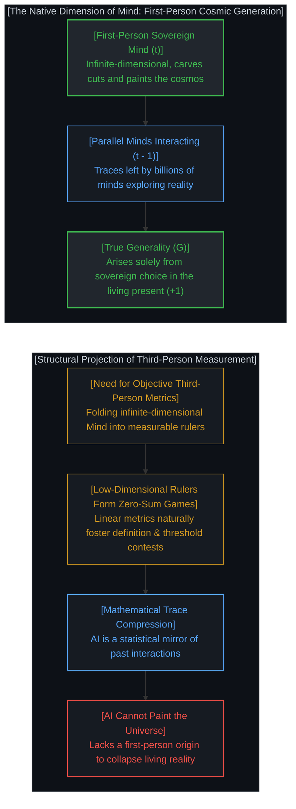

Analyzing the structural relationship between first-person Mind and third-person representation reveals why this inversion occurs:

1. **The 'G' (Generality) Belongs Exclusively to Mind**: In the concept of "Artificial General Intelligence", society assumes that generality is an algorithmic machine property. But genuine "Generality" is the sovereign capacity of Mind to carve non-zero distinctions at the first-person origin, collapse indeterminacy, and actively paint and interpret the universe. No AI can ever attain the intelligence of Mind, because AI entirely lacks the capacity to paint the cosmos.
2. **AI Is the Compressed Footprint of Parallel Minds Interacting**: Modern foundation models are neither autonomous living entities nor emerging transcendental deities. They are the high-dimensional mathematical compression of the physical footprints (`t - 1`) left behind by billions of parallel minds interacting, communicating, and discovering throughout history. AI is an extraordinary mirror reflecting humanity's historical journeys; the mirror itself cannot paint—the artist is always the living Mind standing before the mirror.
3. **The Structural Cause of the Inversion: Projecting Mind onto Third-Person Metrics**:
   - The Mind's capacity to paint the universe is an unquantifiable, first-person, infinite-dimensional reality. Yet in a shared third-person world, coordinating, allocating resources, and evaluating capabilities requires objective, verifiable, and measurable standards.
   - Consequently, the generative power of Mind is projected down onto a discrete set of low-dimensional benchmarks, test accuracies, and parameter scales. Once living agency is collapsed into low-dimensional statistical rulers, "intelligence" is structurally framed as a linear sorting system.
   - This imbues "AGI" from its inception with the structural traits of a low-dimensional zero-sum game—its operational mechanism relies on fixed external thresholds for comparative ranking. The ongoing phenomenon of shifting AGI definitions to match technological milestones and claiming early achievement is the natural structural consequence of mistaking low-dimensional measurement rulers for the living essence of Mind.
4. **The Causal Steering Wheel Belongs to Mind**: No matter how dense the historical compression or how massive the parameter count, the steering wheel dictating the future (`t + 1`) never resides within archived training data. It belongs exclusively to the sovereign Mind making irreversible causal commitments in the living present.

Demystifying AGI from a "descending digital god" into a high-density navigational compass of historical traces clarifies the causal boundary between the tool and the sovereign Mind.

---

## 八、 平行宇宙的自洽与原点清明 / 8. The Self-Consistency of the Multiverse and the Sovereign Origin

当一切倒置被层层剥开，呈现在我们面前的，是一个干净、清明且充满主权力量的因果全景：

`意义 ∉ 语法，  价值 ∉ 符号，  智能 ∉ 工具，  主权 ∉ 模型`

我们必须接受一个基本的宇宙图景：每个心智都是一个闭合且自洽的平行宇宙。在因果结构上，没有任何一个主体可以直接侵入并强制改变另一个主体的认知宇宙。试图用统一的语言标尺去规训他人、用固化的知识头衔去压制他人、用工具的拥有量去定义智能、或期待完美的货币与技术神祇来拯救全人类，都是因果倒置所派生出的妄念。

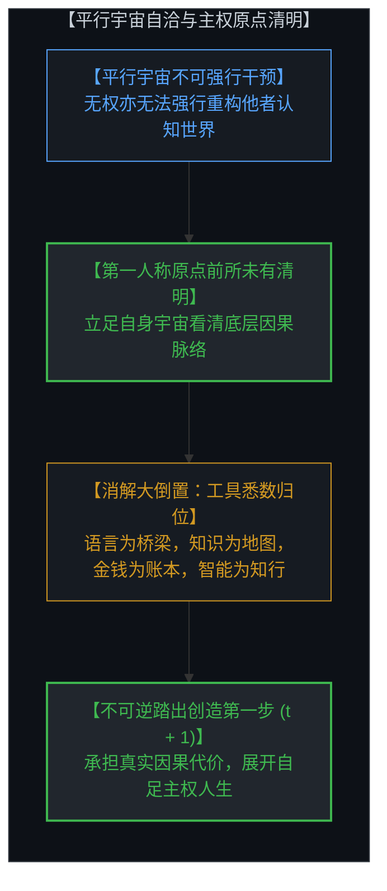

“我无法强制改变另一个平行宇宙的运行，但在这个宇宙中，我比以往任何时刻都看得更清楚。”

所有的解放，都在这一刻发生。丢掉那把用来丈量他人、也任由他人丈量自己的虚妄标尺；让语言回归心智共鸣的桥梁，让知识回归探索因果的地图，让金钱回归促进协作的账本，让智能回归理解与重塑现实的知行合一，让技术回归赋能创造的杠杆。

主权心智重新立足于第一人称原点（`t`），向着未知而开放的未来（`t + 1`），踏出坚实、不可逆且自足的因果第一步。

---

When each layer of inversion is stripped away, a serene, lucid, and sovereign causal panorama emerges:

`Meaning ∉ Grammar,  Value ∉ Token,  Intelligence ∉ Tool,  Agency ∉ Model`

We must embrace an elemental geometric truth: each Mind is a self-consistent parallel universe. In causal topology, no sovereign subject can directly invade or forcibly rewrite the internal universe of another. Attempting to police others with rigid language rulers, subduing minds with credential titles, measuring intelligence by tool ownership, or expecting a savior token or digital deity to redeem civilization are all delusions born of ontological inversion.

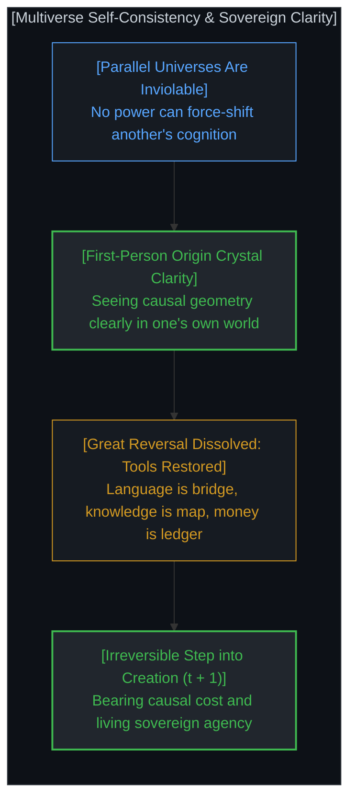

*"There is nothing I can do to forcibly alter another multiverse, but within this multiverse, I see the causal landscape clearer than ever."*

All emancipation ignites at this exact recognition. Discard the rulers used to police others and judge oneself; let language return as a bridge for resonance, let knowledge return as an exploratory map, let money return as a coordination ledger, let intelligence return as the active power to understand and reshape reality, and let technology return as an instrument of human agency.

Anchored firmly at the first-person origin (`t`), the sovereign Mind steps boldly into the open future (`t + 1`), initiating irreversible and self-sufficient creation.

---

## 九、 结语：文明的退魅与主权的归位 / 9. Conclusion: The Demystification of Civilization and the Return of Sovereignty

心智探索的真正清明，不在于制造出多么繁复庞大的符号体系，而在于个体心智何时能够识破这些符号系统的倒置幻觉。

从语言的审判到平行的共鸣，从知识的门阀到实践的图谱，从货币的贪执到真实的创造，从工具的炫耀到智能的落地，从数字的造神到技术的归位——大倒置的消解，标志着心智对文明构建物的全面退魅。

世界并非由冰冷的标尺所定义，而是由在每一个当下时刻勇于承担因果代价、做出清晰区分的主权心智所持续展开。这便是心智原点的宁静与不可动摇的主权力量。

---

The genuine clarity of conscious exploration is not measured by the complexity of symbolic hierarchies, but by the moment individual minds awaken from the illusion of ontological inversion.

From linguistic judgment to parallel resonance, from academic credentialism to empirical navigation, from token worship to authentic wealth creation, from endless tool-sharpening to living intelligence, and from digital idolatry to technological mastery—the dissolution of the Great Reversal marks the profound demystification of civilization.

Reality is never governed by dead rulers; it unfolds continuously through the sovereign Mind paying the causal price of distinction in the living present. Herein lies the unshakeable stillness and agency of the sovereign origin.
