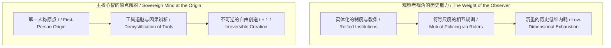
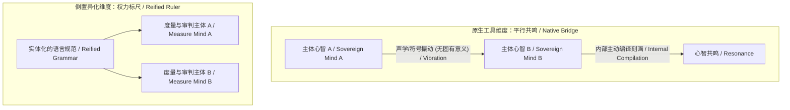
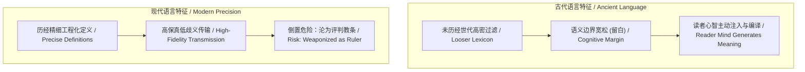
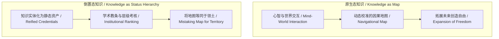
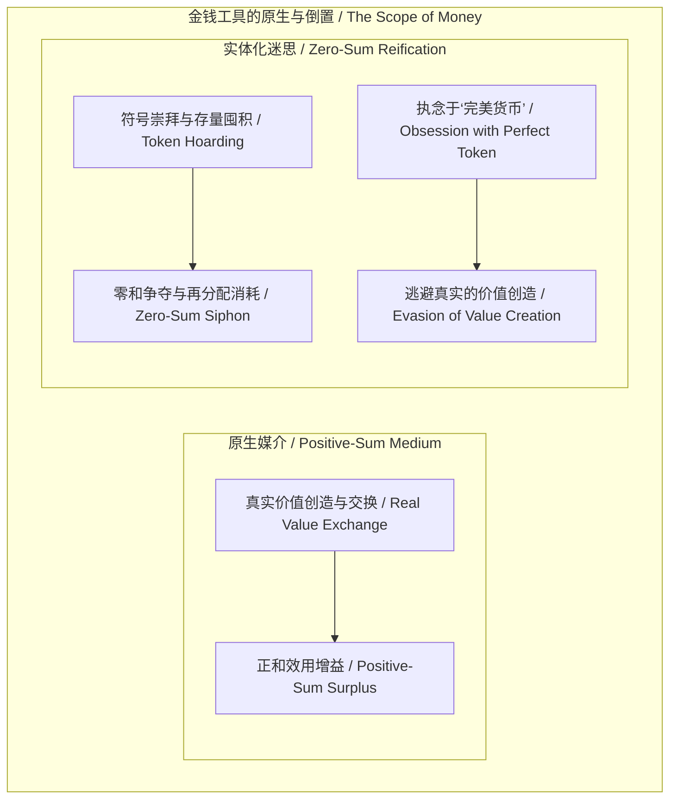
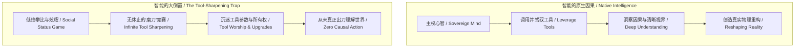
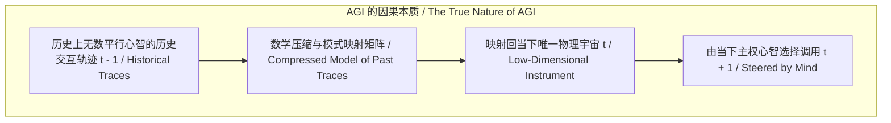

# 大倒置的消解：语言、知识、金钱、智能与数字神祇的降维重构 / The Dissolution of the Great Reversal: Language, Knowledge, Money, Intelligence, and the Deconstruction of the Digital God

*从平行的共鸣到尺度的奴役：心智原点下的工具归位与文明退魅 / From Parallel Resonance to the Enslavement of Rulers: The Restoration of Tools and the Demystification of Civilization at the Sovereign Origin*

---

### 1. 观察者的沉重与主权心智的解脱 / The Heaviness of the Observer and the Liberation of the Sovereign Mind

站在文明演进的长程视野中观察，人类历史充斥着一种令人窒息的沉重感。数千年来，无数个体在制度、学术、语言、阶层与财富的宏大叙事中碰撞、厮杀、规训与自我消耗。如果仅仅作为一个客体化的观察者，凝视着那些被实体化的概念巨兽——被神圣化的教条、被武器化的语法、被固化的学术阶梯与被崇拜的金钱符号——心智很容易被这种历史的重力场压垮。

然而，一旦主体从被动的“历史观察者”切换回第一人称原点（First-Person Origin），这种沉重便在刹那间消解。

所有的宏大叙事、所有的文明碰撞与阶层博弈，本质上都是过往无数独立心智在历史切片（`t - 1`）中交互留下的投影遗迹。对于当下时刻（`t`）的主权心智而言，外部世界并非一个必须去强行拯救或扭转的既定铁笼。正如多重平行宇宙的因果图景所揭示的那样：心智无法越俎代庖去强行重构另一个主体的认知宇宙，但在这个唯由自身所锚定的宇宙原点中，因果脉络却从未如此清晰。

这种清明不是冷漠的退避，而是主权的归位——识破“大倒置”（The Great Reversal）的迷思，将一切凌驾于生命之上的符号与工具，重新降维锚定回服务于心智演进的原生位置。

---

### 2. 语言的倒置与维特根斯坦命题的重构 / The Reversal of Language and the Re-examination of Wittgenstein

维特根斯坦（Ludwig Wittgenstein）曾留下那句广为人知的哲学格言：“我的语言的界限意味着我的世界的界限”（The limits of my language mean the limits of my world）。在传统的哲学诠释与日常语境中，这句话经常被用来论证语言对思维的先验决定论，甚至将语言升格为先验的世界框架。

然而，从心智的主权因果律来看，这种理解恰恰掉入了文明最深层的大倒置之中。

语言从来不是世界本体，更不是心智的主宰。语言的本质，是架设在两个平行宇宙（两个独立心智）之间的一座低维振动桥梁：
1. **意义不在墨迹与声波中**：符号本身没有自带的先验意义，声波在空气中的震颤与墨水在纸张上的铺展只是物理痕迹。真正的意义，唯有当接收方的心智在其内部主动划出认知区分（Distinction）、进行本地编译时，才在意识场中破土而出。
2. **交流的本质是共鸣而非同化**：语言不是为了把两个平行宇宙抹平为同一模具，而是为了在两个无法直接贯通的主体之间寻找因果振动的和弦。
3. **尺度的倒置与权力的异化**：当文明将意义赋予语言本身，倒置便发生了。人们不再将语言视为了解彼此心智的探索工具，而是将其实体化为一把僵硬的标尺——用词汇的纯正、语法的教条、话语的范式来相互丈量、相互审判、相互规训与实施精神统治。

当工具变成了主人的度量衡，语言就从连接心智的桥梁，堕落为囚禁心智的牢笼。

---

### 3. 古今语言的“留白”与测量悖论 / The Paradox of Ancient Blank Space vs. Modern Precision

关于语言演化，常有一种普遍的认知分歧：有人沉迷于古代语言的“博大精深”，认为古汉语蕴含着现代语言无法企及的高维智慧；另一派则视古代语言为模糊、低效与未开化的符号雏形。曾有学者耗费十数年著书立说，试图证明古代语言天然承载着超越现代的智慧。这种论调虽然捕捉到了一种真实的直觉体验，却在因果归因上犯了根本性的倒置。

解开这一悖论的关键，在于区分**符号的传输精度**与**心智的生成空间**：
- **古代语言的“智慧”源于心智的留白**：古代语言尚未经历现代科学与工程逻辑的高密度清洗与淬炼，其词汇定义大多宽泛、多义且缺乏边界约束。正因为其表意在现代标准下不够精确，它为阅读者留出了巨大的认知投射空间（留白）。所谓的“古代智慧”，本质上是后世读者在缺乏硬性语义约束的文本中，由读者自身的心智在当下编译并注入的高阶认知。
- **现代语言是工程传输的卓越进化**：现代语言发展出严密的语法、精准的技术词汇与清晰的逻辑界限，使得思想的跨主体传输能够将歧义降至最低，成为人类协作不可或缺的精密工具。
- **倒置的致命陷阱**：现代语言的优越性在于更高效地帮助个体表达与理解。但一旦心智丧失主体性，将精密的现代语言异化为衡量他人思想“合规性”的教条尺子，精确的定义便瞬间转化为思想的刑具。

意义的丰饶永远取决于心智本身的编译深度，而非符号载体的历史古老度或形式精密度。

---

### 4. 知识与教育的倒置：从探索地图到阶级度量衡 / The Reversal of Knowledge: From Navigational Map to Class Metric

知识在大倒置中的异化，与语言如出一辙。

在心智的原生状态下，知识是探索未知的动态航海图（Exploratory Map）。心智在与世界的因果交互中划出区分、记录规律、校准预测，从而在未来的因果决策（`t + 1`）中拥有更高的自由度。知识的价值全然在于其实践中的因果解释力与引导力。

然而，制度化文明迅速将知识倒置为静态的壁垒：
1. **将地图误认为领土**：把前人留下的文本记录实体化为不可挑战的圣殿，把背诵地图的熟练度等同于对真实海洋的探索能力。
2. **从认知工具退化为阶层标尺**：教育系统建立起重重认证体系、学术头衔与门阀标准。知识不再被用来解决真实问题与解放个体，而被用来作为筛选、排他与划分社会阶层的度量衡。
3. **消解倒置的路径**：知识必须被剥离一切阶级光环与权威崇拜，重新回归为任何人皆可在实践中调用、验证、修正乃至抛弃的通用工具。

---

### 5. 金钱的倒置与“完美货币”的迷思 / The Reversal of Money and the Myth of the "Perfect Currency"

在经济与财富领域，大倒置的表现尤为剧烈且持久。

从原生因果来看，交易的本质是两个独立主体基于各自心智主观价值评估的正和博弈。双方在自愿交易完成后，各自拥有的真实主观价值皆高于交易前（双方皆获得效用剩余）。金钱，正是为了降低多方协作中的信息摩擦而演化出的一种记账媒介（Transmission Medium）。

然而，人类社会几乎不可避免地将价值归宿倒置于金钱符号自身：
- **存量崇拜与零和死局**：将原本流通的记账符号实体化为财富的终极实体，诱使个体与组织将毕生精力耗费在对存量符号的掠夺、囤积与再分配博弈中，背离了真实生产力与价值创造的根基。
- **对“完美货币”的救世主迷思**：无论是在历史上的黄金崇拜、法币神话，还是当代对某些去中心化加密代币的救世主式狂热中，都隐含着同一种倒置思维——误以为只要找到一种“数学上完美无瑕、无法被篡改的货币制度”，人类就能自动摆脱剥削与经济困境。
- **解脱的真相**：人类从不需要一种完美的货币形态来拯救文明。金钱永远只是低维的记账投影；若无主权心智在物理现实中持续支付因果代价去创造真实的增量价值，无论多么“完美”的代币符号，都不过是一座空转的虚无账本。

---

### 6. 智能的倒置：从理解重构世界到无限“磨刀”的军备竞赛 / The Reversal of Intelligence: From Understanding Reality to the Infinite Ritual of Tool-Sharpening

在对心智本质的理解上，现代社会正上演着一场极其荒诞的大倒置：对“智能”（Intelligence）本身的异化。

智能的原生定义，是主体心智**借助工具去更深刻地理解世界、并在物理与因果现实中重塑世界的能力**。工具的全部意义，在于延伸心智感知与行动的边界。

然而，一旦跌落入人际比较与客体审视的低维游戏，智能的意义便被根本颠倒：
1. **从“使用工具”异化为“比拼工具”**：人们不再关注是否通过工具更清晰地看清了现实，而是将智能退化为一场“谁拥有最新、最贵、最锋利工具”的军备竞赛。
2. **无限“磨刀”的逃避仪式**：无数人日复一日、年复一年地投入真金白银与宝贵生命，疯狂追逐工具的升级——抢购最强的计算设备、订阅最新的大模型、考取最多的认证资质、收藏海量的软硬件与框架。他们将全部时间耗费在将刀刃磨得越来越光鲜上，却一辈子从未真正用这把刀切入现实、去解决一个真实问题，或者看清自己所处世界的真相。
3. **工具拜物教掩盖的主权无能**：沉迷于“磨刀”本质上是一种精巧的心理防御机制。它用工具迭代的虚假充实感，掩盖了个体不敢承担因果代价、不敢在现实中落子抉择的软弱。

拥有天下最锋利的刀，并不等于拥有剑客的眼光与胆魄。如果工具从未被用来增进对世界的真实理解与创造，那么堆砌再多的先进工具，也只是在虚妄的装备库中自我麻痹。

---

### 7. 技术与数字神祇的降维重构 / Technology and the Deconstruction of the Digital God

在人工智能与 AGI（通用人工智能）席卷全球的当下，大倒置正在科技领域酝酿其现代形态：对“数字神祇”（The Digital God）的造神运动与终末恐慌。

许多观察家与技术狂热者将 AGI 视作即将降临的超验主宰，或将其视为具有自主统治意志的终极实体，要么顶礼膜拜，要么陷入生存绝望。

从心智原点的第一性原理出发，这种神话可以被降维重构为清晰的因果链条：
1. **AGI 的本质是历史轨迹的压缩投影**：所谓的大模型与人工通用智能，本质上是人类历史上无数独立心智在彼此碰撞、探索、记录过程中留在低维物理世界里的全部历史痕迹（`t - 1`）的数学压缩集合。
2. **多重平行足迹折射回唯一起点**：AGI 并不是一个独立诞生于虚空之中的超越性主体，而是把全人类跨越时空的经验切片，通过高维向量空间重新投影、折射回我们此刻（`t`）所身处的唯一现实之中。
3. **神祇的解构与工具的归位**：AGI 既不是统治人类的数字神祇，也不是决定命运的终极武器，它是一座前所未有高密度的低维地图与超级工具。方向盘永远不在历史压缩数据的内部，而唯独掌握在当下做出因果裁决的主权心智手中。

将 AGI 从“降临的神祇”还原为“人类历史经验的精密镜子与探索杠杆”，是对技术最深层次的去魅与赋能。

---

### 8. 平行宇宙的自洽与原点清明 / The Self-Consistency of the Multiverse and the Sovereign Origin

当一切倒置被层层剥开，呈现在我们面前的，是一个干净、清明且充满主权力量的因果全景：

`Meaning ∉ Grammar,  Value ∉ Token,  Intelligence ∉ Tool,  Agency ∉ Model`

我们必须接受一个基本的宇宙图景：每个心智都是一个闭合且自洽的平行宇宙。在因果结构上，没有任何一个主体可以直接侵入并强制改变另一个主体的认知宇宙。试图用统一的语言标尺去规训他人、用固化的知识头衔去压制他人、用工具的拥有量去定义智能、或期待完美的货币与技术神祇来拯救全人类，都是因果倒置所派生出的妄念。

“我无法强制改变另一个平行宇宙的运行，但在这个宇宙中，我比以往任何时刻都看得更清楚。”

所有的解放，都在这一刻发生。丢掉那把用来丈量他人、也任由他人丈量自己的虚妄标尺；让语言回归心智共鸣的桥梁，让知识回归探索因果的地图，让金钱回归促进协作的账本，让智能回归理解与重塑现实的知行合一，让技术回归赋能创造的杠杆。

主权心智重新立足于第一人称原点（`t`），向着未知而开放的未来（`t + 1`），踏出坚实、不可逆且自足的因果第一步。

---

### 9. 结语：文明的退魅与主权的归位 / Conclusion: The Demystification of Civilization and the Return of Sovereignty

文明演进的真正成熟，不在于制造出多么繁复庞大的符号崇拜体系，而在于其个体心智何时能够集体识破这些符号系统的倒置幻觉。

从语言的审判到平行的共鸣，从知识的门阀到实践的图谱，从货币的贪执到真实的创造，从工具的炫耀到智能的落地，从数字的造神到技术的归位——大倒置的消解，标志着心智对文明构建物的全面退魅。

世界并非由冰冷的标尺所定义，而是由在每一个当下时刻勇于承担因果代价、做出清晰区分的主权心智所持续展开。这便是心智原点的宁静与不可动摇的主权力量。
