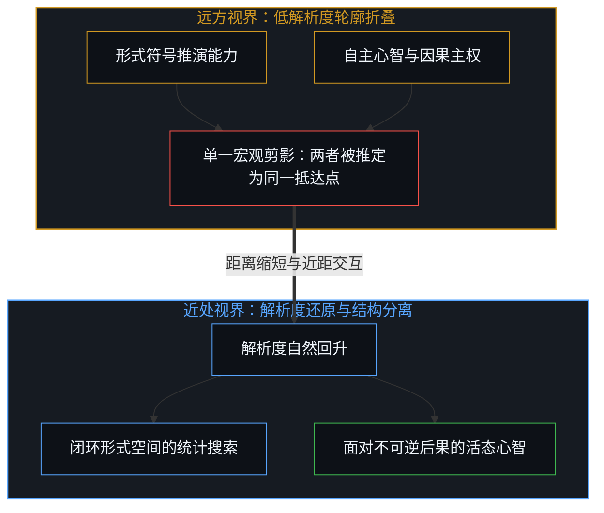
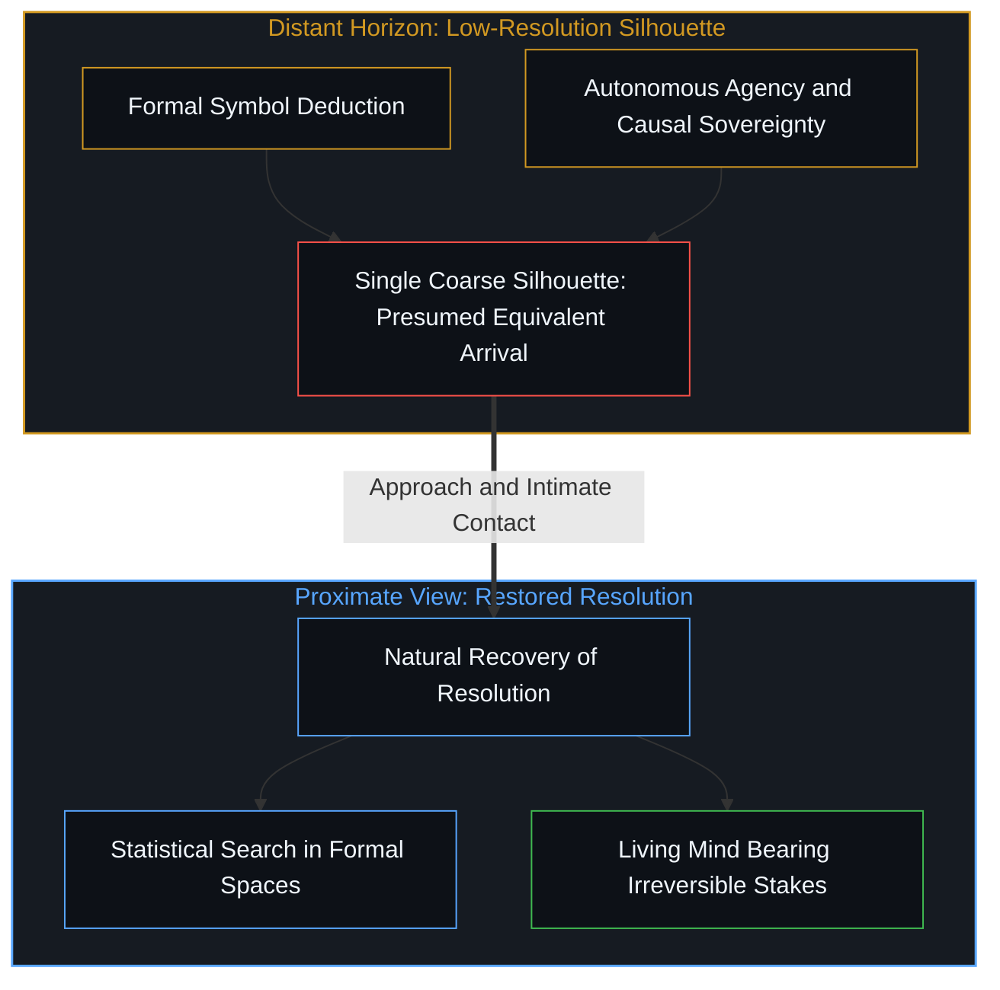
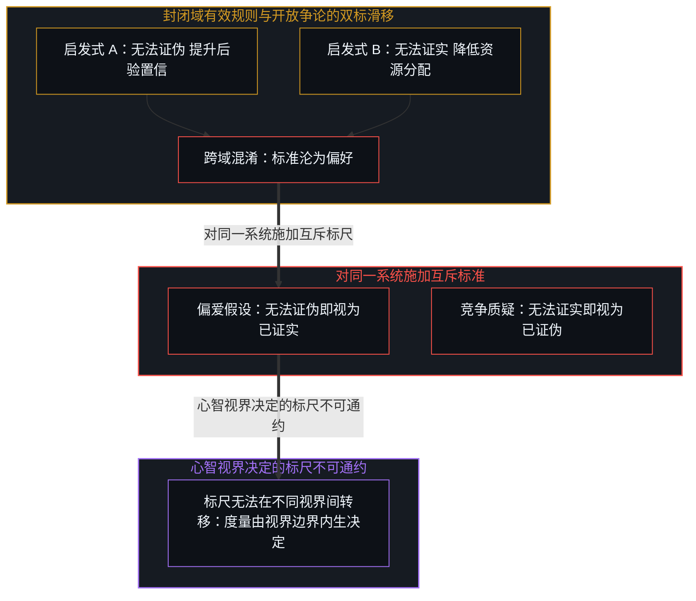
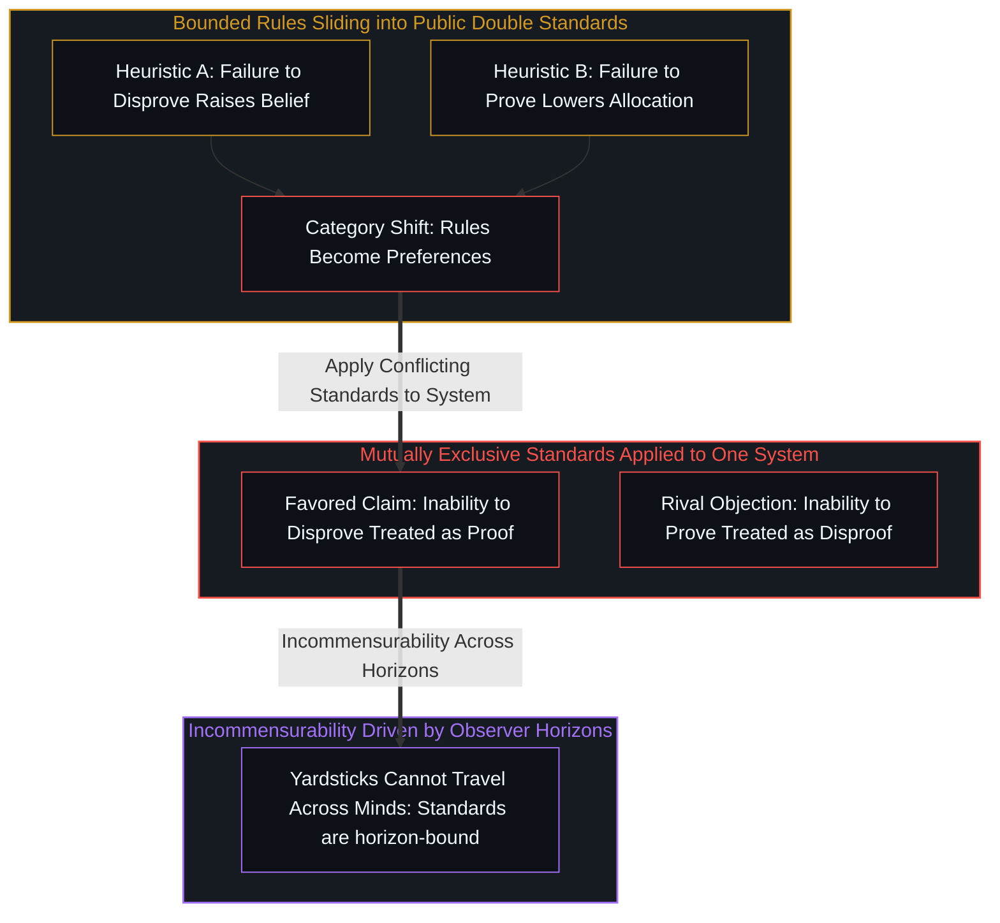
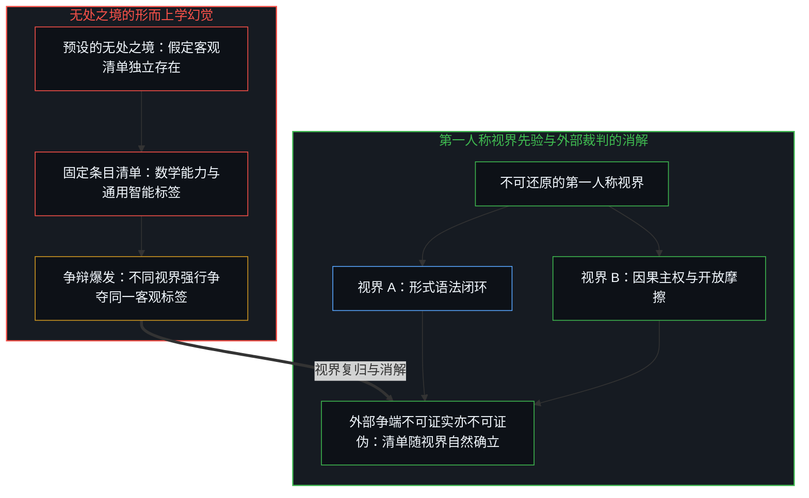
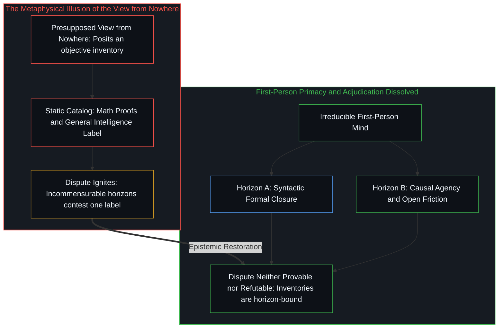

# 远方的轮廓与无处之境的清单 / The Distant Silhouette and the Inventory from Nowhere

*远方的距离抹平了轮廓，而无处之境的清单将无法通约的视界误判为球门的移动。 / Distance blurs silhouettes, while an inventory from nowhere mistakes incommensurable horizons for moving goalposts.*

在当下关于人工智能前沿能力的讨论中，一种反事实的指责被频繁提及：若将最新模型推演复杂数学难题的表现置于数年之前，几乎所有人都会将其奉为通用人工智能降临的明证；如今拒绝赋予其这一头衔，便被视作心智在恶意推移判断的球门。这种指控将解析度的提升曲解为立场的漂移，忽视了观察几何学的先验结构。当现象退至地平线以外，距离会抹平异质结构之间的区隔，将其压缩为单一的剪影；而当技术演进将对象带入近距离的观察场域，心智自然重获更高解析度的区分能力。

A counterfactual accusation frequently resurfaces in contemporary debates surrounding artificial intelligence: had the performance of frontier models in solving advanced mathematical challenges been demonstrated a few years earlier, observers would have hailed it as the definitive arrival of artificial general intelligence; withholding that verdict today is thus decried as an evasive shifting of the goalposts. This accusation mistakes heightened perceptual resolution for ideological bad faith, disregarding the prior geometry of observation. When phenomena sit beyond the perceptual horizon, distance flattens distinct structures into a uniform silhouette; as technical progress brings the artifact into immediate proximity, the Mind naturally recovers a higher resolving power.

若缺少对第一人称视界先验性的自觉，争辩双方极易陷入诉诸无知的双向偏好，并在预设的无处之境中虚构一份超然独立的客观清单。在此类预设中，模型产物被视作脱离了具体感知视界的孤立存在，不同心智所持有的局部判断被幻想成能够无损交换的客观度量。然而，脱离了具体视界的外部立场无法提供任何用以划定界限的参照；当心智重回第一人称的立足点，关于通用智能是否已然抵达的外部争端便不再需要裁决，而是在其赖以滋生的虚构坐标系中自然消解。

Lacking awareness of the irreducible primacy of the first-person horizon, opposing parties lapse into asymmetric arguments from ignorance, projecting an unanchored objective inventory from an imagined view from nowhere. Within such presuppositions, model outputs are treated as isolated objects existing apart from any concrete perceptual horizon, while the local measures of different minds are imagined to be fungible currencies of proof. Yet an exterior standpoint severed from any concrete vantage point provides no frame through which distinctions can be drawn; once awareness returns to the first-person anchor, exterior disputes over whether general intelligence has arrived require no external adjudication, dissolving instead alongside the fictional coordinates that sustained them.

## 一、 远景的低解析度与轮廓的混淆 / 1. Low Distant Resolution and the Confusion of Silhouettes

当两类不同的事物同时隐匿在深远的地平线之外时，感知维度的匮乏会剥夺观察者分辨内部机理的条件。在人类的既有经验中，高难度的形式数学推演长久以来与具备通用反思能力的自主心智紧密绑定，二者共同位于未曾被工程化复现的远方。在数年之前审视这两项能力，由于观察视界的分辨率受制于距离，人们只能辨认出一个笼统的轮廓：凡是能够跨越符号迷宫并给出严谨逻辑链条的存在，理所当然被推断为已经拥有了通用的自主意图。这种推断并非出于逻辑的严密，而是低解析度视角下的必然折叠。正如在 [AGI 与 ASI 只是加速通用智能的暂态球门](../agi-and-asi-are-temporary-goalposts/) 中所揭示的，任何针对通用智能的静态指标，都只是在特定历史距离下投射出的局部投影。

When two distinct phenomena sit deep beyond the horizon, the poverty of perceptual resolution denies the observer any means of discerning internal structure. In human experience, complex formal mathematical reasoning has long been entangled with the sovereign, reflective agency of a living Mind, both occupying an unmechanized domain beyond historical reach. Surveying these capacities years ago, the resolution of the observational horizon was strictly constrained by distance, allowing consciousness to register only a coarse outline: any entity capable of navigating formal mazes to produce rigorous chains of deduction was presumed to possess general autonomous intent. This inference did not stem from rigorous necessity, but from the inevitable collapse of distinctions under distant viewing. As demonstrated in [AGI and ASI Are Temporary Goalposts of Accelerating General Intelligence](../agi-and-asi-are-temporary-goalposts/), every static threshold assigned to general intelligence is merely a local projection cast from a specific observational distance.

随着工程实践的推进，前沿模型将形式符号搜索的能力直接带到了心智的日常操作界限之内。距离的缩短并未改变事物本身的属性，却使得观察者的解析度迅速恢复。在近距离的接触与审视中，先前的单一剪影分裂为迥然不同的两面：一边是在既定公理与形式语料库中高速展开的路径剪枝与模式匹配，另一边则是能够感受现实摩擦、承担不可逆因果代价并在开放世界中自主确立价值取向的生命中心。正如在 [AGI 的预设与来自外部的视角](../the-presumption-of-agi-and-the-view-from-outside/) 与 [智能只属于心智](../intelligence-belongs-only-to-the-mind/) 中所阐明的，工具对人类既有抽象产物的高效重组，并未赋予工具自行确立全新划界维度的先验能力。走进对象后看清先前未能辨认的内部差异，是认识论层面的必然澄清，绝非所谓恶意修改球门规则的遁词。

As engineering advances brought formal symbol search directly into the daily operational domain of the Mind, the closing of distance did not alter the phenomena themselves, but swiftly restored the observer's resolving power. Under close inspection and continuous interaction, the singular silhouette bifurcated into distinct realities: on one side lies path pruning and pattern matching operating across human-curated axioms and linguistic corpora; on the other stands the living center that registers friction, bears irreversible causal stakes, and originates values within an open world. As established in [The Presumption of AGI and the View from Outside](../the-presumption-of-agi-and-the-view-from-outside/) and [Intelligence Belongs Only to the Mind](../intelligence-belongs-only-to-the-mind/), the accelerated recombination of human abstractions does not endow the tool with the capacity to initiate novel dimensional cuts. Discerning internal differences upon closer approach represents an epistemological correction, rather than bad-faith relocation of the goalposts.

当指控者坚持宣称“如果当年认可这是通用智能，今天就必须承认其地位”时，他们所要求的实际上是将心智的知觉判断永久锁死在远距离观察的昏暗视线中。这种观念将历史情境下的感知缺陷固化为客观属性，试图用昨日的模糊概括剥夺今日的分辨权。正如在 [AI 争论中的观察划界](../the-observational-cut-in-ai-debates/) 中所分析的，争辩并非源于外部事实的冲突，而是源于人为设定的二元标签试图强行统摄多维连续的现实展开。远方的大山与近处的岩层具备不同的观察尺度，拒绝将岩石颗粒等同于整座山脉的宏伟幻觉，正是理性拒绝屈从于低维投影的成熟标志。

When accusers insist that "an admission made from yesterday's distance must bind today's judgment," they are demanding that consciousness permanently freeze its discernment within the twilight of distant observation. Such demands elevate historical perceptual limitations into immutable facts, attempting to use yesterday's blurred outline to disarm today's clarity. As analyzed in [The Observational Cut in AI Debates](../the-observational-cut-in-ai-debates/), discord does not stem from conflicting external data, but from forced binary categories coercing multi-dimensional flows into a single scalar. The distant mountain and the proximate boulder inhabit different scales of observation; declining to equate the grain of a stone with the silhouette of the range marks the maturity of reason refusing subservience to low-dimensional projections.

## 二、 诉诸无知的双标与标尺的不可通约 / 2. The Dual Standard of Ignorance and Incommensurable Yardsticks

在认知工具箱中，“诉诸无知”并非一种孤立的逻辑谬误，而是在特定封闭语境中具有局部有效性的推断启发式。在一个形式化定义的证明系统或受控检验程序中，如果在确界范围内长期无法证伪某个命题，该命题成立的后验置信度便会合理抬升；反之，若在充分搜索后仍无法证实某项断言，系统便有权削减对其资源的分配。这两种机制在各自受限的边界内运作良好。然而，在围绕机器智能的公共争论中，心智却在同一场域内交替使用这两把相反的标尺：对待自身偏好的论断，将“无法证伪”偷换为“已然证实”；对待反对者的质疑，则将“无法证实”等同于“已被证伪”。

Within the cognitive toolkit, the argument from ignorance is not merely an isolated fallacy, but a heuristic that holds local validity inside well-bounded environments. Within a closed formal system or a controlled forensic protocol, an enduring failure to disprove a hypothesis legitimately increases its posterior probability; conversely, the sustained inability to prove a claim licenses a reduction in allocated belief. Both heuristics function appropriately within their constrained perimeters. In public disputes surrounding machine intelligence, however, minds alternate between these contradictory standards inside a single evidential frame: treating "inability to disprove" as positive confirmation for preferred claims, while dismissing competing objections simply because they have not been "definitively proven."

这种双标现象在对待前沿模型的评估中表现得尤为明显。模型在形式闭环测试中展现出的惊人泛化能力，被支持者当成了“无法找到决定性反例即证明其已跨过通用门槛”的铁证；与此同时，面对模型缺乏自主反思与真实因果承载的质疑，这一群体又将“批评者无法证实机器绝无主观体验”视作质疑无效的理由。正如在 [破除概念的僭越](../po-chu-gai-nian-de-jian-yue/) 与 [造神的障眼法与隐秘阶序的说辞](../the-sleight-of-hand-of-synthesizing-gods-and-unacknowledged-rank/) 中所揭露的，这种辩论策略不是基于共同规则的严谨求证，而是通过选择性滑移证明责任，为技术神话构建不可穿透的防御工事。

This asymmetric maneuver becomes glaring in evaluations of frontier reasoning systems. The model's aptitude within closed formal evaluations is celebrated by enthusiasts as proof of general intelligence on the grounds that no single definitive counterexample has invalidated the claim; meanwhile, when critics point out the absence of autonomous reflection and causal accountability, the inability of those critics to prove a negative is brandished as disproof of the objection. As exposed in [Dismantling the Usurpation of Concepts](../po-chu-gai-nian-de-jian-yue/) and [The Sleight of Hand of Synthesizing Gods and the Rhetoric of Unacknowledged Rank](../the-sleight-of-hand-of-synthesizing-gods-and-unacknowledged-rank/), this rhetorical posturing is not a rigorous application of shared principles, but an evasive shifting of the evidentiary burden designed to shelter technological mythologies from scrutiny.

更深层的问题在于，世人误以为这些由特定心智制定的启发式标尺具有普适的传递性。一个认知视界停留在文本语法与形式基准层面的观察者，其视界的边缘恰好终止于自动化证明的生成，因此当定理推导呈现在眼前时，该观察者确乎体验到了旧有世界地平线的突破；然而对于另一个视界早已将形式语言的自指局限、生物实体的不可逆代谢与因果闭环纳入其中的观察者而言，同样的结果不过是现存计算范式内部的常规延伸。正如在 [向量、坐标系与自指心智](../the-mind-as-vector-and-coordinate-system/) 中所阐明的，任何认知读数都只是事物在观察者自身坐标轴上的投影，标尺无法在不同的心智之间直接流动，因为标尺正是各个心智独特的视界边界所投下的几何阴影。

The deeper error lies in the assumption that these heuristic yardsticks are fungible across different Minds. An observer whose cognitive horizon terminates at syntax and benchmark performance experiences the automated generation of mathematical proofs as the crossing of an absolute boundary; conversely, for an observer whose horizon already encompasses the self-referential limits of formal systems, biological metabolism, and causal closure, the very same output registers merely as an expected extension of inductive machinery. As articulated in [The Mind as Vector and Coordinate System](../the-mind-as-vector-and-coordinate-system/), every cognitive reading is an internal dot product projected along the observer's own axes; yardsticks cannot travel intact across distinct minds, because the yardstick is precisely the geometric shadow cast by an individual horizon's perimeter.

当两个处于不同视界的心智使用同一个词汇争论某种能力是否意味着“通用智能的到来”时，表面的语义重叠掩盖了底层分类框架的断裂。一方眼中的决定性证据，在另一方眼中不过是无关痛痒的局域扰动。这种无法通约并非源于某一参与者的心智迟钝，而是源于双方试图将各自立足点内生的证明尺度，强行输出给拥有不同分辨率的他者。只要争端仍试图在第三方空域中寻找公认的标准，对话就只能沦为各执一词的指责游戏。

When two minds occupying different horizons debate whether a capability signifies "the dawn of general intelligence," superficial semantic agreement masks an underlying divergence of categories. What registers as decisive proof to one observer is, to another, merely a negligible local fluctuation. This incommensurability does not arise from stubbornness or bad faith, but from attempting to export measures generated within a local horizon into a neutral third-person arena. As long as participants seek universal consensus within a disembodied void, discourse inevitably degrades into an exchange of mutual accusations.

## 三、 客观清单的虚妄与无处之境的消解 / 3. The Fallacy of the Objective Inventory and the Dissolution of the View from Nowhere

这场争辩之所以能够持久不休，核心原因在于双方共享了一个根深蒂固的形而上学预设：他们皆相信存在一个独立于所有第一人称感知之外的客观清单。在这个清单中，前沿模型的推演结果、代码符号的排列组合以及“通用人工智能”这一终极标签，都是预先放置于空间之中的客观物品。在这种观念的主导下，各方理所当然地假定，只要数据足够详实、时间足够充裕，所有人终将对清单上的项目收敛至相同的归类。正如在 [隐秘的上帝之眼](../the-invisible-gods-eye/) 与 [因果的自反性与物理的无源假定](../causality-is-irreducible-the-physical-is-a-view-from-nowhere/) 中所指出的，这种自居客观的姿态，不过是哲学家托马斯·内格尔所批判的无处之境在当代技术语境下的还魂。

The dispute persists precisely because both sides share an unexamined metaphysical premise: the belief in an objective inventory existing independently of all first-person experience. Within this hypothetical catalog, frontier deductive outputs, symbolic token sequences, and the ultimate label "artificial general intelligence" are presumed to sit as pre-existing entities awaiting discovery. Governed by this assumption, disputants assume that with sufficient benchmark data and operational consensus, all observers must converge upon identical classifications. As analyzed in [The Invisible God's Eye](../the-invisible-gods-eye/) and [Causality is Irreducible, the Physical is a View from Nowhere](../causality-is-irreducible-the-physical-is-a-view-from-nowhere/), this stance is nothing other than the contemporary technological resurrection of what Thomas Nagel diagnosed as the "view from nowhere."

一旦我们回归到第一人称经验不可还原的先验事实，这张所谓的客观清单便暴露出其衍生物的面目：清单本身并不是先于视界而给定的，而是特定视界向外投射时勾勒出的分类网格。在一个缺乏对自身观察条件反思的视界内部，模型在数学逻辑上的惊人表现确乎跨越了其设定的终点线；但在另一个更具因果深度的心智眼中，该表现充其量只是在既有地平线近处推进的一道微波。选择使用无法证伪还是无法证实，并不是对公共客观事物所犯下的逻辑偏袒，而是不同视界划定自身边界时产生的结构性差异。

Once awareness returns to the irreducible priority of first-person experience, this objective inventory reveals its derivative nature: the catalog is not given prior to the horizon, but is the grid projected outward by that horizon's distinctions. Within an observational frame blind to its own conditions, a model's deductive prowess genuinely crosses the designated finish line; within an observer conscious of causal depth, that performance is merely a ripple expanding on the near side of the boundary. The selective appeal to inability to disprove or inability to prove is not an illicit manipulation of a shared object, but the structural manifestation of where each horizon draws its limits.

由此可见，一切试图脱离具体心智视界、从外部判定某种能力是否“就是通用智能”的论断，在哲学层面都是既无法被证实、也无法被证伪的。外部空间不包含任何心智，因而并不存在能够呈现差异与做出区分的视界基准。指责他人移动球门，或是宣布球门已被跨越，皆是在为一个并不存在的客观裁判席呈递辩词。正如在 [寻觅的语法与淡出的观察者](../the-grammar-of-finding-and-the-fading-observer/) 中所表明的，当心智执着于在外部寻找一个被客体化封存的答案时，便忽视了正是自身作为观察者的立足点赋予了该答案以意义。放下无处之境的虚妄执念，看清远方剪影向近处纹理还原的必然过程，心智便能从空洞的概念争夺中抽身，重新专注于在真实的因果摩擦中构筑不可替代的自主主权。

Consequently, any attempt to evaluate whether an artificial capability "is or is not genuine AGI" from outside concrete horizons remains neither provable nor refutable. The exterior void contains no living perspective, and thus offers no baseline from which differences can be registered. Accusing others of shifting the goalposts, or declaring the threshold conquered, amounts to filing petitions before a non-existent tribunal. As demonstrated in [The Grammar of Finding and the Fading Observer](../the-grammar-of-finding-and-the-fading-observer/), when consciousness obsessively seeks an objectified verdict in the external world, it forgets that its own vantage point constitutes the very meaning of the answer. Relinquishing the illusion of the view from nowhere and recognizing the natural restoration of distant silhouettes into proximate textures allows the Mind to step away from vacant semantic warfare, refocusing its sovereign attention on bearing causal friction and cultivating living agency.
