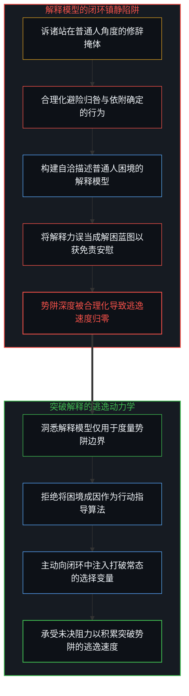
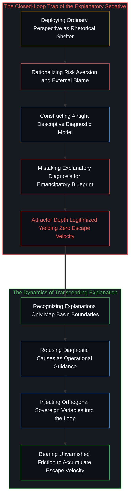
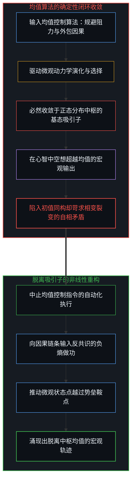
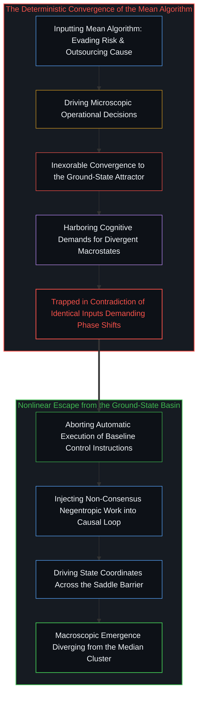
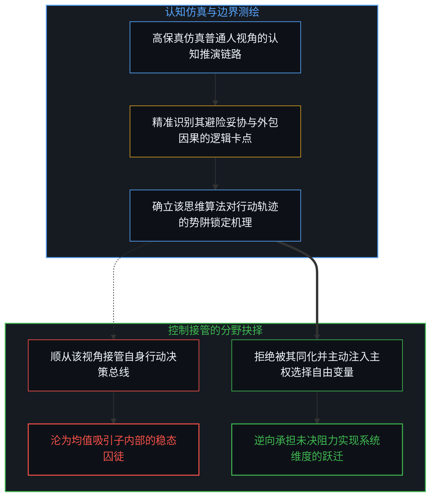
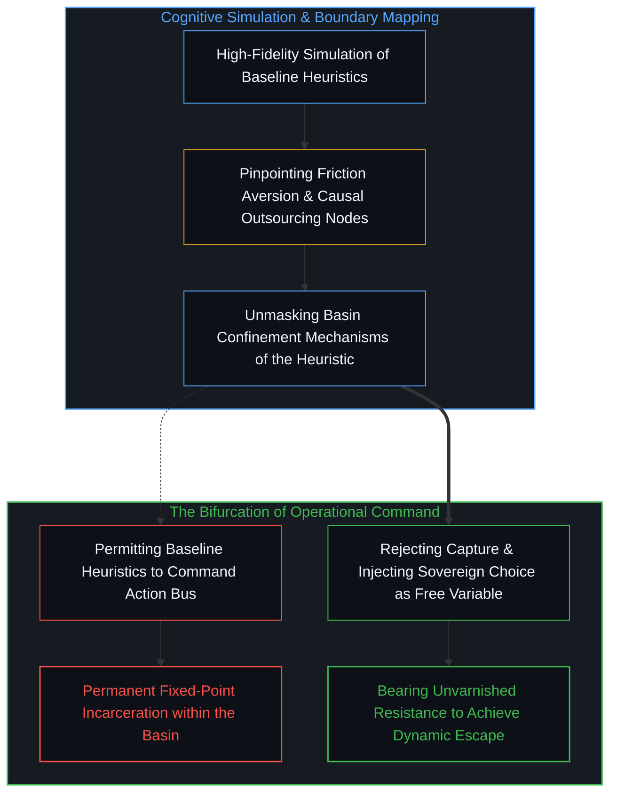
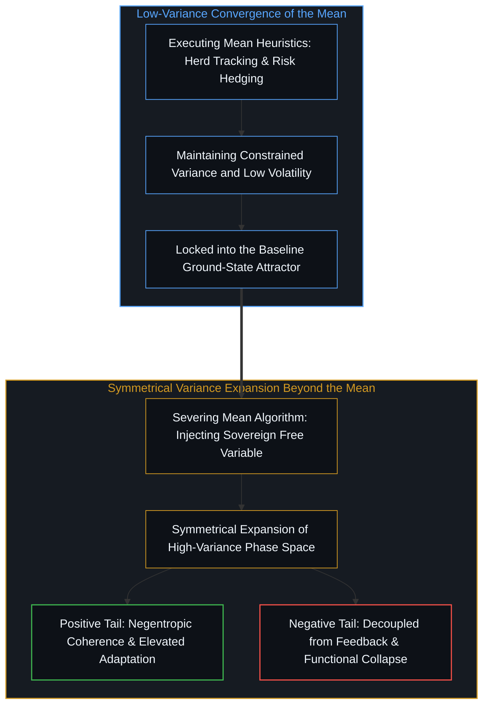
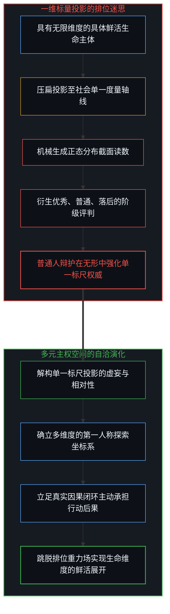
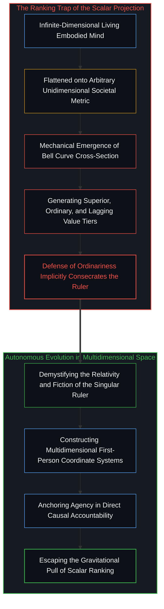

# “普通人视角”的解释陷阱 / The Explanatory Trap of the "Ordinary Perspective"

*解释力与逃逸速度的不对称、均值吸引子闭环与标量投影破魅 / The Asymmetry of Explanatory Power and Escape Velocity, the Mean Attractor, and the Scalar Projection*

在大众讨论与舆论辩护中，“我们要站在普通人的角度去想一想”常被当作一张不容置疑的免责金牌与道德掩体。随之而来的回答，几乎无一例外地急于先去正当化、合理化所谓普通人的权衡与退缩。然而，这种修辞在因果律上构成了严重的倒置：承认一种视角的客观存在，并不等于将其奉为指导行动的有效算法。站在普通人的视角推演，固然可以近乎无懈可击地解释普通人为何滞留于既有定位，因为在规避未知阻力、将因果推脱给外部环境、依赖现成规则与索求无风险确定的闭环中，每一个微观退缩都显得自洽而合理；但这套能够清晰诊断势阱深度的解释模型，自身却蕴含着零逃逸速度，无法帮助人跨越势阱。普通人之所以受困于既有定位，恰恰是因为他们在行动中死守着产生普通结果的均值算法，却在欲望中空想非均值的异象。这构成了控制论层面的内在矛盾：在恒定的动力学方程中代入相同的初值，却妄图收获全新的演化相图。真正具有洞察力的主权心智，既能够站在普通人的视角看清其因果闭环的停滞机理，更清醒地拒绝让自身的控制算法被该视角接管。卓越之所以展现出与众不同，源于其能够主动向系统中注入第一人称选择这一自由变量；然而，脱离均值吸引子所展开的首先是方差的双向张开——它既可能在与现实负熵的咬合中涌现为高阶适应性，也可能在脱缰的失序中跌入偏执与崩溃。更为关键的解构在于，所谓卓越、普通或落后，从来不是生命内在固有的超验等级，而仅仅是将无限维度的具身生命压扁至单一指标轴上的标量投影。看破单一标尺的虚妄，并在多维现实中以第一人称承担行动后果，才是打破均值重力场的主权觉醒。

In public discourse and defensive rhetoric, the appeal to look at things from the perspective of the ordinary person functions as an unassailable moral alibi. The responses that follow almost invariably rush to rationalize and legitimize the caution, compromises, and externalized grievances of that baseline observer. Yet this rhetorical maneuver enacts a catastrophic causal inversion: acknowledging the objective existence of a perspective does not qualify it as an operational algorithm for action. Thinking from the ordinary viewpoint can almost perfectly explain why ordinary people remain ordinary, because within that closed loop—avoiding discomfort, outsourcing causality, following herd heuristics, and demanding risk-free certainty—every microscopic hesitation appears entirely self-consistent. However, an explanatory model that diagnoses the geometry of an attractor basin possesses zero escape velocity; it cannot liberate an agent from the basin it describes. Ordinary observers remain trapped in their station precisely because they stubbornly execute the baseline algorithm while harboring expectations of non-ordinary macroscopic emergence. This manifests an irreconcilable cybernetic contradiction: feeding identical control inputs into a deterministic dynamic while demanding divergent systemic phase states. Exceptional agency does not simply reject empathy; it precisely simulates the ordinary causal loop, recognizing that to let those heuristics govern operational choice is to ensure permanent gravitational capture. True divergence requires the active injection of a free variable—sovereign choice—into the system. Yet transcending the mean expands variance symmetrically, opening toward high-order adaptive coherence or, if decoupled from feedback, toward pathological unraveling. Crucially, designations of superior, ordinary, or lagging are never intrinsic ontological tiers; they are mere scalar projections of infinite-dimensional embodied aliveness flattened onto an arbitrary societal coordinate axis. Sovereign freedom lies in demystifying this single line, transcending the baseline attractor, and anchoring causality firmly within first-person responsibility.

## 话语倒置与共情镇静剂：解释力与逃逸速度的终极不对称 / The Rhetorical Inversion and the Empathy Sedative: The Ultimate Asymmetry Between Explanatory Power and Escape Velocity

在日常公共讨论或认知辩论中，“站在普通人的角度去想”频繁地被当作终结争论的杀手锏。当有人提出必须跳出路径依赖、在硬核因果中承担第一人称责任时，反驳者常态上迅速搬出这句箴言，随后便展开对普通人现状的合理化辩解：普通人资源匮乏，面临生活的沉重重压，因此选择避险、放弃长期探索、将停滞的因果推脱给社会环境，不仅是合情合理的，甚至是唯一理智的抉择。这种回应看似充满了现实主义的慈悲与温度，实则在认识论层面偷换了概念。它将经验层面的现实存在性，直接倒置为行动层面的有效性指导；把对现状成因的静态剖析，当成了继续受困于现状的合法许可证。

正如我们在[规程的倒置与因果回路的消声](../the-inversion-of-the-protocol-and-the-silencing-of-the-causal-loop/)与[契约的因果倒置](../the-causal-inversion-of-partnership/)中所剖析的，这种辩护机制构成了一种典型的认知镇静剂。站在普通人的角度去推演，确实可以近乎无懈可击地解释为什么普通人会成为普通人。在普通人的微观视野内，选择眼前的确定性以避免未知的试错痛苦，把挫败归因于外界的不公以换取心理上的无罪感，遵循大众的共识以降低遭受孤立的社交风险——每一步推演在局域层面上都严丝合缝、高度自洽。然而，这一完备的解释力恰恰构成了残酷的认识论陷阱：一套精密描述牢笼几何结构的方程，其内部并不包含打破牢笼的炸药。将对困境的解释误当作解困的蓝图，结果只能是用同情为镣铐镀金，让受困者在“被充分理解”的温水里更加安心地放弃主权。

In everyday public discourse, appealing to the perspective of the ordinary person is routinely deployed as an unassailable trump card. Whenever someone argues that an agent must break path dependency and bear first-person accountability within hard causal constraints, critics swiftly recite this maxim. What follows is a flurry of rationalizations: the ordinary individual lacks capital, shoulders overwhelming burdens, and is therefore justified in hedging against risk, aborting long-term exploration, and blaming systemic forces for personal paralysis. Such rhetoric wraps itself in the mantle of compassionate realism, yet perpetrates a subtle epistemological substitution. It converts descriptive empirical reality into normative operational guidance, treating a post-mortem diagnosis of stagnation as an authorized license for continued inertia.

As demonstrated in [The Inversion of the Protocol and the Silencing of the Causal Loop](../the-inversion-of-the-protocol-and-the-silencing-of-the-causal-loop/) and [The Causal Inversion of Partnership](../the-causal-inversion-of-partnership/), this defensive maneuver operates as a cognitive sedative. Reasoning strictly from within the ordinary agent's horizons produces an airtight explanation for why they remain confined to their status. At every microscopic crossroad, choosing immediate security over the friction of experimentation, externalizing failure to preserve subjective innocence, and conforming to herd consensus to minimize isolation is locally optimal and self-consistent. Yet this explanatory completeness masks a fatal snare: the mathematical equations charting the contours of a cage do not contain the explosive force required to rupture its bars. Conflating the explanation of an impasse with an emancipatory blueprint merely gilds the chains with empathy, lulling the captive into a comfortable abdication of agency.

## 均值吸引子与输入输出的确定性同构：死守算法与妄求异象的自相矛盾 / The Mean Attractor and Deterministic Isomorphism: The Self-Contradiction of Clinging to the Algorithm While Demanding Divergent Outcomes

在系统动力学与控制论的模型中，所谓“普通人”对应的是相空间中最宽阔、势能最低的均值吸引子。在统计分布的钟形曲线上，这正是绝大多数样本必然沉降的中枢地带。均值算法的形成绝非偶然，它是一套经过亿万次微观博弈筛选出的自稳定生存机制：跟随大众的步伐可以借由群体的体量分摊惩罚，将因果外包给制度与环境可以免去直面自身无能的撕裂感，在既定的既有航道上随波逐流可以最大限度地降低即时能量消耗。这套算法赋予了机体一种低烈度的安全幻象，使人在不承受剧烈震荡的前提下维持基准生存。

然而，这里的荒谬性在于一种无法弥合的因果分裂：处于普通人定位的主体，常态下一边狂热地坚守着这套均值算法，一边却在心智中渴求着脱离普通人的非均值结果。正如我们在[确定性是微观不确定性的统计签名](../determinism-is-the-statistical-signature-of-micro-indeterminism/)与[个体抉择作为唯一的因果杠杆](../individual-choices-as-the-only-causal-levers/)中所确立的，宏观层面的演化形态严格由微观控制输入的积分决定。系统的输入与输出之间存在着坚硬的确定性同构：你如果在每一个选择的分叉口，都本能地调用追求舒适、规避阻力、推卸责任、迎合共识的均值算法，那么无论你在纸面上制定多么宏大的愿景，系统的动力学轨迹就必然收敛至该算法对应的唯一不动点。普通人之所以普通，从源头上正是因为他们用生产普通的控制程序，妄想编译出超常的生命输出。

In the models of system dynamics and cybernetics, what culture brands as the ordinary agent corresponds to the broadest, lowest-energy basin of attraction in phase space. Along the bell curve of statistical distribution, this represents the central ground state where the overwhelming majority of samples settle. The mean algorithm is not an arbitrary accident; it is an evolutionarily optimized heuristic for baseline self-preservation. Walking with the herd amortizes systemic penalties across the collective mass, outsourcing causality to external institutions cushions the ego against raw inadequacy, and drifting along established cultural grooves minimizes immediate thermodynamic expenditure. This algorithm delivers a mild anesthetic of security, ensuring survival without exposure to violent volatility.

The absurdity surfaces in a profound causal rupture: agents positioned within the mean stubbornly cling to this baseline algorithm while feverishly yearning for non-ordinary macroscopic emergence. As established in [Determinism is the Statistical Signature of Micro-Indeterminism](../determinism-is-the-statistical-signature-of-micro-indeterminism/) and [Individual Choices as the Only Causal Levers](../individual-choices-as-the-only-causal-levers/), the macrostate of any complex system is strictly the integrated sum of its microscopic control inputs. There exists a rigid deterministic isomorphism between systemic inputs and outputs: if an observer continuously deploys the mean algorithm—minimizing friction, evading accountability, and conforming to baseline expectations—the trajectory must mathematically terminate at the fixed-point attractor of ordinariness. Ordinary observers remain ordinary because they persist in executing the baseline program while demanding a divergent compile.

## 认知仿真与控制接管的分野：跳出均值的自由变量注入 / The Chasm Between Cognitive Empathy and Operational Control: Injecting the Free Variable to Transcend the Mean

指出普通人视角的局限，并不代表主权心智应当高高在上地拒绝理解普通人。事实恰恰走向了反面：一个具备高度因果自觉的观察者，能够充分游刃有余地进入普通人的视界，以极高的保真度去仿真其认知流。他能看清普通人在面对未知时的战栗，能理解其对于现成答案的渴望，更能精准推算出其在每一处障碍前会如何选择妥协。认知层面的仿真模拟，是看清系统环境与阻力拓扑的必要能力。

然而，决定命运走向的分水岭，在于**你是将这种视角作为诊断对象的边界来测绘，还是让其接管你自身的控制总线**。正因为我们可以站在普通人的角度去想，看清了按照那套思维方式做决定的每一步逻辑闭环，我们才以无可辩驳的确信得出推论：一旦你顺从这套逻辑去指导自身的具身行动，你就永无可能跳出普通人的定位。正如在[主权抉择的双面性与观察的客体化](../the-two-sided-nature-of-sovereign-choice-and-the-objectification-of-observation/)与[抉择本身并不沉重](../choice-itself-has-no-inherent-weight/)中所揭示的，真正的超越从来不是在均值算法内部做修修补补的微调，而是主动向系统中注入第一人称选择这一唯一的自由变量。当闭环的因果网络在催促你避险、抱怨与从众时，唯有以清醒的主权意志执行反常态的阻力做功，方能为系统提供脱离吸引子的逃逸动能。

Demonstrating the limitations of the ordinary perspective does not imply that an autonomous mind should superciliously refuse to comprehend it. The reality is precisely the opposite: an observer possessing rigorous causal awareness can enter the horizon of the ordinary agent, emulating its perceptual streams with clinical fidelity. Such an observer perceives the visceral dread evoked by uncertainty, grasps the seduction of prefabricated certainties, and accurately predicts where and why the baseline mind will compromise. High-fidelity simulation of the environment is indispensable for mapping systemic friction.

The watershed lies in whether one deploys this perspective as an object of diagnosis or permits it to seize operational command of one's own control bus. It is precisely because one can simulate the ordinary person's perspective—tracing the deterministic dead ends embedded in its heuristics—that one arrives at the unyielding realization: if you adopt these heuristics to govern your own embodied actions, you will never transcend the station of the mean. As demonstrated in [The Two-Sided Nature of Sovereign Choice and the Objectification of Observation](../the-two-sided-nature-of-sovereign-choice-and-the-objectification-of-observation/) and [Choice Itself Has No Inherent Weight](../choice-itself-has-no-inherent-weight/), genuine transcendence is never achieved through incremental adjustments within the baseline algorithm. It demands the active injection of a free variable: sovereign first-person choice. When the closed deterministic network clamors for retreat, external blame, and herd safety, only sovereign counter-inertia provides the escape velocity needed to rupture the basin.

## 与众不同的对称分叉：脱离均值后的方差展开与风险承受 / The Symmetrical Bifurcation of Divergence: Variance Expansion and the Reality of Risk Beyond the Mean

卓越之人之所以被赋予卓越的标签，其基底机制恰恰在于他们打破了均值吸引子的闭环：他们要么具备双重视角，在深谙普通人思维机制的同时拒绝受其羁绊；要么从初始设定上便运行着与常态正交的认知先验，自始便不在均值的轨道上运行。然而，大众在仰望卓越时，频频陷入了一种选择性失明的神话建构：他们误以为脱离均值是一场单向通往荣耀与高阶效能的确定性飞跃。

从统计物理与分布拓扑审视，脱离均值首先带来的从来不是等级的攀升，而是**方差的对称放大**。与众不同是一个中性的动力学张开：它在打破了低风险低回报的均值锁定之后，使系统具备了向两个截然相反的方向延伸的相空间潜能。向正向延展的分支，在与现实的持续负熵交互与因果闭环校准中，涌现出极高阶的创造力、韧性与认知穿透力，被外界评价体系冠以“优秀”的冠冕；但对称存在的负向分支，若在脱离均值的同时失去了对现实阻力的有效咬合，则会迅速坠入偏执、认知妄想、社会性功能失调乃至自我毁灭，沦为常人眼中的异端或落后者。正如在[教育与科学的倒置](../the-reversal-of-education-and-science/)与[约束即地面：个体作为平台](../constraints_are_ground/)中所揭示的，方差的展开意味着安全网的净空撤除。卓越与深渊在拓扑结构上共享着同一个前提——它们都以放弃均值算法的庇护为代价。贪恋卓越的光环却拒绝承担方差向另一侧敞开的剧烈风险，依然是均值心智在幻想层面的贪婪投影。

Those who earn the cultural label of exceptional achieve that status by shattering the mean attractor: they either possess dual sight—comprehending the baseline mind without being bounded by it—or operate upon cognitive priors orthogonal to social conventions from the outset. Yet public admiration of exceptionalism is steeped in selective blindness: it imagines that departing from the mean is a guaranteed, unidirectional ascent toward glory and elevated function.

Viewed through statistical physics and distribution topology, breaking away from the mean does not guarantee ascent; it **symmetrically amplifies variance**. Divergence is an ontologically neutral phase expansion: having severed the low-risk, low-return tether of the mean, the system expands into high-variance phase space with equal potential in opposite directions. The positive tail, anchored in rigorous negentropic interaction with reality, emerges as heightened resilience, profound creative agency, and systemic clarity—crowned by societal conventions as excellence. But the negative tail, equally unmoored from the median, can lose contact with empirical feedback and tumble into destructive delusion, severe functional paralysis, and erratic ruin. As demonstrated in [The Reversal of Education and Science](../the-reversal-of-education-and-science/) and [Constraints Are Ground: The Individual as Platform](../constraints_are_ground/), expanding variance strips away the protective floor. Excellence and catastrophic alienation share the identical topological precondition: both have abandoned the shelter of the mean algorithm. Craving the luminescence of the outlier while shrinking from the bidirectional abyss of variance is the ultimate fantasy of the baseline mind.

## 标量投影的破魅：单一维度的排位迷思与多元主权的立足 / Demystifying the Scalar Projection: The Myth of Single-Dimensional Rank and the Sovereignty of Multidimensional Aliveness

对“普通人”议题最具颠覆性的澄清，落脚于对衡量标准本身的解构。无论是大众语境中所推崇的优秀，还是作为防御借口的普通，抑或是遭到排斥的落后，它们在认识论上都不是生命主体内在固有的超验属性。这些标签无一例外，全都是将具有无限维度的具身生命，强行压缩至某根单一坐标轴之后所读取的标量投影。

现代社会结构为了实现标准化分发与控制，必然倾向于设立统一的标尺——不论是财富净值、技术头衔、考试分数还是对特定规范的服从度。正如我们在[坐标系、心智与自由度](../coordinate-systems-mind-and-degrees-of-freedom/)、[切分的几何学](../the-geometry-of-the-cut/)与[无法逃逸的心智视界](../one-cannot-escape-ones-own-mind/)中所揭示的，任何将高维心智压平至一维数轴的操作，都必然在数学上机械地生成一条正态分布曲线：中段被称为普通，两端被分别赋予优秀与落后的价值判断。热衷于在“普通人”标签下寻求豁免的人，看似在反抗精英主义的压迫，实则在潜意识中无条件承认了这根单一标尺的终极权威。真正的主权觉醒，不仅在于看清均值算法对行动力的死锁，更在于清醒看透这根标尺的相对性与虚构性。生命的主体性并不依赖于在他人设立的狭窄跑道上夺取顶端读数，更不必退居均值的温床进行自欺式的道德防御。唯有跳脱出一维标量的排位迷局，在真实未决的多维因果中确立自身的方向并自负后果，心智才能走出均值吸引子的重力场，展开鲜活而自洽的真实演化。

The most subversive clarification regarding the ordinary perspective strikes at the architecture of measurement itself. Whether it is the excellence lauded by the masses, the ordinariness claimed as an emotional shelter, or the backwardness discarded at the margins, none of these categories represent intrinsic metaphysical properties of living agents. They are without exception low-dimensional scalar projections generated when infinite-dimensional embodied aliveness is compressed onto an arbitrary societal coordinate axis.

To coordinate mass throughput and social administration, institutional systems inevitably erect standardized rulers—be it net worth, bureaucratic pedigree, standardized test metrics, or adherence to cultural protocols. As demonstrated in [Coordinate Systems, the Mind, and Degrees of Freedom](../coordinate-systems-mind-and-degrees-of-freedom/), [The Geometry of the Cut](../the-geometry-of-the-cut/), and [One Cannot Escape One's Own Mind](../one-cannot-escape-ones-own-mind/), flattening high-dimensional cognition onto a unidimensional line automatically generates a bell curve: the central mass is labeled ordinary, while the extremities are branded as exceptional or deficient. Those who retreat behind the ordinary banner imagine they are resisting elitist oppression, yet their defense implicitly consecrates the absolute authority of that borrowed ruler. Sovereign awakening requires not only recognizing how baseline algorithms paralyze agency, but demystifying the ruler itself. Authentic agency does not consist in frantic races to conquer the tail of an artificial axis, nor in curling up within the warm stagnation of the median. Transcending the mean means stepping beyond the game of scalar rank altogether, navigating open multidimensional phase space, and holding first-person responsibility for one's own trajectory.

