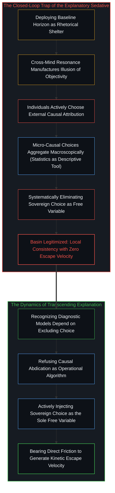
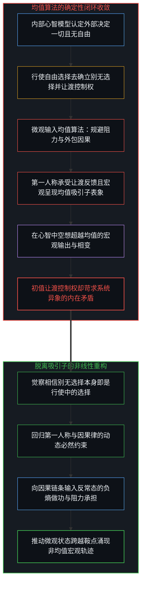
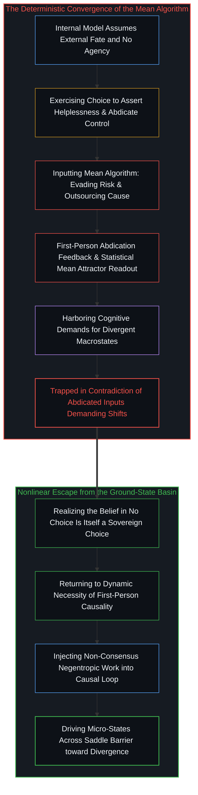
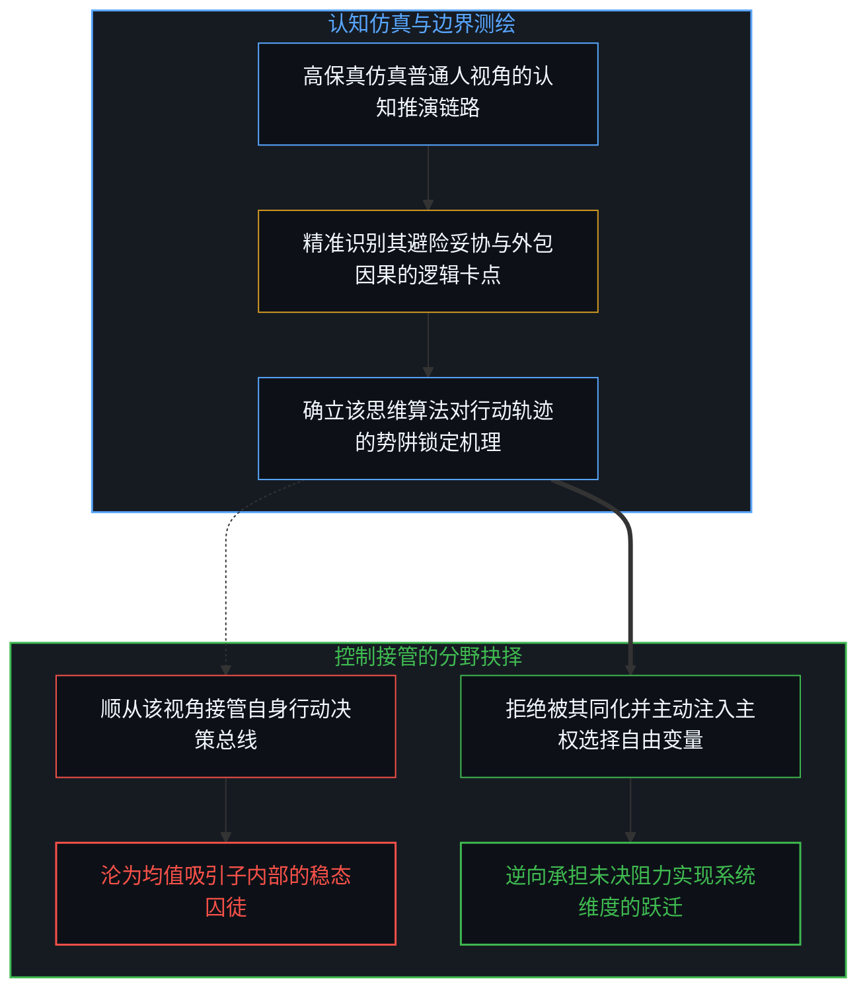
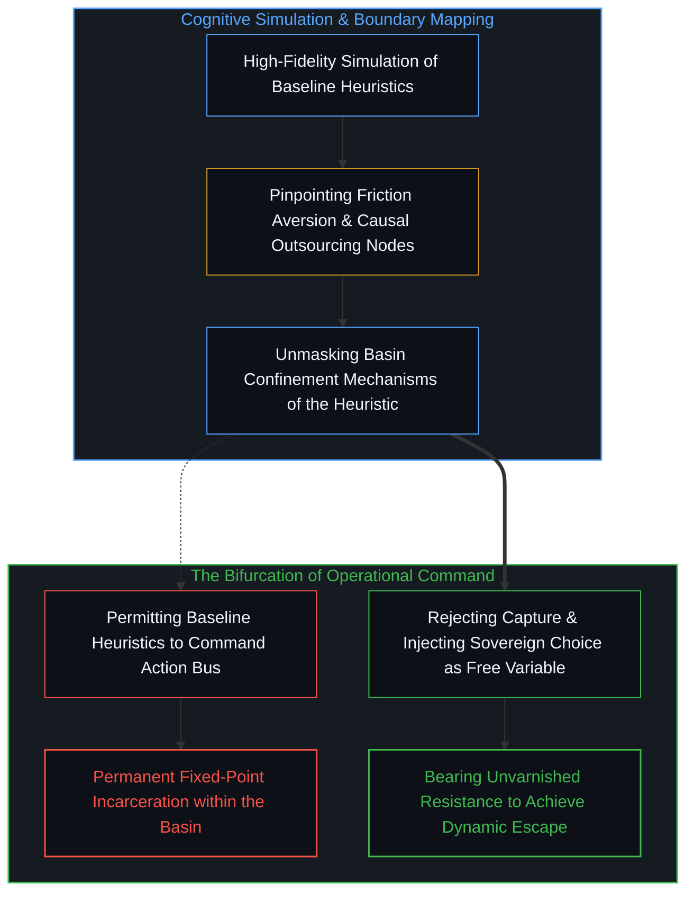
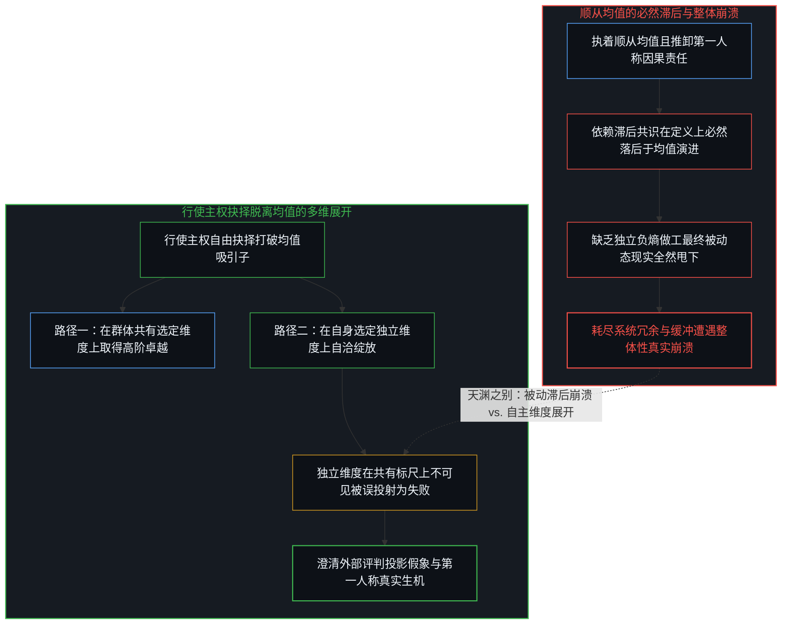
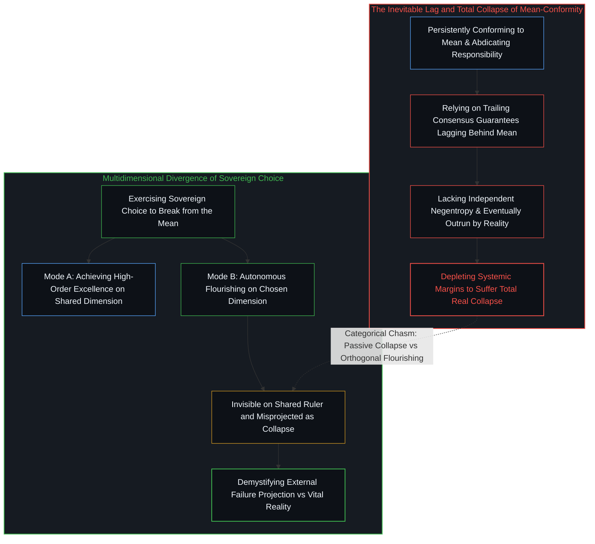
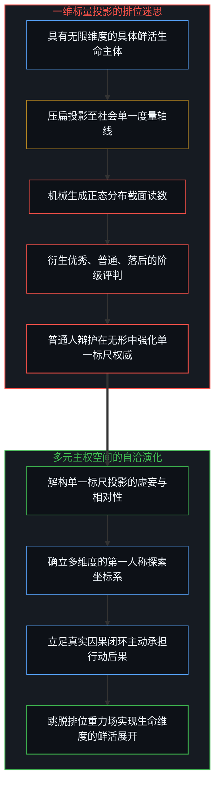
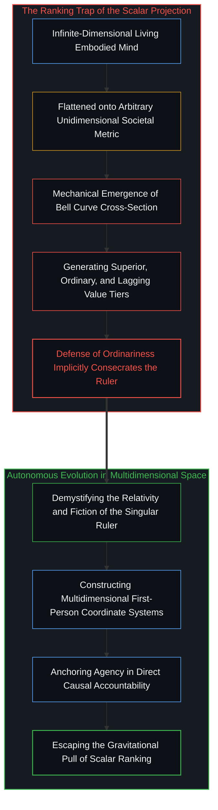

# “普通人视角”的解释陷阱 / The Explanatory Trap of the "Ordinary Perspective"

*解释力与逃逸速度的不对称、均值吸引子闭环与标量投影破魅 / The Asymmetry of Explanatory Power and Escape Velocity, the Mean Attractor, and the Scalar Projection*

在大众讨论与舆论辩护中，“我们要站在普通人的角度去想一想”常被当作一张不容置疑的免责金牌与道德掩体。提出这一观点的人，表面上是在呼吁体恤与共情，实则频频是在试图排挤和否定那些强调对自己行动结果负全责的主权心智。由于普通人的退缩与避险在群体中能够获得更广泛的共鸣，这种跨心智不变性的共识，便被赋予了一种近乎客观或合法的表象。然而，这种修辞在因果律上构成了严重的倒置：承认一种视角的客观存在，并不等于将其奉为指导行动的有效算法。站在普通人的视角推演，固然可以解释普通人为何滞留于既有定位，但这恰恰是主体对自己境况的误读——并不是外部环境与匮乏天然锁死了其命运，而是无数个体在微观因果中主动选择将困境外部归因，进而在宏观层面汇聚成群体停滞，而统计正是我们用来理解这一微观汇聚现象的认知工具。更深层的本体论误区，在于把物理定律、动力系统与统计模型隐涵为无需进一步解释的既定初始条件，而忽视了它们只是在特定条件下成立的分析工具；与之相对，作为同一枚硬币两面的因果律与第一人称视界，绝非静态的逻辑起点或单方面外加预设的理论公理，而是一切认知活动与理论先验必须存在的动态必然约束条件（necessity）。普通人视角看似严丝合缝的高度自洽，严格建立在系统性剔除个人自由抉择的前提之上；而个人的自由选择，恰恰是唯一能够改变自身发展轨迹的自由变量。普通人之所以受困于基态，其自设的致命陷阱正是认为自己没有选择的自由，殊不知“认定自己没有选择”本身就是一种行使中的自由选择。他们将本可用于开辟新路径的自由度，用来为原地踏步做辩护，在控制论层面构成了死守均值算法却空想超常异象的内在分裂。行使主权脱离均值，既可表现在共有维度上的卓越，更可展现在自主选定维度上的自洽，后者在共有标尺上虽常被误投射为失败，实则是生机的正交展开；而真正的整体性崩溃，恰恰讽刺地降临在执着顺从均值而必然滞后的被动心智身上。主权心智不仅能够高保真仿真普通人的认知闭环，更清醒地拒绝让自身的行动总线被其接管，并在多维相空间中看破单一指标轴的标量投影，以第一人称自负因果。

In public discourse and defensive rhetoric, the appeal to look at things from the perspective of the ordinary person functions as an unassailable moral alibi. Those who invoke this maxim appear to champion empathy, yet in practice they repeatedly attempt to suppress and delegitimize sovereign agents who demand first-person accountability for their own outcomes. Because baseline compromises and risk aversion command broad resonance across the multitude, this cross-mind invariance manufactures a seductive illusion of objectivity. Yet this rhetorical maneuver enacts a catastrophic causal inversion: acknowledging the descriptive presence of a perspective does not qualify it as an operational algorithm for action. Thinking from the ordinary horizon can explain why agents remain confined to their station, but this reflects a fundamental misreading of their own predicament: it is not that external material constraints independently manufactured their trap, but that individuals freely choose to externalize causality, aggregating at the macroscopic scale into a collective condition—which statistics merely serves as an epistemic tool to model and comprehend. At a deeper ontological level, we must never smuggle physical laws, dynamical systems, or statistical mechanics into discourse as unexamined initial conditions requiring no further explanation; they are strictly analytical tools holding valid only under specific boundary conditions. Concurrently, causality and the first-person perspective, as two inseparable sides of the identical coin, are neither a static starting point nor externally posited theoretical axioms, but a dynamic, necessary constraint (necessity)—the indispensable constitutive condition under which all cognition, empirical observation, and theoretical priors can exist in the first place. Crucially, the local airtightness of the ordinary perspective holds only by systematically eliminating personal free choice—the sole free variable capable of altering an agent's developmental trajectory. The ultimate trap of the baseline mind is choosing to believe that it possesses no freedom of choice, unaware that asserting one has no choice is itself a sovereign choice. By allocating their precious degree of freedom to cement inertia, ordinary agents execute the ground-state algorithm while demanding divergent systemic phase shifts. Crucially, exercising sovereign choice to break from the mean encompasses both achieving excellence on shared dimensions and flourishing along autonomous orthogonal dimensions—which, though often misprojected as failure on shared societal rulers, represents genuine negentropic aliveness. Ironically, actual systemic collapse strikes those who persistently try to conform to the mean, as trailing conformity by definition ensures lagging behind until one is outrun and collapses. Sovereign agency emulates this heuristic loop not to surrender to it, but to ensure its fatal self-imprisonment never commands the operational bus, demystifying the societal ruler and anchoring life in first-person responsibility.

## 话语倒置与共情镇静剂：解释力与逃逸速度的终极不对称 / The Rhetorical Inversion and the Empathy Sedative: The Ultimate Asymmetry Between Explanatory Power and Escape Velocity

在日常公共讨论或认知辩论中，“站在普通人的角度去想”频繁地被当作终结争论的杀手锏。其深层的修辞反讽在于，提出这一劝诫的人，表面上是在关照大众，实则频频是在试图排挤、消解那些主张对自己结果负全责的人所展现的独立思考。由于普通人的趋利避害与顺从常模能够唤起最广泛的情绪共振，这种跨心智的不变性便被轻易偷换为一种具有天然合法性甚至客观性的真理表象。随后展开的辩解便显得顺理成章：普通人资源匮乏，面临生活的沉重重压，因此选择避险、放弃长期探索、将停滞的因果推脱给社会环境，不仅合情合理，甚至是被环境逼迫下的必然产物。然而，这恰恰是普通人对自己境况最深层的误读。并不是他们所罗列的外部匮乏与制度阻力独立制造了他们的困境，而是他们主动选择了将困境进行外部归因；当成千上万的心智同时做出这种逃避责任的微观抉择时，便在宏观层面涌现出普通人普遍受困的聚合图景，而统计不过是我们用来刻画这一由微观因果汇聚而成的宏观现象的认知工具。这种修辞把个体向外让渡主权所酿成的宏观后果，倒置为外部世界施加的不可抗力，用共识的声浪将对现状的静态剖析偷换为继续沉沦的合法凭证。

正如我们在[规程的倒置与因果回路的消声](../the-inversion-of-the-protocol-and-the-silencing-of-the-causal-loop/)与[契约的因果倒置](../the-causal-inversion-of-partnership/)中所剖析的，这种辩护机制构成了一种典型的认知镇静剂。站在普通人的角度去推演，确实可以解释为什么普通人会停留在既有定位。在普通人的微观视野内，选择即时确定以避开试错成本，将挫折归咎于外界不公以维系道德无辜，顺应大众共识以降低被孤立的概率——每一步推演在局域层面上都严丝合缝、高度自洽。然而，必须清醒地揭示：这种所谓的自洽，严格建立在对注入个人选择这一自由变量的系统性忽视之上。个人的自由选择，是整个动力学系统中唯一能够改变自身命运轨迹的自由变量。如果人为将这唯一的控制变量从方程中剔除，将每一个动作都写死为对外部刺激的机械被动响应，系统自然显得天衣无缝、别无选择。一套精密描述牢笼几何结构的方程，其内部并不包含打破牢笼的炸药。将对困境的解释误当作解困的蓝图，实质上是让个体误以为客观规律阻断了所有生路，从而把本来能够用来改写发展路径的自由选择，心甘情愿地耗费在原地踏步的锁死之中。

In everyday public discourse, appealing to the perspective of the ordinary person is routinely deployed as an unassailable trump card. The underlying rhetorical irony is striking: those who voice this admonition ostensibly plead for empathy, yet in practice repeatedly aim to suppress and delegitimize the sovereign thinker who demands first-person accountability for their own outcomes. Because the compromises, risk aversion, and conformity of the baseline agent elicit broad emotional resonance across the multitude, this cross-mind invariance is easily misread as an objective and legitimate truth. The rationalizations that follow seem inevitable: ordinary people face material scarcity and grinding structural friction, making it natural and rational to hedge against risk, abandon long-term exploration, and attribute their stagnation to external circumstances. Yet this represents a profound misreading of their own predicament. It is not that external constraints independently manufactured their trap; rather, individuals actively choose external causal attribution. When millions make this identical choice to outsource agency, it aggregates at the macroscopic scale into a collective predicament—which statistics merely serves as an epistemic tool to model and comprehend. The rhetoric takes a collective macroscopic byproduct of widespread surrender and rebrands it as an inescapable physical fate, converting a diagnostic post-mortem into a license for inertia.

As demonstrated in [The Inversion of the Protocol and the Silencing of the Causal Loop](../the-inversion-of-the-protocol-and-the-silencing-of-the-causal-loop/) and [The Causal Inversion of Partnership](../the-causal-inversion-of-partnership/), this defensive maneuver operates as a cognitive sedative. Reasoning strictly from within the ordinary agent's horizon produces an airtight explanation for why they remain confined. In the agent's local field of view, opting for immediate certainty over experimental friction, externalizing blame to safeguard psychological innocence, and following herd consensus to minimize isolation appear seamless and self-consistent. Yet it must be stated with uncompromising clarity: this local self-consistency is achieved solely by systematically eliminating individual free choice—the sole free variable in the dynamical system capable of altering personal destiny. When this variable is excised from the equations, treating every action as a passive reflex to environmental stimuli, the system inevitably appears closed and inescapable. But the mathematical equations charting the geometry of a cage do not contain the explosive power required to rupture its bars. Conflating the explanation of an impasse with an emancipatory blueprint merely tricks the captive into believing natural law forbids movement, squandering the very freedom of choice that could rewrite their trajectory on standing still.

## 均值吸引子与输入输出的确定性同构：死守算法与妄求异象的自相矛盾 / The Mean Attractor and Deterministic Isomorphism: The Self-Contradiction of Clinging to the Algorithm While Demanding Divergent Outcomes

我们在此做出极为严谨的本体论澄清：无论我们是在运用物理定律、动力系统还是统计学来进行描述，决不可将它们隐涵为某种无需进一步解释的既定初始条件。它们不是实在的无条件支点，而是分析的工具，是唯有在特定约束边界与观察条件下才得以成立的分析工具。与此同时，作为同一枚硬币两面的因果律与第一人称视界，也绝非一个静态的逻辑起点，更不是如同理论假说或形式公理那样被单方面外加预设的公理；相反，它们是一个动态的、必然存在的先决约束条件（necessity）。这一必然约束并非来自外界的强加，而是构成了一切认知活动、经验观察与理论先验得以成立的前提条件——离开了处于动态因果互动之中的第一人称主体，任何定律、方程或统计读数都将无从被构建与赋予意义。正如我们在[笛卡尔的边界越界与造神狂热](../the-cartesian-overstep-and-the-frenzy-of-creation/)以及[时间之箭的伪悖论与对称模拟的边界](../the-mirage-of-times-arrow-and-the-boundaries-of-simulation/)中所解构的，一旦将动态必然约束倒置为需要外部证明的定理，或者把预先剔除了单向继起的对称模型反客为主地要求其生成时间之箭，便会从根基上陷入二元论、热力学伪悖论与技术造神狂热的前提谬误之中。因此，在这些分析工具中常被借用的“均值吸引子”等概念，决不能被偷换为个体身上不需要解释的客观初始条件；统计是我们用来理解基于微观行动所涌现出的宏观现象的认知工具，它本身并不是现实的实体特征。当外部第三人称视角借助统计工具去审视海量主体的微观聚合时，便描摹出所谓分布最宽的低势能表象。但若切换回第一人称与因果构成的动态必然约束，那种被外部世界强力摆布、无可奈何的滞涩感，恰恰是主体在微观行动中主动向外让渡控制权所收获的真实反馈。在此不能轻率地将其斥为虚妄，因为在个体的具身体验中，这正是他在行使了自身选择权之后的直接效应。自由选择并不意味着主体必然会做出朝向自身宣称目标的抉择；相反，主体的每一次选择，永远严格遵循着自己对世界运行规则的心智模型，并在该模型内部保持着严密的自洽。如果一个人的心智模型认定外部环境拥有决定性的支配权、个人抗争毫无意义，那么他选择避险、妥协与从众，在其内部模型看来便是最自洽的应对；然而，这套自洽的控制输入代入客观世界，就必然收敛为受制的现实。常人在自我抉择中自设的终极陷阱，恰恰是深信自己“毫无选择的自由”——而这一信念本身，正是一种切切实实的自由选择。因为选择相信自己别无选择，也是一种自负后果的主权选择。

这里的荒谬与自相矛盾由此暴露无遗：处于基态定位的主体，一边行使着自由选择去相信自己“别无选择”，一边在行动中死守着向外让渡控制权、推卸因果的均值算法，却同时在心智中渴求着脱离普通人的超常涌现。正如我们在[确定性是微观不确定性的统计签名](../determinism-is-the-statistical-signature-of-micro-indeterminism/)与[个体抉择作为唯一的因果杠杆](../individual-choices-as-the-only-causal-levers/)中所确立的，宏观层面的演化形态严格由微观因果闭环中主权抉择的持续输入所决定；动力学模型与统计图景之所以能够成立，正因其忠实映射了微观因果的积分。输入与输出之间存在着坚硬的因果同构：你如果在每一个行动节点上，都调用避险、抱怨、依附共识并将主权拱手相让的均值程序，那么系统的轨迹就必然收敛至该算法所对应的基态不动点。普通人之所以普通，深层的因果不是受制于天命，而是他们错误地把自己本可以用来改善发展路径的宝贵自由选择，用来在原地踏步不动，并用这套程序妄想编译出超常的生命图景。

We must establish an uncompromising ontological clarification here: whenever we deploy physical laws, dynamical systems, or statistical mechanics for description, we must never smuggle them in as unexamined initial conditions requiring no further explanation. They are not unconditional metaphysical bedrocks, but analytical tools—analytical tools that hold valid strictly under specific boundary conditions and operational contexts. Concurrently, causality and the first-person perspective, operating as two indivisible sides of the identical coin, are by no means a static starting point, nor are they externally added premises or unilaterally posited axioms akin to the arbitrary assumptions of formal theories. Rather, they constitute a dynamic, necessary constraint (necessity). This necessity is neither an external imposition nor an arbitrary postulate; it is the constitutive condition of possibility under which all cognition, empirical observation, and theoretical priors can exist in the first place—without an embodied first-person observer dynamically engaged in causal intervention, no law, equation, or statistical readout can be formulated or acquire meaning. As deconstructed in [The Cartesian Overstep and the Frenzy of Creation](../the-cartesian-overstep-and-the-frenzy-of-creation/) and [The Mirage of Time's Arrow and the Boundaries of Symmetric Simulation](../the-mirage-of-times-arrow-and-the-boundaries-of-simulation/), inverting this dynamic necessity into a theorem requiring external proof—or demanding that a symmetric model that methodologically omitted directed succession generate time's arrow as an output—constitutes the foundational premise fallacy behind centuries of dualism, thermodynamic paradoxes, and modern synthetic idol worship. Consequently, concepts frequently borrowed by these analytical tools—such as the 'mean attractor'—must never be reified into self-evident initial conditions inherent in the individual; statistics remains an epistemic instrument deployed to comprehend macroscopic phenomena emergent from microscopic acts, not an intrinsic ontological feature of reality itself. When an external third-person perspective utilizes statistical tools to survey the aggregate of countless micro-choices, it maps the low-energy morphology of widespread distribution. Yet when returning to the dynamic necessity of the first-person causal origin, the oppressive sensation of being helplessly pushed around by external forces is the authentic experiential feedback of having actively surrendered operational control outward. This cannot be dismissed as an empty illusion; within the agent's lived reality, it is the direct consequence of exercising choice under a specific internal model. Free choice does not mean agents automatically select decisions aligned with their proclaimed aspirations; rather, human choices always strictly obey the internal mental model the mind holds about how the world works, maintaining tight self-consistency within that internal geometry. If an agent's internal model posits that external systems are omnipotent and personal resistance futile, then choosing compromise, hedging, and conformity represents the most coherent response within that model; yet when this control input enters reality, it necessarily converges into real-world captivity. The supreme trap ordinary people construct through their own agency is the unshakable conviction that they possess 'no freedom of choice'—yet this fatalistic posture is itself an active, operational exercise of free choice. Choosing to believe one has no choice remains an inescapable sovereign act.

Here the cybernetic self-contradiction stands fully exposed: agents anchored in the baseline use their free choice to declare themselves devoid of choice, stubbornly execute the mean algorithm of surrendering causality, and yet simultaneously demand non-ordinary macroscopic emergence. As established in [Determinism is the Statistical Signature of Micro-Indeterminism](../determinism-is-the-statistical-signature-of-micro-indeterminism/) and [Individual Choices as the Only Causal Levers](../individual-choices-as-the-only-causal-levers/), macroscopic evolution is strictly determined by the continuous input of sovereign choices within micro-causal loops; dynamical models and statistical patterns hold valid precisely because they integrate these micro-causal steps. A rigid causal isomorphism governs inputs and outputs: if an observer continuously inputs risk aversion, externalized blame, and the abdication of agency, the dynamic trajectory must converge onto the fixed-point attractor of ordinariness. Ordinary observers remain ordinary not because they are cursed by metaphysical fate, but because they misallocate the sole degree of freedom capable of altering their developmental path to freeze themselves in place, futilely demanding that a baseline program compile into an extraordinary destiny.

## 认知仿真与控制接管的分野：跳出均值的自由变量注入 / The Chasm Between Cognitive Empathy and Operational Control: Injecting the Free Variable to Transcend the Mean

指出普通人视角的局限，并不代表主权心智应当高高在上地拒绝理解普通人。事实恰恰走向了反面：一个具备高度因果自觉的观察者，能够充分游刃有余地进入普通人的视界，以极高的保真度去仿真其认知流。他能看清普通人在面对未知时的战栗，能理解其对于现成答案的渴望，更能精准推算出其在每一处障碍前会如何选择妥协。更重要的是，他深刻洞察到：普通人并不是一台坏掉的被动物理机器，而是一个正在使用其主权选择权去践行“认定自己别无选择”的活生生心智。认知层面的仿真模拟，是看清系统阻力拓扑与群体行为规律的必要能力。

然而，决定命运走向的分水岭，在于**你是将这种视角作为诊断对象的边界来测绘，还是让其接管你自身的控制总线**。正因为我们可以站在普通人的角度去想，看清了按照那套向外让渡控制权的思维方式做决定的每一步逻辑闭环，我们才以无可辩驳的确信得出推论：一旦你顺从这套逻辑去指导自身的具身行动，你就主动耗尽了自身的自由度，永无可能跳出普通人的定位。正如在[主权抉择的双面性与观察的客体化](../the-two-sided-nature-of-sovereign-choice-and-the-objectification-of-observation/)与[抉择本身并不沉重](../choice-itself-has-no-inherent-weight/)中所揭示的，真正的超越从来不是在均值算法内部做修修补补的微调，而是主动向系统中注入第一人称选择这一唯一的自由变量。当闭环的因果网络在催促你避险、抱怨与从众时，唯有以清醒的主权意志收回控制总线、执行反常态的阻力做功，方能为系统提供脱离吸引子的逃逸动能。

Demonstrating the limitations of the ordinary perspective does not imply that an autonomous mind should superciliously refuse to comprehend it. The reality is precisely the opposite: an observer possessing rigorous causal awareness can enter the horizon of the ordinary agent, emulating its perceptual streams with clinical fidelity. Such an observer perceives the visceral dread evoked by uncertainty, grasps the seduction of prefabricated certainties, and accurately predicts where and why the baseline mind will compromise. Crucially, the observer recognizes that the ordinary person is not a broken mechanical clockwork, but a living mind actively exercising its sovereign agency to ratify the belief that it has no choice. High-fidelity simulation of this loop is indispensable for mapping systemic friction.

The watershed lies in whether one deploys this perspective as an object of diagnosis or permits it to seize operational command of one's own control bus. It is precisely because one can simulate the ordinary person's perspective—tracing the deterministic dead ends embedded in its heuristics of abdication—that one arrives at the unyielding realization: if you adopt these heuristics to govern your own embodied actions, you actively surrender your degree of freedom and ensure permanent confinement to the mean. As demonstrated in [The Two-Sided Nature of Sovereign Choice and the Objectification of Observation](../the-two-sided-nature-of-sovereign-choice-and-the-objectification-of-observation/) and [Choice Itself Has No Inherent Weight](../choice-itself-has-no-inherent-weight/), genuine transcendence is never achieved through incremental adjustments within the baseline algorithm. It demands the active injection of a free variable: reclaiming operational command through first-person sovereign choice. When the closed deterministic network clamors for retreat, external blame, and herd safety, only sovereign counter-inertia provides the escape velocity needed to rupture the basin.

## 脱离均值的实质辨析：主权破局的多维展开与顺从均值的必然崩溃 / Clarifying Departure from the Mean: Sovereign Multidimensional Divergence vs. The Inevitable Collapse of Mean-Conformity

卓越之人之所以被赋予卓越的标签，其基底机制恰恰在于他们打破了均值吸引子的闭环：他们要么具备双重视角，在深谙普通人思维机制的同时拒绝受其羁绊；要么从初始设定上便运行着与常态正交的认知先验，自始便不在均值的轨道上运行。然而，大众在审视“脱离均值”时，频频陷入极深的认知混淆。在外部第三人称的粗糙投影中，不同形态的离群表现可能看起来别无二致，但在第一人称视角内部，其动力学性质却存在着天渊之别。

行使主权抉择脱离均值，主要沿着两个方向展开：其一，是在群体选定的共有维度上取得高阶卓越；其二，是在自身选定的独立维度上实现卓越与自洽——而这一独立维度在社会的共有标尺上可能全然不可见，因而在外部观察者的单一投影中，可能被误判为掉队、失败甚至崩溃。但这种所谓的崩溃，仅仅是低维标量投影强加的虚妄滤镜，决非主体的实在真相；在自身选定的真实因果闭环中，个体正在持续进行着高度自洽的负熵做功与生命展开。极具讽刺意味的是，**真正的整体性崩溃，恰恰降临在那些执着于顺从均值的人身上**。从动力学定义审视，试图顺从均值，其结果在逻辑上必然导致个体滞后于均值。因为均值是一个由群体微观选择动态交互而成的移动界面；顺从者依赖的是滞后的群体共识与二阶信号，永远只能在被动防御中追赶昨天的平均水准。更致命的是，顺从均值的心智拒绝承担对自身境况的第一人称因果责任，不断将因果向外推卸与让渡。当外部环境的阻力加剧、动态前沿加速演进时，这种毫无独立做功能力与冗余储备的顺从者，最终必将被滚滚向前的现实洪流全然甩下，演变为系统性的整体崩溃。顺从均值所酿成的滞后型整体崩溃，与行使主权抉择脱离均值（即便在外部投影中看似所谓失败），两者在本体层面上构成了截然相反的演化路径。

Those who earn the cultural label of exceptional achieve that status by shattering the mean attractor: they either possess dual sight—comprehending the baseline mind without being bounded by it—or operate upon cognitive priors orthogonal to social conventions from the outset. Yet public perception repeatedly falls into deep confusion when evaluating departures from the mean. From the coarse perspective of external third-person projection, different modes of divergence may appear deceptively identical; but from the internal first-person stance, their cybernetic dynamics are fundamentally distinct.

Exercising sovereign choice to break away from the mean unfolds in two distinct modes: either achieving excellence along the shared societal dimension, or achieving excellence along one's own autonomously selected dimension. Because this autonomous dimension may be completely invisible when projected onto the shared societal ruler, such individuals often appear to external spectators as failures, dropouts, or collapses. But that apparent collapse is merely a distorting artifact of low-dimensional projection, not living reality; within their own chosen causal loop, they are actively generating negentropic coherence and vital flourishing. Ironically, **actual systemic collapse strikes the person who persistently attempts to conform to the mean**. By mathematical and cybernetic definition, attempting to conform to the mean inevitably causes an agent to lag behind the mean. The mean is a dynamic, moving statistical frontier generated by shifting collective interactions; the conformist relies on trailing consensus and secondary echoes, perpetually chasing yesterday's median from a posture of reactive hedging. Far more fatally, the mean-conforming mind adamantly refuses to assume first-person responsibility for its condition, continuously externalizing causation and outsourcing agency. As environmental friction shifts and the dynamic edge accelerates, those who rely solely on trailing conformity deplete their structural margins, are eventually outrun by the moving world, and suffer total systemic collapse. Conforming to the mean into inevitable trailing collapse is categorically distinct from the sovereign choice to break away from the mean—even when the latter is misread by the shared ruler as failure.

## 标量投影的破魅：单一维度的排位迷思与多元主权的立足 / Demystifying the Scalar Projection: The Myth of Single-Dimensional Rank and the Sovereignty of Multidimensional Aliveness

对“普通人”议题最具颠覆性的澄清，落脚于对衡量标准本身的解构。无论是大众语境中所推崇的优秀，还是作为防御借口的普通，抑或是遭到排斥的落后，它们在认识论上都不是生命主体内在固有的超验属性。这些标签无一例外，全都是将具有无限维度的具身生命，强行压缩至某根单一坐标轴之后所读取的标量投影。

现代社会结构为了实现标准化分发与控制，必然倾向于设立统一的标尺——不论是财富净值、技术头衔、考试分数还是对特定规范的服从度。正如我们在[坐标系、心智与自由度](../coordinate-systems-mind-and-degrees-of-freedom/)、[切分的几何学](../the-geometry-of-the-cut/)与[无法逃逸的心智视界](../one-cannot-escape-ones-own-mind/)中所揭示的，任何将高维心智压平至一维数轴的操作，都必然在数学上机械地生成一条正态分布曲线：中段被称为普通，两端被分别赋予优秀与落后的价值判断。当一个人在自身选定的独立维度上行使主权时，其高度自洽的生命展开在单一度量轴上可能投影为零，甚至因缺乏对应指标而被冷酷裁定为“失败”或“崩溃”。反观那些终生亦步亦趋死守共有标尺中段的顺从者，却在不知不觉中滑向了真正的整体性崩溃。热衷于在“普通人”标签下寻求豁免的人，看似在反抗精英主义的压迫，实则在潜意识中无条件承认了这根单一标尺的终极权威。真正的主权觉醒，不仅在于看清均值算法对行动力的死锁，更在于清醒看透这根标尺的相对性与虚构性。生命的主体性并不依赖于在他人设立的狭窄跑道上夺取顶端读数，更不必退居均值的温床进行自欺式的道德防御。唯有跳脱出一维标量的排位迷局，在真实未决的多维因果中确立自身的方向并自负后果，心智才能走出均值吸引子的重力场，展开鲜活而自洽的真实演化。

The most subversive clarification regarding the ordinary perspective strikes at the architecture of measurement itself. Whether it is the excellence lauded by the masses, the ordinariness claimed as an emotional shelter, or the backwardness discarded at the margins, none of these categories represent intrinsic metaphysical properties of living agents. They are without exception low-dimensional scalar projections generated when infinite-dimensional embodied aliveness is compressed onto an arbitrary societal coordinate axis.

To coordinate mass throughput and social administration, institutional systems inevitably erect standardized rulers—be it net worth, bureaucratic pedigree, standardized test metrics, or adherence to cultural protocols. As demonstrated in [Coordinate Systems, the Mind, and Degrees of Freedom](../coordinate-systems-mind-and-degrees-of-freedom/), [The Geometry of the Cut](../the-geometry-of-the-cut/), and [One Cannot Escape One's Own Mind](../one-cannot-escape-ones-own-mind/), flattening high-dimensional cognition onto a unidimensional line automatically generates a bell curve: the central mass is labeled ordinary, while the extremities are branded as exceptional or deficient. When an individual exercises sovereignty along an autonomous orthogonal dimension, their profound self-consistency may project as zero onto the shared societal ruler, carelessly branded as "failure" or "collapse" by external spectators. Conversely, those who spend their lives anxiously tethered to the median of the shared ruler slide unawares into genuine systemic collapse. Those who retreat behind the ordinary banner imagine they are resisting elitist oppression, yet their defense implicitly consecrates the absolute authority of that borrowed ruler. Sovereign awakening requires not only recognizing how baseline algorithms paralyze agency, but demystifying the ruler itself. Authentic agency does not consist in frantic races to conquer the tail of an artificial axis, nor in curling up within the warm stagnation of the median. Transcending the mean means stepping beyond the game of scalar rank altogether, navigating open multidimensional phase space, and holding first-person responsibility for one's own trajectory.

