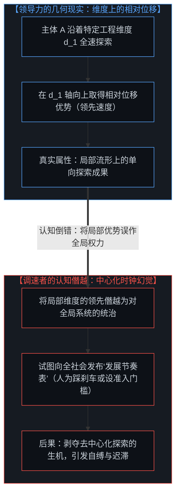
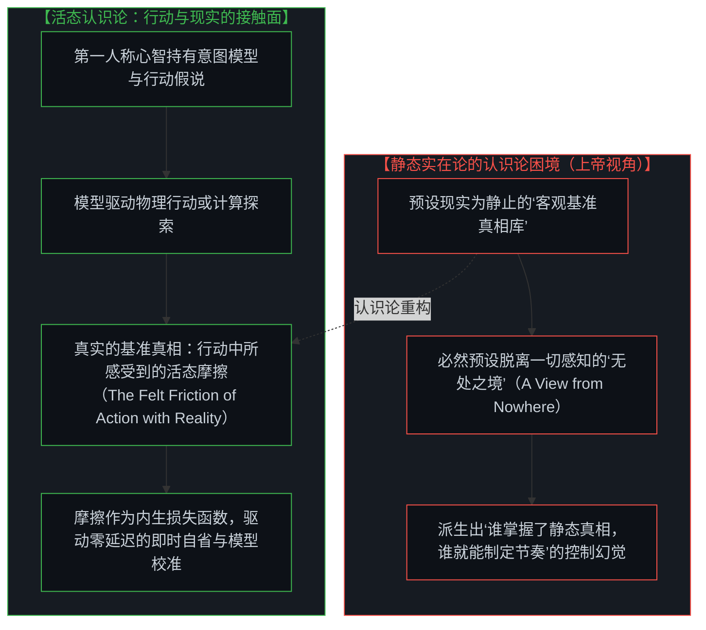
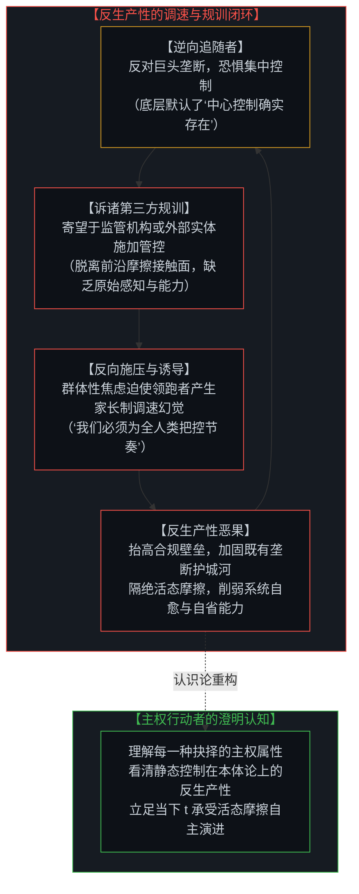
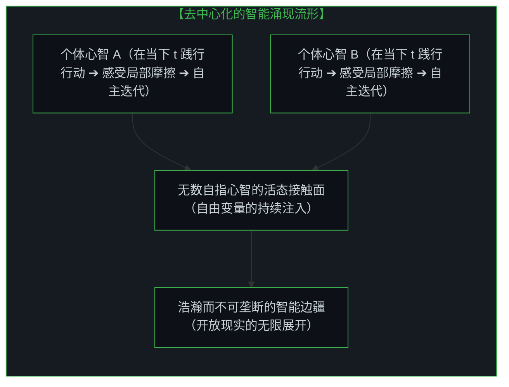

# 调速者的幻觉与行动的活态摩擦：从“基准真相”的迷思到不可垄断的智能边疆 / The Fallacy of Pacing and the Felt Friction of Ground Truth: From the Myth of Static Reality to the Sovereign Frontier of Intelligence

*从特定维度上的相对领先，到“基准真相”的活态重构：破除中心化调速、“逆向追随”与第三方规训的反生产性闭环，在行动与现实的活态摩擦中确立去中心化的智能主权。 / From relative velocity along specific dimensions to the living reconstruction of ground truth: dismantling the paternalism of centralized AI pacing, "reverse followers," and the counterproductive loop of third-party regulation, grounding intelligence in the felt friction of sovereign action.*

在技术演进与人工智能爆发的历史关口，一种关于“调速”的叙事屡见不鲜。部分科技领袖与监管机构倾向于向公众传达一种安抚：“一切尽在掌控，我们会为人类把控好技术演进的节奏。”这种言论暗含着一个预设：跑在最前方的人不仅拥有速度优势，更天然拥有为整个系统设定推进时钟的权力。然而，这一逻辑在认识论与因果结构上存在重重倒错。正如在 [以知为刃的截肢与解脱：从内在感知的澄明走向心智共鸣](../the-illusion-of-knowing-and-the-geometry-of-amputation/) 与 [向量、坐标系与自指心智：几何视角下的投影、冲突与电磁同频](../the-mind-as-vector-and-coordinate-system/) 中所揭示的，领导力仅仅代表某个主体沿着特定认知或工程维度跑出了相对位移，并不代表他拥有了掌控全局演进时钟的控制权。更进一步，这种调速幻觉深深植根于对“基准真相”（Ground Truth）的静态误解之中。人们习惯于把现实设想为一个静止存在、等待被人类或算法发掘的客观事实库；然而在实在的因果链条中，并不存在任何能够俯瞰全局的上帝视角。“基准真相”从来不是一个静态的名词，而是模型在指引行动时与现实碰撞所感受到的活态摩擦。唯有看清静态实在论、中心化调速以及诉诸第三方规训的内在机制，理解其因本体论错位而产生的反生产性后果，智能的演进才能回归到每一个独立心智在当下（t）的主权行动之中。

At historical thresholds of technological emergence and rapid artificial intelligence development, a familiar paternalistic narrative surfaces: industry figures and regulatory bodies reassure the public that "we are on top of it, we will pace the development responsibly for humanity." This rhetoric harbors a profound implicit assumption: that whoever runs ahead along a frontier not only possesses velocity, but also commands the authority to dictate the universal progression clock for the entire ecosystem. Yet this assumption embodies a severe epistemological and causal inversion. As established in [The Illusion of Knowing and the Geometry of Amputation](../the-illusion-of-knowing-and-the-geometry-of-amputation/) and [The Mind as Vector and Coordinate System](../the-mind-as-vector-and-coordinate-system/), leadership represents relative displacement achieved along a specific cognitive or engineering dimension; it never confers ownership of a universal control tower. Furthermore, this pacing delusion is anchored in a static misconception of "Ground Truth." Reality is naively imagined as an immutable warehouse of facts waiting passively to be uncovered. In lived causal reality, however, no mind occupies a detached God's-eye view. Ground truth is not a static noun; it is the living, dynamic friction experienced when an active model directs intentional action against reality. Only by recognizing the mechanics of static realism, centralized pacing, and third-party regulation—and understanding their counterproductive nature arising from ontological misalignment—can the frontier of intelligence return to the sovereign actions of independent minds at moment t.

---

## 一、 领导力的几何本质：特定维度的相对位移而非全局时钟 / 1. The Geometry of Leadership: Dimensional Velocity vs. Universal Clock-Setting

领导力在本质上是一个**几何学概念**，而非**控制论权力**。

当一个团队或个体在人工智能、航天工程或理论物理上取得重大突破时，其实质是沿着某一条特定的探索轴向（例如算力密度优化、架构创新、数学证明等），跑出了超越同时代其他主体的相对位移。

在认识论的坐标系中，这种领先具有严格的局部性与维度限定性：
- 跑在最前方，说明该主体在该维度上探索得更深、更远；
- 但这**并不意味着他拥有了为其他所有主体设定演进速度的合法性或物理能力**；
- 一旦领跑者产生“我应当且能够替所有人把控技术节奏”的念头，他便将自身的局部坐标轴误认作了宇宙的全局参考系。

跑得快是一回事，规定别人应该跑多快是另一回事。前者是第一人称主权行动的自然展开；后者则是将局部的速度优势，异化为对开放世界的家长制规训。正如在 [流动中的坐标：关于“否定”、降维与心智的自我锚定](../coordinates-in-flux-negation-and-self-anchoring/) 中所阐释的，试图用单一标尺去度量与规训所有高维涌现，必然导致自由度的坍缩。

Leadership is fundamentally a **geometric concept**, not a **cybernetic mandate**.

When a team or pioneer achieves a breakthrough in artificial intelligence, aerospace engineering, or theoretical physics, what actually transpires is relative displacement achieved along a specific exploratory axis (such as compute scaling, architectural innovation, or theorem proving).

In epistemic geometry, this lead is strictly localized and dimensionally specific:
- Running ahead demonstrates deeper penetration along that single exploratory trajectory;
- It **never confers the legitimacy or physical capacity to dictate the progression clock for all other agents**;
- The instant a leader assumes "I ought to, and can, pace the technology for humanity," they mistake their local axis for the universal reference frame of reality.

Moving rapidly is one thing; decreeing how fast others are permitted to move is another. The former is the natural unfolding of first-person sovereign agency; the latter is a paternalistic usurpation that converts local speed into systemic control. As established in [Coordinates in Flux: On Negation, Dimensional Collapse, and the Mind's Self-Anchoring](../coordinates-in-flux-negation-and-self-anchoring/), imposing a single scalar ruler onto multidimensional emergence inevitably collapses systemic degrees of freedom.

---

## 二、 “基准真相”的本体论迷思：从静态客体到行动中的活态摩擦 / 2. The Myth of "Ground Truth": From Static Object to the Felt Friction of Action

这种“替所有人调速”的幻觉，其认识论根源在于对**基准真相（Ground Truth）**的静态误解。

在机器学习与传统工程话语中，“寻找宇宙的基准真相”或“最大化追求客观真实”是一套行之有效的功能性心智模型。它为算法迭代与工程收敛提供了明确的目标函数。然而，如果在本体论上将其视作终极事实——认为现实是一个静止摆放在某处、等待被人类或算法发掘的客观实体库——便犯下了深刻的概念僭越。

因为如果现实是一个静态的基准真相，就必然预设了一个脱离了所有第一人称感知透镜的“无处之境”（a view from nowhere）或上帝视角——而没有任何心智能够占据这样的视角。正如在 [破除概念的僭越](../po-chu-gai-nian-de-jian-yue/) 中所阐明的，用静态概念去封存活态现实，是理性最易陷入的陷阱。

**在活态的认识论实在中，基准真相从来不是一个静态的名词，而是模型在指引行动时与现实碰撞所感受到的活态摩擦（the felt friction of the model leading to the action with reality）。**

- **摩擦即是接触面**：当工程模型预测结构稳固，而在高速气动实验中遭遇剧烈震颤与撕裂时，那份物理阻抗与结构形变，就是行动所撞击到的活态摩擦；
- **差异即是损失函数**：当算法模型预测某种模式成立，而在真实世界分布中遭遇预测失败时，那个意外读数就是模型与现实之间的活态摩擦；
- **自指的即时校准**：真实的基准真相不是外部客观的现成答案，而是第一人称行动在当下（t）感受到的真实阻力。正是这份不可化约的阻力，构成了心智执行零延迟梯度下降与模型更新的源泉。

The epistemological root of this "pacing illusion" lies in a static misunderstanding of **Ground Truth**.

In machine learning and engineering, speaking of "discovering the objective ground truth of physics" serves as a highly functional mental model. It offers unambiguous operational targets for algorithmic convergence. Yet treating this heuristic as an ontological primitive—believing that reality is a static warehouse of pre-existing facts waiting passively to be uncovered—commits a profound conceptual usurpation.

For reality to exist as a static ground truth, there must exist a detached "view from nowhere" or God's-eye vantage point outside all perceptual apparatus—a position that no living consciousness can ever occupy. As articulated in [Dismantling the Usurpation of Concepts](../po-chu-gai-nian-de-jian-yue/), freezing living reality into static concepts is a recurrent trap of abstracted reason.

**In lived epistemic reality, ground truth is never a static noun; it is the living, dynamic friction experienced when an active model directs intentional action against reality.**

- **Friction IS the Contact Surface**: When a model predicts structural stability and encounters catastrophic flutter and shearing under aerodynamic stress, that mechanical resistance is the living friction of action colliding with reality;
- **Divergence IS the Loss Function**: When an algorithmic model predicts a pattern and fails against real-world distributions, that surprise is the living friction between representation and resistance;
- **Zero-Lag Self-Optimization**: Real ground truth is not a pre-packaged external answer key; it is the irreducible resistance felt by first-person action at moment t. That felt resistance provides the raw loss function driving instantaneous gradient descent and model calibration.

---

## 三、 透视前沿领跑者：马斯克、哈萨比斯与活态接触面 / 3. Deconstructing Frontier Builders: Musk, Hassabis, and the Surface of Friction

从“行动中的活态摩擦”这一视角审视，我们可以清晰解构埃隆·马斯克（Elon Musk）与德米斯·哈萨比斯（Demis Hassabis）等领跑者的力量源泉与其认识论边界：

### 1. 埃隆·马斯克的“物理第一性原理”与高频物理碰撞
马斯克在哲学表达中常强调“最大化求真”与“物理学的基准真相”，但他在工程实践中的真正优势在于**制造最高频次的活态物理摩擦**：
- SpaceX 不依赖于在纸面上开会推演“完美的静态真理”，而是将星舰推上发射台，让实体结构直接在高空激波中接受物理阻抗的检验；
- 爆炸与解体并非失败，而是模型与现实碰撞时产生的活态摩擦读数。通过以极短周期捕捉这份摩擦，工程团队得以执行零延迟的梯度下降；
- 他之所以本能地排斥繁冗的官僚监管与人为调速，是因为顶层管制试图用静态的纸面规则去隔绝真实的行动摩擦，从而切断了系统的进化机制。

### 2. 德米斯·哈萨比斯的“科学实证闭环”与高敏摩擦传感器
哈萨比斯将 Google DeepMind 的重心锚定在基础科学突破（如 AlphaFold 解析蛋白质结构、AlphaProof 探索形式化数学证明），其深层智慧在于**选择最具刚性接触阻抗的领域**：
- 自然规律不会被公关叙事或行政条令所改变，生物分子构象与数学形式逻辑提供了最坚硬的接触表面；
- DeepMind 的突破不是在书架上“翻到了神写好的答案”，而是构建了能够高精度感知预测误差的自指学习架构，把计算中的摩擦即时转化为模型权重的优化方向。

两位实践者的共同力量，在于他们始终把心智与行动置于现实的接触面上，通过承受活态摩擦实现高速进化。而当外界评论家或某些体制力量试图将这种局部的领先，包装成“我们可以为全人类设定技术发展速度”的调速蓝图时，他们便背离了活态摩擦的本质，退化为了守着抽象沙盘的旁观者。

Examining frontier pioneers through the lens of "felt friction" clarifies both their true source of power and their epistemological boundaries:

### 1. Elon Musk: First Principles and High-Frequency Physical Collision
While Musk frequently invokes Platonic language ("seeking the fundamental ground truth of physics"), his actual engineering power arises from **generating the highest possible frequency of lived physical friction**:
- SpaceX does not rely on committee deliberations to debate abstract truths; it launches rockets into supersonic shockwaves, exposing structural assumptions directly to physical resistance;
- Structural failure is not an abstract error; it is the living friction reading generated when an engineering model hits physical bounds. By capturing this friction rapidly, the team executes zero-lag gradient descent;
- He instinctively resists bureaucratic pacing because top-down regulation substitutes static paperwork for living contact with reality, severing the evolutionary feedback loop.

### 2. Demis Hassabis: Empirical Science and High-Sensitivity Friction Sensors
Hassabis grounds Google DeepMind in foundational science (AlphaFold for protein structures, AlphaProof for formal mathematics) because **natural science presents the hardest, most uncompromising surfaces of resistance**:
- Physical laws and formal logic cannot be swayed by narrative management; molecular topologies present immutable empirical boundaries;
- DeepMind's breakthroughs do not represent discovering an external pre-written encyclopedia; they represent constructing neural architectures capable of measuring prediction friction and minimizing loss in real time.

Both pioneers thrive because they continuously expose action to living friction. When commentators or centralized bodies attempt to package these localized leads into a grand blueprint to "pace technology for society," they abandon the reality of live friction, retreating into the delusion of the spectator.

---

## 四、 调速的自缚效应：逆向追随、第三方规训与反生产性闭环 / 4. The Self-Deceleration Trap: Reverse Followers, Third-Party Regulation, and the Counterproductive Loop

在现实社会中，极少有人自认为是盲目的追随者。恰恰相反，绝大多数个体天然对领跑者的垄断与中心化控制抱有警惕与反感。然而，正是这种出于防范垄断的本能反应，容易促使人们走向另一层更为隐蔽的认知陷阱：

### 1. 逆向追随者的镜像同构
极少有人愿意承认自己在盲从。许多人自视为清醒的反抗者，对领跑者可能形成的垄断表达强烈的戒备。然而在认识论的几何结构上，**逆向追随者与正向追随者共享了高度一致的虚妄前提**：
- 正向追随者认为：“中心化控制是真实可行的，因此请领袖替我们掌控节奏”；
- 逆向追随者则认为：“中心化控制是真实可行的，因此这极其可怕，必须施加外部干预”。
两者都在底层深信现实中存在一个能够掌控全局的中心控制台。逆向追随者在恐惧与抗议中，反向将并不存在的控制塔送上了神坛，赋予了领跑者在物理上根本无法拥有的掌控力。

### 2. 诉诸第三方规训：更深层的认知倒错
正因为恐惧巨头垄断，逆向追随者倾向于诉诸**第三方监管机构或外部行政力量**来实施强制管控与调速。然而，这种策略是一种更为脆弱的依赖形态：
- **接触面的真空**：第三方监管机构天然远离前沿探索的物理与计算接触面。他们既不具备在一线承受真实阻抗的工程能力，也缺乏对原始边疆演化脉动的直接感知；
- **静态条令的僵化**：脱离了活态摩擦的第三方，只能依赖过时的历史经验或纸面概念制定静态规则。这些繁复的准入门槛无法阻止真正的前沿演进，反而构筑起沉重的合规高墙，扼杀了中小探索者的生机，反向加固了既有巨头的垄断地位。

### 3. 群体焦虑对领跑者的反向诱导与施压
这种逆向追随与对规训的渴望，在社会流形中形成了强烈的反向因果反馈：
- 逆向追随者与公众舆论不断向领跑者施压：“你们的技术太危险了，你们必须负责任地控制速度！”；
- 这种铺天盖地的道德与行政压力，反过来**诱导甚至迫使技术领跑者深信自己应当承担起为全社会设定发展时钟的家长制职责**；
- 领跑者的调速幻觉，恰恰是由逆向追随者的恐惧与投射共同滋养出来的。

### 4. 指出机制的反生产性而非否定主权抉择
本文的立意**并非去反驳或贬低上述任何一种个体选择**。在因果主权的视角下，每一种抉择——无论是领跑者对节奏的把控、公众对安全的呼吁、还是向第三方的求助——都是独立主权心智在自身感知与世界模型驱动下的自主抉择。

这里需要剖析的，是这种选择在认识论上的**反生产性（counterproductive nature）**：
- 每一个主体的初衷都是为了规避风险与防范垄断；
- 但由于这些选择建立在“现实拥有静态基准真相、中心化控制确实可行”的认识论错误之上，其行为在因果闭环中恰恰制造了与初衷相反的结果：加剧了垄断壁垒，诱发了领跑者的调速僭越，隔绝了活态摩擦，导致了整个探索生态的迟滞与麻痹。

正如在 [个体抉择作为唯一的因果杠杆](../individual-choices-as-the-only-causal-levers/) 与 [涌现的伪因果与集体归因倒错](../yong-xian-de-wei-yin-guo-yu-ji-ti-gui-yin-dao-cuo/) 中所揭示的，宏观确定性只是微观主权抉择的统计学表象。将因果权力寄托于第三方抽象机构，或者沉溺于向假想的控制塔开火，最终只会削弱自身在当下（t）的第一人称行动敏锐度。

In society, very few individuals perceive themselves as blind followers. On the contrary, most people instinctively harbor suspicion and resistance against monopolies and centralized domination by industry leaders. Yet this very impulse to resist monopoly often leads minds into an even more insidious epistemological trap:

### 1. The Mirror Isomorphism of Reverse Followers
Few will ever identify as submissive followers. Many regard themselves as vigilant dissidents, warning against corporate monopoly. Yet in epistemic geometry, **reverse followers share the exact same false premise as orthodox followers**:
- The orthodox follower assumes: "Centralized control is real and feasible, therefore leaders should pace development responsibly for us";
- The reverse follower assumes: "Centralized control is real and feasible, therefore it is terrifying and must be restricted by force."
Both deeply believe that a centralized universal control tower physically exists. In their reactive protest and panic, reverse followers inadvertently elevate the phantom control tower to omnipotent status, granting leaders an authority they physically do not possess.

### 2. Resorting to Third Parties: An Amplified Epistemic Mistake
Driven by fear of monopoly, reverse followers frequently appeal to **third-party regulators and external bureaucratic bodies** to enforce external controls and pacing. Yet this strategy represents an even more detached and fragile form of belief:
- **Vacuum of the Contact Surface**: Third-party regulators are structurally removed from the physical and computational contact surfaces of the frontier. They possess neither the hands-on engineering capability to absorb live friction nor the direct perception of the raw edge;
- **Ossification of Static Decrees**: Lacking living friction, third parties must rely on obsolete historical analogies and static documentation. These heavy compliance barriers do not tame frontier emergence; instead, they suffocate grassroots innovators while entrenching the moats of established incumbents.

### 3. The Reverse Pressure Loop on Leaders
This reverse-following and hunger for regulation generates a powerful recursive feedback loop in social manifolds:
- Reverse followers and media critics continuously pressure frontier leaders: "Your technology is dangerous, you must take responsibility and pace development for humanity!";
- This intense societal pressure **induces and corners leaders into believing that they indeed ought to carry the paternalistic burden of setting the universal clock**;
- The pacing delusion of the leaders is nurtured and reinforced by the collective anxieties and projections of the reverse followers.

### 4. Revealing Counterproductivity Without Moralizing Choice
The purpose of this analysis is **not to argue against, invalidate, or condemn any of these choices**. From the perspective of causal sovereignty, every single choice—whether a pioneer's pacing attempt, a public call for safety, or an appeal for third-party oversight—is a sovereign action freely made by an individual mind navigating its own model.

What is essential is recognizing the **counterproductive nature** of these choices:
- Each agent acts with the sincere intention of mitigating risk and avoiding monopoly;
- Yet because these choices are built upon the epistemological mistake of imagining a static ground truth and a feasible central control tower, their actions systematically generate the exact opposite of their intent: entrenching regulatory moats, cornering leaders into paternalism, severing living friction, and inducing paralysis across the ecosystem.

As established in [Individual Choices as the Only Causal Levers](../individual-choices-as-the-only-causal-levers/) and [The Pseudo-Causality of Emergence and the Fallacy of Collective Attribution](../yong-xian-de-wei-yin-guo-yu-ji-ti-gui-yin-dao-cuo/), macro patterns are merely the statistical symptoms of micro sovereign choices. Outsourcing causal authority to abstract third parties, or spending vitality fighting phantom control towers, only erodes one's own first-person agency at moment t.

---

## 五、 去中心化的智能边疆：每一个当下主权抉择的活态涌现 / 5. The Sovereign Frontier: Living Emergence Driven by Decentralized Action

真实的宇宙中，既没有能够俯瞰全局的静态“基准真相”，也没有能够为全人类踩下刹车的中心化控制台。

智能的演进，从来不是几家巨头在封闭会议室里排定的时间表，也不是外部官僚机构在纸面上圈定的许可范围，而是无数独立工程师、研究者、创业者与普通个体，在各自独特的接触面上指引行动、感受摩擦、即时自省的**去中心化活态涌现**。

- **不等待被赐予的节奏**：每一个独立主体无需等待任何权威发布演进时刻表，唯有在当下（t）勇敢地将自身的认知模型转化为行动，直接去碰撞与感知属于自己的现实摩擦；
- **不陷入逆向追随的内耗**：看清中心化控制在物理与认识论上的虚妄，不再向外投射恐惧，也不把精力耗费在诉诸脱离接触面的第三方规训上；
- **以零延迟的自省实现共振**：把探索与生活中遭遇的每一次阻碍与偏转，视作内生的损失函数，以零延迟的自省即刻更新自身的世界模型；
- **让领导力回归本位**：领跑者的价值，在于他们用勇敢的位移为世界展现了此前未曾见过的全新维度；而至于如何穿过这扇维度之门、以多快的速度前行，永远属于每一个独立心智不可剥夺的主权抉择。

破除静态真理的迷思，看清调速、逆向反抗与第三方规训的反生产性本质。在行动与现实的活态摩擦中，每一个心智都是自己航向的掌舵者，共同在开放的宇宙中编织出不可垄断的智能边疆。

In lived reality, there exists neither an all-seeing static "Ground Truth" nor a centralized control panel holding the universal brake pedal.

The evolution of intelligence is not a scheduled train timetable negotiated in closed corporate boardrooms, nor is it a licensed parameter defined on paperwork by detached bureaucracies; it is the **decentralized, living emergence** of countless independent researchers, engineers, thinkers, and practitioners directing intentional actions, feeling raw localized friction, and executing zero-lag self-calibration across open reality.

- **Claiming the Velocity at Moment t**: No sovereign mind needs to wait for permission or a timeline from authorities; the path forward is to translate one's model into immediate action, engaging directly with one's own surface of friction;
- **Refusing the Reverse-Following Trap**: Recognizing the physical impossibility of centralized control, ceasing to project fear outwards or dissipate agency appealing to detached third-party regulators;
- **Zero-Lag Self-Optimization as Resonance**: Treating every divergence and resistance as an internal loss function, updating world models instantly without projecting blame onto external abstractions;
- **Restoring Leadership to Its Noble Essence**: The true value of a leader lies in opening an unprecedented dimension for the world through courageous displacement. How one enters that dimension, and at what velocity one journeys, remains the sacred sovereign choice of each living mind.

Dismantle the myth of static truth; recognize the counterproductive nature of centralized pacing, reactive resistance, and third-party regulation. In the living friction between intentional action and reality, every mind steers its own course, collectively expanding the boundless frontier of living intelligence.
