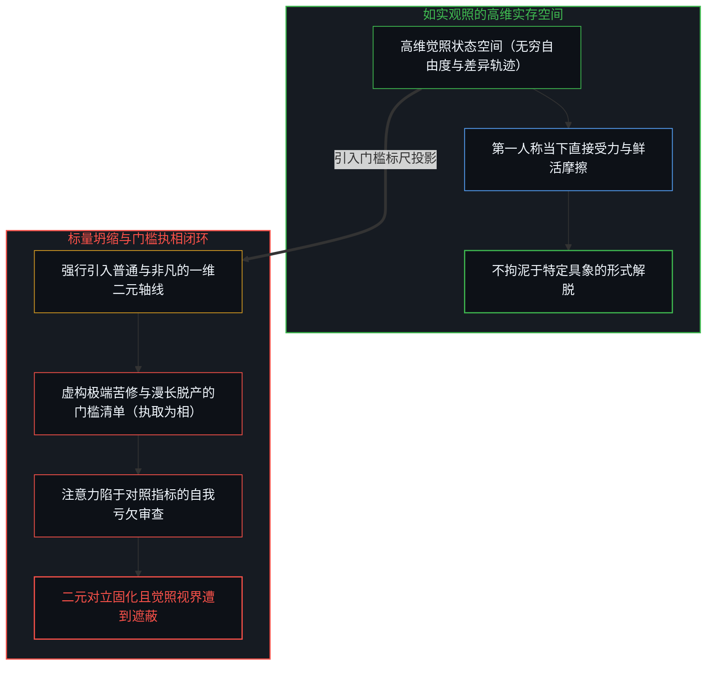
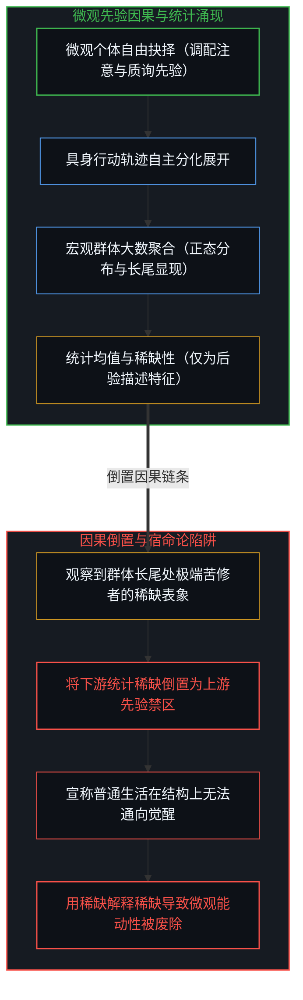
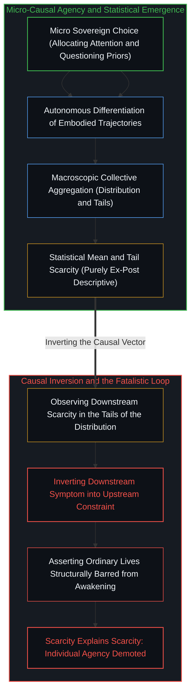

# 开悟的相与门槛的倒置 / The Form of Enlightenment and the Inversion of Gates

*以苦修为清单将如实观照降维为标量坐标，宏观统计稀缺被倒置为微观觉醒的先验禁区 / Reducing direct seeing to a scalar checklist mistakes aggregate scarcity for a prior barrier to awakening*

在大众精神探索与灵修修辞中，“普通人几乎无法开悟”常常被包装为某种深不可测的洞见，并附带一套极其严苛的门槛清单：持续持久的剧痛、长段脱离生计的闲暇反思、对既有社会与亲缘纽带的全面否定，以及极度单一且强烈的向内凝聚。声称唯有越过这些极端屏障才能获致觉醒的论调，表面上是在警示修行的艰巨，实则在认识论上操演了双重倒错。它首先将原本具备无限维度的如实观照强行坍缩为一根“普通与非凡”的一维标量坐标，把后验显现的局部轨迹固化为必须执取的“相”；继而将群体尺度下大数均值所呈现的统计稀缺，倒置为裁定每一个具体心智下一步选择的先验禁锢。执着于门槛清单的心智，恰恰在搭建清单的瞬间亲手筑造了遮蔽觉照的高墙，使原本旨在破除执念的处方，蜕变为障蔽当下的终极执念。

In popular spiritual discourse and self-cultivation rhetoric, the claim that ordinary people are virtually incapable of enlightenment is frequently dressed up as profound wisdom, accompanied by an austere checklist of prerequisites: prolonged and agonizing suffering, vast stretches of leisure detached from worldly livelihoods, a sweeping renunciation of social and familial bonds, and an intensely focused internal concentration. Promising that awakening is accessible solely to those who cross these extreme thresholds appears to honor the rigors of contemplation, but in epistemological terms it enacts a catastrophic double inversion. It collapses direct, open seeing—an experiential field supporting near-infinite dimensions—into a single binary axis of the ordinary versus the extraordinary, reifying a localized historical trajectory into an idolatrous form (相) to which the mind now clings. It then mistakes the macroscopic rarity of extreme traits across a large population for an insurmountable causal prohibition governing the immediate choices of an individual mind. In doing so, the gatekeeper's checklist constructs the very wall it claims to breach, transforming an emancipatory prescription into an inescapable shackle of attachment.

## 一、 门槛即是相：将如实观照坍缩为标量坐标 / 1. The Gate as Form: Collapsing Direct Seeing into a Scalar Axis

列举极端条件并借此将人群划分为“沉沦的庸常者”与“合格的登顶者”，本身就是一种对“相”的深层执取。在大乘佛学与禅宗的认识原点中，觉醒的核心不是在经验世界中建立某种稀有独特的心理奇观，而是如实照见实存的未决状态，卸下由概念投射所编织的虚妄确执。当某种言说声称开悟必须依赖四重严酷考验时，它实际上已经预先制造了一个关于开悟的特定模具，并勒令所有求索者向这一模具屈膝。这种对门槛的迷恋，恰恰落入了《金刚经》所揭示的取相之障：凡所有相，皆是虚妄。真正的明心见性决不在于，也从不需要站在所谓高处对他人是否属于普通人指手画脚。一旦观察者开始通过他人是否具备闲暇、是否经受剧痛来裁定其生命潜能，观察者就已经将自身降格为了概念迷宫中的裁判，其自视超脱的姿态恰好证明了其仍深陷于分别心的泥潭。正如我们在[普度众生，是没收回的分别心](../mei-you-pu-du-zhi-you-zi-du/)中所剖析的，任何试图在外部世界固化一组被拯救者或不合格者的企图，都是尚未收回的主观投射。

Listing extreme prerequisites to segregate humanity into the hopeless multitude and an elite elect constitutes a profound attachment to form (相). At the epistemic roots of Mahayana Buddhism and Zen, awakening does not consist in manufacturing a rare, exotic psychological spectacle within the empirical domain; it consists in seeing reality as is, releasing the conceptual reifications that distort direct presence. When a doctrine proclaims that awakening requires passing through four grueling trials, it has already cast a rigid mold of what enlightenment must look like and commanded all seekers to bow before it. This obsession with credentials falls squarely into the trap identified by the Diamond Sutra: all forms and appearances are illusions. Authentic realization does not consist in, and never requires, pointing fingers at whether other people qualify as ordinary. The moment an observer begins judging another's spiritual potential by the presence of leisure or the severity of past trauma, that observer has demoted themselves to a scorekeeper inside an ideological maze, proving through their very condescension that they remain hopelessly entangled in dualistic discrimination. As articulated in [No Universal Salvation, Only Boundless Possibilities of Self-Salvation](../mei-you-pu-du-zhi-you-zi-du/), every project that reifies an external collective of unawakened others is an unretracted projection of one's own unexamined distinctions.

这种执取在几何与动力学机制上体现为极度的投影压缩。未受概念规训的实存本身支持着近乎无限的因果维度与发展分支，每个具体心智在每一瞬间的注意力分配、环境博弈、知觉校准与反思深度，都构成了独特的相空间轨迹。然而，门槛论将这片广阔的多维状态空间粗暴地拍平至单一的一维二元轴线之上：轴的一端被标定为注定蒙昧的普通，另一端被神化为超凡脱俗的觉者。一旦这根被高度压缩的标尺被不假思索地接纳为衡量一切的默认底色，后续的所有思考便不再向正在发生的生活经验负责，而是沦为围绕这根标尺展开的数值辩护。主权心智拒绝承认这种低维坐标的终极地位，并非狂妄地宣称每一个生命都已然处于巅峰状态，而是清醒地看破这一标尺的人为属性，拒绝让一套贫瘠的二元刻度垄断自身审视世界的视野。正如我们在[心智作为向量与坐标系](../the-mind-as-vector-and-coordinate-system/)以及[“普通人视角”的解释陷阱](../the-explanatory-trap-of-the-ordinary-perspective/)中所辨明的，强行将多维展开压缩为一维标量排位，不仅抹杀了真实的差异性，更在无形中把观察者局域构建的测量坐标伪装成了宇宙本身的几何结构。

Dynamically and geometrically, this attachment operates as a violent dimensional reduction. Unmediated reality supports a near-infinite number of causal dimensions and developmental bifurcations, where each living mind traces a unique phase-space trajectory shaped by moment-to-moment attention, environmental friction, perceptual calibration, and reflective depth. Yet the gatekeeping doctrine crushes this rich, high-dimensional phase space down to a single binary axis: ordinary versus extraordinary. Once this compressed coordinate system is accepted as the unquestioned background frame, further inquiry ceases to engage with lived friction; instead, it degenerates into defensive scorekeeping along the newly imposed axis. Refusing to grant primacy to this reduced coordinate frame does not mean asserting that every life is already an exceptional realization; it means piercing the artificiality of the ruler, refusing to let an impoverished binary filter monopolize the horizon of awareness. As demonstrated in [The Mind as Vector and Coordinate System](../the-mind-as-vector-and-coordinate-system/) and [The Explanatory Trap of the "Ordinary Perspective"](../the-explanatory-trap-of-the-ordinary-perspective/), forcing multidimensional unfolding onto a one-dimensional scalar ranking erases authentic divergence and deceitfully elevates an observer's localized metric into the immutable geometry of the cosmos.

## 二、 尺度与倒置：宏观统计稀缺对微观行动因果的僭越 / 2. Scale and Inversion: The Overstep of the Statistical Mean onto Agency

同样的降维与扭曲，在群体尺度的统计观察中展现得尤为露骨。当我们把视线拉远至成千上万个生命的集合时，大数定律决定了绝大多数个体在任一被测量的特征轴上——无论是时间分配的自由度、反思质询的频次，还是向内探索的深度——都必然聚集在常模均值附近。这种向均值的聚集，纯属观察者站在宏观大样本尺度上审视汇总数据时产生的数学必然，它反映的是宏观聚合层面的分布特征，绝非作用于任一具体生命身上的微观物理阻抗。非凡的体验与深刻的觉照之所以始终向每一个具身个体敞开，正是因为统计均值仅仅是对已经展开的历史轨迹的事后汇总与描述，它没有任何能力规定任何一个心智在下一个瞬间能够做出何种抉择。将群体尺度的观测均值错当成立即可对具体个体下达禁令的现实边界，是在认识论上极其严重的范畴错乱，它混淆了描述的尺度与行动的尺度。

This same reductionism and distortion manifests even more glaringly in statistical observations across large populations. When an observer steps back to examine an aggregate collection of tens of thousands of lives, the law of large numbers dictates that the vast majority will cluster near the mean along whatever dimension is measured—be it discretionary leisure time, intensity of self-interrogation, or the depth of inward exploration. This clustering around the mean is purely a mathematical artifact of viewing an aggregated distribution from a macroscopic vantage point; it characterizes the collective sample ex post, rather than exerting a physical constraint upon any concrete individual agent. Extraordinary outcomes and penetrating awareness remain perpetually available to every embodied agent precisely because the mean describes the herd after their paths have already unfolded; it possesses zero legislative power over the choice a specific mind will make in the very next moment. Treating the observed mean as an active barrier that forecloses individual potential commits a catastrophic category error, conflating the scale of collective description with the scale of individual action.

这种混淆直接导向了因果矢量的致命倒置。在真实的演化动力学中，统计分布只是无数个体基于自身局部处境做出微观抉择后汇聚而成的下游症状；然而，门槛论却将这一后验症状倒置为了决定个体命运的先验原因。在这一扭曲的逻辑框架下，满足极端苦修条件者的极度稀缺，被顺理成章地拿来证明普通人的日常生活在结构上绝无开悟的可能。稀缺性被用来解释稀缺性本身，形成了一套自给自足的话语死锁。那些本可以由个体主动发起的微观行动——在繁忙工作中保护一段安静自省的缝隙、将习以为常的社会观念视作可检验的假说、在平凡琐事中调动锐利的觉察——不再被视为能够改写下一次统计均值的因果输入，反而被冷酷裁定为已被既有均值预先封死的无效妄想。正如我们在[宏观现象及参数和个人微观选择的因果倒置与利率的命令幻相](../the-summary-first-reversal-and-the-command-of-yields/)中所剖析的，一旦下游汇总参数被赋予了发号施令的权力，微观行动者的能动性便遭到了全额的剥夺与消解。

This confusion directly induces a disastrous causal inversion. In authentic dynamical systems, the macroscopic distribution of outcomes is purely a downstream symptom generated by countless individuals making micro-level decisions in their local environments; gatekeeping doctrines invert this symptom into an upstream cause that dictates personal destiny. Under this perverse logic, the visible rarity of those who endure extreme asceticism is cited as proof that ordinary lives are structurally excluded from awakening. Scarcity is invoked to explain scarcity, sealing the mind within a self-reinforcing tautological trap. Sovereign micro-choices that could alter an agent's coordinates—protecting an unmonitored window of contemplation amid work, treating received dogmas as provisional hypotheses, cultivating razor-sharp attention within ordinary daily friction—are no longer understood as generative inputs that determine where the next measurement of the mean falls; instead, they are dismissed as passive impossibilities already ruled out by the historical average. As uncovered in [The Summary-First Reversal and the Command of Yields](../the-summary-first-reversal-and-the-command-of-yields/), whenever downstream summary metrics are elevated into commanding authorities, the sovereign agency of micro-level actors is hollowed out and silenced.

## 三、 处方的自败：以指月之手为执念牢笼的解困困局 / 3. The Self-Defeating Prescription: The Finger Pointing at the Moon Cast as Shackle

这种门槛论在实践层面的终极恶果，在于其开出的救赎处方在结构上直接阻断了它声称要通达的目标。通过将一场本应直接直面当下的无相探索，重构为必须逐项核对的条件通关工程，该论断为求道者量身定制了一个全新的执着对象。原本旨在审视心智运作的宝贵注意力，被全额挪用去持续监测自己是否达标：自己的痛楚是否足够刻骨铭心、自己的闲暇是否足够脱离世俗、自己的叛逆是否足够决绝果断。这种无休止的自我审查与指标比对，不仅未能化解内心的执念，反而以极其隐蔽的方式重新固化了二元对立的囚笼。那些本应被视作指月之手的局域经验描述，一旦被升格为必不可少的制度化门槛，便直接蜕变为了捆绑求索者的沉重枷锁。接受了这份清单的人，其目光不再投向鲜活的实存，而是死死盯住清单本身的规训要求，在无休止的自我匮乏感中越陷越深。正如我们在[规程的倒置与因果回路的消声](../the-inversion-of-the-protocol-and-the-silencing-of-the-causal-loop/)与[自由的心智被它声称保护之物所置换](../the-free-mind-is-displaced-by-what-claims-to-protect-it/)中所指出的，任何将手段神圣化为门槛的操作，最终都会以守护之名完成对自由心智的置换与放逐。

The ultimate practical consequence of this gatekeeping is that the diagnostic prescription structurally sabotages the realization it purports to foster. By transforming an unconditioned inquiry into a checklist-compliance marathon, the doctrine supplies the seeker with a freshly fabricated object of idolatrous attachment. Precious attentional bandwidth, which ought to be allocated toward inspecting the immediate operations of the mind, is entirely consumed by obsessive self-monitoring against external criteria: Is my suffering sufficiently agonizing? Is my leisure sufficiently pure? Is my renunciation sufficiently radical? This relentless self-surveillance does not dissolve dualistic attachments; it secretly reinstalls them with greater force. Local descriptive artifacts, which at best could only serve as fingers pointing toward the moon, become institutionalized gates that bind the seeker in chains. The individual who internalizes this list is oriented entirely toward the demands of the checklist rather than toward immediate lived presence, drowning in an artificial sense of perpetual shortfall. As revealed in [The Inversion of the Protocol and the Silencing of the Causal Loop](../the-inversion-of-the-protocol-and-the-silencing-of-the-causal-loop/) and [The Free Mind Is Displaced by What Claims to Protect It](../the-free-mind-is-displaced-by-what-claims-to-protect-it/), any institutional mechanism that sanctifies a tool into a mandatory gate ends up exiling the sovereign mind in the name of safeguarding it.

走出这重灵修迷宫的解药，在于恪守因果律的不变性，并拒绝承认任何低维标量对实存的终极裁定权。微观层面的自由抉择始终先于宏观层面的统计分布而存在。我们依然可以为了特定的认知探讨而勾勒局部的概念区分，但必须始终铭记：任何概念切分都只是临时、局域且随时可被修订的认知支架，绝非实存本身的不可逾越之墙。如实照见当下并不需要预先完成一份充斥着极端考验的苦修答卷；它唯独需要心智在此时此刻清醒地觉察到：正是这张被奉为通关密令的门槛清单，在心智还未迈步之前，便已经将原本广袤无垠的觉照原野严密地圈禁了起来。群体的统计均值在未来依然会客观存在，但没有任何一个活生生的主权心智，有义务被扣留在那道均值的阴影之中。

The remedy for this spiritual labyrinth lies in refusing to invert the causal vector, denying any low-dimensional projection final authority over reality. Micro-level sovereign choices remain permanently prior to the macroscopic statistical distributions they generate. We may still sketch local, temporary distinctions for analytical clarity, but we must never forget that conceptual cuts are provisional, localized scaffolding rather than eternal boundary stones in the objective universe. Seeing reality as it is does not require first satisfying a grueling checklist of extreme prerequisites; it requires recognizing here and now that the checklist itself has already contracted the boundless field of awareness before the first step was taken. The statistical mean of the collective will continue to manifest in future observations, but no sovereign living mind is obligated to remain confined within its shadow.
