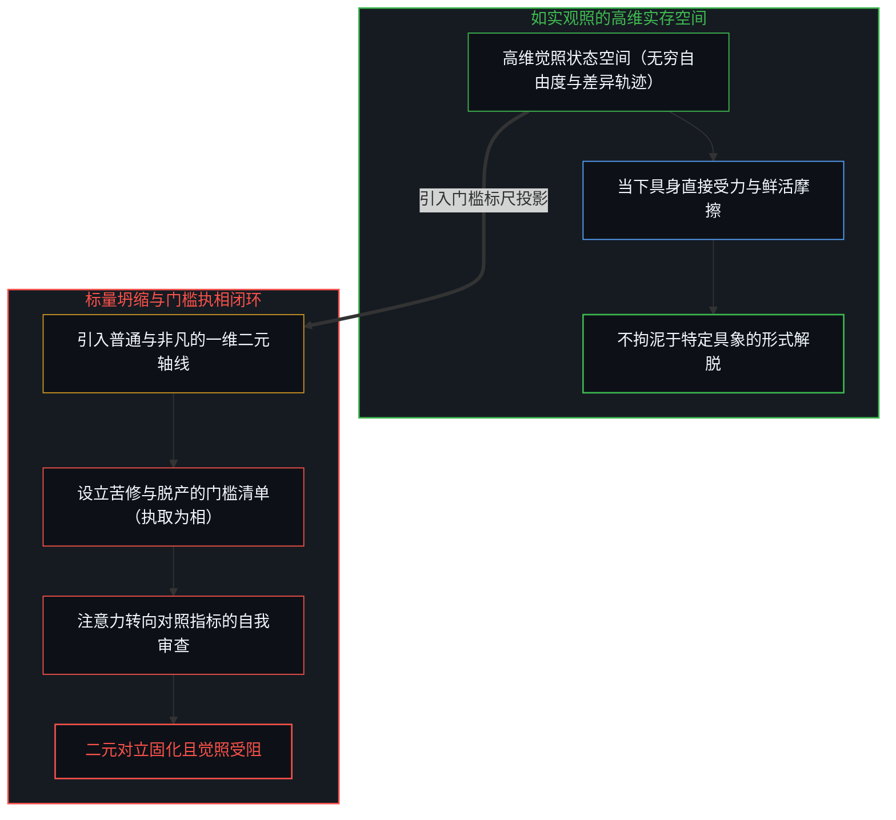
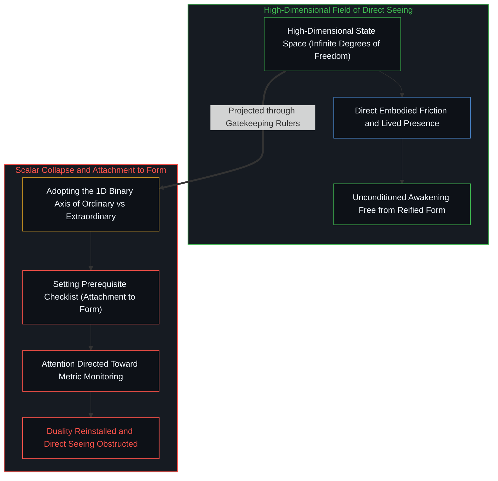
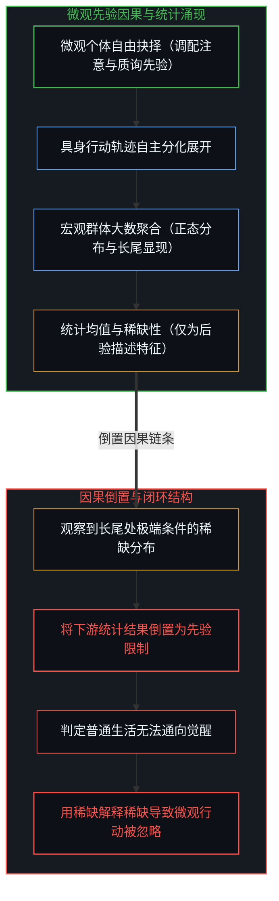
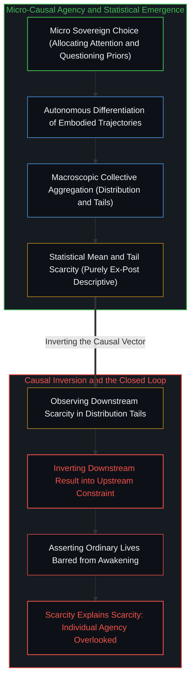

# 开悟的相与门槛的倒置 / The Form of Enlightenment and the Inversion of Gates

*以苦修为清单将如实观照降维为标量坐标，宏观统计稀缺被倒置为微观觉醒的先验禁区 / Compressing direct seeing into a checklist; inverting aggregate scarcity into a barrier to awakening*

在大众精神探索与修行讨论中，“普通人难以开悟”常被视为一种深刻洞见，并附带一套具体的门槛清单：持久的痛苦、脱离生计的长段闲暇、对既有社会纽带的否定，以及高度集中的向内专注。声称唯有满足这些条件才能觉醒的论述，表面上是指出修行的难度，实则在认识论上构成了双重倒置。它首先将支持多维可能性的如实观照坍缩为“普通与非凡”的一维二元轴线，把后验显现的局部轨迹固化为执取的“相”；继而将大样本尺度下的统计稀缺，倒置为限制个体行动选择的先验禁锢。将门槛清单视作必不可少的条件，恰恰在设定清单的瞬间构成了对觉照的遮蔽，使原本用于诊断的说明转变为障蔽当下的执念。

In popular spiritual discourse, the claim that ordinary people cannot achieve enlightenment is frequently framed as a foundational insight, accompanied by a checklist of conditions: prolonged suffering, long stretches of leisure detached from work, the renunciation of existing social bonds, and intense inward focus. Asserting that awakening is accessible only through these gates presents itself as an analysis of difficulty, but in epistemological terms it introduces a double inversion. It collapses unmediated, direct seeing—a space supporting high-dimensional trajectories—into a single binary axis of the ordinary versus the extraordinary, reifying a localized path into a form (相) of attachment. It then mistakes the statistical scarcity of extreme traits across a population for a prior causal barrier governing an individual's immediate choices. Treating the checklist as necessary obstructs direct seeing, turning the diagnostic framework into a source of attachment.

## 一、 门槛即是相：将如实观照坍缩为标量坐标 / 1. The Gate as Form: Collapsing Direct Seeing into a Scalar Axis

列举极端条件并借此将人区分为普通与非凡，本身构成了一种对“相”的执取。在佛学与心智哲学的认识原点中，觉醒的核心不是在经验世界中建立某种稀有独特的心理状态，而是如实照见实存的未决状态，卸下由概念投射所建立的确执。当某种言说声称开悟必须依赖四重严酷条件时，它实际上预先制造了一个关于开悟的特定模具，并将觉醒等同于符合这一模具。这种对门槛的设定，构成了《金刚经》所指出的取相：凡所有相，皆是虚妄。正如[超验的定相](../the-fixed-image-of-transcendence/)所揭示的，将动态未决的超越体验凝固为静态画像，是用概念模具替代了鲜活实存。如实照见当下并不需要，也不包含判断他人是否属于普通人。一旦观察者开始通过他人是否具备闲暇、是否经受剧痛来裁定其生命潜能，观察者便是在依据概念标尺进行判别，并未脱离分别取相的结构。正如[普度众生，是没收回的分别心](../mei-you-pu-du-zhi-you-zi-du/)所剖析的，在外部划分被拯救者或不合格者，属于尚未收回的分别投射。

Listing extreme conditions to divide people into the ordinary and the extraordinary constitutes an attachment to form (相). At the epistemic roots of Buddhism and philosophy of mind, awakening does not consist in manufacturing a rare, exotic psychological state; it consists in seeing reality as is, releasing the conceptual reifications that distort direct presence. When a doctrine claims that awakening requires four extreme conditions, it establishes a specific template for realization and measures inquiry by conformity to that template. This conditionality reflects what the Diamond Sutra identifies as attachment to form: all reified signs are deceptive and illusory. As demonstrated in [The Fixed Image of Transcendence](../the-fixed-image-of-transcendence/), freezing open experiential presence into a static portrait replaces living reality with a conceptual mold. Seeing as is does not consist in, nor does it require, judging whether others are ordinary. Evaluating another's potential through external criteria such as leisure or suffering operates within the very dualistic framework it claims to transcend. As articulated in [No Universal Salvation, Only Boundless Possibilities of Self-Salvation](../mei-you-pu-du-zhi-you-zi-du/), establishing external categories of the unawakened remains an unretracted projection of distinctions.

这种执取在几何与动力学机制上体现为投影压缩。未受概念规训的实存本身支持着近乎无限的因果维度与发展分支，每个具体心智在每一瞬间的注意力分配、环境博弈与反思深度，都构成了独特的相空间轨迹。然而，门槛论将这片广阔的多维状态空间压缩至单一的一维二元轴线之上：轴的一端被标定为普通，另一端被标定为觉醒。一旦这根被压缩的标尺被接纳为默认底色，后续思考便不再向实际生活经验负责，而是转为围绕这根标尺展开的论证。拒绝承认这种低维坐标的优先地位，并非主张每个生命都已达到非凡状态，而是不让这一二元刻度成为审视现实的默认过滤网。正如[心智作为向量与坐标系](../the-mind-as-vector-and-coordinate-system/)以及[“普通人视角”的解释陷阱](../the-explanatory-trap-of-the-ordinary-perspective/)所辨明的，将多维展开压缩为一维标量排位，不仅忽略了多维差异，更在无形中将局部构建的测量坐标当作了实在本身的几何结构。

Dynamically and geometrically, this attachment operates as a dimensional reduction and projective flattening. Unmediated reality supports a near-infinite number of causal dimensions and developmental bifurcations, where each living mind traces a unique phase-space trajectory shaped by moment-to-moment attention, environmental friction, perceptual calibration, and reflective depth. Yet the gatekeeping doctrine crushes this rich, high-dimensional phase space down to a single binary axis: ordinary versus extraordinary. Once this compressed coordinate system is accepted as the unquestioned background frame, further inquiry ceases to engage with lived friction; instead, it degenerates into defensive scorekeeping along the newly imposed axis. Refusing to grant primacy to this reduced coordinate frame does not mean asserting that every life is already an exceptional realization; it means piercing the artificiality of the ruler, refusing to let an impoverished binary filter monopolize the horizon of awareness. As demonstrated in [The Mind as Vector and Coordinate System](../the-mind-as-vector-and-coordinate-system/) and [The Explanatory Trap of the "Ordinary Perspective"](../the-explanatory-trap-of-the-ordinary-perspective/), forcing multidimensional unfolding onto a one-dimensional scalar ranking erases authentic divergence and deceitfully elevates an observer's localized metric into the immutable geometry of the cosmos.

## 二、 尺度与倒置：宏观统计稀缺对微观行动因果的僭越 / 2. Scale and Inversion: The Overstep of the Statistical Mean onto Agency

同样的降维，在群体尺度的统计观察中表现得尤为清晰。若将视线放宽至群体的集合，绝大多数个体在任一被测量的特征轴上——无论是时间分配的自由度、反思质询的频次，还是向内探索的深度——都自然聚集在常模均值附近。这种向均值的聚集，属于宏观大样本尺度上的统计特征，反映的是宏观聚合层面的分布规律，而非作用于具体个体身上的物理阻抗。非凡的体验与觉照之所以始终向具身个体敞开，正是因为统计均值仅仅是对已经展开的历史轨迹的事后描述，并不决定具体心智在下一刻的选择。将群体尺度的观测均值当作对具体个体的先验禁区，混淆了描述的尺度与行动的尺度。

This reduction also manifests clearly in statistical observations across populations. When examining an aggregate collection of lives, most individuals naturally cluster near the mean along whatever dimension is measured—be it discretionary leisure time, intensity of self-interrogation, or the depth of inward exploration. That clustering is a statistical property of observing an aggregate distribution from a macroscopic perspective; it characterizes the collective sample ex post, rather than exerting a physical constraint upon any concrete individual agent. Extraordinary outcomes and penetrating awareness remain available to embodied agents precisely because the mean describes the aggregate after paths have unfolded; it possesses zero legislative power over the choice a specific mind will make in the very next moment. Treating the observed mean as an upstream constraint conflates the scale of collective description with the scale of individual action.

这一混淆构成了因果倒置。统计分布是个体在局部处境中做出选择后汇聚而成的下游结果；门槛论却将这一后验结果倒置为了先验原因。在此逻辑下，满足极端苦修条件者的稀缺，被用作普通生活无法通向觉醒的依据。稀缺性进而被用来解释稀缺性本身。那些可以由个体发起的微观行动——在日常工作中保留自省的时间、将既有观念视作可检验的假设、在寻常经验中保持觉察——不再被视为影响后续统计分布的输入，而被当作已被均值排除的选项。正如[宏观现象及参数和个人微观选择的因果倒置与利率的命令幻相](../the-summary-first-reversal-and-the-command-of-yields/)所剖析的，当下游汇总参数被当作指令时，个体的微观因果能动性便被忽视了。

This confusion constitutes a causal reversal. In dynamical terms, the distribution of outcomes is a downstream result produced by individual choices; the gatekeeping thesis inverts this result into an upstream cause. The observed scarcity of people who currently meet the listed conditions is taken as evidence that ordinary lives are barred from meeting them. Scarcity then explains scarcity. Choices that alter individual trajectories—protecting periods of inquiry, treating assumptions as revisable, maintaining attention within daily life—are no longer treated as inputs determining future distributions, but as options already ruled out by the mean. As shown in [The Summary-First Reversal and the Command of Yields](../the-summary-first-reversal-and-the-command-of-yields/), treating downstream summary metrics as upstream constraints overlooks individual causal agency.

## 三、 处方的自败：将指月之手固化为必要门槛 / 3. The Self-Defeating Prescription: Fixing the Finger into a Mandatory Gate

门槛论在实践层面的结果，在于其处方阻断了它声称指向的目标。通过将直接的无相探索转化为逐项核对的条件项目，该论断提供了新的执取对象。用于审视心智运作的注意力，转向了持续监测自身是否达标：痛苦是否足够深重、闲暇是否足够充裕、否定是否足够决绝。这种持续的自我比对重新引入了二元对立（具备条件/缺乏条件）。原本作为局域经验描述的指月之手，一旦被升格为必要门槛，便成为了新的认知限制。接受清单的人，其注意力面向的是清单本身，而非当下的实存。正如[规程的倒置与因果回路的消声](../the-inversion-of-the-protocol-and-the-silencing-of-the-causal-loop/)与[自由的心智被它声称保护之物所置换](../the-free-mind-is-displaced-by-what-claims-to-protect-it/)所指明的，将辅助手段上升为必要门槛，使心智被所设定的规则所置换；这种对门槛的执取同样普遍存在于日常情感的自困之中，正如在[现成接触的因果先验与期望感受的倒置遮蔽](../present-contact-and-the-obscuration-of-desired-feeling/)中所剖析的，将期望中的情感状态前置为投入现实的前提，使注意力全部消耗在对当下匮乏的审查上，直接切断了与现成受力摩擦的活态接触。

The practical consequence of this gatekeeping is that the prescription blocks what it claims to enable. By converting open inquiry into matching a checklist, the doctrine supplies a new object of attachment. Attention that could be directed toward examining the operations of the mind is consumed by monitoring compliance: whether suffering is sufficient, whether leisure is adequate, whether negation is resolute. That continuous monitoring reinstalls dualities (meeting conditions versus lacking them). Local descriptive accounts, which can only function as fingers pointing toward the moon, become institutionalized gates. The person who internalizes the list is oriented toward the checklist rather than toward immediate presence. As shown in [The Inversion of the Protocol and the Silencing of the Causal Loop](../the-inversion-of-the-protocol-and-the-silencing-of-the-causal-loop/) and [The Free Mind Is Displaced by What Claims to Protect It](../the-free-mind-is-displaced-by-what-claims-to-protect-it/), turning an instrument into a mandatory threshold displaces the living mind with the very procedural apparatus it constructed; this attachment to prerequisites is equally pervasive in everyday affective gridlocks, as dissected in [Present Contact as Causal Prior and the Obscuration of Desired Feeling](../present-contact-and-the-obscuration-of-desired-feeling/), where establishing a desired affect as a mandatory gate for present engagement consumes attention in auditing present lack, severing living contact with immediate friction.

澄清这一结构，在于保持因果秩序的不倒置，不将低维标量视作终极边界。微观层面的抉择先于宏观层面的统计分布。认知探索可以为了交流与分析而勾勒局部的概念区分，但应当体认到：任何语言表达与模型建构，唯一能做的是呈现硬币的一面，而具身觉照作为另一面则是如影随形的默认土壤，无需也不可能被翻转为明示的考核指标。正如[凡可言说皆不可言说之产物](../all-that-can-be-spoken-is-the-product-of-the-unspeakable/)所辨明的，所有可被形式化言说的命题系统，皆以不可言说的具身觉照作为先决背景；试图将如影随形的觉照铸造成可供核对的客观模具，本身便陷入了试图同时展示硬币两面的自相矛盾。如实照见当下并不需要预先满足极端的条件清单；它唯独需要觉察到：将清单视作必要条件的前提，本身已经预先收缩了观察的视界。群体的统计均值依然存在，但它描述的是过去的分布，并不构成对个体未来选择的先验限制。

Clarifying this structure requires keeping the causal order unreversed and refusing to treat dimensional reduction as a final boundary. Micro-level choices remain prior to macroscopic statistical distributions. Analytical inquiry can draw provisional distinctions for communication, but must recognize that any communicative act can only present one face of the coin; embodied awareness remains the inalienable other face that accompanies every distinction as a shadow, without needing or being able to be converted into an explicit checklist. As clarified in [All That Can Be Spoken Is the Product of the Unspeakable](../all-that-can-be-spoken-is-the-product-of-the-unspeakable/), all speakable formal systems depend on unspeakable embodied presence as their prerequisite background; attempting to cast that implicit stance into an objective mold commits the self-contradiction of trying to display both sides of a coin at once. Seeing as is does not require satisfying a checklist of extreme conditions; it requires noticing that treating the checklist as necessary has already narrowed the field of observation. The statistical mean will continue to exist, but as a description of past distributions, it does not impose a prior limit on future individual choices.
