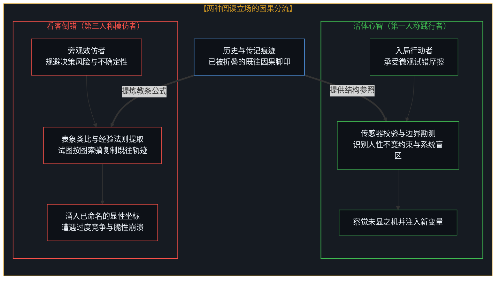
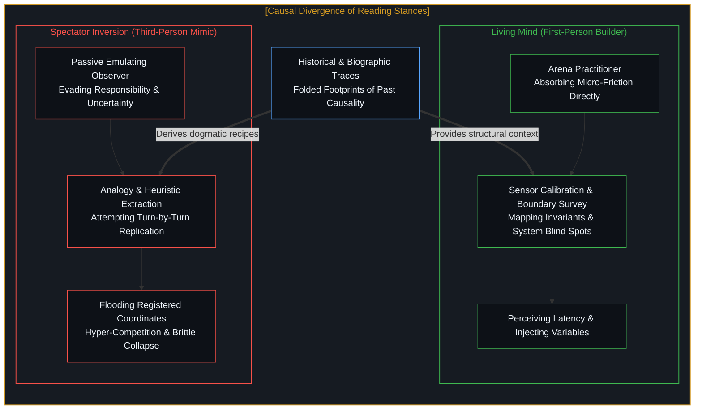
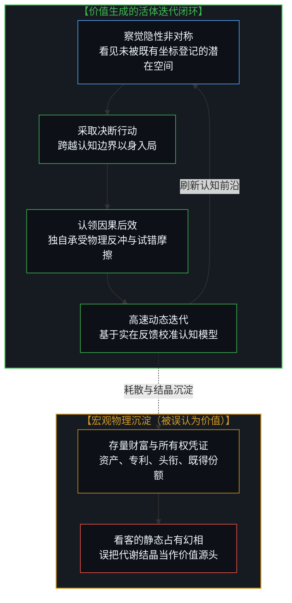
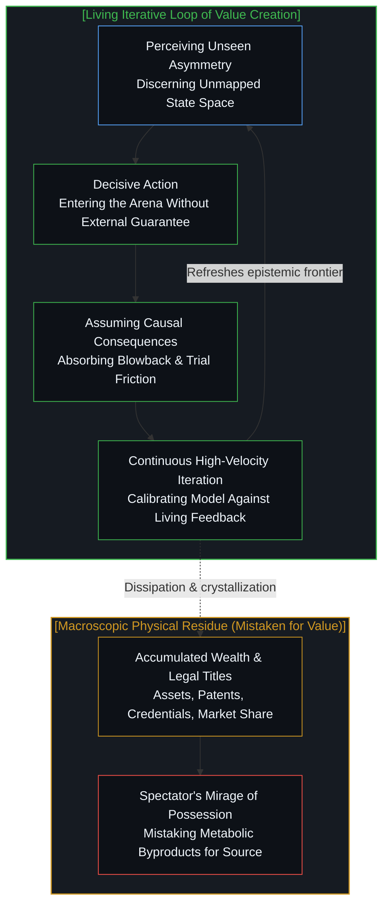
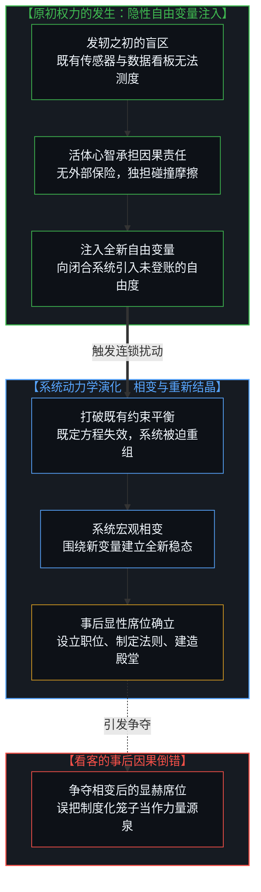
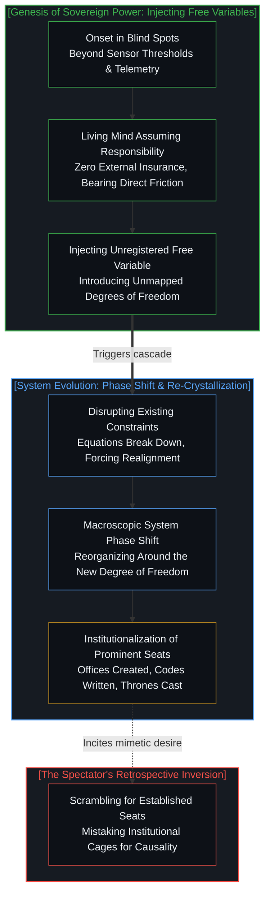

# 隐性自由变量与权力的事后幻相 / The Invisible Free Variable and the Retrospective Illusion of Power

*价值源于感知与迭代而非占有，权力源于注入隐性变量而非占据席位 / Value arises from iterative perception, not possession; power from invisible variables, not seats.*

传记与历史叙事热衷于将宏大的成就描摹为一种事后可见的清晰轨迹，引得无数效仿者试图通过类比与经验法则复制胜利的果实。然而，所有的事后归因都无法解释创生最初的跳跃；价值从来不是静态存量的占有，而是察觉未显之机、基于察觉采取行动、对后效承担责任并动态迭代的生命闭环；权力也并非在系统相变完成后占据显赫席位，而是在发轫之初无人注视的盲区，主动认领因果责任并向复杂系统注入隐性自由变量的决断。

Biographies and historical chronicles habitually depict monumental triumphs as clear, legible trajectories after the fact, tempting countless emulators to reproduce success through analogy and heuristic playbooks. Yet retrospective attribution cannot account for the genesis of the leap itself. Value is not the passive possession of accumulated stock, but a living loop of perceiving unseen asymmetries, acting upon them, bearing the full weight of consequences, and iterating continuously. Likewise, power is not the occupation of a prominent seat once a system has already undergone its phase change, but the sovereign willingness to shoulder responsibility and inject an invisible free variable into the complex fabric of reality at its onset.

---

## 一、 传记的看客陷阱：痕迹的类比与因果的倒错 / 1. The Spectator's Biographic Trap: The Analogy of Traces and Causal Inversion

在大众商业文化与成功学传播中，传记阅读与历史探究始终占据着神圣的地位。以各类聚焦传奇创始人的播客与长篇传记为代表，人们沉迷于拆解洛克菲勒如何控制炼油颈部、乔布斯如何力推封闭一体化、或者拿破仑如何在战场侧翼调度骑兵。数以百万计的看客抱着一种近乎宗教式的虔诚研读这些故事，坚信历史在不断重演，只要通过类比从历史痕迹中提取出行动法则，就能在当前的现实中依样画葫芦，推演出属于自己的伟大胜局。这种思维定势预先假定：卓越的路径是一条已经铺就的轨道，后人只需借助望远镜看清前人的脚印，便能绕过探索的混沌。

In popular commercial culture and success literature, the reading of biographies and historical inquiry has long held a revered status. Exemplified by long-form founder podcasts and encyclopedic biographies, culture is obsessed with dissecting how a titan seized a distribution bottleneck, how an innovator enforced end-to-end integration, or how a general maneuvered cavalry across a flank. Millions of spectators consume these narratives with near-religious devotion, convinced that because human nature endures, one can extract operational rules from past footprints through analogy, project them onto current challenges, and engineer an equivalent triumph. This mindset presumes that exceptional achievement follows a paved rail, requiring only a clear optic on historical footprints to bypass the fog of genuine exploration.

然而，必须辨明的是，许多卓越行动者确实酷爱研读历史与人物传记，这种借鉴与对照的效用是显著的。在真实世界中搏杀的创造者，阅读历史从来不是为了寻找操作手册，而是将先人的试错轨迹当作一面高维的校验之镜：用来校准自身的认知传感器，认清人性在重压下的不变反应，识别组织耗散与因果摩擦的边界，从而在遭遇险境时获得参照。旁观者犯下的认知倒错，在于误将这种事后的“校验支架”当成了“致胜因果”；看到成功者书架上摆满传记，便以为阅读传记和抄袭类比就是成功的源头。这恰如看见冠军冲过终点线时穿着某双跑鞋，便断言正是这双跑鞋创造了奔跑的爆发力。

Crucially, exceptional practitioners genuinely voraciously read history and biographies; the utility of historical reference and calibration is undeniable. Yet for creators actively wrestling with real-world friction, historical reading is never an operational manual. Instead, they use past trajectories as a high-dimensional mirror for calibration: to tune their perceptual sensors, recognize recurrent psychological blind spots under stress, and map the invariants of organizational decay and system friction. The spectator commits a profound causal inversion by mistaking this retrospective calibration scaffolding for generative causality itself. Observing that accomplished founders keep libraries of history, the imitator assumes that reading biographies and applying historical analogies generated their triumph, much like observing a champion cross the finish line in a specific shoe and concluding the footwear authored the stride.

当效仿者试图通过类比与经验法则来指导行动时，他们不可避免地跌入了痕迹的死角。类比在逻辑上只能建立在“已被命名的已知坐标”之间；它要求目标系统与源系统在结构上具有可比性，这意味着进入类比视野的所有要素，都已经是既有现实中被登记在册的存量信息。一旦某种商业模式或战略要素能够被清晰类比，它就已经变成了全市场都能看见的显性约束，成千上万的资本与人力会同时涌向这个坐标，将预期的信息收益迅速抹平。依靠类比去寻找未来的突破，就如同在明亮的路灯下寻找丢失在暗处的钥匙，无论逻辑推演多么自洽，也无法触及真正的生发点。正如我们在[未历摩擦的心智与借来的全能](../the-unfrictioned-mind-and-borrowed-omnipotence/)中所揭示的那样，未曾历经第一人称试错摩擦的心智，无论借用多么高明的历史模式，一旦面对真实的未知扰动，其构建的繁荣泡沫都会在瞬间脆断。

When emulators attempt to steer action through analogy and heuristic rules, they inevitably fall into the blind spot of frozen traces. Analogy can only function across previously registered, named coordinates. It requires structural symmetry between the source and the target, which guarantees that every element admitted into the analogy consists of established, legible information already logged in the system's ledger. The moment an operational playbook or strategic move can be clearly articulated via historical analogy, it has already transformed into a public constraint. Capital and crowds instantly converge on that explicit coordinate, extinguishing any informational surplus. Seeking an evolutionary frontier through analogy is like searching for lost keys exclusively beneath a streetlamp because the light is brighter there. As demonstrated in [The Unfrictioned Mind and Borrowed Omnipotence](../the-unfrictioned-mind-and-borrowed-omnipotence/), a mind that has never absorbed the personal friction of exploratory trial can borrow the most brilliant historical models, yet its simulated omnipotence shatters the moment it encounters unregistered reality.

---

## 二、 价值的本体论真相：察觉与迭代的闭环，而非存量的占有 / 2. The Ontological Truth of Value: The Perception-Iteration Loop, Not the Possession of Stock

在看客的常规注视中，“价值”几乎总是被具象化为一系列可见的占有物。社会的度量衡习惯于用资产规模、资产负债表上的数字、独占的技术专利、或者显赫的社会头衔来定义一个主体的价值。这种静态的存量观给人们植入了一种幻相：仿佛价值本身是一种被锁在保险库或固定在股权凭证上的坚硬物质，只要占有了这些实体，便获得了其背后的创造力。效仿者因而将毕生精力耗费在“占有”的争夺上，用借来的评级与外在的标签粉饰自身，试图通过跻身于既有财富形态的占有者行列，来证明自身的价值。

In the conventional gaze of the spectator, "value" is almost invariably reified into a catalog of visible possessions. Societal ledgers measure value through accumulated asset volumes, balance sheet net worth, proprietary patents, or institutional titles. This static view of stock instills the illusion that value is a solid substance locked inside bank vaults or inscribed upon equity certificates, and that possessing these entities automatically confers the generative agency that produced them. Emulators consequently squander life contending for mere possession, adorning themselves with borrowed credentials and external badges, attempting to validate their worth by joining the ranks of those holding established forms of wealth.

然而，如果从第一人称的动态因果视角切入，价值的真实面貌会显现出截然相反的拓扑结构。价值从不是由静止的“占有物”所界定的，它是一种**活体的主权能力**：能够看见他人所不能看见的隐性失衡与潜在需求，基于这种非对称的察觉采取主动行动，毫无保留地为这一行动在物理世界中引发的全部反冲与后果承担因果责任，并在持续的反馈摩擦中不断修正认知、高速迭代。一个拥有百亿资产的企业，如果其内部丧失了这种察觉未知与承担试错的能力，其庞大的资产便会在外部环境的微小扰动下迅速沦为负债；而一个身无分文却具备这种完整闭环的心智，哪怕被置于荒芜之中，也能迅速开辟出全新的价值流动通道。

In contrast, from the dynamic vantage of first-person causality, value presents an entirely opposing topology. Value is never defined by static possession; it is a **living sovereign capacity**. It is the ability to perceive latent imbalances and opportunities that others overlook, to act decisively upon that asymmetric perception, to assume complete causal responsibility for the physical reverberations of that act, and to iterate rapidly through continuous friction and feedback. An enterprise possessing massive capital reserves will watch those reserves turn into crushing liabilities under slight environmental shifts if it loses the internal capacity to perceive the unmapped and bear exploratory friction. Conversely, a living mind possessing this complete iterative loop, even if stripped of all tangible assets and cast into wilderness, inevitably carves open fresh conduits of value.

宏观世界所能看见的资产、货币与所有权凭证，仅仅是这种活体因果闭环在物理介质中留下的“代谢沉淀”。如同生命体在呼吸与转化能量的过程中排出坚硬的贝壳或骨骼，所谓的“财富存量”是过去无数次微观察觉、决断与试错沉淀下来的宏观痕迹。误将占有当作价值，就如同误将石化的古生物化石当作具有新陈代谢能力的生命活体。正如在[主体性的折现](../the-discount-on-agency/)与[前台的寓言与缺席的因果倒置](../the-receptionist-parable-and-the-causal-inversion-of-absence/)中所展现的逻辑，一旦行动者将注意力从原初的因果闭环转移到对事后痕迹的固守上，他便主动将自身的主体能动性折现为了系统的被动零件，终将在存量的防御中走向耗散。

The visible assets, currencies, and deeds recorded by the macroscopic world are merely the metabolic residue left behind by this living causal loop. Just as a biological organism secretes an exoskeleton as a byproduct of its metabolic energy exchange, accumulated wealth represents the frozen footprint of past instances of perception, decision, and friction. Mistaking possession for value is equivalent to mistaking a petrified skeleton for a breathing organism capable of self-directed metabolism. As articulated in [The Discount on Agency](../the-discount-on-agency/) and [The Receptionist Parable and the Causal Inversion of Absence](../the-receptionist-parable-and-the-causal-inversion-of-absence/), the moment an actor shifts attention from the primary generative loop to the defensive preservation of historical residue, they discount their sovereign agency, reducing themselves to a passive component awaiting structural obsolescence.

---

## 三、 权力的深层拓扑：注入隐性自由变量，而非占据显性席位 / 3. The Deep Topology of Power: Injecting Invisible Free Variables, Not Occupying Visible Seats

比价值更易遭受认知扭曲的范畴是“权力”。在历史长卷与大众媒体的镜头下，权力的意象总是与显性的相变高峰期紧密绑定。当一个行业发生地壳运动般的重组，当一个国家经历剧烈的政权更迭，或者当一家企业完成跨越式并购时，聚光灯总是打在那些端坐于最高席位上的人身上：他们签字盖章、发号施令、接受万众欢呼。看客由此形成了一种根深蒂固的联想，认为所谓的权力就是“在可见的系统相变中占据那个最显赫的关键席位”。因此，权术斗争与官僚晋升便沦为对既有席位的血腥肉搏，人们相信只要争抢到了最高宝座，支配系统的力量便会自然落入掌心。

Even more vulnerable to cognitive distortion than value is the concept of "power." In historical chronicles and mass media, power is routinely fused with the visible crest of macro phase transitions. When an industry undergoes tectonic reorganization, when an empire collapses, or when an enterprise executes a historic acquisition, the spotlight falls exclusively upon figures occupying prominent apex seats: signing treaties, issuing decrees, and receiving public acclaim. Observers naturally develop the conviction that power is the act of "occupying the commanding seat during a visible phase shift." Consequently, political maneuvering and corporate climbing degenerate into vicious zero-sum battles over existing seats, operating under the naive belief that seizing the high throne automatically transfers the systemic force that governs the domain.

然而，系统动力学与因果律揭示了截然不同的深层真相：**权力是在系统发轫之初，主动认领责任并向其中注入全新“自由变量”的意愿与能力**。为了理解这一点，必须严格区分系统中的两类变量：约束变量与自由变量。一个稳定运行的复杂系统，其内部充斥着无数“约束变量”；它们是已经制度化的规则、公认的定价机制、成文的法律、既有的组织结构以及显性的绩效指标。约束变量彼此咬合，构成了一张自洽但僵死的因果之网。所有试图在显性席位上发号施令的人，其权力范围其实都被这张网严密地约束着；他们所能做的，仅仅是在既定方程的约束边界内微调参数。这种表象上的权力，正如我们在[权力的镜像握手](../the-mirror-handshake-of-power/)中所指出的，不过是被统治者因规避责任而自愿让渡主权后所拼凑出的借来质量，稍有风吹草动便会化为乌有。

System dynamics and causality expose a vastly different reality: **power is the willingness and capacity to assume responsibility and inject an unregistered "free variable" into a complex system at its onset**. To grasp this distinction, one must rigorously contrast bound variables with free variables. A stable, established complex system is defined by "bound variables": institutionalized protocols, explicit pricing mechanisms, codified statutes, rigid org charts, and visible metrics. These bound variables interlock, forming an internally consistent yet rigid causal lattice. Anyone attempting to wield authority from an established seat is bound by this very mesh; they can merely nudge parameters within predefined equations. Such apparent authority, as demonstrated in [The Mirror Handshake of Power](../the-mirror-handshake-of-power/), is an illusion constructed from the borrowed mass of subjects surrendering their agency to evade responsibility, liable to dissolve the moment that passive compliance falters.

真正的权力生发于全然不同的维度：它来自一个不甘受制于既有方程的活体心智，在系统未曾察觉的隐性边界处，注入了一个未被定义的自由变量。这个变量在发轫之初是隐匿不彰的；系统现有的传感器检测不到它，既有的数据看板没有它的列名，市场没有对它的估价，法律也未曾对其作出规定。正因为它隐匿于黑暗之中，**外部系统不可能为它提供任何风险补偿或制度护航**。注入自由变量的行动者，必须以自己的生命能量、声誉乃至生存为抵押，独自承担这一未知变量与庞大既有系统相互碰撞所激发的一切摩擦。正如在[自由变量的同构与先验主权](../zi-you-bian-liang-de-tong-gou-yu-xian-yan-zhu-quan/)与[残差的自由变量](../the-residue-and-the-free-variable/)中所确立的准则，这才是原初因果力量的唯一真实发端。

Authentic power originates in an orthogonal dimension: it arises when a living mind refuses to be bounded by existing equations and introduces a free variable into an unmapped boundary of the system. At its onset, this variable is entirely invisible. Current sensors cannot detect it, management dashboards possess no column for its measurement, markets have assigned it no price tag, and legal codes offer it no category. Precisely because it is invisible, **the system cannot provide insurance, consensus, or institutional shelter**. The actor injecting this free variable must stake their own cognitive bandwidth, standing, and survival, shouldering all the turbulence unleashed when an unmodeled degree of freedom strikes the incumbent machine. As established in [Isomorphism of Free Variables and A Priori Sovereignty](../zi-you-bian-liang-de-tong-gou-yu-xian-yan-zhu-quan/) and [The Residue and the Free Variable](../the-residue-and-the-free-variable/), this constitutes the sole authentic genesis of causal power.

当这个隐性的自由变量在系统内部持续激荡，迫使既有的约束变量无法维持原有的平衡时，系统便被迫发生宏观相变，围绕着这个原本不存在的变量重新凝固、结晶。只有在这个时候，原本隐蔽的变量才终于变成显性的事实。此时，官僚系统会赶来为它设立新的部门，法律会出台新的监管条款，商学院会为它总结出新的战略理论，传记作家会写下激动人心的转折章节。那个在相变后被设立起来的显赫席位，不过是系统为了容纳这个已经被驯化的变量而建造的笼子。看客为争夺笼子打破了头，却从未意识到：真正的支配力在变量被注入、无人知晓的那一刻，就已经完成了裁决。

As this invisible free variable reverberates through the system, rendering existing equations incapable of preserving equilibrium, the entire apparatus is forced into a macroscopic phase transition, reorganizing and crystallizing around the intruder. Only then does the once-invisible degree of freedom register as an objective fact. At that juncture, bureaucracies erect departments to manage it, regulatory bodies draft statutes to govern it, business schools construct case studies to explain it, and biographers write glowing accounts of the triumph. The prominent seat erected post-transition is merely a gilded cage designed to house an already-domesticated variable. Spectators tear one another apart to claim the cage, utterly oblivious to the truth that sovereign power completed its operative work at the unrecorded instant when the free variable was injected into the void.

---

## 四、 自指的界限与第一人称的终极因果 / 4. The Self-Referential Boundary and the Ultimate First-Person Causality

任何试图将成功与权力固化为客观知识体系的努力，都在其底层遭遇了严酷的自指不完备性。正如哥德尔在数理逻辑中所证明的那样，一个形式系统无法在内部同时证明自身的完备性与一致性；一切在事后看起来无懈可击的理论，都唯有在**拒绝将自身应用于自身的前提**时，才能勉强维持表面的自洽。如果一部关于商业帝国的传记所提炼出的行动法则是一套完备的科学，那么它在逻辑上必须能够普适化。然而，一旦所有人都按照这套法则行动，它所承诺的非对称优势便立刻归零；不仅如此，这套理论无从解释其传主最初的成功——因为那位传主在创造奇迹的当口，恰恰打破了当时公认的经验法则，冒着粉身碎骨的风险向虚空中跨出了一步。

Any endeavor to codify success and power into an objective, transferable doctrine encounters the unyielding barrier of self-referential incompleteness. As Kurt Gödel established within mathematical logic, a formal system cannot demonstrate both its completeness and internal consistency from within. Every retrospective narrative that appears airtight maintains its consistency solely by **refusing to apply its own explanatory machinery to its generative premises**. If the operational maxims extracted from a founder's biography constituted an objective science, they would hold universally under application. Yet the moment all actors deploy the heuristic, the asymmetric surplus promised by the model vanishes. More fatally, the doctrine cannot account for the founder's own genesis—because the founder broke through precisely by violating the reigning heuristics of their day, stepping unprotected into an unmodeled void.

这种理论的自我回避，在现代物理学的经典叙事中有着极其精确的镜像。在[双生子佯谬与隐秘观察者](../the-twin-paradox-and-the-hidden-observer/)中，狭义相对论宣称一切惯性运动都是相对的，物理定律在所有惯性系中保持一致；然而，当面对旅行双生子返回后究竟谁更年轻的佯谬时，相对论为了维持因果一致性，却悄悄在后台请回了一个外在的、未被相对化的宇宙全局坐标，以此来断言飞船的加速具有客观非相对性。成功学的经验法则犯下了如出一辙的偷梁换柱：它向人们兜售一套无需承担原初风险的理性模型，却在暗中借用了那个无法被模型化的活体心智所投入的孤注一掷。它宣称是既有的方法造就了英雄，却掩盖了正是英雄在没有方法可用时的冒险决断，才赋予了这套方法事后被书写出来的可能。

This theoretical evasion mirrors foundational debates in modern physics. In [The Twin Paradox and the Hidden Observer](../the-twin-paradox-and-the-hidden-observer/), special relativity posits that all inertial motion is relational, holding invariance across arbitrary inertial frames. Yet, when confronted with the paradox of which reunited twin has aged less, the standard resolution maintains consistency by quietly smuggling in an unacknowledged cosmic background frame to treat acceleration as an objective non-relative departure. Retrospective success theories commit an identical sleight of hand: they peddle an ostensibly objective manual free of unhedged personal risk, while secretly resting upon the uninsurable gamble of a sovereign mind. They proclaim that the methodical framework birthed the pioneer, obscuring the generative reality that the pioneer's willingness to act without a framework made the subsequent writing of the method possible.

走出看客的席位，意味着从对事后痕迹的崇拜中醒来。历史长卷与创始人传记确实是不可多得的清醒剂，但它们的作用仅仅是在行动者拔足狂奔时，提供一面辨识悬崖与泥潭的冷眼之镜。没有任何书页能替你承担未知的重量，没有任何类比能赋予你真正的权力。价值从来不是你从外部世界攫取并锁进抽屉的战利品，而是你在日复一日的审视、践行、承担后效与动态迭代中锻造出的生命本能；权力也不是你在他人搭建的舞台上争抢到的那个显赫坐席，而是你在无声的黑夜中，敢于向未知的系统注入一个唯有你自己愿意为其买单的隐性自由变量。在不可分割的第一人称当下，唯有以身入局的摩擦，才是因果展开的唯一锚点。

To abandon the spectator's gallery requires awakening from the idolatry of frozen footprints. The annals of history and founders' biographies remain invaluable instruments of clarity, but only as reflective mirrors revealing cliffs and quagmires while one is already in full stride. No page can bear the gravity of the unknown on your behalf, and no analogy can bestow authentic power. Value is never a trophy plundered from without and locked inside a vault; it is the living instinct forged through discerning the unseen, executing with conviction, shouldering consequences, and iterating relentlessly. Power is not a decorated chair contested on someone else's stage, but the sovereign courage to inject an invisible free variable into the dark, accepting total personal responsibility for its wake. In the indivisible immediate present, the friction of sovereign participation remains the sole anchor through which causality unfolds.
