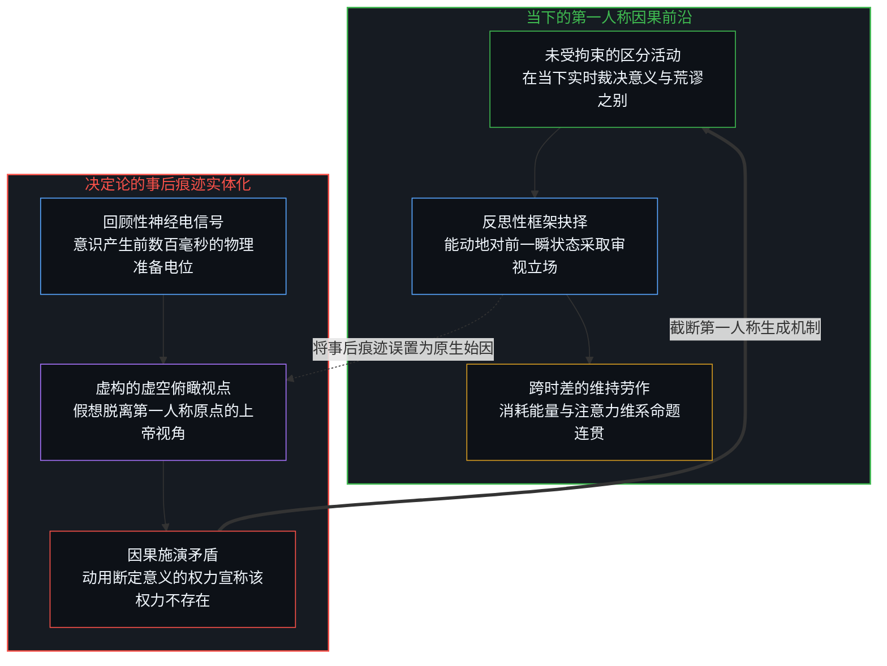
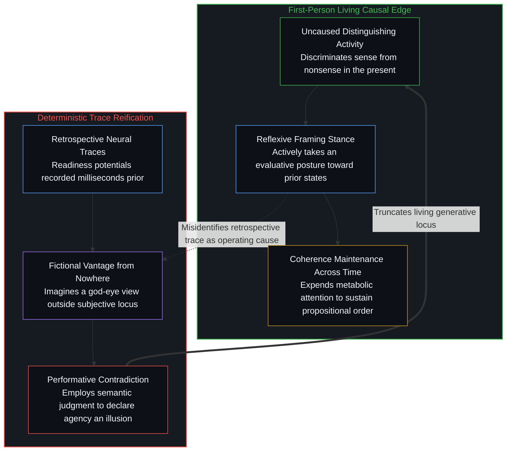
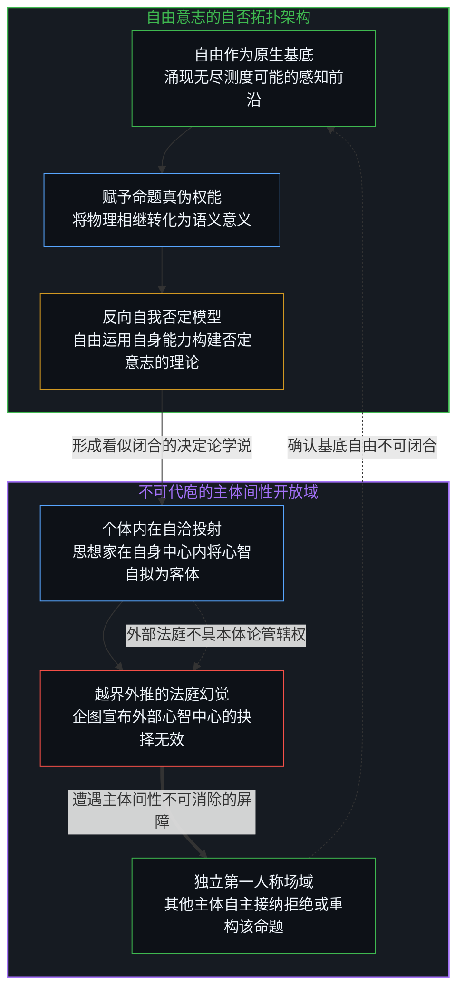
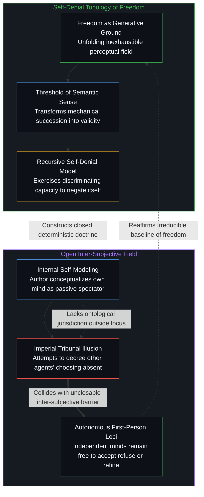

# 自由意志的自否自由 / The Freedom of Will to Deny Itself

*否定意志的雄辩，正是自由行使其区分意义与荒谬主权能力的展演。 / The eloquence denying will is freedom exercising its sovereign capacity to distinguish sense from nonsense.*

公共哲学讨论中频繁出现一种宣称终结自由意志的裁决：认为自由意志毫无意义，因为个体的念头与决断皆由意识未曾参与编写的先在因果链条所催生。这种宣判看似站在现代脑科学与物理决定论的高地上俯视众生，实则在发出宣告的瞬间便陷入了深刻的施演矛盾。宣称自由意志不存在的整套理论建构，从一开始就运行在它试图消解的区分能力之中。能够将一套论证判定为合乎逻辑或荒谬悖谬，本身就是自由心智在当下行使的主权行为；正是因为自由拥有连自身都可以全盘否定的自否空间，世间才存在意义与荒谬的界限，才容得下这种自相矛盾的高谈阔论。

Public philosophical debates frequently deliver a finished verdict on human agency: free will makes no sense, because thoughts and decisions arise from prior causes that consciousness does not author. This assertion presents itself as a dispassionate scientific deduction from modern neuroscience and physical determinism, yet it collapses into a profound performative contradiction the moment it is uttered. The conceptual architecture that declares free will nonexistent operates entirely within the very capacity for discrimination it seeks to erase. Evaluating an argument as sensible rather than nonsensical requires the active sovereignty of mind in the immediate present. Because freedom encompasses the capacity to deny its own existence, the boundary between sense and nonsense exists at all, leaving room for such elaborate self-refuting claims.

## 一、 裁决的内置性与虚构的俯瞰视点 / 1. The Immanence of Verdict and the Fictional Vantage from Nowhere

决定论者对自由意志的经典反驳，习惯于勾勒一条清晰的时间单向序列：脑神经元放电、无意识的生化反应、潜意识记忆的涌动，构成了意识觉察之前的漫长暗区，随后的念头只是这片暗区推向前台的既定产物。我们可以充分承认事件在时间维度中展开的因果叙事，无论哲学家如何细致地描述神经准备电位，如何将决策过程归因于无意识的物质运动，这些实证描摹本身都属于合法的经验记录。然而真正的认知越界，发生在观察者将这份描述误以为已经跳出了正在进行描述的观察视点之时。

在本体论的坐标系中，断然不存在一个漂浮于经验之外的客观法庭，能够独立于第一人称视角为上述论断颁发终极认证证书。所有的理论断言、实验读数与逻辑推导，全都在此时此刻的第一人称心智内部发生。[表征的闭环](../the-closed-loop-of-representation/)早已揭示，人类从来无法脱离自身认知模型的投影去窥见毫无杂质的裸露真相。理论家可以说得好像自己正置身于无何有之乡，从上帝视角俯瞰整个宇宙的因果发条，但他断然无法真正肉身入住那个虚构的终极视点。第一人称视角与因果律本就是一枚硬币的两面：因果并不是独立于主体的机械碰撞，而是心智确认自身行动与外部世界产生摩擦的历史刻痕。当思想家试图割裂第一人称原点去宣称意志是幻觉时，他只是用语言假装自己退出了世界。而在[框架的盲区](../the-blind-spot-of-the-frame/)中，这种退出的戏法被进一步暴露为方法论操作与本体论缺席的范畴混淆：研究者为了建立客观模型而主动隐去主体，随后却将模型中主体的空缺当成了意志不存在的铁证。同样的自否结构也出现在心灵哲学中：[无人能持有的功能主义](../the-functionalism-no-functionalist-can-hold/)剖析了功能主义者如何以认真持有的姿态宣称认真不过是因果角色，在占据观察者之位的同时抹去观察者。意识形态说服自由否定自身，借此为主体写好剧本，[道德倒错与被脚本化的主体](../the-moral-reversal-and-the-scripted-subject/)对此有所揭示。

The standard deterministic refutation of free will relies on a clean temporal sequence: neural precursors, unconscious determinants, and electrochemical cascades generate the darkness from which the next thought appears. A causal narrative of how events unfold across physical time can be granted without objection; neural preparations and biological substrates may be documented with whatever precision empirical science attains. The overshoot begins when the description is treated as having stepped outside the perspective in which it is being made.

There is no external vantage from which those statements can be certified as the objective case. The claiming happens here. One can speak as if from nowhere, but one cannot occupy that nowhere. As demonstrated in [The Closed Loop of Representation](../the-closed-loop-of-representation/), all theories, instruments, and interpretations remain immanent to the first-person locus that formulates them. The first-person perspective and causality are two sides of the same coin: causality is not an autonomous machine operating behind the scenes, but the asymmetrical trace registered when conscious agency engages local friction. When a theorist attempts to sever the first-person center from causality to declare will an illusion, they merely simulate an exit from the field of their own awareness. In [The Blind Spot of the Frame](../the-blind-spot-of-the-frame/), this sleight of hand is further unmasked as a confusion between methodological omission and ontological absence: the investigator methodologically brackets the subject to articulate an objective blueprint, only to mistake the subject's absence from the blueprint for proof that agency does not exist. The same self-denying structure recurs in the philosophy of mind: [The Functionalism No Functionalist Can Hold](../the-functionalism-no-functionalist-can-hold/) dissects how the functionalist, holding the view seriously, declares seriousness to be nothing but causal role, occupying the observer position while erasing the observer. Ideology scripts the subject by persuading freedom to deny itself, as [The Moral Reversal and the Scripted Subject](../the-moral-reversal-and-the-scripted-subject/) shows.

## 二、 跨越时差的维持劳作与被掩盖的框架抉择 / 2. The Maintenance of Stances Across Time and the Concealed Choice of Framing

一旦否定自由意志的著作被印刷出版，或者那段犀利的演讲片段被录制传播，它便不再只是意识中转瞬即逝的又一个浮动念头。它凝固成了一个必须在时间流逝中被反复维护连贯性的理论客体。在此后的数年甚至数十年里，学者需要耗费大量的智力与修辞，去向公众解释为何多年前写下的论调依然合理，去回应各路批评者的反驳，去修补逻辑防线上的每一处裂隙。这段跨越漫长时差的辩护劳作，恰恰构成了否定自由意志学说最具讽刺意味的实证样本。

这种对立场的维系，清晰展现了后一个时空截面的行动者正在对前一个时空截面的自身采纳积极的反思姿态。意识从来不是端坐于影院包厢内、被动观赏念头流淌的受控旁观者；意识是在每一个当下觉知到某种认知框架的拣选已经发生，并主动投入生理与认知代谢能量去维系其稳定性的动态活动。[加塞球与魔术戏法](../the-bank-shot-and-the-magic-trick/)表明，外部观察者容易将娴熟的技艺误判为机械必然，却遗忘了维持轨迹连贯所需付出的持续修正成本。那些用来辩护宿命论的滔滔雄辩，并未证明自由抉择已被历史甩在身后，相反，它无可辩驳地展示出：自由抉择的主权能力依然在全负荷运转，只不过它此刻接到的特定指令，是竭尽所能去隐匿它自己的存在。

Once the account is published and distributed, it ceases to be only another transient thought drifting across awareness. It becomes an object whose coherence must be actively defended across elapsed time. Substantial intellectual labor and rhetorical eloquence are subsequently spent demonstrating that the original claim remains valid after intervals have passed. That ongoing maintenance is the empirical exhibit. A later stance is deliberately taken toward an earlier one, evaluating consistency, addressing objections, and repairing structural ambiguities.

Consciousness, in this light, is not a passive spectator standing apart from a mechanical conveyor belt of events. It is the awareness that a specific choice of framing has occurred, coupled with the metabolic commitment to sustain that frame against resistance. As articulated in [The Bank Shot and the Magic Trick](../the-bank-shot-and-the-magic-trick/), an external onlooker routinely mistakes calibrated mastery for mechanical necessity, forgetting the continuous first-person adjustments required to steer the path. The eloquence deployed to defend determinism does not show that sovereign capacity has been transcended. It reveals that capacity operating at full intensity, tasked with the ironic duty of concealing itself.

## 三、 第一因的活动机理与区分意义的主权能力 / 3. The Uncaused Cause as Distinguishing Activity and the Sovereign Threshold of Sense

所谓不可再被归因的第一因，从来不是古典神学中那个高居天外、放射万物的僵死始基。第一因的真实面目，正是此时此刻正在发生的、未受拘束的区分活动。它表现为当下感知中奔涌而来的无尽测度可能性，以及心智决定将哪些可能性显化到聚光灯下、将哪些可能性隐匿于背景之中的离散裁决。正是这个发生于当下的离散行为，将原本单调的物理先后顺序点化为了具有真伪与价值的语义意义。

单凭无意识的物质运动或机械因果传递，既不能产生意义，也无法构成荒谬。山体滑坡、恒星坍缩或者神经元去极化，都仅仅是冷冰冰的物理发生；在一连串不可逆的能量耗散过程中，没有任何一个物理节点拥有资格断定某句话是言之成理还是胡说八道。[真正的有效信息](../what-information-is/)确立了信息的底层性质：信息即是区分。决定论者写书批判自由意志，本身就是将这种区分意义与荒谬的主权能力，调集起来为一套宣称该能力不存在的假说服务。更进一步，正如在 [抉择的跨界](../the-boundary-crossing-of-choice/) 中所深入解构的，这种宣称试图将所谓讲得通的可重复性抽象凌驾于具身行动之上，却遗忘了其发声做功本身就是一次不可逆的单次物理刻写。这正是自由最极致的形态：它拥有不可剥夺的开阔空间，以至于自由到可以自由地构筑一整套严丝合缝的逻辑模型来否决它自身。如果心智不具备这种自由否决自由的潜能，世间便只剩下冰冷的机械连锁，断然不可能涌现出任何理性的评判与审视。这种自否结构不仅在形而上学层面体现为理论家构筑决定论模型，更在微观存在层面体现为个体将注意力锁定于不可得选项并宣称毫无选择；[约束基底与自由自否](../the-substrate-of-constraint-and-the-self-denial-of-freedom/) 进一步将这种自否机制拓展到了行动哲学中：约束从来不是剥夺自由的牢笼，而是赋予选择以差异化维度的操作基底，一个人感到被困住的时刻，正是自由以自我否定的姿态在全力运转。解除自卫的共情，是自由在关系中否定自身，[共情的能力倒错与边界的排序之争](../the-capability-reversal-of-empathy-and-the-contest-of-boundaries/)说明了这一点。

The uncaused cause is not a mythological prime mover stationed outside reality, nor an extra ghostly mechanism inserted into the machine. It is the inexhaustible field of potential determinations arriving as the immediate perceptual present, coupled with the discrete act that selects which determinations are brought into the open and which remain concealed. That act is the choice occurring now. It is what transforms mere physical succession into semantic sense, and what can just as easily turn sense into a denial of itself.

Mechanical succession possesses no inherent semantic validity. A landslide, an exploding star, or an action potential propagating down an axon is neither sensible nor nonsensical; it simply occurs. "Sense" and "nonsense" exist only because an active agency discriminates between them. The deterministic argument against free will is one such manifestation: the very capacity that distinguishes coherent reasoning from absurdity is deployed to produce the claim that the capacity is an illusion. Furthermore, as dismantled in [The Boundary Crossing of Choice](../the-boundary-crossing-of-choice/), this argument attempts to elevate repeatable non-physical abstractions above living action, ignoring that the physical act of vocalization is itself an irreversible, singular physical inscription. This constitutes the ultimate expression of freedom: agency is so sovereign that it is free even to deny itself. Without that baseline of self-denying freedom, reality would contain only deterministic mechanical collisions, leaving no conceptual space for evaluation, truth, or argument. This self-denying dynamic operates not only at the metaphysical level where theorists construct deterministic models, but also at the microscopic existential level where agents fixate on unavailable options to decree their own helplessness. As extended into the philosophy of action in [The Substrate of Constraint and the Self-Denial of Freedom](../the-substrate-of-constraint-and-the-self-denial-of-freedom/), constraints function not as prisons, but as the indispensable physical substrate through which choice acquires causal traction; the felt experience of captivity is the very sovereignty of freedom operating in self-denial. Empathy that disarms self-defense is freedom denying itself in relationships, as [The Capability Reversal of Empathy and the Contest of Boundaries](../the-capability-reversal-of-empathy-and-the-contest-of-boundaries/) shows.

## 四、 不可闭合的主体间性与第一人称的不可越俎代庖 / 4. The Unclosable Inter-Subjective Field and the Inalienability of the First Person

思想家固然可以在其内部世界中建立一套模型，将自己所产生的念头认定为充分由外部先验因果所摆布，他有权将自身的心智体验解释为木偶式的被动受体。然而他断然无法跨出自身的认知边界，去占据一个凌驾于所有生命之上的法庭席位，向所有其他独立的第一人称中心发布剥夺自由意志的判决文书。宇宙中不存在任何超然的司法机构，能够穿透另一个心智的内部视界，并代其裁定选择的缺位。

正如我们在[主权选择的两面性与观察的客体化](../the-two-sided-nature-of-sovereign-choice-and-the-objectification-of-observation/)以及[自由的测不准](../zi-you-de-ce-bu-zhun/)中所阐明的，外部观察所测得的统计概率与机械规律，仅仅是微观内部主权抉择在外部坐标系中的几何投影。其他人始终保有属于自己的开阔腹地：他们可以选择接纳这套否定意志的理论，可以选择将其当作荒谬之谈予以拒绝，可以选择对其进行更高维度的深化，甚至可以用同样的主权能力构建出反向的批判武器。这种他人永远保留的能动余地，绝非任何决定论者单凭言辞就能强行封闭的禁区。因为使他人得以反思和拒绝这套言论的先验敞开性，正是当初允许思想家写下否定自由意志文稿的原生土壤。

A philosopher may apply that denial to the thoughts that arise as their own, modeling consciousness as an authorless spectator of prior determinants. What they cannot do is occupy a transcendent station from which the same verdict is issued as binding upon every other first-person locus. There is no outside court equipped to inspect another center's choosing and declare agency absent.

As detailed in [The Two-Sided Nature of Sovereign Choice and the Objectification of Observation](../the-two-sided-nature-of-sovereign-choice-and-the-objectification-of-observation/) and [The Uncertainty of Freedom](../zi-you-de-ce-bu-zhun/), external measurements of physical predictability or statistical noise are low-dimensional projections of internal sovereign navigation. Other minds remain free: free to accept the deterministic denial, to refuse it, to refine its boundaries, or to direct the same discriminating capacity against its premises. That residual openness cannot be closed by proclamation. It is the identical uncaused freedom that allowed the denial to be formulated in the first place.

