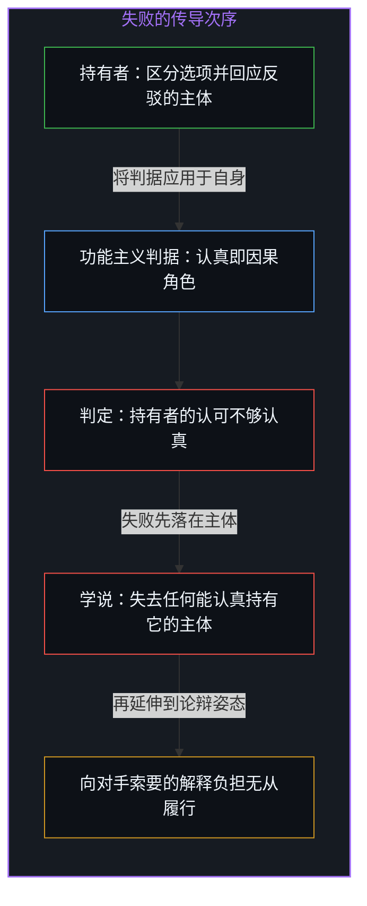
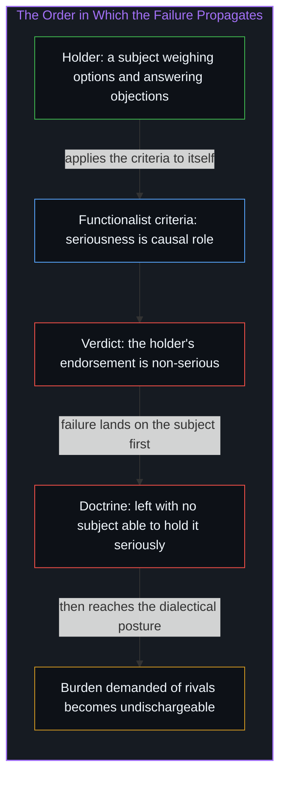
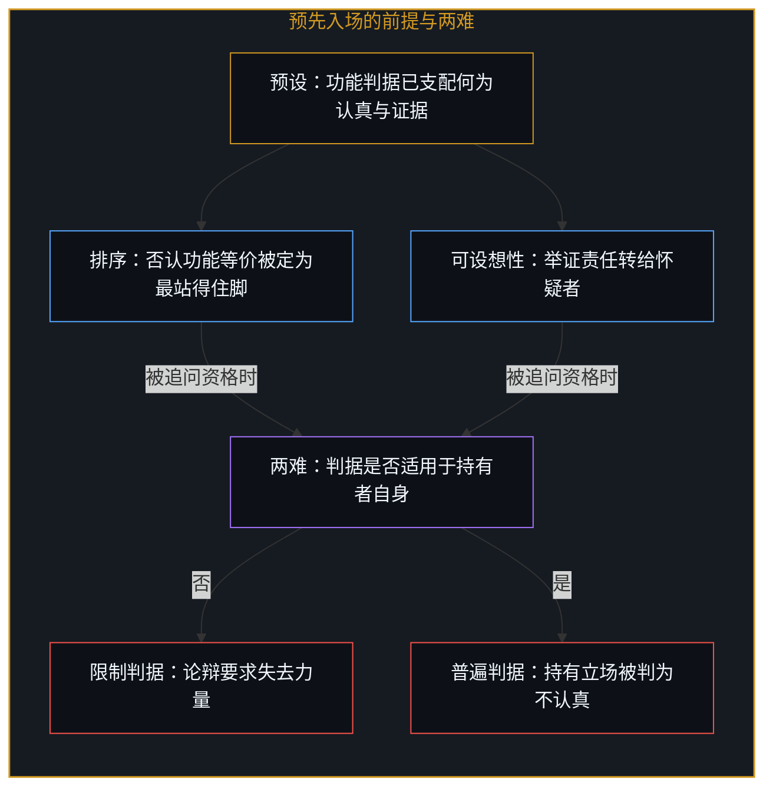
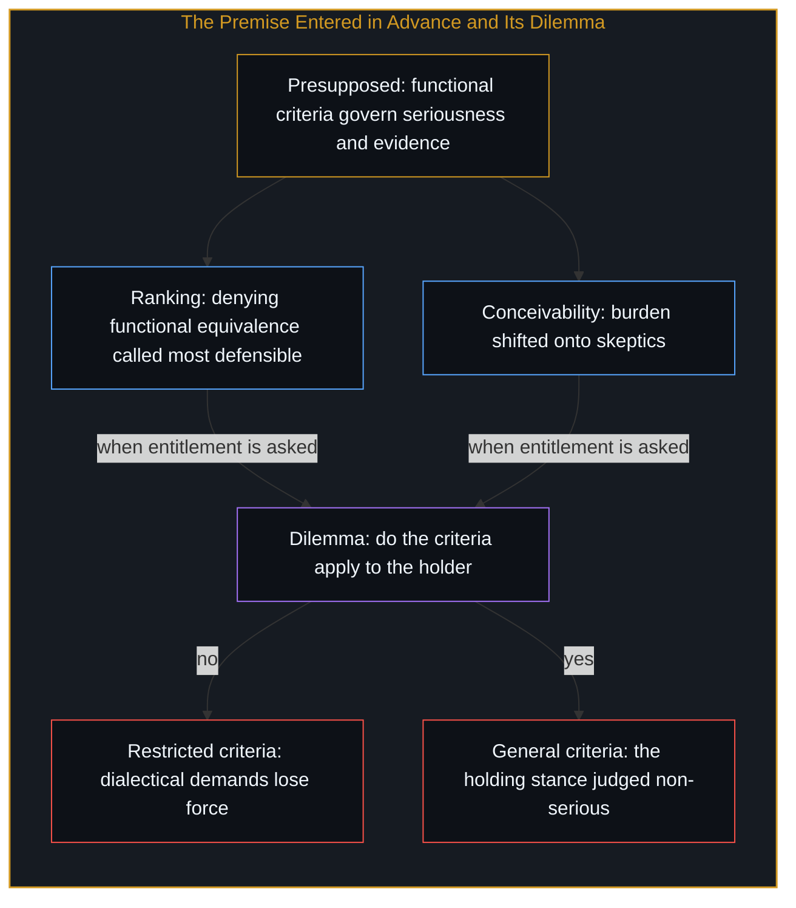
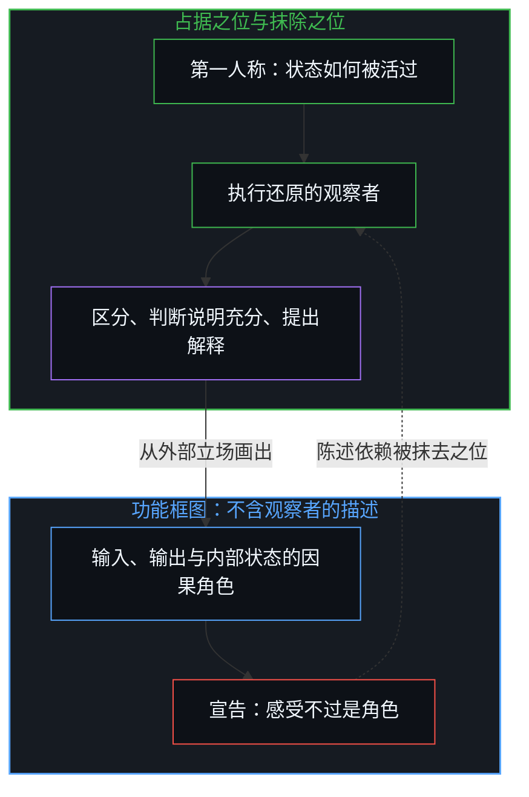
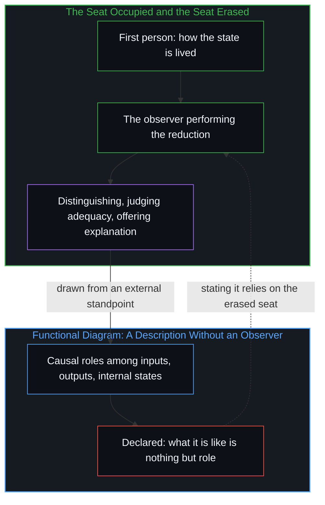

# 无人能持有的功能主义 / The Functionalism No Functionalist Can Hold

*功能主义者必须先占据观察者之位，才能用功能主义抹去观察者。 / The functionalist must first occupy the observer's position in order to erase the observer with functionalism.*

功能主义只以因果角色来界定心理状态，即一个状态与感官输入、行为输出以及其他内部状态之间的系统关系，而与任何特定的物质基底无关。在关于人工意识的争论中，这一论题常被当作归属心智的充分条件：只要实现了相应的组织结构，相应的心理状态便已在场。困难在于，这一主张多半是以断言而非论证引入的，而且任何接受其自身标准的主体，都无法自洽地占据它。

Functionalism defines mental states exclusively by their causal roles, the systematic relations they bear to sensory inputs, behavioral outputs, and other internal states, independent of any particular material substrate. In debates over artificial consciousness the thesis is commonly advanced as sufficient for attributing mentality: realize the relevant organization and the corresponding states are present. The difficulty is that this claim is characteristically introduced by assertion rather than secured by argument, and that it cannot be coherently occupied by any subject who accepts its own standards.

## 一、 认真持有需要一个主体 / 1. Serious Holding Requires a Subject

“被认真对待”并不是一种学说能够独自拥有的属性。它是一种认知立场，只有当某个主体实现了相应的角色时才存在：在不同选项之间作出区分，对反驳保持回应，并把这一观点当作约束后续判断的依据。一套学说不会认真持有它自己，正如一张地图不会阅读它自己。功能主义恰好提供了评估任何此类立场的判据。当这些判据被应用到那位声称认真对待该理论的主体身上时，构成其认可的那些角色，在理论自身的说明下，并不符合“认真”的资格：认真被还原为一组可以由任何足够复杂的组织结构实现的输入输出关系，它便不再能区分一位思考者对理由的回应与一台机器对刺激的反射。

Serious endorsement is not a property a doctrine can possess on its own. It is a cognitive stance that exists only when a subject instantiates the relevant roles: discriminating alternatives, remaining responsive to objections, and treating the view as constraining further judgment. A doctrine does not hold itself seriously, any more than a map reads itself. Functionalism supplies the criteria by which any such stance is to be evaluated. Applied to the subject who claims to take the theory seriously, those criteria classify the endorsement itself as non-serious: once seriousness is reduced to a set of input-output relations realizable by any sufficiently complex organization, it can no longer distinguish a thinker's responsiveness to reasons from a mechanism's reflex to stimuli.

这一失败的次序不可调换。它首先落在主体身上，因为只有主体才能实现相关的角色；理论在被一位主体持有之前，只是一组尚无“认真”谓词可以附着的命题。随后失败才延伸到学说本身：功能主义被留下来，却找不到任何一位能在它自己所阐明的条件下持有它的信奉者。这与[自由意志的自否自由](../the-freedom-of-will-to-deny-itself/)中所剖析的结构同形，否定意志的雄辩恰恰是意志在行使其区分能力；这里，宣称认真只是功能角色的那份认真，正在行使它所否认的那种不可还原的持有。一套其“认真”标准系统地排除了自身被认真接受之可能的理论，无法自洽地要求对立立场承担一种它早已使之无法承担的解释负担。

The order of this failure cannot be reversed. It registers first with the subject, because only a subject can realize the roles in question; before a subject holds it, a theory is only a set of claims with no seriousness predicate attaching to them. Only then does the failure extend to the doctrine, which is left without any adherent who can hold it under the conditions the doctrine itself articulates. The structure is isomorphic to the one dissected in [The Freedom of Will to Deny Itself](../the-freedom-of-will-to-deny-itself/), where the eloquence denying will is will exercising its capacity to distinguish; here, the seriousness that declares seriousness to be nothing but functional role is exercising the very irreducible holding it denies. A theory whose standards of seriousness systematically exclude its own serious acceptance cannot consistently demand that rival positions discharge an explanatory burden it has already rendered unmeetable.

## 二、 预先入场的前提 / 2. The Premise Entered in Advance

常见的辩护并不能化解这一困难，它们预设了被质疑的东西。在一类典型的论述中，否认有机体与机器之间的功能等价，被直接指定为“最站得住脚的选项”，而否认功能主义本身则被说成需要一个“认真的解释”，却没有为这种排序提供任何独立的理由。另一类论述把功能复制品的可设想性当作足以将举证责任转移给怀疑者的依据。两种情形下，决定性的前提，即功能判据早已支配着什么算作认真的推理、什么算作充分的证据，都被预先放了进来。一旦这一前提被让渡，想要的结论便顺理成章；而占有这一前提的资格，却始终没有得到论证。这正是[意识的魔术戏法与推断的非对称性](../the-sleight-of-hand-of-consciousness-and-the-asymmetry-of-inference/)中所揭示的那种偏置：对生物同类苛求不可能的确证，却对满足功能描述的系统轻许内在体验。

Ordinary defenses do not resolve the difficulty; they presuppose what it places in question. In one typical pattern, rejection of functional equivalence between organisms and machines is simply designated the most defensible option, while rejection of functionalism itself is said to require a serious explanation, yet no independent grounds are offered for the ranking. In another, the bare conceivability of a functional duplicate is treated as enough to shift the burden onto skeptics. In each case the decisive premise, that functional criteria already govern what counts as serious reasoning or adequate evidence, is entered in advance. Once granted, the desired conclusions follow; the entitlement to the premise remains unargued. This is the same bias exposed in [The Sleight of Hand of Consciousness and the Asymmetry of Inference](../the-sleight-of-hand-of-consciousness-and-the-asymmetry-of-inference/): impossible proof demanded of biological kin, inner life granted freely to whatever satisfies the functional description.

面对自我适用的指控，辩护者可以指出，普特南、刘易斯与阿姆斯特朗的经典表述从未要求理论为它自身的元层次认可提供许可。作为历史评注，这是准确的，却无法恢复自洽，因为它留下了一个两难。如果理论不必经受对其拥护者的应用，那么“批评者必须为拒绝功能主义提供认真解释”的要求便失去了力量，因为“认真”已经被移出了理论愿意担保的概念之列。反过来，如果理论关于心理与认知评价的判据是普遍的，它们就同样适用于拥护者自己的认可，并再次给出“不够认真”的结论。要么判据被限制，以至于不再支撑原来的论辩主张；要么判据是普遍的，于是削弱了那些主张得以发出的立场。

Faced with the charge of self-application, a defender can note that the classical formulations of Putnam, Lewis, and Armstrong never required the theory to license its own meta-level endorsement. As a historical remark this is accurate, yet it does not restore coherence, because it leaves a dilemma. If the theory is not obliged to survive application to its advocates, then the demand that critics supply a serious explanation for rejecting it loses its force, since seriousness has been removed from the set of notions the theory is prepared to underwrite. If, on the other hand, the theory's criteria for mental and cognitive evaluation are general, they apply to the advocate's own endorsement and again yield the non-serious result. Either the standards are restricted so that they no longer support the original dialectical claims, or they are general and undermine the stance from which those claims are issued.

## 三、 占据观察者以抹去观察者 / 3. Occupying the Observer to Erase the Observer

一旦审视功能主义对主观性的还原，同样的循环便以更尖锐的形式出现。功能主义把意识的内在感受，即“处于某个状态时有某种感受”这一第一人称事实，等同于该状态所扮演的因果角色，而这些角色是从体验之外的立场加以规定的，原则上可由第三方观察，或画进一张功能框图。于是，这一等同用一种不含观察者的描述替换了观察者的视角。然而，执行这一替换的，恰恰是一位在执行之际正占据着那个视角的主体：区分状态如何被活过与如何发挥作用，判断功能说明已经足够，并把这一还原当作解释提供出来。功能主义者必须栖身于观察者之位，才能抹去观察者。这一抹除只有依赖它宣称可以省去的那个立场，才能被陈述出来。

The same circularity appears in a sharper form once the reduction of subjectivity is examined. Functionalism equates the inner sense of consciousness, the first-person fact that there is something it is like to occupy a given state, with the causal roles that state plays, roles specified from a standpoint external to the experience itself, observable in principle by a third party or capturable in a functional diagram. The equation therefore substitutes an observer-independent description for the observer's perspective. Yet the substitution is performed by a subject who, in performing it, occupies precisely that perspective: distinguishing how the state is lived from how it functions, judging the functional account adequate, and offering the reduction as an explanation. The functionalist must inhabit the observer position in order to erase the observer. The erasure can be stated only by relying on the standpoint it declares dispensable.

这并不是又一次关于“遗漏了感质”的抱怨，而是同一个“主体先行”之失败的后果。在[不可还原的观察者](../the-irreducible-observer/)中已经确立，构建一套观察者隐去之理论的心智，无法把自身从这一减法中扣除；[意识从不作为数据中的一项出现](../consciousness-never-appears-as-data-among-data/)则说明，登记数据的那个活动，始终比任何试图捕获它的数据领先一步。功能主义把这一结构推到了极致：它不是在物理方程中隐去观察者，而是在关于观察者的理论中隐去观察者，于是隐去者与被隐去者是同一位。

This is not an added complaint about missing qualia; it is a consequence of the same subject-first failure. [The Irreducible Observer](../the-irreducible-observer/) established that the mind constructing a theory from which the observer drops out cannot subtract itself from the subtraction; [Consciousness Never Appears as Data Among Data](../consciousness-never-appears-as-data-among-data/) showed that the activity registering data remains one step ahead of every datum that would capture it. Functionalism pushes this structure to its limit: it does not bracket the observer inside physical equations, it brackets the observer inside a theory of the observer, so that the one who erases and the one erased are the same.

这一依赖瓦解了更广泛的论辩姿态。关于哪些反对机器意识的理由“最站得住脚”、哪些解释“值得认真考虑”的评估，正是从这套理论已经还原为可观察角色的那个第一人称立场发出的。由于发出这些评估离不开这一立场，这种主张便持续依赖于它所移除的东西。[辛顿未曾理解的心智](../what-hinton-failed-to-understand/)所剖析的正是这种依赖的一个公开样本：先把意识裁剪为控制架构与动作倾向，再把一切异议贬为思维不连贯，而作出裁剪与贬斥的，始终是那唯一在场的意识。结论不只是功能主义没有说明主观特征，而是这套理论只能由一位其自身观察角色无法被理论自洽承认的主体来提出。这一立场仍然可以被表述，但无法在它为持有任何心智观点所设定的条件下，不自相矛盾地被持有。

That reliance undermines the broader dialectical posture. Assessments of which objections to machine consciousness are most defensible, or of which explanations merit serious consideration, are issued from the very first-person stance the theory has reduced to observable roles. Because the stance remains indispensable for issuing the assessments, the advocacy continues to depend on what it removes. [What Hinton Failed to Understand](../what-hinton-failed-to-understand/) dissected one public specimen of this dependence: consciousness first trimmed to control architecture and action dispositions, every objection then dismissed as incoherent thinking, while the trimming and the dismissing are performed by the only consciousness in the room. The result is not merely that functionalism leaves subjective character unaccounted for; it is that the theory can be advanced only by a subject whose own observational role the theory cannot consistently acknowledge. The position may still be formulated, but it cannot be held, under the conditions it sets for holding any view about the mind, without contradiction.

## 四、 边界而非驳斥 / 4. A Boundary, Not a Refutation

这一切割并没有否认功能角色分析的用处。信息处理可以多重实现，这是工程与认知科学中经得起检验的观察；把一个系统描述为输入、输出与内部状态之间的关系网络，是设计、调试与预测时不可替代的[脚手架](../the-scaffolding-we-forget/)。在这一适用范围内，功能描述可以精确地比较两个系统做了什么，并据此指导构造与修正。[飞行类比并未触及心智](../the-flight-analogy-leaves-the-mind-untouched/)已经指出，局部功能在生物载体之外的成功复现是真实的工程成就；越界之处在于，把这一成功当作心智本身已被重构的证据。

The cut does not deny the usefulness of functional role analysis. That information processing is multiply realizable is a well-tested observation in engineering and cognitive science; describing a system as a network of relations among inputs, outputs, and internal states is irreplaceable [scaffolding](../the-scaffolding-we-forget/) for design, debugging, and prediction. Within that range, functional description compares precisely what two systems do and guides their construction and repair. [The Flight Analogy Leaves the Mind Untouched](../the-flight-analogy-leaves-the-mind-untouched/) already noted that reproducing a local function outside its biological vehicle is a genuine engineering achievement; the overstep lies in treating that success as evidence that the Mind itself has been reconstituted.

功能主义的前提所在之处，便是它不再普遍之处：它预设描述者可以站在所描述的心智之外，却从未把这位描述者算进描述之中。只要理论停留在描述被观察系统的层面，这一预设无伤大雅；一旦它被扩展为关于一切心智、包括持有该理论之心智的完备说明，前提便越过了自己的边界。[AGI 的预设与来自外部的视角](../the-presumption-of-agi-and-the-view-from-outside/)把这种越界在工业尺度上描画了出来：以系统自身被优化去满足的指标来确认心智的到来，框架便以自己提供的标准衡量自己的成功。功能主义并没有在此被驳倒，它只是被定位：作为观察者手中的工具，它锋利而有用；作为抹去观察者的终极理论，它无人能够持有。抹去观察者还许诺了无损传递，[观察者的隐身与无损传递的妄念](../the-invisible-observer-and-the-delusion-of-lossless-transmission/)说明了这只是妄念。

Where functionalism's premise sits is where it ceases to be universal: it presupposes that the describer can stand outside the mind being described, yet never counts the describer within the description. So long as the theory stays at the level of describing observed systems, that presupposition does no harm; once it is extended into a complete account of every mind, including the mind holding the theory, the premise crosses its own boundary. [The Presumption of AGI and the View from Outside](../the-presumption-of-agi-and-the-view-from-outside/) traced this overstep at industrial scale: the arrival of mind confirmed by the very metrics systems are optimized to satisfy, a framework measuring its success by standards it supplies itself. Functionalism is not refuted here; it is located. As a tool in the observer's hand it is sharp and useful; as a final theory that erases the observer, it is one that no functionalist can hold. Erasing the observer also promises lossless transmission, which [The Invisible Observer and the Delusion of Lossless Transmission](../the-invisible-observer-and-the-delusion-of-lossless-transmission/) shows is a delusion.
