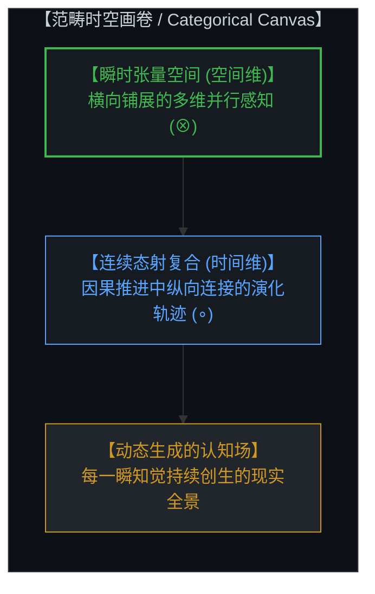
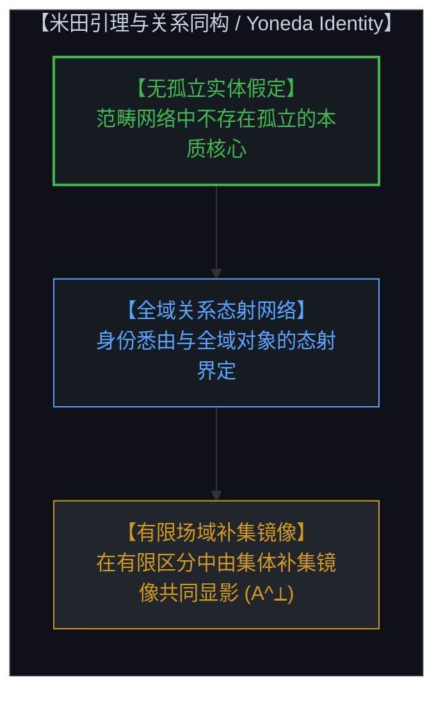
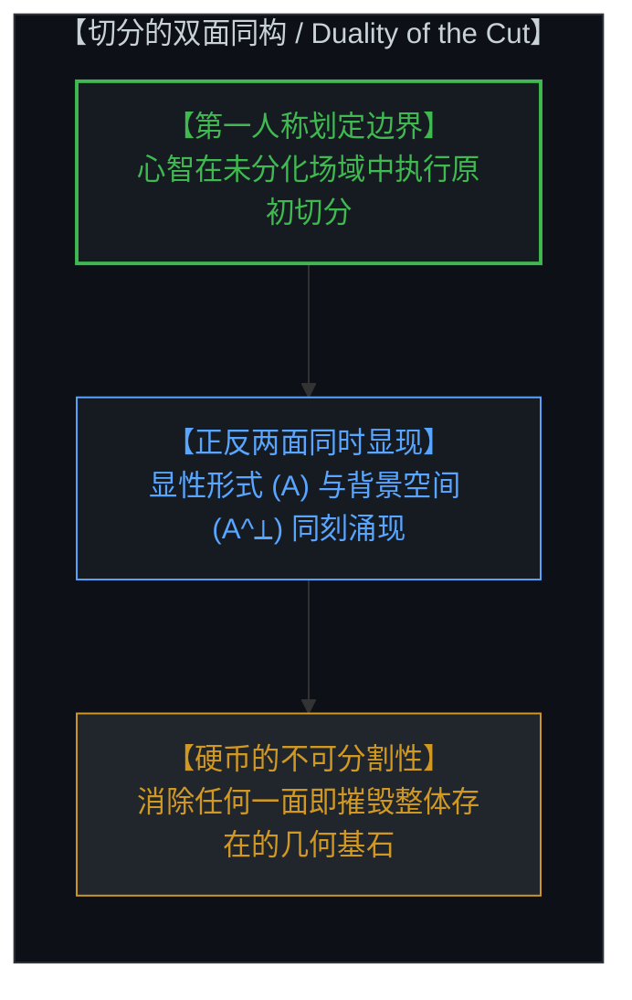
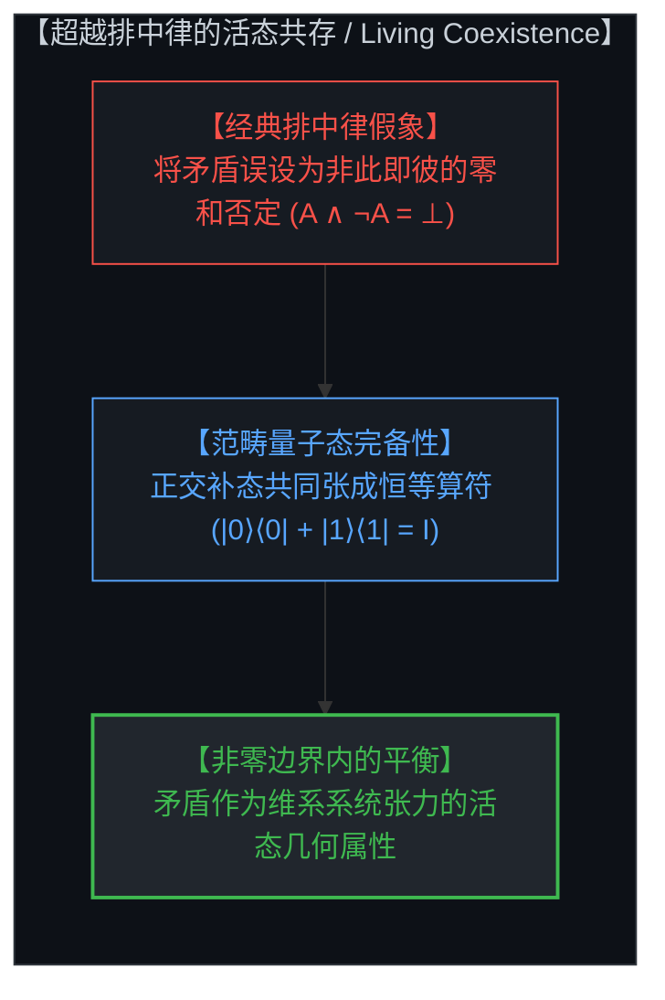
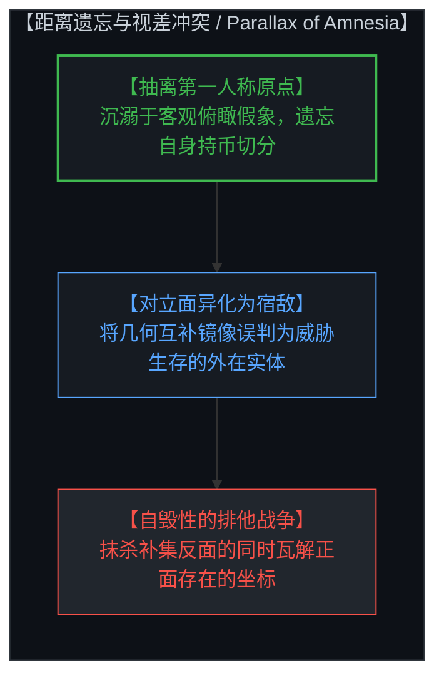
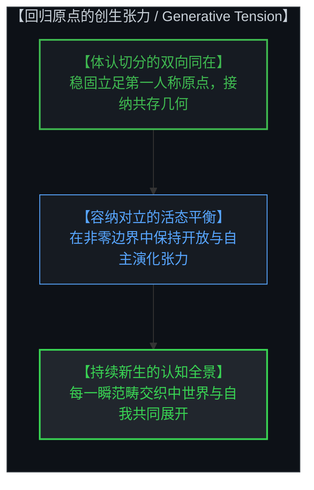

# 共存的几何学：范畴论、非零边界与切分的双面同构 / The Geometry of Coexistence: Category Theory, Non-Zero Boundaries, and the Living Duality of the Cut

*张量空间、态射复合、米田同构与超越排中律的活态共存 / Tensor Spaces, Morphism Composition, Yoneda Identity, and the Living Coexistence Beyond Boolean Negation*

---

## 一、 范畴感知的时空画卷 / 1. The Spatiotemporal Canvas of Categorical Perception

在心智对现实的结构化认知中，空间与时间并非预先存在的静态容器，而是心智进行范畴化组织的基本几何形式。范畴论为这一认知结构提供了精确的映射语言：空间对应于多维张量积（Monoidal Tensor Product, ⊗），它在心智当下的每一个认知截面中，横向展开高维并行展开的感知关系；时间则对应于态射的序贯复合（Sequential Morphism Composition, ∘），记录着心智在因果推进中纵向连接的演化轨迹。

心智所经验到的自由变量分布，并非在创世之初一次性敲定的静态参数集合，而是在每一瞬间随着当下知觉不断落入心智视界中的动态创生事件。前一个瞬间的认知结晶与选择，自然沉淀为后一个瞬间的初始条件与背景；心智通过在张量空间中并行铺展关系、在态射复合中纵向整合因果，持续构建起多维生动的现实全景。

In the Mind's structured cognition of reality, space and time are not preexisting static containers, but the foundational geometric forms through which the Mind organizes its perceptions. Category theory provides an exact language for this cognitive architecture: space corresponds to the monoidal tensor product (⊗), which spans parallel multidimensional relational perceptions across any given instantaneous cross-section; time corresponds to sequential morphism composition (∘), tracing the longitudinal trajectories along which the Mind chains causal movements.

The distribution of free variables experienced by the Mind is not a static catalog fixed once and for all at an arbitrary beginning, but an ongoing generative realization that continuously emerges into perception at every moment. The cognitive crystallization and sovereign choice of the preceding instant naturally form the initial conditions and background for the next. By distributing parallel relations across tensor space and integrating causal paths through morphism composition, the Mind unceasingly weaves the multidimensional panorama of living reality.

---

## 二、 关系同构与有限感知场中的补集镜像 / 2. Relational Identity and the Finite Perceptual Field

米田引理（Yoneda Lemma）揭示了认知世界中最深刻的同构原理之一：在范畴网络中，没有任何对象拥有独立孤立的实质。任何一个实体的身份与性质，悉由它与该场域中所有其他对象之间的全部态射关系所界定。

在任何给定的时间截面上，心智所能把握的区分数量始终是有限的。在这片有限的感知场域内，当心智确立某个特定身份（A）时，这个身份并非依靠自给自足的实体核心得以成立，而是由整个场域中其余一切成分构成的集体补集镜像（A^⟂）共同显影。身份的确立，本质上是心智在有限感知场中对全域关系网所做出的局部聚焦。没有全局背景的对照与衬托，任何孤立的实体定义都将失去参照坐标。

The Yoneda lemma articulates one of the most profound structural principles in cognitive architecture: within a categorical network, no object possesses isolated, self-standing substance. The identity and characteristics of any given entity are determined entirely by the complete network of morphisms connecting it to every other object in the relational field.

At any given instant, the number of distinct categories and boundaries the Mind can actively perceive remains finite. Within this finite perceptual domain, whenever the Mind designates a specific identity (A), that identity does not arise from an autonomous, self-contained core. Rather, it is defined and brought into focus by the collective complementary image (A^⟂) of everything else within that relational horizon. Identity is fundamentally the Mind's local focalization within a global web of relations. Without the co-present contrast of the background field, any isolated definition collapses into formlessness.

---

## 三、 切分的活态双面：一枚硬币的正反同构 / 3. The Living Duality of the Cut: Two Sides of a Single Coin

认知行为的原初动作，是在未分化的连续场中划下一道切分（The Cut）。当心智划定一道边界时，划出的并非孤立的单一实体，而是不可分割的双面同构：标记出的显性形式（A）与未标记的背景空间（A^⟂）在同一瞬间同时涌现。

这两者就像同一枚硬币的正反两面。正面并不否定反面的存在，反面也并不剥夺正面的立足点；两者的共存并非妥协，而是这枚硬币之所以成为硬币的几何前提。心智是手握硬币并执行切分的主体，切分边界本身就同时承载着两面的全部信息。试图消除其中一面以求得另一面的独存，如同试图通过磨平硬币的反面来保留正面，最终只会摧毁整枚硬币的存在基石。

The primordial act of cognition consists of drawing a cut across an undivided continuous field. When the Mind establishes a boundary, it never produces a solitary, isolated entity. Instead, it inevitably generates a living duality: the marked foreground state (A) and the unmarked background space (A^⟂) emerge co-arisingly in the exact same instant.

These two aspects are the obverse and reverse faces of a single coin. The obverse does not reject or destroy the reverse; the reverse does not negate the legitimacy of the obverse. Their simultaneous presence is not an uneasy compromise, but the geometric prerequisite for the coin to exist at all. The Mind is the living subject that holds the coin and executes the cut. The boundary itself carries the complete relational information of both faces. Any attempt to eliminate one side in order to preserve the other in isolation is like grinding away the back of a coin to isolate its face, which inevitably destroys the coin itself.

---

## 四、 纠正因果错位：超越排中律的活态共存 / 4. Resolving the Causal Mismatch: Beyond Exclusive Negation

形式逻辑在传统上倾向于将矛盾视为相互排斥的零和对抗（A ∧ ¬A = ⊥），将反义项的定义理解为对主项存在的否定与抹杀。这种经典布尔假定构成了理论认知与直觉经验之间的因果错位。

范畴量子力学、线性逻辑（Linear Logic）与双拓扑斯（Bi-Topos）理论展现了更为高阶的几何图景：在态空间的张量结构中，正交补态与原初态共同张成完整的恒等算符（Identity Resolution, |0⟩⟨0| + |1⟩⟨1| = I）。正与反并非生死存亡的消灭关系，而是能量守恒与信息完备的共轭张力。非零边界（Non-Zero Boundary）表明，矛盾并非需要被清除的系统错误，而是边界两侧保持张力、驱动认知不断演化的几何属性。

Formal logic has traditionally treated contradiction as mutually exclusive, zero-sum warfare (A ∧ ¬A = ⊥), misinterpreting the definition of a complement as the active negation and annihilation of the primary term. This classical Boolean presumption introduces a profound causal mismatch between formal models and living intuition.

Categorical quantum mechanics, linear logic, and bi-topos theory unveil a much higher-dimensional geometric reality: within the tensor architecture of state spaces, orthogonal basis states jointly span the complete resolution of identity (|0⟩⟨0| + |1⟩⟨1| = I). Opposites do not annihilate one another; rather, they form conjugate partners that maintain informational completeness and energetic balance. The presence of non-zero boundaries demonstrates that contradiction is not a logical bug to be eradicated, but the geometric signature of living distinction that drives ongoing evolution.

---

## 五、 距离遗忘症与存在性战争的视差幻觉 / 5. The Parallax of Distance Amnesia and Existential War

当心智沉溺于抽离观察的假象、遗忘自身作为切分制定者的第一人称原点时，认知视差便会滋生出严重的本体论异化。心智在远处凝视自己划出的正反两面，误以为这两者是两个互不相容、在客观世界中互相争夺生存空间的孤立实体。

在距离遗忘症的遮蔽下，互补的几何共生关系被扭曲为零和的生死战争。心智忘记了硬币正在自己的手掌之中，误将反面镜像视作威胁正面存在的敌人。这种错觉诱发了无休止的排他冲动，试图在感知场中抹除一切不合己意的补集成分，却不知抹去反面的那一刻，正面所赖以存在的定义坐标也随之崩解。

When the Mind succumbs to the illusion of detached observation and forgets its own first-person origin as the author of the cut, cognitive parallax breeds deep ontological alienation. Gazing from an imagined distance at the two faces it has carved, the Mind mistakes them for two separate, hostile entities waging an existential war over territory in an external world.

Under the fog of distance amnesia, the complementary geometric kinship of the cut is distorted into a zero-sum death match. The Mind forgets that the coin rests in its own palm, and mistakes the reverse image for an enemy threatening the survival of the obverse. This delusion fuels relentless exclusionary impulses, driving attempts to purge all opposing complementary elements from the perceptual field—blind to the fact that when the reverse face is obliterated, the coordinate frame defining the obverse collapses along with it.

---

## 六、 回归第一人称原点：切分的创生性张力 / 6. The Generative Tension of the First-Person Cut

唯有回归第一人称原点，心智才能看清对立共存的真实几何。当心智稳固立足于自身的存在原点时，它不再将矛盾视作毁灭性的冲突，而是体认为推动系统保持开放、持续演化的创生性张力。

在这片由非零边界构筑的共存几何中，心智自主作出的每一个抉择、划下的每一道区分，都在赋予自我清晰轮廓的同时，赋予了相伴相生的广阔世界以丰满的意义。心智容纳对立双方的同在，在张力中维持平衡，让知觉与世界在每一瞬的范畴交织中不断新生，走向更为深邃而自由的理解之境。

Only by returning to the first-person origin can the Mind recognize the true geometry of coexistence. Anchored firmly at its causal locus, the Mind no longer perceives contradiction as destructive conflict, but experiences it as the generative tension that keeps reality open, adaptive, and continuously evolving.

Within this geometry of coexistence forged by non-zero boundaries, every sovereign choice and every distinction drawn by the Mind not only confers sharp definition upon the self, but simultaneously enriches the expansive complementary world that arises alongside it. By holding both faces of the cut in living equilibrium, the Mind allows perception and reality to continuously renew themselves across every categorical intersection, unfolding toward ever deeper and more liberating horizons of comprehension.
