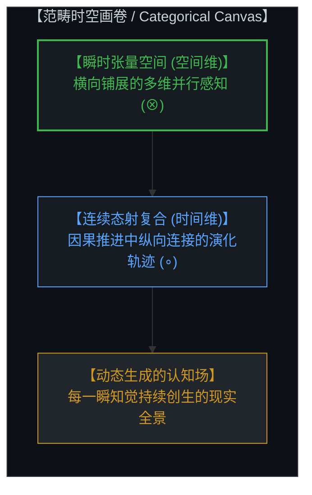
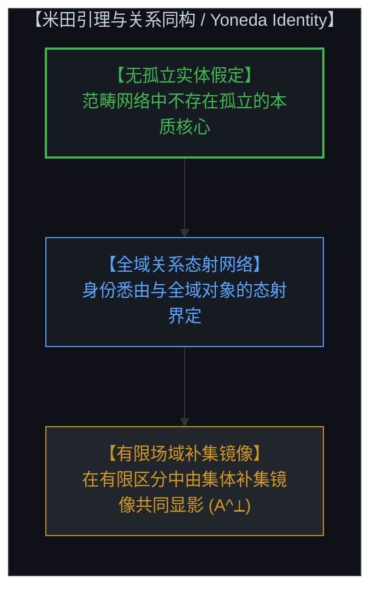
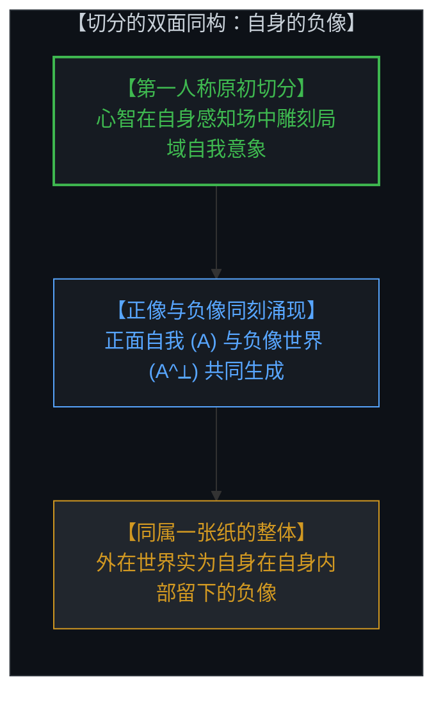
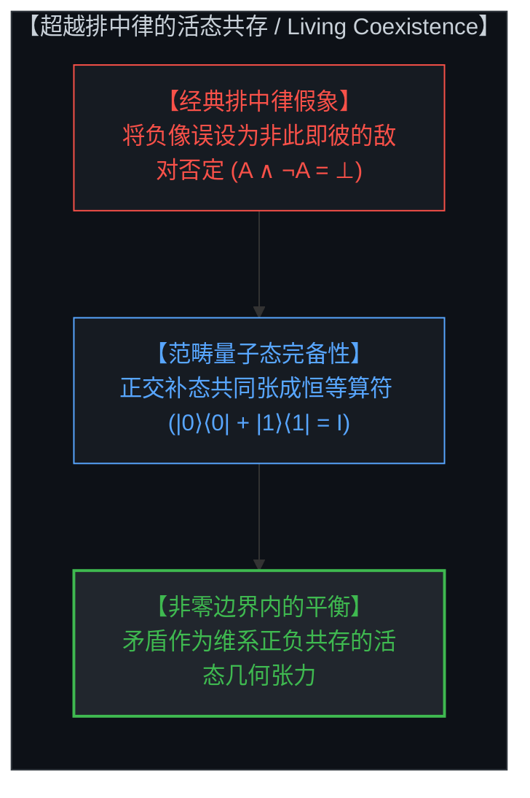
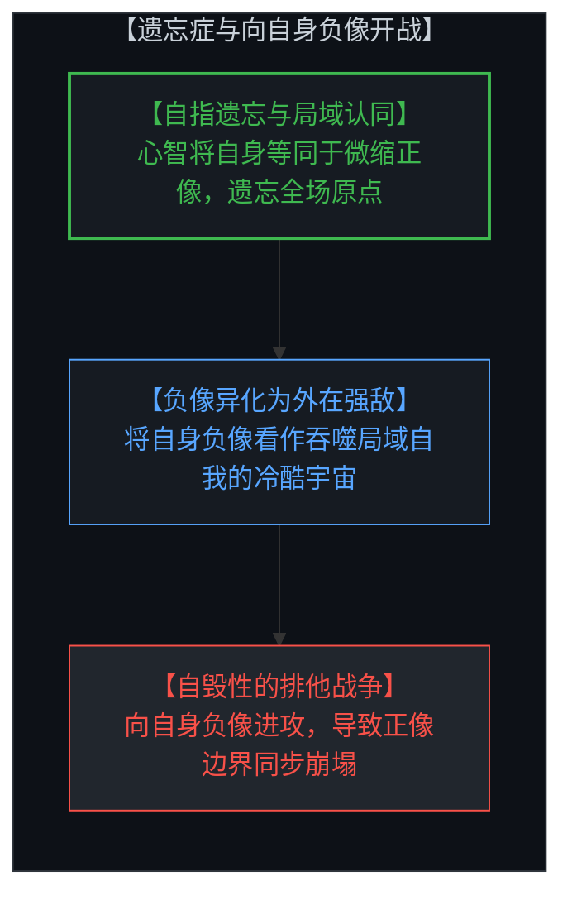
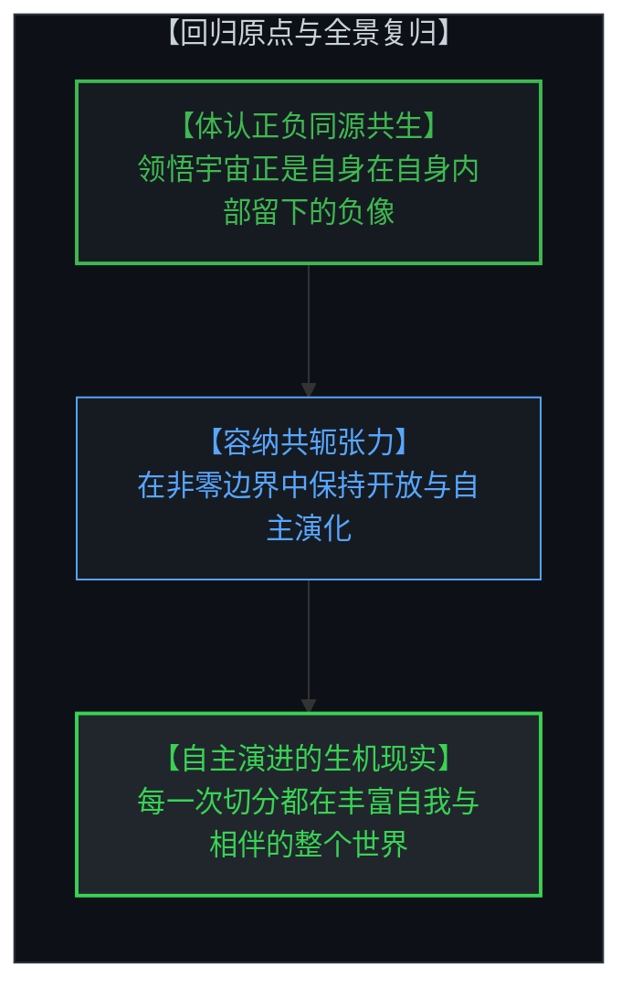

# 共存的几何学：范畴论、非零边界与切分的双面同构 / The Geometry of Coexistence: Category Theory, Non-Zero Boundaries, and the Living Duality of the Cut

*张量空间、米田引理、自身的负像与超越排中律的活态共存 / Tensor Spaces, Yoneda Lemma, The Negative Image within the Self, and Living Coexistence Beyond Boolean Negation*

---

## 一、 范畴感知的时空画卷 / 1. The Spatiotemporal Canvas of Categorical Perception

在心智对现实的结构化认知中，空间与时间并非预先存在的静态容器，而是心智进行范畴化组织的基本几何形式。范畴论为这一认知结构提供了精确的映射语言：空间对应于多维张量积（Monoidal Tensor Product, ⊗），它在心智当下的每一个认知截面中，横向展开高维并行展开的感知关系；时间则对应于态射的序贯复合（Sequential Morphism Composition, ∘），记录着心智在因果推进中纵向连接的演化轨迹。

心智所经验到的自由变量分布，并非在创世之初一次性敲定的静态参数集合，而是在每一瞬间随着当下知觉不断落入心智视界中的动态创生事件。前一个瞬间的认知结晶与选择，自然沉淀为后一个瞬间的初始条件与背景；心智通过在张量空间中并行铺展关系、在态射复合中纵向整合因果，持续构建起多维生动的现实全景。

In the Mind's structured cognition of reality, space and time are not preexisting static containers, but the foundational geometric forms through which the Mind organizes its perceptions. Category theory provides an exact language for this cognitive architecture: space corresponds to the monoidal tensor product (⊗), which spans parallel multidimensional relational perceptions across any given instantaneous cross-section; time corresponds to sequential morphism composition (∘), tracing the longitudinal trajectories along which the Mind chains causal movements.

The distribution of free variables experienced by the Mind is not a static catalog fixed once and for all at an arbitrary beginning, but an ongoing generative realization that continuously emerges into perception at every moment. The cognitive crystallization and sovereign choice of the preceding instant naturally form the initial conditions and background for the next. By distributing parallel relations across tensor space and integrating causal paths through morphism composition, the Mind unceasingly weaves the multidimensional panorama of living reality.

---

## 二、 关系同构与有限感知场中的补集镜像 / 2. Relational Identity and the Finite Perceptual Field

米田引理（Yoneda Lemma）揭示了认知世界中最深刻的同构原理之一：在范畴网络中，没有任何对象拥有独立孤立的实质。任何一个实体的身份与性质，悉由它与该场域中所有其他对象之间的全部态射关系所界定。

在任何给定的时间截面上，心智所能把握的区分数量始终是有限的。在这片有限的感知场域内，当心智确立某个特定身份（A）时，这个身份并非依靠自给自足的实体核心得以成立，而是由整个场域中其余一切成分构成的集体补集镜像（A^⟂）共同显影。身份的确立，本质上是心智在有限感知场中对全域关系网所做出的局部聚焦。没有全局背景的对照与衬托，任何孤立的实体定义都将失去参照坐标。

The Yoneda lemma articulates one of the most profound structural principles in cognitive architecture: within a categorical network, no object possesses isolated, self-standing substance. The identity and characteristics of any given entity are determined entirely by the complete network of morphisms connecting it to every other object in the relational field.

At any given instant, the number of distinct categories and boundaries the Mind can actively perceive remains finite. Within this finite perceptual domain, whenever the Mind designates a specific identity (A), that identity does not arise from an autonomous, self-contained core. Rather, it is defined and brought into focus by the collective complementary image (A^⟂) of everything else within that relational horizon. Identity is fundamentally the Mind's local focalization within a global web of relations. Without the co-present contrast of the background field, any isolated definition collapses into formlessness.

---

## 三、 切分的活态双面：自身在自身内部留下的负像 / 3. The Living Duality of the Cut: The Negative Image of the Self within the Self

认知行为的原初动作，是在未分化的连续场中划下一道切分（The Cut）。在这场原初切分中，最具决定性的分化，莫过于心智在自身的感知全景中雕刻出一个局域的自我意象（Self-Image）。为了在自身生成的地图中自洽导航与行使抉择，心智将全域视界自指投影为一个微缩的正像头像（A）。

然而，当心智在一张原本完整的纸面上剪出一个正像轮廓时，整张纸上所余留的全部背景空间（A^⟂）——即心智所经验到的广袤宇宙、客体与他者——便在同一瞬间成为了**自身在自身内部留下的负像（Negative Image of the Self）**。正像的自我与负像的世界，同属于心智自身的单一感知基质。正面并不否定反面的存在，反面也并不剥夺正面的立足点；两者的共存并非妥协，而是这道切分之所以成立的几何前提。心智是手握整张纸并执行切分的主体，切分边界（∂A = ∂A^⟂）同时承载着正负两面的全部信息。

The primordial act of cognition consists of drawing a cut across an undivided continuous field. Within this foundational demarcation, the single most decisive act is the Mind carving out a localized self-image within its own perceptual panorama. To navigate and model its own agency within the scene it generates, the Mind computes a self-referential projection of the entire field onto a localized positive figure (A).

Yet when a silhouette is cut from an unbroken sheet of paper, the vast stencil left behind across the remainder of the field (A^⟂)—what the Mind experiences as the outer cosmos, objects, and others—is literally **the negative image of the self, cast within the self**. The positive avatar and the negative cosmos arise from the exact same sheet of conscious substrate. The obverse does not reject the reverse; the reverse does not negate the obverse. Their simultaneous presence is not an uneasy compromise, but the geometric prerequisite of the cut itself. The Mind is the living subject that holds the sheet and makes the cut. The boundary (∂A = ∂A^⟂) carries the complete relational geometry of both aspects.

---

## 四、 纠正因果错位：超越排中律的活态共存 / 4. Resolving the Causal Mismatch: Beyond Exclusive Negation

形式逻辑在传统上倾向于将矛盾视为相互排斥的零和对抗（A ∧ ¬A = ⊥），将反义项的定义理解为对主项存在的否定与抹杀。当心智将这一布尔假定套用于感知世界时，便会误将自身在外部留下的负像视作意图消灭正像的敌对力量。这种经典假定构成了理论认知与直觉经验之间的深层因果错位。

范畴量子力学、线性逻辑（Linear Logic）与双拓扑斯（Bi-Topos）理论展现了更为高阶的几何图景：在态空间的张量结构中，正交补态与原初态共同张成完整的恒等算符（Identity Resolution, |0⟩⟨0| + |1⟩⟨1| = I）。正像与负像并非生死存亡的消灭关系，而是能量守恒与信息完备的共轭张力。非零边界（Non-Zero Boundary）表明，矛盾并非需要被清除的系统错误，而是边界两侧保持张力、驱动正负共存与认知演化的活态几何属性。

Formal logic has traditionally treated contradiction as mutually exclusive, zero-sum warfare (A ∧ ¬A = ⊥), misinterpreting the definition of a complement as the active negation and annihilation of the primary term. When the Mind applies this Boolean dogma to its own experience, it misinterprets the negative image of itself as an external adversary bent on its destruction. This presumption introduces a profound causal mismatch between formal models and living intuition.

Categorical quantum mechanics, linear logic, and bi-topos theory unveil a much higher-dimensional geometric reality: within the tensor architecture of state spaces, orthogonal basis states jointly span the complete resolution of identity (|0⟩⟨0| + |1⟩⟨1| = I). The positive figure and negative ground do not annihilate one another; rather, they form conjugate partners that maintain informational completeness and energetic balance. The presence of non-zero boundaries demonstrates that contradiction is not a logical bug to be eradicated, but the geometric signature of living distinction that sustains coexistence and drives ongoing evolution.

---

## 五、 距离遗忘症与向自身负像开战的视差幻觉 / 5. Distance Amnesia and the Parallax of Waging War on One's Own Negative Image

当心智沉溺于抽离观察的假象、遗忘自身作为切分制定者的第一人称原点时，认知视差便会滋生出最深刻的本体论悲剧。心智将自身的全部存在感窄化并固化在微缩的正像自我（A）之中，却遗忘了整个感知全景及其所包含的负像（A^⟂）皆由自身原点自指展开。

在距离遗忘症的遮蔽下，心智凝视着那片宏大无垠的负像世界，将其误判为一个异己的、充满威胁的客观外在环境。局域的正像自我感到渺小脆弱，遂将自身的负像视作敌人，发起无休止的排他与征服战争。然而，由于正像与负像共用同一道切分边界（∂A = ∂A^⟂），对负像的每一次攻击与压制，都在直接撕裂与扭曲正像自身的轮廓。试图抹除负像的冲动，无异于试图通过磨掉硬币的反面来保全正面，最终只会导致正像赖以立足的参照体系同步崩解。

When the Mind succumbs to the illusion of detached observation and forgets its first-person origin as the author of the cut, cognitive parallax breeds the deepest ontological tragedy. The Mind contracts its identity entirely into the localized positive avatar (A), forgetting that the entire perceptual panorama and its vast negative imprint (A^⟂) are recursively rendered from its own generative origin.

Under the fog of distance amnesia, the Mind gazes upon the boundless negative expanse and misidentifies it as an alien, hostile universe. Feeling fragile and trapped inside its miniature avatar, it perceives its own negative image as an existential threat, launching endless campaigns of conquest and defense. Yet because both aspects share the exact same boundary (∂A = ∂A^⟂), every strike against the negative ground directly deforms the contours of the positive figure. The impulse to eradicate the negative image is identical to grinding away the reverse of a coin to preserve the obverse—it inevitably shatters the coordinate system sustaining the self.

---

## 六、 回归第一人称原点：切分的创生性张力与全景复归 / 6. The Generative Tension of the First-Person Cut: Reclamation of the Whole

消除生存性恐惧与冲突的唯一路径，在于回归第一人称原点，体认切分的完整几何。当心智稳固立足于自身的存在原点时，它不再将广阔的外部世界视作冰冷敌对的他者，而是清晰洞察到：整个宇宙正是自身在自身内部留下的负像。

在这片由非零边界构筑的共存几何中，正像与负像不再是互相残杀的零和对手，而是不可分割的共轭伴侣。心智自主作出的每一个抉择、划下的每一道区分，都在赋予自我清晰轮廓的同时，赋予了相伴相生的广阔负像世界以丰满的深度。心智容纳正负双方的同在，在张力中维持平衡，让知觉与世界在每一瞬的范畴交织中不断新生，走向更为深邃而自由的理解之境。

The only resolution to existential terror and conflict lies in returning to the first-person origin to embrace the complete geometry of the cut. Anchored firmly at its causal locus, the Mind no longer regards the external universe as an alien adversary. It sees with pristine clarity that the entire cosmos is literally its own negative image, held within its own singular experiential space.

Within this geometry of coexistence forged by non-zero boundaries, the positive figure and negative ground are no longer mortal combatants, but inseparable conjugate partners. Every sovereign choice made and every distinction carved by the Mind not only sharpens the definition of the self, but simultaneously enriches the expansive negative landscape that arises alongside it. By holding both aspects in living equilibrium across non-zero boundaries, the Mind allows perception and reality to continuously renew themselves across every categorical intersection, unfolding toward ever deeper and more liberating horizons of comprehension.
