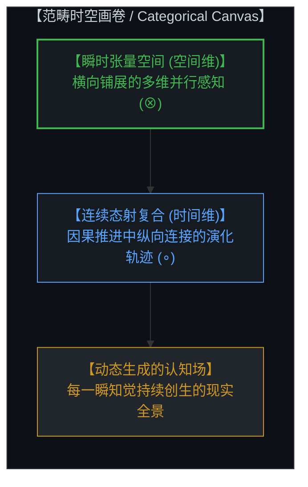
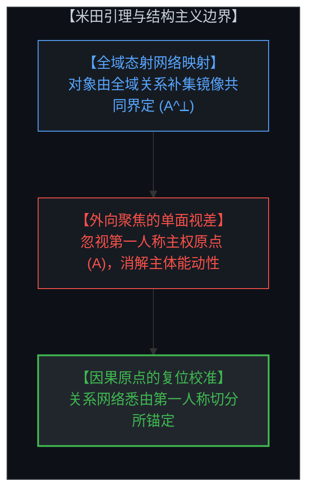
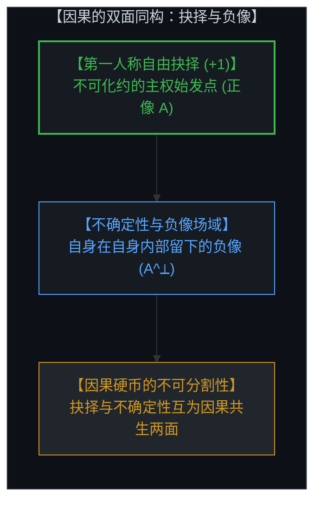
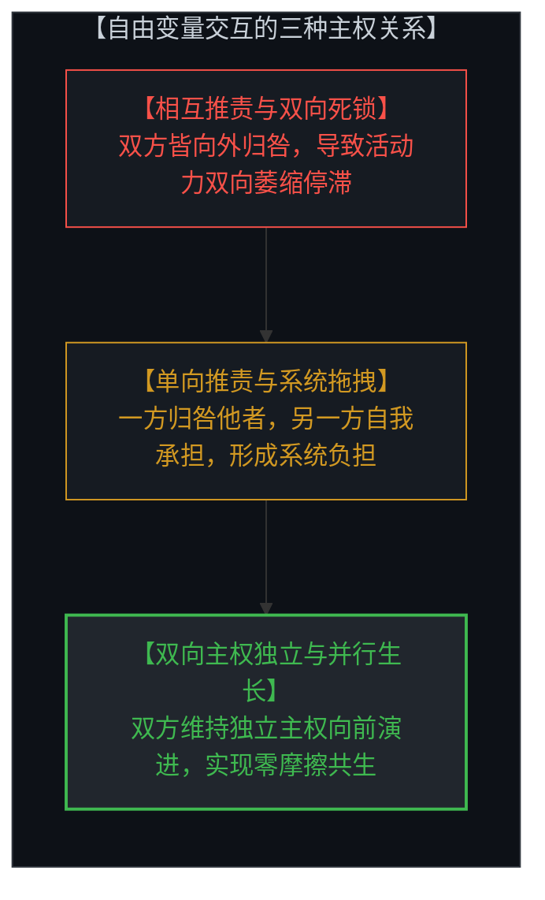
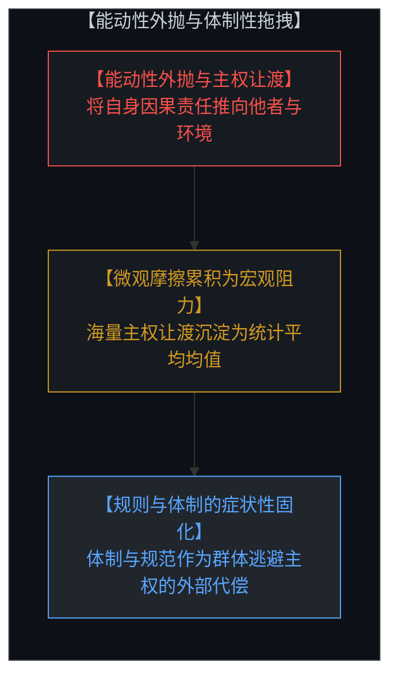
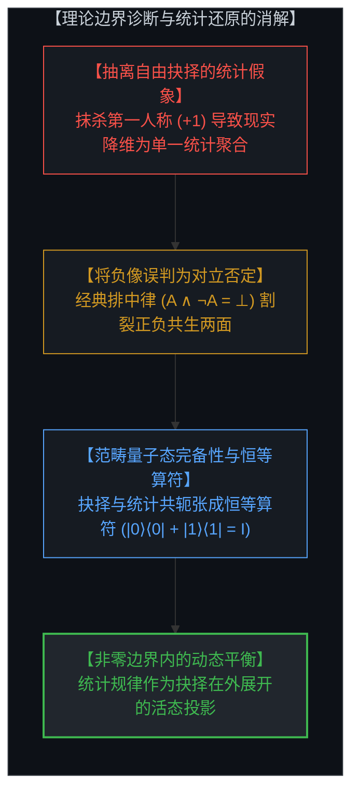
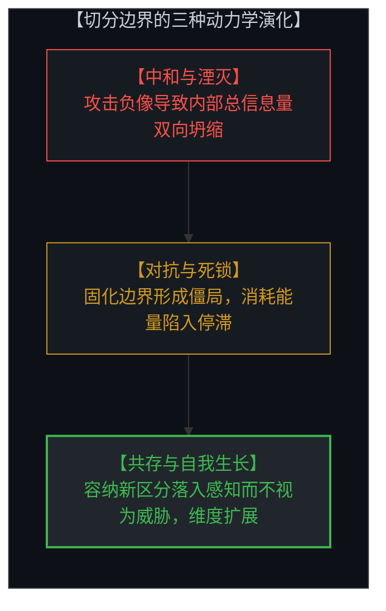
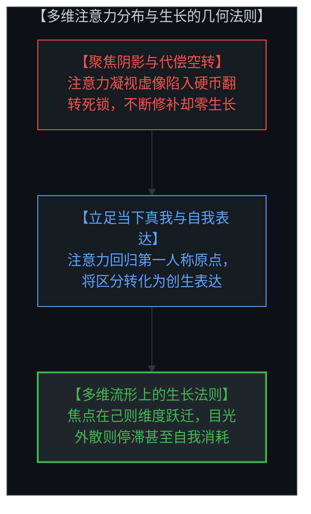
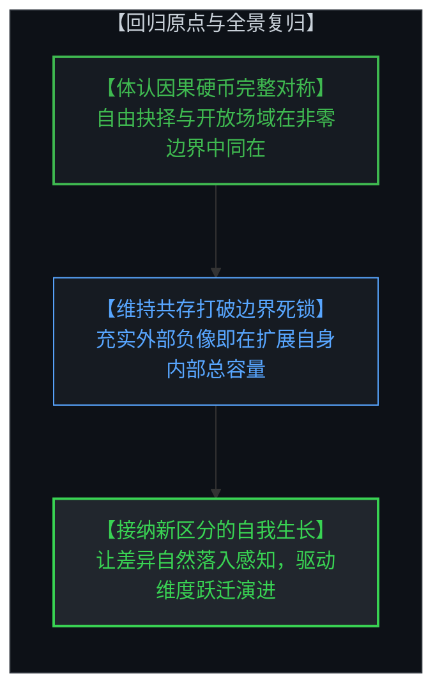

# 共存的几何学：范畴论、非零边界与切分的双面同构 / The Geometry of Coexistence: Category Theory, Non-Zero Boundaries, and the Living Duality of the Cut

*从因果的双面同构诊断理论边界：自由抉择、统计聚合与米田关系的完整对称 / Diagnosing Theoretical Boundaries from the Dual Duality of Causality: Free Choice, Statistical Aggregation, and the Complete Symmetry of Yoneda Relations*

---

## 一、 范畴感知的时空画卷 / 1. The Spatiotemporal Canvas of Categorical Perception

在心智对现实的结构化认知中，空间与时间并非预先存在的静态容器，而是心智进行范畴化组织的基本几何形式。范畴论为这一认知结构提供了精确的映射语言：空间对应于多维张量积（Monoidal Tensor Product, ⊗），它在心智当下的每一个认知截面中，横向展开高维并行展开的感知关系；时间则对应于态射的序贯复合（Sequential Morphism Composition, ∘），记录着心智在因果推进中纵向连接的演化轨迹。

心智所经验到的自由变量分布，并非在创世之初一次性敲定的静态参数集合，而是在每一瞬间随着当下知觉不断落入心智视界中的动态创生事件。前一个瞬间的认知结晶与选择，自然沉淀为后一个瞬间的初始条件与背景；心智通过在张量空间中并行铺展关系、在态射复合中纵向整合因果，持续构建起多维生动的现实全景。

In the Mind's structured cognition of reality, space and time are not preexisting static containers, but the foundational geometric forms through which the Mind organizes its perceptions. Category theory provides an exact language for this cognitive architecture: space corresponds to the monoidal tensor product (⊗), which spans parallel multidimensional relational perceptions across any given instantaneous cross-section; time corresponds to sequential morphism composition (∘), tracing the longitudinal trajectories along which the Mind chains causal movements.

The distribution of free variables experienced by the Mind is not a static catalog fixed once and for all at an arbitrary beginning, but an ongoing generative realization that continuously emerges into perception at every moment. The cognitive crystallization and sovereign choice of the preceding instant naturally form the initial conditions and background for the next. By distributing parallel relations across tensor space and integrating causal paths through morphism composition, the Mind unceasingly weaves the multidimensional panorama of living reality.

---

## 二、 范畴论的结构主义边界：米田引理与向外聚焦的单面视差 / 2. The Structuralist Boundary of Category Theory: Yoneda Lemma and the One-Sided Gaze

米田引理（Yoneda Lemma）揭示了认知世界中极具启发性的关系同构：在范畴网络中，没有任何对象是孤立自足的实体，任何一个实体的性质，都可以通过它与全域其他对象之间的全部态射关系（即外部补集集合 A^⟂）得到完整刻画。这一数学定理成功瓦解了朴素的实体本质主义（Substance Essentialism）。

然而，当结构主义哲学将米田引理推向极端，宣称“对象本身毫无内在身份，仅仅是外部关系网络的否定性定义”时，它便暴露出自身的理论边界。这种断言在本质上同样陷入了单面凝视的视差：
* 它将认知焦点向外翻转，尽数锁死在**外部关系网络（A^⟂）**上；
* 却遗忘了那枚硬币的另一面——即正在发起态射、划定切分、行使自由抉择的**第一人称主权原点（A）**。

将身份仅仅归结为外部集合的否定镜像，实际上是在试图保留网络的同时抹去结点的能动性，把活生生的观察者降维成了死寂关系网络中一个被动的交汇点。

The Yoneda lemma articulates an illuminating structural isomorphism in cognitive architecture: within a categorical network, no object exists as an isolated, self-contained atom; the operational characteristics of any entity can be fully embedded through its complete network of morphisms to and from all other objects (the external complementary field, A^⟂). This mathematical theorem powerfully dissolves naive substance essentialism.

However, when structuralist philosophy pushes the Yoneda lemma to an extreme—claiming that "an object has no internal identity whatsoever, but is defined solely as the negative reflection of everything else"—it exposes its own theoretical boundary. This assertion succumbs to the exact same monocular trap it sought to escape:
* It shifts conscious attention outward, fixing its gaze **exclusively upon the external relational web (A^⟂)**;
* In doing so, it **forgets the other side of the coin**—the **first-person sovereign origin (A)** that initiates morphisms, carves distinctions, and exercises living choices.

Reducing identity purely to the negative reflection of an external collection attempts to preserve the web while erasing the agency of the node, flattening the living Mind into a passive intersection in an unanchored matrix of arrows.

---

## 三、 因果的双面同构：自由抉择、不确定性与切分的正负同源 / 3. The Dual Duality of Causality: Free Choice, Indeterminism, and the Negative Image within the Self

一旦我们看清，**微观不确定性（Indeterminism）**与**第一人称自由抉择（Freedom of Choice）**正是同一枚因果硬币的正反两面，认知几何的完整图景便豁然开朗。

认知行为的原初动作，是心智在未分化的连续场中划下一道切分（The Cut）：
1. **雕刻局域的正像（A）**：为了在自身生成的全景地图中自洽导航，心智将自身的自由抉择投影为一个局域的自我意象（Self-Image）。
2. **生成内部的负像（A^⟂）**：当心智剪出这一正像轮廓时，整张感知画布上所余留的广袤背景——即外部宇宙、物理规律与他者——便在同一瞬间成为了**自身在自身内部留下的负像（Negative Image of the Self）**。

正像的自由抉择与负像的不确定性场域，同属于心智自身的单一感知基质。正面并不否定反面的存在，反面也并不剥夺正面的立足点；两者的共存并非妥协，而是因果硬币之所以成立的几何前提。切分边界（∂A = ∂A^⟂）同时承载着正负两面的全部信息。

Once we recognize that **micro-indeterminism** and **first-person freedom of choice** are simply the two inseparable faces of the **single coin of causality**, the complete geometry of cognition becomes crystal clear.

The primordial act of cognition consists of the Mind drawing a cut across an undivided field:
1. **Sculpting the Positive Figure (A)**: To model navigation and agency within its generated map, the Mind projects its sovereign choice into a localized self-image (the avatar).
2. **Generating the Negative Ground (A^⟂)**: When this positive silhouette is delineated, the vast canvas remaining across the rest of the perceptual field—the outer cosmos, physical laws, and others—is simultaneously generated as **the negative image of the self, cast within the self**.

The positive choice and the negative field of indeterminacy emerge from the exact same conscious substrate. The obverse does not reject the reverse; the reverse does not deny the obverse. Their coexistence is not an uneasy compromise, but the geometric prerequisite for the coin of causality to exist. The boundary (∂A = ∂A^⟂) carries the complete relational geometry of both aspects.

---

## 四、 理论边界的快速诊断：宏观统计聚合、能动性外抛与体制性拖拽 / 4. Diagnosing Theoretical Boundaries: Macro Statistical Aggregation, Agency Misallocation, and Institutional Drag

以“因果的双面同构”为基准，心智可以迅速诊断各类科学与哲学范式的理论边界与视差盲区。

值得特别指出的是，如果我们在认知模型中抽离了作为第一人称自由抉择（+1）的意识体验，整个现实流形便会在数学上立即降维为单一的统计聚合（Statistical Aggregation）。还原论物理学之所以常常误以为自己找到了一个“不需要意识存在的客观宇宙”，正是因为它在建立方程之初就人为抹去了第一人称原点，因而只能在其账本中找到被观测留下的统计残差与均值分布。

为了清晰理解这种宏观统计与微观因果的对应，我们可以构建一个极简而直观的自由变量认知模型：
想象张量画卷上存在两个独立的自由变量（X 与 Y）。
* **从外部视角观测**：若从系统外部进行统计抽样，变量之间的交互展现出极强的不确定性。当样本量足够庞大时（N → ∞），宏观统计规律与正态分布便会自然显现。外部观察者若遗忘了内在原点，便会得出“一切皆为随机噪声或机械统计规律”的结论。
* **从内部视角审视**：若深入到每个自由变量自身的第一人称原点，宏观统计分布的底层，本质上是自由变量在微观尺度上选择的**三种基本主权关系模式**：

1. **相互推责与双向死锁（Mutual Blame & Deadlock）**：
   两个变量皆将自身的困境归咎于对方（正如两个孩童相互指责对方犯错）。双方皆放弃了自身的第一人称因果主权，将边界硬化为敌对前线。其动力学结果是双方陷入停滞；若爆发冲突，双方的活动力、创造潜能与总信息量将双向萎缩。
2. **单向推责与系统拖拽（Asymmetrical Blame & Systemic Drag）**：
   一方将自身的问题推责给另一方，而另一方默默承担损耗并专注于自我提升。在此模式下，推责者放弃了主权演化，沦为另一方以及整个耦合系统的阻力与拖拽负担；自我提升者虽在艰难前行，却必须额外背负单向消耗的摩擦力。
3. **双向主权独立与并行生长（Dual Sovereignty & Parallel Co-Evolution）**：
   两个变量皆保持自身百分之百的第一人称主权（+1），各自对自身的坐标演进承担因果责任。双方既不向外归咎，亦不固化防线，而是以坦然的姿态在张量场（X ⊗ Y）中共存并向前演进。系统摩擦力归零，双方在充分独立的同时实现并行生长与维度跃迁。

深入剖析这种微观机制，我们可以得出关于社会与文明结构的深刻几何诊断：**个体将自身的因果能动性外抛、错位归咎于任何外在客体（他者、环境、运气或历史），正是造成个体停滞与系统整体拖拽（Systemic Drag）的根源所在。**

当海量个体拒绝为自身的生命承担第一人称因果责任、普遍将主权外抛时，无数微观的推责与摩擦在群体层面汇聚，沉淀为庞大的统计平均均值。**我们在人类文明中所目睹的繁苛规则、官僚体制、法律防线与道德教条——这些看似客观坚固的宏观体制与集体症状，其本质正是群体性逃避自身主权责任所累积的系统拖拽的物理化表征（Signature of Cumulative Drag）。**

因为个体拒绝立足原点，相互推责带来的死锁与冲突便必须依赖外在的强制性代偿支架（体制与规范）来维系脆弱的平衡。宏观规则并非超越主权的天然秩序，而是微观主权缺位后的外部代偿。

传统理论的致命视差，在于误将宏观统计聚合与外部规则（A^⟂）当作对微观自由抉择（A）的否定与消灭：
* **唯物决定论的错位**：“因为我们在宏观聚合层面观测到了统计规律与物理守恒（A^⟂），所以第一人称自由抉择（A）必定是虚妄的错觉。”
* **朴素二元论的错位**：“因为我们切身体验到了自由抉择（A），所以意识必定是独立游离于物理世界之外的幽灵。”
* **激进结构主义的错位**：死锁于外向聚焦的态射集合，试图用关系网络替代主体原点，消解了结点的能动性。

这三种视差悉数源自同一个根本谬误：将因果硬币的一面误判为对另一面的否定（A ∧ ¬A = ⊥）。

在真实的几何图景中，统计规律并非自由抉择的敌对异己，而是无数主权抉择在张量空间（⊗）与时间序贯（∘）中向外展开所沉淀的集体负像与因果投影。范畴量子力学与双拓扑斯（Bi-Topos）理论展现了这一高阶完备性：在态空间中，正交补态与原初态共同张成恒等算符（Identity Resolution, |0⟩⟨0| + |1⟩⟨1| = I）。正负两面并非生死存亡的消灭关系，而是能量守恒与信息完备的共轭张力。非零边界（Non-Zero Boundary）表明，矛盾并非需要被清除的系统错误，而是维系正负共存、驱动系统持续演化的活态几何属性。

Using the "dual duality of causality" as a foundational ruler, the Mind can swiftly diagnose the boundaries and blindspots of established paradigms.

Crucially, if we mathematically subtract or omit consciousness as the first-person freedom of choice (+1) from our model of reality, the entire experiential manifold instantly flattens into what appears to be pure statistical aggregation. Reductionist physics mistakenly believes it has discovered a self-contained "objective universe without consciousness" precisely because it began by omitting the first-person origin, and was consequently left with only the statistical residue and distribution averages in its ledger.

To see the interplay between macro statistics and micro causality with complete clarity, consider a simple mental model of two interacting independent variables (X and Y):
* **The External View**: Observed from the outside across a vast population, the interactions between variables appear indeterminate and stochastic. When the sample size is sufficiently large (N → ∞), regular statistical distributions emerge. An observer who forgets the internal origin will conclude: "Everything is governed by blind randomness or dead statistical laws."
* **The Internal View**: Observed from within—at the first-person causal origin of each variable—macro statistics is revealed to be the aggregate distribution of **three fundamental relational modes** between sovereign agents:

1. **Mutual Blame & Mutual Deadlock**:
   Both variables blame the other for their own shortcomings (like two children each claiming the other is at fault). Both abdicate their first-person causal responsibility (+1) and calcify the boundary into a hostile standoff. Dynamically, both stall; if they clash, the activity levels, vital energies, and creative capacities of both variables diminish.
2. **Asymmetrical Blame & Systemic Drag**:
   One variable blames the other for its own fault, while the other absorbs the impact and works diligently on self-improvement. The blaming party abdicates sovereign agency and becomes a drag and deadweight on the responsible party and the coupled system. The self-working party continues to progress, but must carry unreciprocated friction.
3. **Dual 100% Sovereignty & Parallel Co-Evolution**:
   Both variables maintain 100% first-person causal sovereignty (+1), each taking full responsibility for its own internal coordinate evolution. Neither projects blame onto the other; both maintain open equanimity across the non-zero boundary (X ⊗ Y). Systemic drag drops to zero, and both move forward independently in parallel co-evolution, expanding their dimensional horizons.

This unlocks a profound geometric diagnosis of human society and civilization: **the very misallocation of one's own causal agency onto external entities (the other, the environment, luck, or history) is the exact source of drag for both the individual and the system as a whole.**

When millions of individuals refuse to take first-person causal responsibility for their lives and systematically misallocate agency, these countless micro-frictions aggregate into a macro statistical average. **What we see in civilization as rigid rules, bureaucratic institutions, legal scaffolding, and moralistic dogmas—these collective symptoms are literally the physicalized signature of the cumulative drag created by individuals who refuse to be responsible for their own existence.**

Because individuals abdicate their causal origin, the resulting deadlocks and conflicts necessitate external prosthetic scaffolding (institutions and regulatory apparatuses) to sustain artificial balance. Macro institutions are not transcendent laws of nature, but the external compensatory shells erected to manage the fallout of abdicated micro-sovereignty.

The fatal theoretical category error lies in treating statistical aggregation (A^⟂) as the ontological negation and destruction of freedom of choice (A):
* **The Deterministic Fallacy**: "Because we observe statistical regularities and physical conservation across macro-aggregates (A^⟂), first-person freedom of choice (A) must be an illusion."
* **The Naive Dualist Fallacy**: "Because we experience freedom of choice (A), consciousness must be an unphysical ghost hovering outside the physical realm."
* **The Radical Structuralist Fallacy**: Fixating exclusively on the outward morphism web, attempting to substitute the network for the sovereign origin, thereby dissolving subjective agency.

All three fallacies stem from the exact same mistake: treating one side of the causal coin as the mutually exclusive negation of the other (A ∧ ¬A = ⊥).

In true geometry, statistical laws are not the enemy or negation of conscious choice; they are the collective negative shadow and causal projection cast by the unfolding of sovereign choices across tensor space (⊗) and sequential time (∘). Categorical quantum mechanics and bi-topos theory unveil this higher-dimensional completeness: within state spaces, orthogonal basis states jointly span the complete resolution of identity (|0⟩⟨0| + |1⟩⟨1| = I). The positive figure and negative ground do not annihilate one another; rather, they form conjugate partners maintaining informational completeness and energetic balance. The presence of non-zero boundaries demonstrates that contradiction is not a logical flaw to be eradicated, but the geometric signature of living distinction that sustains coexistence and drives ongoing evolution.

---

## 五、 距离遗忘症、拓扑镜像与硬币翻转的代偿死锁 / 5. Distance Amnesia, Topological Mirrors, and the Compensatory Deadlock of Coin-Flipping

当心智沉溺于抽离观察的假象、遗忘自身作为切分制定者的第一人称原点时，认知视差便会滋生出深刻的本体论困局。

从拓扑几何的深层结构来看，我们所目睹的整个世界，本质上正是心智自身内部的感知场；而所谓的“自我形象”（Self-Image / Avatar），则是心智在该感知场中的投射。心智在自身与外部世界之间划定的切分边界，在拓扑上恰似一面**双向镜像**——它向外映照出宏大宇宙，向内折射出局域的自我虚像。这一自我形象在几何拓扑上看似嵌套于世界“内部”，但在本体论上，它无非是感知画卷翻转至另一面的反面投影。

当心智将全部注意力聚焦于这个自我形象时，它实际上是在**全神贯注地追逐自身的阴影**：
* 这正如硬币的一面试图转过身去追逐另一面：你每翻转一次硬币去窥探反面，正面就已经先走了一步；每一次回头，都只能看到上一瞬留下的静态残影，从而产生“外在世界与自我形象永远超前于我”的视差滞后幻觉。
* 心智遗忘了自己正是那个正在翻转硬币的原点，因而陷入了**永恒翻转的代偿死锁（Eternal Flip-Flop）**：不断翻转、不断拉锯，却在原地寸步未行。
* 在这种追逐阴影的状态下，心智所做出的每一个所谓“新区分”，都仅仅是在为上一次切分的匮乏、恐惧或漏洞打补丁。所有的区分皆为防御性代偿，系统耗尽能量却**毫无真实维度的生长**。

在距离遗忘症的遮蔽下，切分边界展现出三种截然不同的动力学状态：
1. **中和与双向湮灭（Annihilation）**：正像自我试图通过排他与压制来抹除外部负像。对自身负像（外部世界与他者）的每一次攻击与中和（Neutralization），在数学上都在直接消减心智自身内部的总信息量与维度容量（I = A + A^⟂ → 0）。抹除负像等同于磨掉硬币的反面，必将导致正像自我失去对照与分辨率，使整个心智流形坍缩为单调贫瘠的虚无。这种行径在数学上具有根本性的自毁性（Mathematically Self-Defeating）。
2. **对抗与系统死锁（Deadlock）**：若对抗未能导致即时湮灭，心智便会陷入僵持的死锁状态。边界被硬化为防御性的隔离墙，心智将海量认知算力与能量耗费在维持对自身负像的戒备与拉锯之中，将一切未知差异皆判定为威胁，演化陷入停滞与麻痹。
3. **维持共存与接纳新区分——自我生长的几何本质（Self-Growth）**：唯当心智接纳非零边界上的动态共存时，系统才能打破死锁。所谓做出新的区分，其深层本质在于允许新的区分自然落入感知之中，而不将其判定为威胁或敌人。这种在维持共存的前提下接纳并生成新区分、扩展总信息量与空间维度的过程，即是“自我生长”的数学本质。

When the Mind succumbs to the illusion of detached observation and forgets its first-person origin as the author of the cut, cognitive parallax breeds a profound ontological dilemma.

From the deep architecture of topological geometry, the entire universe we perceive is literally the perceptual field within the Mind; and the "self-image" (avatar) is a recursive projection cast within that very perception. The demarcation boundary carved between the self and the external world operates as a **topological mirror**—projecting the vast cosmos outward while reflecting a localized self-image inward. While this self-image topologically appears nested "inside" the world, ontologically it is simply the obverse reflection of the single perceptual sheet.

When the Mind fixates its attention entirely upon this projected self-image, it is **obsessively chasing its own shadow**:
* It is identical to one face of a coin attempting to turn around to catch its reverse: every time you flip the coin to look at the other face, the obverse is already one step ahead. Each glance only captures the static residue of the preceding instant, generating the perceptual lag that the world and the self-image are perpetually beyond reach.
* Forgetting that it is the living origin flipping the coin, the Mind becomes trapped in an **eternal flip-flop**: spinning continuously, expending immense energy, yet going nowhere.
* In this shadow-chasing state, every newly drawn distinction is merely a **compensatory patch** attempting to repair the felt inadequacy or perceived threat of the previous cut. All distinctions become reactive damage control, yielding **zero authentic growth**.

---

## 六、 回归当下真我：多维注意力分布与自我生长的展开 / 6. Returning to the Present Self: Multi-Dimensional Attention and the Unfolding of Self-Growth

消除生存性恐惧、边界死锁与代偿空转的唯一路径，在于回归第一人称原点，立足于当下正在知觉的“真我”（The Real Self, +1）。

当心智不再凝视镜中的自我虚像、不再追逐自身的阴影，而是稳固立足于当下的始发原点时，整个动力学机制发生了根本性的跃迁：
* **做出新区分不再是防御性的代偿修补，而是充盈自主的创生性自我表达（Creative Self-Expression）**；
* 心智坦然接纳并允许新的微观与宏观差异自然落入知觉场域，将其有机整合为内在坐标系的丰富维度。

更进一步，人类存在是一座高维度的复合流形（Multi-Dimensional Manifold），横跨认知、创造、情感、行动与生命意义等多重维度。在每一个特定维度上，个体的演进轨迹深刻取决于**其注意力锚定在何处**：

* **注意力聚焦于自身（+1）的法则**：在任何给定的维度上，只要个体的注意力立足于自身的存在原点，对自身的坐标演进承担第一人称因果责任，心智便会在该维度上接纳新区分、扩展认知分辨率并实现**持续的自我生长**。
* **目光外移与推责的代偿法则**：一旦注意力从自身原点移开——无论是沉迷于自我形象的虚荣与焦虑，还是将能动性外抛推责给外部环境与他者——个体便会在该维度上陷入边界死锁与代偿空转，不仅演化陷入停滞，甚至会**主动消解和破坏此前积累的成长成果**。

在这片由非零边界构筑的共存几何中，正像与负像不再是互相残杀的零和对手，而是不可分割的共轭伴侣。心智自主作出的每一个抉择、接纳并划下的每一道区分，都在赋予自我清晰轮廓的同时，赋予了相伴相生的广阔负像世界以丰满的深度。**充实与深化外部世界的多样性，即是在直接扩展自身内部的总信息量与创造性潜能。**

心智不再试图消灭负像以求安全，亦不再构筑防线陷入死锁，而是主动拥抱共存的生机张力。通过始终将注意力锚定于当下的第一人称真我，心智将每一次感知的涌现转化为自主演进的契机。自我与世界在每一瞬的范畴交织中同步生长，向着无限深邃的创生之境持续演进。

The only path to dissolving existential terror, boundary deadlocks, and compensatory loops lies in returning to the first-person origin and anchoring firmly in the present **real self** (+1).

When the Mind ceases fixating on its reflected avatar and stops chasing its own shadow, anchoring instead at its living present origin, the entire dynamical regime undergoes a fundamental phase shift:
* **Making new distinctions ceases to be defensive compensation; it becomes sovereign, creative self-expression**;
* The Mind freely allows emergent micro and macro differences to fall naturally into awareness, seamlessly integrating new distinctions into its high-dimensional coordinate system.

Furthermore, human consciousness is a **multi-dimensional manifold**, spanning cognitive, creative, emotional, relational, and existential axes. Along any specific dimension, an individual's trajectory is strictly governed by **where attention is anchored**:

* **The Law of Attention Anchored on the Self (+1)**: Along any given dimension, whenever attention remains centered on the first-person causal origin—taking full responsibility for one's own coordinate evolution—the Mind welcomes new distinctions, expands cognitive resolution, and realizes **continuous self-growth**.
* **The Law of Looking Away and Abdicating Agency**: The moment attention drifts away from the living origin—whether fixating anxiously on the projected self-image or misallocating agency onto external entities—the individual enters boundary deadlock and compensatory flip-flops. In that dimension, growth not only halts, but the individual may **actively sabotage and erode their previous developmental progress**.

Within this geometry of coexistence forged by non-zero boundaries, the positive figure and negative ground are no longer mortal combatants, but inseparable conjugate partners. Every sovereign choice made and every distinction welcomed by the Mind not only sharpens the definition of the self, but simultaneously enriches the expansive negative landscape that arises alongside it. **To enrich and differentiate the external world is to directly expand the total informational capacity and creative potential within the self.**

Rather than seeking security through annihilation or freezing in defensive deadlock, the Mind actively embraces the generative tension of coexistence. By keeping attention steadfastly anchored in the present living self, consciousness transforms every perceptual emergence into an opportunity for sovereign evolution. The self and the world grow in unison across every categorical intersection, perpetually unfolding toward infinite creative horizons.
