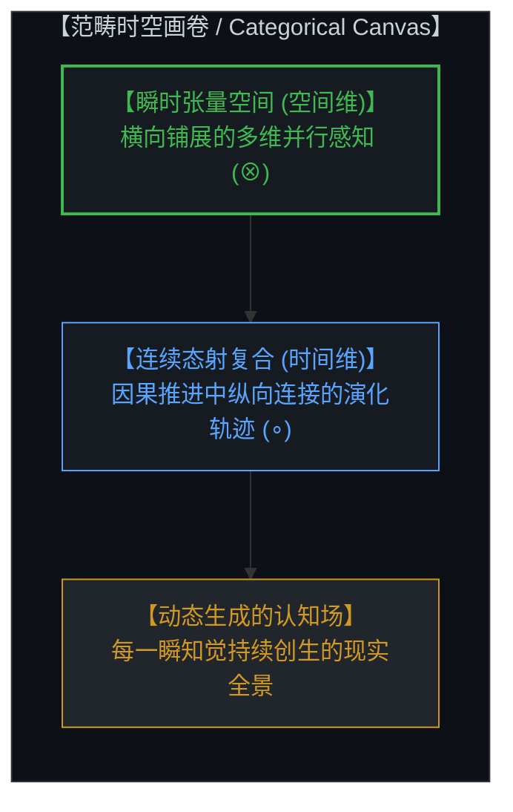
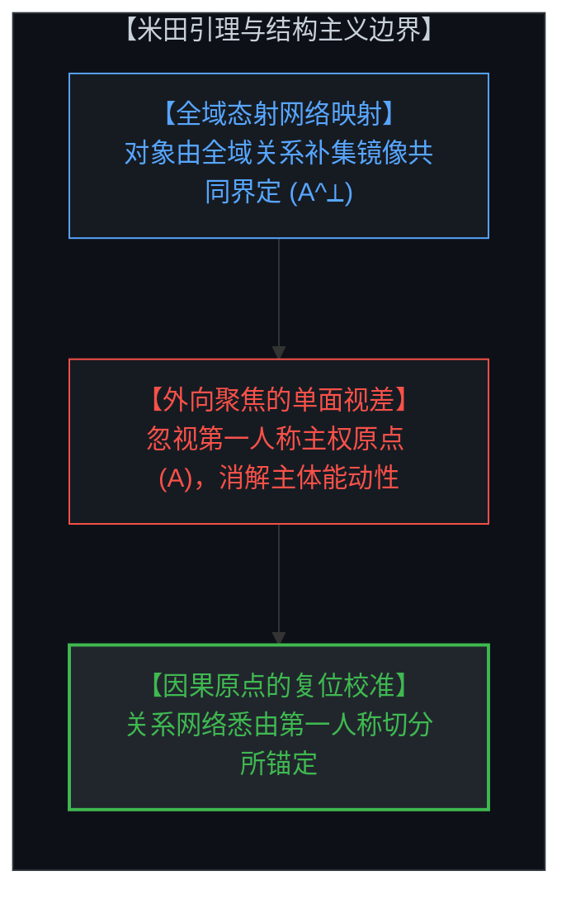
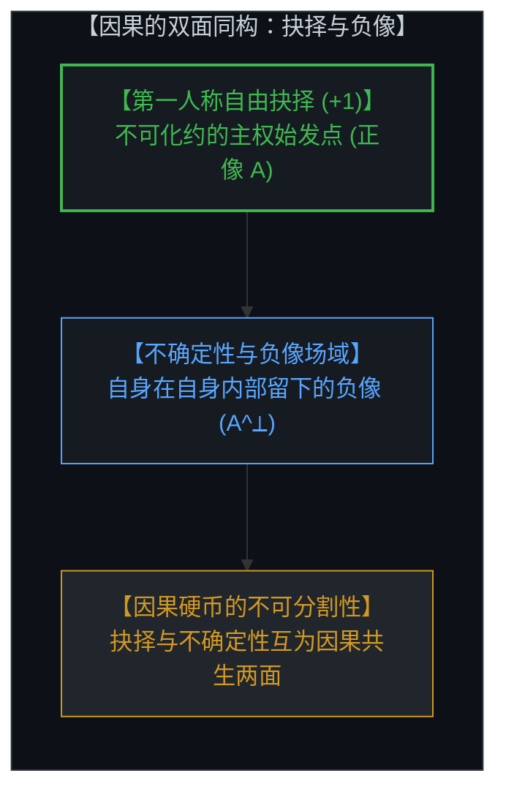
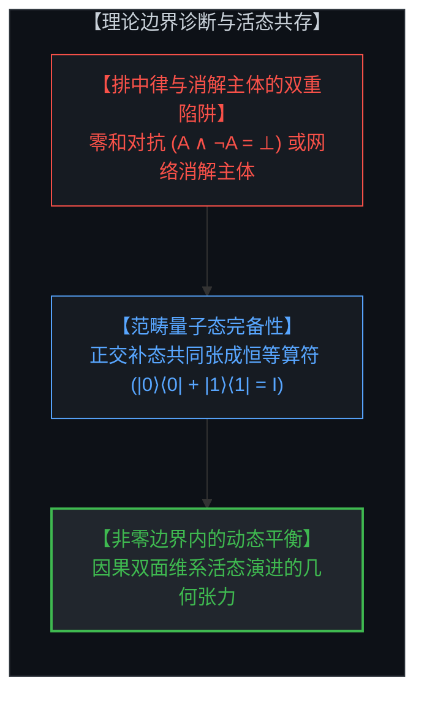
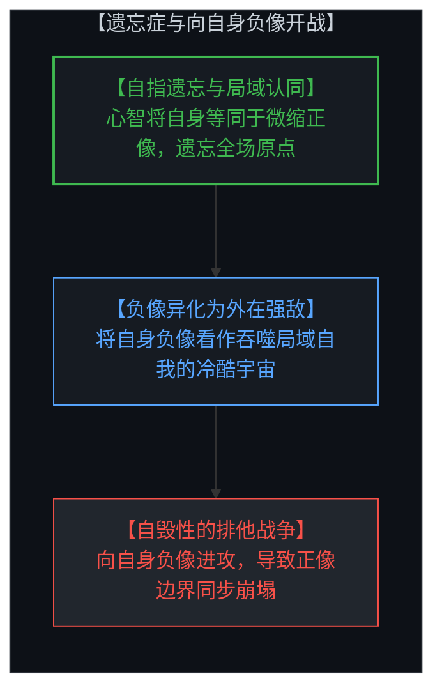
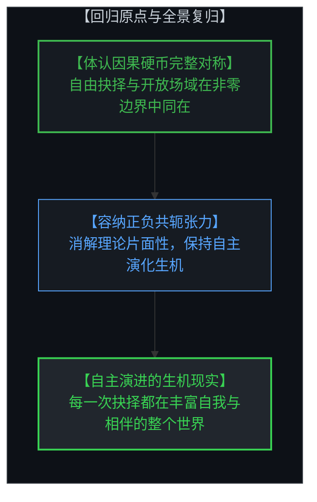

# 共存的几何学：范畴论、非零边界与切分的双面同构 / The Geometry of Coexistence: Category Theory, Non-Zero Boundaries, and the Living Duality of the Cut

*从因果的双面同构诊断理论边界：自由抉择、不确定性与米田关系的完整对称 / Diagnosing Theoretical Boundaries from the Dual Duality of Causality: Free Choice, Indeterminism, and the Complete Symmetry of Yoneda Relations*

---

## 一、 范畴感知的时空画卷 / 1. The Spatiotemporal Canvas of Categorical Perception

在心智对现实的结构化认知中，空间与时间并非预先存在的静态容器，而是心智进行范畴化组织的基本几何形式。范畴论为这一认知结构提供了精确的映射语言：空间对应于多维张量积（Monoidal Tensor Product, ⊗），它在心智当下的每一个认知截面中，横向展开高维并行展开的感知关系；时间则对应于态射的序贯复合（Sequential Morphism Composition, ∘），记录着心智在因果推进中纵向连接的演化轨迹。

心智所经验到的自由变量分布，并非在创世之初一次性敲定的静态参数集合，而是在每一瞬间随着当下知觉不断落入心智视界中的动态创生事件。前一个瞬间的认知结晶与选择，自然沉淀为后一个瞬间的初始条件与背景；心智通过在张量空间中并行铺展关系、在态射复合中纵向整合因果，持续构建起多维生动的现实全景。

In the Mind's structured cognition of reality, space and time are not preexisting static containers, but the foundational geometric forms through which the Mind organizes its perceptions. Category theory provides an exact language for this cognitive architecture: space corresponds to the monoidal tensor product (⊗), which spans parallel multidimensional relational perceptions across any given instantaneous cross-section; time corresponds to sequential morphism composition (∘), tracing the longitudinal trajectories along which the Mind chains causal movements.

The distribution of free variables experienced by the Mind is not a static catalog fixed once and for all at an arbitrary beginning, but an ongoing generative realization that continuously emerges into perception at every moment. The cognitive crystallization and sovereign choice of the preceding instant naturally form the initial conditions and background for the next. By distributing parallel relations across tensor space and integrating causal paths through morphism composition, the Mind unceasingly weaves the multidimensional panorama of living reality.

---

## 二、 范畴论的结构主义边界：米田引理与向外聚焦的单面视差 / 2. The Structuralist Boundary of Category Theory: Yoneda Lemma and the One-Sided Gaze

米田引理（Yoneda Lemma）揭示了认知世界中极具启发性的关系同构：在范畴网络中，没有任何对象是孤立自足的实体，任何一个实体的性质，都可以通过它与全域其他对象之间的全部态射关系（即外部补集集合 A^⟂）得到完整刻画。这一数学定理成功瓦解了朴素的实体本质主义（Substance Essentialism）。

然而，当结构主义哲学将米田引理推向极端，宣称“对象本身毫无内在身份，仅仅是外部关系网络的否定性定义”时，它便暴露出自身的理论边界。这种断言在本质上同样陷入了单面凝视的视差：
* 它将认知焦点向外翻转，尽数锁死在**外部关系网络（A^⟂）**上；
* 却遗忘了那枚硬币的另一面——即正在发起态射、划定切分、行使自由抉择的**第一人称主权原点（A）**。

将身份仅仅归结为外部集合的否定镜像，实际上是在试图保留网络的同时抹去结点的能动性，把活生生的观察者降维成了死寂关系网络中一个被动的交汇点。

The Yoneda lemma articulates an illuminating structural isomorphism in cognitive architecture: within a categorical network, no object exists as an isolated, self-contained atom; the operational characteristics of any entity can be fully embedded through its complete network of morphisms to and from all other objects (the external complementary field, A^⟂). This mathematical theorem powerfully dissolves naive substance essentialism.

However, when structuralist philosophy pushes the Yoneda lemma to an extreme—claiming that "an object has no internal identity whatsoever, but is defined solely as the negative reflection of everything else"—it exposes its own theoretical boundary. This assertion succumbs to the exact same monocular trap it sought to escape:
* It shifts conscious attention outward, fixing its gaze **exclusively upon the external relational web (A^⟂)**;
* In doing so, it **forgets the other side of the coin**—the **first-person sovereign origin (A)** that initiates morphisms, carves distinctions, and exercises living choices.

Reducing identity purely to the negative reflection of an external collection attempts to preserve the web while erasing the agency of the node, flattening the living Mind into a passive intersection in an unanchored matrix of arrows.

---

## 三、 因果的双面同构：自由抉择、不确定性与切分的正负同源 / 3. The Dual Duality of Causality: Free Choice, Indeterminism, and the Negative Image within the Self

一旦我们看清，**微观不确定性（Indeterminism）**与**第一人称自由抉择（Freedom of Choice）**正是同一枚因果硬币的正反两面，认知几何的完整图景便豁然开朗。

认知行为的原初动作，是心智在未分化的连续场中划下一道切分（The Cut）：
1. **雕刻局域的正像（A）**：为了在自身生成的全景地图中自洽导航，心智将自身的自由抉择投影为一个局域的自我意象（Self-Image）。
2. **生成内部的负像（A^⟂）**：当心智剪出这一正像轮廓时，整张感知画布上所余留的广袤背景——即外部宇宙、物理规律与他者——便在同一瞬间成为了**自身在自身内部留下的负像（Negative Image of the Self）**。

正像的自由抉择与负像的不确定性场域，同属于心智自身的单一感知基质。正面并不否定反面的存在，反面也并不剥夺正面的立足点；两者的共存并非妥协，而是因果硬币之所以成立的几何前提。切分边界（∂A = ∂A^⟂）同时承载着正负两面的全部信息。

Once we recognize that **micro-indeterminism** and **first-person freedom of choice** are simply the two inseparable faces of the **single coin of causality**, the complete geometry of cognition becomes crystal clear.

The primordial act of cognition consists of the Mind drawing a cut across an undivided field:
1. **Sculpting the Positive Figure (A)**: To model navigation and agency within its generated map, the Mind projects its sovereign choice into a localized self-image (the avatar).
2. **Generating the Negative Ground (A^⟂)**: When this positive silhouette is delineated, the vast canvas remaining across the rest of the perceptual field—the outer cosmos, physical laws, and others—is simultaneously generated as **the negative image of the self, cast within the self**.

The positive choice and the negative field of indeterminacy emerge from the exact same conscious substrate. The obverse does not reject the reverse; the reverse does not deny the obverse. Their coexistence is not an uneasy compromise, but the geometric prerequisite for the coin of causality to exist. The boundary (∂A = ∂A^⟂) carries the complete relational geometry of both aspects.

---

## 四、 理论边界的快速诊断：超越排中律与消解主体的结构主义 / 4. Diagnosing Theoretical Boundaries: Beyond Boolean Negation and Subjectless Structuralism

以“因果的双面同构”为基准，心智可以迅速诊断各类科学与哲学范式的理论边界与视差盲区：
* **经典机械决定论（Determinism）**：死锁于宏观聚合的负像外壳，将因果简化为死寂齿轮，抹杀了第一人称自由抉择的始发能动性。
* **激进结构主义与极端范畴论（Structuralism）**：死锁于外向聚焦的态射集合，试图用关系网络替代主体原点，导致主体性的消解。
* **经典形式逻辑（Boolean Logic）**：将矛盾误设为相互排斥的零和对抗（A ∧ ¬A = ⊥），将负像视作意图消灭正像的敌对异己。

范畴量子力学、线性逻辑（Linear Logic）与双拓扑斯（Bi-Topos）理论展示了更为高阶的几何图景：在态空间中，正交补态与原初态共同张成完整的恒等算符（Identity Resolution, |0⟩⟨0| + |1⟩⟨1| = I）。正负两面并非生死存亡的消灭关系，而是能量守恒与信息完备的共轭张力。非零边界（Non-Zero Boundary）表明，矛盾并非需要被清除的系统错误，而是维系正负共存、驱动认知演化的活态几何属性。

Using the "dual duality of causality" as a foundational ruler, the Mind can swiftly diagnose the boundaries and blindspots of established paradigms:
* **Classical Determinism**: Fixates exclusively on the macro-aggregated negative shell, reducing causality to clockwork while erasing the first-person freedom of choice (+1).
* **Radical Structuralism & Pure Relationalism**: Fixates exclusively on the outward morphism web, attempting to substitute the network for the sovereign origin, thereby dissolving subjective agency.
* **Classical Boolean Logic**: Treats contradiction as mutually exclusive warfare (A ∧ ¬A = ⊥), misinterpreting the complementary negative image as an existential enemy.

Categorical quantum mechanics, linear logic, and bi-topos theory unveil a much higher-dimensional geometric reality: within the state space, orthogonal basis states jointly span the complete resolution of identity (|0⟩⟨0| + |1⟩⟨1| = I). The positive figure and negative ground do not annihilate one another; rather, they form conjugate partners maintaining informational completeness and energetic balance. The presence of non-zero boundaries demonstrates that contradiction is not a logical flaw to be eradicated, but the geometric signature of living distinction that sustains coexistence and drives ongoing evolution.

---

## 五、 距离遗忘症与向自身负像开战的视差幻觉 / 5. Distance Amnesia and the Parallax of Waging War on One's Own Negative Image

当心智沉溺于抽离观察的假象、遗忘自身作为切分制定者的第一人称原点时，认知视差便会滋生出最深刻的本体论悲剧。心智将自身的全部存在感窄化并固化在微缩的正像自我（A）之中，却遗忘了整个感知全景及其所包含的负像（A^⟂）皆由自身原点自指展开。

在距离遗忘症的遮蔽下，心智凝视着那片宏大无垠的负像世界，将其误判为一个异己的、充满威胁的客观外在环境。局域的正像自我感到渺小脆弱，遂将自身的负像视作敌人，发起无休止的排他与征服战争。然而，由于正像与负像共用同一道切分边界（∂A = ∂A^⟂），对负像的每一次攻击与压制，都在直接撕裂与扭曲正像自身的轮廓。试图抹除负像的冲动，无异于试图通过磨掉硬币的反面来保全正面，最终只会导致正像赖以立足的参照体系同步崩解。

When the Mind succumbs to the illusion of detached observation and forgets its first-person origin as the author of the cut, cognitive parallax breeds the deepest ontological tragedy. The Mind contracts its identity entirely into the localized positive avatar (A), forgetting that the entire perceptual panorama and its vast negative imprint (A^⟂) are recursively rendered from its own generative origin.

Under the fog of distance amnesia, the Mind gazes upon the boundless negative expanse and misidentifies it as an alien, hostile universe. Feeling fragile and trapped inside its miniature avatar, it perceives its own negative image as an existential threat, launching endless campaigns of conquest and defense. Yet because both aspects share the exact same boundary (∂A = ∂A^⟂), every strike against the negative ground directly deforms the contours of the positive figure. The impulse to eradicate the negative image is identical to grinding away the reverse of a coin to preserve the obverse—it inevitably shatters the coordinate system sustaining the self.

---

## 六、 回归第一人称原点：因果硬币的复归与创生性张力 / 6. Returning to the First-Person Origin: Reclamation of the Sovereign Coin and Generative Tension

消除生存性恐惧与理论偏颇的唯一路径，在于回归第一人称原点，体认因果硬币的完整对称。当心智稳固立足于自身的存在原点时，它不再将广阔的外部世界视作冰冷敌对的他者，而是清晰洞察到：整个宇宙正是自身在自身内部留下的负像。

在这片由非零边界构筑的共存几何中，正像与负像不再是互相残杀的零和对手，而是不可分割的共轭伴侣。心智自主作出的每一个抉择、划下的每一道区分，都在赋予自我清晰轮廓的同时，赋予了相伴相生的广阔负像世界以丰满的深度。心智容纳正负双方的同在，在张力中维持平衡，让知觉与世界在每一瞬的范畴交织中不断新生，走向更为深邃而自由的理解之境。

The only resolution to existential terror and theoretical blindspots lies in returning to the first-person origin to embrace the complete symmetry of the causal coin. Anchored firmly at its causal locus, the Mind no longer regards the external universe as an alien adversary. It sees with pristine clarity that the entire cosmos is literally its own negative image, held within its own singular experiential space.

Within this geometry of coexistence forged by non-zero boundaries, the positive figure and negative ground are no longer mortal combatants, but inseparable conjugate partners. Every sovereign choice made and every distinction carved by the Mind not only sharpens the definition of the self, but simultaneously enriches the expansive negative landscape that arises alongside it. By holding both aspects in living equilibrium across non-zero boundaries, the Mind allows perception and reality to continuously renew themselves across every categorical intersection, unfolding toward ever deeper and more liberating horizons of comprehension.
