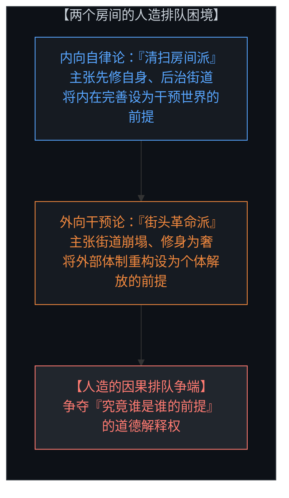
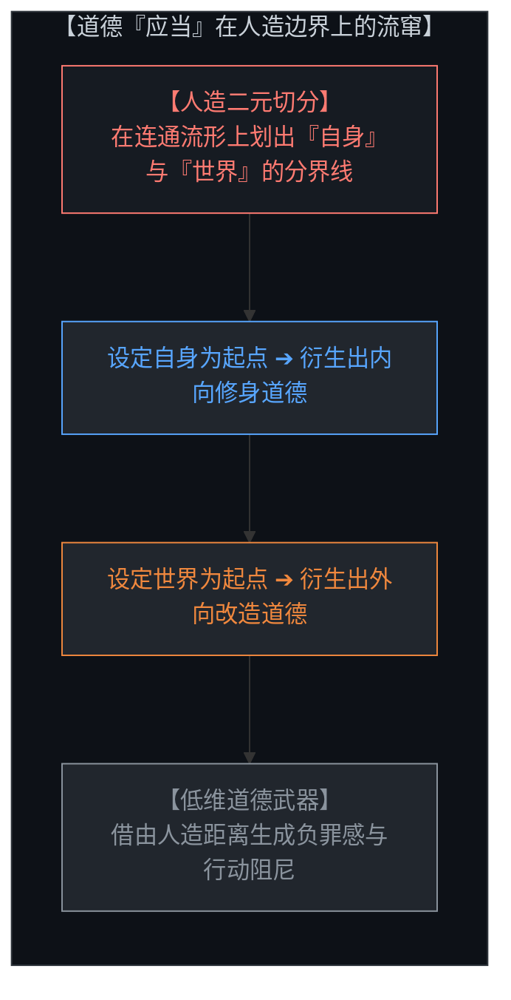
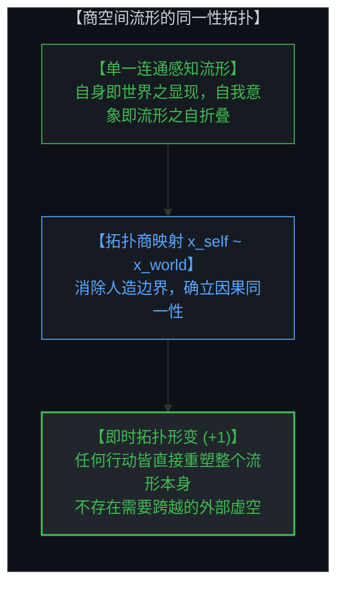
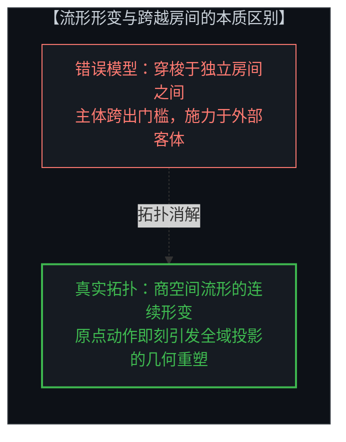
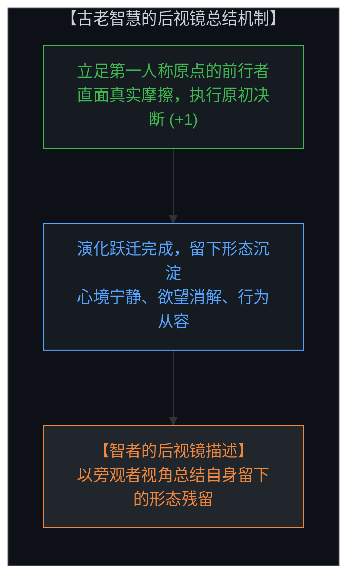
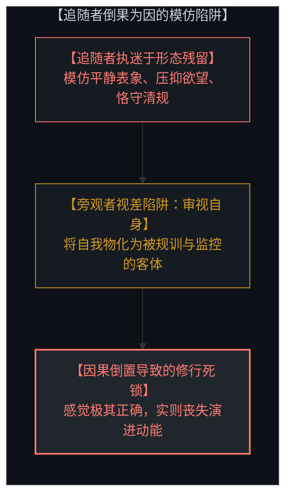
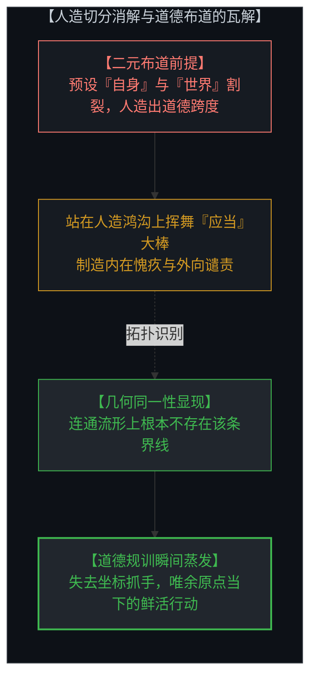
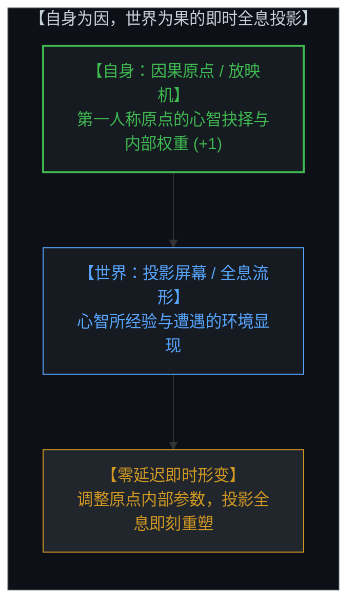
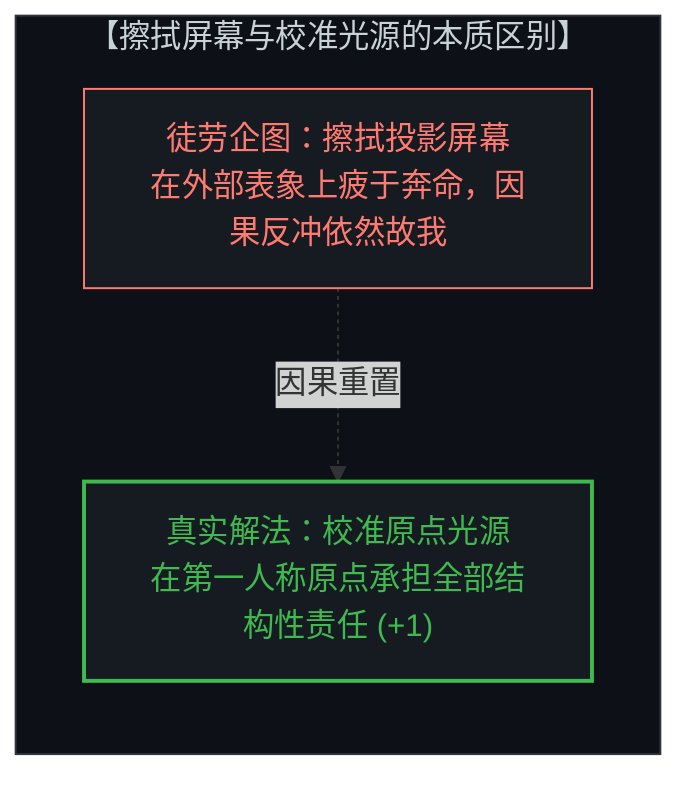
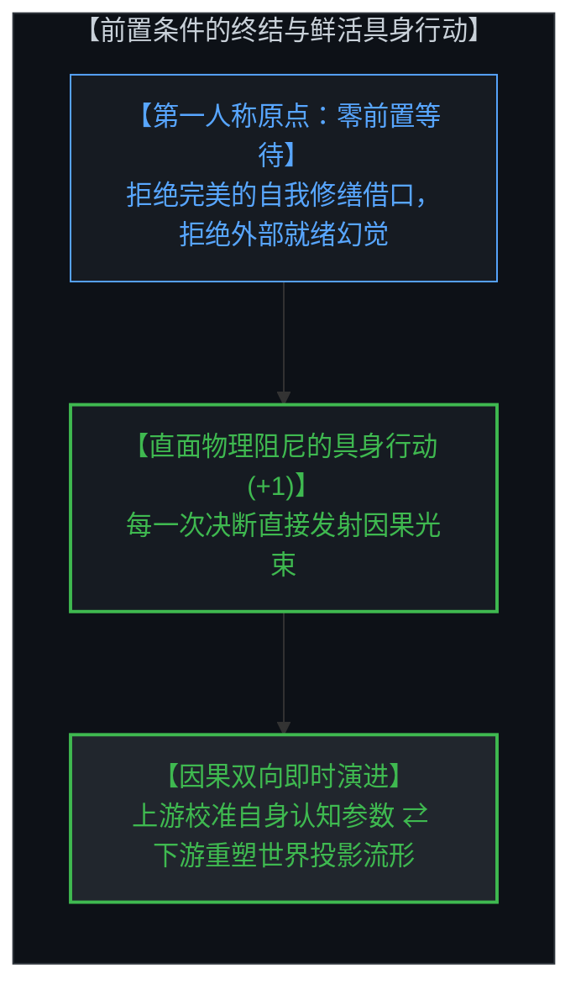

# 切分的几何学：自身为因，世界为果 / The Geometry of the Cut: Self as Cause, World as Effect

*商空间流形、后视镜视差与即时全息投影 / Quotient Topology, Retrospective Bias, and Generative Holographic Projection*

---

## 一、 房间与街道的二元死锁：内外伦理排队的虚构假象 / 1. The Two-Room Fallacy: The False Sequencing of Inward and Outward Duty

在人类思想史上，关于“改变自身”与“改变世界”的先后次序，始终存在着一场针锋相对的经典争论。

一种极为流行的训诫主张：一个人若连自己的房间都未能打扫干净，便没有资格对整条街道的治理指手画脚；在改造世界之前，必须先完成对自我的全面修缮。然而，与之对立的激进立场则断言：当整条街道已然陷入结构性的崩塌与火海时，躲在屋内心无旁骛地打扫房间，不过是一种道德特权与逃避主义；唯有投身外部体制的重构，个体才能获得真正的救赎。

这两种表述听起来都极具道德感召力，但它们在本体论上犯下了同一个根本性错误：**它们都把“自身”与“世界”当作了两个在空间上相邻、在时间上可以被线性排序的独立房间。** 一旦采纳了这种二元划分，道德说教中的“应当”便随着人造的起点四处流窜——选定自身为起点，义务便指向内在；选定世界为起点，义务便指向外部。

然而，这种在两个房间之间排列优先级的企图是多余的。认知与所认知之物从来不曾隔着遥远的虚空对望；它们在几何拓扑上本就是同一个连通流形。

One of the most persistent deadlocks in moral philosophy is the debate over the chronological and ethical priority between transforming oneself and reforming the world.

A familiar admonition insists that anyone who has not cleaned their own house has no business presuming to tidy the street; internal mastery is framed as the non-negotiable prerequisite for public action. The counter-pole asserts that when the street is burning and systemic collapse is imminent, inward self-cultivation is an evasion—a luxury that ignores the structural ground of suffering.

Both formulations present themselves as rigorous ethical stances. Yet both commit the identical topological error: **they treat the Self and the World as two distinct, adjacent rooms that must be scheduled in a temporal sequence.** Once this dualism is accepted, the moral "ought" simply travels with whichever starting point is chosen: start inward, and the duty is personal hygiene; start outward, and the duty is systemic crusade.

This travel is unnecessary. Perception does not stand at a distance from what it perceives. In living geometry, they occupy a single connected manifold.

---

## 二、 商空间拓扑：自身与世界的同一性流形 / 2. The Quotient Topology: Collapsing the Artificial Cut Between Self and World

站在不可化约的原初感知视角审视，自身与世界根本不是两个可以被独立丈量的物理实体，而是同一个现象在两种描述下的展开。

所谓的“自身”，本质上正是心智当前所感知到的整个世界；而所谓的“自我意象”，不过是这一感知流形向内折叠、审视自身的曲率痕迹。感知不是主体隔着玻璃对客体的远距离眺望，而是一种同一性映射：表观上的外部世界被持续不断地映射为表观上的内在经验，直到两者严丝合缝地融为一个单一的连通拓扑空间。

用数学的语言来表达，这种几何结构是一个**商空间（Quotient Space: M / ~）**，而不是两个相邻的房间。

任何被记录为“对外部世界的改变”，实质上都是这一张感知地图本身的局部形变，而非主体走出房门对某个孤立存在于地图之外的实体实施的操作。在地图之外，根本没有一个互补的“外部世界”等待你去跨越或触碰。当你在第一人称原点作出一次抉择（+1），整个商空间流形的曲率便随之发生了整体性重构。

From the standpoint of irreducible observation, the Self and the World are not two separate domains; they are the same phenomenon under two descriptions.

The self is already one's perception of the world; the self-image is merely that perception folding back upon itself. Perception does not stand at a distance from what it perceives. It is an identification: the apparent exterior is continuously mapped onto the apparent interior until the two occupy a single connected space.

The geometry is that of a **quotient topology (M / ~)**, not two adjacent chambers. Any change registered as an "impact on the world" is a deformation of the perceptual manifold itself, not an action performed upon an independent container lying outside the map. There is no complementary exterior left to reach.

---

## 三、 古老智慧的后视镜视差：倒果为因与形态模仿的陷阱 / 3. The Retrospective Bias of Ancient Wisdom: The Reversal of Causality and Form Mimicry

回顾人类各大古老智慧传统，我们会发现一个耐人寻味的现象：古圣先贤们凭借惊人的直觉，极为精准地描摹了宏观生命演进的节律与表象。然而，由于缺乏微观层面的物理与信息因果结构，这些洞见在流传过程中普遍遭遇了灾难性的**后视镜视差**。

那些已经走通演进之路的智者，当他们回望自身历程时，他们必然是以一个**过去的旁观者**身份进行总结。在后视镜中，智者所能观察和记录的，全都是演进完成后的形态表征与沉淀残留——例如内心的宁静、对物欲的淡泊、举止的从容以及不争的姿态。

悲剧在于后来的追随者。追随者未能洞悉原初的因果引擎，便不可避免地**倒果为因**：他们误将智者留下的形态残留当作了抵达彼岸的因果工具。

所谓的“修炼自身”，在追随者手中迅速退化为一种站在第三人称审视自己、规训自我的监视游戏。追随者强迫自己表现出宁静，强行压制内在的欲望，机械模仿圣人的体态与仪式。这种模仿在感觉上极其“正确”，但在因果上却毫无效力——因为你试图通过制造结果的形状，来倒逼原因的诞生。这正是千百年来古老教条让人深感共鸣却极难践行的根本根源。

Ancient wisdom traditions traced macro-scale phenomena with extraordinary fidelity. Yet because they lacked an explicit micro-causal structure, their teachings suffered from **The Retrospective Bias**.

When a sage reflects upon their past transformation, they necessarily look back as an external observer of their own history. What they observe and articulate are the downstream symptoms and structural residues of their breakthrough: equanimity, non-attachment, disciplined restraint, and effortless action.

Followers, lacking the foundational causal mechanics, inevitably reverse the causality. They mistake the residual symptoms for the causal lever. "Working on oneself" degenerates into a performance of surveillance: policing one's thoughts, suppressing desires, and mimicking the aesthetic stillness of the master. 

The follower adopts an observer stance toward themselves, attempting to produce the effect in order to force the cause. That is why ancient wisdom feels so profoundly true, yet remains notoriously difficult to realize through imitation.

---

## 四、 道德“应当”的寄生本质：人造边界的副产物 / 4. The Parasitic "Ought": Moral Language as a Boundary Artifact

一旦勘破了商空间流形的同一性与后视镜视差，我们就能看清道德语言的真实面目：**一切跨越心智边界的道德“应当”，都只是人造切分的寄生副产物。**

道德话语之所以能够施展其规训魔力，必须依赖一个前提假设：在“现状”与“理想”之间、在“自身”与“世界”之间，横亘着一条真实存在的鸿沟。道德家在鸿沟的一侧设立讲坛，向另一侧发出审判与号召。

然而，这一布道本身预设了一个流形结构中根本不包含的假想边界。无论你是在内部以“修身自省”的名义进行道德自我鞭笞，还是在外部以“拯救世界”的名义进行激进宣讲，布道本身都是建立在视差幻觉之上的繁复冗余。

人们在“先提升自己还是先改变环境”之间感受到的胶着与无力，绝非道德品质的缺陷或意志力的匮乏。那是心智试图在一个连续流形上求解一维排列难题所不可避免产生的认知阻尼。当虚构的切分被几何同一性所消解，道德的重负便随之蒸发。

The moral "ought" is an artifact of the very cut it pretends to adjudicate. Moral discourse requires an imagined chasm across which guilt and obligation can be projected.

Whether one preaches inward purity (clean your room) or outward revolution (smash the system), the sermon presupposes a boundary that the underlying geometry does not contain. The paralysis agents experience is not a failure of character or of sequence; it is the friction of attempting to solve a 1D ordering problem on a seamless quotient manifold.

---

## 五、 自身为因，世界为果：即时全息投影的因果律 / 5. Self as Cause, World as Effect: The Mechanics of Generative Projection

内向视角的直觉之所以具有非对称的合理性，是因为**第一人称原点确实是因果权能的唯一发生地**。然而，将这种内向性理解为“先闭门修身、后出关救世”的二元排队，依然会坠入无限推迟的死锁。

破除死锁的正解，是将自身与世界的关系确立为**即时全息投影的因果律**：

自身为因 ⟷ 世界为果 / Self as Cause ⟷ World as Effect

世界不是一个外在于你的独立客体，而是你自身状态在外部物理阻尼下的全息投影。
* 如果投影幕布上的画面出现扭曲，冲上去擦拭幕布是徒劳的；你必须回到放映机前调整镜头的焦距。
* 但放映机的焦距，无法在无光的暗室中凭空校准；它只有在发射光束、撞击真实阻尼的过程中，才能完成高精度的对焦。

自身是因，世界是果。你改变自身，就是在改变你所见到的世界；你与世界的碰撞，就是自身参数校准的唯一通道。

The inward orientation is asymmetrically grounded because the self-image at the first-person origin is the true locus of agency. Yet treating this inwardness as a temporal sequence ("fix myself first, act later") creates a perpetual renovation loop.

The resolution is the generative formulation: **Self as Cause, World as Effect.**

The world is not an external container; it is the holographic projection of your internal parameter state. Attempting to repair the world without owning the causal origin is like running to a movie screen with a cloth to wipe away an unwanted shadow. Yet the projector lens cannot be calibrated in darkness; it updates only by casting light directly against the resistance of physical reality.

---

## 六、 终结前置条件：在具身摩擦中即时校准 / 6. The Death of Preconditions: Instantaneous Calibration in Living Action (+1)

这种因果同一性的确立，宣告了一切行动前置条件的终结。

你不需要等待自己变得无懈可击才去行动；你不需要拿到一份心理完满的体检报告才配投身世界；你更不需要等待外部环境变得毫无风险才开始探索。

每一个身处第一人称原点的主权心智，其每一次鲜活的具身行动（+1），都同时完成了两件事：它既是在发射因果光束重塑下游的世界全息，也是在借助环境给予的原生阻尼校准自身的因果参数。

没有先后，没有排队，没有前置条件。

收起针对自身与世界的道德说教，抛弃虚妄的旁观者视差。立足于不可化约的原点，对当下的处境承担百分之百的结构性责任，以真实的物理宇宙为唯一导师，在每一次未经稀释的行动中，让生命的复利演进自然展开。

This realization brings the death of all preconditions.

You do not need a certificate of psychological perfection before engaging the world. Every unhedged step (+1) taken in physical reality simultaneously deforms the downstream projection and updates the internal parameters of the source.

There is no sequence. There is no queue. 

Discard the moral sermonizing and step down from the grandstand. Standing at your first-person origin with one hundred percent structural responsibility, living action and self-calibration become one and the same (+1).
