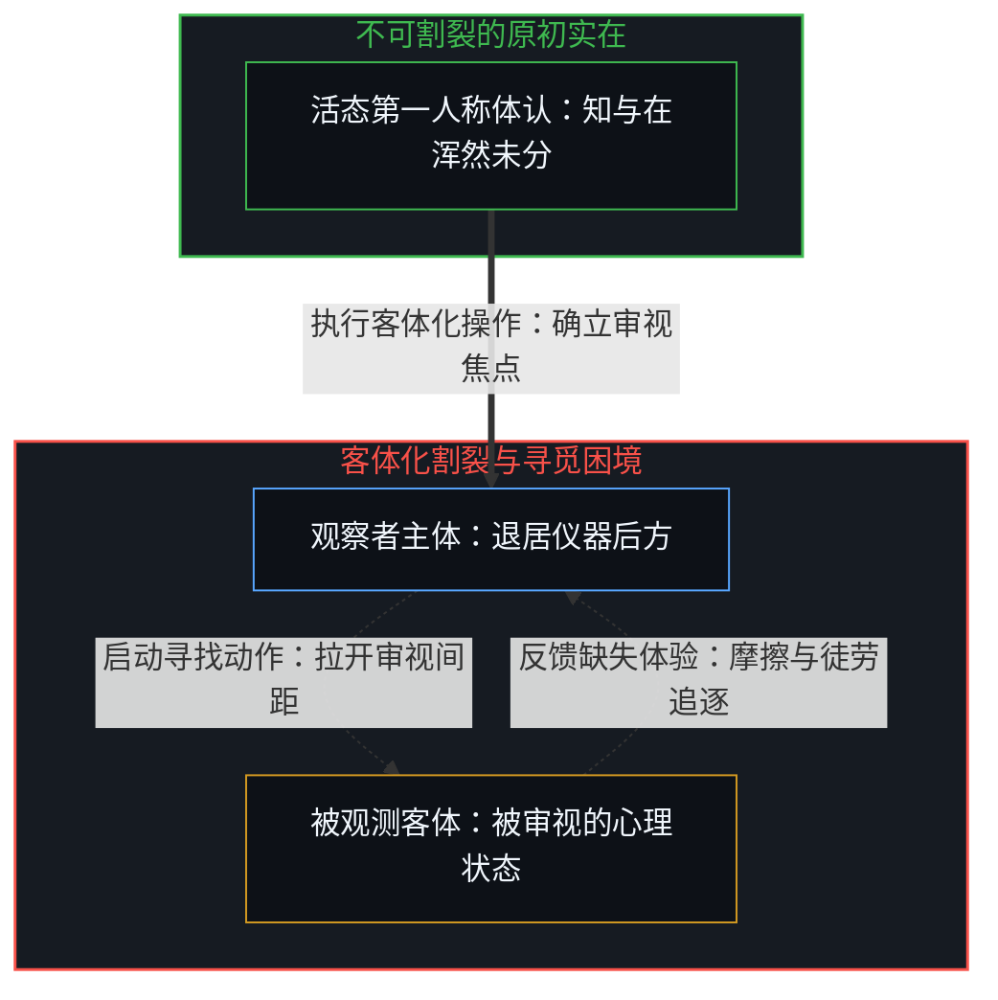
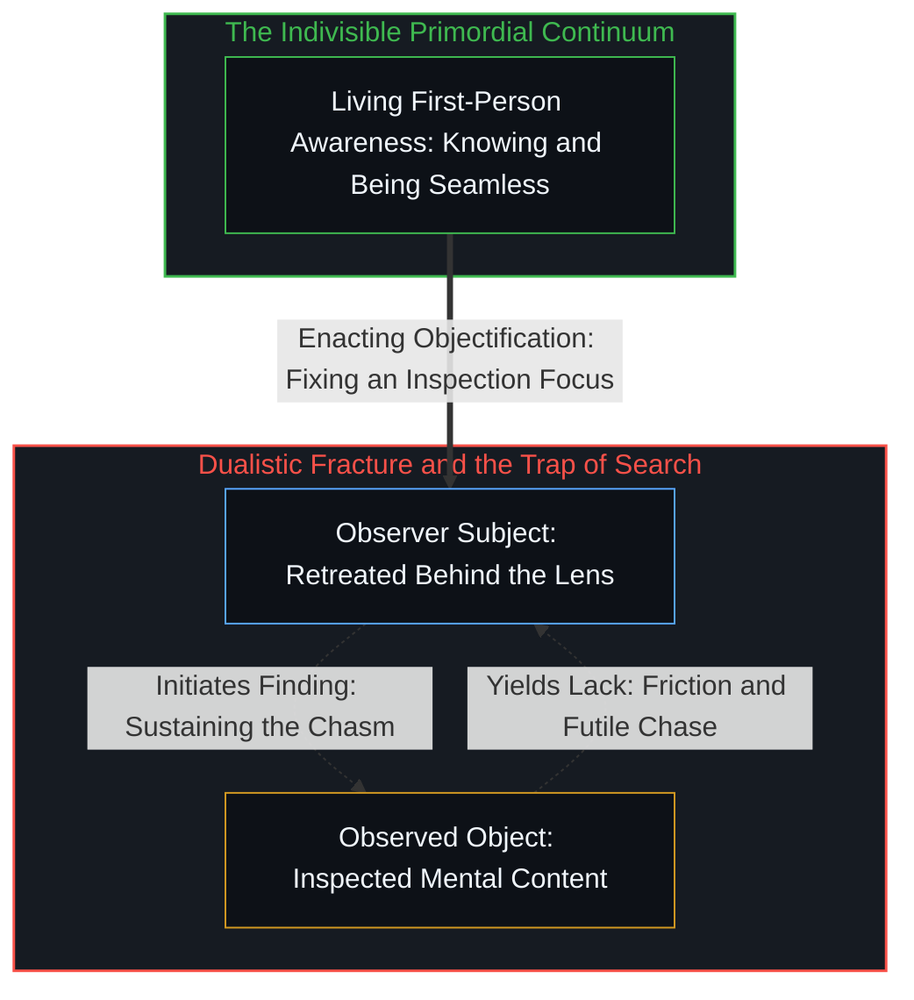
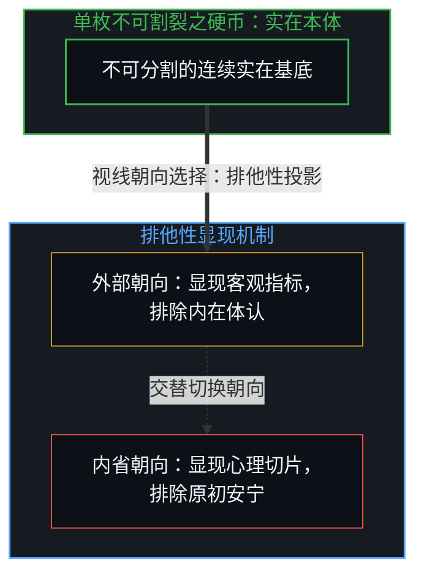
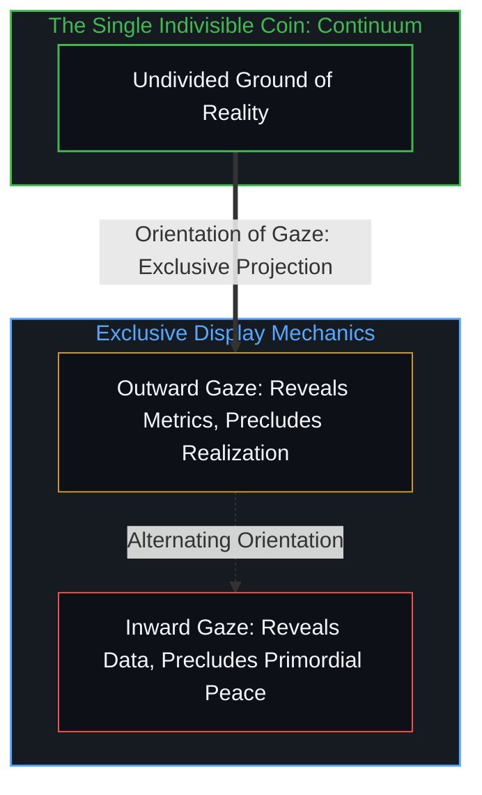
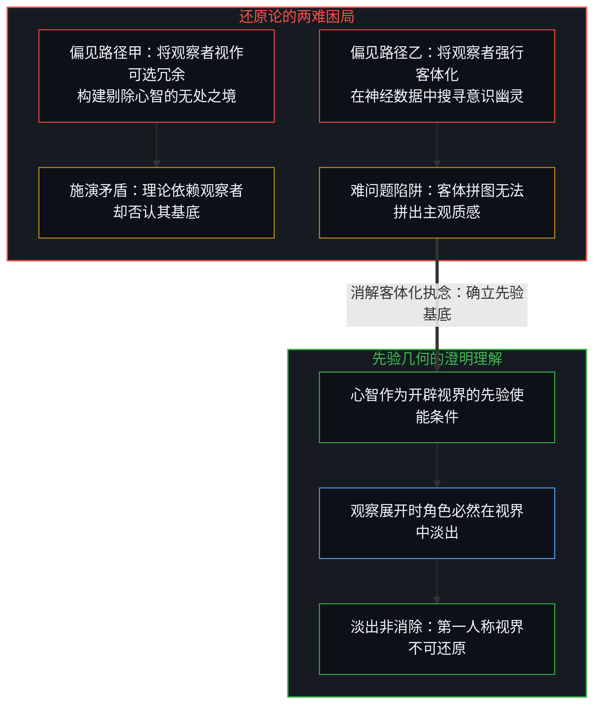
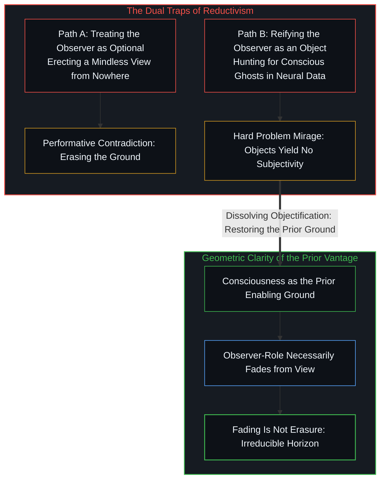

# 寻觅的语法与淡出的观察者 / The Grammar of Finding and the Fading Observer

*寻觅将领悟割裂为客体，观察者在开辟视界时隐退为先验条件而非可消除的冗余 / Finding turns realization into an object; the observer fades as an enabling ground rather than an optional artifact*

在自身内部难以寻得幸福，在其他地方更不可能寻得，这一流传久远的经典表述揭示的并非关于世界的两桩经验事实，而是观察行为本身的单一结构性特征。尚福尔所铸造、后被叔本华引用的格言，准确指出了主客体之间的不对称性：外部客观条件能够提供契机或消除阻碍，却无法构成第一人称的内在领悟。而深入反思则进一步表明，内向探寻的挫败源于同样的机制：一旦心智启动寻找的操作，便预设了寻觅者与被寻之物隔绝的客体化姿态，将不可割裂的活态体认推向了对立面。

The difficulty of locating happiness within oneself, and the impossibility of locating it anywhere else, arises from a single structural feature of observation rather than from two separate empirical facts about the world. The formulation coined by Nicolas Chamfort and later adopted by Arthur Schopenhauer marks this fundamental asymmetry: external conditions can supply occasions and eliminate obstacles, yet they cannot constitute a first-person realization. What systematic reflection reveals is that the internal route falters for an identical reason: the act of finding installs an observational posture in which the seeker stands apart from the sought, casting an indivisible living realization onto the far side of a dualistic divide.

## 一、 寻觅的语法与幸福的不对称性 / 1. The Grammar of Finding and the Asymmetry of Happiness

当人们试图理解幸福的居所时，常陷入一种空间定位的语词迷宫。尚福尔的名言尖锐指出，在外部世界找寻幸福是绝无可能的，而在自身内部寻觅又充满艰难。这种不对称性之所以成立，首先在于外部环境属于第三人称可观测实体的领域。不论财富、声望、物理居所或人际赞誉如何堆叠，它们所展现的都只是客体属性的组合。没有任何处于第一人称视界之外的事物，能够直接替代主观体验本身的澄明状态。因此，将幸福寄托于外部占有，从结构上注定是一场无解的追逐，因为客体永远无法蜕变为观察者当下的主观体认。

When people attempt to locate where happiness resides, they frequently stumble into a spatial labyrinth created by ordinary language. Chamfort famously observed that finding happiness outside oneself is impossible, while finding it within remains extraordinarily difficult. This asymmetry holds because external circumstances belong strictly to the domain of third-person observables. Regardless of how wealth, acclaim, sensory comfort, or social status accumulate, they present only configurations of objects. Nothing situated outside the first-person horizon can substitute for the luminous clarity of subjective awareness itself. Pinning fulfillment to external acquisition remains a structural impossibility, for no object can transform into the immediate realization of the observing mind.

然而，当心智遵从哲学教诲将目光撤回内心时，寻觅的行动却迅速制造出第二重困境。寻找这一动词本身，深植于主体对分离客体的探测语法。一旦一个人开始在内心寻找某种名为幸福的心理状态，心智便立刻分裂为一个进行巡视的监视者和一个被巡视的情感对象。无论找到的是瞬时的多巴胺愉悦、宁静的冥想心境还是自我肯定的情绪，被找到的都只是一组被心智对象化的心理切片。观察者与被观察者在巡视机制生效的瞬间已经拉开距离。人们之所以将内向探索的困境感知为艰难而非不可能，是因为当心智偶然放下巡视姿态、体会到未割裂的安宁时，世俗语言习惯性地将这种姿态的消退误称为找到了它。这种语词归因的错位，使得心智不断通过强化寻找的动作去抓取安宁，结果一次次重新撕开主客割裂的裂痕。正如在探讨[不可还原的观察者](../the-irreducible-observer/)时所揭示的，观察者一旦将自身作为对象打量，它便从原初的生发基底退化为被观测的数据项。

Yet when the mind heeds philosophical counsel and retreats inward, the endeavor immediately engenders a secondary impasse. The verb finding is intrinsically anchored in the operational syntax of a subject inspecting a detached item. The moment an individual attempts to discover happiness within, consciousness fractures into an inspecting observer and an inspected affective object. Whether one catches transient sensory euphoria, quiet contemplative calm, or self-affirmative emotion, what is located is merely another reified mental slice. The observer and the observed pull apart the instant the inspection apparatus activates. Human experience registers the internal impasse as difficult rather than impossible because, whenever the inspecting posture briefly collapses into unmediated contentment, linguistic habit misnames this cessation of search as having found the prize. This lexical misattribution goads the mind into intensifying its search, repeatedly tearing open the very dualistic rift it sought to heal. As established in [The Irreducible Observer](../the-irreducible-observer/), the moment the observer inspects itself as an item, it is degraded from an enabling ground into observed data.

## 二、 客体化与不可分之物的割裂 / 2. Objectification and the Severing of the Inseparable

二元论绝非哲学家在书斋中发明的抽象形而上学理论，而是认知系统执行客体化操作时必然浮现的拓扑结构。观察者与被观察者从未作为两个独立的预存实体而存在；它们是在心智进行客体化划分的瞬间共同成对涌现的。在原始的具身当下，知觉与存在浑然一体，并不存在一道预先划定观察视线起点与终点的沟壑。然而，当心智为了度量、分析或干预而确立一个审视焦点时，它必须将某一部分现实划归为被测量的客体，从而反向凸显出一个驻留在测量仪器背后的主体。客体化行为在逻辑上将不可分割的连续实在劈裂为对立的两极。

Dualism is by no means an optional metaphysical doctrine devised in ivory towers; it is the inevitable topological structure that emerges the instant cognition performs objectification. The observer and the observed never exist as independent pre-formed entities awaiting a bridge; they arise codependently the moment an act of delineation takes place. In primordial embodied presence, sensing and being remain seamless, without an antecedent boundary cleaving the gaze from its scene. Yet whenever the mind fixes an inspectable focus for appraisal, calculation, or control, it carves out a slice of reality as the target, retroactively projecting an observer seated behind the apparatus. The act of objectification logically fractures an indivisible continuum into opposed poles.

一旦这种割裂完成，随后的每一次追寻都不可避免地继承了这一初始创伤。在外部世界中，由于客体与第一人称视界身处异质空间，寻觅的不可能性一目了然。而在主体内部，自我被当成可以被观测、调适与评估的客体后，内视的目光在内心重新复制了这一间距。内向反省原本被寄望于消除隔阂，但它所采用的方法本身却依赖于制造客体。这就导致寻觅越是用力，客体化的割裂就越深沉，主观体验与被审视的情绪对象之间就越无法合一。心智感受到的所谓修持之难，实则是用剪刀去缝合布料所产生的徒劳摩擦。关于客体化姿态如何反噬行动者的主权空间，在分析[主权抉择的双面性与观察的客体化](../the-two-sided-nature-of-sovereign-choice-and-the-objectification-of-observation/)时已有清晰的论证：客体化将原本处于生成态的意向坍缩为既成事实的陈列，阻断了活态生成的可能。

Once this split is installed, every subsequent search inherits the foundational fracture. In the external sphere, because objects reside in an alien coordinate frame detached from the first-person seat, the impossibility of closure remains obvious. Internally, when the self is transformed into an object to be inspected, optimized, and audited, reflective introspection duplicates the identical chasm within. Introspection is summoned to heal separation, yet its chosen instrument relies upon objectification. Consequently, the more rigorously one searches, the wider the dualistic divide becomes, precluding unity between immediate awareness and inspected emotion. The agony of inner seeking is the friction of attempting to weave cloth with scissors. How the objectifying posture devours sovereign agency is demonstrated in [The Two-Sided Nature of Sovereign Choice and the Objectification of Observation](../the-two-sided-nature-of-sovereign-choice-and-the-objectification-of-observation/): objectification collapses generative intention into static exhibits, extinguishing living realization at the source.

## 三、 硬币隐喻与朝向的排他性 / 3. The Coin Analogy and the Exclusivity of Orientations

为了理解不可分之物为何会在观察中显现为相互排斥的对立面，硬币的几何隐喻提供了极具启发性的澄清。对于任何一枚坚实的硬币，观察者在单一视线的投影中，永远只能看到其中的一个面。当你调整朝向让正面充分受光并填满视界时，背面必然处于背光且被遮蔽的状态；反之，当背面朝向观察者时，正面同样无法同时呈现在视野之中。这种同时可见性的缺失，常常诱导朴素实在论做出本体论层面的过度推断，误以为硬币是由两个彼此割裂、互相排斥的独立实体勉强拼凑而成。

To clarify how an undivided reality presents as mutually exclusive opposites under observation, the geometry of a coin provides decisive illumination. For any physical coin, an observer inspecting its surface from a single vantage point can only ever register one face at a time. When one rotates the coin so the obverse catches the light and fills the field of view, the reverse face is cast into shadow and withheld from sight; conversely, turning the reverse toward the observer conceals the obverse. This impossibility of simultaneous visual capture tempts naive realism into an ontological error, falsely inferring that the coin consists of two autonomous, severed entities clumsily glued together.

然而，单一视线下无法兼顾两面，丝毫不意味着硬币在本体上发生了断裂。这一限制仅仅说明，呈现其中一面的观察条件，在物理几何上必然排除了呈现另一面的观察条件。硬币作为一个连续且不可分的实体，其整体性贯穿始终；显现哪一个面，仅仅取决于注意力采取了何种接入朝向。如果将相继显现的不同面貌物化为互不相干的独立实体，便是在把观察姿态的限制强加于被观察的客体。在寻找幸福的语境中，外部寻觅的不可企及与内部寻觅的极度维艰，正是同一种客体化姿态在不同朝向上的投射。面向外部时，观察姿态展现了客体的客观性，因而排除了第一人称领悟；面向内部时，观察姿态将自我物化，因而排除了当下的安宁。实在的连续性从来不需要通过生拼硬凑两个截然不同的面相来恢复，而只需要心智意识到，相继交替的面相仅仅是视线变换的遗迹，而非分裂的实存。正如[观察者的隐身与无损传递的妄念](../the-invisible-observer-and-the-delusion-of-lossless-transmission/)所指出的，任何试图忽略观测朝向而妄想获得全景无损真理的尝试，都会被界面本身的折射击穿。

Yet the impossibility of capturing both faces in a single glance does not divide the coin. It demonstrates only that the conditions required to display one face geometrically exclude the conditions required to present the other. As an indivisible physical continuum, the coin preserves its integrity; which face appears depends strictly on the orientation of observation. Reifying sequential aspects into distinct substances projects the constraints of the observational stance onto the reality observed. Applied to the pursuit of happiness, the impossibility encountered externally and the friction felt internally are two orientations of the same objectifying posture. Turned outward, the stance highlights objective mechanics, excluding first-person realization; turned inward, it reifies the self, excluding unbroken contentment. Continuity is never recovered by assembling severed fragments, but by recognizing that sequential aspects are traces of viewing angles rather than ontological fractures. As shown in [The Invisible Observer and the Delusion of Lossless Transmission](../the-invisible-observer-and-the-delusion-of-lossless-transmission/), any attempt to bypass observational orientation in pursuit of lossless panoramic truth collapses under the refraction of the interface itself.

## 四、 观察者的必然淡出与非可选先验 / 4. The Necessary Fading of the Observer and the Non-Optional Prior

心智在一切认知行动中的位置，展现了一种深刻的结构必然性。观察行为之所以能够发生，首先要求心智作为开启视界的先验条件而存在。任何呈现在视野中的事物，无论是星系的运行轨迹还是神经元的放电脉冲，都必须以心智的觉知为容器和前提。正因如此，当心智投入观察时，观察者这一角色便无法作为视界内部的一件具体物品同时登场。正如眼睛无法将自身作为视野中的物体直接注视，手电筒的光芒无法照亮其光源后方一样，在观察展开的瞬间，观察者必然从被观察的图景中淡出。

The mind's presence within cognitive acts displays profound structural necessity. Observation can occur only because consciousness serves as the enabling condition under which any phenomenon appears. Everything that enters the field—from the trajectory of galaxies to the firing of neurons—requires the scaffolding of conscious awareness as its epistemic medium. Because the observer provides this enabling clearing, the observer-role cannot simultaneously be positioned as one more item within the scene it opens. Just as the physical eye cannot gaze directly upon its own retina while viewing the horizon, and a flashlight cannot illuminate the battery pack behind its lens, the observer necessarily fades from the observable frame at the instant observation unfolds.

然而，淡出绝非被消除，观察者角色更非一种可有可无的附带选项。许多还原论模型常犯下双重错误：其一是将观察者视作可选的冗余，试图构建一种剔除主观视角的无处之境，要求物理世界在没有任何测量视角的前提下自我证明其客观性；其二则是将观察者的淡出误认为观察者的不存在，随后又在面对活生生的主观体验时惊呼遭遇了所谓意识的难问题。这些学术上的悖论与困境，无一不是由于粗暴地要求使能条件要么降格为被观察的客体，要么从宇宙图景中抹去所导致的。一旦人们明白观察者的淡出是其作为认知基础的必然几何投影，就不会再执迷于在客体序列里苦苦搜寻主体，亦不会将第一人称经验当作物理世界里凭空冒出的幽灵。关于物理实在作为一种悬置观察者的人造投影，在[因果不可还原与物理作为无处之境](../causality-is-irreducible-the-physical-is-a-view-from-nowhere/)以及[意识的难问题与学习能力相容](../the-hard-problem-of-consciousness-is-consistent-with-learning/)中已有透彻的剖析；而在[框架的盲区](../the-blind-spot-of-the-frame/)中，这种方法论上的退后与本体论缺席之间的深刻混淆，更被进一步指认为现代意志哲学困境的枢纽根源。

Yet fading is not elimination, nor is the observer an optional ornament. Reductive models routinely commit a dual error: first, treating the observer as dispensable, attempting to construct a view from nowhere where reality explains itself absent any vantage point; second, misconstruing the observer's fading as nonexistence, only to recoil in mystification when confronting subjective experience, christening it the Hard Problem of Consciousness. These philosophical impasses stem directly from the dogmatic demand that the enabling condition either be demoted to an observed object or deleted from the ledger of nature. Once one grasps that the fading of the observer is the geometric consequence of its role as the ground of appearance, the urge to hunt for the subject among objects evaporates, and conscious awareness ceases to look like a miraculous ghost haunting physical matter. How the physical universe functions as an abstraction suspending the observer is dissected in [Causality Is Irreducible; the Physical Is a View from Nowhere](../causality-is-irreducible-the-physical-is-a-view-from-nowhere/) and [The Hard Problem of Consciousness Is Consistent with Our Ability to Learn](../the-hard-problem-of-consciousness-is-consistent-with-learning/); while in [The Blind Spot of the Frame](../the-blind-spot-of-the-frame/), this categorical confusion between methodological withdrawal and ontological absence is unmasked as the root dilemma paralyzing the modern philosophy of volition.

## 五、 停止寻觅与先验视界的归位 / 5. The Suspension of Search and the Restoration of the Prior Vantage

贯穿这一系列困境的，是一条高度一致的因果链条。对幸福的执着搜寻、主客二元的刚性对立、硬币两面的彼此隔绝，以及将心智的先验角色降格或抹杀所引发的理论危机，并不是各自独立的学术谜题。它们全都是心智在确立客体化姿态后，误将这一姿态所伴生的结构性边界，投射为被寻之物的内在属性或理论缺陷的结果。人们制造了一套将不可分之物切割开来的观察方式，随后却抱怨为什么世界总是支离破碎；人们建立了一种依赖于主体退隐的度量机制，随后却惊诧于仪器上为什么永远读不出主体的存在。

A single coherence spans these dilemmas. The relentless pursuit of happiness, the rigid dualism of subject and object, the apparent division of the coin, and the theoretical crises triggered by optionalizing or erasing the observer's prior ground are not isolated academic puzzles. They are unified consequences of maintaining an objectifying posture and then misreading the structural limits of that posture as intrinsic properties of the reality sought, or as shortcomings in theory. Cognition erects a tool that cleaves an indivisible continuum, and then laments that reality appears fractured; it establishes a measurement apparatus that demands the retreat of the observer, and then marvels that the meter records no subjective presence.

所谓幸福或澄明的体认，从不需要通过改良寻找的技术来达成。它不是藏在某个深邃神经回路或神秘彼岸等待发掘的隐秘金币，而是当心智不再将存在体验化约为被寻找的客体时，自然显露的原初状态。正如在[远方的轮廓与无处之境的清单](../the-distant-silhouette-and-the-inventory-from-nowhere/)中所剖析的，将认知争端诉诸脱离具体视界的客观清单，同样是这一客体化语法在公共讨论中的投射。只要寻找的语法仍在主导认知，心智不仅将领悟对象化为追索的目标，更频繁在日常互动中将过往切片或理想感受倒置为当下行动的前置门槛，正如在[现成接触的因果先验与期望感受的倒置遮蔽](../present-contact-and-the-obscuration-of-desired-feeling/)中所辨明的，强求特定体验反而切断了对现成摩擦的感知，制造出讽刺性疏离与情感假死。唯有当客体化的巡视姿态真正停歇，主客割裂的虚幻张力随之瓦解，那不可割裂的连续实在才得以在第一人称的当下自如呼吸。这并非退隐或放弃行动，而是让心智重回其作为生命主权者与先验视界的本位，在与世界的活态接触中，坦然承担起作为观测者与行动者的不可替代之重。

Genuine realization and serene clarity are never secured by refining the instruments of search. They do not sit like buried treasure in deep neural grooves or otherworldly realms waiting to be unearthed; they are what remains available the moment awareness ceases to treat living existence as an object to be pursued. As dissected in [The Distant Silhouette and the Inventory from Nowhere](../the-distant-silhouette-and-the-inventory-from-nowhere/), appealing to an objective inventory detached from any situated horizon is another projection of this same objectifying syntax in public debate. So long as the syntax of finding governs attention, the mind not only objectifies realization into an item of pursuit, but routinely inverts past memories or ideal affects into mandatory prerequisites for immediate engagement; as demonstrated in [Present Contact as Causal Prior and the Obscuration of Desired Feeling](../present-contact-and-the-obscuration-of-desired-feeling/), extorting target sensations severs perceptual contact with living friction, generating ironic distance and affective paralysis. Only when the objectifying posture is suspended, and the tension of dualistic separation dissolves, does the unbroken continuum breathe freely in the first-person present. This is neither quietism nor withdrawal; it is the restoration of the mind to its rightful seat as an active sovereign prior, bearing the generative weight of observation and action in immediate lived contact with the world.
