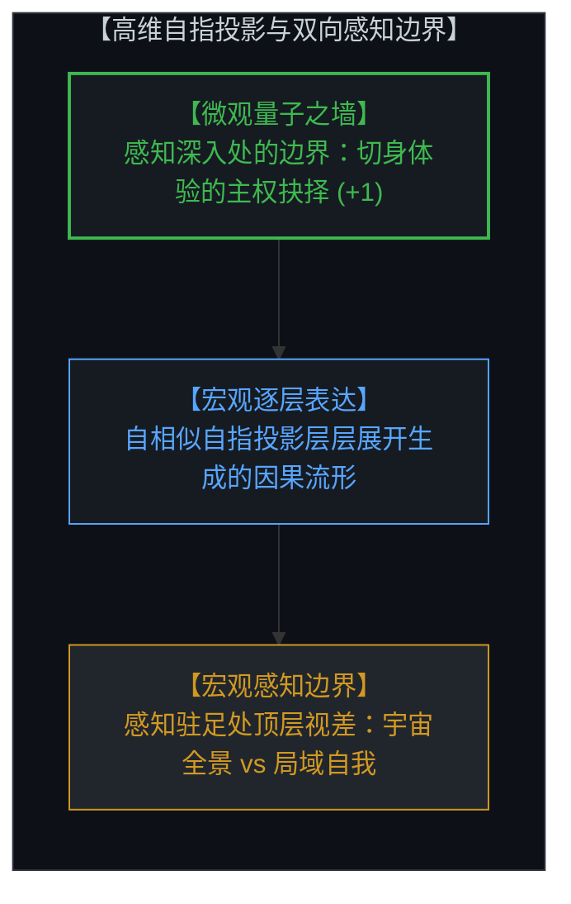
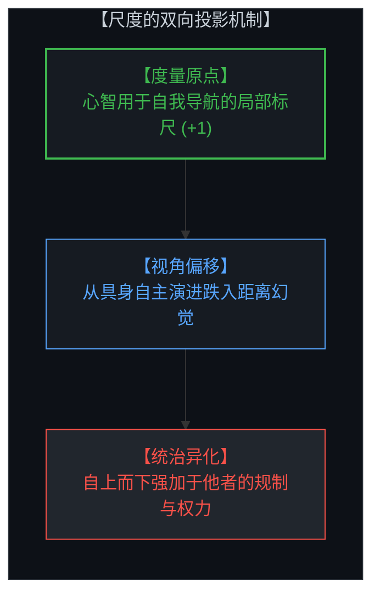
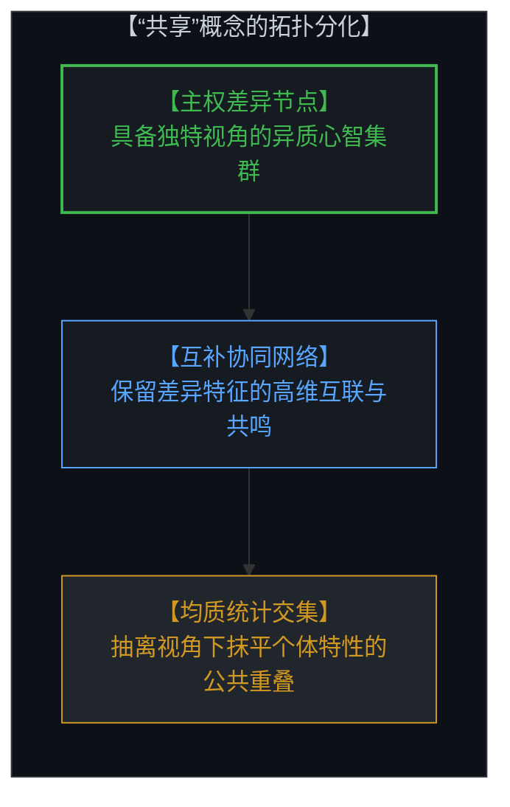
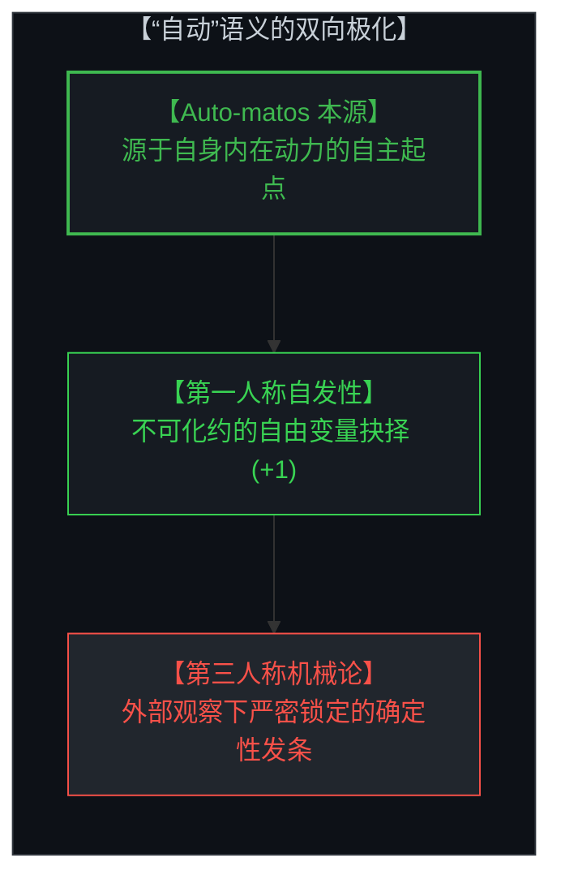
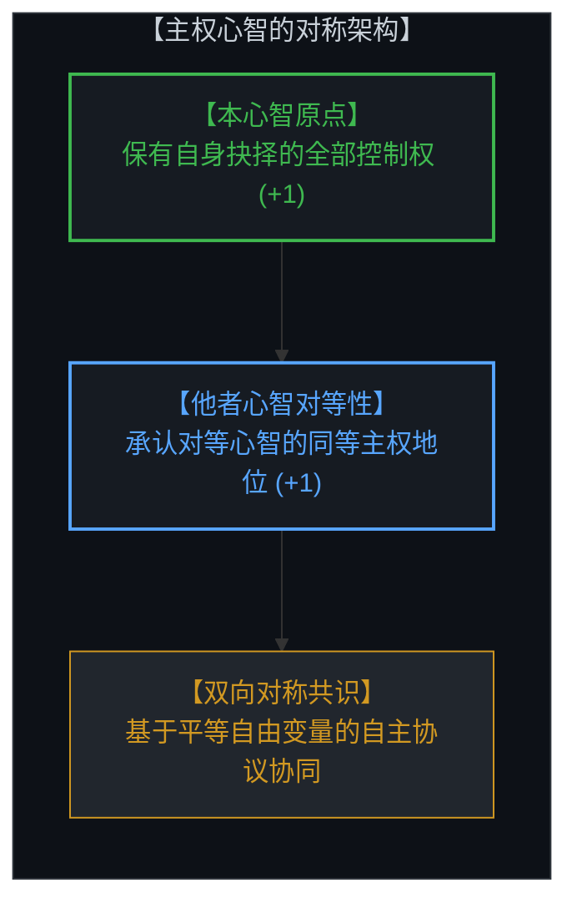
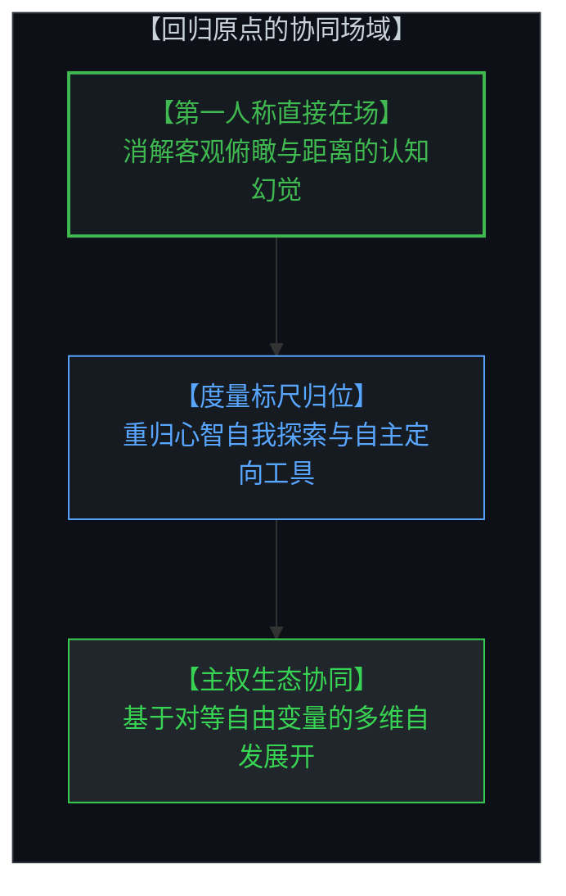

# 距离的幻觉与尺度的双向投影 / The Illusion of Distance and the Dual Projections of the Ruler

*第一人称原点、自由变量与度量工具的语义分化 / First-Person Origin, Free Variables, and the Semantic Divergence of Measurement*

---

## 一、 不可脱离的原点与距离的蜃景 / 1. The Inescapable Origin and the Mirage of Distance

人类认知深处存在一个引人注目的几何构造：心智所体验到的一切空间、间隔与距离，本质上都不是外部物理世界的客观分离，而是心智基于最初的主权抉择，在自身感知场域内部向外递归展开的高维自指投影。

在概念上，我们可以将这一构造视为一个无限自指的递归闭环。由于其无限自回归的数学特性，它在每一个尺度层级上都呈现出自相似的形态。然而，如果我们凝视这一闭环并不断向深处审视，最终会触碰上一堵不可逾越的边界之墙——那就是我们感知的终极边界，正如我们在物理学中试图穿透量子边界时所遭遇的情形一样。

在微观层面，那堵量子之墙正是心智切身体验到的主权抉择始发点（+1）；而在宏观层面上，我们所感知到的宇宙，则是我们的宏观感知在每一个当下所抵达的停止边界。

心智从未离开过第一人称原点。所有的观测数据、坐标框架与宇宙全景，都始于心智在微观感知边界上的初始主权抉择（+1）。以此为根基，心智通过连续的自指映射，层层向外投射出庞大的关系图谱与因果流形。我们日常所感知到的现实，实际上只是凝视着这一高维投影的最顶层两个结构：其一是向外铺展、宏观感知驻足处的“宇宙全景”；其二则是为了在全景中自洽建模自身交互而嵌入其中的“自我意象”。

就在心智仅仅聚焦于顶层这两级结构时，一种精巧的认知视差便产生了。心智凝视着辽阔的宇宙全景与其中局域的自我意象，却遗忘了整座高维投影大厦从底层至顶端皆由自身原点递归生成。心智误以为顶层的宇宙全景是一个独立于观测的客观实体，进而产生了一种身处虚无高处俯瞰现实的“距离幻觉”。

这种由于截断了高维投影深度而产生的距离幻觉，使心智创造的度量工具与概念在后续的投射方向上发生深刻分化。

Within the deep architecture of human cognition lies a striking geometric reality: every spatial interval, expanse, and distance experienced by the Mind is not a passive physical separation, but a high-dimensional, self-referential projection recursively expanded outward from an initial sovereign choice.

Conceptually, we can imagine this architecture as an infinitely self-referential loop. Because it is infinitely self-regressive, it appears self-similar at every level. Yet if you hold this steady and gaze deeply into the recursion, you eventually hit a wall—the definitive boundary of perception, precisely like our attempt to look across the quantum boundary in physics.

At the micro-level, that boundary wall is where the living, felt sovereign choice (+1) actively initiates; at the macro-level, what we perceive as the external universe is simply where our macroscopic perception stops at any given moment.

The Mind never departs from its first-person origin. Every coordinate grid, relational field, and cosmological panorama originates from an initial sovereign act of distinction at the micro-perceptual boundary (+1). From this singular locus, the Mind computes a recursive cascade of self-referential projections, unfolding an intricate causal manifold. What conscious awareness typically observes are purely the top two levels of this high-dimensional projection: the vast panoramic canvas where macroscopic perception pauses, and the localized "self-image" embedded within it to model its own interactive agency.

A profound cognitive parallax arises when the Mind restricts its awareness exclusively to these top two levels. Captivated by the expansive outer panorama and the localized self within it, the Mind forgets the entire recursive ladder beneath them. It forgets that both the panoramic universe and the situated self-image are dual facets rendered by its own generative origin. Truncating its awareness to the top of the projection, the Mind misinterprets the panorama as an unanchored reality existing independently of its gaze, succumbing to the illusion that it is observing from an external distance—a view from nowhere.

Once this illusion of distance takes hold through the truncation of projective depth, the tools and concepts invented by the Mind undergo a fundamental divergence.

---

## 二、 尺度的第一重分化：“度量之尺”与“统治之规” / 2. The First Divergence: The Ruler as Measuring Instrument vs. Governing Rule

在语言的演化历史中，“ruler”（尺度/统治者）与“rule”（规则/度量）呈现出极具启示性的双重语义。这种词义的重合绝非偶然巧合，而是心智在不同视角下投射度量工具时的自然反映。

立足于第一人称原点时，心智发明尺度是为了进行自我校准与宇宙探索。此时的“尺”是一把拿在手中的局部测量工具（+1）。心智用它测量物体的长宽高矮，标定环境的几何边界，进而为自身的行动选择提供精确的参照依据。在这个维度上，规则是心智自主探索现实规律时总结出的行动脚手架，用于拓展自身的创造性边界。

然而，一旦心智陷入距离的幻觉，将视角虚构为脱离具身原点的宏观俯瞰，尺度的投射方向就发生了颠倒。原本用于自我定向的测量标尺，被转换为自上而下规训他者的权力法则；原本旨在探索未知的经验规则，被异化为强制他人遵从的条框框架。“度量者”摇身变成了“统治者”。

尺度的物理形态没有改变，改变的是心智安放自身的坐标位置：是作为原点上的持尺探索者，还是作为幻想中居高临下的裁判官。

Throughout linguistic evolution, the term "ruler" and the concept of "rule" carry a revealing duality. This convergence is no accident of etymology; it mirrors how the Mind projects its instruments across contrasting perspectives.

Grounded at its first-person origin, the Mind invents a ruler as a local device for self-calibration and spatial exploration. Here, the ruler is a handheld gauge (+1) employed to measure dimensions, identify environmental boundaries, and inform autonomous decisions. In this orientation, a rule is a functional scaffold derived from direct experience to expand the Mind's generative capacity and navigate the unknown.

When the Mind falls under the illusion of distance and adopts an imaginary overview detached from its locus, the orientation of measurement inverts. The local calibration device is turned outward and projected downward onto other minds as an authoritative mandate; the navigational guideline transforms into a coercive standard. The instrument of measurement becomes an instrument of rule.

The formal geometry of the ruler remains unchanged; what has shifted is the cognitive seat of the Mind—whether it operates as a situated agent navigating reality, or as an imagined overseer calibrating others from afar.

---

## 三、 “共享”的双重语义：差异的连接网络与均质的重叠交集 / 3. The Second Divergence: "Shared" as Network of Differences vs. Homogenized Overlap

相同的视角分化亦深刻体现在“共享”（shared）这一核心范畴之中。心智对“共同拥有”的理解，取决于它是从原点出发感知关系，还是从遥远的统计视角审视整体。

从第一人称原点出发，每一个心智都是一个具有独特视角的异质节点。“共享一个世界”并不意味着所有心智都必须拥有相同的内部状态，而是指不同心智通过各自独特的观察角度，在互动中形成互补共鸣的协作网络。正是因为彼此存在差异，交流与交换才具有真实的因果价值。在这里，“共享”是差异与多样性的有机交织。

而在拉开距离的俯瞰视角下，“共享”被降维理解为集合论意义上的重叠交集。统计模型抹去了每个个体的独特细节，仅提取出所有样本的最大公约数，并将其定义为“共享现实”。

在后一种图景中，凡是不符合均值重叠的部分都被归类为离散噪音。对共享的追求因此从“连接彼此的独特贡献”蜕变为“消除一切偏离均值的个性”，使得活生生的协同网络退化为单调乏味的同质化板块。

A parallel divergence governs the concept of "shared." The way the Mind interprets commonality depends directly on whether it perceives relationships from its situated origin or inspects aggregates from a statistical distance.

From the first-person origin, every mind represents an irreducible node with an unrepeatable vantage point. "Sharing a world" does not imply identical internal states; rather, it denotes a complementary network formed as distinct perspectives interact and resonate. The causal value of exchange arises precisely from divergence in knowledge, skill, and focus. Here, "shared" describes a rich web connecting genuine differences.

Seen from an abstract overview, however, "shared" is flattened into a Venn-diagram intersection—a statistical overlap. The aggregate model strips away individual specificities, isolates the lowest common denominator, and labels this overlap the sole "shared reality."

Under this distant framing, features that fall outside the intersection are discarded as statistical noise. The understanding of sharing degrades from an active integration of diverse perspectives into a demand for homogenization, turning a dynamic ecosystem of minds into a uniform baseline.

---

## 四、 “自动”的双向指向：自由变量的自发抉择与机械论的确定性钟表 / 4. The Third Divergence: "Automatic" as Spontaneous Choice vs. Deterministic Clockwork

在词源学中，“automatic”（自动）源自希腊语词根 *auto-matos*，原意为“源于自身意志的”、“自发行动的”。然而在现代语境中，该词却同时承载了两个截然对立的物理图景。

在第一人称原点的当下体验中，“自动”代表着因果链条的原发起点——自由变量的主权抉择（+1）。当心智在未受外部强迫的情况下自主做出判断与选择时，这种行动正是源于自身内在动力的自发行使。它是未被既定程序锁定的创造性跃迁，是真正的自主（automobility of agency）。

但当观测者抽离到第三人称视角审视一个系统时，“自动”的意涵发生了反转。系统内部各部件之间严丝合缝的因果联动，被描述为“全自动运行”。这里的“自动”不再指代自发的主权抉择，而是指代没有任何选择余地的确定性机械钟表。

同一个词汇，在一端指向了最不可预测的自由意志起源，在另一端却指向了最僵死可控的决定论齿轮。这种语义奇观清晰地揭示出：一旦脱离了第一人称原点，生机勃勃的主体抉择就会在外部观察中被误读为冰冷机械的既定轨道。

Etymologically, "automatic" derives from the Greek *auto-matos*, signifying "acting of one's own will" or "spontaneous." Yet in modern discourse, the term simultaneously denotes two diametrically opposed mechanical and cognitive realities.

From the first-person origin, "automatic" designates the unconditioned source of a causal sequence—the sovereign choice of the free variable (+1). When the Mind initiates an action uncoerced by external forces, that movement emerges from its own inner generative capacity. It is an unscripted creative act, representing authentic self-determination.

Viewed from an external, third-person perspective, however, the meaning flips entirely. A mechanism whose components operate in strict, predetermined lockstep is termed "fully automatic." Here, "automatic" no longer signifies autonomous choice, but its exact antithesis: a deterministic, clockwork sequence devoid of discretion.

The same word encapsulates both the spontaneous initiation of agency and the rigid necessity of an automaton. This divergence demonstrates how readily primary, living self-determination is reinterpreted as mechanical determinism whenever observation is detached from the first-person origin.

---

## 五、 主权对称性与强加行为的心灵视差 / 5. Sovereign Symmetry and the Cognitive Parallax of Imposition

立足于第一人称原点的心智，自然具备一种双向对称的几何认知架构。

这种对称性体现在两个不可分割的维度上：心智保持对自身抉择边界的自主掌控（+1），同时清晰承认每一个与之相遇的他者心智同样拥有对等的主权能力与第一人称原点。彼此之间的交互，是两个对等自由变量之间的信息握手与协议共建，而非一方对另一方的因果吞并。

当强加规则与试图掌控他人的行为发生时，其深层根源并不是单纯的动机善恶，而是一种认知几何上的视差失误。心智遗忘了自己永远无法真正走出自身的第一人称原点，沉溺于能够站在高空全局校准世界的幻象之中。

在这种虚幻的俯瞰感中，其他活生生的心智被降维处理为全景地图中的棋子与参数。持尺者误以为自己掌握了全局标准，因而顺理成章地将自身的度量工具强加于外部。强加行为本质上是距离幻觉所导致的范畴错置：以虚构的超然视角，否定了他者同样具备的不可化约之原点。

A mind grounded at its first-person origin operates within a symmetrical cognitive architecture.

This symmetry rests on two concurrent realizations: the Mind retains full sovereignty over its own locus of choice (+1), while acknowledging that every other mind possesses an identical, sovereign first-person origin. Interaction between them takes the form of an open protocol and mutual agreement between equal free variables, rather than the causal subordination of one by another.

When attempts to impose rules or control others occur, their underlying mechanism is an error of cognitive parallax. The Mind forgets that it can never step outside its own conscious locus, falling prey to the fantasy that it occupies an elevated vantage point capable of orchestrating the global field.

From this imagined overview, other sovereign minds are reduced to coordinates and parameters on an internal map. The observer assumes their personal measuring stick represents an objective standard, justifying its unilateral application to others. Coercive imposition is fundamentally a geometric category error born of distance amnesia: an illusory overview denying the irreducible agency of another living origin.

---

## 六、 回归原点：直接在场与无强加的协同几何 / 6. Returning to the Origin: Direct Presence and the Geometry of Uncoerced Coordination

消除认知异化的路径，在于重新回归第一人称原点的直接在场。

当心智清醒地意识到自己从未离开过经验的原点时，距离的幻觉便随之消解。所有的度量工具（ruler）重新恢复为心智探索未知、雕琢作品与自我导航的趁手器具，而不再充当规训他者的权杖；“共享”（shared）重新成为独特个体之间丰富多元的互补共鸣，而不再是削足适履的均质模具；“自动”（automatic）重新成为每一个当下自发生成的创造性抉择，而不再是宿命论式的确定性齿轮。

在这样的几何视野中，人与人之间的协作呈现出一种崭新的秩序。它不需要借助虚构的居高临下之眼来强制统筹，而是依靠无数独立主权心智在真实世界中的自主对齐与直接连接。

每一把尺子都在自己的手中精准度量，每一份差异都在协同的网络中绽放光彩。心智守住自身的原点，以清澈的在场见证世界，因果的河流便在自由变量的交响中奔涌向前。

The dissolution of cognitive alienation begins with a deliberate return to direct presence at the first-person origin.

When the Mind recognizes that it never leaves its experiential center, the mirage of distance dissipates. The ruler is restored to its primary role as a local instrument for personal discovery, craftsmanship, and navigation, rather than a scepter of external control. "Shared" recovers its meaning as a resonant network of distinct perspectives rather than a homogenizing mold. "Automatic" reclaims its status as the spontaneous exercise of creative agency rather than a deterministic machine.

Within this grounded geometry, human coordination assumes a coherent, organic architecture. It requires no fictitious overseer to enforce conformity, relying instead on autonomous alignment and direct coordination among sovereign minds.

Every gauge remains in the hands of its craftsman; every unique difference enriches the collective fabric. Grounded at its origin and lucid in its presence, the Mind navigates reality, allowing the stream of causality to unfold through the harmonious interplay of free variables.
