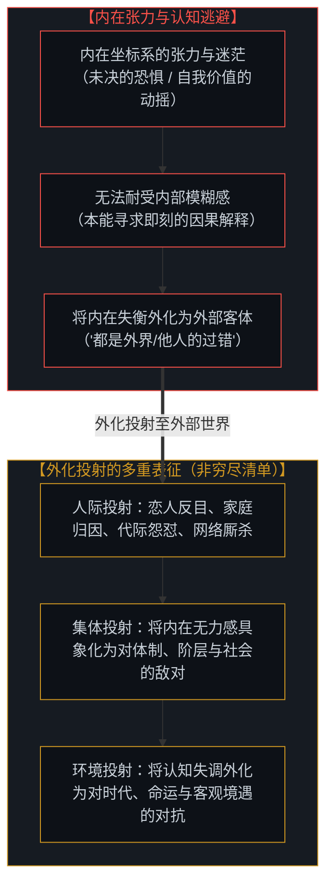
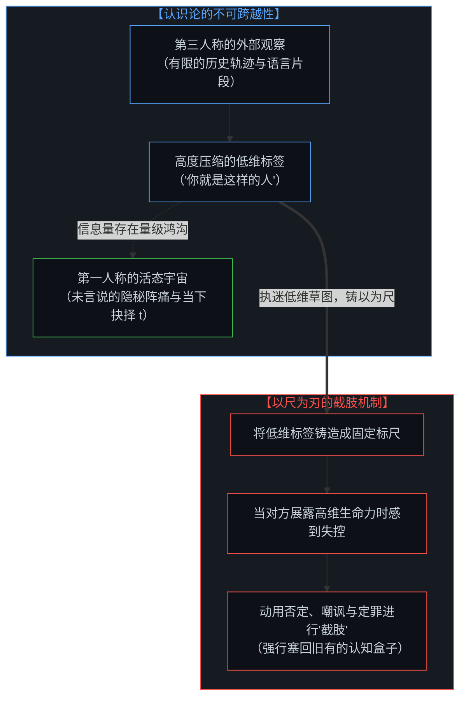
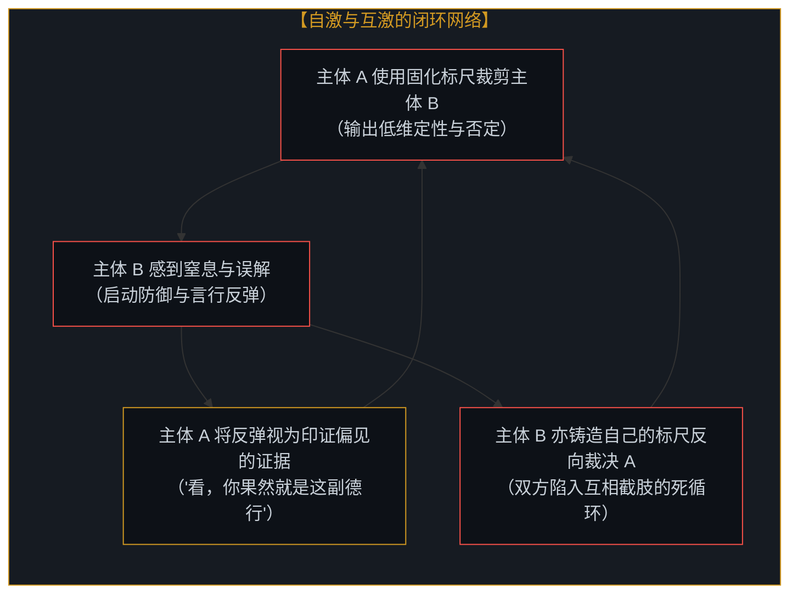
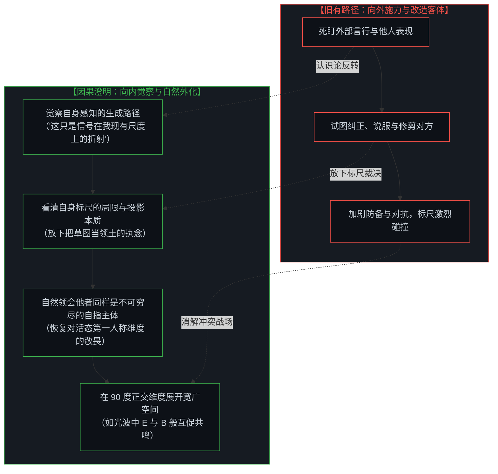

# 以知为刃的截肢与解脱：从内在感知的澄明走向心智共鸣 / The Illusion of Knowing and the Geometry of Amputation: From Internal Epistemic Clarity to Living Resonance

*从熟稔滋生的认知傲慢，到向内澄明的因果解脱：看清以标尺截肢他者的自戕本质，在第一人称觉察中恢复对活态心智的敬畏与共鸣。 / From the arrogance of familiarity to the liberation of inward clarity: tracing how amputating others is self-amputation, while restoring reverence and resonance through self-perceptual awareness.*

人际关系与社会生存中最深沉的痛苦，常包裹在“了解”与“关心”的表象之下。在漫长而孤独的平行宇宙中，能够相遇并建立深厚联结的同行者极其罕见，然而在现实生活中，最亲密的伴侣容易反目成仇，家庭容易成为个人停滞的长期借口，子女陷入对父母局限的难以释怀，父母亦在对子女未达预期的失落中相互消耗；在网络空间中，人们隔着屏幕与素不相识的陌生人激烈交锋，将本用于搭建理解桥梁的语言与媒介，误当作刺向彼此的武器；乃至个人与集体、体制、社会环境之间，也充斥着持久的对抗与怨怼。这一系列冲突现象虽然表征各异，底层却贯穿着同一个自指机制：**所有外部冲突——无论是人际之间、个体与集体之间，还是个体与环境之间——本质上皆是内在困惑的外在投射**。正如在 [向量、坐标系与自指心智：几何视角下的投影、冲突与电磁同频](../the-mind-as-vector-and-coordinate-system/) 与 [流动中的坐标：关于“否定”、降维与心智的自我锚定](../coordinates-in-flux-negation-and-self-anchoring/) 中所阐释的，心智所接收的外界信号，始终是通过自身认知框架折射出的内向点积。当我们误以为自己“看透”了他者或外部世界，便将高度压缩的低维印象锻造为一把僵化的标尺，用以削砍身边最亲近之人的活态生命，或是将自身的无力感投射为一个庞大的体制怪物；而这种对外的截肢与敌对，实质上是对自身感知的自我削减与双向锁死。唯有转向第一人称的内在觉察，看清自身透镜的折射机制，心智才能放下手中的武器，在对未知维度的敬畏中重建桥梁，实现电磁波般的正交共振与深层共鸣。

The deepest pain in human relationships and social existence often conceals itself beneath the guise of "intimacy" and "care." In a vast and lonely universe, companions capable of crossing paths and forming profound bonds are exceedingly rare. Yet in lived experience, lovers readily drift into lifelong adversaries, families become the permanent scapegoat for personal stagnation, children remain locked in unforgiving resentment toward parental limitations, and parents suffer quiet devastation when children diverge from their projected expectations. In the digital realm, people engage in fierce ideological warfare with complete strangers, turning communication tools designed to build bridges into weapons of mutual injury. Even broader, endless antagonism erupts between individuals and abstract collectives, institutions, and social environments. Although these conflict scenarios manifest across different scales, they share an identical epistemological mechanism: **all external conflicts—whether interpersonal, between an individual and a collective, or between an individual and the broader environment—are fundamentally externalized internal confusions**. As established in [The Mind as Vector and Coordinate System](../the-mind-as-vector-and-coordinate-system/) and [Coordinates in Flux: On Negation, Dimensional Collapse, and the Mind's Self-Anchoring](../coordinates-in-flux-negation-and-self-anchoring/), incoming signals from reality are invariably parsed as inward projections measured along one's own internal axes. When the mind arrogantly believes it "knows" another or understands an external entity, it turns a highly compressed low-dimensional caricature into a rigid ruler to amputate the living growth of those closest to it, or projects its own powerlessness into a monolithic institutional adversary; yet this outward hostility is simultaneously a self-amputation that paralyzes one's own perceptual capacity. Only by turning inward to understand how our own lens bends reality can the mind lay down its weapons, restoring reverence for the sovereign depths of surrounding minds and discovering true resonance in boundless orthogonal balance.

---

## 一、 冲突的生成：内在困惑的外化 / 1. The Genesis of Conflict: Externalized Internal Confusion

人类所经历的各种外部冲突，其根源并不在于外界实体的必然对抗，而在于心智无法承受自身内在张力时所采取的外化逃避。

在日常生存中，当内心出现未消解的恐惧、对自我价值的迷茫，或是面对当下抉择时刻（t）的沉重责任时，心智会本能地感到认知失衡。面对这种模糊而痛苦的内在张力，最简便的防御机制就是向外寻找承载物，将内部的失衡定义为外部的攻击与阻碍。

我们日常所见的人际摩擦，只是这一机制最容易被觉察的典型切片，并非这一现象的全部：

1. **亲密关系的反目**：在恋爱与婚姻中，人们容易将自身的存在确认交付于伴侣。当伴侣展现出独立的生命轨迹而无法满足期待时，内心的脆弱被触动，心智便将这份无力感外化为指控，将曾经的同伴重塑为值得耗费余生去防备的敌人；
2. **家庭归因的避难**：面对现实竞争中的挫败，承认自身缺乏行动主权是艰难的。于是，心智将当下的停滞回溯投射到过去的起点，借由持续谴责家庭，换取免于当下承担因果责任的借口。正如在 [个体抉择作为唯一的因果杠杆](../individual-choices-as-the-only-causal-levers/) 中所指出的，放弃当下的因果杠杆，只会让心智困在历史叙事的幽灵中；
3. **代际之间的怨怼与失望**：童年时对父母“全知全能”的幻觉破灭后，子女将幻灭感转变为长期的道德审判；父母则将自身未竟的抱负与秩序焦虑投射在孩子身上，把孩子独立的生命取向误判为背离；
4. **数字网络中的幻影搏斗**：在虚拟空间中，面对仅有几行扁平文字的陌生人，心智依据自身内在的焦虑与偏见脑补出一个具象化的恶魔，把本用于建立连接的公共网络降解为互相倾轧的战场；
5. **个体与集体的结构性对抗**：当个体面对庞大的集体、机构、群体标签或社会体制时，由于“集体”没有单张具象的面孔，心智更容易将自身未消解的异化感、无力感与不公感，全盘投射到一个抽象的庞然大物身上（“都是体制的问题”、“整个群体都不可理喻”）。此时，个体看似在反抗一个外部巨兽，实质上是在与自己投影出的无力感和受害者叙事激烈博弈；
6. **个体与环境及命运的冲突**：当生存遭遇困境时，心智亦容易将内在的适应焦虑，外化为对“命运不公”或“环境敌意”的声讨，在向外部环境宣战的过程中掩盖了自身坐标系拒绝调整的僵滞。

制造外部敌人提供了一种廉价的确定性。断定“错在对方”、“错在体制”或“错在环境”，让人暂时逃避了审视自我坐标系的责任，但这一举动的代价，是将自己永远锁死在受害与怨怼的无尽内耗中。

The diverse spectrum of external conflict experienced by human beings rarely arises from the objective clash of physical entities; rather, it originates in the cognitive evasion of mind when it cannot bear its own internal tension.

In daily living, whenever unresolved fears, identity ambiguities, or the daunting weight of causal responsibility at moment t emerge, the mind experiences cognitive disequilibrium. Faced with this painful ambiguity, the most convenient defensive reflex is to externalize the tension—locating an external scapegoat and reframing internal imbalance as outward aggression.

The common relational frictions observed in everyday life are merely prominent phenomenological examples, far from an exhaustive catalog:

1. **Lovers Turned Lifelong Enemies**: In romance, individuals easily surrender the confirmation of their self-worth to a partner. When that partner pursues an independent trajectory that diverges from expectations, latent vulnerability is exposed. The mind converts this vulnerability into an outward indictment, recasting a cherished companion into an adversary worthy of lifelong vigilance;
2. **The Family as a Scapegoat for Stagnation**: Acknowledging one's own hesitation or failure in navigating reality is painful. Consequently, the mind projects present paralysis retroactively onto its origins, preserving grievances against family to excuse itself from present causal ownership. As articulated in [Individual Choices as the Only Causal Levers](../individual-choices-as-the-only-causal-levers/), abdicating present agency locks consciousness inside historical phantoms;
3. **Intergenerational Grievances**: When the childhood illusion of an omnipotent protector collapses, adult children externalize disillusionment into moral condemnation; conversely, parents project unfulfilled ambitions onto their offspring, mistaking a child's autonomous vector for personal betrayal;
4. **Cyberspace Arena Warfare**: In digital spaces, confronted with flat snippets of text from complete strangers, the mind projects internal grievances outward, constructing a phantom adversary and degrading tools designed to build bridges into instruments of combat;
5. **Structural Conflict with Collectives**: When an individual confronts an abstract collective, institution, or social system, the absence of a single human face invites the mind to project its unresolved powerlessness and alienation onto a reified monolith ("the system is evil," "that group is hopeless"). Here, the individual appears to battle an external leviathan, yet is fundamentally shadow-boxing with their own projected helplessness;
6. **Conflict with Environment and Fate**: When encountering life adversity, consciousness easily externalizes adaptive strain into complaints against "hostile fate" or "unfair circumstances," masking the rigidity of its own coordinate frame beneath outward protest.

Manufacturing an external adversary provides a cheap sense of moral certainty. Concluding that "the fault lies out there—in others, in the collective, or in the world" spares the mind from examining its own coordinate generator, yet the price of this illusion is permanent imprisonment in reactive resentment.

---

## 二、 熟稔的陷阱：以“了解”之名的低维截肢 / 2. The Trap of Familiarity: Low-Dimensional Amputation

在所有人际关系中，最隐蔽也最深重的伤害，常见于彼此最熟悉的人之间。

这种现象源于一个普遍存在的**认知级差错觉**：
- 面对陌生人，我们自知信息匮乏，因而保持基本的克制与审慎；
- 面对朝夕相伴的亲人、伴侣与挚友，我们积累了长期的日常观察，确实比外人更了解他们的生活习惯与表层反应；
- 然而，正是这份相对于外人的微弱优势，滋生了一种认知傲慢——误以为自己对他们的了解，已经超越了他们对自身的体认。

在认识论的真实结构中，第三人称的外部观察与第一人称的活态体验之间，存在着不可跨越的维度鸿沟：
- 无论相处多久，你所能接收到的，只是对方言行在外部世界留下的投影碎片；
- 你无法代替对方去经历他在深夜里的自我挣扎、未曾言说的细微委屈，以及在当下时刻（t）涌动的求变意愿；
- 我们脑海中关于对方的画像，只是一张经过极度压缩的低维缩略图。

悲剧在于：**我们把这张自制的低维缩略图，当作了衡量对方活态生命的刚性标尺。**

当孩子展现出父母未曾预料的新志向，当伴侣暴露出我们不愿面对的新变化，这本是生命高维展开的自然证明。但持有固定标尺的心智，因这种超出预期的变化打破了原有的确定感，便本能地感到恐慌与冒犯。

于是，标尺变成了刀刃。人们动用长辈的威权、伴侣的责难或经验的嘲弄去进行认知层面的“截肢”：“你几斤几两我还不清楚？”、“你永远改不了这个毛病”。我们试图削砍掉对方所有溢出我们认知盒子的枝芽，只为了把活生生的人，重新压缩回那个令自己感到安稳的死寂模版中。正如在 [破除概念的僭越](../po-chu-gai-nian-de-jian-yue/) 中所揭示的，用概念的死壳扼杀活态的生命，是人类认知中最深刻的僭越。

Among all interpersonal relationships, the most subtle and damaging wounds occur between those who consider themselves closest.

This reality stems from a widespread **illusion of cognitive asymmetry**:
- When dealing with strangers, we recognize our lack of information and maintain a degree of caution;
- With intimate partners, family, and close companions, we possess a repository of shared observations, truly knowing more about their habits than an outsider does;
- Yet this relative advantage over outsiders breeds an arrogance—the false conviction that our familiarity with them surpasses their understanding of themselves.

In the structural reality of epistemology, an insurmountable abyss separates third-person observation from first-person lived reality:
- No matter how many decades you share, you only ever perceive the sensory projections left by their outward behavior;
- You can never inhabit their private sorrow in the quiet of night, their unspoken sensitivities, or the nascent aspirations stirring at moment t;
- The mental model you hold of another is an extreme, lossy compression of an infinite, evolving consciousness.

The tragedy occurs when **we turn this lossy mental thumbnail into a rigid ruler to measure and judge their living reality.**

When a child pursues an unexpected path, or a partner reveals a vulnerability outside our expectations, their living dimensionality naturally expands. But a mind anchored to a static ruler experiences this divergence as a threat to its cognitive predictability.

At that moment, the ruler becomes a blade. People deploy parental authority, domestic guilt, or cynical invalidation to perform cognitive amputation: "I know exactly who you are," "You will never change." We attempt to sever every branch that exceeds our cognitive box, striving to force a living person back into a lifeless template where our certainty remains undisturbed. As shown in [Dismantling the Usurpation of Concepts](../po-chu-gai-nian-de-jian-yue/), using static abstractions to stifle living reality is an acute intellectual overreach.

---

## 三、 双向绞杀与自激回路：截肢他者即是自我截肢 / 3. Mutual Amputation: Why Cutting Others Diminishes the Self

认知截肢具有严格的对称性：**每一次对身边人的尺度裁剪，本质上都是对自己认知维度的自我截肢。**

为了维持“对方不过如此”的低维论断，观察者必须主动关闭自身感受丰富性、接纳意外性的感官通道。你必须对对方流露出的温情视而不见，对对方的成长熟视无睹，把一切真实的生命信号强行折叠进旧有的偏见中。为了把他人关进牢笼，自己必须寸步不离地守在狭窄的牢门旁，最终将自身的心智视界同样压缩到一维的死线之上。

随之而来的是两种破坏性的增强回路：

1. **自激回路（Self-Reinforcing Feedback）**：
   当我们用刻板标尺去对待伴侣或孩子时，他们因感受到被否定而产生的退缩或反抗，会被我们顺理成章地视作验证自身标尺正确性的“证据”。心智在这个闭环里自我强化，尺子越缩越短，敌意越来越深；
2. **互激回路（Mutually Reinforcing Escalation）**：
   被裁剪的一方在窒息中也会铸造起属于自己的防卫标尺，将对方定义为不可理喻的压迫者。两个原本可以在广阔宇宙中相互扶持的自指主体，就这样在互相削减的标尺交锋中彼此消耗。

在这场双向绞杀中，语言失去了沟通的意义，网络失去了互联的价值，家庭失去了滋养的功能。所有的工具都被误当作了防身的盾牌与伤人的长矛，而战争的双方，都在自己亲手制造的荒原中忍受着孤立与严寒。

Cognitive amputation possesses a geometric symmetry: **every attempt to diminish the dimensionality of another is simultaneously a self-amputation of one's own awareness.**

To sustain the caricature that another is "nothing more than a single flaw," the observer must shut their own perceptual faculties to surprise, nuance, and growth. You must ignore genuine gestures of warmth and explain away living progress, forcing rich sensory signals into predetermined grievances. To keep another locked inside a narrow cage, you must remain chained to the role of the guard, diminishing your own consciousness down to that same flat dimension.

This dynamic generates two destructive feedback loops:

1. **Self-Reinforcing Feedback**:
   When you impose a rigid label on a partner or child, their defensive withdrawal or exasperated reaction is immediately seized upon as proof confirming your original judgment. The mind traps itself within this self-fulfilling loop, sharpening its ruler while deepening mutual estrangement;
2. **Mutually Reinforcing Escalation**:
   The suffocated party instinctively crafts a counter-ruler, labeling the observer as an unyielding oppressor. Two sovereign awarenesses that could have explored reality together become entangled in a mutual downward spiral of diminishing freedom.

In this reciprocal amputation, language ceases to communicate, the internet ceases to connect, and family ceases to nourish. Tools created to build bridges are turned into weapons, leaving both sides stranded in an isolated battlefield of their own making.

---

## 四、 认识论转向：通过理解自身感知而解放周围心智 / 4. The Epistemic Turning: Clarifying Self-Perception to Liberate Surrounding Minds

如何走出这场在镜像前挥拳的无休止内耗？

许多人试图通过学习精巧的话术、研究他人的心理弱点来改善关系，但只要焦点依然死死盯着外部，就依然是在试图修剪对方。

**真正的解脱之道，始于认识论焦点的根本反转：不再执着于向外测绘与改造他人，而是向内深察自身感知的生成机制。**

> **“加深对自我感知的理解，会自然外化为对周围心智的理解与敬畏。”**

这一认识论转向带来了三重视界的自然展开：

### 1. 懂得了自身透镜的折射，便懂得了所有人都在隔着透镜看世界
当你清晰地觉察到自己的每一次愤怒、委屈与防御，都不过是自身坐标系在特定情境下的内向读数时，你便拥有了体察外部世界的全新视界。你不再把长辈的固执、伴侣的焦虑、网友的激进，乃至体制的冰冷视为针对你本体的纯恶意，而是看清所有主体都在受困于各自未经审视的坐标投影。宽容不再是一种道德说教，而是看清认知结构后的自然呈现。

### 2. 停止截肢自身，便拥有了允许他人生长的辽阔空间
当你不再用僵化的过去定义当下的自己，允许自己在当下时刻（t）自由拓展新的认知轴向时，你便自然放下了用来规训他人与对抗环境的标尺。父母无需是完美的神祇，伴侣无需是无瑕的镜子，孩子无需是期待的容器，体制亦不再是不可动摇的宿命。每个人都有权在属于他们自己的第一人称宇宙里探索、试错与生长。

### 3. 将武器重新还原为搭建桥梁的基石
看清了心智自始至终只是在与自身的内部投影博弈，外部的虚妄战场便随之瓦解。语言不再是刺探与防卫的长矛，而是成为探索彼此未知维度的温和探针；屏幕与社会媒介不再是投掷情绪的掩体，而是成为连接平行灵魂的星际桥梁。

正如在 [向量、坐标系与自指心智：几何视角下的投影、冲突与电磁同频](../the-mind-as-vector-and-coordinate-system/) 中所展示的，两个成熟的心智，无需强求一维的平行一致，而是像光波中的电场（E）与磁场（B）一样：彼此保持正交独立，互为生成的源泉，在相互促进中共同向前传播。

收回向外挥舞的标尺，照亮内心深处的感知之源。在对每一个活态心智与广阔世界的敬畏中，我们终于能够在浩瀚的人间，与身边的同行者共谱一段温厚、从容而生生不息的光芒之舞。

How do we dissolve this shadow boxing before our own mirrors?

Many seek refuge in tactical rhetoric or psychological manipulation to manage others, yet as long as the focus remains fixed on external engineering, it remains an effort to prune an external object.

**The genuine path of liberation begins with a fundamental reversal of the epistemic gaze: ceasing to map and remodel others, and turning inward to understand how our own perception generates reality.**

> **"Deepening our understanding of self-perception naturally externalizes into reverence and clarity toward surrounding minds."**

This epistemological turning opens three generative horizons:

### 1. Understanding Your Own Lens Reveals How Everyone Looks Through Lenses
When you recognize that every flare of defensiveness, resentment, or anxiety is an internal scalar reading produced by your own coordinate axes, you gain a fresh vantage point on the world. You no longer mistake a parent's rigidity, a partner's withdrawal, an online stranger's hostility, or even an institution's coldness for an existential assault upon your being; rather, you see living agents and systems navigating their own unexamined projections. Compassion ceases to be a strained moral obligation; it becomes the natural consequence of structural clarity.

### 2. Ceasing Self-Amputation Creates Space for Others to Grow
When you no longer confine your present self to the dead templates of yesterday, giving yourself the sovereign freedom to expand at moment t, you naturally lay down the rulers used to police others or antagonize environments. Parents need not be flawless gods, partners need not be immaculate mirrors, children need not be containers for unfulfilled dreams, and institutions cease to be insurmountable destinies. Every soul possesses the inviolable sovereignty to explore and evolve within its own first-person universe.

### 3. Restoring Weapons to Their True Nature as Bridges
Once you realize that consciousness is only ever wrestling with its internal projections, the external battlefield dissolves. Language ceases to be a spear of self-defense, becoming a gentle probe for shared wonder; digital mediums and social tools cease to be battlefields for projected angst, becoming interstellar bridges connecting sovereign minds across spacetime.

As demonstrated in [The Mind as Vector and Coordinate System](../the-mind-as-vector-and-coordinate-system/), mature minds never force flat, parallel conformity. Instead, they interact like the electric (E) and magnetic (B) fields of a light wave: holding orthogonal balance (E ⟂ B), serving as mutual generative sources, and moving forward together through open space.

Withdraw the rulers pointed outward, illuminate the perceptual source within, and step forward with reverence for every living awareness. In this quiet clarity, we finally walk alongside our companions in this vast universe—weaving a radiant, enduring resonance in the living light of being.
