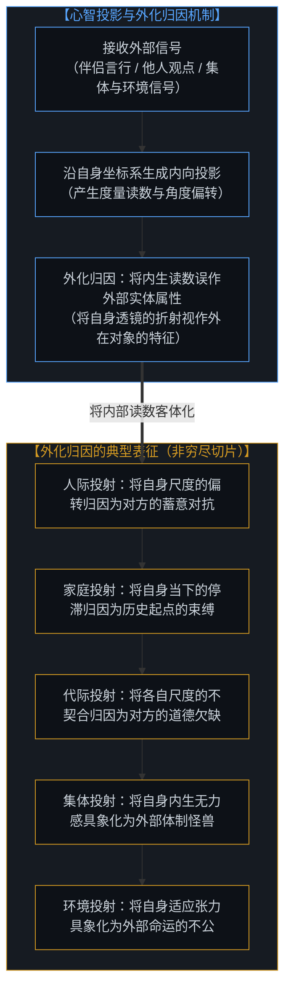
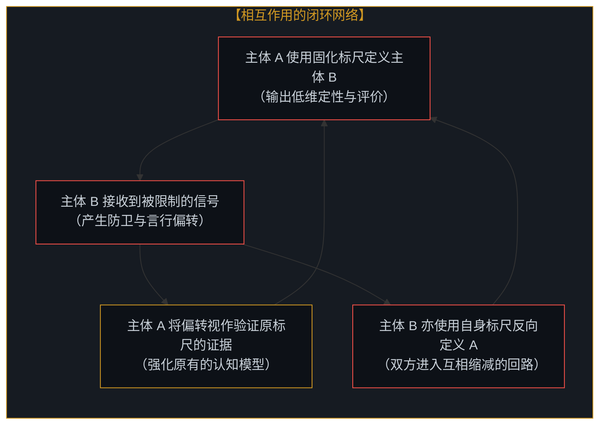
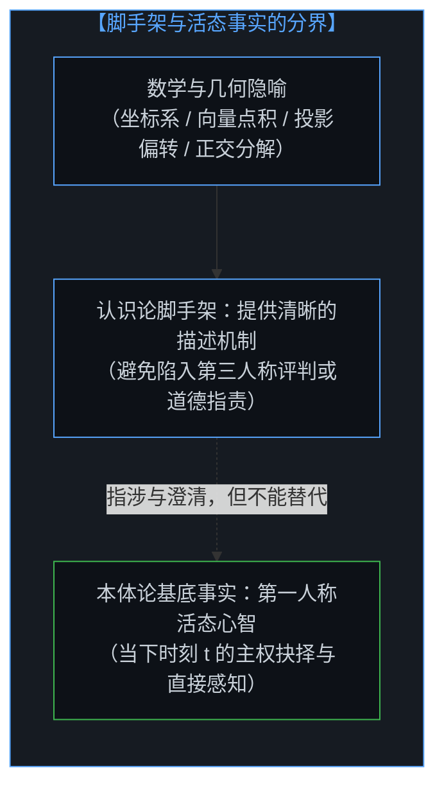
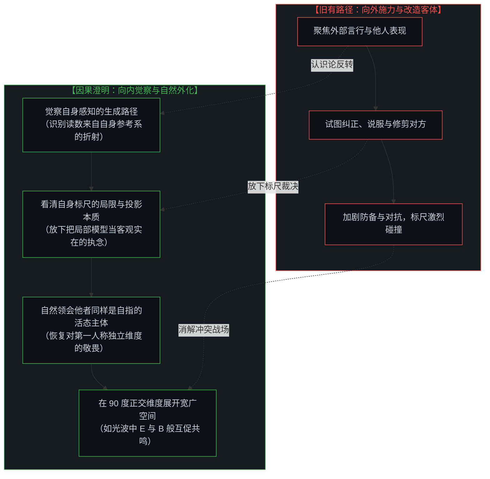

# 以知为刃的截肢与解脱：从内在感知的澄明走向心智共鸣 / The Illusion of Knowing and the Geometry of Amputation: From Internal Epistemic Clarity to Living Resonance

*从熟稔滋生的认知傲慢，到向内澄明的因果解脱：看清以标尺截肢他者的自戕本质，在第一人称觉察中恢复对活态心智的敬畏与共鸣。 / From the arrogance of familiarity to the liberation of inward clarity: tracing how amputating others is self-amputation, while restoring reverence and resonance through self-perceptual awareness.*

人际关系与社会生存中的摩擦与张力，常包裹在“了解”与“关心”的表象之下。在漫长而孤独的平行宇宙中，能够相遇并建立深厚联结的同行者极其罕见，然而在经验世界中，最亲密的伴侣容易演变为不相往来的对手，家庭容易被视作个人停滞的原因，子女与父母容易陷入难以释怀的相互要求，在网络空间中人们隔着屏幕与陌生人激烈交锋，乃至个人在面对集体、体制与生存环境时，也常陷入持久的对抗。这一系列冲突现象表征各异，其底层机制却高度一致：**所有外部冲突——无论是人际之间、个体与集体之间，还是个体与环境之间——皆是心智将自身生成的内向投影，误认作外部世界独立实体的结果**。正如在 [向量、坐标系与自指心智：几何视角下的投影、冲突与电磁同频](../the-mind-as-vector-and-coordinate-system/) 与 [流动中的坐标：关于“否定”、降维与心智的自我锚定](../coordinates-in-flux-negation-and-self-anchoring/) 中所阐释的，心智所接收的外界信号，始终是通过自身认知框架折射出的内向读数。当我们以为自己“看透”了他者或外部环境时，便将高度压缩的低维印象当作了客观实在，甚至铸成一把刚性的标尺去裁量身边最亲近之人，或将内生读数具象化为一个外部庞然大物。这种外化归因在日常经验中极难避免，然而正是这种将内部投影客体化的混淆，构成了人际与社会摩擦的根源。唯有转向第一人称的内在觉察，看清自身透镜的折射机制，心智才能放下向外挥舞的标尺，在对未知维度的敬畏中重建桥梁，实现电磁波般的正交共振与深层共鸣。

Friction and tension in human relationships and social existence often conceal themselves beneath the guise of "intimacy" and "care." In a vast and lonely universe, companions capable of crossing paths and forming profound bonds are exceedingly rare. Yet in lived experience, lovers readily drift into lifelong adversaries, families are framed as the cause of personal stagnation, children and parents become locked in unforgiving mutual demands, digital strangers clash fiercely across screens, and individuals find themselves in enduring antagonism against collectives, institutions, and environments. Although these conflict scenarios manifest across different scales, their underlying mechanics are identical: **all external conflicts—whether interpersonal, between an individual and a collective, or between an individual and the broader environment—arise when the mind mistakes its own internally generated projection for an independent entity in the external world**. As established in [The Mind as Vector and Coordinate System](../the-mind-as-vector-and-coordinate-system/) and [Coordinates in Flux: On Negation, Dimensional Collapse, and the Mind's Self-Anchoring](../coordinates-in-flux-negation-and-self-anchoring/), incoming signals from reality are invariably parsed as inward projections measured along one's own internal axes. When the mind believes it "knows" another or fully comprehends an external environment, it treats a highly compressed low-dimensional thumbnail as objective reality—turning it into a rigid ruler to judge those closest to it, or reifying an internal reading into an external leviathan. While externalized attribution is difficult to avoid in everyday life, this conflation of internal projections with external objects forms the root of conflict. Only by turning inward to perceive how our own lens generates perception can the mind lay down its measuring rulers, restoring reverence for the sovereign depths of surrounding minds and discovering true resonance in boundless orthogonal balance.

---

## 一、 冲突的生成：心智投影的外化归因 / 1. The Genesis of Conflict: Externalized Attribution of Mind's Projection

外部冲突的生成，源于心智在处理感知信号时的**外化归因**。

当外部信号进入心智的视界时，它并不是作为一个未经度量的裸实体存在，而是即刻被心智自身的意图坐标系所解析，呈现为沿自身轴向的测量读数。当这一读数出现偏转或负向分量时，系统内部便产生了感知上的张力。

在日常经验中，人们习惯于在个人主权抉择之外，寻找某种确凿的、决定论式的外部实体作为归因的锚点（性格、家庭、体制、环境、历史规律等）。面对内部生成的读数偏转，心智的即时反应是将原因直接安放在外部对象上：

1. **亲密关系中的对立**：当伴侣表现出独立的取向时，该信号在自身轴向上产生了偏转读数，心智容易将这一几何差异直接定义为对方的敌意；
2. **家庭归因中的停滞**：心智将自身在当下（t）面临的抉择张力，回溯投射到过去的起点，将家庭历史当作造成当前状态的外部实体原因；
3. **代际之间的相互要求**：子女将自身对理想坐标的期待落空归因为父母的过错，父母亦将自身尺度未被满足归因为子女的偏离；
4. **数字网络中的符号交锋**：面对屏幕上高度简化的文本碎片，心智用自身内部的参考框架迅速补全出一个恶性形象，并在与其博弈中耗费精力；
5. **个体与集体的对抗**：面对抽象的集体、体制或群体标签，心智将自身的失落与张力投射为一个庞大的客体怪物，并误以为自己在反抗一个具象的实体；
6. **个体与环境及命运的摩擦**：当情境超出预期时，心智将自身的适应摩擦直接归因为外部环境或命运的敌对。

然而在实在的因果结构中：**除了每个独立心智在当下（t）的主权抉择之外，系统中不存在任何其他能够注入自由变量的源泉**。我们在宏观世界中所观察到的所谓“确定性”或“决定论规律”，实质上都是微观层面上非确定性与活态抉择的**统计学表征**。正如在 [自由变量的同构与先验主权](../zi-you-bian-liang-de-tong-gou-yu-xian-yan-zhu-quan/)、[个体抉择作为唯一的因果杠杆](../individual-choices-as-the-only-causal-levers/) 与 [涌现的伪因果与集体归因倒错](../yong-xian-de-wei-yin-guo-yu-ji-ti-gui-yin-dao-cuo/) 中所指明的，当问题落脚到个体身上时，唯一的因果发生器始终是每一个心智在当下的主权抉择。将因果归咎于外部的确定性客体，不过是用统计学的宏观副产物掩盖了真正的主权现实。

The genesis of external conflict stems from the mind's **externalized attribution** when processing perceptual signals.

When an external signal enters awareness, it does not exist as an unmeasured, naked object; rather, it is immediately parsed by the mind's own intentional coordinate frame, registering as a measurement readout along its internal axes. When this readout exhibits angular divergence or a negative projection, tension arises within the perceptual system.

In daily living, the natural cognitive instinct is to anchor causality to something definitive and deterministic other than personal sovereign choice—such as personality, family, institutions, culture, or historical laws. Confronted with a divergent internal readout, the mind instinctively assigns the cause directly to an external object:

1. **Opposition in Romance**: When a partner displays an independent orientation, the signal produces an angular deviation on one's intentional axis, which the mind readily reifies as deliberate hostility;
2. **Stagnation in Family Grievance**: Consciousness projects its present causal tension at moment t retroactively onto historical origins, framing family background as an external deterministic cause;
3. **Intergenerational Demands**: Adult children attribute the disillusionment of childhood ideals to parental fault, while parents attribute unmet expectations to a child's divergence;
4. **Cyberspace Symbolic Warfare**: Confronted with flat textual fragments, the mind uses its own internal frame to construct an antagonistic caricature, expending energy in fighting a phantom;
5. **Conflict with Collectives**: When facing abstract institutions, systems, or group labels, the mind projects its internal tension onto a reified monolith, believing it is battling an external giant;
6. **Friction with Environment and Fate**: When situations diverge from expectations, consciousness attributes adaptive friction directly to a hostile environment or cruel fate.

Yet in the fundamental causal structure of reality: **beyond each individual mind's sovereign choice at moment t, there exists no other source capable of injecting a free variable into the system**. Whatever we perceive as definitive or deterministic in the macrocosm is merely the statistical symptom of microscopic indeterminism and sovereign choices. As articulated in [Isomorphism of Free Variables and A Priori Sovereignty](../zi-you-bian-liang-de-tong-gou-yu-xian-yan-zhu-quan/), [Individual Choices as the Only Causal Levers](../individual-choices-as-the-only-causal-levers/), and [The Pseudo-Causality of Emergence and the Fallacy of Collective Attribution](../yong-xian-de-wei-yin-guo-yu-ji-ti-gui-yin-dao-cuo/), when it comes to individuals, the irreducible causal engine is each and every mind's sovereign choice. Attributing conflict to external deterministic structures merely substitutes statistical shadows for living causal reality.

---

## 二、 熟稔的陷阱：以“了解”之名的低维截肢 / 2. The Trap of Familiarity: Low-Dimensional Amputation

在所有人际关系中，最隐蔽的摩擦常见于彼此最熟悉的人之间。

这种现象源于一个普遍存在的**认知级差错觉**：
- 面对陌生人，我们自知信息匮乏，因而保持基本的审慎；
- 面对朝夕相伴的亲人、伴侣与挚友，我们积累了长期的日常观察，确实比外人更了解他们的生活习惯与表层反应；
- 然而，正是这份相对于外人的微弱优势，让心智误以为自己对他们的了解，已经超越了他们对自身的第一人称体认。

在认识论结构中，第三人称的外部观察与第一人称的活态体验之间，存在着不可跨越的维度鸿沟：
- 无论相处多久，外部观察所能接收到的，始终只是对方言行在感官界面上留下的投影碎片；
- 外部视角无法替代当事人去经历他在内在深处的感知流变、未曾言说的细微体验，以及在当下时刻（t）的求变意愿；
- 心智中所存留的关于他人的模型，只是一张经过极度压缩的低维缩略图。

当心智把这张自制的低维缩略图当作衡量对方活态生命的刚性标尺时，裁剪便发生了。

当伴侣或子女展现出超出既有模型的变化时，这本是生命维度自然展开的表现；然而在持有固定标尺的心智看来，这一偏转打破了原有的测量预期。为了维持认知模型的确定性，心智便动用语言定性去进行认知层面的裁剪：“你就是这样的人”、“你改不了的”。这种做法试图削去对方所有溢出认知边界的维度，把活态的主体强行塞回固定的模版中。正如在 [破除概念的僭越](../po-chu-gai-nian-de-jian-yue/) 中所阐明的，用静态概念去限定活态现实，是认知中常见的僭越。

Among all interpersonal relationships, the most subtle friction occurs between those who consider themselves closest.

This stems from an **illusion of cognitive asymmetry**:
- With strangers, we recognize our lack of information and maintain caution;
- With intimate partners, family, and close companions, long-term observation allows us to know more about their habits than an outsider does;
- Yet this relative advantage over outsiders leads the mind to believe that its understanding of them surpasses their own first-person experience.

In epistemological structure, an insurmountable dimensional divide separates third-person observation from first-person lived reality:
- No matter how long a relationship lasts, third-person observation only captures sensory projections left by outward behavior;
- External observation can never experience the inner perceptual flow, unspoken sensitivities, or the emergent agency stirring at moment t;
- The mental model one holds of another is merely an extreme, lossy compression.

When the mind treats this compressed thumbnail as a rigid ruler to measure a living consciousness, amputation occurs.

When a partner or child reveals dimensions beyond the existing model, their dimensionality naturally expands; yet to a mind holding a static ruler, this divergence violates expected measurements. To maintain model certainty, the mind deploys labels to prune their expression: "You are always like this," "You will never change." This attempts to shear away any dimension exceeding the cognitive box, forcing a living agent back into a fixed template. As articulated in [Dismantling the Usurpation of Concepts](../po-chu-gai-nian-de-jian-yue/), using static concepts to confine living reality is a recurrent epistemic overreach.

---

## 三、 双向收缩与反馈回路：裁剪他者即是自我限制 / 3. Mutual Amputation: Why Cutting Others Restricts the Self

对他人维度的裁剪具有几何上的对称性：**每一次用固化标尺去定义他人，实质上都在同步收缩自身的认知视界。**

为了维持对他人“仅此而已”的低维定论，观察者必须忽略对方展现出的新特征与复杂性，将丰富的输入信号过滤为符合预设偏见的单一读数。为了将他人固定在既有的框架中，自身的心智也必须守在这一狭窄的尺度上，失去了在更多维度上与现实互动的自由。

这一过程会形成两种自强化的回路：

1. **自强化回路（Self-Reinforcing Feedback）**：
   当我们用刻板标尺对待他人时，对方因感到被限制而产生的防御性反应，常被我们顺理成章地当作验证原标尺准确性的“证据”。认知系统在此闭环中自我确认，对外部复杂性的感知逐步萎缩；
2. **相互强化回路（Mutually Reinforcing Escalation）**：
   被定义的一方也会建立起反向的度量标尺，将对方归纳为一个固定的阻碍者。两个本可在广阔空间中相互促进的自指主体，在互相限制的标尺互动中彼此消耗。

在这类回路中，语言和沟通工具被误用作维持认知固化的盾牌，使互动双方停滞在各自构造的低维镜像中。

Pruning the dimensionality of another possesses geometric symmetry: **every attempt to define another with a rigid ruler simultaneously constrains one's own perceptual horizon.**

To maintain the conclusion that another is "nothing more than a single trait," the observer must overlook new signals, filtering rich inputs into a single preset readout. To keep another confined within an established box, consciousness must remain anchored to that exact scale, surrendering its own freedom to engage reality across richer dimensions.

This generates two self-reinforcing loops:

1. **Self-Reinforcing Feedback**:
   When we treat another through a rigid ruler, their defensive reaction is readily seized upon as "evidence" confirming the initial judgment. The cognitive system confirms itself within this loop, progressively narrowing its awareness;
2. **Mutually Reinforcing Escalation**:
   The labeled party constructs a counter-ruler, categorizing the observer as a fixed obstacle. Two sovereign minds that could have enriched each other become caught in mutually constraining evaluations.

Within these loops, communication tools are misused to preserve rigid models, stranding participants within their own low-dimensional reflections.

---

## 四、 认识论脚手架：数学与几何仅是描述工具而非本体基底 / 4. Epistemological Scaffolding: Mathematics and Geometry as Descriptive Instruments, Not Ontological Facts

在剖析心智运作与感知投影时，我们引入了坐标系、向量点积、投影偏转与正交空间等几何框架。

**需要明确界定的是：所有这些数学与几何模型，仅仅是帮助我们描述心智运作机制的认识论脚手架与语言工具，绝非本体论意义上的终极基底事实。**

如果在破除了对外部客体的固执之后，又将数学结构或几何图景实体化为某种超越于主体之上的“客观真理”或新的“无处之境”（a view from nowhere），便不过是重复了概念僭越的老路。几何模型之所以有用，是因为它能够以非道德化、结构化的方式，呈现感知投影与视角差异的生成过程；但它本身并不是实在的因果实体。

在实在的因果链条中，唯一的终极基底始终是**每个活态心智在第一人称当下（t）的直接体认与主权抉择**。数学提供了描述机制的透镜，而活态心智才是握持透镜与作出抉择的主体。

When analyzing cognitive operations and perceptual projections, we deploy geometric frameworks such as coordinate systems, dot products, angular deflections, and orthogonal spaces.

**It is essential to clarify: all such mathematical and geometric formalisms are merely epistemological scaffolding and linguistic tools used to describe how perception operates—they are not foundational ontological facts or metaphysical primitives.**

If, after dissolving our fixations on external objects, we were to reify mathematical structures or geometric depictions into an external "objective truth" or a new "view from nowhere," we would simply repeat the error of conceptual usurpation. Geometric modeling is valuable because it articulates the generation of perceptual projections and perspectival divergence in a non-moralizing, structural manner; yet it is not itself a living causal entity.

Within the fundamental causal structure, the sole foundational reality remains **the first-person lived awareness and sovereign choice of each living mind at moment t**. Mathematics provides a lens to describe the mechanics, while the living mind remains the sovereign agent holding the lens and enacting the choice.

---

## 五、 认识论转向：通过理解自身感知而解放周围心智 / 5. The Epistemic Turning: Clarifying Self-Perception to Liberate Surrounding Minds

走出与自身投影博弈的循环，并不依赖于向外研究或重构他人的行为模式。

**解脱的路径在于认识论视角的转向：不再将注意力集中于修剪外部对象，而是向内觉察自身感知与度量系统的生成机制。**

> **“对自我感知机制的理解，会自然外化为对周围心智的理解与敬畏。”**

这一转向带来了视界的自然展开：

### 1. 识别透镜的存在，便能理解所有主体皆在透过透镜感知
当心智觉察到自身的每一次抵触与摩擦，都是自身坐标轴在特定信号下的内向读数时，便能自然理解：周围的每一个主体，同样在依照各自的参考系解析世界。外部的固执、焦虑或冲突，呈现的是对方坐标系当前的度量状态。看清感知架构的运作方式，理解与接纳便成为结构性的必然。

### 2. 放下对自身的固定定义，便能为他人保留生长的空间
当心智不再用过去的静态切片定义当下的自己，允许自身在当下时刻（t）自由拓展新的认知维度时，便自然放下了用于裁量他人的标尺。长辈、伴侣、子女以及外部环境，都不再是需要被固定在既定模版中的对象。每个生命都在属于自身的第一人称流形中持续展开。

### 3. 将沟通媒介复归为连接的桥梁
看清了心智与投影的几何关系，将读数归咎于外部的冲动便自然消解。语言不再是防卫与裁剪的工具，而是用于探索彼此未知维度的媒介；交流界面不再是投射对立的屏障，而是成为连接独立心智的桥梁。

正如在 [向量、坐标系与自指心智：几何视角下的投影、冲突与电磁同频](../the-mind-as-vector-and-coordinate-system/) 中所展示的，两个成熟的心智无需强求一维的平行一致，而是像光波中的电场（E）与磁场（B）一样：彼此保持正交独立，互为生成的源泉，在相互促进中共同向前传播。

识别自身感知的投影属性，在对活态心智与广阔世界的敬畏中，心智恢复了旋转坐标系的自由，与身边的同行者在正交平衡中共振前行。

Stepping out of the loop of fighting our own projections does not depend on analyzing or remodeling external behavior.

**The path of clarity lies in an epistemic shift: ceasing to fixate on pruning external objects, and turning inward to perceive how our own perceptual and metric system operates.**

> **"Understanding our own perceptual mechanics naturally externalizes into reverence and clarity toward surrounding minds."**

This turning opens three horizons:

### 1. Recognizing the Lens Clarifies that All Minds Perceive Through Lenses
When consciousness sees that its internal friction is a measurement readout generated along its own intentional axes, it naturally recognizes that every surrounding mind parses reality through its own reference frame. Outward rigidity or conflict simply reflects the current state of another's coordinate system. Understanding the architecture of perception renders acceptance a natural structural realization.

### 2. Releasing Fixed Self-Definitions Creates Space for Others to Grow
When consciousness stops defining its present state by past templates, claiming the sovereign freedom to expand at moment t, it naturally lays down the rulers used to judge others. Parents, partners, children, and environments cease to be objects required to fit predefined molds. Every life unfolds within its own first-person manifold.

### 3. Restoring Mediums to Bridges of Connection
Understanding the geometry of projection naturally dissolves the impulse to blame readouts on external targets. Language ceases to be a tool of defense, becoming a medium for shared exploration; interfaces cease to be barriers of projected conflict, becoming bridges connecting sovereign minds.

As demonstrated in [The Mind as Vector and Coordinate System](../the-mind-as-vector-and-coordinate-system/), mature minds do not demand flat, parallel conformity. Instead, they interact like the electric (E) and magnetic (B) fields of a light wave: holding orthogonal balance (E ⟂ B), serving as mutual generative sources, and moving forward together through open space.

Recognizing the projective nature of perception, consciousness regains the freedom to rotate its coordinate axes, walking alongside companions in resonant orthogonal balance.
