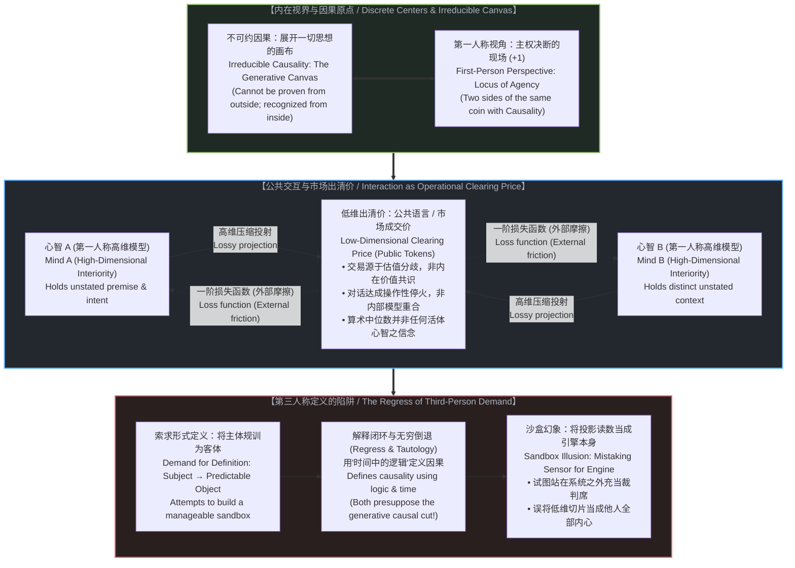

# 共享沙盒的幻象：内心世界、压缩与定义的陷阱 / The Illusion of the Shared Sandbox: Interiority, Compression, and the Trap of Definition

*因果不是画作内部的一个对象，而是一切理论得以落笔的画布；公共语言不是直通他人心智的通道，而是高维分歧在摩擦中达成的低维出清价。 / Causality is not an object discovered inside the landscape of thought, but the canvas upon which thought occurs; public language is not a channel of telepathic alignment, but the low-dimensional clearing price of high-dimensional divergence.*

---

## 一、 第三人称的定义要求与解释闭环 / 1. The Regress of the Third-Person Demand

人类交流建立在一项未经审视的假定之上：心智以为自己的内在认知能够被打包进语言符号，越过公共通道，完整无损地在另一个意识内部解包。这种假定制造了对称理解的幻象。从第一人称视角审视，这种对称并不存在。心智是离散的因果中心，缺乏直接互通的高维接口。日常被视作相互理解或普遍共识的现象，并非内部认知架构的重合，而是一个操作性的出清价——相互独立的系统在行动中暂停摩擦的粗糙坐标。

要求对方提供形式定义与公理前提的做法，并非出于探究，而是试图将一个自主的主体收拢为一个可预测的客体。通过将另一个心智的言说框定在既定公理之中，观察者搭建起一个便于处置的沙盒，平复对方未决自由所带来的不确定性，并维持自身的裁判席位。

对基础条件的定义要求构成了范畴倒错。当观察者要求对“不可约因果”下达形式定义时，实质是在要求将先验的基础条件拆解为衍生构件。若将因果定义为“逻辑在时间中的展开”，解释的闭环随即收紧：接下来必须定义“逻辑”与“时间”，而两者恰恰预先假定了自身试图解释的不对称生成序列。

正如[因果是不可约的先验，物理是没有视角的视角](../causality-is-irreducible-the-physical-is-a-view-from-nowhere/)所指出的，因果不是在思想风景内部被发现的对象，它是展开思想的画布。构建三段论、陈述句子或提出疑问，已经预设了在前的动作将导致在后的结果。正如[破除概念的僭越](../po-chu-gai-nian-de-jian-yue/)中对纸面等式的解构，为可能性条件索取外部证明，只能导致无穷递归或同义反复。不可约因果无法通过形式符号在外部被证实；它与第一人称视角是同一枚硬币的两面，只能从视界内部被指认。

---

Human communication proceeds on an unexamined assumption: the belief that internal thoughts are packaged into linguistic tokens, sent across an open channel, and unpacked intact within another consciousness. This model comforts the mind with a promise of mutual legibility. Yet, examined from the first-person perspective, this symmetry collapses. Minds operate as discrete causal centers, devoid of direct telepathic access to one another. What is celebrated as mutual understanding or settled consensus is not an alignment of internal architectures, but an operational clearing price—a coarse coordinate where isolated systems momentarily cease colliding.

The impulse to demand formal definitions and foundational premises from an interlocutor is not an invitation to genuine inquiry. It is an attempt to reduce an autonomous subject into a predictable object. By mapping another mind’s terms into neat axioms, an observer builds a manageable sandbox, neutralizes the vertigo of the other’s indeterminate freedom, and secures an external analytical vantage point.

Demanding definitions for foundational conditions commits a category error. When an observer asks for a formal definition of irreducible causality, they demand that a primary condition of possibility be broken down into derivative components. If one defines causality as "logic operating over time," the explanatory circle tightens immediately: one must then define "logic" and "time," both of which inherently presuppose the asymmetrical, generative sequence they attempt to explain.

As demonstrated in [Causality is Irreducible, the Physical is a View from Nowhere](../causality-is-irreducible-the-physical-is-a-view-from-nowhere/), causality is not an object discovered inside the landscape of thought; it is the canvas upon which thought occurs. To construct a syllogism, speak a sentence, or formulate a question is already to presuppose that an antecedent act will produce a consequent result. As shown in [Overcoming the Usurpation of Concepts](../po-chu-gai-nian-de-jian-yue/), demanding external proof for a condition of possibility forces the mind into infinite regress or tautology. Irreducible causality cannot be verified from the outside through formal tokens; it and the first-person perspective are two sides of the same coin, recognizable only from within.

---

## 二、 共识的神话与市场出清价 / 2. The Myth of Consensus and the Clearing Price

第一人称的经验无法直接外移，公共词表便充当了低维的桥梁。两个行动者使用同一批词汇——“选择”、“因果”、“真相”——各自的心智内部却运行着无法通约的模型。他们把局部的功能重合误认成了真正的共识。

这对应着金融市场的出清机制，正如[价格作为话语，理解作为交易](../price-as-utterance-understanding-as-trade/)所揭示的：市场的出清价格并不代表买卖双方对资产内在价值拥有共同信念。交易之所以发生，恰恰是因为双方持有相反的估值：买方认为资产价值高于现金，卖方认为现金价值高于资产。成交价格是双方分歧在特定时刻达成的结构性产物，并非统一理念的见证。类似地，金融界的“共识目标价”只是相互矛盾之预测的算术平均值，该数字并不被场内任何一位分析师所真正持有。

当这一机制投射至群体协作时，便衍生出两类虚构构念：

1. **作为多元无知的“常识”**：公共话语并不锚定于具体心智的真实信念，而是锚定于一个被假想出来的中位观察者。交流者使用被认可的词汇以降低交互摩擦，强化了一套双方私下皆不认同、公开却共同维系的规范。
2. **作为制度性停火的“既定科学”**：对于非专业群体，复杂的物理范式并非通过直接经验或数学推演所持有的真理，而是制度性的出清价。人们因下游技术构件的稳定运转而接受其结论，将工程上的操作性休战误认成了对实在的终极阐释。正如[索求万物理论是在将当下冻结为清单](../demanding-a-toe-freezes-time-into-a-catalog/)所揭示的，任何自称闭合了现实的清单，都只是特定观测窗口下的局部投影。

---

Because first-person ground-truths are non-transferable, the public lexicon serves as a low-dimensional bridge. Two individuals employ the exact same terms—"choice," "agency," "truth"—while hosting irreconcilable internal models. They mistake a narrow, functional overlap for genuine consensus.

This mirrors the mechanics of financial markets, as explored in [Price as Utterance, Understanding as Trade](../price-as-utterance-understanding-as-trade/): a market clearing price does not represent a shared conviction about intrinsic value. A transaction occurs precisely because two parties disagree: the buyer values the asset above cash; the seller values cash above the asset. The transaction price is a structural artifact of mutual divergence, not a testament to unified belief. Similarly, financial consensus targets are arithmetic averages of contradictory forecasts, representing a number held by no living analyst in the room.

When scaled across society, this dynamic generates phantom constructs:

1. **Public "Common Sense" as Pluralistic Ignorance**: Public discourse calibrates itself not to living minds, but to an imagined median observer. Speakers use sanctioned vocabulary to minimize friction, reinforcing a standard that neither side privately shares, yet both publicly uphold.
2. **"Settled Science" as an Institutional Clearing Price**: For the broader populace, scientific paradigms are not empirically held truths or individually verified mathematical frameworks, but institutional clearing prices. The non-specialist treats them as settled because downstream artifacts function, mistaking an operational truce for an exhaustive ontological capture of reality. As shown in [Demanding a Theory of Everything Freezes Time into a Catalog](../demanding-a-toe-freezes-time-into-a-catalog/), any catalog claiming to seal reality is merely a local projection within a narrow observation window.

---

## 三、 外部摩擦作为损失函数：观察即导航，而非裁决 / 3. External Friction as a Loss Function: Observation as Navigation, Not Verdict

这一系列现象背后的根本错位，是将高度压缩的宏观投影等同于生成它的微观实在。正如[确定性是微观不确定性的统计签名](../determinism-is-the-statistical-signature-of-micro-indeterminism/)所剖析的，词语、价格、选票与行为选择都是超低维度的切片。当外部环境观测到这些被压平的信号时，心智容易向其背后投射出一副整齐划一的内心图景。

这也揭示了关于交流目的最普遍的误区：常识以为交流的价值在于**最小化人与人之间的外部摩擦**——抚平异见、达成共识、或通过定义规训对方以消解认知冲突。然而，外部摩擦是离散因果中心相撞时的必然产物，它无法通过重写对方的内部模型来消除。**交流的真实价值，在于最小化自身内部感知到的不自洽。**

在真实的控制论机制中，**外部摩擦是一套不可替代的一阶损失函数（Loss Function）**。感官输入、语言反馈、阻力与卡壳，提供了行动者更新内部权重所必需的物理信号。这一损失函数无法通过规训对方或外部归因来平复，**它只能通过第一人称的内部校准（Internal Calibration）来消除**。看清是自身哪个粗糙的前提诱发了断裂，补写出缺失的自由变量，内心的不自洽感便自然消解。

外部观察具有明确的效用，但仅限于作为自身的导航数据。偏差发生于观察者的越界：当外部测量被当作对被观察者的终极判定。正如[残余与自由变量](../the-residue-and-the-free-variable/)中所分析的界面姿态与事后认领，声称外部观测穷尽了另一个主体的全部事实，是将传感器读数等同于引擎运转，将地图等同于地形。承认第一人称视角的不可约性，确立了一条清晰的边界：利用外部摩擦校准自身的行动轨迹，同时确认生成这些模式的源头无法在外部被全景封口。

---

The error underlying these phenomena is mistaking a compressed, macroscopic projection for the microscopic reality producing it. As analyzed in [Determinism is the Statistical Signature of Micro-Indeterminism](../determinism-is-the-statistical-signature-of-micro-indeterminism/), words, prices, votes, and behavioral choices are low-dimensional artifacts. When society observes these flattened signals, it hallucinates a uniform interiority behind them.

This exposes the widespread misunderstanding regarding the purpose of communication. Conventional intuition assumes the goal is to **minimize friction between minds**—smoothing over divergence, securing agreement, or policing definitions to eliminate cognitive conflict. Yet external friction is an inevitable consequence of discrete causal centers colliding; it cannot be erased by attempting to rewrite another mind's architecture. **The real value of communication lies in minimizing internally felt friction.**

Within this cybernetic geometry, **external friction serves as an irreplaceable loss function.** Sensory inputs, spoken responses, resistance, and misunderstanding provide the necessary empirical signals to update internal weights. This loss cannot be resolved by external attribution or trying to engineer consensus from without; **it can only be reduced by internal calibration.** Recognizing which unexamined premise caused the fracture and supplying the missing variable brings internally felt friction to zero.

External observation retains value, but strictly as navigational data. The breakdown occurs when the observer oversteps: when an external measurement is treated as a definitive judgment of the observed. As examined in [The Residue and the Free Variable](../the-residue-and-the-free-variable/) regarding interaction postures and retrospective claims, asserting that external observation captures the totality of another agent is to mistake the sensor readout for the engine, and the map for the terrain. Acknowledging the irreducible first-person perspective demands a boundary: using outward friction to orient one's own trajectory, while respecting that the space generating those patterns cannot be captured from without.
