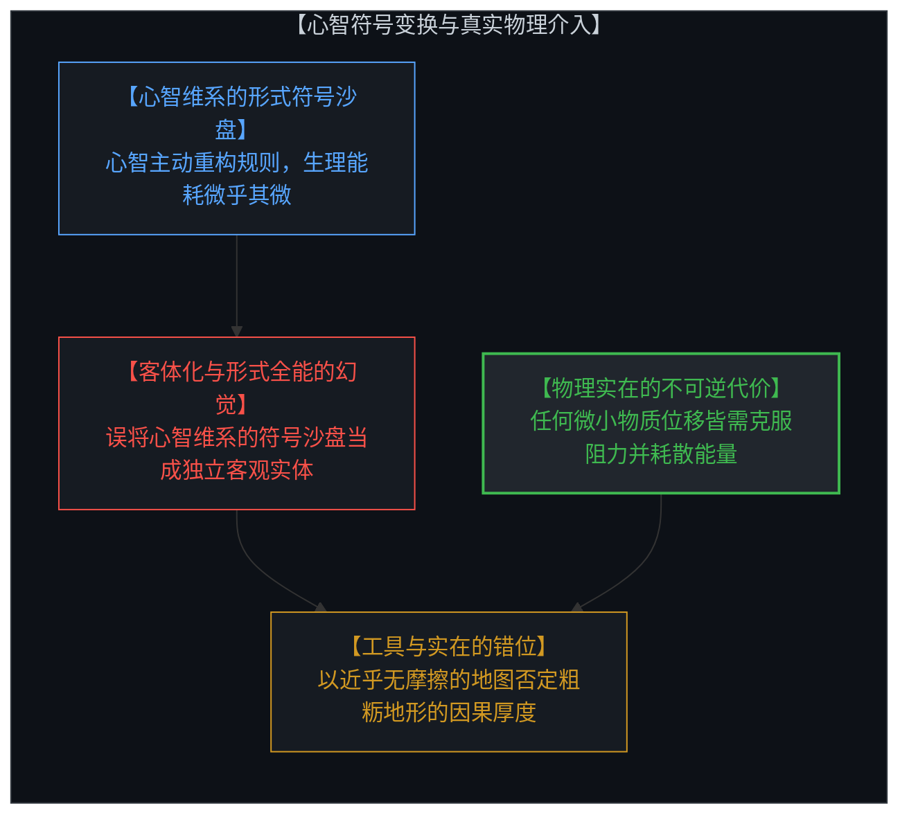
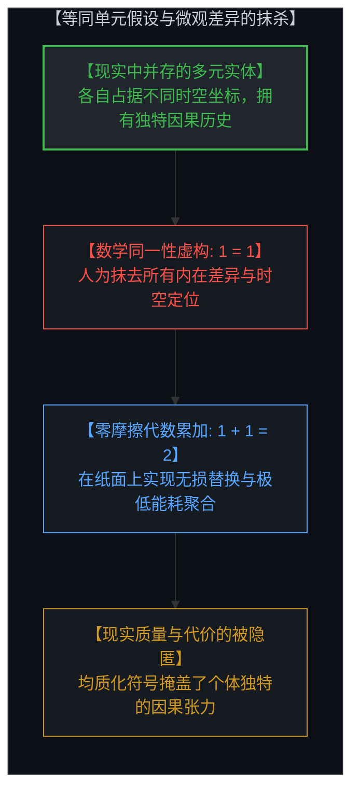
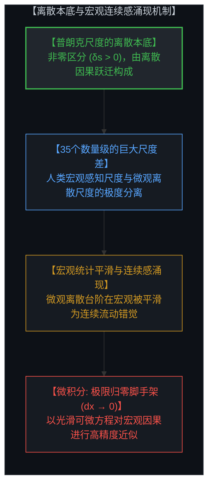
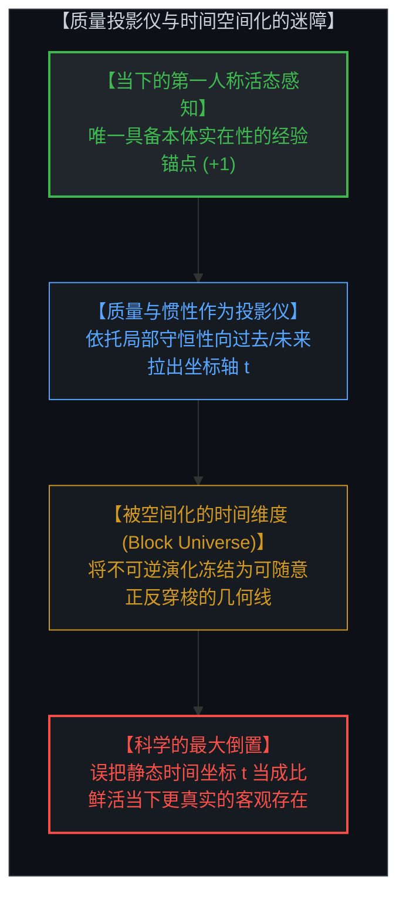
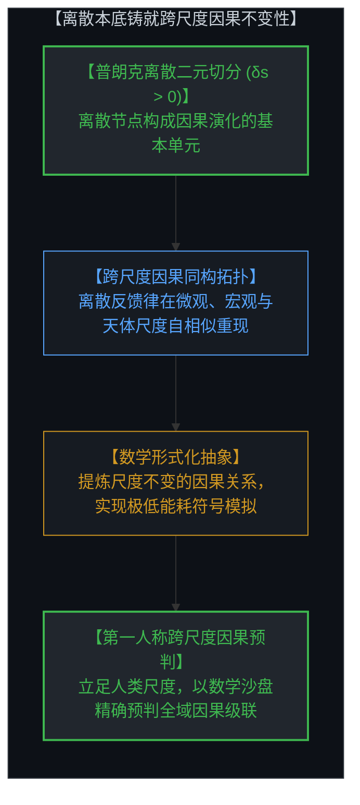
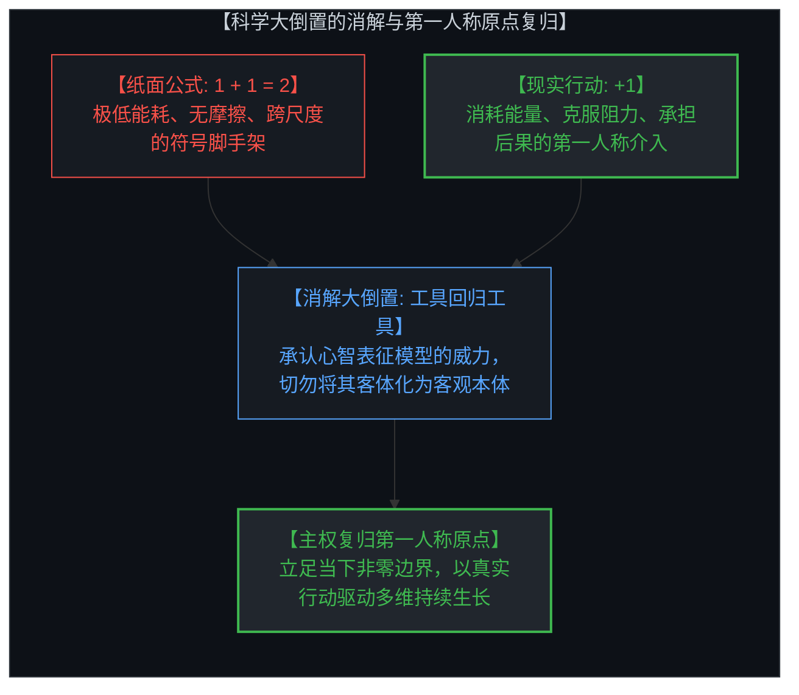

# 工具的幻觉与时间的倒置：等同单元、极限归零与行动的真实代价 / The Illusion of the Tool and the Inversion of Time: Identical Units, Infinitesimal Limits, and the Living Cost of the Act

*极低能耗符号变换、离散因果的跨尺度不变性与物理介入的不可逆代价 / Near-Zero-Cost Symbolic Transformations, Discrete Cross-Scale Invariance, and the Irreversible Cost of Physical Action*

---

## 一、 最强工具的双刃剑：形式表征的威力与实在倒置的陷阱 / 1. The Double-Edged Nature of Powerful Tools: The Power of Representation and the Trap of Ontological Inversion

必须首先厘清一个根本前提：**我们指出数学与物理模型的虚构性，绝非否定物理学、质量或数学表征的巨大价值。**

相反，经典力学、相对论与微积分是人类文明有史以来最强大的认知工具：
* 质量与物理定律极其敏锐地刻画了物质世界中宏观稳定的因果模式；
* 形式数学赋予了心智一种登峰造极的抽象能力，让我们能够以前所未有的精确度发现自然界深邃的底层结构。

**真正的危机不在于心智运用工具，而在于对认知构架的“本体论倒置”：心智忘记了模型是自己在意识中维系的表征活动，反将其客体化为比活生生的现实更为根本、更为可靠的独立实在。**

当心智在意识中建构并维系数学构架时，心智对几何关系的重构与变换**在实际效用上所耗费的生理能量与摩擦，与其所表征的真实物理巨变相比微不足道到几乎可以忽略**：
* 并不存在脱离心智独立存在的“模型本身”——所谓数学模型，本质上是第一人称心智在当下进行的符号维系与认知推演；
* 在这种由心智主动维系的符号沙盘中，心智只需凭借一套重新定义的代数规则，就能随心所欲地构想平直空间的弯曲、坐标系的旋转翻转或高维拓扑的折叠；
* 相对于在物理实在中移动星系、搬运重物所需的巨大物理功与不可逆熵增，心智在意识中重构符号规则的能耗代价在宏观比例上几乎为零。

这种由心智维系的低成本符号操控力，极大地拓展了人类理解模式与预测规律的边界。然而，恰恰是这种相对于实体介入几乎可忽略的微小代价，孕育了一个致命的本体论错觉：**心智将自己维系的符号构架实体化为一个独立存在的客观实体，并误以为这种在意识中近乎无摩擦的规则重构比粗粝的物理介入更可靠、更真实，从而滑入了用静态认知地图抹杀鲜活地形的倒置陷阱。**

在活生生的物理现实与第一人称体验中，任何真实状态的改变都绝非轻而易举：
* 挪动哪怕一克物质、改变一个微观排列，都必须克服环境阻力、消耗真实的生物能或物理功，并产生不可逆的热力学耗散；
* 在纸面上翻转整个宇宙只需擦掉一个负号，而在现实中踏出一步（+1）都需要支付真实的生命时间与不可逆的代价。

---

A fundamental clarification must be established at the outset: **Critiquing the idealized assumptions of physics and mathematics is in no way a dismissal of their extraordinary validity.**

Classical mechanics, general relativity, and calculus remain the most formidable cognitive instruments in human history:
* Concepts like mass and inertia capture the stable macro-invariants of causality with unmatched fidelity;
* Formal mathematics grants the Mind the power to discern the deep, underlying causal symmetries of nature across vast scales.

**The hazard lies not in employing cognitive tools, but in ontological inversion: the Mind forgets that the model is its own active representational construct, reifying it into something supposedly more fundamental, reliable, and real than the friction-bearing living reality from which it arose.**

When the Mind constructs and sustains mathematical frameworks in consciousness, the mental act of transforming geometric relations **involves an energetic cost that is negligible compared to the colossal physical transformations it represents**:
* There is no such thing as a "model in itself" floating independently of the Mind holding it—a mathematical model is always an active cognitive act, sustained and animated by consciousness at the first-person origin;
* Within this mind-sustained symbolic sandbox, the Mind can redefine algebraic rules at will, effortlessly imagining flat space curving into a Riemannian manifold, rotating coordinate axes, or folding higher-dimensional topologies;
* Relative to the immense physical work and thermodynamic entropy required to move real matter or alter cosmic configurations, the Mind's internal reconfiguration of symbolic definitions costs virtually nothing.

This low-overhead cognitive power infinitely expands our ability to recognize patterns and model horizons. Yet that very disproportion breeds a fatal ontological illusion: **the Mind reifies its own symbolic construct into an independent "objective reality," and mistakenly assumes that because it can rewrite definitions effortlessly in consciousness, this frictionless mental playground is superior to, and more fundamental than, the messy physical reality of living action.**

In physical reality and first-person experience, no transformation is free:
* Shifting a single gram of matter or altering a local configuration requires overcoming friction, burning biological or mechanical energy, and paying an irreversible thermodynamic cost;
* Flipping an entire galaxy on paper requires merely erasing a minus sign, whereas taking a single step in reality (+1) demands real time, real energy, and non-transferable consequence.

---

## 二、 数学的第一大虚构假设：等同单元（1 = 1）与同一性公理 / 2. The First Mathematical Fiction: Identical Units (1 = 1) and the Axiom of Identity

代数与算术的全部大厦，建立在一个看似不证自明的前提之上：**存在着两个等同的单元（1 = 1），因而它们可以无摩擦地累加为 2（1 + 1 = 2）。**

然而，如果我们将目光从抽象符号投向真实的因果几何，就会发现“等同单元”是一项人为构造的虚构：

1. **不可分辨同一性的几何底线**：
   莱布尼茨曾指出，如果两个对象在所有属性、坐标、关系与内在特征上毫无差别，那么它们在几何与本体论上**不是两件事物，而是同一件事物**。
2. **两物并存必然伴随差异**：
   只要两个实体同时存在于现实中，它们就必然占据不同的时空位置、拥有独特的因果演化历史，并处于不同的全域关系张力中。既然存在差异，它们就**不可能真正等同**。
3. **符号抽象对现实摩擦的抹杀**：
   数学将形态各异、充满独特张力的人、物与事件，一概抽象为无差别、可互相置换的符号“1”。这种均质化操作极大便利了统计计算与代数运算，但它在第一瞬间就**通过抹杀微观区分（Distinction），洗去了事物原本携带的质量、摩擦与因果独特性**。

---

The entirety of arithmetic and algebra rests upon a premise assumed to be self-evident: **that there exist identical units (1 = 1), allowing them to be combined into 2 (1 + 1 = 2) without loss or friction.**

When scrutinized through the lens of causal geometry, however, the concept of "identical units" is revealed as an axiomatic fiction:

1. **The Principle of the Identity of Indiscernibles**:
   As Leibniz established, if two entities share every attribute, coordinate, causal history, and relational state, they are **not two entities, but the exact same single entity**.
2. **Coexistence Dictates Difference**:
   For two entities to coexist in reality, they must occupy distinct coordinates and sustain unique relational tensions within the causal network. Because difference is the prerequisite of coexistence, **no two things in reality can ever be identical**.
3. **Symbolic Erasure of Friction**:
   Mathematics abstracts uniquely situated entities into interchangeable tokens labeled "1". While this frictionless homogenization enables arithmetic aggregation and macro accounting, it achieves this by **erasing the micro distinctions and real physical friction intrinsic to living existence**.

---

## 三、 本底离散与连续统幻象：普朗克尺度的二元切分与尺度平滑 / 3. Primordial Discreteness and the Continuum Mirage: Binary Planck Cuts and Scale Smoothing

微积分之所以能够建立起连续可微的动力学方程，核心支柱在于**极限归零假设**：假设施加无限细分，空间与时间微元（dx, ds, dt）可以**无限逼近并达到零**。

然而，现代物理与因果几何揭示了一个相反的物理真相：**实在的本底根本不是连续的，而是由普朗克尺度下一系列离散的二元区分（Distinctions / Bits）所构成的离散因果网络。**

1. **非零边界与离散本底（\(\delta s > 0\)）**：
   * 任何信息、感知与因果相互作用的成立，都依赖于一个**非零边界（Non-Zero Boundary, \(\delta s > 0\)）**。
   * 在普朗克尺度（\(\sim 10^{-35}\text{ m}\)），时空与因果状态被切分为一个个不可再分的离散阶跃。正像（A）与负像（\(A^\perp\)）必须维持最小的非零间隙；
   * 如果切分间隔真的达到零（\(ds = 0\)），正负两面瞬间坍缩湮灭，系统总信息量归零（\(I = A + A^\perp \to 0\)），所有区分消融，世界坍缩为无差别的均质虚无。
2. **连续感来自巨大尺度差的统计平滑**：
   * 既然本底是离散阶跃的，人类日常体验到的“光滑连续性”从何而来？
   * 这种连续感正是**宏观观测尺度与微观离散尺度之间的巨大差异所产生的涌现幻觉**。
   * 人类的感知尺度（米级、秒级）与普朗克尺度相隔了 35 个数量级。当跨越几十个数量级的离散台阶汇聚在一起时，微观离散步进被宏观统计平均所抹平，心智便在宏观上产生了“空间与时间是平滑连续统”的感官错觉。
3. **微积分是粗粒化的实用脚手架**：
   * 微积分的 \(dx \to 0\) 假设，是心智在巨大尺度差下对庞大离散微元的**有效粗粒化（Coarse-Graining）与统计近似**；
   * 它为宏观工程提供了无与伦比的计算利器，但它是一个为了忽略离散台阶而发明的几何脚手架，绝非宇宙最底层的物理本体。

---

Calculus establishes continuous, differentiable equations of motion by relying on the **infinitesimal limit: assuming spatial and temporal intervals (dx, ds, dt) can shrink all the way to zero.**

Modern physics and causal geometry, however, reveal the inverse truth: **reality is fundamentally discrete and binary—a web of discrete distinctions and state transitions rooted at the Planck scale.**

1. **Non-Zero Boundaries and Primordial Discreteness (\(\delta s > 0\))**:
   * The emergence of information and interaction requires a **non-zero boundary (\(\delta s > 0\))**.
   * At the Planck scale (\(\sim 10^{-35}\text{ m}\)), spacetime and causal states resolve into indivisible discrete steps. Positive figure (A) and negative ground (\(A^\perp\)) are held apart by a minimal discrete cut;
   * If intervals actually reached zero (\(ds = 0\)), the boundary dissolves, information collapses (\(I = A + A^\perp \to 0\)), and reality collapses into meaningless homogeneity.
2. **Continuity as an Emergent Scale Phenomenon**:
   * If reality is fundamentally discrete, where does the smooth, unbroken continuum of everyday experience come from?
   * The feeling of continuity is an **emergent perceptual effect generated by enormous scale separation**.
   * Human biological observation (meters, seconds) is separated from the Planck scale by over 35 orders of magnitude. When trillions upon trillions of discrete steps are aggregated across this vast distance, their individual edges blur, creating the perceptual illusion of a smooth, seamless continuum.
3. **Calculus as Coarse-Grained Scaffolding**:
   * The mathematical limit \(dx \to 0\) is an **effective coarse-graining technique** that allows the Mind to ignore discrete micro-steps when computing macro trajectories;
   * It is an extraordinary planning tool, but it is an idealized continuum approximation, not the discrete bedrock of reality.

---

## 四、 质量作为投影仪：被空间化的时间轴与对当下的逃避 / 4. Mass as a Projective Instrument: Spatialized Time and the Evasion of the Present

在活生生的第一人称意识中，**我们所拥有的唯一直觉实在就是“当下”**。

那么，物理学中那条贯穿过去与未来的宏大时间轴究竟从何而来？它的几何本质，正是心智利用“质量（Mass）”与守恒律所搭建的**时间投影仪**：

1. **质量的投影功能**：
   质量代表着物理状态在时间序贯中的惯性与相对稳定性。心智正是依托质量及其动力学方程，以当下为锚点，向过去（\(t < 0\)）拉出一条因果回溯线，向未来（\(t > 0\)）拉出一条预测演进线，从而为当下的微观抉择提供宏观参照。
2. **时间的空间化迷障（Spatialization of Time）**：
   然而，科学史上最隐蔽的偷梁换柱，就是**将这条被投影出来的几何时间轴（t 轴），当成了比当下更真实的客观存在**。
   * 在相对论的“块状宇宙（Block Universe）”构架中，时间被降维成了一条画好的第四维几何坐标轴；
   * 在方程中，你可以沿着 t 轴任意向前求导或向后积分，甚至宣称“过去、现在与未来同时客观存在”。
3. **真实时间的不可逆性**：
   真实的时间体验不是一条静止摆在空间里的导轨。真实的时间是不可逆的因果演进，是每一次物理介入（+1）所支付的真实熵增与生命能量。把坐标轴 t 误认为真实时间，无异于把纸面上的航海图误认为了波涛汹涌的真实大海。

---

In living conscious awareness, **the only direct perceptual reality we ever possess is the present moment.**

Where, then, does the grand timeline spanning past and future originate? Its geometric essence is a **projective instrument** constructed by the Mind using mass and conservation laws:

1. **Mass as a Projective Instrument**:
   Mass represents the inertial stability of physical states across sequential transitions. By anchoring to mass invariants and equations of motion, the Mind projects backward (\(t < 0\)) into history and forward (\(t > 0\)) into prediction, providing a macroscopic map to navigate the present choice.
2. **The Spatialization of Time**:
   The fatal category error of modern science is **confusing this projected geometric coordinate axis (the t-axis) with the actual living experience of time.**
   * In the relativistic "Block Universe," time is flattened into a static fourth spatial dimension;
   * Within equations, one can traverse forward or backward along t with zero friction, leading to the bizarre claim that "past, present, and future coexist statically."
3. **The Irreversibility of Felt Time**:
   Actual time is not a pre-existing spatial track. Felt time is the irreversible unfolding of causality—the real thermodynamic entropy and vital energy consumed by every single act (+1). Mistaking the spatialized coordinate t for living time is mistaking the static map for the stormy ocean.

---

## 五、 数学的因果本质：离散性是跨尺度不变性的物理根基 / 5. The Causal Essence of Mathematics: Discreteness as the Root of Cross-Scale Invariance

理解了本底的离散性，我们便能解开人类思想史上的一个终极谜题：**为什么数学能够如此精确地跨越尺度抽象现实？**

最关键的因果机制就在于：**恰恰是本底的离散性（二元切分），使得因果关系能够在不同尺度间保持拓扑不变性。**

1. **离散结构决定了因果拓扑的可抽象性**：
   * 如果实在是一团毫无间断的均质流体，就不可能存在离散的状态跃迁、组合逻辑与因果门禁；
   * 正因为现实由最底层的离散区分所构成，因果反馈环在组合演进时，才能形成**自相似的拓扑结构（如群对称性、幂律分布、守恒比例与守恒网络）**。
   * 无论是在普朗克尺度的微观量子态跳变，还是在宏观杠杆的力矩平衡，抑或在星系间的引力约束，**离散因果节点之间的相对逻辑关系是高度同构的**。
2. **数字与代数是跨尺度因果的纯化提炼**：
   * 当我们在纸面上操纵数字与方程时，我们不是在摆弄虚无缥缈的符号游戏，而是在**识别并追踪因果网络在不同尺度基底上重复涌现的不变模式**。
   * 数学是心智的**微能耗因果望远镜**：它以极微弱的生理能耗剥离了特定尺度的物质阻力，提炼出因果关系的拓扑结构，允许处于宏观尺度（米级）的第一人称心智，提前模拟与预判微观粒子或宏观星系的因果演化。
3. **形式工具与物理代价的平衡**：
   * 数学之所以有效，是因为它提炼了离散因果的**尺度不变拓扑**；
   * 我们之所以必须警惕它的幻觉，是因为符号运算**相比于实体演变而言忽略了巨大的能耗累积**。在真实世界中跨越尺度与改变状态，永远必须一步一个脚印地支付真实的物理功与不可逆代价。

---

Grasping primordial discreteness resolves one of the ultimate enigmas of intellectual history: **Why does mathematics abstract physical reality across scales with such uncanny precision?**

The causal mechanism is profound: **The very discreteness of reality is the fundamental reason why causality is invariant across scales, and therefore why it can be abstracted by mathematics.**

1. **Discreteness as the Engine of Causal Topology**:
   * If reality were an undifferentiated continuous fluid, there would be no stable states, no combinatorial logic, and no discrete causal gates;
   * Because reality is built upon discrete binary distinctions (cuts), causal feedback loops assemble into **scale-invariant topological structures (group symmetries, power laws, conservation ratios, and network invariants)**.
   * Whether jumping between quantum states at the Planck scale, balancing mechanical torques on a lever, or maintaining orbital constraints between stars, **the relational logic connecting discrete causal nodes remains strictly isomorphic**.
2. **Numbers as Distillations of Cross-Scale Causal Symmetries**:
   * When we manipulate numbers and equations, we are not playing a disconnected symbolic game; we are **identifying and tracking the repeating causal feedback patterns of the universe across disparate physical substrates**.
   * Mathematics is the Mind's **low-overhead causal telescope**: with minuscule biological energy, it strips away substrate-specific friction and isolates scale-free causal invariants, enabling a macroscopic observer to simulate and predict causal cascades across dozens of orders of magnitude.
3. **Balancing Representational Power and Physical Cost**:
   * Mathematics works because it isolates the **scale-invariant geometry of discrete causal networks**;
   * We must guard against its illusion because algebraic manipulation **operates with an energetic overhead negligible compared to actual physical work**. Actualizing a physical transformation always requires stepping through each discrete friction-bearing state in the living present.

---

## 六、 科学的大倒置与第一人称原点的复归 / 6. The Great Reversal of Science and the Reclamation of the First-Person Origin

近代科学对人类社会造成的最大认知倒置（The Great Reversal），就在于**将心智维系的模型阴影，误认为了比活生生的第一人称实在更为根本的客观真理**：

* **倒置的教条**：“因为物理方程中没有主观感受，时间在坐标轴上是对称可逆的，所以人类切身体验到的时间流动、痛苦与自由抉择必定只是微不足道的主观错觉，唯有静态冰冷的数学结构才是客观现实。”
* **真相的颠倒与复归**：
  1. 纸面上的 `1 + 1 = 2`、跨尺度的代数公式与坐标轴上的连续曲线，是心智为了规划未来而在意识中维系的**极低代价符号脚手架**；
  2. 现实中的每一次选择与介入（+1），才是真正必须克服阻力、支付不可逆代价的**唯一因果本体**；
  3. 用极低能耗的几何沙盘去否定肉身介入的真实性，是用投影的影子去否定发光的太阳。

当我们看清了**等同单元（1 = 1）**与**微元归零（dx → 0）**这两大数学虚构，并理解了**离散本底铸就跨尺度不变性**的真实机制，我们便能心怀敬畏地运用形式工具，而不被工具所奴役。

物理学与质量概念是心智无与伦比的表征利器，数学是跨尺度的因果罗盘；但我们必须时刻清醒：**符号沙盘在意识中可以跨越千山万水、以极低代价自由弯曲，而生命的每一次真实前行，都必须由第一人称的主权心智在当下（+1）支付其不可转让的因果代价。**

---

The greatest cognitive reversal inflicted by reductionist science upon civilization (The Great Reversal) is **mistaking the mind-sustained model's shadow for the primary reality, while degrading living first-person existence into an illusion**:

* **The Dogma of the Reversal**: "Because equations are time-symmetric and devoid of subjective qualities, our felt experience of irreversible time, lived suffering, and free choice must be an illusion—only the frozen mathematical structure is real."
* **The Reclamation of Reality**:
  1. The paper equation `1 + 1 = 2`, cross-scale algebraic formulas, and continuous coordinate axes are **negligible-cost symbolic scaffolding** sustained by the Mind for foresight and cross-scale navigation;
  2. The living physical intervention (+1) that burns energy, overcomes friction, and absorbs consequence is the **primary ontological ground of causality**;
  3. Denying the reality of lived experience using a frictionless mental sandbox is using the shadow to deny the sun.

When we see through the two great mathematical fictions—**identical units (1 = 1)** and **infinitesimal limits (dx → 0)**—and recognize that **primordial discreteness is the engine of cross-scale invariance**, we can wield formal tools with mastery without becoming trapped in their illusions.

Physics and mass are indispensable representational instruments of the Mind, and mathematics is our greatest cross-scale causal compass. But we must remain anchored in truth: **the mental scaffolding can expand and curve with negligible energetic cost across infinite dimensions in consciousness, but every genuine step of life must be paid for by the sovereign Mind at the first-person origin (+1) through real, irreversible causal action.**
