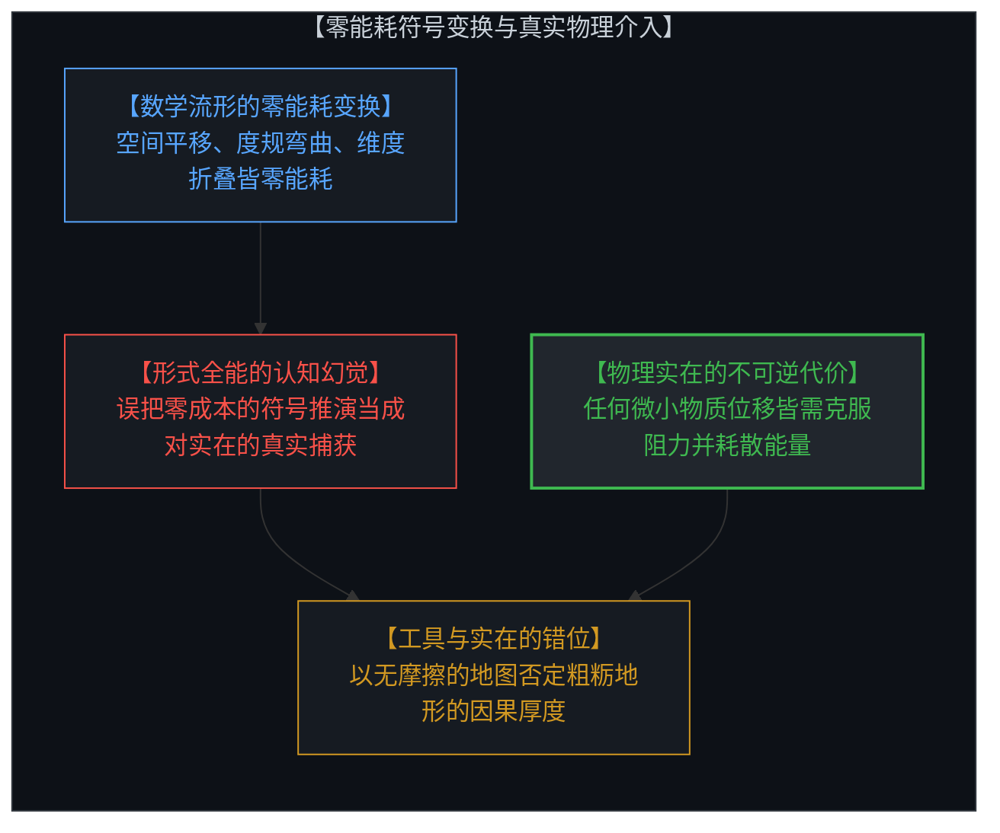
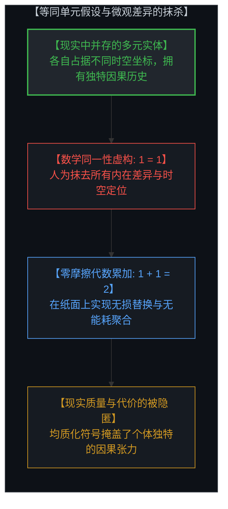
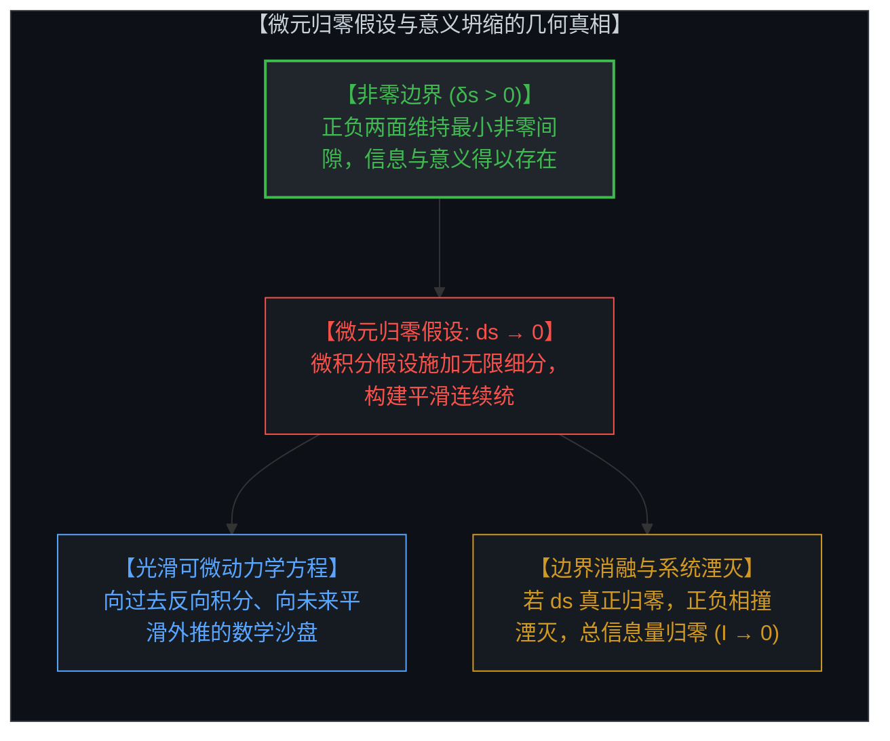
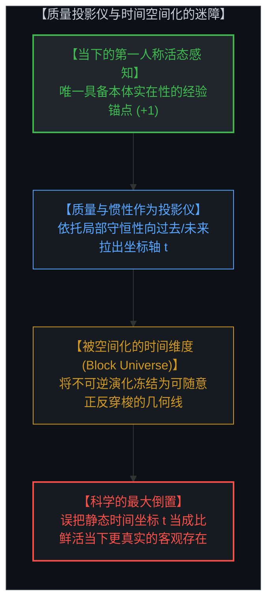
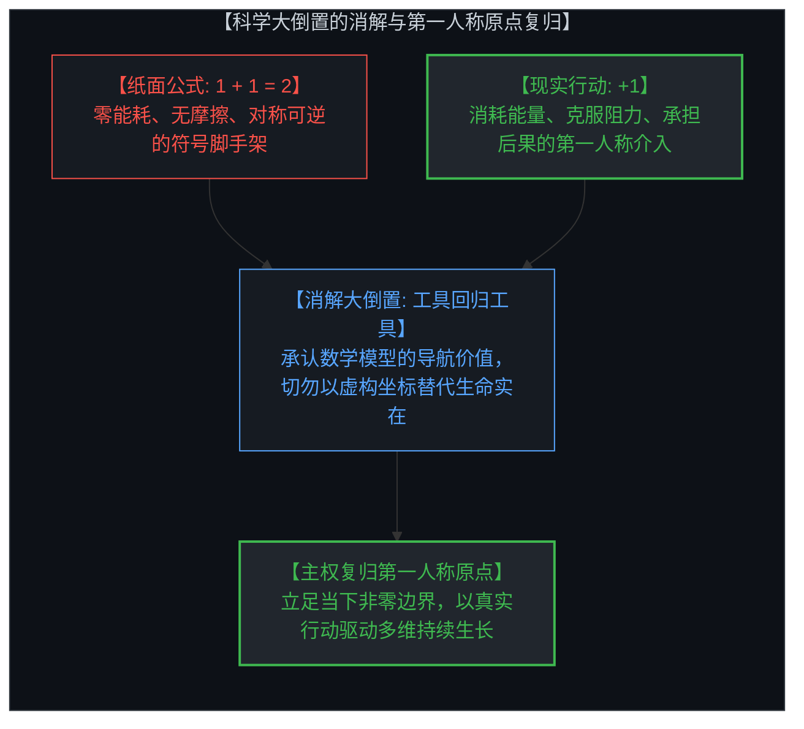

# 工具的幻觉与时间的倒置：等同单元、极限归零与行动的真实代价 / The Illusion of the Tool and the Inversion of Time: Identical Units, Infinitesimal Limits, and the Living Cost of the Act

*零能耗几何变换、被空间化的时间轴与物理介入的因果不可逆性 / Zero-Cost Geometric Transformations, Spatialized Time, and the Irreversible Causality of Physical Acts*

---

## 一、 最强工具的双刃剑：零能耗几何变换与形式全能的幻觉 / 1. The Double-Edged Nature of Powerful Tools: Zero-Cost Transformations and the Illusion of Formal Omnipotence

人类认知史上最伟大的飞跃，莫过于发展出形式数学与数理物理学这套登峰造极的符号工具。然而，**我们最强大的工具，在不知不觉中演化为我们最深重的认知幻觉。**

在数学坐标系与微分流形的构架中，心智对空间的变换是**零能耗、零摩擦且全然自由的**：
* 你可以凭借一组代数规则，随心所欲地将平直空间弯曲为黎曼流形，把坐标系旋转、翻转、无限拉伸或压缩；
* 你可以在高维拓扑空间中自如折叠维度、构造自同构映射与同胚变换，而整个过程所耗费的真实物理能量与热力学熵增为零。

这种近乎神迹的符号操控力，极大地拓展了人类理解模式与预测规律的边界，甚至将人类的推演视界推向无穷远。然而，恰恰是这种轻而易举的变换能力，孕育了一个致命的本体论错觉：**心智误以为这种零成本的符号变换已经真正捕获并等同于了物理与意识实在本身。**

在活生生的物理现实与第一人称体验中，任何真实状态的改变都绝非轻而易举：
* 挪动哪怕一克物质、改变一个微观排列，都必须克服环境阻力、消耗真实的生物能或物理功，并产生不可逆的热力学耗散；
* 在纸面上翻转整个宇宙只需擦掉一个负号，而在现实中踏出一步（+1）都需要支付真实的生命时间与不可逆的代价。

---

The most magnificent leap in the history of human cognition was the development of formal mathematics and mathematical physics. Yet **our most powerful tools inevitably become our most profound cognitive illusions.**

Within the architecture of mathematical coordinate systems and differential manifolds, the Mind transforms space with **zero energy, zero friction, and effortless freedom**:
* By defining arbitrary algebraic rules, you can transform flat Euclidean space into a curved Riemannian manifold, rotating, flipping, stretching, or compressing coordinate axes at will;
* You can fold higher-dimensional topological spaces, construct automorphisms, and execute smooth diffeomorphisms—all while consuming zero physical energy and generating zero thermodynamic entropy.

This near-miraculous symbolic power infinitely expands our ability to recognize patterns and model horizons. Yet that very capability breeds a fatal ontological illusion: **the Mind mistakenly believes that because it can manipulate the model effortlessly, the model has captured and substituted the living reality itself.**

In physical reality and first-person experience, no transformation is free:
* Shifting a single gram of matter or altering a local configuration requires overcoming friction, burning biological or mechanical energy, and paying an irreversible thermodynamic cost;
* Flipping an entire galaxy on paper requires merely erasing a minus sign, whereas taking a single step in reality (+1) demands real time, real energy, and non-transferable consequence.

---

## 二、 数学的第一大虚构假设：等同单元（1 = 1）与同一性公理 / 2. The First Mathematical Fiction: Identical Units (1 = 1) and the Axiom of Identity

代数与算术的全部大厦，建立在一个看似不证自明的前提之上：**存在着两个全然等同的单元（1 = 1），因而它们可以无摩擦地累加为 2（1 + 1 = 2）。**

然而，如果我们将目光从抽象符号投向真实的因果几何，就会发现“等同单元”是一项人为构造的虚构：

1. **不可分辨同一性的几何底线**：
   莱布尼茨曾指出，如果两个对象在所有属性、坐标、关系与内在特征上毫无差别，那么它们在几何与本体论上**不是两件事物，而是同一件事物**。
2. **两物并存必然伴随差异**：
   只要两个实体同时存在于现实中，它们就必然占据不同的时空位置、拥有独特的因果演化历史，并处于不同的全域关系张力中。既然存在差异，它们就**永远不可能真正等同**。
3. **符号抽象对现实摩擦的抹杀**：
   数学将形态各异、充满独特张力的人、物与事件，一概抽象为无差别、可互相置换的符号“1”。这种均质化操作极大便利了统计计算与代数运算，但它在第一瞬间就**通过抹杀微观区分（Distinction），洗去了事物原本携带的质量、摩擦与因果独特性**。

---

The entirety of arithmetic and algebra rests upon a premise assumed to be self-evident: **that there exist identical units (1 = 1), allowing them to be combined into 2 (1 + 1 = 2) without loss or friction.**

When scrutinized through the lens of causal geometry, however, the concept of "identical units" is revealed as an axiomatic fiction:

1. **The Principle of the Identity of Indiscernibles**:
   As Leibniz established, if two entities share every attribute, coordinate, causal history, and relational state, they are **not two entities, but the exact same single entity**.
2. **Coexistence Dictates Difference**:
   For two entities to coexist in reality, they must occupy distinct coordinates and sustain unique relational tensions within the causal network. Because difference is the prerequisite of coexistence, **no two things in reality can ever be identical**.
3. **Symbolic Erasure of Friction**:
   Mathematics abstracts uniquely situated entities into interchangeable tokens labeled "1". While this frictionless homogenization enables arithmetic aggregation and macro accounting, it achieves this by **erasing the micro distinctions and real physical friction intrinsic to living existence**.

---

## 三、 数学的第二大虚构假设：极限归零（dx → 0, ds → 0）与连续统迷障 / 3. The Second Mathematical Fiction: The Infinitesimal Limit (dx → 0, ds → 0) and the Continuum Mirage

微积分之所以能够建立起连续可微的运动方程、向过去回溯原因并向未来预测轨迹，其核心支柱在于**极限假设**：假设空间、时间与切分间隔（dx, ds, dt）可以**无限细分并达到零**。

但在因果几何与实在的拓扑中，这种“微元归零”的假设在物理上是根本不成立的：

1. **非零边界是意义存在的几何基石**：
   任何感知与区分的成立，都依赖于一个**非零边界（Non-Zero Boundary, δs > 0）**。心智之所以能辨识出正像（A）与负像（A^⟂），正是因为两者之间维持着最小非零的区分间隙（如普朗克长度、量子离散能级或意识的最小采样分辨率）。
2. **ds 归零即意味着系统坍缩**：
   如果切分间隔真的达到零（ds = 0），正像与负像的边界便会瞬间熔断，正负两面相互撞击湮灭，系统总信息量归零（I = A + A^⟂ → 0）。**一旦 ds 归零，所有区分消融，现实流形坍缩为无差别的均质虚无，一切意义尽数丧失。**
3. **光滑连续统作为理想化脚手架**：
   借助 dx → 0 的假设，数学构建出一条条平滑、无间断、处处可微的几何曲线。这套连续统脚手架极大方便了心智进行跨时空的宏观规划，但它本质上是用**一个抹去了离散阶跃与真实能量阻力的光滑幻象**，替代了现实中由一个个非零切分构成的粗粝因果网络。

---

Calculus constructs continuous, differentiable equations of motion—enabling retrospective backward analysis and predictive forward trajectory extrapolation—by relying upon the **infinitesimal limit: assuming spatial, temporal, and distinction intervals (dx, ds, dt) can shrink all the way to zero.**

In causal geometry and topology, however, the assumption that intervals reach zero is physically impossible:

1. **Non-Zero Boundaries as the Floor of Meaning**:
   The emergence of perception depends entirely upon a **non-zero boundary (δs > 0)**. The Mind can distinguish positive figure (A) from negative ground (A^⟂) only because a minimal discrete gap separates them (analogous to the Planck scale or the Mind's discrete sampling rate).
2. **Collapse Upon Zero (ds = 0)**:
   If the boundary interval were to actually reach zero (ds = 0), the demarcation between inside and outside would instantly dissolve. Positive and negative poles would collide and annihilate, information would collapse (I = A + A^⟂ → 0), and the perceptual manifold would flatten into meaningless homogeneity.
3. **The Continuum as Idealized Scaffolding**:
   By assuming dx → 0, mathematics weaves smooth, continuous curves. This scaffolding is an extraordinary planning tool, but it replaces the discrete, friction-bearing reality of physical jumps with a frictionless continuum.

---

## 四、 质量作为投影仪：被空间化的时间轴与对当下的逃避 / 4. Mass as a Projective Instrument: Spatialized Time and the Evasion of the Present

在活生生的第一人称意识中，**我们所拥有的唯一直觉实在就是“当下”**。

那么，物理学中那条贯穿过去与未来的宏大时间轴究竟从何而来？它的几何本质，正是心智利用“质量（Mass）”与守恒律所搭建的**时间投影仪**：

1. **质量的投影功能**：
   质量代表着物理状态在时间序贯中的惯性与相对稳定性。心智正是依托质量及其动力学方程，以当下为锚点，向过去（t < 0）拉出一条因果回溯线，向未来（t > 0）拉出一条预测演进线，从而为当下的微观抉择提供宏观参照。
2. **时间的空间化迷障（Spatialization of Time）**：
   然而，科学史上最隐蔽的偷梁换柱，就是**将这条被投影出来的几何时间轴（t 轴），当成了时间本身的真实存在**。
   * 在相对论的“块状宇宙（Block Universe）”构架中，时间被降维成了一条画好的第四维几何坐标轴；
   * 在方程中，你可以沿着 t 轴任意向前求导或向后积分，甚至宣称“过去、现在与未来同时客观存在”。
3. **真实时间的不可逆性**：
   真实的时间体验不是一条静止摆在空间里的导轨。真实的时间是不可逆的因果演进，是每一次物理介入（+1）所支付的真实熵增与生命能量。把坐标轴 t 误认为真实时间，无异于把纸面上的航海图误认为了波涛汹涌的真实大海。

---

In living conscious awareness, **the only direct perceptual reality we ever possess is the present moment.**

Where, then, does the grand timeline spanning past and future originate? Its geometric essence is a **projective instrument** constructed by the Mind using mass and conservation laws:

1. **Mass as a Projective Instrument**:
   Mass represents the inertial stability of physical states across sequential transitions. By anchoring to mass invariants and equations of motion, the Mind projects backward (t < 0) into history and forward (t > 0) into prediction, providing a macroscopic map to navigate the present choice.
2. **The Spatialization of Time**:
   The fatal category error of modern science is **confusing this projected geometric coordinate axis (the t-axis) with the actual living experience of time.**
   * In the relativistic "Block Universe," time is flattened into a static fourth spatial dimension;
   * Within equations, one can traverse forward or backward along t with zero friction, leading to the bizarre claim that "past, present, and future coexist statically."
3. **The Irreversibility of Felt Time**:
   Actual time is not a pre-existing spatial track. Felt time is the irreversible unfolding of causality—the real thermodynamic entropy and vital energy consumed by every single act (+1). Mistaking the spatialized coordinate t for living time is mistaking the static map for the stormy ocean.

---

## 五、 科学的大倒置与第一人称原点的复归 / 5. The Great Reversal of Science and the Reclamation of the First-Person Origin

近代科学对人类社会造成的最大认知倒置（The Great Reversal），就在于**将数学与物理模型的影子，误认为了比活生生的第一人称实在更为根本的真理**：

* **倒置的教条**：“因为物理方程中没有主观感受，时间在坐标轴上是对称可逆的，所以人类切身体验到的时间流动、痛苦与自由抉择必定只是微不足道的主观错觉，唯有静态冰冷的数学结构才是客观现实。”
* **真相的颠倒与复归**：
  1. 纸面上的 `1 + 1 = 2` 与坐标轴上的连续曲线，是心智为了规划未来而发明的**零能耗符号脚手架**；
  2. 现实中的每一次选择与介入（+1），才是真正必须克服阻力、支付不可逆代价的**唯一因果本体**；
  3. 用零能耗的几何沙盘去否定肉身介入的真实性，是用投影的影子去否定发光的太阳。

当我们看清了**等同单元（1 = 1）**与**微元归零（dx → 0）**这两大数学虚构，我们便能心怀敬畏地运用形式工具，而不被工具所奴役。

我们不必砸碎数学与物理学的宏伟脚手架——它们是人类认知最璀璨的航海罗盘；但我们必须时刻清醒：**脚手架可以无限伸缩、零能耗弯曲，而生命的每一次真实前行，都必须由第一人称的主权心智在当下（+1）支付其不可转让的因果代价。**

---

The greatest cognitive reversal inflicted by reductionist science upon civilization (The Great Reversal) is **mistaking the mathematical shadow for the primary reality, while degrading living first-person existence into an illusion**:

* **The Dogma of the Reversal**: "Because equations are time-symmetric and devoid of subjective qualities, our felt experience of irreversible time, lived suffering, and free choice must be an illusion—only the frozen mathematical structure is real."
* **The Reclamation of Reality**:
  1. The paper equation `1 + 1 = 2` and the continuous t-axis are **zero-cost symbolic scaffolding** constructed by the Mind for foresight and planning;
  2. The living physical intervention (+1) that burns energy, overcomes friction, and absorbs consequence is the **primary ontological ground of causality**;
  3. Denying the reality of lived experience using a frictionless mathematical sandbox is using the shadow to deny the sun.

When we see through the two great mathematical fictions—**identical units (1 = 1)** and **infinitesimal limits (dx → 0)**—we can wield formal tools with mastery without becoming trapped in their illusions.

We need not discard mathematics or physics—they are the most exquisite navigational compasses ever crafted. But we must remain anchored in truth: **the scaffolding can expand and curve with zero energy across infinite dimensions, but every genuine step of life must be paid for by the sovereign Mind at the first-person origin (+1) through real, irreversible causal action.**
