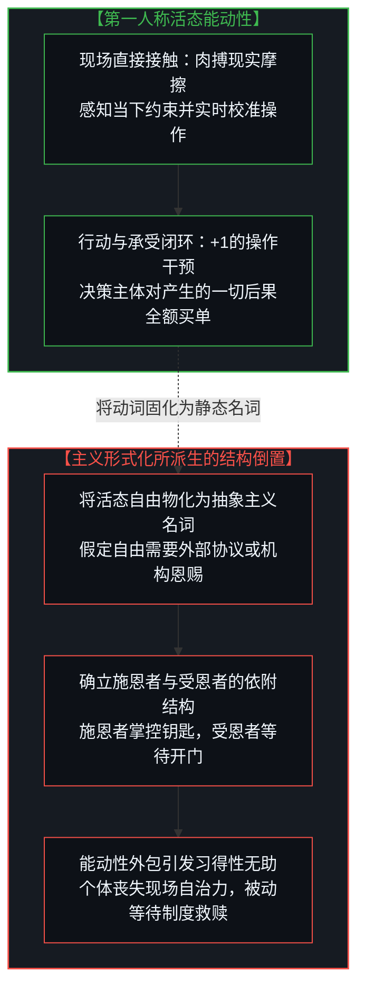
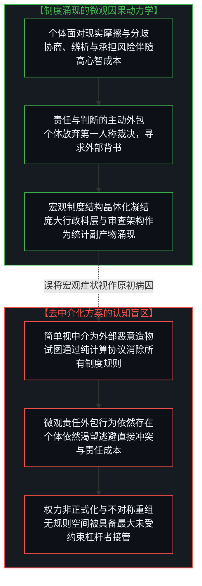
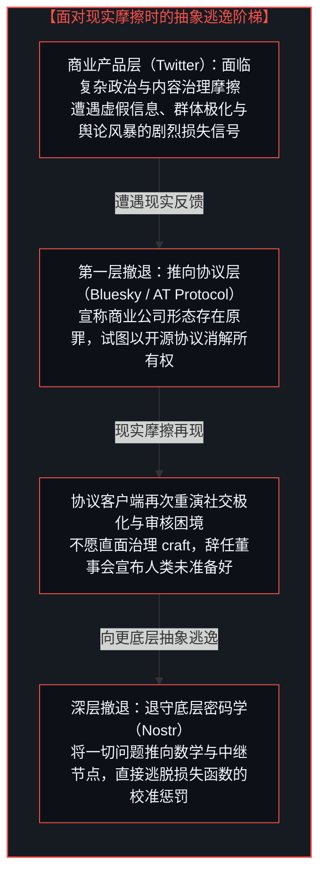
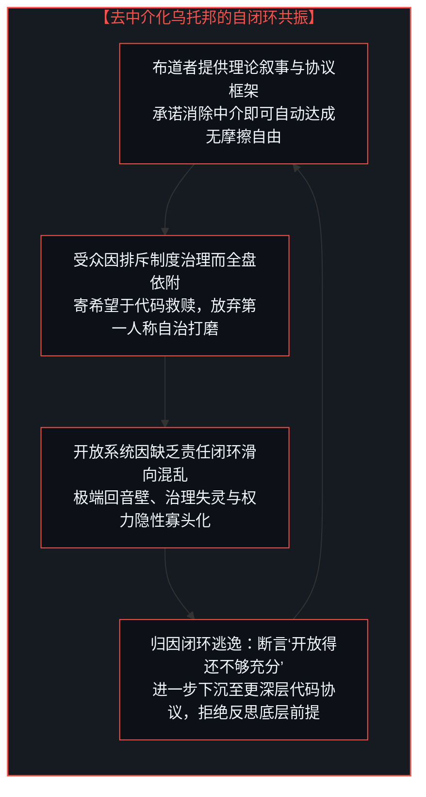
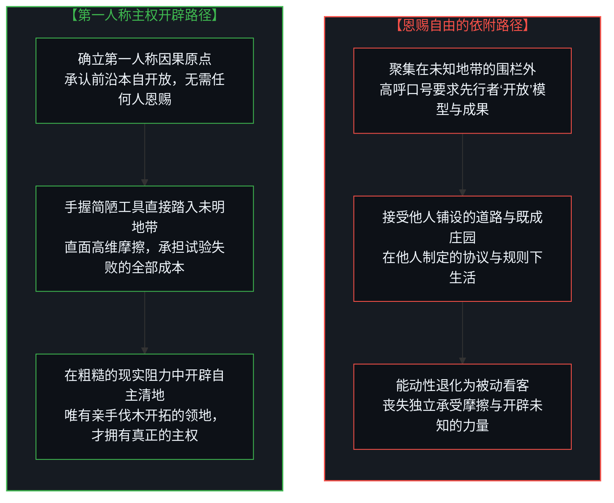

# “非中介化”的幻象 / The Illusion of the Unmediated

*主义的倒置、责任的外包与恩赐自由的解构 / On the Inversion of All "-isms" and the Anatomy of Bestowed Freedom*

解构站在未明地带前要求他人“开放前沿”的认知悖论，剖析一切“主义”将活态能动性固化为静态名词从而引发的结构性倒置，阐明制度并非外在桎梏而是个体外包判断与责任所凝结出的集体宏观现象，借由杰克·多西二十年的四次实践逃逸揭示以层层抽象规避现实损失函数的控制论机制，破除“消除中介即获自由”的乌托邦迷思，确立唯有第一人称直面物理与社会摩擦的主权开辟才是自主自由的唯一起源。当推特（Twitter）联合创始人杰克·多西（Jack Dorsey）近期发布公开宣言，呼吁前沿人工智能研发机构应当立即向公众“开放”（Open）其前沿模型与核心成果时，这篇宣言迅速在科技舆论界引发了惯常的立场站队：一方将其赞颂为倡导开源民主化、打破寡头垄断的英雄式宣言；另一方则将其视作缺乏商业现实感、甚至对前沿安全风险缺乏敬畏的情怀抗辩。

然而，这两种针锋相对的流行反应，都忽略了这一索求本身所包含的深层认识论悖论。站在一片刚刚展开的高维探索地带面前，要求那些付出巨大资源勘探、清理并确立坐标的开拓者必须向所有人“开放”前沿，这种诉求本身暴露出了对“前沿”这一概念范畴的认知错位。所谓前沿，并非一座由恶意守门人紧锁大门的私家植物园；前沿在定义上是一片充满未知、高熵且充满险阻的未勘测领域，在那里的每一次路径探索，都伴随着昂贵的计算损耗、物理摩擦与不可预知的心智试错成本。

前沿在定义上永远是开放的。如果一个人必须站在围栏外，要求先行者为自己打开大门，这便已经坦白了自身处于追随者的被动地位——既缺乏直接审视未明地形的感知敏锐度，也无力承担直接肉搏现实的试错代价。更为关键的是：如果一片未知地带是由他人负责排雷、铺平道路并打包赠予你的，那么它便不再是原始的前沿，而是一座早已由他人划定好生活规范与游戏规则的既成庄园。要求“被开放的前沿”，并非勇敢的探险行动，而是人类思想史上反复上演的结构性幻觉：人们误以为自由是一种可以由外部神明或宗主自上而下“恩赐”的静态资产，而遗忘了自由唯有在个体第一人称直接承受现实摩擦的肉搏中，才能作为一种活态能力被开辟出来。

Deconstructing the cognitive paradox of demanding that others "open the frontier", dissecting the structural inversion whereby formal "-isms" reify living agency into static nouns, demonstrating that institutions are not arbitrary external shackles but the crystallized macroscopic consequences of individuals offloading judgment and responsibility, unveiling the cybernetic mechanism of retreating through layers of abstraction to evade reality's loss function across Jack Dorsey's twenty-year trajectory, dispelling the utopian myth that removing mediation equals freedom, and establishing that first-person direct engagement with physical and social friction remains the sole origin of sovereign freedom. When Jack Dorsey recently issued his manifesto calling for frontier artificial intelligence to be "opened", the statement was rapidly categorized through Silicon Valley's customary ideological filters: either celebrated as a heroic rallying cry for open-source democratization against corporate oligarchs, or dismissed as an unrealistic challenge detached from commercial realities and safety imperatives.

Yet both conventional reactions overlook the profound epistemological paradox embedded in the demand itself. To stand before an unfolding high-dimensional horizon and demand that those who surveyed, cleared, and staked it must "open" it for the public reveals a fundamental confusion regarding what a frontier actually is. A frontier is not a gated botanical garden whose turnstiles are locked by malicious gatekeepers. It is an uncharted, high-entropy zone where pathfinding is inherently expensive, perilous, and fraught with trial and error.

The frontier is, by definition, always open. If an observer must stand outside the perimeter and demand that others unlock it, they have already confessed their status as a passive follower—lacking both the perceptual resolution to survey the terrain and the sovereign willingness to bear the friction of direct exploration. More decisively: if a territory is surveyed, paved, and handed to you on a silver platter by someone else, it ceases to be a frontier; it becomes an established estate whose terms of habitation, structural bounds, and cultural norms have already been determined. Demanding an "opened frontier" is not an act of exploration. It is the recurring structural delusion of human history: the belief that freedom is a static endowment bestowed from above, rather than a living capacity forged through direct contact with reality's friction.

---

## 一、 “主义”的结构性倒置与能动性的外移 / 1. The Inversion of the "-ism" and the Displacement of Agency

纵观人类思想史，几乎每一个以“主义”（-ism）为结尾的思想运动——从早期的集体主义、社会主义，到启蒙时期的理性主义，再到当代的个人主义、自由意志主义乃至开源主义——最终都会在实践演进中异化为其创立初衷的镜像反面。

这种异化并非因为创立者心怀叵测，也不是因为追随者缺乏诚意。它的必然发生，源于人类在将一种活态的心智实践形式化为抽象“主义”时，所犯下的范畴错位：**它通过假定自由是一种必须被外部体系所赋予的客观状态，悄然将原本属于行动者的能动性向外剥离。**

一旦自由被物化为一种意识形态或客观制度，它便不再是一个当下鲜活的二元动作动词——**审视、航行、劳作、治理与承受后果**——而是坍缩为一个凝固的名词：一项法定权利、一种开源协议、一组开源权重，或是一张由机构发放的免责牌照。正如在 [数字火箭、同行审查与因果闭环的稀释](../the-dilution-of-the-causal-loop-and-the-misallocation-of-agency/) 与 [框架的倒置与驾驶位的主权非对称](../the-inversion-of-the-harness-and-the-driver-seat-asymmetry/) 中所指出的，人造物本是人类行动留下的历史残差，并不具备自主的能动性；然而，当人们将行动的权杖外包给某种抽象系统时，便在认知底层确立了一套等级依附结构：一方是掌握大门钥匙的“施恩者”（先知、协议设计师、亿万富翁赞助人或监管机构）；另一方则是聚集在围栏外等待被“解放”的“受恩者”。



即便是声称将个体主权置于至高地位的自由意志主义，一旦将其诉求寄托于某种“完美的加密协议”或“国家的消亡”时，也同样陷入了这一陷阱。个体不再聚焦于日常生活中具体的自我求证、社区协同与技能打磨，而是转而期待一种抽象的算力狂想——幻想某种代码架构能够在某一天降临，自动免除人类自我治理、化解冲突与直面责任的沉重负担。

通过将能动性预设为一种有待接收的馈赠，而非一种必须在抗阻中持续锻炼的肌肉，这类意识形态在其宣称解放个体的瞬间，已经在结构上剥夺了个体的自主性。

Every ideological movement terminating in "-ism"—from collectivism and socialism to classical rationalism, individualism, libertarianism, and open-sourcism—invariably metastasizes into the operational opposite of its founding aspiration.

This structural inversion does not occur because founders harbored deceitful motives or followers lacked conviction. It emerges inevitably because formalizing a living ethos into an "-ism" commits a fatal category error: **it relocates agency away from the living actor by presuming that freedom is an external condition to be granted.**

The moment freedom is reified into an ideology, it ceases to be an active, living verb—*discerning, navigating, laboring, governing, and bearing consequence*—and congeals into a static noun: a property right, an open-source license, a cryptographic protocol specification, or an institutional dispensation. As demonstrated in [Digital Rockets, Peer Review, and the Dilution of the Causal Loop](../the-dilution-of-the-causal-loop-and-the-misallocation-of-agency/) and [The Inversion of the Harness and the Sovereignty of the Driver's Seat](../the-inversion-of-the-harness-and-the-driver-seat-asymmetry/), artifacts are merely inert historical residue left by human choice; they possess zero autonomous agency. Yet when agency is outsourced to an abstract system, it establishes a covert dependency hierarchy: the Dispenser (the prophet, the protocol designer, the billionaire patron, or the regulatory state) holding the keys, and the Beneficiary waiting outside the gate for systemic liberation.

Even libertarianism, which purports to venerate individual sovereignty above all else, falls into this trap the moment it insists that sovereignty is an emergent guarantee of the "correct protocol" or the mere liquidation of state apparatuses. The individual is relieved of the arduous discipline of local self-reliance, physical competence, and civic arbitration, encouraged instead to await an abstract technological rapture where cryptographic code magically absolves humanity of the burden of self-governance.

By presuming agency to be an endowment to be received rather than an operational discipline exercised against friction, ideology dispossesses the actor at the exact moment it claims to liberate them.

---

## 二、 协同即计算的迷思与制度的因果原点 / 2. The Myth of "Coordination as Computation" and the Causal Origin of Institutions

在杰克·多西的公共构想与工程叙事中，贯穿着一个具有代表性的思维模型：

`协同 ≡ 计算（Coordination ≡ Computation）`

在这一世界观中，人类现实互动中的摩擦——政治博弈、群体纷争、科层制度以及妥协的泥泞——被视作一种外在的、可被数学消除的污染。设计者预设，在社会种种复杂的规训结构之下，潜藏着一种不受干扰、能够自动达成理想均衡的纯真天性，只要通过优雅的算法消除中心化的审核者，群体协同就能如分布式计算那样顺畅运转。

这种构想在认识论上严重误解了制度的因果生成机制。正如在 [“物理学才是定律”的障眼法](../the-sleight-of-hand-in-physics-is-the-law-and-the-friction-of-reality/) 与 [数字火箭、同行审查与因果闭环的稀释](../the-dilution-of-the-causal-loop-and-the-misallocation-of-agency/) 中所确立的：**制度断非外在于人、凌驾于自然之上的客观因果源头；制度本身不过是大量个体外包自身判断与责任时，所涌现出的集体宏观现象。**

自由的受损，从来不是始于某项强加的制度法令；它的因果起点在于：个体为了逃避第一人称直面现实求证的痛感、协商的繁琐与承担风险的代价，主动将判断权与责任向外转嫁。制度不过是这种责任外包行为在宏观统计层面凝结出的晶体。当个体拒绝承担相互辨析与自我约束的责任时，他们就会将裁决权向上让渡，于是一个庞大的管理机构便必然在客观上应运而生，以维持基础的秩序。



将制度这一宏观副产物误认作原初病因，试图仅凭几行代码来绕过它，必然导致灾难性的次生后果。它混淆了消极的无约束状态与积极的自律承重能力。现实中的未治理空间从来不是真空；当你在未消除个体责任外包的前提下贸然拆除显性的规约，权力并没有蒸发，它仅仅是从**显性、可问责且可申诉的状态**，蜕变为了**隐性、不对称且不透明的原始丛林法则**——立刻被那些拥有最大未经调谐杠杆的个体或算法节点所占领。自由的侵蚀从来不是制度自上而下的掠夺，而是每一个体的心智在日常中逃避核验与试错的微观选择的统计凝结。正如在[抉择本身并不沉重](../choice-itself-has-no-inherent-weight/)中所揭示的，状态跃迁本身并不附带内在阻力；个体之所以幻想借助无中介的协议工具一步登天，恰恰是妄图规避渐进试错与微步校准的具身体验。这正是[任务的移交与后果的不可让渡](../the-delegation-of-the-task-and-the-inalienability-of-consequences/)所剖析的因果法则：任务与计算可以移交，但承担现实摩擦的责任永远不可转让。

Beneath Jack Dorsey’s public trajectory lies an elegant and pervasive mental model:

`Coordination ≡ Computation`

In this worldview, the friction inherent to human interaction—political contestation, tribal antagonism, institutional hierarchy, and the messy work of compromise—is categorized as an extrinsic bug to be eliminated by mathematical architecture. The foundational assumption posits that beneath social scaffolding lies an unblemished, self-equilibrating human nature capable of frictionless synchronization once centralized intermediaries are dissolved.

This perspective misdiagnoses what institutions actually are. As established in [The Sleight of Hand in "Physics Is the Law"](../the-sleight-of-hand-in-physics-is-the-law-and-the-friction-of-reality/) and [Digital Rockets, Peer Review, and the Dilution of the Causal Loop](../the-dilution-of-the-causal-loop-and-the-misallocation-of-agency/): **institutions are not arbitrary causal primitives imposed from above; they are the collective macroscopic symptoms of free individual choices where individuals externalize their own discernment, judgment, and risk.**

The erosion of freedom does not originate from institutional decrees. Its causal genesis lies in the individual mind evading the pain of direct verification, the cognitive cost of mutual negotiation, and the operational risk of personal consequences. Institutions are the crystallized statistical residue of that ongoing abdication. When individuals refuse the arduous discipline of bearing their own outcomes, they delegate arbitration upward—and an institutional apparatus congeals to administer it. As unmasked in [Choice Itself Has No Inherent Weight](../choice-itself-has-no-inherent-weight/), the state transition itself carries zero intrinsic drag; individuals dream of leapfrogging friction via disintermediated protocols precisely because they wish to bypass the modest, daily discipline of gradual cybernetic trial and error. This traces the foundational law established in [The Delegation of the Task and the Inalienability of Consequences](../the-delegation-of-the-task-and-the-inalienability-of-consequences/): computation and execution may be delegated to artifacts, but the sovereignty of bearing consequences remains strictly inalienable.

Treating these collective symptoms as mere computational inefficiencies to be bypassed through code produces severe secondary failures. It conflates the absence of explicit boundaries with positive capacity. An unmanaged arena is never neutral. When explicit, contestable rules are dismantled without addressing the underlying delegation of responsibility, power does not vanish; it mutates from **formal and accountable** into **informal, asymmetric, and opaque**—immediately colonized by whichever nodes possess the greatest unmoderated leverage.

---

## 三、 规避现实损失函数的四次逃逸 / 3. The Four Iterations of Evading Reality's Loss Function

回顾杰克·多西二十年的产品探索与创业轨迹，可以清晰观察到一个恒定的控制论行为模式：他并不是根据现实世界的反馈来修正自己的理论假设，而是不断通过调整实践形态，来庇护其理论免受现实反馈的检验。

```
【产品层】 推特（Twitter）：割裂因果反馈回路，理论清高压倒现实后果
   │
   ▼
【协议层】 Bluesky 与 Nostr：以更深的抽象逃避现实损失函数的惩罚
   │
   ▼
【实体层】 Square 蜕变为 Block：自现实真实痛点撤退，将资本耗散于虚妄议题
   │
   ▼
【慈善层】 现金空投（Cash Drops）：“激进信任”作为不愿面对后果的高尚掩护
```

在控制论与机器学习的优化过程中，一个智能体唯有在直接承受损失函数（Loss Function）带来的惩罚信号时，其内在模型才能够发生有效的收敛与进化。然而，多西的实践路径却呈现出一种系统性的“损失函数逃逸术”：每当其构建的系统与复杂的人性摩擦相撞并产生剧烈的负反馈时，他所选择的应对方式不是留在驾驶位上校准参数并承担后果，而是向更底层的抽象层级撤退：

`商业产品（Product） → 开放平台（Platform） → 分布式协议（Protocol） → 底层密码学（Raw Cryptography / Nostr）`



### 1. 推特：割裂因果反馈回路

在推特时期，多西将平台构想为类似公共事业的市政广场——一个无须内容裁决、所有人都能自由发声的理论乌托邦。

然而，当平台不可避免地演变为地缘政治博弈与文化撕裂的交火阵地时，引发危机的根源并非中立与干预的技术路线之争，而是构建者自身**割裂了因果反馈回路**。多西倾心于去中心化理念的空灵与高尚，却不愿扎根于复杂的现场运营去承担推荐算法与网络暴力带来的次生后果。

当最高架构师漂浮于现实之上、拒绝作为责任主体为系统后果买单时，原本应当由主权心智承担的决断空间并没有消失，而是被内部缺乏民意基础的官僚审查委员会、临时成立的信任安全小组以及来自外部势力的政治干预所迅速填补。推特后期的深层瘫痪，正是一个崇尚理论纯洁性而逃避现场问责的架构师所必然招致的因果结晶。

### 2. Bluesky 与 Nostr：以更深的抽象逃避损失函数

当推特的现实泥潭令其疲惫不堪时，多西并未从中领悟到群体协作所必需的艰苦技艺。相反，他将问题归咎于“推特是一家商业公司”这一形式壳体，并试图通过创造 Bluesky（AT Protocol）来寻求抽象解脱：*“如果把推特变成一个开放协议，就没有人能拥有它了。”*

然而，Bluesky 在深层因果上只是**同一套脱离现实摩擦的思维模型在免责真空中的再次重演**。在机器学习中，逃避损失函数就意味着模型无法更新。每当系统接触到真实的人类摩擦并产生系统性代价时，多西不是去改进模型，而是将战场下移一层。

当 Bluesky 的官方客户端不可避免地再次重现封闭社交群体的极化现象与人工封禁争议时，多西没有选择留下来校准规则，而是选择辞去董事会职务，感叹“人类重蹈了推特的覆辙”，随即抽身离去，转而将全部热情投入到了更底层的密码学网络 Nostr 之中。通过持续向技术栈的底层撤退，设计者成功确保了自己的空灵信念永远不会被现实的损失函数所证伪。

### 3. Square 蜕变为 Block：自现实真实痛点撤退

Square 是多西职业生涯中极具实践价值的商业创造。它的成立与崛起，源于直面并解决了**极其明确且具象的现实生活痛点**：通过一个小巧的音频插孔读卡器，让普通手工艺人、街头餐车小贩能够随时随地接受信用卡刷卡。这一阶段的创造根植于真实的物质世界，充满对生产实践的深刻共情，并切实消除了经济生活中的物理阻力。

然而，在通过解决现实问题积累了海量资本与声誉之后，这家企业却开始调转方向，将精力投入到了**制造并追逐脱离现实摩擦的虚妄议题之中**。

将公司高调更名为 Block，把核心工程资源大量耗散于所谓的“Web5”去中心化身份框架，并将巨额资本用于自研比特币挖矿芯片——这些举措清晰地标志着企业从务实、严谨的商业创造，退化为了意识形态的自我陶醉。系统丢弃了曾赋予其生命力的具体实践，转而在缺乏真实市场需求的玄学构想中寻找慰藉。

### 4. 现金空投：“激进信任”作为不愿面对后果的高尚掩护

同样的反馈断裂，也贯穿于其慈善实践之中。通过社交网络上的 `#SuperCashAppFriday` 现金派发活动，以及其建立的数十亿美元规模的慈善基金，多西在“激进信任”（Radical Trust）的名义下，将巨额资金无条件地向大众发放。

在实践机制上，**所谓的“激进信任”，无非是不愿面对后果、拒绝进行追踪评估的高尚托辞。**

将资本随机洒向社交网络的算法信息流中，既不评估资金是否真正培育了个体的生产技能，也不过问受助者是否建立了自主造血能力，这在机制上切断了因果之间的检验链条。这种操作让捐赠者能够沉浸在超然无为的道德崇高感中，却巧妙规避了考察干预是否真正带来积极改变的沉重工作。它没有解构依附关系，反而在数字化形态下加固了一种新型依赖：受助者依然被动地仰望天降甘霖，等待着亿万富翁的下一轮指尖恩赐。

Across twenty years of entrepreneurial leadership, Dorsey did not calibrate his thesis against operational reality; he repeatedly restructured his endeavors to shield his thesis from reality's corrective feedback.

In cybernetics and machine learning optimization, an agent only updates its internal representations when penalized by an active **loss function**. In Dorsey's trajectory, whenever an engineered structure collides with the friction of human nature and incurs steep systemic loss, the response is never to remain in the driver's seat and recalibrate parameters; rather, it is to **evade the loss function** by retreating into deeper strata of abstraction:

`Commercial Product → Open Platform → Distributed Protocol → Raw Cryptography (Nostr)`

#### 1. Twitter: Severing the Causal Feedback Loop
At Twitter, Dorsey conceived of the platform as a utility-grade municipal square—a global arena where speech could unfold free from centralized curation.

When the platform inevitably became a battleground for geopolitical warfare, tribal polarization, and informational distortion, the resulting crisis was not a philosophical dispute over neutrality versus moderation. It was an acute breakdown caused by **severing the causal feedback loop**. Dorsey favored protocol theories over the empirical friction of operational reality. Rather than accepting causal accountability for the downstream systemic effects of the platform's algorithmic amplification, he hovered above them.

Without an explicit, accountable sovereign center willing to own outcomes, the vacuum was inevitably occupied by unaccountable internal safety committees, ad-hoc tribunals, and external regulatory pressure. The platform's eventual operational paralysis was the direct consequence of an architect who prized theoretical purity over operational accountability.

#### 2. Bluesky & Nostr: Evading the Loss Function
When Twitter proved hopelessly tangled, Dorsey did not engage the arduous craft of human coordination. Instead, he attributed the failure to an organizational shell: *"The flaw was that Twitter was a corporate entity. If we reconstruct it as an open protocol (AT Protocol / Bluesky), no single node can own it."*

Yet Bluesky was simply a **rerun of the identical frictionless model, insulated from reality's loss function**. In cybernetics, evading the loss function guarantees zero learning. Whenever an instantiation meets human friction, Dorsey retreats one layer deeper down the stack.

When the flagship Bluesky application inevitably reproduced tribal enclaves and moderation controversies, Dorsey did not iterate on governance. Instead, he departed the board, declared that humanity had repeated its errors, and fled into Nostr. By continuously retreating down the stack, the designer ensures that his idealized theory can never be falsified by reality's telemetry.

#### 3. Square to Block: Retreating from Tangible Friction
Square was Dorsey's authentic engineering triumph. It originated from **solving acute, physical, material friction**: enabling artisan vendors and food-truck operators to process card payments through a simple audio-jack dongle. It was grounded in material reality, direct empathy with producers, and tangible friction reduction.

Yet having accumulated immense capital by solving genuine real-world problems, the organization subsequently diverted focus toward **inventing and pursuing phantom problems completely detached from demand**.

Rebranding the enterprise as Block, funneling core engineering into "Web5" decentralized identity frameworks, and pouring capital into custom Bitcoin mining silicon signaled an abandonment of humble, disciplined economic utility in favor of ideological indulgence. The firm discarded the direct grounding that made it vital, chasing speculative solutions to non-existent operational problems.

#### 4. The Philanthropic Bypass: "Radical Trust" as Disregard for Consequences
The same broken cybernetic loop characterizes his philanthropic endeavors. Through `#SuperCashAppFriday` and his multi-billion-dollar endowment, capital is dispersed under the banner of "radical trust"—distributing cash without strings or operational conditions.

In operational reality, **"radical trust" functions as a noble-sounding label for disregarding consequences.**

Dropping capital into algorithmic feeds without evaluating downstream economic outcomes, building operational capacity, or fostering productive mastery severs cause from effect. It allows the donor to inhabit the spiritual glow of non-attachment while evading the unglamorous responsibility of observing whether interventions genuinely cultivate human independence. It does not dismantle dependency; it modernizes digital breadlines, leaving recipients expectant of the next billionaire dispensation.

---

## 四、 耦合共振圈：拒绝摩擦的集体闭环 / 4. The Coupled Resonance Loop: The Collective Allergy to Friction

将这一长达二十年的轨迹仅仅解读为一个富有魅力的科技精英对大众的误导，同样是对深层因果机制的误判。

这实际上是一个**高维耦合共振圈（Coupled Resonance Loop）**：

| 系统节点 | 承担的功能角色 | 认知盲区与自我封闭 |
| :--- | :--- | :--- |
| **技术布道者（架构师）** | 提供海量资本、开源代码与“去中介化即获自由”的浪漫叙事。 | 将自身的财富绝缘保护，误认作其理论模型的客观正确性。 |
| **依附型受众（围观者）** | 提供精神崇拜、声量共振与逃离现实治理制度的强烈心理需求。 | 将消除外部显性把关人，误认为自身获得了独立生存的主权能力。 |

受众之所以长久地追随这类去中心化叙事，并非因为他们受骗上当，而是因为他们与布道者共享着同一种认知倾向：**对人类群体治理所必需的迟缓、繁琐与充满摩擦的协调工作怀有本能的排斥。**

人们同样渴望生活在一个算法能够自动替代裁判、代码能够自动替代法治、财富能够通过点击直接流入电子钱包，而无须经过残酷、艰难且充满汗水的生产协作的世界。



因为双方共享着一个未经检验的前提——即“中介本身即是万恶之源”——整个系统便丧失了诊断自身失败的能力。

当一个宣称开放的系统不可避免地滑向混乱，或者一个缺乏显性规则的空间沦为极化回音壁时，耦合系统断然不会反思其核心前提是否成立；相反，他们得出的结论永远是：**“这个空间开放得还不够充分。”** 治理失败的药方变成了更激进的去中心化；协议层面的失灵被归咎于协议嵌套得不够深邃。

这种共振闭环之所以能够长期维持，关键原因在于架构师拥有足够的财富壁垒来支撑其反复试错。多西坐拥数百亿美元的财富缓冲与自我宽慰的极简修行哲学，使其几乎不需要在其试验失败的后果中承受生存惩罚。他可以在一个社交平台化为废墟后从容抽身，在私人岛屿静修冥想，然后带着纯净的面容重新现身，向世界宣告下一场未受污染的伟大前沿。

Interpreting this twenty-year trajectory merely as a charismatic billionaire misleading an innocent public represents a misreading of the causal dynamics.

This phenomenon is a **coupled resonance loop**:

| Node | Functional Role | Cognitive Blindspot |
| :--- | :--- | :--- |
| **The Architect** | Supplies capital, software scaffolding, and the romantic mythology of frictionless liberation. | Confuses personal financial insulation with the empirical validity of his conceptual model. |
| **The Audience** | Supplies ideological validation, cultural momentum, and demand for an escape from institutional discipline. | Confuses the dismantling of formal gatekeepers with the acquisition of sovereign capability. |

The public does not gravitate toward these decentralized narratives because they are duped; they follow them because they harbor the exact same cognitive aversion to the slow, agonizing, imperfect craft of institutional governance.

Society craves an immaculate domain where an algorithm replaces human arbiters, where cryptographic protocols replace judicial contestation, and where liquidity is disbursed directly into a digital wallet, bypassing the grueling, competitive demands of material production.

Because both parties share the unexamined axiom that *mediation itself is the adversary*, the coupled system is structurally incapable of diagnosing its systemic failures.

When an open ecosystem descends into factional chaos, or an unmoderated arena degrades into an echo chamber, the coupled loop does not question its premise. Instead, it concludes that **the space was not opened enough.** The cure for failed decentralization is prescribed as further decentralization; the breakdown of an ineffective protocol is met with an even deeper cryptographic abstraction.

This feedback loop remains resilient precisely because the architect possesses the financial capital to be wrong indefinitely. Insulated by billions of dollars and a contemplative ascetic aesthetic, Dorsey never has to inhabit the material consequences of his broken experiments. He can walk away from operational fallout, retreat into meditation, and re-emerge with an unblemished conscience to proclaim the next pristine horizon.

---

## 五、 主权的开辟：自由从来不是被恩赐的空地 / 5. The Sovereign Clearing: Freedom Is Never an Endowment

“开放”意识形态的深层悲剧在于：它表面上许诺给人类最宽广的解放，却在暗中将所有信奉者驯化为深度无助的看客。

当进步被框定为寡头与实验室是否向社会“开放”其模型权重、开源代码与财富存量时，拥有独立意志的人类主体便在不知不觉中退化成了守候在围栏外面的等待者。它悄然教会了人们坐等道路被他人修葺平整，坐等大门被他人打开，坐等工具被他人无偿赠予。

然而，真正的人类主权遵循着截然相反的因果法则：

* 它从不要求走在前方的侦察员回过头来交出自己的指南针；
* 它从不等待大公司开源模型权重才开始向认知的深水区探索；
* 它从不将权威身影的消失误认作自由能力的获得；
* 它清醒地知道，制度的缺陷无法通过逃入更深的数学抽象来抹平，现实的摩擦必须在具体的建造中被肉身化解。



前沿之所谓开放，断非因为有某位救世主为你打开了门锁，而是因为没有任何人能够锁住未知的宇宙。前沿唯独属于那些在没有铺设道路的地形中昂首挺进、愿意承受攀登的窒息与肉体疲惫、并深刻懂得自由内涵的行动者。

自由从来不是某位架构师在图纸上为你预留的一处静谧空地；自由是在粗粝的现实阻力中，用你自己的双手、心智与全部责任，亲手砍伐荆棘而开辟出的一片属于你自己的澄明空间。

The tragedy of the "Open" ideology is that it promises emancipation while quietly conditioning its adherents into structural helplessness.

By framing progress as something contingent on whether oligarchs and frontier institutions choose to "open" their code, weights, and balance sheets, sovereign human actors are transformed into passive spectators. It conditions people to wait for the road to be graded, the gate to be unlocked, and the instruments to be bestowed.

True sovereign agency operates on the opposite cybernetic principle:

* It does not demand that the scout ahead turn back to surrender their compass;
* It does not wait for an open-source weights release to begin mapping the high-dimensional frontier of cognition;
* It does not mistake the mere absence of an explicit authority figure for the presence of living capability;
* It understands that institutional failures cannot be resolved by retreating into cryptographic abstraction, and that reality's friction must be engaged through concrete construction.

The frontier is open not because someone unlocked it, but because no entity can lock the unknown. It belongs exclusively to those who step forward without a paved road, who willingly absorb the exhaustion of the climb, and who grasp that freedom is not an empty estate handed down by an architect—it is a clearing carved out of the wilderness with your own hands, your own intellect, and your own full causal accountability.
