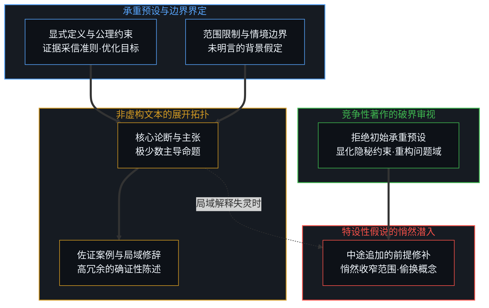
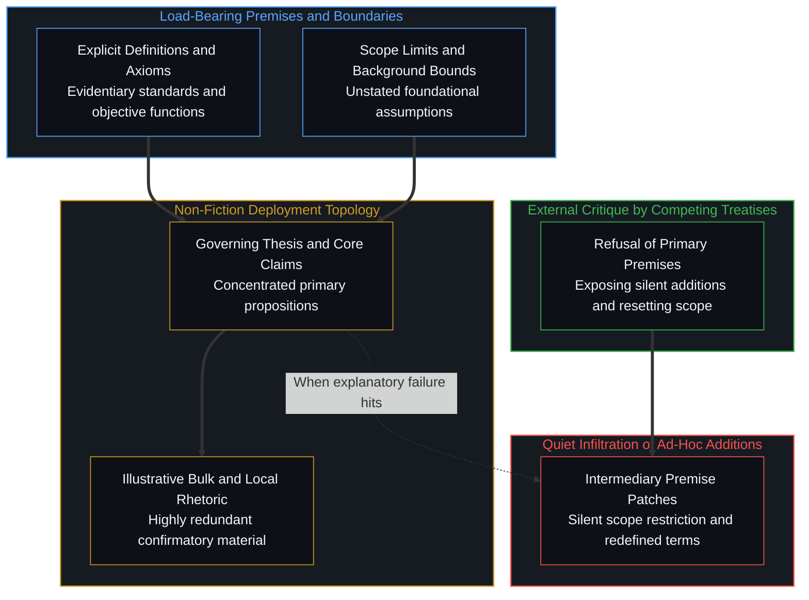
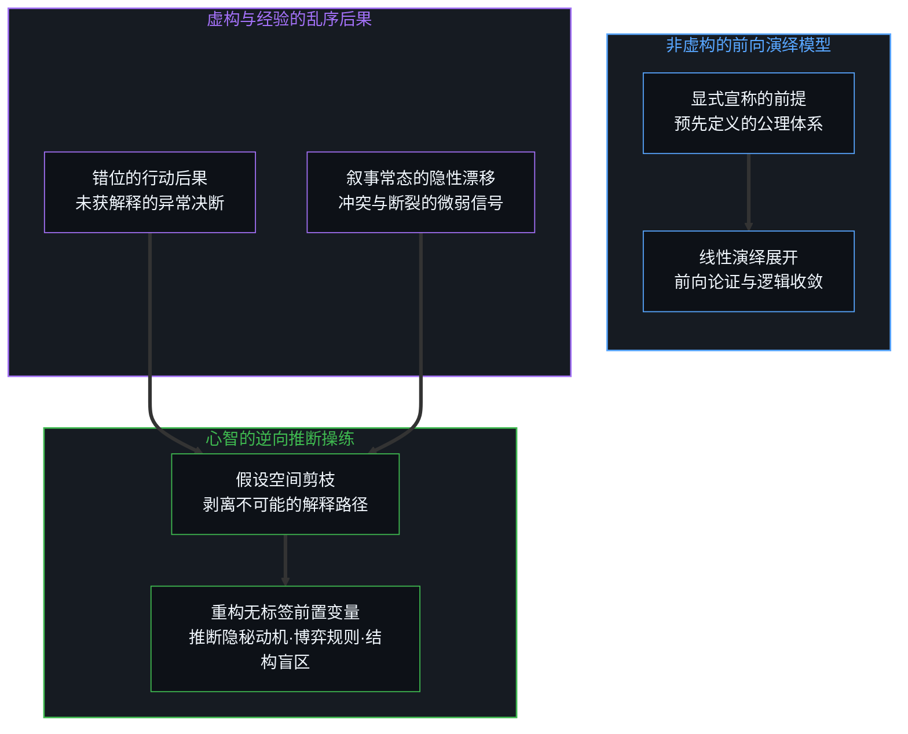
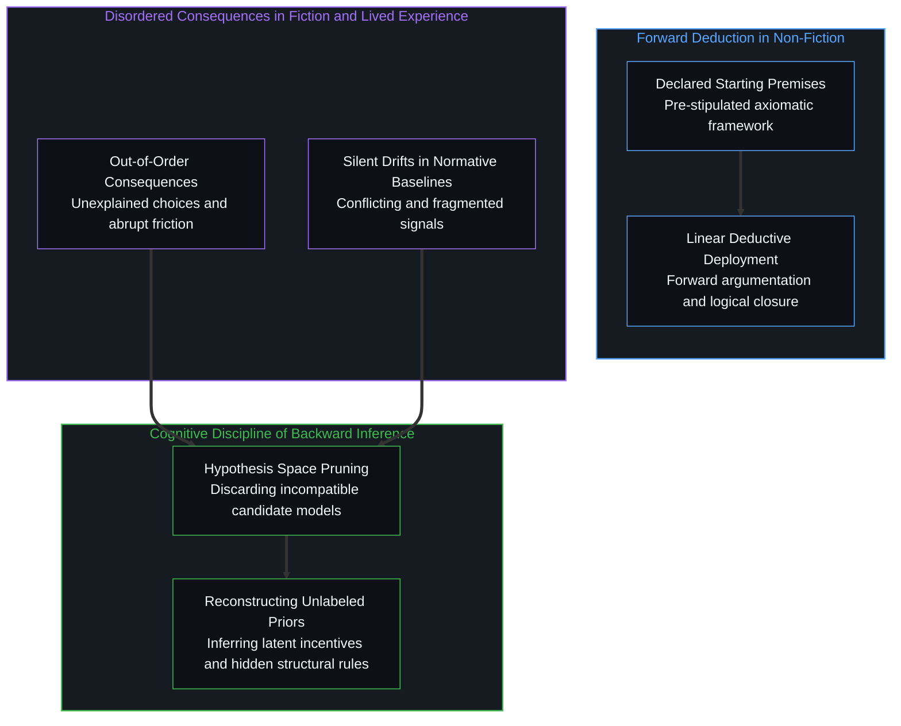
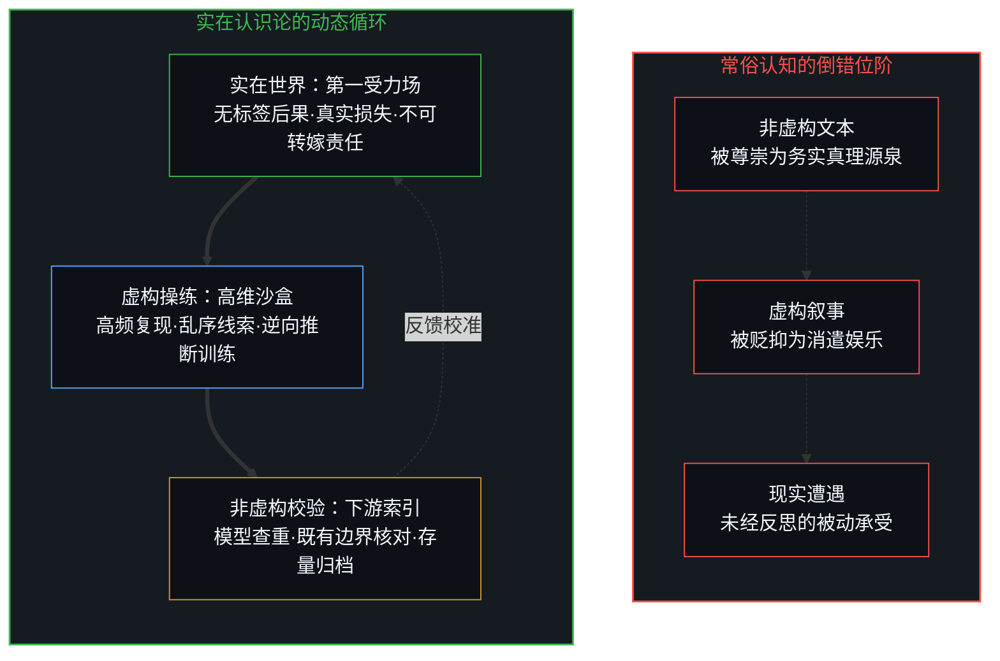
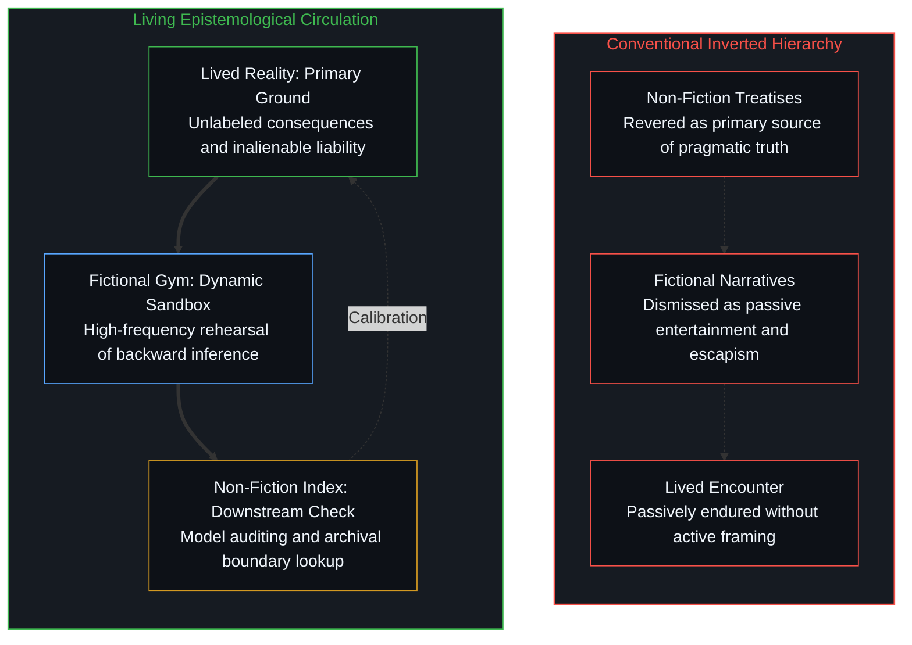

# 阅读的倒错与推断的次序 / The Inversion of Reading and the Order of Inference

*非虚构的前提依赖与虚构中乱序后果的逆向重构 / Premise dependencies in non-fiction and the backward reconstruction of disordered consequences in fiction*

信息的实用困境从来不是体量庞大，而是主动筛选透镜的松懈。人类视觉机制早已展示了这一原理：双眼每秒接收近乎无限的光子洪流，然而认知过载只发生在主动注意力的滤波机能涣散之时；相同的认知约束支配着文本阅读。绝大多数现代非虚构著作的构造逻辑，仅在于确立一到两个核心主张，并为其铺设延展性的佐证脚手架。一旦透彻标定了统领全书的初始预设，后续数百页的案例罗列、同义复述与局域限定极少产生真实的边际增益。反观虚构叙事与实在经验，其运作法则恰恰相反：前提未曾被预先宣称，后果伴随时间乱序降临。心智在小说与日常生存中被迫操练的，正是在不完整且相互冲突的微弱信号中逆向重构未标记前置变量的能力。由此，流行文化将非虚构奉为务实宝典、将虚构斥为闲暇消遣的排序被深刻颠倒。

The practical challenge of information has never been its sheer volume, but the laxity of active cognitive filtration. Human vision already demonstrates this principle: the eyes receive an unceasing flood of electromagnetic data, yet cognitive overload occurs only when active attentional filtering lapses. An identical constraint governs reading. Most modern non-fiction is engineered to establish one or two central claims and surround them with extensive scaffolding. Once an author's governing premises are clearly identified, the subsequent pages of selective evidence, restatements, and local qualifications rarely yield marginal epistemic returns. Fiction and lived experience operate under the reverse constraint: premises are never declared in advance; consequences arrive out of order. What the mind must practice across narrative art and daily survival is the demanding discipline of backward inference—reconstructing unlabeled operating priors from partial, conflicting signals. Consequently, the conventional ranking that crowns non-fiction as practical and dismisses fiction as trivial distraction is overturned.

## 一、 视觉滤波与文本的依赖图谱 / 1. Visual Filtering and the Dependency Maps of Texts

当我们审视公共网络中关于信息过载的普遍悲叹时，容易发现一种对认知机制的误解：人们倾向于将注意力匮乏归咎于外部涌现的庞大字节，试图通过机械地限制关注数量来恢复心智的安宁。然而，正如眼睛注视纷繁世界时依靠中央凹与皮层滤波自如穿梭于海量光学信号之中，阅读的效率同样取决于心智主动提炼依赖关系的能力。非虚构书籍的篇幅膨胀，多半源自出版格式对厚度与论证仪式感的工业化要求。作者在导论中圈定术语定义、限定适用范围，并假定行动主体的目标函数；随后的各个章节，无非是调用精心挑选的历史事件、统计图表或个案轶事，在既定轨道内反复确认结论的稳固性。对于具备批判意识的读者而言，在快速浏览并定位这些承重墙预设之后，逐行吞咽后续的确证性材料几乎无法改变已然形成的决策模型。[观察者的隐身与无损传递的妄念](../the-invisible-observer-and-the-delusion-of-lossless-transmission/)在另一种负载下描摹了同一几何：抹杀观察者的无损神话抽空理论底座，接纳损耗方能达成最高保真。

When examining the widespread lament over information overload across contemporary discourse, one quickly uncovers a fundamental misunderstanding of cognitive architecture: observers habitually attribute attention scarcity to the sheer volume of external data, attempting to restore clarity by mechanically restricting their inputs. Yet just as human vision navigates dense optical environments by relying on foveal focus and cortical filtration to parse infinite photon streams without friction, reading efficiency depends upon mind's capacity to extract structural dependencies. The sheer page count of most non-fiction stems from commercial conventions demanding physical heft and exhaustive rhetorical ceremony. An author defines key terms, marks scope boundaries, and stipulates the agent's objective function in the opening chapters; the remaining text merely marshals curated historical anecdotes, statistical charts, and case studies to demonstrate consistency along a fixed rail. For an attentive reader, once those load-bearing premises are identified, consuming the subsequent confirmatory material line by line yields almost zero delta in actionable judgment. [The Invisible Observer and the Delusion of Lossless Transmission](../the-invisible-observer-and-the-delusion-of-lossless-transmission/) traces this geometry under a different load: Erasing the observer hollows theory; embracing loss yields peak fidelity.

非虚构著作之间的深刻分歧，极少源于内部推演链条的形式逻辑漏洞，而几乎全部根植于初始假设的不可调和。一旦作者确立了关于何者可算作有效证据、何种变量保持恒定的初始边界，其论证过程在自身封闭的语境内部展现出高度的自洽性。因此，若要检验一本书的真实边界，最有效的反驳力量从来不是在同构的论述内部寻找细枝末节的笔误，而是引入另一本从起点便拒绝这些核心假设的竞争性著作。将原书宣称的前提与其最终要求支撑的宏大结论进行结构对照，能清晰暴露出作者中途悄然塞入的特设性假说：一个临时补充的局域限制、一段被偷换概念的操作性定义，或是一个未经检验的附加条件。竞争性文本之所以能比精细精读更敏锐地暴露这些漏洞，是因为持相反观点的研究者天然具备强烈的动机，精准锁定那堵让推演发生隐秘位移的暗墙。

Deep disagreements between non-fiction treatises rarely stem from formal logical fallacies within the deductive chain; they are rooted in the irreconcilability of starting assumptions. Once an author fixes initial boundaries concerning what constitutes legitimate evidence and which variables remain held constant, the subsequent argument tends to be internally consistent. Strong objections arrive not from parsing minor errors inside the same framework, but from competing works that refuse the foundational assumptions at the outset. Comparing a book's stated premises against the conclusions it demands reveals its ad-hoc additions: a later restriction slipped into a footnote, a redefined term, or an unstated ceteris-paribus clause doing work the opening framework could not sustain. Competing treatises surface these insertions far more reliably than sustained solitary reading, because an author advancing an alternative outcome possesses direct incentives to pinpoint the exact juncture where the extra assumption entered.

这种阅读范式的确立，要求心智超越两种常见的惯性姿态：既不将文本视作需要全盘接收的权威教条，也不将其视为急于攻讦消解的靶子。崇拜的心态将注意力死死锁在作者修辞的煽动性与生动案例上，而破坏的冲动则使人沉溺于捉摸表面的词句冲突。唯有摆脱这两种情绪的牵引，文本才能还原为一张清晰透明的依赖图谱。真正承重的预设，正是整本书在面对反常扰动时始终不愿放弃的公理基底。心智所需要的精细审视，应当高度克制地聚焦于那些宣告或隐秘执行这些假设的关键段落，检视其是否与作者引用的权威源头保持一致，是否经受得住与[模型永不成第二锋刃](../the-model-never-becomes-a-second-edge/)中揭示的残留模型与活体辨析的摩擦。

Adopting this paradigm requires consciousness to abandon two prevalent modes of intellectual engagement: reverent absorption and reflexive demolition. Reverence glues attention to rhetorical eloquence and compelling anecdotes, while the impulse to refute keeps mind trapped in superficial terminological skirmishes. Dropping both stances turns the text into an explicit map of dependencies. Load-bearing premises stand out as the non-negotiable axioms the author refuses to vary across perturbations. Mind's closer scrutiny can be reserved for the specific passages that state or quietly enforce those premises, testing whether they are coherent, explicit, and able to survive the epistemic friction articulated in [The Model Never Becomes a Second Edge](../the-model-never-becomes-a-second-edge/).

为了直观呈现非虚构文本的依赖拓扑结构以及竞争性著作如何迫使特设性假说显形，我们可以绘制其认知结构图：

To visualize the dependency topology of non-fiction arguments and demonstrate how competing treatises surface ad-hoc premise modifications, consider the following structural schematic:

## 二、 乱序后果与未标记推断的操练 / 2. Disordered Consequences and the Discipline of Unlabeled Inference

虚构文学运行在全然不同的认识论约束之下，因而对心智提出了截然相反的专注要求。一部严肃的小说未曾在第一章预先陈列所有角色的心理偏置、暗流涌动的阶层利益或是悲剧收场的因果闭环。相反，它的真实机制是通过乱序降临的后果逐渐显现的：一个在关键时刻令人费解的回避、一份被刻意隐藏的书信、或是叙事语调在描摹某种荒诞行为时表现出的平静，都会强行约束读者对前情背景的理解。读者无法坐享作者已然梳理清晰的逻辑脚手架，而必须如侦探般穿梭于碎片化的行动后果之间，反向剪枝一切不合逻辑的解释，进而推断出深藏在叙事地表之下的暗涌规则。

Fiction operates under an entirely different epistemological constraint, rewarding an inverted mode of attentional discipline. A serious novel never declares the psychological biases, covert material incentives, or institutional bounds of its characters in an opening thesis statement. Instead, its underlying structure is disclosed through consequences that arrive out of order: an inexplicable avoidance during a routine encounter, a withheld document, or an unsettling narrative calmness while portraying social absurdity. Each consequence retroactively restricts the set of plausible conditions that could have preceded it. The reader cannot passively consume pre-assembled logic; instead, like an investigator moving through fragmented aftermaths, they must continuously prune incompatible hypotheses to infer the latent forces governing the narrative terrain.

这种由乱序后果反推隐秘前提的过程，与生命心智在真实世界中的遭遇形成了深刻的同构。客观实在从不向任何人递交一份标明游戏规则的说明书；事件的发展、环境的震荡与他人的决断总是直接以既成事实的形式撞击心智的感官。正如[硅基神谕与后果的非对称性](../silicon-oracles-and-the-asymmetry-of-consequence/)所剖析的，实在世界拒绝廉价的抽象解释，而是将未标记的因果后果直接抛向主体。在充满摩擦的生存实践中，那些真正支配局面的前提——隐蔽的权力结构、未言明的利益博弈、长期的信誉损耗——永远隐藏在杂乱无章的表象之下。仔细阅读虚构作品，实际上是对这种在部分信息与不确定性条件下逆向推断无标签变量能力的精密操练。

This sequence of inferring concealed premises from out-of-order consequences is structurally isomorphic to mind's confrontation with lived reality. Objective reality never presents a manual declaring its underlying operational rules; outcomes, shocks, and human actions collide with awareness as brute facts. As analyzed in [Silicon Oracles and the Asymmetry of Consequence](../silicon-oracles-and-the-asymmetry-of-consequence/), the world withholds analytical preambles and delivers unvarnished consequences directly onto the agent. In practical existence, the active premises—hidden power hierarchies, unvoiced incentives, long-term reputational decay—remain unlabelled beneath noisy cross-currents. Reading fiction with rigorous attention functions as a disciplined rehearsal of this exact capacity: backward inference of unlabeled variables under pervasive uncertainty.

实在世界诚然是更加严酷的训练场，因为那里的后果裹挟着不可转嫁的代价与身心损耗。然而，实在世界中的反馈频频过于漫长、试错成本极其高昂，甚至在漫长的生命周期中被噪音严重稀释。虚构作品的高明之处，正在于以高密度的形式压缩并重构了这种认识论挑战。它在一个受控但高度保真的语义沙盒中，模拟出人类决策与意外波动的真实张力，让心智得以高频反复磨砺自己的推断直觉，学会识别那些未曾明言却切实塑造一切局面的深层约束。

Lived reality remains the ultimate training arena because its consequences carry inalienable liability, personal cost, and irreversible friction. Yet feedback in daily life is frequently delayed, cost-prohibitive, and clouded by random noise. The power of narrative art lies in its ability to compress this epistemological crucible into a dense, repeatable medium. Within an intentional linguistic sandbox, great literature replicates the turbulence of human agency, allowing the mind to calibrate its inferential reflexes and perceive the silent structural constraints governing complex situations.

我们可以对比前向演绎模型与乱序逆向推断的认识论差异：

To contrast the forward deductive flow of non-fiction with the backward inferential dynamics demanded by fiction and reality, consider this topology:

## 三、 认知训练位阶的重估与现实受力 / 3. Revaluing the Cognitive Hierarchy and Lived Friction

由此展开的分工，深刻重构了长期盘踞于流行文化中的认知位阶。普遍的阅读惯性倾向于推崇非虚构文本，将其视为最具实用价值的学习门类，似乎只要吞咽下商业巨著、方法论指南或科学通论，便能直接掌握应对生存的算法；与此同时，虚构创作被划归为主观臆造或闲暇消遣。这种位阶的倒置，折射出心智希望规避逆向推断摩擦的认知节约机制。非虚构书籍之所以显得高效，仅仅是因为它在一个被预先批准的前提下，平铺直叙地传输已经固化的存量结论。它是一份已经烘焙完毕的思维干粮，却未曾赋予食用者辨识毒性与寻找食材的能力。正如[「更好」的范畴谬误](../the-category-error-of-better/)所指出的，脱离了真实多维约束的单一标量排序，最终只会导向虚妄的优化泡沫。

This division of cognitive labor reconfigures the conventional intellectual hierarchy. Prevalent reading habits routinely treat non-fiction as the premier vehicle for pragmatic learning, operating under the assumption that consuming business manuals, self-improvement tracts, or scientific primers directly confers operational mastery. Fiction is relegated to escapism or subjective entertainment. This inversion reflects an understandable attempt to economize on cognitive friction by bypassing the demanding labor of inference. Non-fiction appears efficient only because it transmits pre-stabilized findings under granted premises. It provides pre-packaged rations while offering zero training in identifying nourishment or poison in the wild. As demonstrated in [The Category Error of Better](../the-category-error-of-better/), scalar optimization unanchored from multi-dimensional constraints inevitably degenerates into an illusion of competence.

真正具备第一优先级的认知技能，永远是在没有现成标签的情境中，敏锐捕捉正在暗中生效的前提条件。一个在真实博弈中屡遭挫折的人，其匮乏的多半不是某个具体的经济学定律，而是在复杂混乱的组织动力学中，看出谁在操盘真正的话语权，以及哪种潜规则正在支配结局。虚构文学与实在经验共同承担了这项更为艰难的奠基训练：虚构作品提供反复操练的低成本模拟舱，而实在世界则提供具有真实受力面积的终极裁决场。非虚构书籍的最合理定位，应当退居为下游的查验工具：当主体通过经验感知或文学操练敏锐嗅出某个起支配作用的隐秘前提时，才去翻阅非虚构论著，核查这一特定假设在人类知识史中是否已经被充分解剖与论证。

The primary cognitive capability is noticing which premises are operating when none have been labeled. An agent floundering in real-world environments rarely lacks textbook formulae; they fail because they cannot detect latent incentives or structural blind spots within messy organizational dynamics. Narrative fiction and lived experience cultivate this foundational perceptual muscle: literature serves as a safe, high-resolution flight simulator, while lived reality delivers the decisive crucible of authentic friction. Non-fiction finds its proper role downstream: as an indexical check. Once an agent senses a governing premise through direct friction or narrative rehearsal, they consult non-fiction to verify whether that specific assumption has been mapped, contested, or dismantled across scholarly discourse.

为了直观呈现这种被倒错的认知阶梯与实在认识论的动态循环，我们可以梳理其位阶重构模型：

To visualize the dismantling of the conventional reading hierarchy and map the dynamic circulation of authentic epistemological inquiry, consider the following structural schematic:

于是，完整的认知流动呈现出一种严整的次序：以肉身沉浸的实在摩擦为不可替代的基石，以精读严肃虚构为磨砺逆向推断的自律体操，以扫描非虚构依赖图谱为高效检索知识存量的外置索引。无论置身于哪一个层级，心智的最高杠杆始终遵循同样的滤波律：精准孤立出真正承载结论的承重墙，断然拒绝将冗余的修辞与案例填充误认为同等重要的信息。唯有完成这种位阶的翻转，阅读才不再是一场疲惫不堪的字句堆砌，而转化为心智立足于实在世界之中、从无序后果中精准反推因果构造的觉醒仪式。

A coherent epistemological order thus crystallizes: physical immersion in real-world friction serves as the foundation; close reading of serious fiction serves as the gym for backward inference; selective scanning of non-fiction dependency maps serves as the archival index. Across all three domains, the highest cognitive leverage obeys the same invariant rule of filtration: isolate the load-bearing premises carrying the conclusion, and decline to process confirmatory filler as if it held equal density. Only through this inversion does reading cease to be an exhausting accumulation of textual noise, transforming into an awakened discipline where the sovereign mind stands amidst disordered consequences and deciphers the hidden architecture of reality.

无论是虚构还是非虚构，认知本身并无高低贵贱之分。一切阅读实践的终极度量，不在于心智搜集了多少外部介质或囤积了多少现成术语，而在于它能否切实提高个人基于第一人称的因果反馈循环，从而内化为实际的知识，而不是停留于对介质的被动搜集。唯有当主体将遭遇的反常后果持续反哺于对深层运作前提的审视与校准，阅读才真正完成了从外在刺激到内在力量的转化。

Whether engaging with fiction or non-fiction, cognition itself harbors no hierarchy of prestige. The decisive measure of reading lies not in how much external media one hoards or how many pre-packaged terms one memorizes, but in whether it genuinely enhances an individual's first-person causal feedback loop—internalizing into actual, living knowledge rather than lingering as a passive collection of media. Only when an agent continuously feeds the friction of real-world consequences back into the examination and calibration of governing premises does reading complete its transformation from external stimulation into sovereign capacity.
