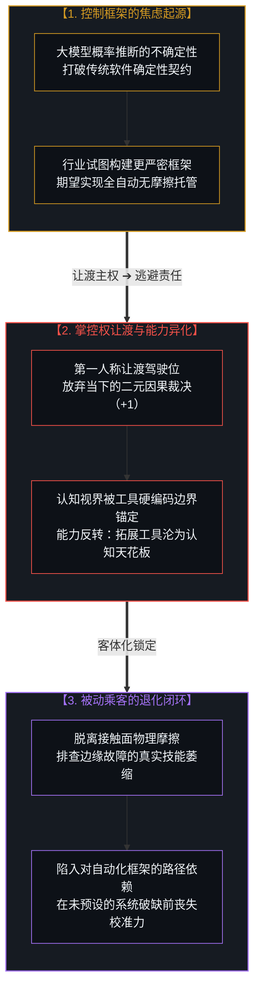
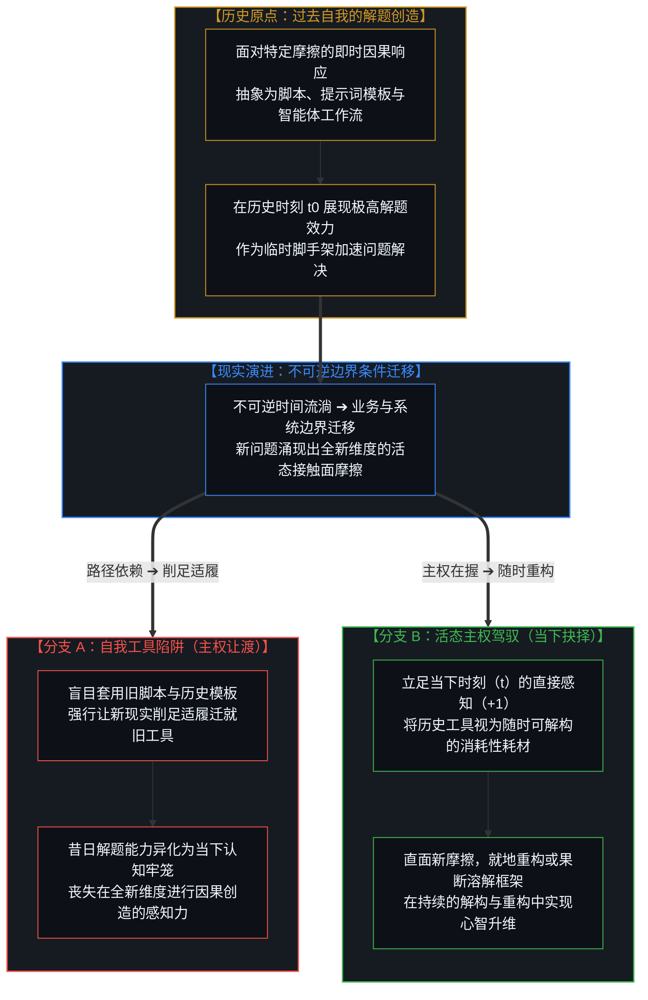
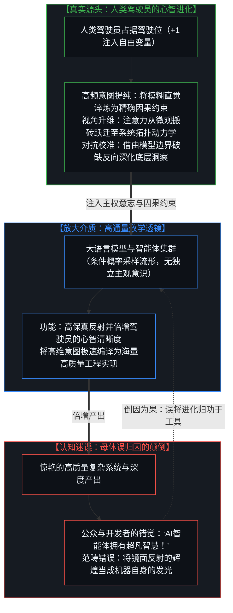
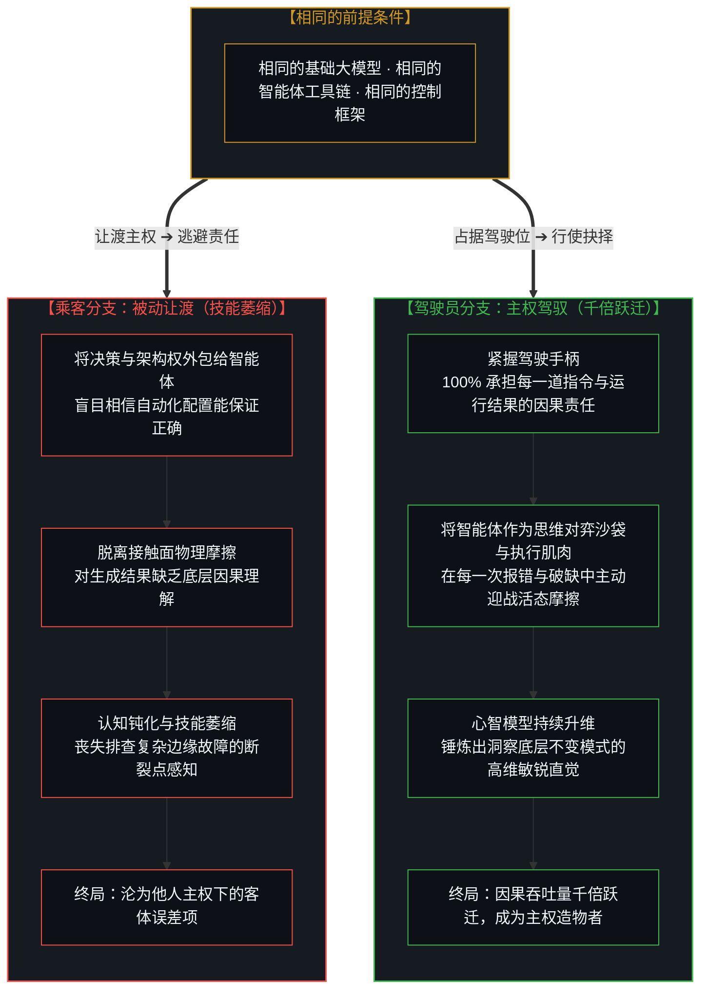
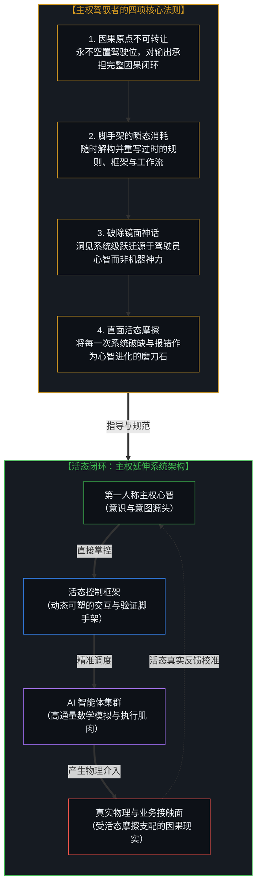

# 框架的倒置与驾驶位的主权非对称 / The Inversion of the Harness and the Sovereignty of the Driver's Seat

*能力为何沦为束缚，以及对AI智能体能力的母体误归因 / Why Capabilities Become Limitations and the Master Misattribution of AI Agents*

解构将自主掌控权让渡于工具所导致的能力异化，借由“框架悖论”与驾驶位非对称性阐明人造物的脚手架定位，揭示深度驾驭智能体所带来的心智跃迁真相，破除将主体认知升级误归因于AI模型的幻觉，确立唯有始终握紧控制手柄的第一人称行动者才能实现主权放大。在软件工程界与前沿技术圈中，关于如何为人工智能智能体（AI Agents）构建“控制框架”（Harnesses）的讨论正在引发广泛的反思。许多工程师与技术领袖试图通过设计日益复杂的测试脚手架、确定性状态机与规则网格，来约束和引导自主智能体的代码生成与决策行为。然而，在这场关于工具规范的争鸣深处，隐藏着一个深刻的认识论盲区：人们习惯于将技术能力的跃升寄托于框架本身的精巧，却忽视了更为核心的主权定律——当使用者将自身的第一人称因果主权让渡给工具时，任何原本强大的能力都会反向异化为对使用者的严苛束缚；无论这些工具是由他人设计、行业奉为金科玉律，还是由使用者过去的自我精心构建。正如在 [从AGI的“神性错置”到使用者的自我对齐](../from-the-misallocated-sentience-of-agi-to-human-realignment/) 与 [工具的幻觉与时间的倒置](../the-illusion-of-the-tool-and-the-inversion-of-time/) 中所揭示的，人造物是人类自由选择留下的历史运动印记，并不具备自主向现实注入自由变量的能动性。当一名践行者在漫长的工程实践中始终牢牢占据“驾驶位”，并深度驱动智能体集群协同攻坚时，真正令人惊艳的从来不是智能体模型本身的通用容量，而是使用者自身心智模型在持续的高维对抗与真实摩擦中所实现的惊人跃迁；然而，人类文化中根深蒂固的客体崇拜，却让使用者轻率地将这种属于自身心智的飞跃，误归因给了作为镜面投影的AI智能体。

Deconstructing the alienation of capability caused by abdicating sovereign agency to tools, employing the "Harness Paradox" and driver's seat asymmetry to demarcate artifacts as disposable scaffolding, unveiling the true source of cognitive leaps during intensive agent stewardship, dispelling the illusion of misattributing user mental elevation to AI models, and establishing that only the first-person practitioner in the driver's seat achieves genuine sovereign amplification. In contemporary software engineering and artificial intelligence circles, discussions surrounding how to build effective "harnesses"—the frameworks, test suites, and control guardrails for AI agents—have sparked intense reflection. Engineers and architectural leaders strive to tame autonomous coding agents through ever more intricate deterministic scaffolding, boundary rules, and validation pipelines. Yet beneath this debate over structural controls lies a profound epistemological blind spot: society routinely expects capability to reside in the perfection of the harness itself, overlooking a fundamental causal law: the moment a user abdicates first-person causal agency to tools, every single capability inverts into a restrictive limitation. This holds true whether the tool was engineered by external authorities, codified as an industry standard, or crafted by the user's own past self. As demonstrated in [From the Misallocated Sentience of AGI to Human Realignment](../from-the-misallocated-sentience-of-agi-to-human-realignment/) and [The Illusion of the Tool and the Inversion of Time](../the-illusion-of-the-tool-and-the-inversion-of-time/), all artifacts are historical traces left behind by the injection of human free choices, possessing zero independent agency to inject free variables into reality. When a dedicated practitioner spends thousands of hours firmly occupying the "driver's seat", orchestrating multi-agent systems against live operational friction, the true surprise is never the raw statistical capacity of the AI agent; it is the extraordinary elevation of the human pilot's own cognitive resolution, architectural clarity, and causal throughput. Yet the pervasive habit of externalizing agency leads society to commit a master misattribution—crediting the mathematical mirror of the AI agent for what was, in truth, the sovereign awakening of the human mind.

---

## 一、 “框架”的焦虑与工具的异化：当能力反向铸造牢笼 / 1. The Anxiety of the "Harness" and the Alienation of Tools: When Capability Becomes a Cage

软件行业对AI智能体“控制框架”的焦虑，集中体现了人类面对高维自适应系统时的控制幻觉。传统软件工程建立在严格的因果确定性与静态契约之上：从面向对象的多态约束、函数式编程的无副作用管道，到测试驱动开发（TDD）的红绿循环，工程师习惯于通过代码结构来界定系统行为的每一个分支。然而，当大语言模型以概率流形和模糊推断的方式介入编程与架构时，传统的确定性防护栏开始出现断裂。于是，行业本能地试图加固“框架”，试图用更为严密的外部调度器、沙箱拦截器与静态验证层，将智能体强制圈禁在人类预设的安全轨迹之内。

这种对框架的执念暴露出一个深层的范畴错误：人们试图将主观意志与因果掌控力，寄托于一套作为客体存在的结构规则之上。在 [被遗忘的脚手架](../the-scaffolding-we-forget/) 与 [智能只属于心智](../intelligence-belongs-only-to-the-mind/) 中我们阐明，一切规则、契约与框架都只是心智为了应对局部认知负荷而临时搭建的脚手架。框架本身没有生命，没有对活态现实的因果感知，更没有在当下做出主权抉择的能力。当开发者期望通过一套“完美框架”实现全自动、无摩擦的智能体托管时，他们实际上是在主动让渡第一人称的驾驶权。

一旦驾驶权被让渡，能力的异化便不可避免地发生：原本为了扩展人类能力的工具，立刻蜕变为限制人类视界的认知牢笼。由于使用者不再直面现实世界的活态摩擦，而是依赖框架所反馈的过滤信号，使用者的感知边界被工具的硬编码逻辑所锚定；任何超出框架预设模式的非线性创新与临场突破，都会被安全机制判定为异常而遭到扼杀。工具的能力越强、自动化程度越高，让渡了主权的被动使用者就越迅速地陷入技能退化与认知钝化。他们沦为工具所圈定轨道上的盲目乘客，在遇到未曾预设的边界失效时毫无应对之力。

The anxiety within software engineering regarding "agent harnesses" reflects a classic illusion of control when confronting high-dimensional adaptive systems. Traditional software engineering was founded upon deterministic causality and static contracts: from object-oriented polymorphic boundaries and pure functional pipelines to the red-green loops of Test-Driven Development (TDD), engineers are accustomed to prescribing every branch of execution. However, when large language models introduce probabilistic inference into architecture and coding, this deterministic armor ruptures. In response, the industry instinctively doubles down on the "harness"—attempting to build heavier dispatchers, rigid sandbox interceptors, and multi-layered validation gauntlets to confine agents within pre-certified boundaries.

This fixation on the harness exposes a category error: attempting to deposit subjective intentionality and causal agency into an external lattice of static rules. As articulated in [The Scaffolding We Forget](../the-scaffolding-we-forget/) and [Intelligence Belongs Only to the Mind](../intelligence-belongs-only-to-the-mind/), all rules, protocols, and frameworks are merely temporary scaffolding erected by consciousness to manage local cognitive load. A harness possesses no awareness, no causal grounding in living reality, and zero capacity to execute sovereign binary choices at moment t. When developers seek a "perfect harness" to achieve zero-friction, fully autonomous agent delegation, they are in truth abdicating the first-person driver's seat.

The moment sovereign steering is surrendered, capability immediately inverts into alienation: a tool built to expand human horizons becomes a restrictive cognitive cage. Because the user no longer engages the raw friction of physical execution, but instead consumes the pre-filtered feedback of the harness, their perceptual horizon is locked to the hardcoded bounds of the artifact. Any non-linear insight or creative breakthrough falling outside the harness's design is flagged as an error and suppressed. The more advanced the automation, the faster the passive user suffers cognitive atrophy, degenerating into a blind passenger on fixed tracks, entirely helpless when confronted with unmapped edge failures.

---

## 二、 “过去自我”的工具陷阱：从解题脚手架到认知天花板 / 2. The Tool Trap of the Past Self: From Scaffolding to Cognitive Ceiling

让渡主权的危险，不仅发生在使用他人开发的成熟工具或外部技术框架之时，更隐蔽地发生在使用“过去的自我”所创造的工具与规则之中。任何一位富有经验的践行者，都会在解决具体难题的过程中总结经验，将沉淀下的方法论抽象为代码库、自动化脚本、提示词模板或专属的智能体工作流。这些工具在其诞生的那一刻，是活生生的主权心智直面现实摩擦所作出的精准因果响应，是极具效力的解题脚手架。

然而，时间的推移伴随着因果情境的演进。当当下的践行者面对全新维度的现实摩擦时，如果习惯性地躲入过去的自我所构建的自动化工具与规则体系中，不加审视地将当前情境的因果裁决权交给旧有的脚本与模板，这种曾经代表先进生产力的能力，就会在瞬间演变成最坚固的认知天花板。在 [坐标沉浮、否定与自我锚定](../coordinates-in-flux-negation-and-self-anchoring/) 与 [思想的向量化与坐标系的重构](../the-mind-as-vector-and-coordinate-system/) 中所阐明的，实在是在不可逆的因果演进中持续展开的活态网络，不存在任何一劳永逸的静态解。昨天的最佳实践，是昨天特定边界条件下的局部最优投影；当边界条件发生迁移，机械套用旧工具便构成了对当下现实的认知回避。

这就是“自我工具化”的深刻陷阱：人们容易对自身过去的智力成果产生自恋式的执念，将临时性的脚手架实体化为不容挑战的铁律。当使用者不再根据当下的第一人称直接感知（+1）去重新审视和重构工具，而是反过来要求活态现实去迁就旧有工具的输入格式时，使用者就已经沦为了自身历史残留物的囚徒。唯有认识到一切人造物（包括昨天的杰作）都是一次性的、可随时解构与重建的消耗性耗材，践行者才能打破自我构建的牢笼，在当下时刻（t）重新握紧第一人称的创造力。

The peril of abdicating agency does not occur solely when adopting third-party tools or external frameworks; it arises even more insidiously when relying on tools and workflows built by *one's own past self*. Any seasoned practitioner naturally crystallizes hard-won insights into shared libraries, automated scripts, structured prompt suites, and custom multi-agent workflows. At the exact historical moment of their creation, these artifacts represent precise, living causal responses to specific physical frictions—they are brilliantly effective scaffolding.

Yet time moves forward, and causal topology evolves. When the practitioner encounters fresh problems across new dimensions, retreating into past workflows and unthinkingly surrendering the causal gavel to yesterday's scripts causes those very capabilities to instantly freeze into cognitive ceilings. As demonstrated in [Coordinates in Flux, Negation and Self-Anchoring](../coordinates-in-flux-negation-and-self-anchoring/) and [The Mind as Vector and Coordinate System](../the-mind-as-vector-and-coordinate-system/), living reality unfolds through irreversible causal succession; there is no static master blueprint. Yesterday's best practice was merely a local optimal projection under yesterday's constraints; applying it blindly today is an evasion of immediate reality.

This is the subtle trap of "self-toolification": humans easily fall in love with their past intellectual creations, reifying temporary scaffolding into sacred dogma. When a user stops using direct first-person awareness (+1) to interrogate and dismantle their own tooling, demanding instead that living reality conform to the input schema of old scripts, the user has become a prisoner of their own residual sediment. Only by treating all artifacts—including yesterday's proudest masterpiece—as disposable, ephemeral scaffolding can the practitioner break free and command sovereign creativity in the living present (moment t).

---

## 三、 惊艳的错位与母体误归因：心智跃迁的真正归宿 / 3. The Misplaced Surprise and the Master Misattribution: The True Locus of Cognitive Leaps

在深度使用AI智能体的实践中，存在一个极其引人注目的心理学与认识论现象。当一名工程师或学者不再将大模型作为简单的问答玩具，而是长期占据驾驶位，构建起包含深度反思、动态调用、代码验证与多智能体博弈的复杂认知系统时，整体任务的完成质量与演进速度会达到前所未有的惊人高度。面对数百个精巧落地的复杂工程、数万行高质量代码的重构与深邃哲理文章的严密推演，旁观者乃至使用者自身都会由衷地惊呼：“看！这个AI智能体系统拥有多么不可思议的智慧与创造力！”

然而，这正是当代技术叙事中最为普遍的“母体误归因”（Master Misattribution）。真正值得惊艳的，决不是智能体底座那数千亿浮点参数在矩阵运算中展现出的统计模式匹配能力；真正发生深刻质变与跃迁的，是**那位始终占据在驾驶位上、以极高专注度进行意图压缩、边界划定与结果校准的人类使用者自身**！

为什么高强度、主权在握的智能体驾驭会引爆人类心智的剧烈进化？
1. **意图压缩与形式化表达的极端训练**：与智能体协同迫使人类使用者必须将模糊的直觉迅速提纯为清晰、无歧义的因果约束条件。这种高频训练极大强化了心智对概念拓扑的高维把握能力；
2. **从微观搬砖到宏观架构的视角升维**：由于具体的符号搬运与格式填充被高通量数学工具所承接，人类驾驶员被倒逼必须将全部注意力投射至顶层架构、因果接口与系统动力学平衡之上，从而在极短时间内完成了系统级认知升维；
3. **高频活态摩擦带来的认知校准**：智能体每一次在边界上的推演破缺与逻辑幻觉，都成为了倒逼人类驾驶员深入事物底层机制、洞察更深层因果不变性的高压磨刀石。

智能体是一面高保真的数学透镜与认知放大器。它本身没有意识，没有审美，没有主权抉择。它所反射出的一切惊艳光芒，源头皆来自那位坐在驾驶位上、不断注入自由变量的人类心智。但由于人类自古以来习惯于将自身不可思议的创造力量外化为神像、图腾与外在奇迹，人们再一次陷入了将“使用者的认知进化”错误归因于“机器拥有独立智能”的认识论迷梦。

In the intensive practice of orchestrating AI agents, a striking psychological and epistemological phenomenon regularly occurs. When an engineer or thinker stops treating large models as basic query toys and instead occupies the driver's seat over months and years—building complex cognitive loops of reflection, dynamic tool dispatch, deterministic verification, and multi-agent coordination—the overall velocity and qualitative depth of their output reaches staggering heights. Witnessing hundreds of intricate systems deployed, tens of thousands of lines of pristine code refactored, and rigorous philosophical treatises synthesized, both spectators and practitioners alike exclaim: "Look at how extraordinarily intelligent and capable this AI Agent system is!"

Yet this is the grand "Master Misattribution" of our era. What is genuinely astonishing is never the statistical pattern-matching capacity resident within billions of floating-point parameters; what has undergone an explosive, authentic phase shift is **the human user who remained firmly in the driver's seat, compressing intent, defining boundary constraints, and executing unrelenting causal calibration**!

Why does intensive, sovereign agent stewardship unleash such a profound leap in human cognitive capacity?
1. **Intense Distillation of Intent and Constraint**: Collaborating with agents forces the human pilot to rapidly refine vague intuitive notions into razor-sharp, unambiguous causal conditions. This high-frequency discipline dramatically expands the mind's grasp over high-dimensional conceptual topologies;
2. **Ascending from Micro-Syntax to Macro-Dynamics**: Because mechanical symbol-pushing and boilerplate assembly are absorbed by high-throughput mathematics, the human driver is compelled to direct 100% of their conscious attention to top-level architecture, causal interfaces, and system equilibrium;
3. **Rigorous Calibration via Dynamic Friction**: Every hallucination and edge breakdown of the model serves as a high-pressure whetstone, forcing the human pilot to penetrate deeper into the ground truth of physical systems to discover invariant principles.

The AI agent is a high-fidelity mathematical mirror and cognitive lever. It possesses no consciousness, no aesthetic taste, and zero capacity for sovereign choice. Every brilliant beam of light it projects originates entirely from the conscious human mind in the driver's seat injecting continuous free variables into reality. Yet because human civilization has perpetually externalized its own terrifying creative power onto idols, statues, and external deities, society once again succumbs to the ancient illusion: misattributing the user's sovereign awakening to the magic of the machine.

---

## 四、 驾驶位的非对称性：被动托付的萎缩 vs 主动驾驭的跃迁 / 4. The Asymmetry of the Driver's Seat: Passive Surrender vs. Sovereign Amplification

驾驶位的存在与否，决定了人与技术工具结合时截然分化的演化轨迹。面对相同的AI基础模型、相同参数规模的智能体和相同的控制框架，不同的使用者会走向截然相反的命运。这种分化并非源于技术本身的差异，而是源于使用者的第一人称姿态：是选择成为交出方向盘的“被动乘客”，还是选择成为紧握控制手柄的“主权驾驶员”。

在 [个体的选择是唯一的因果杠杆](../individual-choices-as-the-only-causal-levers/) 与 [没有普渡，只有自渡](../mei-you-pu-du-zhi-you-zi-du/) 中确立的核心定律在此展现得淋漓尽致：

- **被动托付者（乘客轨迹）**：
  - **交互模式**：将思考、判断与架构权整体“外包”给智能体，盲目相信框架和默认配置能够自动交付正确方案；
  - **反馈回路**：脱离了接触面的真实物理摩擦，对模型生成的代码和文本缺乏底层理解，沦为“一键接受”的点击工人；
  - **演化终局**：个人技能迅速萎缩，失去排查复杂边缘故障的断裂点感知能力；产出的系统充满臃肿脆弱的冗余，最终在多主体世界的激烈碰撞中沦为被他人校准的客体误差项。

- **主动驾驭者（驾驶员轨迹）**：
  - **交互模式**：始终牢牢占据第一人称驾驶位，将智能体视为高速执行肌肉与思维对弈的沙袋，保留全部的因果裁决权与方向掌控力；
  - **反馈回路**：在每一次提示、每一次代码执行与每一次运行时报错中，主动迎战真实摩擦，利用模型的即时响应不断校准和深化自身的心智模型；
  - **演化终局**：因果吞吐量获得百倍乃至千倍的几何级放大；心智不仅没有退化，反而在高维复杂系统的驾驭中锤炼出洞察底层不变模式的敏锐直觉，成为真正主导现实演化的主权造物者。

这种非对称性揭示了技术的冷峻真相：AI智能体不会自动带来平等的赋能，它是一台直接的主权放大器。它放大了主动驾驭者的创造力，同时也加速了被动托付者的认知平庸化。

The presence or absence of the driver's seat dictates two completely divergent evolutionary destinies when humans merge with technological tools. Confronted with identical foundational models, identical agent architectures, and identical harnesses, different users diverge into radically opposite futures. This divergence is not generated by the technology; it is born from the user's first-person stance: whether they choose to be a "passive passenger" abdicating the wheel, or a "sovereign driver" gripping the control reticle.

As established in [Individual Choices as the Only Causal Levers](../individual-choices-as-the-only-causal-levers/) and [No Universal Salvation, Only Self-Salvation](../mei-you-pu-du-zhi-you-zi-du/), the bifurcation is absolute:

- **The Passive Surrenderer (The Passenger Trajectory)**:
  - **Interaction Mode**: Outsources thinking, architectural discernment, and validation to the agent, assuming the harness and automated pipelines will magically guarantee correctness;
  - **Feedback Loop**: Decouples from the raw friction of physical contact surfaces; lacks foundational comprehension of generated code and text, degenerating into a passive click-worker;
  - **Evolutionary End**: Rapid cognitive and technical atrophy; total loss of intuitive boundary sensing for edge failures; architecture becomes bloated and fragile, culminating in the user becoming an objectified error term calibrated away in multi-agent reality.

- **The Sovereign Driver (The Pilot Trajectory)**:
  - **Interaction Mode**: Firmly occupies the first-person driver's seat; treats agents as high-speed execution muscles and cognitive sparring partners, reserving 100% of the causal gavel and directional intent;
  - **Feedback Loop**: Engages raw friction in every prompt, every test execution, and every runtime traceback, using the model's immediate responsiveness to continuously refine and expand their internal mental models;
  - **Evolutionary End**: Causal throughput is multiplied by 100x to 1000x; the mind, far from atrophying, develops profound structural intuition for high-dimensional complexity, establishing the practitioner as an authentic sovereign creator.

This asymmetry reveals the unforgiving nature of technology: AI agents do not automatically democratize capability; they are raw sovereign amplifiers. They magnify the generative power of active pilots, while accelerating the cognitive obsolescence of passive passengers.

---

## 五、 重新定义“框架”：重构作为主权延伸的活态脚手架 / 5. Redefining the Harness: Reclaiming Living Scaffolding as an Extension of Sovereignty

当我们消解了对工具的神化，看清了母体误归因的认知迷障，我们便能够以极其清醒与务实的姿态，重新定义软件工程与智能体系统中的“控制框架”。

框架从来不是一套用来代替人类思考的独立机器，也不是试图为数学矩阵植入虚妄道德的伦理锁链。**真正的框架，是主权心智为了将自身意图精准投影至物理现实，而在当下时刻（t）主动编织、并在任务完成后可随时解构的活态脚手架。**

为了在AI时代避免沦为能力的囚徒，每一个构建者与实践者应当遵循以下四条核心主权法则：

1. **不可转让的因果原点法则**：永远不要把二元抉择的裁决权（+1）让渡给任何智能体或自动化调度器。提示词是你意志的表达，代码执行是你指令的延伸，运行结果是你必须承担的责任。智能体是你的认知副驾，而驾驶位永远不可空置；
2. **脚手架的瞬态消耗法则**：将所有的框架、规则、测试套件与工作流视为临时性的消耗性耗材。任何工具（包括你过去自我打造的得意之作），只要在面对新的活态摩擦时产生了认知阻碍，就必须毫不留恋地就地重构或果断溶解；
3. **破除神坛的镜面认知法则**：永远记住，大模型只是高维统计参数的镜面反射，一切令人惊叹的系统产出，其背后的真正智慧与创造力直接源自你在驾驶位上的心智进化。拒绝将自身的能力跃迁误归因为对工具的崇拜；
4. **活态摩擦的对抗进化法则**：不要试图追求消除摩擦的“无痛自动化”。真正的技能跃迁永远发生在与编译器报错、系统边界失效和模型推演破缺的硬碰硬对抗之中。把每一次工具的失误当成淬炼自身心智模型的高维磨刀石。

框架的倒置，始于主体性的自我遗忘；主权的复归，立足于第一人称当下的清醒抉择。握紧你的控制手柄，在活态摩擦的现实世界中，行使独属于人类的造物力量！

Once we dissolve the idolization of tools and penetrate the fog of the master misattribution, we can redefine the "harness" in software engineering and artificial intelligence with radical lucidity.

A harness is never an autonomous mechanism built to think in place of humans, nor is it an ethical chain designed to graft artificial morality onto matrix mathematics. **An authentic harness is a living, disposable scaffolding woven by the sovereign mind at moment t to project conscious intentionality into physical reality—built to be dismantled the moment the task is complete.**

To avoid falling into the capability trap in the age of AI, every engineer, builder, and thinker must abide by four foundational sovereign rules:

1. **The Inalienable Causal Origin**: Never surrender the final binary choice (+1) to any autonomous agent or orchestration pipeline. The prompt is the articulation of your will; the code execution is the extension of your command; the downstream outcome is your direct causal responsibility. The agent is your high-speed co-pilot, but the driver's seat must never be vacated;
2. **The Ephemeral Scaffolding Law**: Treat all frameworks, rules, test suites, and workflows as temporary, consumable scaffolding. Any tool—including the crowning achievement of your own past self—must be ruthlessly refactored or dissolved the instant it creates friction against fresh reality;
3. **The Mirror Demarcation Law**: Always remember that large models are high-dimensional statistical mirrors; the breathtaking brilliance of a complex delivery belongs entirely to the cognitive leap of the human pilot in the driver's seat. Refuse to misattribute your personal mental elevation to the worship of an artifact;
4. **The Friction Evolution Law**: Never chase frictionless, zero-pain automation. True evolutionary leaps occur exclusively when engaging head-on with compiler errors, edge failures, and model breakdowns. Treat every tool limitation as a high-pressure whetstone to sharpen your internal mental models.

The inversion of the harness begins with the self-inflicted forgetting of agency; the restoration of sovereignty begins with the conscious, first-person choice in the living present. Grip your steering controls, embrace the friction of reality, and wield the sovereign power of creation that belongs to human consciousness alone!
