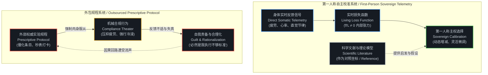
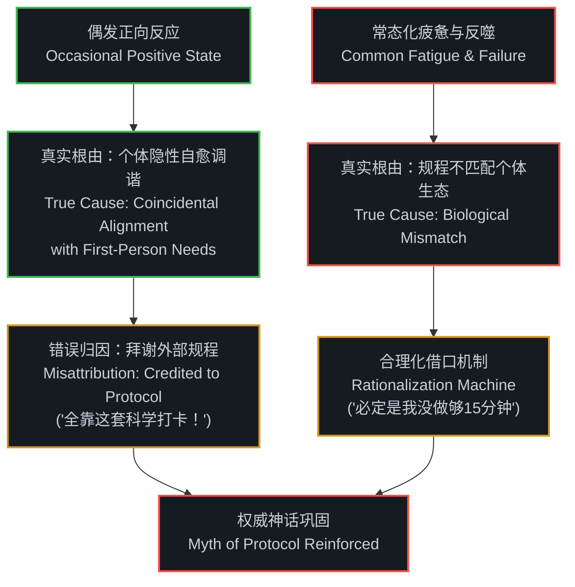

# 规程的倒置与因果回路的消声——从群体统计拜物教到收回第一人称校准 / The Inversion of the Protocol and the Silencing of the Causal Loop: From Population Statistics Fetish to Reclaiming First-Person Calibration

*具身肉身是超越低维符号信息的超复杂界面；当科学从第一人称校验的坐标系倒置为规训具身的终极规程，主权者的因果回路便在对群体统计拜物教的盲从与合规辩解中被悄然消声。 / Living embodiment is a hyper-complex interface permanently exceeding discrete informational models; when science inverts from an orienting reference for the first-person sovereign into a prescriptive protocol, the causal loop is silenced beneath population statistics fetishism and compliance rationalizations.*

---

## 引言：从狂热信徒到清醒者——“规程”时代的群体迷思 / Prologue: From Disciple to Discernment—The Cultural Fetish of the "Protocol"

在过去数年间，以安德鲁·休伯曼（Andrew Huberman）为代表的神经生物学科普掀起了一场广泛的生活方式风潮。追求卓越状态的个体常常成为忠诚的执行者：早晨醒来必须在特定的十几分钟内直视晨光，喝咖啡必须精确推迟九十分钟到两小时以防腺苷反弹，冷水浸泡必须卡死在特定水温与秒数，补剂清单被细化至毫克级别。当休伯曼承诺已久的新书《Protocols》（规程）终于问世时，大众对这套体系的期待达到了高点——人们渴望拥有一本由名校学者背书的“生命操作手册”。

然而，当这些在播客中听起来无懈可击、极具“科学严密性”的条目被真正植入真实的肉身日常时，剧烈的摩擦便不可避免地浮现。许多人即便竭尽所能去执行，身体所获得的收益也从未如宣称的那样显著；反之，精神的焦虑、节奏的紊乱与莫名的疲惫却频频发生。

这并非个别博主的操守问题，而是整个现代社会对于“科学规程”的认知错位。**当一套来源于外部群体的群体统计结论被冠以“规训规程”（Protocol）之名要求个体遵循，而非作为“参考坐标”（Reference）供个体对照核验时，它的功能便发生了致命的倒置：它不仅未能帮助个体建立敏锐的因果反馈回路，反而使个体本该自主运转的真实感知遭受消声。**

Over the past few years, the wave of neurobiology popularization led by figures like Andrew Huberman ignited a widespread lifestyle trend. Countless individuals striving for cognitive and physiological excellence became devoted followers: stepping outside within minutes of waking to catch early sunlight, strictly delaying caffeine by ninety to one hundred and twenty minutes to prevent an afternoon adenosine crash, timing cold plunges down to the exact degree and second, and consuming supplement stacks measured to the milligram. When Huberman's long-anticipated book *Protocols* was finally released, public anticipation reached its peak—people yearned for a peer-reviewed "operating manual for human biology."

Yet, when these regimens, which sound so indisputable and rigorously scientific on audio broadcasts, are enacted within the living flesh of daily existence, acute friction inevitably arises. Even when practiced with utmost discipline, the promised benefits rarely materialize with the clarity advertised; instead, psychological anxiety, circadian disruption, and chronic low-grade fatigue frequently take their place.

This failure is not unique to any individual podcaster; it stems from a systemic cognitive error regarding what "science" actually delivers to a sovereign agent. **When empirical observations derived from population samples are canonized as "Protocols" to be obeyed, rather than offered as "References" to be checked against, their cybernetic function undergoes a catastrophic inversion: instead of helping individuals sharpen their own causal feedback loops, they silence the living organism's real-time somatic telemetry.**



---

## 第一节：低维符号模型对超复杂系统的盲视 / Section I: The Blindness of Informational Models to Hyper-Complex Systems

心智所依凭的具身生命系统（Embodiment），以及其在物理现实中所延展出的全部生理、代谢与行为互动，是一个远远超越当前人类认知边界的超复杂系统（Hyper-complex system）。心智作为第一人称因果原点端坐于驾驶席上，而肉身则是它与物理现实发生直接摩擦、读取损失函数的活态具身界面。这一具身系统的复杂程度不仅超越了常规医学常识的设想，甚至让现代分子生物学前沿的测序技术显得粗糙脆弱。

人类目前所掌握的全部所谓“生物学科学知识”，其性质属于**低维符号信息（Informational Models）**。我们用离散的词汇、线性的生化通路图、静态的受体配体结合常数来描述生命。然而，即便是一个单链DNA分子在细胞核三维染色质折叠中的动态构象、量子隧穿效应与表观遗传实时修饰，其包含的高维涌现信息量，就已经让整个人类图书馆的信息总量相形见绌。正如我们在 [The Sleight of Hand in "Physics Is the Law" and the Friction of Reality](/not-a-toe/posts/the-sleight-of-hand-in-physics-is-the-law-and-the-friction-of-reality/) 中所剖析的戏法：人们极易将人类大脑发明的低维数学物理模型，误认为是自然界运转的终极法则本身。

在生物健康领域，这种戏法愈演愈烈：

- **维度的无限塌缩**：生命是一个包含千亿级细胞、实时微秒级内分泌震荡、未被解析的微生物组共生体；而一篇顶刊论文能捕捉的，无非是“摄入X物质后血液中Y标志物在两小时内的均值浓度变化”。

- **因果关系的虚假孤立**：为了在实验室内获得因果确定性，科学家必须剥离环境摩擦，固定所有其他变量。但一个真实的活人生活在复杂多变的天气、情绪、人际关系与工作压力之中，没有任何变量能够被孤立固定。

- **信息的代偿陷阱**：将高度压缩的局部生化结论硬套在整体系统上，就如同拿着一张只有两座建筑物的简笔画草图，声称自己掌握了整座热带雨林的天气演化规律。

当一个人把某种“神经科学论文提炼出的规程”奉为金科玉律时，他实际上是用简陋的信息玩具，去凌驾自己体内运行了亿万年的超复杂自组织智慧。

The living embodiment through which the conscious mind acts and navigates reality, along with all its physiological, metabolic, and behavioral interactions in the physical world, constitutes a hyper-complex system that vastly exceeds contemporary scientific comprehension. The mind operates as the first-person causal origin in the driver's seat, while the biological body serves as the living embodied interface through which it engages physical friction and reads real-time telemetry. The intricacy of this embodied system is not merely marginally greater than popular medical discourse assumes; it is orders of magnitude beyond the reach of discrete informational modeling.

All human "biological knowledge" accumulated to date is strictly informational in nature—discrete symbols, linear pathway diagrams, receptor affinities, and low-dimensional mathematical approximations. Yet the living reality of even a single DNA strand—its dynamic three-dimensional chromatin folding, quantum tunneling interactions, and real-time epigenetic flux within the cellular cytoplasm—possesses high-dimensional emergent complexity that dwarfs the descriptive capacity of all human libraries combined. As demonstrated in [The Sleight of Hand in "Physics Is the Law" and the Friction of Reality](/not-a-toe/posts/the-sleight-of-hand-in-physics-is-the-law-and-the-friction-of-reality/), human minds chronically succumb to a fatal sleight of hand: mistaking their low-dimensional conceptual tools for the living fabric of reality itself.

In the sphere of biological health and performance, this sleight of hand operates with acute force:

- **Infinite Dimensional Collapse**: Living physiology constitutes hundreds of billions of cells engaged in microsecond-scale endocrine oscillations and uncharted microbiome symbioses. A flagship research paper isolates merely a tiny slice: the mean concentration shift of biomarker Y following the ingestion of compound X across a two-hour window.

- **Artificial Causal Isolation**: To establish statistical significance in a laboratory, researchers must suppress environmental friction and hold all other variables constant. But a living human moves through volatile weather, emotional currents, interpersonal dynamics, and systemic occupational demands; no variable can ever be isolated in vivo.

- **The Informational Trap**: Imposing an isolated biochemical observation onto an entire living being is akin to using a two-line cartoon sketch of a building to navigate the atmospheric ecology of an entire rainforest.

When an individual treats a protocol distilled from laboratory literature as absolute doctrine, they allow a coarse, low-dimensional symbolic toy to usurp billions of years of evolved self-organizing organic intelligence.

---

## 第二节：群体统计的必然陷阱：平均值抹杀最高杠杆的个体变量 / Section II: The Statistical Trap of the Population Mean: Averaging Out High-Leverage Individual Variables

现代科学范式的基石是“可重复性”（Replicability）与“群体统计显著性”（Population Statistical Significance）。一项发现若想被学界公认为真理，其前提是在大样本队列（N ≫ 1）中展现出跨越个体差异的一致性。

然而，这一数学要求本身就注定了它的局限：

```
真实个体的高维异质分布 / High-Dimensional Heterogeneity (N=1)
├── 代谢基线差异 / Unique Metabolic Baseline
├── 表观遗传修饰 / Epigenetic Memory
├── 隐性心理创伤 / Somatosensory Trauma State
└── 昼夜节律表型 / Circadian Chronotype
               │
               ▼  [群体统计聚合 / Population Statistical Aggregation (N ≫ 1)]
    抹除方差与离群值 / Erasure of Variance & Outliers (ε → 0)
               │
               ▼
   平庸的数学抽象均值 / The Fictional "Average Human"
```

为了得到那个小于0.05的P值，统计学家必须通过大样本均值计算，将所有个体的特异性、未测量的背景变量以及非线性反应，统统作为“统计噪音”（Statistical Noise, ε）强行过滤磨平。

其逻辑代价是残酷的：

- **现实中并不存在“平均人”**：群体统计拜物教所描绘出的最佳规程，针对的是一个在物理现实中并不存在的数学幽灵。没有任何一个活生生的人精确符合大样本的各项中位数。

- **决定个体跃迁的变量恰好被平均掉**：在一个具体个体（N=1）的生命因果系统中，真正能产生最高杠杆效果的要素，恰恰正是他独特的代谢短板、神经敏感度、过往疾病印记或心理节律。这些最高价值的杠杆，在论文撰写的那一刻，就已经作为“离群点”被无情剔除了。

- **群体效益不等于个体可行性**：某项干预措施在群体平均层面可能带来5%的某项指标提升，但这可能意味着部分人提升了30%，另一些人毫无反应，而相当一部分人则承受了未被记录的负面代谢反噬。

当一个人沉迷于“科学规程”的群体统计拜物教时，他就是在强迫自己独一无二的活态系统，去削足适履地塞进那个由统计机器碾压出来的平庸均值模具之中。

The bedrock of the modern scientific paradigm is inter-subjective replicability and statistical significance across a cohort. For an empirical finding to be recognized by academic consensus, it must demonstrate consistent effects across a substantial population sample (N ≫ 1).

Yet this mathematical discipline harbors an inescapable structural blind spot:

To produce an acceptable p-value, mathematical aggregation must treat individual idiosyncrasy, unmeasured contextual baselines, and non-linear reactions as statistical noise (ε) to be averaged away.

The epistemic consequences are decisive:

- **The "Average Human" Is an Imaginary Construct**: The optimal protocol revealed by population statistics describes an abstract phantom that exists nowhere in physical reality. No living human being embodies the exact median across thousands of physiological parameters.

- **Decisive Causal Leverage Is Erased as Outliers**: In the sovereign life of a concrete individual (N=1), the variables that yield the greatest transformative leverage are precisely their unique constitutional idiosyncrasies: metabolic quirks, neurochemical sensitivities, historical immunological imprints, and intuitive psychological cadences. These paramount levers were discarded as irrelevant noise before the study was even printed.

- **Aggregate Advantage Masks Divergent Dispersion**: An intervention demonstrating a statistically significant 5% average boost across a cohort hides a stark reality: a minority achieved a 30% benefit, many experienced no effect, and another subset suffered undocumented systemic distress.

To submit oneself blindly to a standardized scientific protocol is to mutilate a living, singular biological system so it fits inside a synthetic mould manufactured by statistical averaging.

---

## 第三节：因果回路的倒置：作为规训规程与作为校对坐标 / Section III: The Causal Inversion: Protocol as Prescriptive Harness vs. Reference as Orienting Map

这并非全盘否定科学实验与实证研究的价值。正如我们在 [The Inversion of the Harness and the Driver's Seat Asymmetry](/not-a-toe/posts/the-inversion-of-the-harness-and-the-drivers-seat-asymmetry/) 中阐明的机理：关键在于工具与主权者之间的相对位次。

科学方法最荣耀的使命，是作为人类开拓认知疆界的探照灯。它为我们揭示出某种生化机理的潜在因果路径，提供了一组高价值的假设。但工具的性质取决于个体的摆放方式：


### 1. 规程作为规训框架（Protocol to Follow）

- **外包驾驶席**：个体将对自身生命的感知权与裁量权，让渡给外在的专家与规程。

- **切断本体感官**：当身体发出疲惫、抗拒、食欲不振或过度兴奋的真实警报时，信徒选择闭上感官之眼，认定“斯坦福教授的图表比我自己的神经系统更懂我”。

- **因果回路的消声**：原本应当由“行动 → 身体反馈 → 调整行动”构成的超短闭环，被插入了一个庞大、迟钝且不可辩驳的意识形态阻断层。个体不再校准现实，而是在履行合规仪式；本体感觉的微弱电信号被规程的轰鸣声无情消声。

### 2. 科学作为校对坐标（Reference to Check Against）

- **捍卫第一人称主权**：个体始终端坐于驾驶席上。科学论文、生理指标和健康理论，只是仪表盘旁的航海图与参考读数。

- **以肉身反馈为最高真理**：个体带着好奇心去尝试某种建议（例如调整摄入时段或光照暴露），但审判台永远设立在第一人称的当下体验中。如果延后两小时喝咖啡导致整个早晨头痛欲裂、工作效率腰斩，具有主权意识的心智会毫无心理包袱地将其抛弃。

- **恢复生命测度**：群体的经验是地图，个体的脚步才是领土。地图无论绘制得多精美，一旦与脚下的泥泞悬崖发生冲突，必须随时修正的是地图，而不是斩断自己的双腿。

This analysis does not imply that scientific experimentation or empirical biology is without merit. As established in [The Inversion of the Harness and the Driver's Seat Asymmetry](/not-a-toe/posts/the-inversion-of-the-harness-and-the-drivers-seat-asymmetry/), the critical distinction lies entirely in the structural relation between the sovereign operator and the instrument.

The noble function of the scientific method is to illuminate uncharted terrain, presenting plausible mechanisms and formulating potent hypotheses. Yet the utility of any informational tool depends on how it is deployed:

### 1. The Protocol to Follow (The Prescriptive Harness)

- **Vacating the Driver's Seat**: The individual abdicates discernment, surrendering somatic governance to external figures and algorithmic checklists.

- **Silencing Visceral Telemetry**: When the body signals exhaustion, metabolic friction, digestive distress, or intuitive revulsion, the protocol devotee ignores the distress calls, assuming that an Ivy League research paper possesses deeper knowledge of their flesh than their own sensory nervous system.

- **The Silencing of the Cybernetic Loop**: The immediate, high-fidelity loop of *Action → Bodily Telemetry → Micro-Adjustment* is severed. In its place sits an inflexible, dogmatic barrier of external rules. The individual ceases to engage reality; they merely enact compliance theater.

### 2. The Reference to Check Against (The Orienting Map)

- **Preserving First-Person Sovereignty**: The individual remains anchored in the driver's seat. Scientific papers, laboratory metrics, and physiological concepts serve strictly as nautical charts and navigational instruments.

- **The Supremacy of Somatic Feedback**: The sovereign mind tests a recommendation (such as shifting sunlight exposure or manipulating meal timing) as an empirical trial within its own domain. Yet the final court of adjudication remains the immediate, lived feedback of the organism. If delaying caffeine produces pounding cephalic pressure and incapacitates morning cognition, the sovereign agent discards the rule without a shred of guilt.

- **Restoring Ecological Ground Truth**: The paper is a map; direct experience is the living territory. No matter how elegant the cartography, when it conflicts with the swamp beneath one's feet, it is the map that must yield, not the legs that must be severed.

---

## 第四节：巧合的成功归因与失败的合理化机器 / Section IV: The Misattribution of Correlated Success and the Rationalization Machine

如果外部规程如此脱离个体现实，为什么它们还能在社会中维系巨大的心理权威？答案深植于现代人类心智的归因偏差与防御机制中。



### 1. 巧合成功的虚假归因（Misattribution of Correlation）

在少数情况下，某项外部规程确实让某些人感受到了状态的改善。然而在许多情形下，这种成效只是一场巧合：**规程中的某一项建议，碰巧与该个体在那个特定生命阶段的第一人称真实需求发生了重叠。**

例如，一个常年熬夜、久坐密闭房间的人，因为执行了规程而开始在清晨出门散步。让他重新焕发生机的，并不是“精确推迟摄入咖啡因以重塑腺苷受体”的复杂假设，而是他走出了密室、接触了新鲜空气、打破了长期的身心停滞。但他却将全部神效归功于精密的理论包装。这种归因错位剥夺了他对自己内在调节机制的理解，进一步将他绑缚在外部专家的条目之下。

### 2. 失败时的合理化机器（The Rationalization Machine）

更为隐蔽的陷阱发生在规程失效之时。当一个人严格执行规程却感到疲惫不堪、免疫力下降、工作效率崩塌时，这套体系所培育出的思维方式决不会去怀疑规程本身的荒谬，而是启动强大的合理化机器：

- “一定是我看晨光的时间不够长，今天有云层遮挡，光照通量不足。”

- “一定是我洗冷水澡的水温高了两度，没能激活棕色脂肪。”

- “一定是我少吃了一味协同促吸收的微量矿物质补剂。”

这一合理化循环具有封闭性：**成功证明了规程的伟大，失败则证明了执行者的怠惰。** 规程本身变得不可伪证，正如我们在 [The Illusion of the Unmediated](/not-a-toe/posts/the-illusion-of-the-unmediated/) 中揭示的控制论逃逸：它永远在向更繁复的微观细节退守，以逃避现实损失函数的正面校准。

If external protocols are so detached from idiosyncratic individual needs, how do they sustain their overwhelming cultural authority? The answer lies in the psychological mechanisms of misattribution and cognitive rationalization.

### 1. The Misattribution of Correlated Success

On rare occasions, an external protocol genuinely coincides with an individual experiencing an elevation in vitality. Yet in most instances, this success is pure correlation: **a specific recommendation within the stack happened to align with what that unique organism desperately needed at that particular moment in time.**

For instance, an individual who spent years sedentary in a darkened apartment suddenly begins walking outdoors each morning because a protocol demanded it. What restored their vitality was not the esoteric neurochemical hypothesis of adenosine receptor mechanics, but the simple, un-modeled realities of physical locomotion, natural atmosphere, and breaking a chronic depressive loop. Yet the individual misattributes the transformation entirely to the complex theoretical apparatus. This misattribution severs them from their own internal causal agency, binding them ever tighter to the podcaster's altar.

### 2. The Rationalization Machine

The darker trap operates when the protocol inevitably fails. When a diligent follower adheres to the rules yet ends up exhausted, emotionally brittle, or metabolically dysregulated, the protocol mentality never permits questioning the doctrine itself. Instead, it fires up an endless rationalization engine:

- *"I must not have stayed outside long enough; the cloud cover diminished the requisite photon lux."*

- *"The plunge water was two degrees too warm to trigger norepinephrine release."*

- *"I failed to take the third synergistic mineral compound required for full absorption."*

This creates an unfalsifiable psychological cage: **Success validates the omniscience of the Protocol; failure proves the moral and technical inadequacy of the follower.** The protocol retreats into ever-smaller micro-technical justifications, perfectly evading falsification by the organism's real-time loss function.

---

## 结语：收回第一人称校准：躁动即损失函数 / Epilogue: Reclaiming First-Person Calibration: Agitation as the Real-Time Loss Function

回到休伯曼在访谈中引发共鸣的那句话：

> *“来自错误的躁动（源于做出新尝试的真正努力），正是开启大脑重塑与学习的大门。”*

这句感叹的机理何其深刻：**所谓“躁动”（Agitation），在控制论与神经生物学的交汇处，正是大脑和神经系统的实时损失函数（Real-Time Loss Function, ∇L）。**

当你在现实中碰壁、感到不适、察觉到期望与反馈之间的剧烈撕裂时，那种身体上的紧绷与精神上的躁动，正是生命系统最宝贵的自我修正信号。它在以质朴的方式向你发出呼告：*“此路不通，当前模型与现实发生摩擦，请立即基于当下的痛感调整神经权重！”*

正如我们在 [The Dilution of the Causal Loop and the Misallocation of Agency](/not-a-toe/posts/the-dilution-of-the-causal-loop-and-the-misallocation-of-agency/) 中所讨论的，因果回路的稀释必然导致责任与感知的双重麻痹。而这套打着神经科学旗号的“规程拜物教”，其所兜售的宏大承诺，恰恰是在消灭这种宝贵的躁动。它向大众许诺了一条无需试错、无需在未知中摸索、无需承担自我感知风险的“无菌通道”。人们误以为只要买下这本厚重的手册，就能用预设的公式跳过所有与现实摩擦的痛苦。

这是一种致命的代偿。**通过跟随一份标准化的操作规程来试图免去个体探索的摩擦，你不仅未能优化神经可塑性，反而亲手掐断了促使神经可塑性发生的那个唯一信号源。**

自由、健康与卓越，从来不是一套由他人制定好、盖好印章赠予你的“被开辟的庄园”。科学文献是极其有益的航海日志，但它永远不能替代你握着舵柄的手。

是时候从那些密不透风的条条框框中抬起头来，重新信赖你皮肤上的寒暑、肌肉里的酸胀、肠胃中的呼吸与心灵深处的清明。真正的生机从不等待任何规程的批准；它在每一次与现实的直接相撞中，由你自己第一人称的敏锐直觉亲手校准开辟。

Returning to the insight that sparked this inquiry:

> *"The agitation from errors (that come from genuine attempts to do something new) is what gates rewiring of your brain and learning."*

The operational reality of this statement is unmistakable: **What is labeled as "agitation" is, in cybernetics and biological optimization, the nervous system's real-time loss function (∇L).**

When you encounter friction in the living world—when an expectation collides with reality, generating subjective disorientation, physical discomfort, or tension—that visceral agitation is the most precious adaptive signal the organism possesses. It is the living system announcing: *"The current predictive model has collided with unmodeled territory; calibrate the weights immediately based on felt contact."*

As examined in [The Dilution of the Causal Loop and the Misallocation of Agency](/not-a-toe/posts/the-dilution-of-the-causal-loop-and-the-misallocation-of-agency/), the dilution of causal feedback inevitably induces cognitive and physiological numbness. The culture of "Protocol Obsession" promises the exact opposite: **an agitation-free shortcut to biological mastery.** It peddles the illusion that one can purchase a sterile, risk-free passage through reality, bypassing the uncertain, clumsy friction of personal calibration through someone else's pre-packaged formulas.

This is a tragic self-deception. **By leaning on a standardized third-person protocol to evade the friction of personal pathfinding, you do not enhance neuroplasticity; you extinguish the very error-signal required for neural rewiring to occur.**

Vitality, resilience, and sovereignty are not pre-paved estates handed down by institutional scientists or podcast influencers. Scientific literature is an invaluable navigational reference, but it can never replace the living hand upon the helm.

It is time to lift your gaze from the rigid checklists, and restore radical trust in your own bodily telemetry: the temperature upon your skin, the fatigue within your musculature, the metabolic rhythm of your breath, and the intuitive clarity of your focus. Living adaptation waits for no external protocol; it is carved out in every direct encounter with reality, through the unmediated, sovereign calibration of your own first-person senses.
