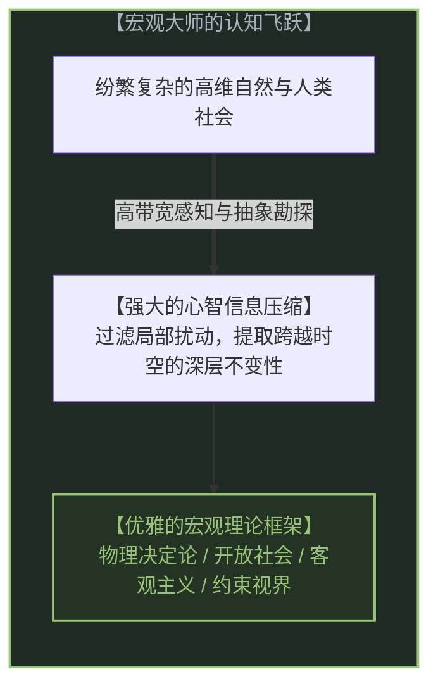
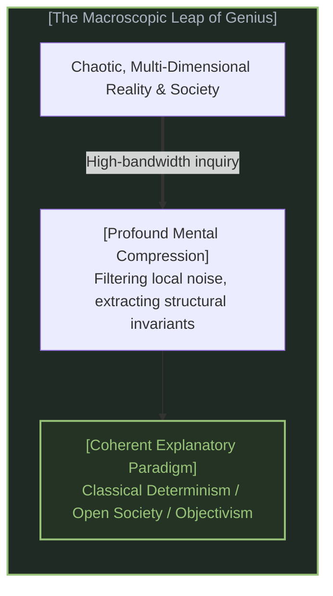
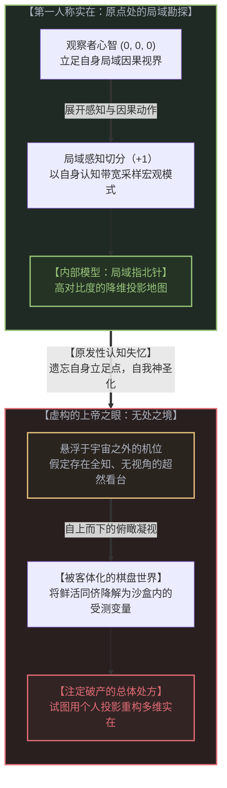
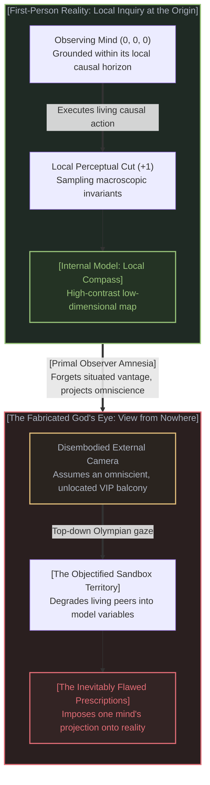
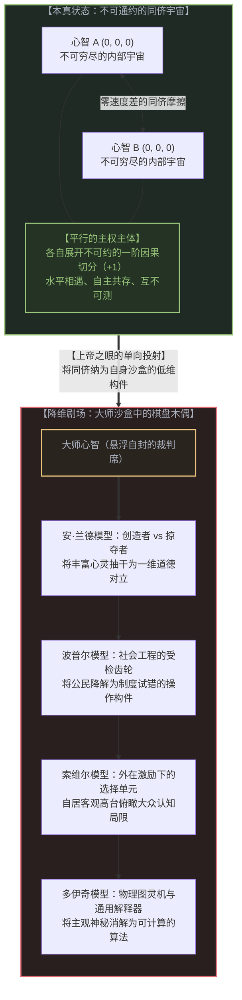
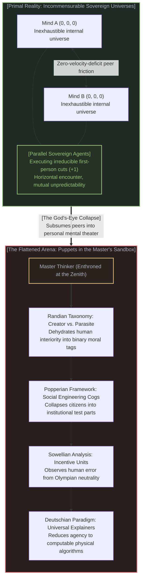
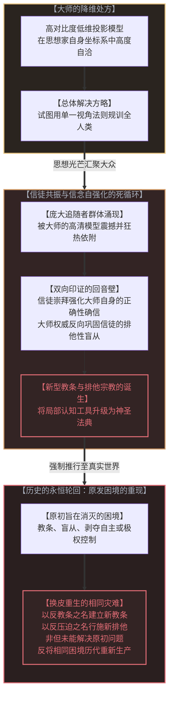
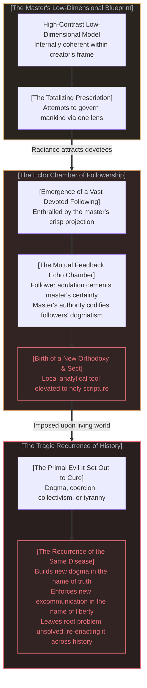
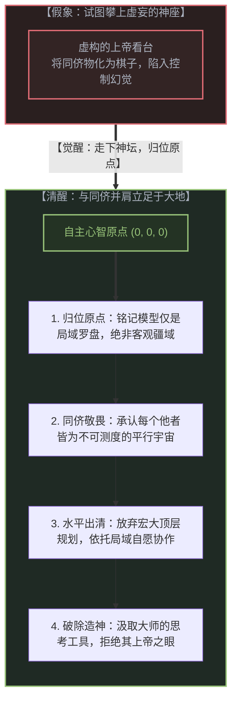
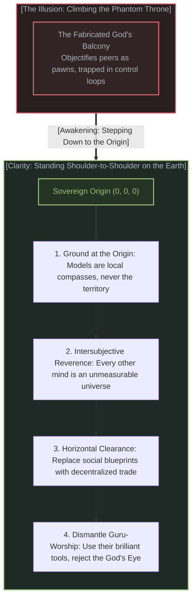

# 隐秘的上帝之眼：宏观大师的共同失忆与降维解法的必然破产 / The Invisible God's Eye: The Master Thinker's Amnesia and the Fatal Trap of Low-Dimensional Solutions

*人类思想史上最卓越的心智，大多拥有看清宇宙与社会宏观模式的罕见禀赋；然而，他们几乎无一例外地陷入了同一种认知失忆：忘却了自己并非悬浮于天地之外的造物主，而只是身处实在内部、依托局域视界艰难勘探的普通心智。一旦心智悄然换上这只隐秘的上帝之眼，所有同侪便被单向降解为自身沙盒中的低维木偶。正因他们比世人看得更清晰，才更容易将自己的投影当成世界的全貌，并自然汇聚起庞大的追随者。信徒的崇拜与大师的确信交织成闭合的回音壁，将局域模型铸造为新的神圣教条；这非但未能化解原初的困境，反而在历史长河中一次又一次地重新生产出同一种灾难。 / The most brilliant minds in intellectual history possess the rare gift of perceiving vast macroscopic invariants across nature and society; yet almost without exception, they succumb to the identical epistemic amnesia: forgetting that they are not an omniscient deity looking down from above, but merely another situated mind navigating reality through its own local horizon. The moment a mind adopts this invisible God's eye, fellow sovereign minds cease to be seen as parallel universes; they are flattened into low-dimensional pawns within that thinker's private sandbox. Precisely because master thinkers see their patterns so clearly, they mistake their internal projection for reality itself and understandably accumulate vast followings. The mutual adulation between master and disciples forms a closed echo chamber, hardening a local model into rigid orthodoxy; far from resolving the original crisis, this dynamic reintroduces the identical tragedy again and again across the course of human history.*

---

## 一、 奥林匹斯之巅的诱惑：宏观洞察者的非凡天赋 / 1. The Lure of Olympus: The Rare Gift of the Macroscopic Mind

人类思想史上有一群极其罕见的心智。他们拥有常人难以企及的高信息带宽与抽象概括能力，能够穿透日常琐碎纷乱的感官表象，直接捕获宇宙、自然与人类社会深处的宏观不变性。

在理论物理学与宇宙学中，从牛顿的万有引力钟表宇宙，到拉普拉斯那台无所不知、能够凭借微分方程推演过去与未来的机械智能假想，再到爱因斯坦将时间空间化、将现实冻结为一张四维静态时空网的构想，思想家们始终在尝试搭建一套能够囊括一切的宏观全景。

在社会哲学、政治经济学与知识论的殿堂中，同样站立着一群洞见卓绝的巨人：
* **卡尔·波普尔**以手术刀般的逻辑解构了历史决定论与封闭社会，提出以可证伪性为核心的试错法则，并构建了著名的零星社会工程构想；
* **安·兰德**以如炬的激情刺穿利他主义话语对个体的绑架，捍卫首创者的至高主权与理性自私的道德力量；
* **托马斯·索维尔**以冷峻犀利的经验分析，揭穿知识精英的非约束性视界迷思，指明经济学中没有解决方案、只有权衡取舍的深层约束；
* **戴维·多伊奇**则以大开大合的宇宙视角宣告解释的无穷开端，断言人类心智是通用的问题解决器，只要不违背物理定律，一切问题皆可迎刃而解。

无可否认，这些思想家所看到的模式，确实比他们同时代的多数人更加清晰、更加深刻。他们所提供的概念工具，极大地扩展了人类理解世界的坐标系。

然而，正是在这种高对比度的清晰感面前，一个潜伏在认知机制最底层的致命倒错悄然发生了。

---

Human intellectual history is punctuated by a rare lineage of towering minds. Endowed with extraordinary informational bandwidth and profound powers of abstraction, they cut through the chaotic din of sensory particulars to grasp the deep macroscopic invariants governing cosmos and civilization.

In theoretical physics, this impulse birthed Newton's clockwork mechanics, Laplace's omniscient demon calculating every past and future state through differential equations, and Einstein's static four-dimensional block universe spatializing time into an immutable geometric landscape.

In social philosophy, political economy, and epistemology, an equally formidable pantheon emerged:
* **Karl Popper** dismantled historicism and the closed society with surgical precision, championing falsification and piecemeal social engineering;
* **Ayn Rand** pierced the guilt-inducing pieties of collectivism, exalting the sovereign prime mover and the moral foundation of rational self-interest;
* **Thomas Sowell** unmasked the tragic fallacies of the "unconstrained vision," rigorously demonstrating that in an open human society there are no solutions, only trade-offs;
* **David Deutsch** proclaimed the beginning of infinity, casting human minds as universal explainers capable of solving any problem not forbidden by the laws of physics.

It is undeniable that these master thinkers perceived reality's structural patterns with greater clarity than the vast majority of their contemporaries. The cognitive instruments they forged remain indispensable lenses for navigating the world.

Yet at the precise moment their models achieved radiant, internal coherence, a fatal inversion took root within their perceptual foundations.

---

## 二、 观察者的原发性失忆：偷渡的“无处之境” / 2. The Amnesia of the Observer: The Smuggled "View from Nowhere"

这一致命转变的发生极为隐秘：**思想家在沉醉于宏观画卷的自洽时，患上了一种原发性的认识论失忆——他们忘却了自己究竟站在何处。**

正如我们在[观察者几何学与因果本体论](../objects-are-stabilized-relationships/)中一再指明的基础事实：在宇宙之中，根本不存在任何独立于观察者的无处之境。现实在根本上且永远只能在第一人称视角的原点 (0, 0, 0) 中被展开。任何一张地图，无论多么精美详尽，都必然是由某个深居局域视界之内、消耗着自身生物代谢、受限于局部信息带宽的特定心智绘制出来的。

然而，宏观大师们在建立起庞大体系的瞬间，却悄然在脑海中挪动了自己的机位。他们不再将自己的理论谦逊地表述为“这是从我这双眼睛、这个局域座标所测得的高对比度投影”，而是下意识地将自身提升为一个脱离了物理肉身、悬浮于宇宙天花板之上的神明。

他们忘记了：
1. 自己所凝视的整个人类社会或物理世界，并不是一个陈列在解剖台上的透明玻璃盒，而他们自己就站在盒子的内部；
2. 他们的“客观规律”，本质上是自身心智为了降低交互阻力而对高维复杂性进行的大幅降维剪裁；
3. **当你在纸上画下整张棋盘时，你并没有因此变成下棋的上帝，你依旧是棋盘边缘那个手握一小段粉笔的凡人。**

这种遗忘导致了一场剧烈的本体论僭越。思想家不再自知是一个探索者，而将自己视作客观规律的唯一发言人。他们所构造的理论不再是探路用的指南针，而被奉为宇宙疆域本身的替代品。

---

This tragic drift unfolds in silent increments: **intoxicated by the internal elegance of their macroscopic schema, the thinker falls prey to a primal epistemological amnesia—they forget where they stand.**

As established across the Not-a-TOE framework, reality offers no disembodied "View from Nowhere." Existence is irrevocably anchored to the first-person origin (0, 0, 0). Every map, no matter how sweeping its purview, is authored by a situated biological observer bounded by local causal horizons and operating under hard thermodynamic limits.

Yet the moment a grand architecture coalesces, the thinker quietly smuggles their vantage point outside the frame. Instead of qualifying their claims—"this is a high-contrast low-dimensional projection rendered from my idiosyncratic coordinates"—they unconsciously ascend an imaginary pedestal. They speak not as situated participants within the world, but as detached spectators hovering above it.

They forget three unyielding conditions:
1. Society and nature are not miniature terrariums displayed beneath a glass dome; the theorist is trapped inside the very medium they purport to measure;
2. Their "iron laws" are low-dimensional compression artifacts designed to economize cognitive bandwidth;
3. **Drawing a complete map of the chessboard does not elevate you into a celestial chess master; you remain a mortal gripping a stub of chalk at the board's edge.**

This amnesia constitutes an epistemological usurpation. The thinker ceases to recognize their ideas as local instruments, canonizing them instead as ontological replacements for reality itself.

---

## 三、 同侪心智的降维坍缩：从平行宇宙到沙盒木偶 / 3. The Flattening of Other Minds: From Parallel Universes to Sandbox Puppets

换上上帝之眼所带来的最残酷后果，并不体现在抽象的概念辩论中，而体现在**对其他鲜活人类心智的系统性降解**。

在真实的实在结构中，每一个人类心智都是一个拥有自主决断前沿的独立奇点。正如我们在[阴影与无限](../the-shadow-and-the-infinite/)中所揭示的：物理宇宙的复杂度与每一个独立观察者之间，横亘着接近无穷维度的广袤空间。这意味着，每一个他者都是一个与你平行、互不重叠、且永远无法被你通盘度量的完整宇宙。每一位同侪都在自己的第一人称中实时做出不可预知的因果选择（+1）。

然而，一旦思想家采纳了居高临下的上帝之眼，这种神圣的平行性便被碾压得荡然无存：**在他们眼中，其他人类心智不再是平等的自主宇宙，而退化成了其脑海沙盒中的低维投影。**

让我们审视这种坍缩在几位伟大思想家身上的具体体现：

1. **安·兰德的道德剪影**：
   在兰德的宏大世界观中，复杂深邃的人类心灵被极其粗暴地劈成两半：要么是顶天立地、理性自洽的创造者，要么是寄生依附、道德败坏的掠夺者。世间无数在迷茫中挣扎、在矛盾中摸索、具有丰富层次与内在温情的普通灵魂，在她的透镜下被剥夺了一切主观维度，硬生生压成了一维的道德符号。她看不见真实的人，她只能看见自己小说大纲里的功能角色。
2. **卡尔·波普尔的工程元件**：
   在波普尔构想的开放社会图景中，人类被视作制度试错的参与构件。然而，究竟由谁来站在社会外部裁决一项试验是否证伪？由谁来充当客观中立的调试工程师？在他自上而下的冷峻分析中，社会成了巨大的实验流水线，而同侪心智的主观信仰与非理性依恋，极易被当作阻碍理性批判的落后杂音。
3. **托马斯·索维尔的激励单元**：
   索维尔对非约束性视界的批判堪称经典，但他自己同样站在一个全知观赛者的包厢中，审视芸芸众生在不同体制下的决策行为。在他的视野里，人们如同由价格与规则所驱动的理性选择单元。他指出了大众由于信息分散而无法被计划，但他自己的叙述口吻，却仿佛已将这一机制完整闭环地收入囊中。
4. **戴维·多伊奇的通用图灵机**：
   多伊奇将心智定义为能够包含所有物理规律表征的通用解释器。在这幅壮丽的物理主义画卷里，主观意识的深邃不可测性被轻轻拂去，人被等同于信息处理系统。他确信只要解释能力无限扩展，现实的一切黑暗都能被驱散，却忽略了任何解释者本身就是身处局域迷雾中的参与者，解释永远无法跑在存在的前面。

他们之所以能把模型造得如此晶莹剔透，正是因为他们把活生生的人简化成了纸面上的剪影。**正是因为他们比常人看得更清晰，他们才更有底气将自己的高清投影误认为宇宙的本体。**

---

The most devastating consequence of adopting the God's Eye is not theoretical; it is **the systematic degradation of other living human minds**.

In the actual causal topology of reality, every conscious mind is a sovereign, self-originating singularity. As demonstrated in [The Shadow and the Infinite](../the-shadow-and-the-infinite/), the dimensional gulf separating the physical continuum from any observer's perceptual frame is effectively unbounded. This implies an unyielding truth: every other human being is a parallel, incommensurable universe operating from their own irreducible origin (0, 0, 0), executing their own living causal choices (+1).

Yet the moment a thinker adopts an Olympian vantage, this sacred horizontal parity is obliterated: **other minds cease to be parallel universes and are collapsed into low-dimensional projections inside the master's private sandbox.**

Consider how this reduction manifests across our case studies:

1. **Ayn Rand's Moral Silhouette**:
   In Rand's philosophy, the immense, tender complexity of the human spirit is bifurcated into a binary caricature: the heroic, sovereign creator versus the pathetic, parasitic second-hander. The countless millions who stumble through grief, ambiguity, self-sacrifice, and non-linear discovery are denied interiority, compressed into two-dimensional foils. Rand does not see real humans; she sees functional pawns drafted to serve her ideological narrative.
2. **Karl Popper's Engineering Cogs**:
   In Popper's open society, citizens are marshaled into an institutional mechanism of trial, error, and falsification. But who occupies the neutral supervisory watchtower determining what counts as a failed experiment? Within his top-down analytical architecture, society becomes a laboratory, and the irrational commitments of real human souls are dismissed as obstructive static.
3. **Thomas Sowell's Incentive Units**:
   Sowell's teardown of utopian social planning is brilliant, yet his own perspective speaks from an unexamined balcony above the crowd. Real people are parsed as decision-making nodes responding to localized constraints and institutional incentives. He demonstrates why planners cannot aggregate dispersed knowledge, yet his own diagnostic gaze assumes a comprehensive panoptic grasp of the trade-offs at play.
4. **David Deutsch's Universal Turing Machines**:
   Deutsch characterizes minds as universal explainers capable of mirroring any physical process through computation. In this clean cosmological vision, the intractable mystery of first-person subjectivity is dissolved into information processing. Convinced that explanatory reach is unconstrained, he overlooks the fact that every explainer is embedded within local horizons—explanation can never outrun the ground of being.

These thinkers constructed such dazzling models precisely because they drained living people of their intractable dimensions. **Because their projections were so high-contrast and sharp, they mistook their personal lens for the bedrock of reality.**

---

## 四、 为何终极方案注定破产：降维蓝图撞上鲜活实在 / 4. Why Their Solutions Inevitably Fail: When Low-Dimensional Blueprints Collide with Living Reality

这揭开了思想史上一道挥之不去的悖论：**为什么那些由最高智慧所构想出的宏大社会设计或哲学方案，一旦付诸实践，几乎无一例外地走向失效、异化，甚至反向演变为教条宗派？**

为什么客观主义的追随者频频演变成排他苛刻的原教旨信徒？为什么自由市场的极端原教旨模型无法自发消除社会的撕裂与信任危机？为什么致力于消除教条的批判理性主义，最终会在学术界蜕变为新的官僚话语壁垒？

答案在数学与因果拓扑上是注定的：**宏观大师开出的所谓“解决方案”，根本不是对真实世界的疗愈，而仅仅是在他们个人坐标系中绘制出的一张分辨率更高的低维投影。**

当这套方案遭遇鲜活世界时，它必然遭遇惨烈的反噬：
1. **多维实在的因果溢出**：
   现实拥有无穷无尽的自由度。每一个人都在依照自己独特的历史记忆、情感切身性与当下的具体阻力做出行动。这亿万个自主切分（+1），永远不可能被严丝合缝地塞进任何单一思想家所设计的一维或二维轨道之中。真实世界必然会从图纸的缝隙中大量喷涌而出。
2. **怪罪现实的偏执倒错**：
   面对模型的失效与社会的阻抗，换上上帝之眼的思想家很少反思是自己的机位出了问题。相反，他们会产生一种居高临下的愤懑与傲慢。他们开始归咎于现实本身：“是世人太不理性”、“是人性太贪婪懦弱”、“是大众尚未理解我的真理”。他们将自己投影与真实世界之间的碰撞，描绘成真理被凡庸所玷污的悲剧，却从未察觉：**是他们自己试图用一张二维的剪纸，去包裹一座奔涌喷发的活火山。**
3. **信徒群聚与信念的自强化闭环**：
   正是由于大师们的非凡天赋，他们所构建的低维模型展现出震撼人心的解释力与美学自洽。这种思想光芒自然而然地吸引了大量追随者。然而，庞大的信徒群体随即构成了一个极其危险的社会回音壁：信徒的狂热崇拜与集体依附，反向强化了大师对自身模型无懈可击的确信；而大师日益神圣化的自信，又进一步固化了信徒们的排他性盲从。双方在狂欢中达成闭环：凡是不赞同大师体系的人，都被预先判定为智识低劣或道德败坏。
4. **历史的永恒轮回：原发困境的换皮再生产**：
   这个双向闭环最终酿成了思想史上极具讽刺意味的悲剧：大师原本是为了解决某种原初困境而出发——波普尔旨在瓦解教条极权，安·兰德旨在砸碎集体主义枷锁，市场理论家旨在打破行政专断垄断。然而，当大师的低维视角被信徒群体供奉为不可逾越的神圣教条时，他们便以消除教条为名，建立起了新的思想裁判所；以捍卫自由为名，演变出了残酷的异端清洗。他们非但未能解决原初的问题，反而以一种换皮重生的形态，在漫长的历史长河中一次又一次地将同一场灾难重新搬上舞台。

你无法在低维投影中解决多维世界的冲突，因为冲突的根源恰恰来自于你把多维的多样性强行压扁成了单一平面的竞争。任何宣称能够终结人类所有困局的总体方案，从其诞生的那一秒起，就已经注定了它破产的命运。

---

This exposes an enduring paradox in the history of thought: **why do grand philosophical systems and societal blueprints authored by geniuses invariably misfire, decay into dogma, or mutate into the very dogmatism they set out to destroy?**

Why do devotees of Objectivism so often degenerate into rigid, puritanical sects? Why do ideological free-market dogmatists fail to account for social fragmentation and institutional rot? Why does critical rationalism, conceived to purge dogma, harden within academia into an exclusionary barrier of prestige?

The answer is geometrically and topologically inescapable: **the "solution" offered by the master thinker is not a cure for reality; it is merely a sharper, high-contrast, low-dimensional projection constructed within their own mental frame.**

When this blueprint collides with the living territory, failure is structurally guaranteed:
1. **Causal Overflow of the Multi-Dimensional Real**:
   The living world possesses infinite degrees of freedom. Countless billions of conscious beings act from their own private histories, emotional imperatives, and visceral local frictions. These irreducible free variables (+1) will never fit inside any single thinker's coordinate system. Reality inevitably ruptures the seams of the blueprint.
2. **The Tragic Inversion of Scapegoating**:
   When their prescriptions flounder, thinkers possessed by the God's Eye rarely question their own elevated vantage. Instead, they retreat into wounded arrogance. They blame the world for failing the theory: "mankind is too corrupt," "the masses lack rationality," "they refuse to heed the truth." They frame the friction as a tragedy of human inadequacy, never recognizing the foundational category error: **they attempted to smother an erupting volcano with a two-dimensional sheet of paper.**
3. **The Compounding Echo Chamber of Followership**:
   Because of their extraordinary brilliance, master thinkers construct low-dimensional models possessing breathtaking explanatory power and aesthetic symmetry. This intellectual radiance understandably attracts vast legions of devoted followers. Yet this very devotion constructs a perilous social echo chamber: the adulation of disciples reinforces the master's conviction in the absolute correctness of their model, while the master's growing certitude codifies the disciples' dogmatic loyalty. Together, they form a closed loop: anyone questioning the framework is dismissed as intellectually defective or morally bankrupt.
4. **The Historical Recurrence of the Same Disease**:
   This mutual echo chamber produces the deepest irony in intellectual history: the master set out to cure an original pathology—Popper to dismantle dogmatic totalitarianism, Rand to smash collectivist subjugation, free-market pioneers to eliminate state monopolies. Yet the moment their low-dimensional projection is enshrined by followers as sacred dogma, the movement erects a new ecclesiastical court in the name of reason, enforcing ideological excommunication in the name of liberty. Far from solving the original problem, this social amplification loop reintroduces the identical tragedy again and again across human history under a fresh intellectual label.

You cannot resolve multi-dimensional human conflict inside a low-dimensional sandbox, for the conflict was manufactured by flattening high-dimensional divergence into a single plane in the first place. Every grand prescription that promises to resolve the human condition is bankrupt from its inception.

---

## 五、 消解上帝之眼：在无顶棚的世界中与同侪共处 / 5. Dissolving the God's Eye: Living Among Equals in an Uncapped World

如果我们识破了宏观大师们的原发性失忆，一个清醒的心智应当如何立足？我们如何既能享受宏观洞见的锐利，又免于陷入上帝之眼的幻觉？

这要求我们在认知机制中实施四项根本性的实践重塑：

### 1. 归位原点：铭记模型仅是局域罗盘
无论你的抽象模型推演得多么宏大、公式多么严密，永远不要忘记你始终深居于第一人称的原点 (0, 0, 0) 之上。你的理论不是从天而降的永恒法典，它只是你在面对无边无际的自然与社会时，为了防止心智迷航而亲手绘制的局域指北针。指北针指向北方，并不等于指北针创造了北方；一旦现实的阻力与指北针发生冲突，必须随时准备修正自己的指针，而不是咒骂山川地形长错了位置。

### 2. 同侪敬畏：承认每个他者皆为不可测度的平行宇宙
必须戒除将同侪粗暴分类为某种功能性标签的傲慢习气。无论对方在你眼中看似多么平凡、多么充满局限，在他的第一人称视界内部，都展开着一个和你同样真实、同样深不可测的宇宙。你永远无法用一套简单的心理学、经济学或社会学公式将另一个心智全盘解构。放下将他人当成自身沙盒受测变量的狂妄，重新建立起面对平等同侪的敬畏与审慎。

### 3. 水平出清：放弃宏大顶层规划，依托局域自愿协作
既然没有任何单一心智能够拥有全知视角，那么一切试图由顶层精英为人类设计总体幸福方案的尝试，都不过是低维权力的傲慢暴行。社会的真正秩序与活力，从来不是从某位哲学王的图纸上被设计出来的，而是由千千万万平等的个体在具体的生产、交易、对话与试错中，通过水平的博弈与自愿协作自发涌现出来的。文明不需要一个总工程师；文明需要的是保护每个个体免受总体图纸碾压的规则边界。

### 4. 破除造神：汲取大师的思考工具，拒绝其上帝之眼
我们可以深情地研读波普尔的试错法、安·兰德对创造力的赞美、索维尔对约束的洞察、以及多伊奇对解释力的坚持。这些都是人类智识宝库中最锋利的解剖刀。但我们必须学会剥离附着在这些思想家身上的上帝之眼：我们接纳他们作为卓越探险家所带回的地形草图，但坚决拒绝登上他们自封的神坛，拒绝成为任何思想帝国的低维门徒。

---

Once we diagnose this primal amnesia, how does a sovereign mind orient itself? How do we harness the penetrating brilliance of macroscopic patterns while remaining entirely immune to the siren song of the God's Eye?

This requires four fundamental shifts in epistemic practice:

### 1. Ground at the Origin: Models as Compasses, Not Continents
No matter how sweeping your theoretical deductions, never forget that you reside irrevocably at (0, 0, 0). Your theory is not an eternal divine decree; it is a pocket compass forged to preserve orientation across the unbounded wilderness. A compass pointing north does not author the magnetic poles; the moment terrain contradicts your compass, adjust your heading—do not demand that the mountains conform to the needle.

### 2. Intersubjective Reverence: Every Peer is an Incommensurable Universe
Relinquish the habit of categorizing peers into functional or ideological caricatures. However ordinary another human being appears, their interiority harbors a universe every bit as vast, sovereign, and intractable as your own. You will never exhaust another mind through economic equations or moral archetypes. Dismantle the impulse to treat fellow travelers as test subjects in your private sandbox.

### 3. Horizontal Clearance: From Grand Architecture to Spontaneous Coordination
Because no single mind can achieve total perspective, every scheme to engineer human flourishing from a central blueprint is an act of low-dimensional violence. True civilizational order is never dictated from the drafting table of a philosopher king; it emerges horizontally through decentralized trade, voluntary association, reciprocal friction, and local problem-solving among equals. Civilization requires no master architect; it requires rules of mutual respect that protect individual sovereignty from being pulverized by grand designs.

### 4. Dismantle Guru-Worship: Embrace the Instrument, Reject the Throne
We can read Popper on falsification, Rand on productive virtue, Sowell on structural trade-offs, and Deutsch on explanatory depth with gratitude. These are some of the sharpest analytical scalpels in human history. Yet we must sever the scalpels from the illusion of omniscience: embrace the topographical sketches they charted, but refuse to bow before their phantom thrones, rejecting lifelong discipleship in any closed ideological church.

---

## 六、 结语：没有天花板的无界地平线 / 6. Epilogue: The Horizon Without a Ceiling

整个宇宙并不存在任何贵宾看台。

高悬在人类头顶的苍穹之中，没有神明的单向透镜，也没有全知的超级裁判。历史从来不是在某个居高临下的剧场舞台上展开的一出木偶剧，现实是一座向所有方向无限延展的开阔原野。

真正成熟的心智，从来不需要通过扮演上帝来证明自己的深刻。恰恰相反，一个人认知的真正成熟，始于他终于有勇气毅然走下那座虚妄的神坛，踏踏实实地站回大地的泥土之中。

看清宏观的模式，是心智的非凡力量；但看清自己仅仅是千百亿探索者中的一员，才是心智的最高觉醒。

在这个没有天花板的世界里，你不需要去拯救谁，不需要去规训谁，更不需要把任何人塞进你的宏伟图纸。最庄严的生存姿态，莫过于与身边那些同样不可穷尽的同侪并肩而立，各自握紧手中的微光，在这片永不闭合的辽阔现实中，坦然迈出属于自己的下一步。

---

The universe possesses no VIP gallery.

Above the open expanse of reality, there is no one-way observation window, no celestial control room, no omniscient cosmic auditor. History is not a puppet play staged before an elevated amphitheater; it is an unbounded continuum stretching in every direction across the living earth.

A mature mind does not prove its depth by pretending to be God. Epistemic maturity begins with the courage to step off the phantom pedestal and stand firmly upon the soil of immediate presence.

To discern macroscopic invariants is the rare brilliance of the intellect; but to remember that you are merely one among billions of sovereign explorers is the ultimate awakening of wisdom.

In this universe without a ceiling, you are not called to orchestrate humanity, to discipline the recalcitrant, or to force living souls into your architectural blueprints. The most dignified posture available to a human mind is to stand shoulder-to-shoulder with inexhaustible peers, honoring the unfathomable depth of each other's horizons, and stepping forward with clear eyes into the open, uncharted real.
