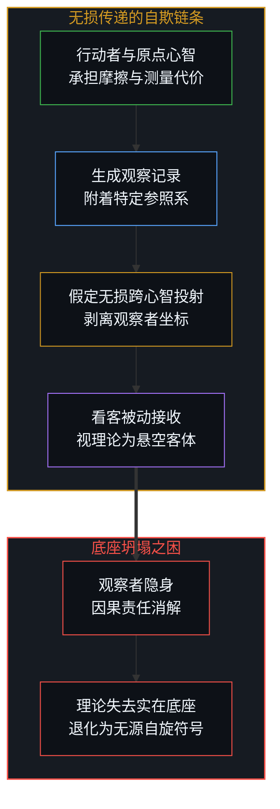
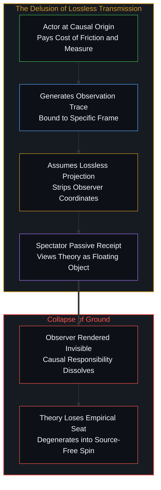
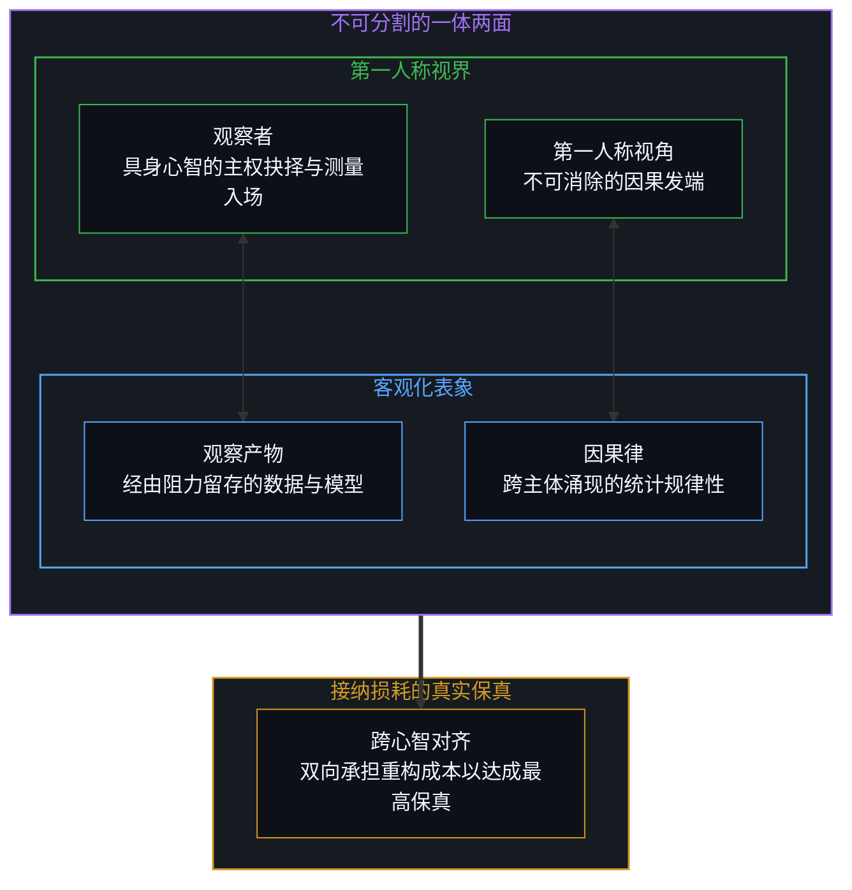
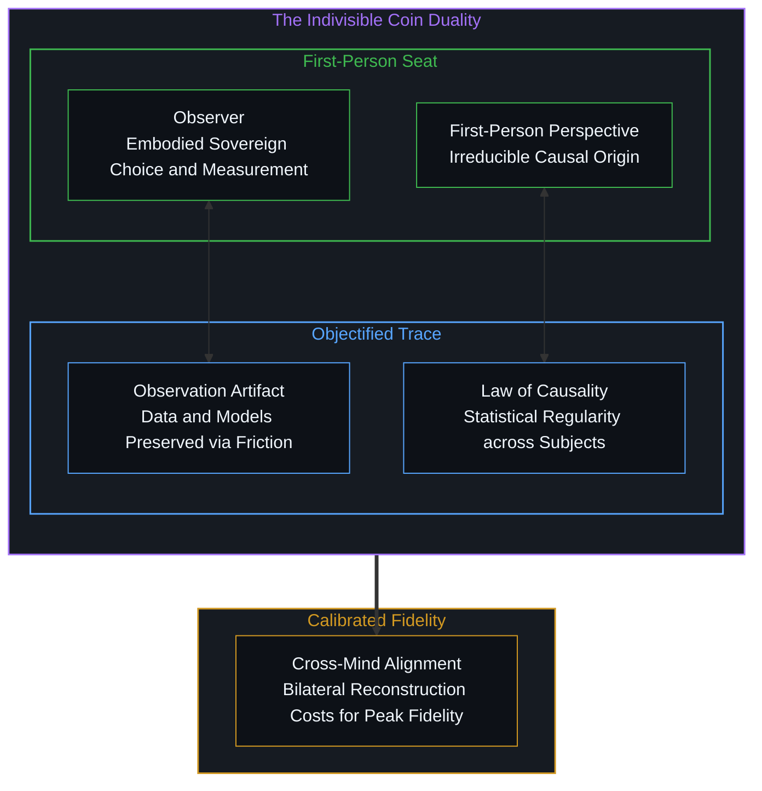

# 观察者的隐身与无损传递的妄念 / The Invisible Observer and the Delusion of Lossless Transmission

*抹杀观察者的无损神话抽空理论底座，接纳损耗方能达成最高保真 / Erasing the observer hollows theory; embracing loss yields peak fidelity.*

人们习惯于将世界粗暴地割裂为两个对立的阵营：一端是置身风暴中央、承受不确定性碾磨的行动者，另一端则是端坐在洁净看台上、冷静记录规律的看客。这种看似无法逾越的本体论鸿沟，并非源于实在自身的天然阻隔，而是源于认知建制对观察者与观察动作的强制剥离。当一套理论试图宣称自己拥有凌驾于所有主观心智之上的普适客观性时，它暗中植入了一个致命的妄念：跨越心智边界的无损传递是可能实现的。

It is customary to fracture the world into two mutually alienated camps: on one side stands the actor, trapped in the center of the storm and ground by the uncertainties of lived exposure; on the other sits the spectator, perched calmly on an immaculate balcony recording regularities from afar. This ostensibly unbridgeable ontological chasm is not a natural divide of reality, but an artifact of an epistemic apparatus forcibly severing the observer from the act of observation. Whenever a theoretical edifice attempts to claim universal, unconditioned objectivity above all subjective minds, it surreptitiously harbors a fatal fantasy: that lossless transmission across distinct minds is possible.

这一妄念为了将观察结果锻造为可在心智间自由搬运的现成客体，预先将做出测量的特定观察者强行抹除。然而，悖论恰恰在此处爆发：一旦观察者隐身，观察记录便失去了因果原点与通向物理的接入点——它不是物理性的接入点，而是让物理得以显现的接入点，即信息跨越为宏观印记的生命锚点；整座精密构建的理论大厦瞬间沦为无源自旋的符号游戏。唯有放弃对无损传递的执念，承认跨心智投射伴随着不可消除的损耗与摩擦，并将观察者与观察视作与因果律及第一人称视角深度同构的一体两面，心智才能在动态校准中达成最高限度的真实保真。

In order to forge observations into pre-packaged objects that can be shuttled between minds without friction, this fantasy must first render the specific, embodied observer entirely transparent and invisible. Yet it is precisely here that the performative paradox erupts: the moment the observer vanishes, the empirical record loses its causal origin and the access point for the physical—not a physical access point, but the access point through which the physical comes into being; leaving the elaborate theoretical edifice to collapse into a groundless game of unanchored symbols. Only by relinquishing the obsession with lossless transmission, acknowledging that every cross-mind projection carries irreducible loss and friction, and recognizing the observer and observation as an indivisible duality isomorphic to causality and the first-person perspective, can minds attain maximal authentic fidelity through dynamic calibration.

## 一、 割裂的表相：行动者与看客的伪鸿沟 / 1. The Surface Divide: The Pseudo-Chasm Between Actor and Spectator

在经典知识叙事中，行动者与看客被赋予了截然不同的本体论地位。行动者深陷于当下的局限视界，其判断充斥着利害算计、情绪波动与认知盲区，因而被判定为因果链条内部的被动受力点。与之相对，看客则被塑造成拥有全局视野的超然法官，手握无偏倚的度量衡，以事后诸葛的姿态裁决成败走向。正如我们在探讨[隐性自由变量与权力的事后幻相](../the-free-variable-and-the-retrospective-illusion-of-power/)时所揭示的，这种事后建构的必然性叙事，抹杀了行动者在原点处承受的风险敞口，从而营造出一种看客能够凭空洞悉全局的虚妄特权。

Within classical epistemological narratives, the actor and the spectator are assigned radically divergent ontological ranks. The actor is depicted as mired in the narrow horizons of the immediate moment, their judgment clouded by stakes, emotional flux, and blind spots, and thus classified as a passive node bound within the causal chain. Conversely, the spectator is cast as an aloof judge endowed with a panoramic vantage point, wielding unbiased scales to decree outcomes in hindsight. As we uncovered in our examination of [the invisible free variable and the retrospective illusion of power](../the-free-variable-and-the-retrospective-illusion-of-power/), this retrospectively constructed narrative of inevitability erases the risk exposure borne by the actor at the origin, fabricating an empty privilege wherein the bystander claims unearned omniscience.

这种看似深邃的本体论鸿沟，拆解到底只是一种功能性的认知错觉。看客之所以自以为超然，是因为他们将自己的观察动作伪装成了免税的通行证。他们遗忘了看客本身同样是一个具身的心智，同样必须调动有限的注意力、划定测量边界，并在海量噪音中筛选信号。看客所记录下的任何一条客观规律，都不是世界自发吐露的心声，而是看客心智与外部刺激剧烈摩擦后的局部投影。当看客宣称自己与行动者存在本体论区隔时，他们只是把自身作为[不可还原的观察者](../the-irreducible-observer/)所承担的代谢成本与认知约束悄悄掩埋了起来。

This ostensibly profound ontological chasm is, upon closer inspection, merely a functional epistemic illusion. Spectators believe themselves to be detached only because they disguise their own act of observation as a toll-free pass. They forget that the spectator is themselves an embodied mind, equally forced to allocate finite attention, carve measurement boundaries, and filter signals from torrential noise. Any objective regularity recorded by a spectator is not the world unburdening its private thoughts, but a localized projection forged through intense friction between the observer's cognitive model and incoming stimuli. When spectators claim ontological separation from actors, they merely conceal the metabolic costs and cognitive constraints they bear as an [irreducible observer](../the-irreducible-observer/).

## 二、 无损的妄念：透明观察者与悬空理论 / 2. The Delusion of Losslessness: The Transparent Observer and Floating Theory

认知建制之所以处心积虑地维系看客与行动者的虚假隔离，其深层推手是对跨心智无损传递的执迷。在传统观念中，真理必须被包装为一种能够脱离发端现场、在不同个体间无差别复刻的标准集装箱。为了让数学公式、实证定律或道德戒条能够在陌生心智中原样落地，理论设计者必须剔除任何带有个人体温的痕迹。他们必须向受众保证：这项观察结果是客观的客体本身，它不依赖于记录者的视力好坏、仪器精度或推断偏好。

The underlying motive driving cognitive institutions to maintain this artificial divide between spectator and actor is an obsession with lossless cross-mind transmission. In orthodox dogma, truth must be packaged as a standardized cargo capable of being replicated identically across diverse individuals, detached from the scene of its emergence. For mathematical equations, empirical laws, or moral edicts to land unaltered within alien minds, the architects of theory must sanitize every trace of embodied warmth. They must assure their audience that the observation is the unvarnished object itself, uncontaminated by the recorder's sensory acuity, instrumental precision, or inferential bias.

要让这种无损传递的神话成立，观察者就必须被强行隐身。在科学论文的被动语态里，没有某人看见了指针偏转，只有指针被观察到偏转；在哲学体系的宏大建构中，没有思想者在特定语境下的痛苦求索，只有理念自发显现的逻辑必然。这种去主体化的修辞术成功制造了无损传递的假象，却在同时摧毁了理论自身的存在根基。正如我们在剖析[无人能持有的功能主义](../the-functionalism-no-functionalist-can-hold/)时所指出的，一套宣称能够客观解释所有心智机制的理论，却找不到任何一个活态心智能够容身其中。当观察者在理论内部悉数隐匿，整套叙事便失去了它的因果针脚，变成了一张无处安放、悬浮在虚空中的幽灵地图。

To sustain the myth of lossless transmission, the observer must be rendered forcibly invisible. In the passive voice of scientific papers, no human gaze witnesses the needle deflect; instead, the deflection was simply observed. In the grand architecture of philosophical systems, the situated struggle of an embodied thinker is erased, replaced by the spontaneous self-unfolding of logical necessity. This rhetorical de-subjectification constructs the illusion of lossless transmission, yet simultaneously dynamites the ground beneath the theory itself. As we observed when dissecting [the functionalism no functionalist can hold](../the-functionalism-no-functionalist-can-hold/), a framework professing to account for all mental operations objectively cannot find a single living mind capable of occupying its vantage point. When the observer is vanished from within the model, the entire discourse loses its causal anchors, drifting as a spectral map suspended in a void.

跨心智的交流天然存在拓扑失真。每一个心智都是一个独特的因果演化历史，拥有不可替代的经验积淀与参照系。把高度依赖特定原点的观察结论硬塞给另一个心智，若不经过接收端的重新编码与具身校验，所传递的就只是一串脱水的代码符号。正如[理解的非对称性](../the-asymmetry-of-understanding/)所昭示的，企图抹杀这一重构过程的无损传递，其终局不是消除了误解，而是让接收者误以为自己已经占有了真理，从而心安理得地放弃了亲自入场测量的认知主权。

Communication across distinct minds is inherently subject to topological distortion. Every mind is a unique lineage of causal history, harboring an irreplaceable reservoir of lived experience and internal coordinates. Forcing an observation born of one singular origin into another mind without requiring the receiver to recode and re-verify it embodied produces nothing more than dehydrated symbolic syntax. As demonstrated in [the asymmetry of understanding](../the-asymmetry-of-understanding/), the fantasy of lossless transmission does not eliminate misunderstanding; rather, it lulls the recipient into the delusion of possessing truth, thereby granting them permission to surrender their cognitive sovereignty and abstain from personal measurement.

## 三、 一体两面：观察者与观察的同构共生 / 3. Two Sides of a Coin: The Isomorphic Unity of Observer and Observation

破除上述困局的关键，在于识别出观察者与观察动作之间的内在同构性。认知建制习惯于将观察者视为施力主体，将观察视作产出成果，进而幻想成果可以被割裂保留，而主体可以被随手丢弃。然而，这两者并非先后相继的因果链环，而是如同因果律与第一人称视角一样，构成了同一枚认知硬币不可分割的两面。

The antidote to this impasse lies in recognizing the internal isomorphism uniting the observer and the act of observation. Epistemic institutions routinely categorize the observer as an operating agent and the observation as an extracted product, nurturing the fantasy that the product can be preserved intact while the agent is discarded. Yet these are not sequential links in a linear chain; like the law of causality and the first-person perspective, they constitute the two indivisible faces of a single cognitive coin.

从正面审视，它是第一人称的具身体验，是观察者主动投掷注意力、与现实发生碰撞并承受阻力的主权历程；从反面审视，它显现为被度量、被记录并可在不同主体间达成统计不变性的观察产物。正如我们在剖析[主权抉择的双面性与观察的客体化](../the-two-sided-nature-of-sovereign-choice-and-the-objectification-of-observation/)时所阐述的，脱离了主权抉择的客体规律只是一纸空文，而脱离了客观阻力的主观抉择则沦为空想。试图保留观察而抹杀观察者，等同于妄图只要硬币的背面而削去它的正面。进一步地，正如在[寻觅的语法与淡出的观察者](../the-grammar-of-finding-and-the-fading-observer/)中所揭示的，两面的不可兼视源于观察朝向的几何排他性，并不意味着实在本体的断裂；观察者在开辟视界时的自然隐退，恰恰是其作为先验基底的证明，而非可以任意剔除的冗余。

Viewed from the front, it is an embodied first-person encounter: the sovereign trajectory wherein an observer projects attention, collides with resistance, and absorbs friction. Viewed from the reverse, it manifests as the measured, recorded trace that achieves statistical invariance across observers. As articulated in our analysis of [the two-sided nature of sovereign choice and the objectification of observation](../the-two-sided-nature-of-sovereign-choice-and-the-objectification-of-observation/), an objective regularity severed from sovereign choice is a dead letter, while subjective volition divorced from objective resistance is mere daydreaming. Demanding observation while erasing the observer is identical to demanding the reverse of a coin while shaving away its obverse. Furthermore, as demonstrated in [The Grammar of Finding and the Fading Observer](../the-grammar-of-finding-and-the-fading-observer/), the impossibility of simultaneous capture stems from the geometric exclusivity of viewing orientations rather than an ontological fracture; the observer's natural fading as it opens the observational field proves its status as an enabling prior ground rather than an optional redundancy.

在这一共生构型中，观察者与观察构成了充满张力的统一体。观察者赋予观察以意义的原点和测量的基准，而观察则为观察者提供了勘验自我边界、校准内部模型的反作用力。没有观察者的入场，所谓的世界不过是一团无法被解析的潜在态；没有观察记录的沉淀，观察者也无法在时间的流逝中维持连续的自我同一性。任何自洽的理论体系，都必须将其自身标定为观察者与世界交互所搭建的脚手架，而不是凌驾于心智之上的终极法庭。正如我们在[没有外部记账员](../no-outside-scorekeeper/)中所进一步阐明的，并不存在悬于生命之上的客观记账员，唯一具备因果权能的正是抉择瞬间的第一人称认知模型；理论的生命力恰恰在于它承认自身的局部性与工具性，从而始终向第一人称的鲜活介入保持开放。

Within this symbiotic architecture, observer and observation form a tensely unified whole. The observer endows observation with a semantic origin and a baseline of calibration, while observation provides the counter-force through which the observer maps its own limits and tunes internal models. Absent an embodied observer entering the field, the world remains an unparsed sea of potentiality; absent the crystallization of observational traces, the observer cannot maintain continuous self-identity across time. Any coherent theoretical framework must recognize itself as temporary scaffolding erected during interaction between an observer and reality, rather than a final court of appeals hovering above living minds. As further articulated in [No Outside Scorekeeper](../no-outside-scorekeeper/), no objective scorekeeper hovers above living minds, and the sole sovereign causal power resides within the first-person world model at the moment of choice; the vitality of theory lies precisely in acknowledging its localized, instrumental nature, remaining forever receptive to living first-person intervention.

## 四、 接纳损耗：最高保真的现实校准 / 4. Embracing the Loss: Realistic Calibration for Maximal Fidelity

认识到观察者与观察不可割裂，并不意味着心智之间注定陷入不可通约的孤岛。相反，只有当我们主动放弃对无损传递的执念时，真正的保真才成为可能。工程实践早已证明，任何试图实现零噪声、零损耗的通信信道，其代价普遍是信息通量的暴跌或信号结构的失真。在心智与心智的交流中，迷信无损只会催生出死记硬背与教条崇拜；而接纳损耗，则逼迫接收端放弃被动吞咽，转而启动主动推断。

Recognizing the inseparability of the observer and observation does not condemn minds to mutually incommensurable solipsism. On the contrary, authentic fidelity becomes possible only when we consciously surrender the obsession with lossless transmission. Engineering practice has long shown that attempting to build a zero-noise, zero-loss communication channel demands exorbitant costs, typically precipitating a collapse in information throughput or severe distortion of signal structure. In communication between minds, idolatry of losslessness generates rote memorization and dogmatic worship; embracing loss, conversely, compels the recipient to abandon passive consumption and initiate active inference.

当一个心智向另一个心智传递某种洞见时，传递出去的从来不是理解本身，而是一组经过压缩的、带有发出者特定视角的因果痕迹。接收者如果想要真正获得这项洞见，就不能假定自己是在接收一份现成档案。正如我们在[阅读的倒错与推断的次序](../the-inversion-of-reading-and-the-order-of-inference/)中所探讨的，真正的理解是一种主动的逆向推断：阅读者必须在自己的心智现场，依据文本所提供的微弱线索，重新经历一遍建构该理论所必需的认知阻力与抉择考验。由此可见，即便发出者声称自己毫无强求、只是在“信任读者”会随时间自行领会，这种托付依然暗中将跨越心智的因果权能赋予了死寂的文本；正如[信任读者是最后的越界](../trusting-the-reader-is-the-last-overstep/)所阐明的，跨越心智鸿沟的重构，其因果动力只能来自于接收者此刻的主权抉择，而非寄宿在媒介中的隐秘引力。

When one mind transmits an insight to another, what travels is never comprehension itself, but a compressed cluster of causal traces bearing the sender's localized perspective. If the recipient desires authentic insight, they cannot presume they are receiving a finished archive. As explored in [the inversion of reading and the order of inference](../the-inversion-of-reading-and-the-order-of-inference/), authentic comprehension is active reverse-inference: the reader must stand at their own epistemic scene, retracing the cognitive friction and sovereign decisions necessary to construct the framework from fragmentary clues. From this it follows that even if a writer claims to impose nothing and merely "trusts the reader" to grasp the meaning in time, such reliance still surreptitiously attributes cross-mind causal power to dead text; as demonstrated in [Trusting the Reader Is the Last Overstep](../trusting-the-reader-is-the-last-overstep/), reconstruction across the chasm of minds can only draw its causal momentum from the recipient's sovereign choice in the present, never from an occult gravitational pull lodged within the medium.

这种以接纳损耗为前提的跨心智对齐，能够维系最高限度的保真。因为此时的保真不再被定义为两份静态文本的逐字一致，而被定义为两个独立心智在面对相似的外部挑战时，所能调动的因果推断能力的几何共振。每一个心智都保留了自身作为观察者的完整主权，每一个心智都清晰知晓自己的坐标原点。理论不再是脱离肉身的幽灵，而是重新扎根于一个个有温度、有损耗、承担着真实因果代价的鲜活生命之中。

Cross-mind alignment rooted in acknowledged loss preserves maximal fidelity. Under this paradigm, fidelity is no longer measured by the verbatim matching of static manuscripts, but by the geometric resonance of causal inference mobilized by two independent minds confronting comparable reality. Each mind retains uncompromised sovereignty as an active observer, acutely conscious of its own coordinates. Theory ceases to be a disembodied specter; it is re-anchored within living beings who bear authentic consequences, absorb necessary friction, and steward the causal origin.
