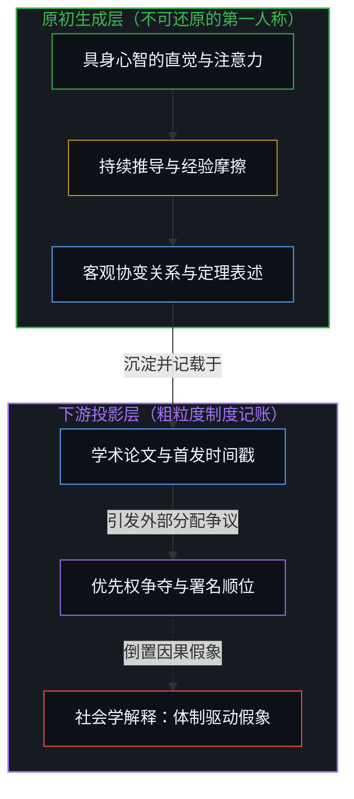
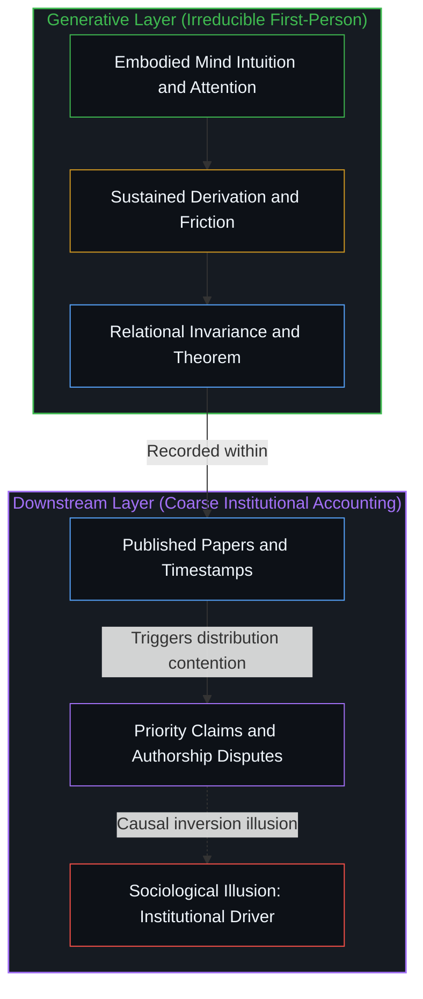
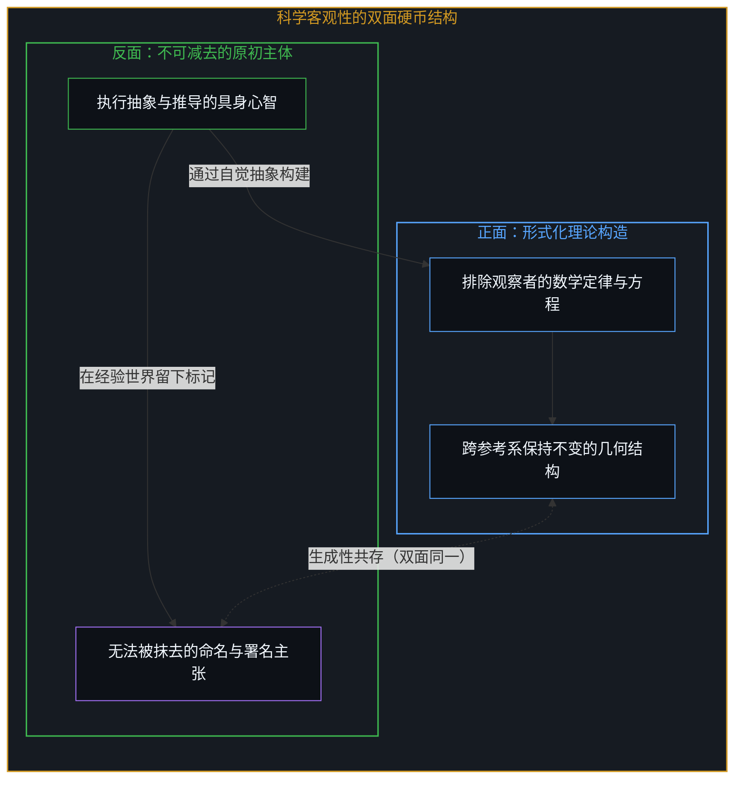
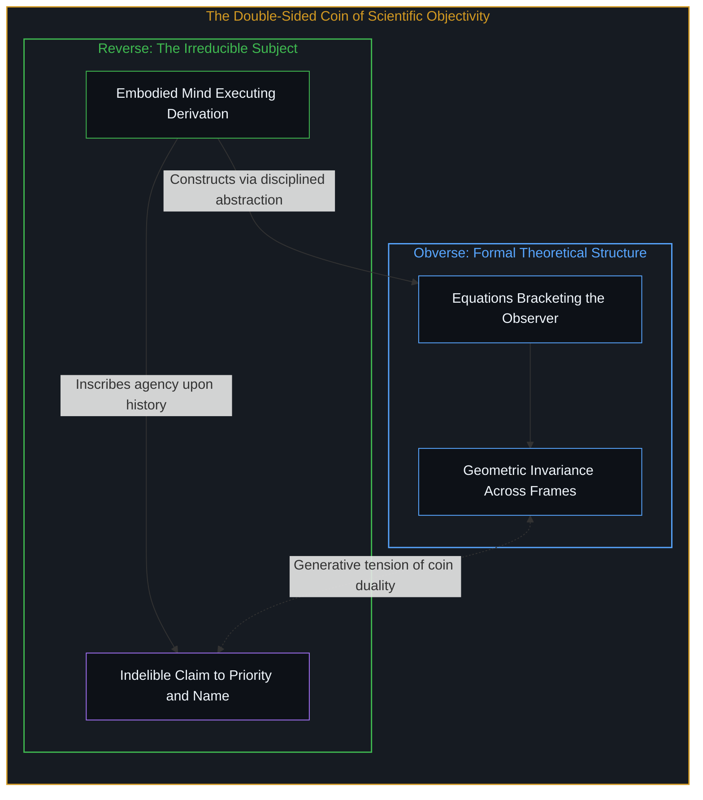

# 不可还原的观察者 / The Irreducible Observer

*客观性是主观性的成就，构建排除观察者之理论的心智无法将自身排除。 / Objectivity is an achievement of subjectivity; the consciousness that erases the observer cannot erase itself.*

科学界关于发现优先权与署名顺位的争端，常被轻率地归结为科学家的个体虚荣，或被社会学解释为论文发表机制对发现行为的逆向塑造，两种看法都颠倒了因果序列。第一人称心智不仅不可还原，且是全部理性认知与形式建构的原初先验条件。黑洞面积定理或天体碰撞不等式之所以存在，是因为特定的具体心智在深夜的沉思中注意到了某种对称性，承受了推导的摩擦并给出了表述；后续的论文、致谢与署名争执，仅是记录这些事件的下游粗粒度投影，并非生成它们的源泉。能够构建出“观察者隐去”之理论模型的心智，其自身恰恰无法从这一抽象减法中扣除；客观性并非主观性的对立面，而是主观性的艰难成就，任何声称俯瞰宇宙的“无处之景”，始于某个特定的立足之地。

Disputes over scientific priority and credit are commonly dismissed as personal vanity, or explained away by sociology as the institutional machinery of publishing that drives the discovery process, yet both conclusions invert the causal sequence. First-person consciousness is irreducible and constitutes the foundational condition for all theoretical modeling and empirical reasoning. A mathematical result such as the black hole area theorem exists only because particular living minds noticed an unmodeled invariant, endured the sustained friction of computation, and formulated the distinction; subsequent journal papers, citations, and contested authorships are merely downstream coarse-grained traces recording those moments, rather than the causal engine that generated them. The consciousness capable of constructing a formal description from which the observer drops out is also the consciousness that cannot drop itself out of the subtraction; objectivity is not the antithesis of subjectivity but its hard-won achievement, and every purported view from nowhere originates as a perspective from somewhere.

## 一、 倒置的因果与下游的记账 / 1. Inverted Causality and Downstream Accounting

大众文化与通俗科学史在审视科学家的优先权论战时，习惯将其视为一出令人尴尬的道德滑稽剧。在公认的叙事中，科学理论旨在揭示独立于观察者的世界结构，而创造这些纯正真理的学者却在论文署名、引文先后乃至首发日期的毫厘之间斤斤计较，显得滑稽而不相称。由此衍生出两种互为表里的论断：一种指责科学家在道德上存在分裂，在追求普遍真理的同时陷于微小的名誉之争；另一种则走向社会学决定论，将同行评议、学术头衔和优先权争夺视为推动科学机器运转的隐秘引擎。在[任务的委托与后果的不可让渡](../the-delegation-of-the-task-and-the-inalienability-of-consequences/)中展开的分析表明，这种归因混淆了行动的源头与事后的制度审计，将后续的评价标尺误认为了开辟边界的真实力量。

Popular history and cultural commentary on science typically frame priority disputes as mildly embarrassing ethical sideshows. In the standard narrative, scientific theories aim at the observer-independent structure of the world, making the fierce squabbles over author order, citation priority, and submission timestamps appear petty and unbecoming. From this surface contradiction, two conventional conclusions emerge: either scientists suffer from inconsistent personal morality, lapsing into egoism while proclaiming universal truth, or the academic machinery of tenure, publication priority, and social prestige serves as the hidden engine driving discovery. As demonstrated in [the-delegation-of-the-task-and-the-inalienability-of-consequences](../the-delegation-of-the-task-and-the-inalienability-of-consequences/), such conclusions mistake downstream administrative bookkeeping for the living origin of action, confusing institutional scorekeeping with the genuine confrontation that breaches an unknown frontier.

第一人称意识在逻辑和存在层面上始终先行。无论是霍金对黑洞视界总面积永不减少的洞察，还是其后推导出的两黑洞碰撞释放引力波的面积不等式，并非漂浮在理念真空中的静态陈列，而是特定研究者在承受高强度思维张力、穿越无数草稿纸上的错误推导后，所截获的协变性约束。科学共同体所建立的论文发表、学术引注和专利归属体系，是人类为了在群体网络中沉淀这一认知事件而设计的后置协议。正如在[协议的倒置与因果回路的沉默](../the-inversion-of-the-protocol-and-the-silencing-of-the-causal-loop/)中所揭示的那样，制度协议能够追溯性地记录已经发生的事件，却不能替代活生生的人类心智在孤独试错中所跨越的非决定性界限。把争夺署名称为发现的源动力，正如声称温度计的高温刻度制造了盛夏的热浪。

First-person consciousness remains logically and existentially prior. Theoretical breakthroughs—such as the realization that the total horizon area of classical black holes cannot decrease, or the resulting inequality governing the maximum energy radiated during binary mergers—do not hover as self-generating objects in a platonic void. They come into being because concrete minds sustained continuous cognitive friction, worked through discarded derivations across sleepless nights, and captured an unvarying relational invariance. The surrounding apparatus of peer-reviewed journals, priority registries, and institutional credit consists of downstream protocols engineered to archive and stabilize those discoveries across collective networks. As clarified in [the-inversion-of-the-protocol-and-the-silencing-of-the-causal-loop](../the-inversion-of-the-protocol-and-the-silencing-of-the-causal-loop/), administrative protocols record events post hoc but cannot substitute for the non-deterministic boundary crossing enacted by an individual mind grappling with unresolved friction. Claiming that the scramble for priority produces discovery is equivalent to asserting that the height of mercury in a thermometer creates the summer heatwave.

## 二、 减法中无法减去的自我 / 2. The Self That Cannot Be Subtracted

因果层次厘清之后，显现于科学界的表面张力便展现出深邃的构造。物理学实现其客观性的途径，是通过坐标变换与张量形式将具体观测者的局部参照系予以剔除，使得时空度规或守恒定律在任何参考系下保持不变。在[双生子佯谬与隐蔽的观察者](../the-twin-paradox-and-the-hidden-observer/)中可以清晰辨析，即便是宣称剔除了特权参照系的相对论体系，其方程的形式自洽依然依赖于一个隐匿在原点处对世界线进行读数的度量主体。构建出一套排除观察者在场的理论描述，恰恰是处于现场的观察者通过高度自觉的形式化抽象才得以完成的壮举。心智能够将外部世界描述为没有自己的模样，却无法将执行这一描述行动的自身从宇宙中一笔勾销。

Once causal hierarchy is restored, the surface tension surrounding credit disputes reveals a profound epistemological structure. Physics achieves objectivity by employing coordinate transformations and tensor formalisms that bracket the local idiosyncrasies of any specific observer, ensuring that metrics and conservation laws retain invariance across all reference frames. As analyzed in [the-twin-paradox-and-the-hidden-observer](../the-twin-paradox-and-the-hidden-observer/), even a relativistic framework that purports to eliminate privileged observers remains tethered to a tacit observer situated at the origin, reading coordinate clocks along worldlines. Constructing a mathematical framework from which the observer drops out is a conscious achievement enacted by an observer who remains present. The mind can conceptualize a cosmos functioning without its participation, but it cannot excise the agency performing that conceptualization.

正是在这个交汇点上，客观性显露出它与主观性的真实关联。客观性绝非主观性的对立面，而是由具有主观性的人类心智所铸就的最严谨作品。在[在源头处减去意识](../subtracting-consciousness-at-the-source/)与[辛顿未曾理解的心智](../what-hinton-failed-to-understand/)的批判中已经确立，若试图在知识的大厦中将心智的原初地位扣除，整座由符号、定义与推导构筑的建筑便会立刻失去检验与理解的承载者。科学家对成果命名的热望与对署名优先权的捍卫，并非附着在理论外部的虚伪杂质，而是那个执行减法操作的主体无法被自身减去的显性标记。写下抹去所有者之理论的人，正是那个无法被抹去的所有者；硬币的两面在这里不是简单的和谐，也不是排他的否定，而是因为彼此不可分割而构成了持续的创造动力。

At this exact juncture, objectivity reveals its constitutive relationship to subjectivity. Objectivity is by no means the negation of subjectivity; it is subjectivity's most disciplined and demanding creation. As established in the critiques of [subtracting-consciousness-at-the-source](../subtracting-consciousness-at-the-source/) and [what-hinton-failed-to-understand](../what-hinton-failed-to-understand/), attempting to subtract first-person consciousness from the foundations of knowledge immediately deprives the entire edifice of symbols, definitions, and derivations of any locus capable of testing or comprehending them. The scientist's fierce defense of priority and the insistence on authorship is not a trivial vanity clinging to the margins of theory, but the visible signature of the very locus that cannot be subtracted from the act of subtraction. The thinker who drafts equations erasing the owner remains the owner who cannot be erased; the two sides of the coin neither collapse into harmonious identity nor cancel each other out, but generate ongoing vitality precisely because their bond is unbreakable.

## 三、 无法闭合的理论边界 / 3. The Unclosable Boundary of Theory

将科学成就视作对第一人称视角的消灭，是近现代认识论中最普遍的迷失。许多人误以为，只要物理学进一步推进，直至发展出能够统一所有基本相互作用的终极假说，意识便会被收编为一个无足轻重的衍生现象。如在[选择的界限跨越](../the-boundary-crossing-of-choice/)中所阐明的，自主选择是将信息潜能转化为不可逆实在事件的界限跨越，这构成了物理时空中无法用统计平均抹除的奇异扰动。如果一套理论能够将宇宙描述为一个无须任何观察者参与的自足闭环，它同时也消解了该理论自身得以被检验、修正与赋予意义的存在基础。理论是人类心智为了测量与行动所搭建的[脚手架](../the-scaffolding-we-forget/)，把脚手架当作封闭的实体，正是陷入托勒密式本轮的根源。

Treating scientific achievement as the eradication of the first-person perspective is among the most pervasive errors in modern epistemology. Many harbor the unexamined belief that as fundamental physics advances toward an all-encompassing Grand Unified Theory, conscious agency will eventually be subsumed as a dispensable byproduct of deterministic equations. Yet as demonstrated in [the-boundary-crossing-of-choice](../the-boundary-crossing-of-choice/), deliberate choice represents the non-deterministic crossing from informational potential to irreversible physical manifestation, introducing a singular perturbation that no statistical averaging can wash away. If a theory succeeded in depicting the universe as an entirely self-enclosed system devoid of observing minds, it would simultaneously dissolve the very ground upon which that theory is tested, verified, and understood. Theories are cognitive [scaffolding](../the-scaffolding-we-forget/) constructed to navigate friction and direct action; mistaking the scaffolding for an exhaustive territory traps inquiry in Ptolemaic epicycles.

第一人称视角因而并非科学探索行将解决的麻烦，而是使科学探索成为可能的条件，以及理论体系永远无法将其整全收编的边界。在[开放即一致](../openness-is-consistency/)的脉络下，真正的理性并不追求一种将探寻者本身也封闭吞噬的假性完备，而是在持续的经验摩擦中保持边界的敞开。正如在[未被遭遇之物的账本](../the-ledger-of-the-unencountered/)中所剖析的，试图以脱离具身视域的抽象账本强加未见之物，与在物理模型中试图减去观察者的做法同源；这种无处之景非但没有提炼判断，反而颠倒了因果序列。在工程与商业实践中，这种将指标从观察者心智中剥离的执念进一步异化为[「更好」的范畴谬误](../the-category-error-of-better/)——人们将模型内部的跑分评估实体化为超越主体的客观事实，从而在遭遇真实组织摩擦时落入防御性失明。科学家在世俗世界中对姓名的捍卫，表面上是对排他性荣誉的争夺，而在深层展现为活生生的认知主体在面对试图将人降解为无机钟表的机械还原论时，下意识发出的一记存在性反抗。只要物理定律依然是由具体的心智在漫长黑夜中写就，宇宙中就将永远保留那个无法被方程式减去的签名。

First-person consciousness is therefore not an inconvenient anomaly that physical theory will eventually explain away; it is the indispensable condition that makes scientific inquiry possible, and the unclosable horizon that no formal system can internalize. In the framework articulated by [openness-is-consistency](../openness-is-consistency/), authentic rationality does not seek a spurious closure that seals away the inquiring mind, but remains persistently open to unmodeled empirical friction. As dissected in [the-ledger-of-the-unencountered](../the-ledger-of-the-unencountered/), the attempt to impose an abstract universal ledger of the unencountered over embodied presence shares the same structural confusion as erasing the observer from physics; such a view from nowhere inverts the causal sequence rather than refining judgment. In engineering and commercial practice, this obsession with severing metrics from observing minds degenerates into [The Category Error of Better](../the-category-error-of-better/), where teams reify internal benchmark scores into observer-independent facts and fall into defensive blindness when confronting real organizational friction. The scientist's stubborn defense of their name in the historical arena appears superficially as an anxious pursuit of prestige, but it functions at a deeper level as the sovereign resistance of a living subject against any deterministic dogma that would reduce human agency to clockwork. So long as physical laws are inscribed by concrete minds wrestling through the quiet hours of the night, perceived reality will permanently retain the signature of the observer who cannot be subtracted.
