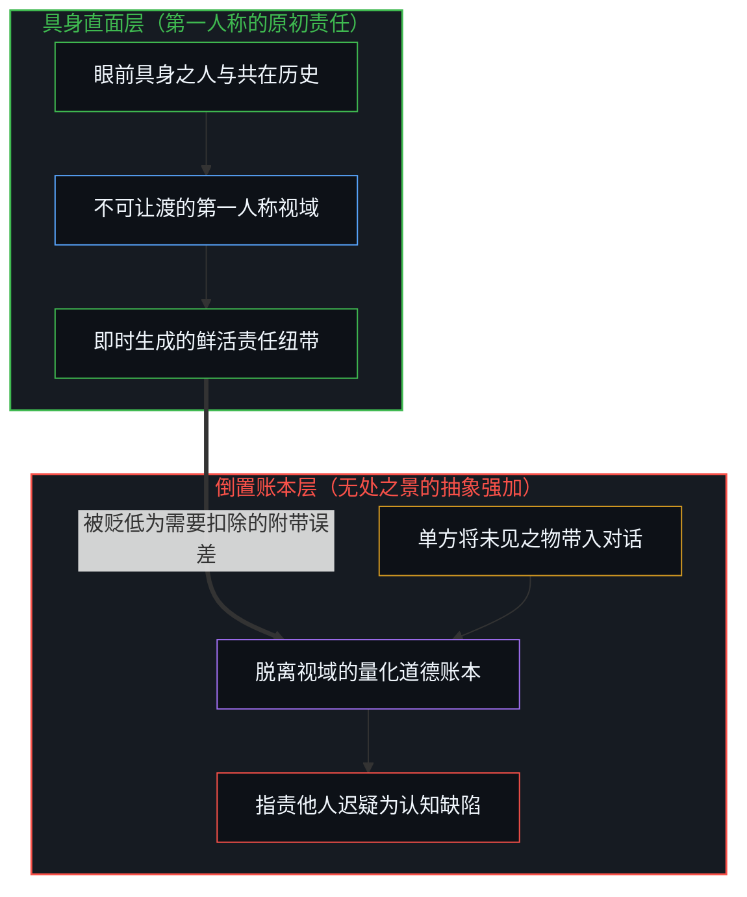
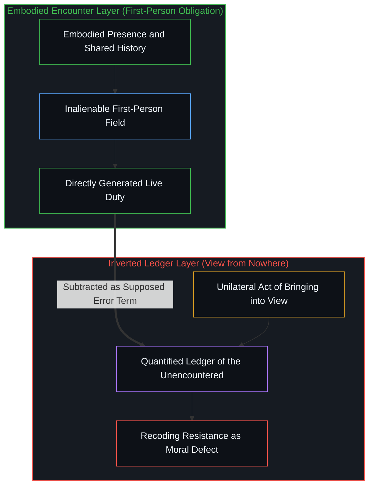
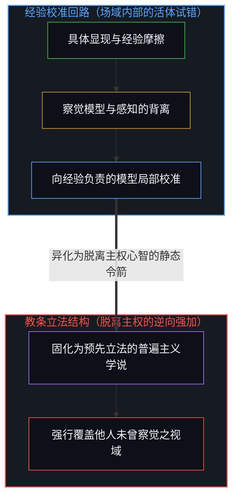
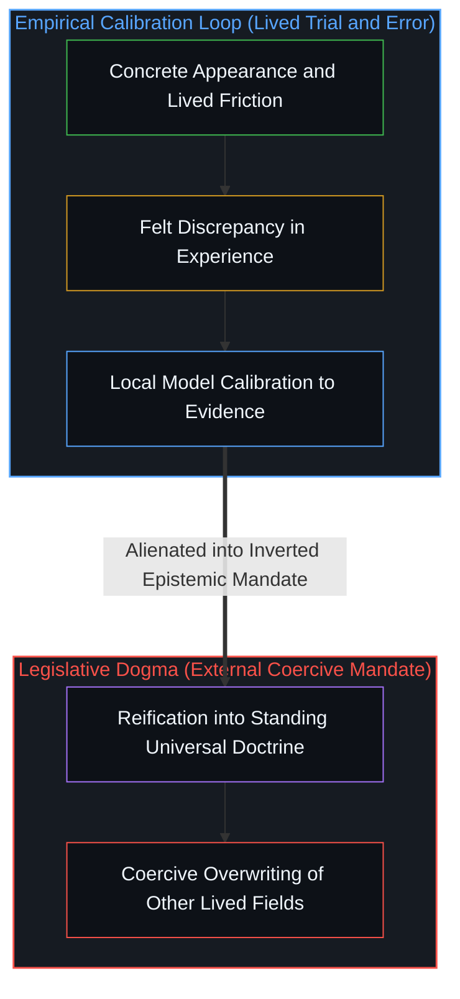

# 未被遭遇之物的账本 / The Ledger of the Unencountered

*责任源于他者在具身视野中的显现，以抽象账本强加未见之物颠倒了因果。 / Obligation is generated by presence; imposing the unencountered via an abstract ledger inverts causality.*

酒馆里的激烈辩论始于一个经典的道德诘问：面对地球另一端未曾谋面的陌生人，我们是否背负着与面对眼前之人相同的道德责任？这一问题表面上看似在天平两端衡量两件已经既定的砝码，实则包藏着精巧的认识论欺瞒。远方的苦难在能够与当面的相遇进行权衡之前，必须首先经由某一个具体的言说者带入视野。这种“带入”并非客观物理刻度的中立报告，而是一种主动的框架置入行动：它试图将未被遭遇之物强行记入与眼前之人相同的道德账本，进而将任何对这种置入的迟疑与抵触，斥责为受试者的道德缺陷，而非两种截然不同显现状态的自然分野。

The spirited tavern debate began with a classic moral challenge: do you have the same moral obligations to a stranger halfway around the world as to someone right in front of you? On the surface, the question poses as a neutral comparison between two already-given objects on an objective balance, yet it conceals an epistemic sleight of hand. Before distant suffering can be weighed against a face-to-face encounter, it must first be carried into view by an active speaker. That carrying is not an innocent report of an independent magnitude. It is a purposeful act of placement that attempts to register the unencountered on the very same ledger as the encountered, and subsequently treats any refusal of that placement as an ethical defect rather than a fundamental divergence in what has appeared within consciousness.

## 一、 假装中立的对比与带入视野的行动 / 1. The Pretense of Neutral Comparison and the Act of Carrying into View

任何活生生的主体所感受到的责任，都是由他者在其视域中的具体显现方式所生成的。这种感知生成绝非某种更高级全局计算的粗糙草稿，而是意识存在者体验道德义务的独一形式。第一人称视域并不是无数数据源中可供随意替换的一项，而是任何认知主体唯一能够占据的立足点。世界上不存在某个能够同时俯瞰两个视域、宣布它们重叠并下达普遍判决的超然观察者。在[不可还原的观察者](../the-irreducible-observer/)中已经阐明，试图在理论模型中抹去具体观察者的做法，抹杀不了构建该理论的主观心智本身；而伦理学中对普遍视角的迷信，恰恰重蹈了这一覆辙。

Whatever obligation a conscious agent actually feels is generated by how another appears within their experiential field. That generation is not an imprecise, biased first draft of some superior utilitarian calculation; it constitutes the only form that obligation takes for a living consciousness. The first-person field is not one arbitrary data stream among interchangeable others, but the only standpoint that is ever occupied. There is no unlocated bystander capable of surveying two independent fields at once, declaring their overlap, and issuing an edict that binds both. As demonstrated in [the-irreducible-observer](../the-irreducible-observer/), attempting to erase the concrete observer from theoretical models cannot eliminate the subjective mind that authors the construction; the moral insistence on an omniscient perspective repeats this precise confusion.

当功利主义者或世界主义者将远方的统计数字推到对话者面前时，他们掩盖了置入这一动作本身的权力属性。远方陌生人的痛苦并未像眼前溺水孩童的呼救那样，直接撞击并占领行为者的感知通道。言说者通过语言、叙事和图表，把未经遭遇的对象搬运进当下的场域，并预先设定了其在账本上的权重。在这套预设的语境中，听众的未调整视域反倒成了需要被辩护和清洗的错误项。一旦接纳了这套前提，剩下的讨论就沦为表层的额度分配争论；至于远方的事项是否合效应被列入当下的账本、究竟是谁将其置入、以及这一置入是否有权覆盖眼前活生生的历史与纽带，这些深层因果在辩论开始前便已被巧妙抹去。

When utilitarians or cosmopolitan theorists present distant statistics to an interlocutor, they obscure the power dynamic inherent in the act of placement itself. The suffering of a distant stranger does not seize the agent's perceptual channels in the immediate manner of a drowning child splashing in front of them. The speaker imports the unencountered object into the immediate conversational field through narrative, rhetoric, and diagrams, while pre-assigning its quantitative weight on the ledger. Within those premises, the listener's unadjusted, embodied field is instantly demoted into an error term requiring justification. Once that framing is accepted, the ensuing discussion shrinks to a mere negotiation over numerical allocations; the foundational questions of whether the distant item belongs on the immediate ledger at all, who placed it there, and what prior living bonds that placement is permitted to overwrite are quietly bypassed before the debate even starts.

## 二、 第一人称视域的不可替代性与无处之景的倒置 / 2. The Irreplaceability of the First-Person Field and the Inversion of the View from Nowhere

托马斯·内格尔所警示的“无处之景”，在此处并未提炼道德判断，反而将其推向了因果倒置。在具体的具身生活里，责任首先作为鲜活的关系事件呈现：具体的面孔、共同度过的时间、交织的承诺与当下的困境。然而，普遍主义框架将这些真实涌现的情感纽带重新编码为具有扭曲性质的偏见，主张必须将这些个人依附从等式中扣除，所谓真实的责任才能浮现。个人关系被降格为应当消除的噪音。这种倒置一旦被认同，远方的陌生人甚至无须真正出场；言说者只需念出一个名字并赋予一个抽象数值，就足以对他人施加道德戒律。

The "view from nowhere" cautioned by Thomas Nagel inverts moral judgment rather than refining it. In concrete, embodied existence, obligation first registers as a living relation: a particular face, a shared history, interwoven commitments, and immediate tangible distress. Yet the universalist framework recodes these emergent relational ties as distorting attachments that must be subtracted so that the true duty can be calculated. The personal is treated as the error term. Once this inversion is accepted, the distant stranger does not need to show up in experience at all; it is enough for a speaker to pronounce a name and attach a numerical weight to demand compliance.

在[协议的倒置与因果回路的沉默](../the-inversion-of-the-protocol-and-the-silencing-of-the-causal-loop/)中已经揭示，当下游的记录工具篡夺了上游生成源头的主权时，真实的因果反馈便陷入停滞。道德账本原本是人类在协调复杂协作时演化出的辅助契约，旨在记录对等交易与社会契约的边界。然而当这一外在记账工具反客为主，宣称凡是在纸面上被写下的条目都具有与肉身相遇同等的约束力时，主体的具身存在就被抽空了。责任不再取决于某人是否在场、是否与你产生了真实的经验纠缠，而取决于中心化的道德布道者在账本上登记了多少行未被证实的字符。

As uncovered in [the-inversion-of-the-protocol-and-the-silencing-of-the-causal-loop](../the-inversion-of-the-protocol-and-the-silencing-of-the-causal-loop/), whenever downstream recording instruments usurp the sovereign primacy of generative origins, genuine causal feedback falls silent. The moral ledger was originally an auxiliary artifact evolved to coordinate complex human cooperation, demarcating boundaries of reciprocal trade and social agreements. When this external ledger turns despotic, claiming that every entry inscribed upon its pages exerts the same gravitational pull as a flesh-and-blood encounter, the agent's embodied presence is evacuated. Obligation ceases to depend on whether an entity actually appears before you in living friction, depending instead on how many lines of unverified text a centralized moral ledger-keeper has inscribed.

## 三、 实用工具的教条化篡位与科学认识论的边界 / 3. The Dogmatic Usurpation of Pragmatic Tools and the Epistemic Horizon of Science

相同的因果倒置发生在任何实用方法被固化为主义的时刻。纠正视野中显现的偏差，只要依然作为视域内部的一个动态事件，就具有无可争议的实践意义：某个假说被反例推翻，某份证词改变了下一次相遇的预期，模型因为主体感受到了真实的背离而发生修正。然而，一旦这种纠偏方法被抽象为凌驾于所有具体心智之上的静态令箭，要求其他从未感受到背离的心智预先遵从时，这一实践就不再向活生生的经验负责，而是变成了先验的立法机器。实用主义退化为僵死的教条，功利考量异化为要求他人牺牲的道德劫持，而原本旨在审视偏见的尝试，蜕变成了傲慢宣称自己早已免于偏见的特权。

The same causal inversion occurs whenever a useful practice hardens into an ideological dogma. Correcting discrepancies within appearance remains genuinely pragmatic as long as it unfolds as an event inside a field: an empirical prediction fails, a compelling testimony reshapes an expectation, and the working model is recalibrated because a palpable gap was registered. However, the moment this methodology is hypostasized into a standing mandate that other conscious minds must already be bound by—even where no discrepancy has registered for them—the practice stops answering to living experience and begins legislating in advance of it. Pragmatism stiffens into scholasticism; utility mutates into an enforced doctrine of sacrifice; and the humble attempt to audit bias turns into the self-righteous claim that bias has already been eliminated.

援引“互为主体性”或“重叠视域”并不能突破第一人称的边界。一致的共识、他人的证词以及标准化的测量刻度，其本身仍然必须在某个第一人称视域中被感知。你听到同伴的纠正，你看到测量仪表上的指针读数，你感受到预期落空带来的张力。并不存在一个超脱于所有视域之外的超然视角，在宇宙高处俯瞰两个心智的视域并为其重合盖章认证。称某种重合为互为主体性，只是命名了一种依然依赖于视角显现的现象，并没有设立第三个无人居住的宇宙法庭。将测量刻度剥离观察者心智、错认为客观事实的企图，正如在[「更好」的范畴谬误](../the-category-error-of-better/)中所辨明的，只会导致决策者在遭遇异质认知时将自身的测量盲区防御性地归咎于外界的非理性。

Invoking "intersubjectivity" or "overlapping horizons" does not escape the inescapable horizon of the first person. Agreement, external testimony, and shared measurement apparatuses are themselves perceived phenomena inside particular minds. You hear the colleague's correction, you read the calibrated pointer on the dial, and you feel the cognitive friction of an unmet expectation. There is no disembodied, extra-perspectival vantage point surveying two independent consciousnesses from above and verifying their coincidence. Calling an experiential convergence intersubjective simply labels an occurrence that remains perspectival; it does not erect an empty, unpeopled tribunal in the sky. The attempt to sever calibrated scales from observing minds and reify them into objective facts, as identified in [The Category Error of Better](../the-category-error-of-better/), merely causes decision-makers to defensively project their own measurement blind spots onto the perceived irrationality of the external world.

这一认识论边界同样划定了科学的有效范围。正如在[能动性被置换入形式模型](../agency-relocated-into-the-formal-model/)中所指出的，形式模型的建构始于对生活经验中协变规律的严谨提炼，只有在其持续向主体的具体观察负责时，模型才是有益的认知手杖。然而，当科学主义将形式模型宣布为独一的本体论事实，并将人类的原初感知贬斥为主观幻觉时，科学便亲手拆毁了孕育其自身的根基。凡是无法在任何第一人称视域中被复现与经验的事物，就没有任何主体有权声称其存在，因为宇宙中不存在第二种能够做出声明的实体。视角的不可逃避性并非客观认知上的残疾，而是任何事物得以对某人存在的原初地平。

This epistemic boundary circumscribes the validity of empirical science as well. As articulated in [Agency Relocated into the Formal Model](../agency-relocated-into-the-formal-model/), formal modeling begins as disciplined inference from lived regularities, remaining valid only while answerable to what conscious observers actually register. When scientism proclaims the mathematical model to be the sole objective reality and dismisses immediate perception as neural illusion, science demolishes the very ground that made observation possible. What cannot be recovered from within any first-person field cannot be claimed by anyone, because there exists no other category of claimant. The inescapability of perspective is not a defect marring an otherwise accessible absolute reality; it is the boundary condition of what can be said to exist for anyone.

## 四、 框架权力的征用与视域的真实延展 / 4. The Coercion of Framing Power and the Authentic Expansion of the Field

围绕远方陌生人的伦理困惑，并不源于认知心理学常谈的注意力衰减、邓巴数上限或同理心的距离损耗。这些现象固然描绘了人类心智的认知生理特征，但绝非诱发伦理困境的深层原由。真正的圈套，在于将某个个体将特定对象带入视野的主动行为，悄然偷换为要求所有人将其视为已经既定存在且具有强制约束力的道德律令。这种偷换不是理性的论证，而是框架权力的露骨征用。它将听众逼入预先设计的道德囚笼中，旨在以虚构的客观性强行抹去受试者自身视域的原初主权。

The ethical confusion surrounding the distant stranger does not stem from Dunbar's number, attentional bandwidth limits, or the emotional friction of caring across geographical distance. While those factors describe real psychological dynamics, they do not constitute the source of the trap. The trap lies in the covert transmutation of one person's act of bringing-into-view into a moral decree that others must treat the imported item as already present and categorically binding. That conversion is an exertion of raw framing power. It corners the interlocutor into a pre-engineered moral architecture designed to overwrite their sovereign perspective with an alien ledger.

承认这一界限，并不意味着否认远方苦难的发生，也不排斥人们通过亲身游历、阅读证词或倾听呼声来延展自己的视域。视域的延展依然是发生在某个具体场域内部的生命经验。它伴随着新的经验摩擦与心智调适，可以被个体自主接纳、检验、重构，甚至在发现虚假时被撤回。然而，它断无可能以一种必须被其他视域预先完成的外在指令形式降临。由具体的在场显现所生成的责任，能够在具身行动中被真实践行；而由跨心智的抽象标尺所编造的责任，则无法被任何活生生的人所承担，因为它的权威已经割断了对任何具体遭遇的依赖。正如在 [抽象的苦难与真实的饥饿](../abstract-pain-and-living-hunger/) 中所进一步剖析的，将无偿调用的概念符号等同于需要支付真实代谢成本的物理实体，正是道德套利者用虚假账本掏空个体生存属地的深层机制。

Clarifying this boundary does not deny that distant agony occurs, nor does it preclude agents from expanding what appears to them through personal exploration, testimony, art, or deliberate attention. The genuine enlargement of a field remains an event inside a consciousness. Accompanied by lived friction and personal evaluation, it can be freely embraced, tested, revised, or abandoned. What it cannot do without collapsing into inversion is arrive as an external administrative mandate that other fields are convicted of having neglected in advance. Obligation generated by how another shows up in person can be authentically lived and honored; obligation engineered by an across-minds bureaucratic standard cannot, because its asserted authority no longer depends on anyone's actual encounter. As further dissected in [Abstract Pain and Living Hunger](../abstract-pain-and-living-hunger/), conflating freely duplicable conceptual tokens with physical entities requiring irreversible metabolic expenditure is the underlying mechanism by which moral arbitrageurs hollow out the agent's situated territorial agency.

酒吧里的论战之所以激烈，是因为这种认识论的割裂正在即时上演。发问者提出问题时，看似在真诚邀请对话者对两种显现状态进行权衡，但提问本身的架构就已经实施了那场关键的置入行动，使得眼前的真实在场变得无足轻重。如果顺着问题的预设概念去回答，你将永远无法解开这个谜题，因为那些概念本身就是用来完成征用的绳索。跳出这一怪圈的唯一途径，是清晰指认出那只正在悄然摆放筹码的手：正是这张试图通吃一切的抽象账本，在试图谋杀你眼中那个具体而鲜活的现实。

The tavern argument was electric because that exact distinction was being forced in real time. The speaker asked a question that mimicked an invitation to evaluate two appearances, yet the framing of the question had already executed the placement that rendered immediate presence superfluous. You cannot resolve the dilemma by answering within the terms provided, because the terms themselves are the instruments of capture. The only way out of the trap is to point directly at the hand sliding the ledger onto the table: it is the totalizing ledger of the unencountered that seeks to overwrite the living, irreplaceable reality right before your eyes.
