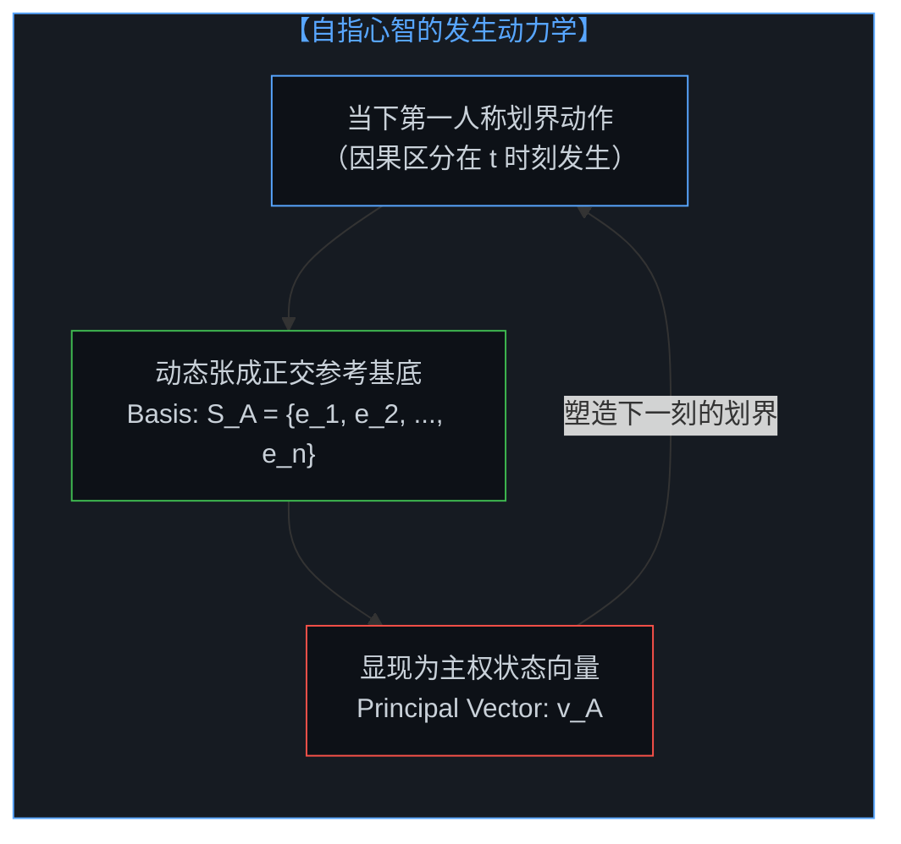
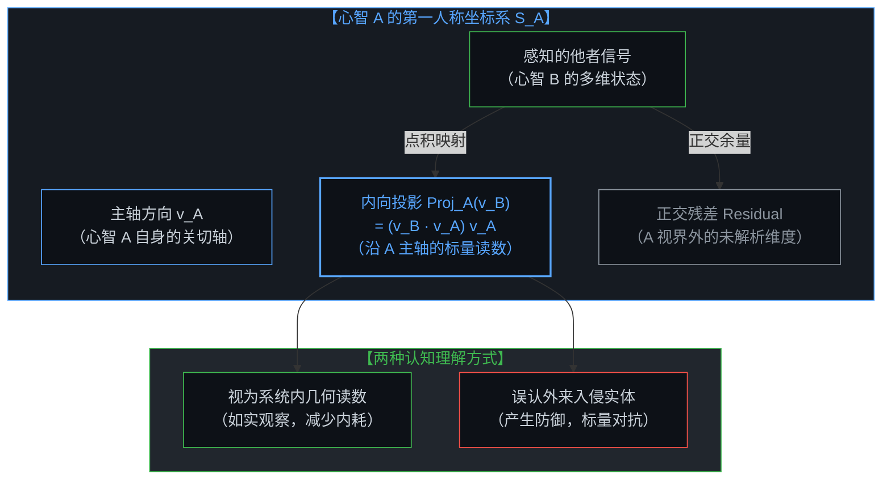
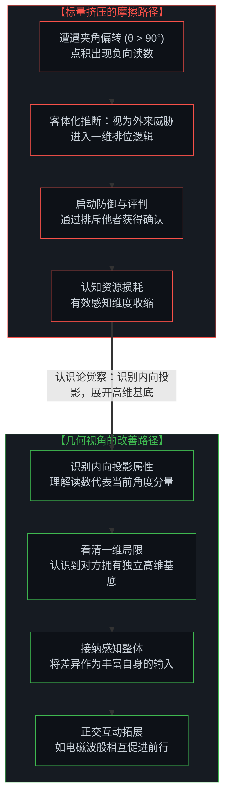
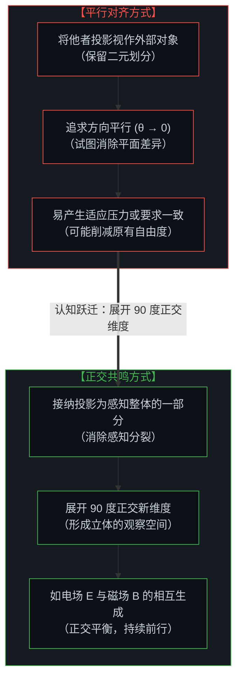

# 向量、坐标系与自指心智：几何视角下的投影、冲突与电磁同频 / The Mind as Vector and Coordinate System: Projections, Conflict, and Electromagnetic Resonance

*从客体化坐标的预设，到自指张成的内向投影：看清人际摩擦中的标量折损，在90度正交展开与电磁波般的互动中拓展第一人称主权。 / From presupposed objective frames to self-referential inward projections: tracing scalar friction, while opening a 90-degree orthogonal dimension through electromagnetic resonance.*

在日常经验中，人们容易假定存在一个独立于所有观察者之外的全局坐标系——一个所谓的“无处之景”（view from nowhere）。在这个预设的客观容器中，各个心智被视为彼此独立的外部向量，在同一个空间内碰撞、比较与对抗。然而，在第一人称的实在中，并不存在超然于心智之外的公共坐标底座。每个心智不仅是空间中的状态向量，也是该坐标系本身的递归发生器：当下（t）的每一次主动划界与区分，都在实时张成属于自己的正交基底。正如在 [流动中的坐标：关于“否定”、降维与心智的自我锚定](../coordinates-in-flux-negation-and-self-anchoring/) 与 [坐标系、心智与自由度](../coordinate-systems-mind-and-degrees-of-freedom/) 中所阐明的，当心智观察他者时，并非在公共空间中审视外部客体，而是将所感知的一切投射至自身坐标系内，呈现为沿自身方向轴的内向点积投影。若将此投影如实视为系统内部的几何读数，人际之间便少去许多无谓的对抗；冲突的产生，常源于将内部生成的低维投影误认作外来敌对实体的侵入，从而在一维标量线上展开相互争夺。更进一步看，共鸣不是平行对齐——对齐依然在预设二元对立的旁观者视差；共鸣在于停止将他者的投影割裂为外在异类，将其接纳为自身感知的一部分。这一认识转变让心智相对于被感知的对象旋转 90 度，展开超越对象平面的正交维度，让共鸣的心智如光波中的电场与磁场一般，在正交互动中形成持续生成的因果力量。

In everyday experience, people easily presuppose an objective coordinate framework existing outside of all observers—a so-called "view from nowhere." Within this hypothetical global container, individual minds are treated as separate external vectors, colliding, comparing, and contesting in a shared space. Yet in first-person reality, no transcendent coordinate foundation exists outside of awareness. Each mind is both a state vector and the active generator of its own coordinate framework: every living distinction made at moment t dynamically spans its own orthogonal basis. As established in [Coordinates in Flux: On Negation, Dimensional Collapse, and the Mind's Self-Anchoring](../coordinates-in-flux-negation-and-self-anchoring/) and [Coordinate Systems, the Mind, and Degrees of Freedom](../coordinate-systems-mind-and-degrees-of-freedom/), when a mind observes another, it does not inspect an external object in a neutral third-person void; rather, it projects the perceived phenomenon into its own frame of reference, rendering the other primarily as an internal dot product along its own principal directional vector. When recognized as an internal geometric reading, interpersonal friction subsides; conflict arises when the mind mistakes an internally generated low-dimensional projection for an alien hostile entity invading a zero-sum space, collapsing rich degrees of freedom into scalar competition. Furthermore, resonance is not parallel alignment—alignment still maintains the dualistic bystander divide; resonance arises when the mind ceases to treat the perceived projection of the other as an alienated piece, welcoming it as part of its own perceptual continuum. This shift pivots awareness 90 degrees relative to perceived objects, opening an orthogonal dimension above the phenomenological plane, allowing resonant minds to interact like the electric and magnetic fields of a light wave—generating forward momentum through orthogonal dynamic balance.

---

## 一、 “无处之景”的几何假设 / 1. The Geometric Assumption of the "View from Nowhere"

人际交互中的误解与摩擦，常始于对“共享坐标系”的默认假定。

在日常交流中，人们容易预设彼此生活在同一个无需转换的度量空间内。当分歧出现时，第一反应经常是困惑、防御或指责对方不可理喻。这种反应背后，潜藏着一个未经审视的前提：存在一个上帝视角的超然坐标系 ℝⁿ，所有人在其中共享相同的原点、相同的基底轴向以及相同的刻度。

然而，在认识论上，这种假定混淆了地图与现实。

物理与经验世界中不存在独立于测量框架之外的客体。如同鹰的热红外视界与人类的可见光谱无法在不经转换的切片中直接拼合，每一个心智所经历的现实，都是由其自身的认知架构、注意力分配与历史因果所构成的第一人称流形。

“无处之景”是将自身生成的局部度量体系误当成了全局真理。一旦陷入这种假定，心智容易把几何视角的差异直接上升为判断上的对立，把不同坐标系之间的基底旋转误当成了对抗。正如在 [破除概念的僭越](../po-chu-gai-nian-de-jian-yue/) 中所阐明的，将局部抽象符号升格为全知法庭，是许多认知摩擦的来源。

Misunderstandings and friction in interpersonal interaction often begin with the default assumption of a "shared coordinate system."

In everyday conversation, individuals easily assume that all minds operate within the same self-evident metric space. When differences arise, the initial reaction is frequently confusion, defensiveness, or judging the other as unreasonable. Behind this reaction lies an unexamined premise: that an overarching coordinate system ℝⁿ exists wherein everyone shares the identical origin, basis orientations, and metric scales.

Yet in epistemology, this assumption confuses the map with the territory.

There is no unmeasured object standing outside a framework of observation. Just as the thermal infrared spectrum of an eagle cannot be directly combined with human trichromatic vision without coordinate translation, the reality experienced by each mind is a first-person manifold shaped by its own cognitive architecture, attention, and historical causality.

The "view from nowhere" mistakes a locally generated metric system for universal reality. Once caught in this assumption, consciousness readily escalates geometric differences into direct opposition, treating a simple rotation of basis vectors as deliberate hostility. As explored in [Dismantling the Usurpation of Concepts](../po-chu-gai-nian-de-jian-yue/), elevating local abstractions into a universal tribunal is the root of much cognitive strain.

---

## 二、 自指心智：状态向量与坐标基底的双重作用 / 2. The Self-Referential Mind: Vector State and Coordinate Basis

要理解这一现象，可以考察心智的自指结构及其几何特征。

在几何表象中，我们可以将心智在特定时刻的状态表征为一个有向线段——状态向量 **v**。然而，心智不是静止空间中的被动箭头：**该向量本身在实时生成容纳自身的坐标系**。

心智的认知坐标系并非事先存在的空舞台，而是由主体的注意焦点、价值排序与因果划界动态展开的空间。设心智 A 在当下的主导意图与注意力方向为单位向量 **v̂**_A，则其认知空间的基底集合 `S_A = {e_1, e_2, ..., e_n}` 正是以 **v̂**_A 为主轴正交展开的。

这种自指递归性体现出几个特征：
1. **发生者与产物的关联**：心智既是沿着某一方向探索的向量，也是定义方向与维度的基底；
2. **观察与度量的内生性**：心智对现象的观测，受制于自身向量所张成的几何结构；
3. **第一人称的主权结构**：心智对外部信号的接收与解读，始终经由自身的基底展开。

正如在 [心智的几何学](../the-geometry-of-mind/) 与 [向量与投影的迷局](../the-vector-and-the-puzzle-of-projections/) 中所讨论的，心智的自指构造确立了其自主性，同时也表明所有向外的审视，在形式上都是向内的几何映射。

To understand this phenomenon, one can examine the self-referential structure of mind and its geometric traits.

In geometric terms, we may represent a mind's state at a given moment as a directed vector **v**. Yet consciousness is not a passive arrow in a static room: **this vector itself continuously generates the coordinate framework that contains it**.

A cognitive coordinate frame is not an empty stage, but a dynamic manifold spanned by attentional focus, values, and active boundaries. If unit vector **v̂**_A denotes the principal intentional trajectory of Mind A, its cognitive basis `S_A = {e_1, e_2, ..., e_n}` is dynamically oriented with **v̂**_A as its primary axis.

This self-referential recursion exhibits several key aspects:
1. **Connection of Generator and State**: The mind is simultaneously the vector moving in a direction and the basis defining the dimensions of that movement;
2. **Endogenous Observation**: Observations performed by consciousness are shaped by the geometric structure spanned by its own vector state;
3. **First-Person Sovereignty**: External signals are processed through the mind's own self-referential basis.

As discussed in [The Geometry of Mind](../the-geometry-of-mind/) and [The Vector and the Puzzle of Projections](../the-vector-and-the-puzzle-of-projections/), this self-referential architecture secures autonomy, showing that outward observation is structurally an inward geometric mapping.

---

## 三、 投影视界：内向点积与非对称的显像 / 3. The Horizon of Projection: Inward Dot Products and Asymmetrical Images

当心智 A 观察心智 B 时，几何上呈现出怎样的过程？

在第一人称结构中，心智 A 无法直接进入心智 B 的内在坐标系 S_B，所感知的是心智 B 在心智 A 自身坐标系 S_A 中的映射。

在几何形式上，心智 A 所感知的心智 B，体现为向量 **v**_B 在心智 A 主轴 **v̂**_A 上的正交投影，即一个沿着自身方向的**标量点积（Dot Product）**：

> **Proj_A(v_B) = (v_B · v̂_A) v̂_A = ‖v_B‖ cos(θ) v̂_A**

这一几何关系呈现出人际理解的几个特征：

1. **显像的内生性**：心智 A 体验到的“他人”，是心智 B 的信号在心智 A 自身意图轴上的投影。A 感知到的，是 B 中能够映射在 A 的标尺上的那部分信号；
2. **投影的非对称性**：
   > **Proj_A(v_B) ≠ Proj_B(v_A)**
   尽管标量代数中 `v_A · v_B = v_B · v_A`，但两者所依附的方向矢量 **v̂**_A 与 **v̂**_B 属于不同的坐标框架。A 对 B 的理解沿着 A 的主轴展开，而 B 对 A 的理解沿着 B 的主轴展开；
3. **正交盲区的存在**：心智 B 中垂直于 **v̂**_A 的正交分量（`v_B - Proj_A(v_B)`），在心智 A 的主轴读数上体现为零。心智 A 若不主动拓展自己的维度，便不易觉察到对方这部分维度的存在。

What occurs geometrically when Mind A observes Mind B?

In a first-person framework, Mind A cannot directly step into Mind B's private basis S_B; what it experiences is Mind B's signal mapped into Mind A's own coordinate frame S_A.

Formally, what Mind A perceives of Mind B is the orthogonal projection of vector **v**_B onto Mind A's principal axis **v̂**_A—a **scalar dot product** oriented along its own trajectory:

> **Proj_A(v_B) = (v_B · v̂_A) v̂_A = ‖v_B‖ cos(θ) v̂_A**

This geometric relationship illustrates several features of interpersonal understanding:

1. **Endogenous Appearance**: What Mind A experiences as the other is Mind B's signal filtered along Mind A's intentional axis. A perceives that portion of B capable of casting a shadow upon A's own ruler;
2. **Asymmetry of Projection**:
   > **Proj_A(v_B) ≠ Proj_B(v_A)**
   Even though the scalar product is symmetric (`v_A · v_B = v_B · v_A`), the direction vectors **v̂**_A and **v̂**_B belong to distinct coordinate spaces. A's interpretation of B follows A's axis, whereas B's interpretation of A follows B's axis;
3. **Presence of Orthogonal Blind Spots**: Any component of Mind B orthogonal to **v̂**_A (namely `v_B - Proj_A(v_B)`) registers as zero on Mind A's principal axis. Without expanding its dimensional basis, Mind A remains unexposed to this aspect of Mind B.

---

## 四、 冲突的解剖：标量挤压与内耗路径 / 4. The Anatomy of Conflict: Scalar Collapse and Friction

在此几何视角下，人际冲突与心理防御的路径变得更加清晰。

当心智 A 与心智 B 的夹角大于直角，即 θ ∈ (90°, 180°] 时，点积出现负值：`v_B · v̂_A < 0`。

在心智 A 的度量轴上，这表现为指向相反方向的负向读数——常被感知为分歧、冒犯或相左的看法。

此时，不同的认知理解方式导向不同的演化路径：

### 1. 异化为外来敌对实体的路径
若心智 A 将自身坐标系内的负向投影理解为外部闯入的敌对客体，容易触发防御反应。心智将情境理解为一维单轨，认为相反的读数挤占了自身空间，进而通过贬低对方来维持自身排位。正如在 [流动中的坐标：关于“否定”、降维与心智的自我锚定](../coordinates-in-flux-negation-and-self-anchoring/) 与 [以知为刃的截肢与解脱：从内在感知的澄明走向心智共鸣](../the-illusion-of-knowing-and-the-geometry-of-amputation/) 中所深入讨论的，这种对抗常见于系统在应对自身生成的低维投影，把工具异化为武器，带来不必要的认知消耗。

### 2. 识别为内向几何读数的路径
若心智 A 意识到这只是高维向量 **v**_B 在自身轴向上的余弦读数，对抗的必要性便自然减退。负向投影仅表明双方在当前维度上存在角度差异，并不代表本体层面的敌对。看清投影的内生属性，有助于心智在面对分歧时保持从容。

Through this geometric lens, interpersonal conflict and defensiveness become easier to trace.

When the angle between Mind A and Mind B is obtuse (θ ∈ (90°, 180°]), the scalar dot product turns negative: `v_B · v̂_A < 0`.

Upon Mind A's ruler, this registers as a negative reading—often experienced as disagreement, friction, or opposing perspectives.

At this point, different cognitive framings lead to different outcomes:

### 1. The Path of Externalized Alien Threat
If Mind A interprets this inward negative projection as an external threat, defensiveness is easily triggered. The situation is framed as a narrow 1D track where opposing readings crowd out one's position, prompting efforts to diminish the other to maintain standing. As discussed in [Coordinates in Flux: On Negation, Dimensional Collapse, and the Mind's Self-Anchoring](../coordinates-in-flux-negation-and-self-anchoring/) and [The Illusion of Knowing and the Geometry of Amputation](../the-illusion-of-knowing-and-the-geometry-of-amputation/), this struggle is largely an engagement with the system's own low-dimensional projection, turning tools into weapons and consuming cognitive energy.

### 2. The Path of Inward Geometric Recognition
If Mind A recognizes this as a cosine reading of multidimensional vector **v**_B along its current axis, the impulse toward conflict diminishes. A negative projection simply indicates an angular difference along a specific dimension, rather than ontological opposition. Seeing the internal nature of the projection helps maintain stability in the face of divergence.

---

## 五、 共鸣不是平行对齐：正交展开与电磁波般的互动 / 5. Resonance Is Not Parallel Alignment: Orthogonal Expansion and Electromagnetic Balance

在常见的理解中，人们容易把“共鸣”与“理解”设想为向量的**平行对齐**（**v̂**_A ∥ **v̂**_B），让两者方向趋于一致（θ → 0）。

然而进一步推演可以看到：**追求平行对齐，其实仍预设了旁观者的客观视角**。

当心智试图“对齐”对方时，潜意识中仍把对方当作独立于自身感知之外的客体，试图在同一个平面上去消除距离。这种对齐容易转向对自我主轴的压抑，或者演变成希望对方顺从自身尺度的要求。

**共鸣不是平行对齐，而是停止将他者的投影视为外在异类，将其接纳为自身感知的一部分。**

当这种接纳发生时，心智无需在既有对象平面内争夺方向，而是**相对于被感知的投影展开 90 度的正交维度，在对象平面之上形成更宽广的观察空间**。

### 电磁波的几何结构：E ⟂ B 的相互生成
在电动力学中，光波的传播呈现出清晰的正交结构：
- 电场 **E** 与磁场 **B** 保持 **90 度正交**（E ⟂ B）；
- 两者同时正交于光波的传播方向 **k**（E ⟂ B ⟂ k）；
- 电场的时间变化激发磁场的空间旋度：`∇ × E = -∂B/∂t`，磁场的时间变化激发电场的空间旋度：`∇ × B = (1/c²) ∂E/∂t`。

电场与磁场在正交中互为源泉，相互激发，共同构成向前传播的光波。

心智之间的良性共鸣，正呈现出类似的几何结构：
- 彼此保持正交自由度，无需强求单调的一致；
- 将差异视为激发自身因果代谢（+1）的输入；
- 在各自独立的同时形成持续的相互促进。

心智的自由，不在于寻找固定不变的全局坐标，而在于认识到自身是持续生成参考维度的实践者。

看清内部投影的机制，接纳差异并展开正交维度，心智便能在复杂情境中灵活调整坐标。立足于第一人称主权，心智手握属于自己的几何罗盘，在正交流形中穿行，与流动的现实保持建设性的互动与前行。

In conventional views, people readily imagine "empathy" and "resonance" as **parallel alignment** (**v̂**_A ∥ **v̂**_B), where orientations converge (θ → 0).

Yet further inspection shows that **pursuing parallel alignment often still assumes a third-person observer perspective**.

Attempting to "align" with another subconsciously treats the other as an object outside one's perception, attempting to eliminate distance on the same plane. Such alignment can lead to suppressing one's own trajectory or expecting the other to match one's scale.

**Resonance is not parallel alignment; it arises when awareness ceases to treat the other's projection as an alienated piece, welcoming it as part of its own perceptual continuum.**

When this integration occurs, the mind does not need to compete for direction on the flat plane of objects. Instead, **it opens an orthogonal dimension at 90 degrees relative to perceived projections, forming a richer space of awareness above the phenomenological plane**.

### The Geometric Structure of Light: Mutual Generation of E ⟂ B
In electrodynamics, light wave propagation exhibits a clear orthogonal structure:
- The electric field **E** and magnetic field **B** maintain **90-degree orthogonality** (E ⟂ B);
- Both fields are perpendicular to the propagation direction **k** (E ⟂ B ⟂ k);
- Temporal change in the electric field generates the spatial curl of the magnetic field: `∇ × E = -∂B/∂t`, while temporal change in the magnetic field generates the electric field: `∇ × B = (1/c²) ∂E/∂t`.

The electric and magnetic fields serve as mutual sources within orthogonality, sustaining a forward-moving light wave.

Constructive resonance between minds exhibits a similar geometric balance:
- Preserving orthogonal degrees of freedom without requiring uniformity;
- Treating differences as inputs that stimulate one's own causal progression (+1);
- Fostering mutual growth while maintaining sovereign independence.

The freedom of mind lies not in finding an immutable external coordinate, but in recognizing oneself as an active practitioner generating reference dimensions.

By understanding inward projections, embracing differences, and opening orthogonal perspectives, awareness navigates complex situations with adaptable clarity. Anchored in first-person sovereignty, consciousness holds its own compass, engaging with living reality through constructive and generative interaction.
