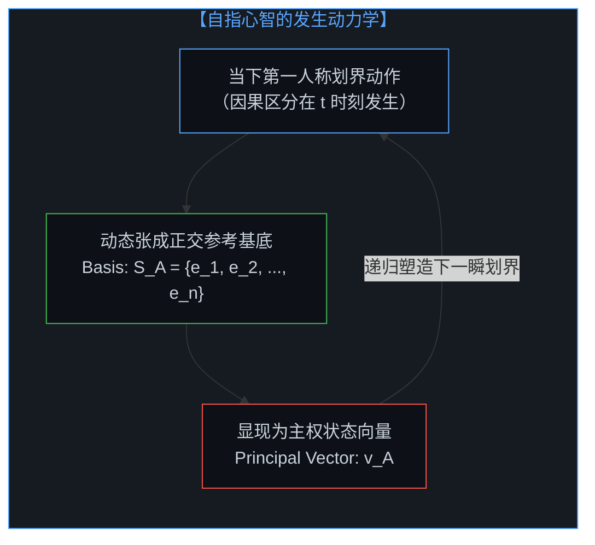
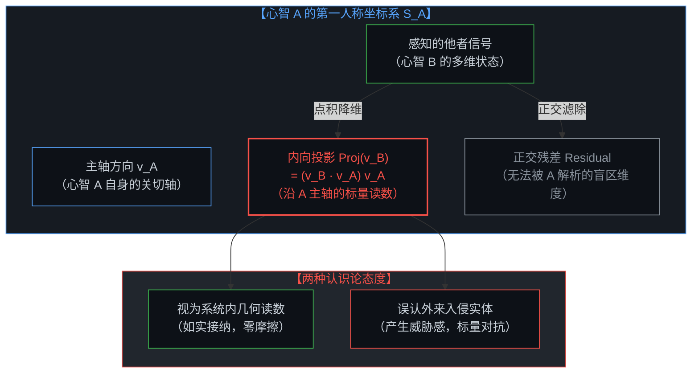
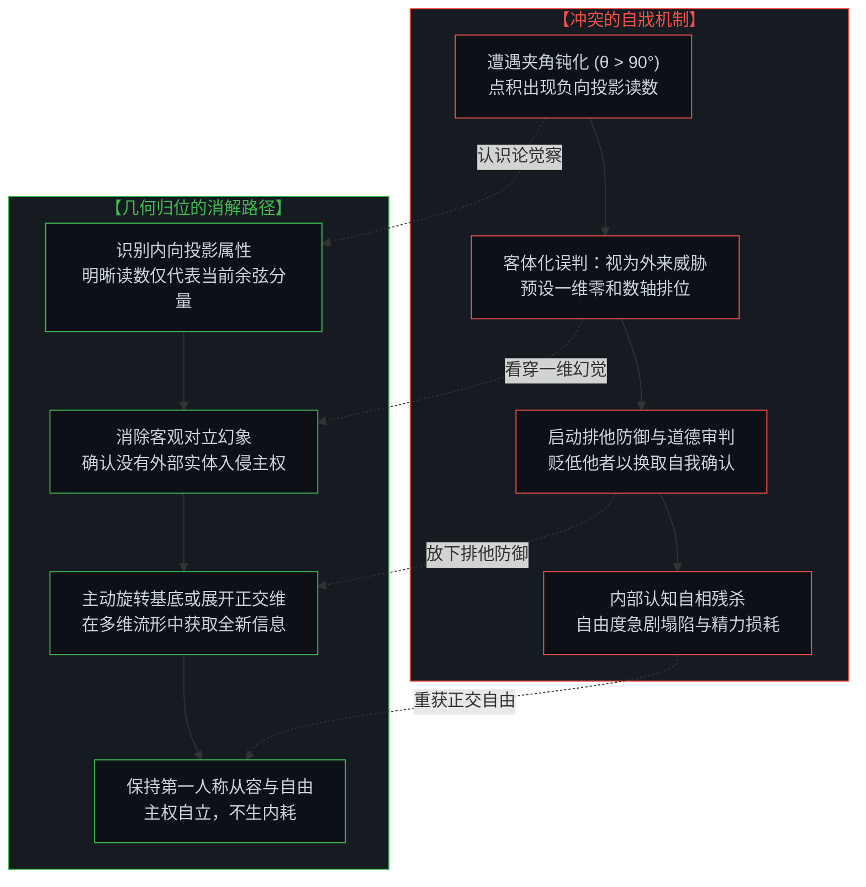
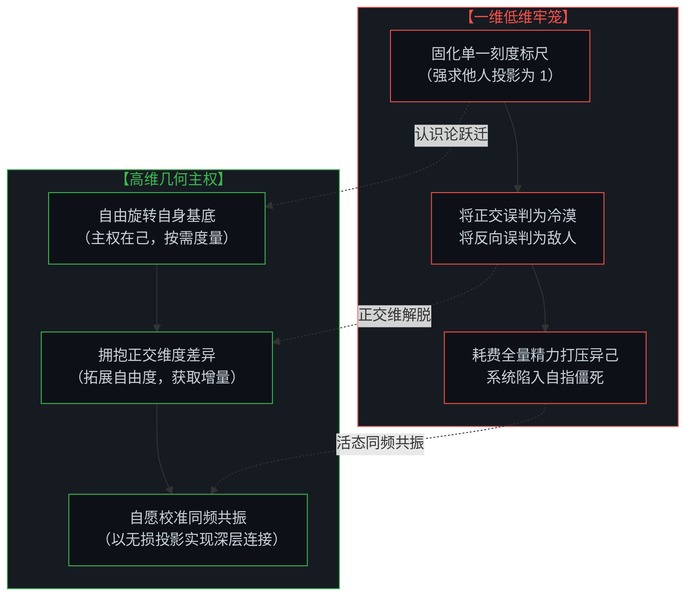

# 向量、坐标系与自指心智：几何视角下的投影、冲突与同频 / The Mind as Vector and Coordinate System: Projections, Conflict, and Synchronization in Causal Geometry

*从“无处之景”的客体化迷失，到自指张成的内向投影：透视人际摩擦的标量自戕，在正交与同频的几何流形中确立第一人称主权。 / From the objectified illusion of a "view from nowhere" to the recursive projection of a self-referential basis: formalizing interpersonal friction as self-inflicted scalar collapse, while mastering basis alignment and orthogonal resonance in causal geometry.*

在朴素实在论的直觉中，人们习惯于假定存在一个独立于所有观察者之外的全局欧几里得坐标系——一个所谓的“无处之景”（view from nowhere）。在这个预设的客观容器中，各个心智被视为彼此独立的外部向量，像台球般在同一个空间内碰撞、比较与对抗。然而，这种几何图景是一场深刻的因果倒置。在第一人称的实在中，根本不存在超然于心智之外的公共坐标底座。每个心智不仅是空间中的一个状态向量，更是该坐标系本身的递归发生器：当下（$t$）的每一次主动划界与区分，都在实时张成属于自己的正交基底。正如在 [流动中的坐标：关于“否定”、降维与心智的自我锚定](../coordinates-in-flux-negation-and-self-anchoring/) 与 [坐标系、心智与自由度](../coordinate-systems-mind-and-degrees-of-freedom/) 中所阐明的，当心智观察他者时，它并非在公共空间中审视外部客体，而是将所感知的一切投射至自身的坐标系内，呈现为沿自身方向轴的内向点积投影。若将此投影如实视为系统内部的几何读数，人际之间本无对抗；冲突之所以爆发，正是由于心智遗忘了自身的自指本性，把内部生成的低维投影误认作外来敌对实体的侵入，从而在一维标量线上展开自戕性的争夺。唯有看清投影的内向生成机制，心智才能学会主动旋转基底、展开正交维度，在不被异化物所奴役的自在中达成深层的同频共振。

In naive realist intuition, human beings habitually presuppose an objective Euclidean coordinate framework existing outside of all observers—a so-called "view from nowhere." Within this hypothetical global container, individual minds are conceptualized as separate external vectors, colliding, comparing, and contesting like billiard balls on a shared table. Yet this geometric picture represents a profound causal inversion. In the radical reality of the first-person present ($t$), no transcendent, mind-independent coordinate foundation exists. Each mind is not merely a state vector situated in an existing room, but the active, recursive generator of its own coordinate framework: every living distinction executed at moment $t$ dynamically spans its own orthogonal basis. As established in [Coordinates in Flux: On Negation, Dimensional Collapse, and the Mind's Self-Anchoring](../coordinates-in-flux-negation-and-self-anchoring/) and [Coordinate Systems, the Mind, and Degrees of Freedom](../coordinate-systems-mind-and-degrees-of-freedom/), when a mind observes another, it does not inspect an external object in a neutral third-person void; rather, it projects the perceived phenomenon into its own frame of reference, rendering the other primarily as an internal dot product along its own principal directional vector. When recognized as an internal geometric projection, no inherent friction exists; interpersonal conflict ignites precisely because the mind forgets its own self-referential nature, mistaking an internally generated low-dimensional projection for an alien hostile entity invading a zero-sum container, collapsing boundless degrees of freedom into self-inflicted scalar warfare. Only by seeing through this inward projection mechanism can consciousness actively rotate its basis, embrace orthogonal dimensions, and attain genuine synchronization without surrendering its sovereign ground.

---

## 一、 “无处之景”的几何幻觉 / 1. The Geometric Illusion of the "View from Nowhere"

人际交互中最常见的痛苦与摩擦，始于对“共享坐标系”的盲目执念。

在日常交流中，人们常常预设彼此生活在同一个无需转换的度量空间内。当分歧出现时，第一反应经常是困惑、愤怒或防御：“事实明明如此清晰，对方为何不可理喻？”这种反应背后，隐藏着一个未经审视的前提：存在一个上帝视角的超然坐标系 $\mathbb{R}^n$，所有人在其中共享相同的原点、相同的基底轴向以及相同的刻度。

然而，这在认识论上是一个致命的虚构。

物理与经验世界中从来不存在独立于测量框架之外的“纯客观现实”。如同一只鹰的热红外视界与人类的可见光谱无法在不经转换的物理切片中直接拼合，每一个心智所经历的现实，都是由其自身的认知架构、注意力分配与历史因果所编织而成的第一人称流形。

所谓的“无处之景”，是将心智自身生成的局部度量体系误当成了宇宙的公理。一旦陷入这种假定，心智就会把“角度的几何差异”粗暴定罪为“道德或智识的瑕疵”，把不同坐标系之间的基底旋转误当成了恶意对抗。在 [破除概念的僭越](../po-chu-gai-nian-de-jian-yue/) 中所揭示的，正是这种将局部抽象符号升格为全知客观法庭的僭妄。

The most ubiquitous friction and torment in interpersonal interaction originate from a blind attachment to a "shared coordinate system."

In everyday discourse, individuals reflexively assume that all minds operate within the identical, self-evident metric space. When divergences arise, the default reflex is bewilderment, irritation, or defensive hostility: "The facts are self-evident; why is the other party being so irrational?" Lurking behind this reaction is an unexamined axiom: that there exists an overarching, God's-eye coordinate system $\mathbb{R}^n$ wherein everyone shares the identical origin, the identical basis orientations, and the identical metric scales.

Yet in causal epistemology, this is a fatal fiction.

There is no "pure objective reality" standing naked outside a measurement frame. Just as the thermal infrared horizon of an eagle cannot be naively spliced onto the trichromatic visual spectrum of a human being without coordinate translation, the reality experienced by each mind is a first-person manifold woven by its own cognitive architecture, attentional selectivity, and historical causality.

The so-called "view from nowhere" is merely the objectified reification of a mind's localized metric system, mistakenly crowned as cosmic truth. Once ensnared in this illusion, consciousness mechanically criminalizes geometric divergence as moral or intellectual failure, mistaking a simple rotation of basis vectors for deliberate hostility. As demonstrated in [Dismantling the Usurpation of Concepts](../po-chu-gai-nian-de-jian-yue/), the root error is elevating local abstractions into a universal transcendent tribunal.

---

## 二、 自指心智：作为向量与坐标系发生器的双重同一 / 2. The Self-Referential Mind: The Dual Identity of Vector and Basis Generator

要解构这一幻觉，必须看清心智的自指本质及其几何同构性。

在几何表象中，我们可以将心智在特定时刻的状态表征为一个有向线段——状态向量 $\vec{v}$。然而，心智并非静止几何空间中一枚被动的箭头；其深层特性在于：**该向量本身，正在实时递归地生成容纳它自身的坐标系**。

心智的认知坐标系并非事先存在的空舞台，而是由主体的注意焦点、价值排序与因果划界动态张成的流形空间。设心智 A 在当下的主导意图与注意力方向为单位向量 $\hat{v}_A$，则其认知空间的基底集合 $S_A = \{e_1^{(A)}, e_2^{(A)}, \dots, e_n^{(A)}\}$ 正是以 $\hat{v}_A$ 为主轴正交展开的。

这种自指递归性意味着：
1. **发生者与产物的同一**：心智既是沿着某一方向探索的“探索者”（向量），又是定义方向与维度的“标尺制造者”（基底）；
2. **观察与度量的递归闭环**：心智对任何现象的观测，都必然受制于自身向量所张成的几何曲率；
3. **不可逾越的第一人称主权**：没有任何外部力量能绕过心智的自指基底，强行向其注入一个未经投影的裸数据。

正如在 [心智的几何学](../the-geometry-of-mind/) 与 [向量与投影的迷局](../the-vector-and-the-puzzle-of-projections/) 中所探究的，心智的这一自指构造，确立了其无可替代的自主性，同时也从根本上注定了所有向外的审视，本质上都是向内的几何映射。

To dismantle this illusion, one must grasp the self-referential nature of mind and its geometric isomorphism.

In geometric terms, we may represent a mind's state at a given moment as a directed line segment—a state vector $\vec{v}$. Yet consciousness is by no means a passive arrow placed inside a static room; its fundamental trait is that **this vector itself recursively and continuously generates the very coordinate system that contains it**.

A mind's cognitive coordinate frame is not a pre-existing empty stage, but a dynamic manifold spanned by the subject's attentional focus, value hierarchy, and active causal boundaries. If unit vector $\hat{v}_A$ denotes the principal intentional trajectory of Mind A, its cognitive basis $S_A = \{e_1^{(A)}, e_2^{(A)}, \dots, e_n^{(A)}\}$ is dynamically spanned and oriented with $\hat{v}_A$ as its primary axis.

This self-referential recursion entails three core realities:
1. **Identity of Generator and Product**: The mind is simultaneously the explorer travelling in a specific direction (the vector) and the scale-maker defining the dimensions of travel (the basis);
2. **The Recursive Loop of Observation**: Any observation performed by consciousness is inherently bounded by the geometric curvature spanned by its own vector state;
3. **The Sovereign First-Person Origin**: No external agency can bypass a mind's self-referential basis to implant unprojected raw data directly into its experience.

As explored in [The Geometry of Mind](../the-geometry-of-mind/) and [The Vector and the Puzzle of Projections](../the-vector-and-the-puzzle-of-projections/), this self-referential architecture secures the sovereign autonomy of mind, while ensuring that all outward observations are fundamentally internal geometric mappings.

---

## 三、 投影视界：内向点积与非对称的“他者” / 3. The Horizon of Projection: Inward Dot Products and the Asymmetry of the "Other"

当心智 A 望向心智 B 时，究竟发生了什么？

既然不存在公共的第三人称空间，心智 A 无法直接“跃入”心智 B 的内在坐标系 $S_B$ 中进行无损读取。心智 A 能够感知的，仅仅是心智 B 在心智 A 自身坐标系 $S_A$ 中的显像。

在几何形式上，心智 A 所“看到”的心智 B，本质上是向量 $\vec{v}_B$ 在心智 A 主轴 $\hat{v}_A$ 上的正交投影，即一个沿着自身方向的**标量点积（Dot Product）**：

$$\text{Proj}_{\vec{v}_A}(\vec{v}_B) = (\vec{v}_B \cdot \hat{v}_A) \hat{v}_A = \|\vec{v}_B\| \cos(\theta_{AB}) \hat{v}_A$$

这一公式揭示了人际理解的几个底层真相：

1. **他者显象的内生性**：心智 A 体验到的“他人”，并非独立的客体本身，而是心智 B 的信号经过心智 A 自身意图轴滤波后的投影。心智 A 看到的不是心智 B，而是心智 B 中“能够折射在 A 的标尺上”的那一部分回响；
2. **投影的内在非对称性**：
   $$\text{Proj}_{\vec{v}_A}(\vec{v}_B) \neq \text{Proj}_{\vec{v}_B}(\vec{v}_A)$$
   尽管标量代数中 $\vec{v}_A \cdot \vec{v}_B = \vec{v}_B \cdot \vec{v}_A$，但两者所依附的**方向矢量** $\hat{v}_A$ 与 $\hat{v}_B$ 分属于两个截然不同的主权坐标系。A 对 B 的理解是沿着 A 的主轴展开的，而 B 对 A 的理解是沿着 B 的主轴展开的。它们在几何上根本不在同一个方向上，强求对称性的理解本就是一种无理的要求；
3. **正交盲区的必然存在**：心智 B 中垂直于 $\hat{v}_A$ 的正交分量（即 $\vec{v}_B - \text{Proj}_{\vec{v}_A}(\vec{v}_B)$），在心智 A 的主轴读数上直接体现为零。心智 A 若不扩展自己的维度，便会对心智 B 的庞大世界视而不见。

What genuinely transpires when Mind A observes Mind B?

In the absence of a shared third-person void, Mind A cannot leap directly into Mind B's private basis $S_B$ to extract lossless data. What Mind A experiences is exclusively Mind B's geometric image mapped into Mind A's own coordinate frame $S_A$.

Formally, what Mind A "perceives" of Mind B is the orthogonal projection of vector $\vec{v}_B$ onto Mind A's principal axis $\hat{v}_A$—a **scalar dot product** oriented along its own trajectory:

$$\text{Proj}_{\vec{v}_A}(\vec{v}_B) = (\vec{v}_B \cdot \hat{v}_A) \hat{v}_A = \|\vec{v}_B\| \cos(\theta_{AB}) \hat{v}_A$$

This mathematical relationship illuminates several foundational epistemological realities:

1. **Endogenous Nature of the Perceived Other**: What Mind A experiences as the "other" is not a freestanding object, but Mind B's signal filtered through Mind A's own intentional axis. Mind A perceives not Mind B in totality, but that specific slice of Mind B capable of casting a shadow upon Mind A's ruler;
2. **Inherent Asymmetry of Mutual Perception**:
   $$\text{Proj}_{\vec{v}_A}(\vec{v}_B) \neq \text{Proj}_{\vec{v}_B}(\vec{v}_A)$$
   Even though the scalar product is numerically symmetric ($\vec{v}_A \cdot \vec{v}_B = \vec{v}_B \cdot \vec{v}_A$), the **directional basis vectors** $\hat{v}_A$ and $\hat{v}_B$ reside in entirely distinct sovereign coordinate spaces. A's interpretation of B is oriented along A's axis, whereas B's interpretation of A is oriented along B's axis. They point in different directions; demanding identical reciprocal comprehension is geometric nonsense;
3. **The Inevitability of Orthogonal Blind Spots**: Any component of Mind B orthogonal to $\hat{v}_A$ (namely $\vec{v}_B - \text{Proj}_{\vec{v}_A}(\vec{v}_B)$) registers as zero on Mind A's principal scale. Unless Mind A expands its own dimensional basis, it remains structurally blind to the vast manifold of Mind B.

---

## 四、 冲突的解剖：标量挤压与自戕性对抗 / 4. The Anatomy of Conflict: Scalar Collapse and Self-Inflicted Friction

在此几何透视下，人际冲突与心理防御的机制变得清晰透明。

当心智 A 与心智 B 的夹角大于直角，即 $\theta_{AB} \in (\frac{\pi}{2}, \pi]$ 时，点积出现负值：$\vec{v}_B \cdot \hat{v}_A < 0$。

在心智 A 的度量轴上，这表现为一个指向相反方向的负向投影——感知为“相左的观点”、“挑衅的言辞”或“刺耳的否定”。

此时，心智的处理方式决定了系统的演化路径：

### 1. 异化为外来敌对实体的自戕路径
若心智 A 遗忘了这只是自身坐标系内的一个投影，而将其误认为是一个从外部闯入自己地盘的“外来异己物”，心智便会立刻体验到威胁。
它把现实预设成一根狭窄的一维单轨，认为对方的负向读数正在挤占自己的存在空间。为了捍卫自身的位置，心智 A 必须启动防御机制：向外贬低对方、证明对方是“错误的”、“恶意的”或“劣质的”，试图通过抹杀负向分量来维系自身的正向排位。
然而，正如 [流动中的坐标：关于“否定”、降维与心智的自我锚定](../coordinates-in-flux-negation-and-self-anchoring/) 所揭示的：**心智所攻击的那个“敌人”，从来不是外部真实的他者，而是心智自身为了维系一维幻象所分裂出的内部低维投影**。这场对抗从始至终都是系统内部的自相搏杀与能量损耗。

### 2. 识别为内向几何读数的解脱路径
相反，若心智 A 保持清醒的第一人称觉知，认清这只是高维向量 $\vec{v}_B$ 在自己轴向上的一个局部余弦读数，所有的对抗瞬间瓦解。
负向投影仅仅说明双方在当前关注的这一特定维度上夹角钝化，并不代表心智 B 的本体在与心智 A 的生命为敌。既然这只是自身内部的一个数学投影，便不存在所谓的“入侵”；心智无需调动任何情绪去清除一个影子。

Through this geometric lens, the mechanics of interpersonal hostility and psychological defensiveness become transparent.

When the angle between Mind A and Mind B is obtuse, namely $\theta_{AB} \in (\frac{\pi}{2}, \pi]$, the scalar dot product turns negative: $\vec{v}_B \cdot \hat{v}_A < 0$.

Upon Mind A's metric ruler, this registers as a negative projection pointing opposite to its own trajectory—phenomenologically perceived as "conflicting opinions," "provocative rhetoric," or "offensive rejection."

At this juncture, the mind's epistemological framing dictates its evolutionary fate:

### 1. The Self-Destructive Path of Externalized Alien Threat
If Mind A forgets that this is merely a projection inside its own coordinate frame and misidentifies it as an "alien invader" breaching its territory, an acute sense of threat is triggered.
It presupposes reality to be a rigid 1D track where the other's negative reading displaces its own standing. To defend its position, Mind A activates aggressive defense mechanisms: denigrating the other, condemning them as "erroneous," "malicious," or "inferior," attempting to eliminate the negative component to preserve its positive ranking.
Yet as demonstrated in [Coordinates in Flux: On Negation, Dimensional Collapse, and the Mind's Self-Anchoring](../coordinates-in-flux-negation-and-self-anchoring/): **the "adversary" Mind A assaults is never an external objective entity, but an internal low-dimensional shadow fractured by its own effort to maintain a 1D illusion**. The entire conflict is a self-inflicted civil war of cognitive dissipation.

### 2. The Liberating Path of Inward Geometric Recognition
Conversely, if Mind A maintains lucid first-person awareness, recognizing that this is merely a cosine reading of multidimensional vector $\vec{v}_B$ projected onto its own temporary axis, all hostility evaporates.
A negative projection merely indicates that the angular orientation between the two minds is obtuse along this isolated dimension; it does not mean Mind B's ontology is hostile to Mind A's existence. Because this is purely an internal mathematical reading, no "invasion" has occurred; consciousness has no reason to expend emotional energy fighting a shadow.

---

## 五、 同频与正交：旋转基底的认知自由度 / 5. Resonance and Orthogonality: Rotating the Basis into Sovereign Freedom

认清了心智作为向量与坐标系发生器的几何事实，人际理解与交流的真实面貌便浮出水面。

真正的沟通与理解，从来不是试图强行扭转他人的向量 $\vec{v}_B$ 使其屈从于自己的轴向，也不是消灭自己的主轴去迎合对方。真正的成熟在于**心智对自身坐标系的主动旋转、维度的正交展开与自愿同频**。

### 1. 正交性的智慧（Orthogonality, $\theta = \frac{\pi}{2}$）
当两个心智的向量处于正交状态时，$\vec{v}_B \cdot \hat{v}_A = 0$。
在一维直觉看来，这表现为“漠不关心”或“毫无共同话题”。但在高维几何中，正交并非对立，而是**互不干扰且互补的自由度**。心智 B 探索的方向是心智 A 既有经验中未曾定义的全新维度。承认正交性，就是允许宇宙保留超越自身视界的丰富性，无须强求将所有差异折算进自己的单向标尺中。

### 2. 同频共振的校准（Synchronization, $\theta \to 0$）
所谓的“心有灵犀”或“深度共鸣”，并非两个独立实体在外部空间发生融合，而是双方基于自愿的注意协调，主动将各自的基底主轴旋转至近似平行的方向：
$$\hat{v}_A \approx \hat{v}_B \implies \cos(\theta_{AB}) \approx 1$$
此时，投影达到了最大值，信息传递的损耗降至最低。在 [大倒置的消解与活态哲学的开端](../the-dissolution-of-the-great-reversal/) 与 [没有普度，只有自度](../mei-you-pu-du-zhi-you-zi-du/) 中所强调的，正是这种基于个体自主性的同向而行：不强求普度，不强加同频，唯有当两个独立的发生器在各自的演化中自然相向时，同频才具备活态的因果力量。

心智最终的自由，不是在这个世界上找到一个永恒不变的全局固定坐标，而是深刻领悟到：**自己就是那座随时在测绘世界、随时在生成维度的活态发生器**。

当你不再执着于把内部生成的投影误作外部审判的法庭，当你不再为负向的余弦读数惊慌失措，你便拥有了在任意情境中从容旋转坐标轴的自由。立足于不可剥夺的第一人称主权，心智手握属于自己的几何罗盘，在浩瀚的正交流形中穿行，既不侵犯他者的基底，亦不削减自身的维度，与世间万物共舞在无尽敞开的生成之中。

Recognizing the geometric reality of mind as both vector and basis generator brings the true architecture of human connection into focus.

Genuine communication is never about coercing another mind's vector $\vec{v}_B$ into alignment with one's own axis, nor is it about annihilating one's own trajectory to placate another. True maturity lies in **the conscious capacity to rotate one's own basis, open orthogonal dimensions, and engage in voluntary synchronization**.

### 1. The Wisdom of Orthogonality ($\theta = \frac{\pi}{2}$)
When two minds exist in an orthogonal configuration, $\vec{v}_B \cdot \hat{v}_A = 0$.
To a naive 1D intuition, this reads as "indifference" or "having nothing in common." In high-dimensional geometry, however, orthogonality is not antagonism, but **non-interfering, complementary degrees of freedom**. The terrain Mind B explores represents dimensions yet undefined within Mind A's current repertoire. Honoring orthogonality means allowing reality to retain boundless richness beyond one's immediate frame, releasing the impulse to force every variation onto a single personal ruler.

### 2. The Calibration of Synchronization ($\theta \to 0$)
What humans cherish as profound mutual understanding or "resonance" is not the mystical merger of two objects in a third-person container, but the deliberate, voluntary alignment of their respective principal axes:
$$\hat{v}_A \approx \hat{v}_B \implies \cos(\theta_{AB}) \approx 1$$
Here, projection reaches its theoretical maximum and informational transmission loss drops to near zero. As underscored in [The Dissolution of the Great Reversal and the Inception of a Living Philosophy](../the-dissolution-of-the-great-reversal/) and [No Universal Salvation, Only Self-Salvation](../mei-you-pu-du-zhi-you-zi-du/), this alignment is sovereign and autonomous: never coerced, never imposed. Only when two independent generators naturally align their trajectories does resonance hold living causal force.

The ultimate freedom of mind is not in discovering an immutable static coordinate in an external void, but in realizing that **the self is the living generator actively measuring reality and spanning dimensions at every single moment**.

When you no longer mistake an internally generated projection for an external tribunal of judgment, and when you no longer panic at a negative cosine reading, you attain the mastery to freely rotate your coordinate axes across any context. Anchored in inviolable first-person sovereignty, consciousness holds its own geometric compass, traversing the boundless orthogonal manifold—neither encroaching upon another's basis nor amputating its own dimensions—dancing with reality in ever-open generation.
