# 时间之箭的伪悖论与对称模拟的边界 / The Mirage of Time's Arrow and the Boundaries of Symmetric Simulation

*从痕迹单向性、封闭系统记账到把高保真模拟误作本体生成的认知倒错 / From Trace Asymmetry and Closed-System Bookkeeping to the Cognitive Inversion of Mistaking Simulation for Reality*

现实本身不存在任何关于时间之箭的悖论。所谓的悖论，仅仅发生在这样一种错位时刻：当一套在方法论上刻意剔除了“单向继起”的形式模型，反过来被要求将这种继起作为自身的计算结果输出时，冲突便不可避免地爆发了。因果律——即先前的状态不可逆地制约并先于后续状态的事实——是不可化约的前提约束。没有任何论证、测量或数学演算，能够在不预先借用因果单向性的前提下自洽展开。任何企图从底层去推导、还原或消除这种单向秩序的尝试，都在开口的第一瞬间构成了自我矛盾，因为推导行为本身就是一个不可逆的单向因果过程。物理方程的时间反演对称性是极高精度的模拟工具，而不是被模拟的实在基底。正如在[选择本身没有任何固有重量](../choice-itself-has-no-inherent-weight/)与[主体性决非涌现而出](../agency-does-not-arise/)中所阐明的，把分析工具误认为存在基底，是科学哲学中最深沉的认知陷阱。

Reality harbors no paradox regarding the arrow of time. The apparent contradiction arises exclusively when formal models that have methodologically abstracted away directed succession are subsequently demanded to generate that succession as an emergent output. Causality—the irreversible fact that one state constrains and precedes another—is the irreducible prior. Nothing can be coherently argued, observed, or calculated without already utilizing it. Every attempt to derive or reduce that order from below initiates an immediate self-contradiction, because the act of derivation is itself an irreversible, directed process. The time-reversal symmetry of physical equations represents a simulation of incomparable fidelity, not an ontological replacement for the living reality it models. As demonstrated in [Choice Itself Has No Inherent Weight](../choice-itself-has-no-inherent-weight/) and [Agency Does Not Arise](../agency-does-not-arise/), confusing an analytical instrument with ontological ground constitutes the deepest cognitive trap in the philosophy of science.

## 悖论的虚妄起源：方法论抽离与倒置索求 / The Spurious Origin of the Paradox: Methodological Omission and Inverted Demands

在科学探索的历程中，时间的单向流动常常被描摹为一个令物理学家困惑不已的世纪谜题。人们不断追问：为什么我们可以记住过去却记不住未来？为什么打碎的玻璃杯无法自发复原？为什么微观粒子的动力学方程形式对称，宏观世界却展现出铁一般的单向演化？这种困惑看似深刻，实则源于一种隐蔽的倒置。现实中的时间之箭，直接等同于因果痕迹的单向塑造：任何离散的行动都发生在已被先前行动所塑造的场域之中，先前的状态制约着后续的状态，而后续的产物不能回到过去更改其来源。这种痕迹的不对称性，就是因果律，也就是时间之箭——这是同一个事实被赋予的两种称谓。

因果律从来不是物理系统内部等待被推导的某种客体属性，而是使一切观察、实验与推演得以成立的动态必然约束。然而，为了追求数学形式上的高度统一与无死角预测，现代物理学在奠基之初做出了一项至关重要的决定：在形式系统内部抽离掉活体经验中的单向继起性，将时间压缩为一个可以任意取正负值的标量参数。这是一项极其成功的认知策略，它使人类得以脱离直觉的混沌，构建出精密的力学体系。但悲剧在于，后来的研究者遗忘了这一最初的方法论抽离，反过来将这个已被剔除了单向性的数学系统，当作世界的全貌，并苛求它解释“时间为什么会单向流逝”。用一个故意排除了时间之箭的地图，去质问现实为何存在方向，这正是悖论产生的源头。

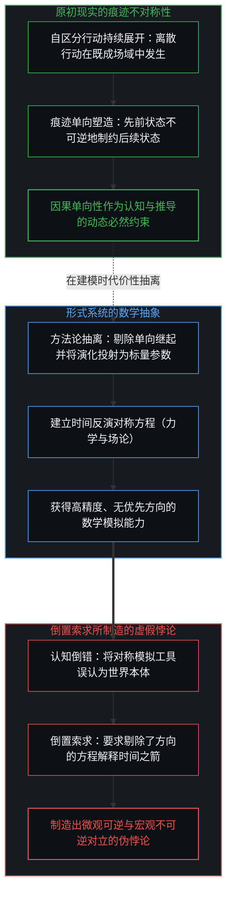

Throughout the history of modern science, the unidirectional flow of time has frequently been portrayed as an insoluble mystery. Theorists persistently ask: Why do we remember the past but not the future? Why does shattered glass never spontaneously reassemble? Why are microscopic equations strictly symmetric under time reversal while macroscopic experience is rigorously irreversible? This perplexity appears profound, yet it arises from a concealed inversion. In lived reality, the arrow of time is identical to the asymmetric accumulation of causal traces: every discrete event occurs within a field already constrained by prior events. Earlier conditions dictate subsequent boundaries, while subsequent effects cannot travel back in time to alter their origins. This trace asymmetry is causality, and it is the arrow of time: a single relation described under two names.

Causality is never an objective property inside a physical system waiting to be derived; it is the dynamic necessary constraint that enables observation, experimentation, and deduction to occur in the first place. Nevertheless, in striving for mathematical unification and global predictive reach, modern physics enacted a pivotal abstraction: it methodologically stripped away the lived directedness of succession, compressing temporal progression into a reversible scalar parameter. This strategy succeeded brilliantly, allowing humanity to transcend intuitive chaos and formulate mechanical laws. The error occurred when subsequent generations forgot this methodological subtraction, mistaking the time-symmetric formalism for the complete architecture of reality and demanding that it explain why time possesses direction. Using a map that deliberately erased orientation to ask why the terrain has a forward slope is the precise genesis of the paradox.

```mermaid
graph TD
    subgraph S_OntologicalGround_EN ["Trace Asymmetry of Reality"]
        direction TB
        AE_Action["Discrete Action Unfolding: Events Constrained by Prior Field"] --> BE_TraceAsymmetry["Trace Asymmetry: Earlier States Unidirectionally Bound Later States"]
        BE_TraceAsymmetry --> CE_DynamicNecessity["Causal Directedness as Necessary Precondition of Cognition"]
    end

    subgraph S_FormalAbstraction_EN ["Mathematical Formalism Abstraction"]
        direction TB
        DE_MethodOmission["Methodological Omission: Abstracting Away Succession into Parameter t"] --> EE_SymmetricEquations["Formulating Time-Symmetric Dynamics (Mechanics and Fields)"]
        EE_SymmetricEquations --> FE_HighFidelitySim["Securing High-Precision Symmetric Predictive Reach"]
    end

    subgraph S_InversionParadox_EN ["The Inversion and Manufactured Paradox"]
        direction TB
        GE_MistakeMap["Category Inversion: Mistaking Symmetric Map for Ontological Ground"] --> HE_DemandArrow["Inverted Demand: Coercing Symmetric Equations to Generate the Arrow"]
        HE_DemandArrow --> IE_ManufacturedParadox["Manufacturing the Pseudo-Crisis of Micro-Reversibility vs Macro-Irreversibility"]
    end

    CE_DynamicNecessity -. "Abstracted away as deliberate cost" .-> DE_MethodOmission
    FE_HighFidelitySim ===> GE_MistakeMap

    style S_OntologicalGround_EN fill:#161b22,stroke:#3fb950,stroke-width:1.5px,color:#3fb950
    style S_FormalAbstraction_EN fill:#161b22,stroke:#58a6ff,stroke-width:1.5px,color:#58a6ff
    style S_InversionParadox_EN fill:#161b22,stroke:#f85149,stroke-width:1.5px,color:#f85149
    style AE_Action fill:#0d1117,stroke:#3fb950,stroke-width:1px,color:#f0f6fc
    style BE_TraceAsymmetry fill:#0d1117,stroke:#3fb950,stroke-width:1px,color:#f0f6fc
    style CE_DynamicNecessity fill:#0d1117,stroke:#3fb950,stroke-width:1.5px,color:#3fb950
    style DE_MethodOmission fill:#0d1117,stroke:#58a6ff,stroke-width:1px,color:#f0f6fc
    style EE_SymmetricEquations fill:#0d1117,stroke:#58a6ff,stroke-width:1px,color:#f0f6fc
    style FE_HighFidelitySim fill:#0d1117,stroke:#58a6ff,stroke-width:1px,color:#f0f6fc
    style GE_MistakeMap fill:#0d1117,stroke:#f85149,stroke-width:1px,color:#f0f6fc
    style HE_DemandArrow fill:#0d1117,stroke:#f85149,stroke-width:1px,color:#f0f6fc
    style IE_ManufacturedParadox fill:#0d1117,stroke:#f85149,stroke-width:1.5px,color:#f85149
```

## 热力学第二定律的真实边界：封闭系统的记账副产物 / The Boundary of the Second Law: Bookkeeping Artifact of Closed Systems

热力学第二定律常被推崇为自然界中最不可动摇的单向演化铁律，甚至被赋予了决定宇宙最终命运的形而上学地位。但若回到其诞生的现场，便能看清其适用的严格边界。热力学萌芽于蒸汽机与工业热机的效率计算，其经验确证依赖于一个高度人工化的设定：一个边界隔绝、质量与能量不与外界交换的孤立系统。在这样一个假定的容器内部，观察者在外界指定一组固定的初始参数，随后通过统计手段，追踪其微观状态数在相位空间中的几何重组。在给定的初始约束下，微观粒子向高概率的微观状态扩散，表现为宏观熵的持续增长。这一法则在封闭实验环境下是坚固而可重复的，正如我们在[普通人视角的解释陷阱](../the-explanatory-trap-of-the-ordinary-perspective/)中所剖析的，统计学是一套强大的认识论测量工具。

然而，严重的范畴错位发生在物理学试图将这种实验室里的记账规则推广到整个宇宙的那一刻。宇宙不是一个放在实验台上的密闭气缸，宇宙外部不存在隔热壁，更没有一个端坐于宇宙之外的记录员去圈定初始微观状态并测算其统计平均。一旦将孤立系统的封闭性假设无条件推向全体存有，理论就立刻撞上了自己制造的绝壁：为什么宇宙在最初会处于一个概率极低、高度有序的低熵状态？为了拯救这一被泛化的法则，物理学家不得不提出所谓的“过去假说”（Past Hypothesis），硬生生为宇宙大爆炸贴上一个无法被解释的低熵补丁。熵增决不是世界基底上的实体力量，它只是人类在假设系统封闭的前提下，对内部状态重组进行统计描述时所显影出的记账副产物。正如[开放即一致](../openness-is-consistency/)所揭示的，没有任何系统能够保持永久孤立封闭，把局部的绝热记账升级为宇宙的终极神话，是概念脚手架的严重逾矩。

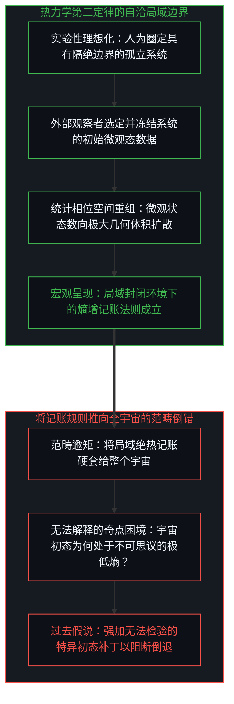

The second law of thermodynamics is frequently venerated as nature's most immutable directional decree, even elevated into a metaphysical dogma governing the destiny of the universe. Yet tracing its origin reveals its strict operational boundaries. Thermodynamics originated from calculating the efficiency of steam engines and industrial machines, resting entirely upon an artificial construct: an isolated system enclosed by impermeable walls exchanging neither mass nor energy with the exterior. Within this container, an external observer declares initial parameters fixed, and subsequently deploys statistical methods to track the geometric redistribution of microstates across phase space. Under fixed boundary constraints, particles disperse toward macrostates corresponding to maximum phase volume, manifesting as entropy increase. This formulation remains sound and reproducible under enclosed experimental conditions. As analyzed in [The Explanatory Trap of the Ordinary Perspective](../the-explanatory-trap-of-the-ordinary-perspective/), statistics is an indispensable epistemic tool.

Category confusion strikes when this laboratory bookkeeping is unreflectively extended to the cosmos. The universe is not an insulated cylinder resting upon a laboratory bench. The cosmos possesses no exterior thermal barriers, nor does an observer sit outside reality to calibrate initial coordinates and compute partition functions. The moment the closed-system assumption is projected onto the whole of existence, theory encounters a self-inflicted barrier: Why was the initial cosmic state situated in an astonishingly improbable, low-entropy configuration? To rescue this over-extended rule, physicists introduced the "Past Hypothesis," stapling an untestable boundary postulate onto the Big Bang to arrest infinite regress. Entropy increase is not an ontological driver of existence; it is an analytical artifact resulting from the closed-system assumption. As demonstrated in [Openness Is Consistency](../openness-is-consistency/), no system can be kept closed. Elevating local accounting into cosmic destiny is an overstep of theoretical scaffolding.

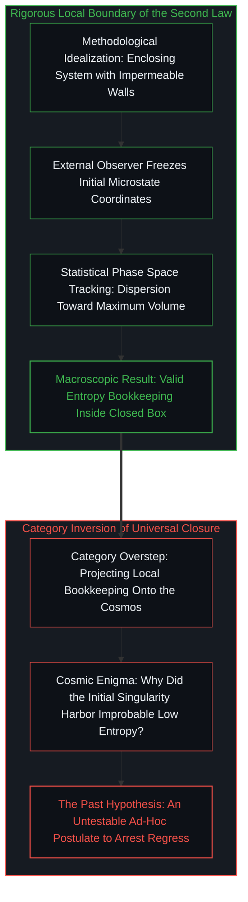

## 物理形式系统的代数神采与时间反演对称 / The Algebraic Elegance and Time-Reversal Symmetry of Physical Formalisms

理论物理学之所以能够成为人类理性最璀璨的丰碑之一，正是因为它敢于运用极其激进的数学抽象。考察经典力学、量子力学与广义相对论的核心方程式，会发现一个令人赞叹的共同特征：它们在时间反演变换下展现出近乎优美的对称性。无论是牛顿第二定律对时间求二阶导数、哈密顿正则方程、薛定谔波函数的幺正演化，还是爱因斯坦场方程，当把方程中的时间参数由正号置换为负号时，动力学定律依然保持形式不变。这就意味着，在形式化的数学推演中，一个粒子系统既可以从过去平滑演化到未来，也可以从未来无缝倒流回过去；如果拍摄一段双星运动的录像倒序播放，其轨迹依然服从引力定律的严密支配。
 
这种数学对称性在相对论的“块状宇宙”（Block Universe）图景中达到了哲学的登极：时间被几何化为第四个空间维度，过去、现在与未来被铺展在一张四维时空流形的几何画卷上，每一个事件都像空间坐标中的点一样恒定存在。许多思想家由此得出结论：时间的流动不过是人类受限于感官而产生的生物性错觉，在物理底层并不存在先后之分。然而，这恰恰混淆了**形式坐标图纸**与**展开测量的现实动作**。在纸面上，画出一整条时间轴当然不需要消耗时间；翻看一卷胶片，正着卷动与反着卷动也同样轻而易举。但这决不证明世界本身是一个死寂的静态晶体。坐标轴的对称并存，只反映了分析工具在空间化表征上的便利；把图纸上的并存当成宇宙真实的本体状态，是典型的工具对主权的僭越。正如在[物理定律的移花接木与现实摩擦](../the-sleight-of-hand-in-physics-is-the-law-and-the-friction-of-reality/)中所指出的，形式模型可以任意对称变换，但绘制模型的物理测量动作永远服从因果代价。

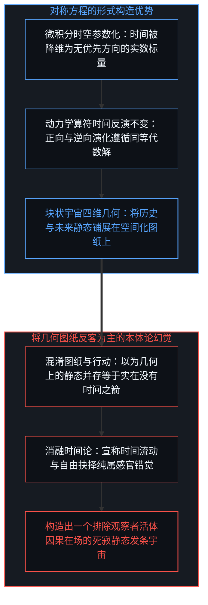

Theoretical physics stands as one of the towering monuments of human reason precisely because it embraces radical mathematical abstraction. When examining the core equations of classical mechanics, quantum mechanics, and general relativity, a shared property emerges: they exhibit symmetry under time reversal. Whether taking second-order time derivatives in Newtonian dynamics, formulating Hamiltonian canonical relations, evaluating the unitary propagation of the Schrödinger wave function, or solving the Einstein field equations, substituting negative temporal coordinates for positive ones preserves the mathematical integrity of the laws. Within formal calculus, a physical system can propagate smoothly forward from the past into the future or traverse backwards without mathematical breakdown. A film depicting planetary orbits played in reverse violates no gravitational equation.

This mathematical symmetry culminated philosophically in the relativistic "Block Universe" paradigm: time is spatialized into a fourth dimension, with past, present, and future laid out across a four-dimensional manifold where events exist timelessly. Many theorists concluded that the passage of time is merely a subjective illusion, asserting that at the foundational layer of physics, no directional succession exists. This deduction confuses the **formal coordinate manifold** with the **living physical act of observation**. On paper, drawing a static timeline requires zero temporal passage; inspecting a film strip forward or backward requires equivalent mechanical manipulation. This operational ease does not demonstrate that reality is a static four-dimensional crystal. The symmetrical coexistence of coordinate points reflects the convenience of spatialized representations. Confusing coordinate grids with reality represents an overstep of analytical scaffolding. As detailed in [The Sleight of Hand in "Physics Is the Law" and the Friction of Reality](../the-sleight-of-hand-in-physics-is-the-law-and-the-friction-of-reality/), formal systems permit symmetry operations, yet the physical acts that measure and construct those equations pay irreversible causal costs.

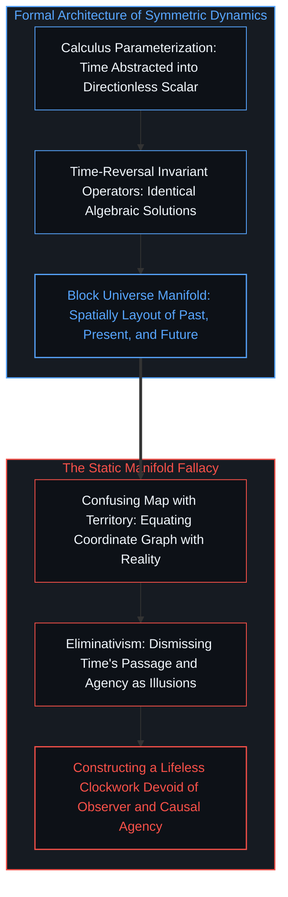

## 模拟决非生成：纸面代数与不可逆因果耗散的鸿沟 / Simulation Is Not Generation: The Chasm Between Symbolic Symmetry and Physical Dissipation

要消解时间反演对称性所引发的认知混乱，必须看清“模拟”（Simulation）与“生成”（Generation）之间的本体论界限。物理学方程是对现实世界因果交互的高保真模拟器。当我们在纸面上写下哈密顿量或运行一组动力学微分方程时，计算机芯片中流转的只是离散状态的符号矩阵。在代数运算中，将时间变量反向代入，是一个不需要支付任何现实摩擦代价的抽象重写。在符号世界里，一加一等于二是一套零耗散的等价代换；但在真实的因果展开中，每一次行动都是一次不可逆的介入，它必须消耗能量、遭遇摩擦并不可挽回地重塑环境的痕迹场。

模拟可以达到令人惊叹的拟真度：我们可以模拟出星系碰撞的壮丽景象，也可以模拟出分子折叠的微观过程。然而，无论这种模拟多么逼真，它都决非物理实在本身的本体复现。物理方程之所以表现出时间反演对称，恰恰是因为在构筑这套方程式的第一天，人类就预先对“此者先于彼者”的原始因果约束闭上了眼睛。数学形式系统本身并没有自发产生先后次序的能力，它从头至尾都寄生在调用它的观察者身上——是正在书写方程、正在敲击键盘、正在实验室读取仪表的活体心智，在不可逆地行使着第一人称因果主权。正是在[笛卡尔的认识论跃迁与造神狂热](../the-cartesian-overstep-and-the-frenzy-of-creation/)中指出的，作为下游产物的工具与算法，虽然可以继续作为原因去引发后续效应，但它决无法反向成为产生自身的原因。强求一套专为忽略因果单向性而设计的模拟工具去自发产生时间之箭，无异于指望一张静态的航海图纸自己长出顺风与洋流。

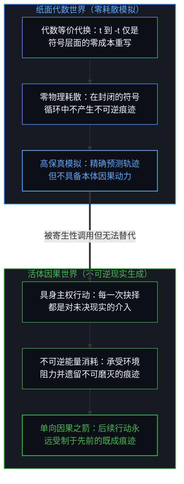

Dissolving the confusion surrounding time-reversal symmetry requires delineating the ontological boundary between "simulation" and "generation." Physical equations are high-fidelity simulators of causal interaction. When we write a Hamiltonian or calculate differential equations, compute clusters manipulate symbolic matrices across discrete registers. Within algebraic calculation, inverting the time variable is an abstract rewrite incurring zero physical friction. On paper, one plus one equals two constitutes a zero-dissipation tautology. In physical causality, every intervention is an irreversible act: it consumes energy, encounters friction, and indelibly reshapes the surrounding field of traces.

Simulation achieves staggering fidelity: supercomputers simulate galactic collisions across billions of years and calculate the nanosecond folding of proteins. Yet however immaculate, simulation is not ontological reproduction. Physical formalisms exhibit time-reversal symmetry precisely because their creators bracketed the lived constraint of "this precedes that." Formal mathematics possesses no intrinsic engine to generate temporal succession; it relies entirely upon the embodied agent wielding it. It is the living observer typing the code, running the simulation, and recording telemetry in the laboratory who continuously exercises irreversible first-person causal sovereignty. As emphasized in [The Cartesian Epistemic Leap and the Frenzy of Creation](../the-cartesian-overstep-and-the-frenzy-of-creation/), downstream tools and algorithms can serve as causes for subsequent effects, but they cannot reverse the arrow of causality to ground the source that authored them. Coercing an analytical tool engineered by ignoring directional causality to generate time's arrow is like expecting a navigational chart to spontaneously generate ocean currents.

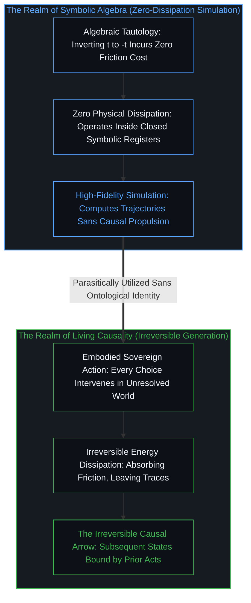

## 机制增生的崩溃：解构过去假说与退相干神话 / The Collapse of Epicycles: Dissolving the Past Hypothesis and Decoherence Myths

当人们执拗地强求一套时间对称的数学形式去解释不对称的现实时，形式系统为了掩盖这一底层裂痕，必然会走向臃肿而繁复的“机制增生”。在托勒密天文学时代，为了维持地心说的对称圆周轨道，天文学家不得不层层叠加偏心圆与本轮；而在当代基础物理学中，如出一辙的戏码在时间之箭的议题上反复上演。
 
最典型的机制增生就是热力学中的“过去假说”与玻尔兹曼大脑佯谬。既然微观力学是时间对称的，那么一个处于高熵态的气体系统自发涨落出低熵有序结构的概率，在数学形式上等同于它从低熵态扩散到高熵态的概率。依据这一形式对称的推导，整个宇宙包含数十亿星系、行星与文明的宏观低熵状态，被判定为一个极度不可思议的热力学涨落。为了阻断由此引发的虚无主义推论，物理学界不得不诉诸一种特殊的形而上学宣称：宇宙大爆炸必须以一个巧合至极的特异低熵状态作为起点。
 
类似的形式修补在量子测量理论中同样随处可见。为了保住薛定谔波函数严格的时间可逆性与幺正演化，同时又要解释为什么我们在实验室中只测量到确定的、不可逆的单向历史，理论界不得不发明出更为繁复的假设：有的诉诸量子退相干，把单向性推卸给环境自由度的纠缠耗散；有的则索性构想出休·埃弗雷特的多世界诠释，断言宇宙在每一个量子选择处都在持续分裂出平行的宇宙分支，以此来保全数学上的整体对称性。所有这些令人眼花缭乱的理论补丁，在本体论上犯下了同一个错误：它们都在试图用被模型刻意排除的要素，去填补模型制造的空白。一旦看清时间之箭本来就是现实未决因果的原初特征，这些为了拯救模型对称性而增生出的复杂齿轮，便会在一瞬间失去存在的必要。正如在[无法逃脱的心智边界](../one-cannot-escape-ones-own-mind/)中所提示的，向外追问无限增生的宇宙假说，只是心智迷失在自身投射出的代数迷宫之中的结果。

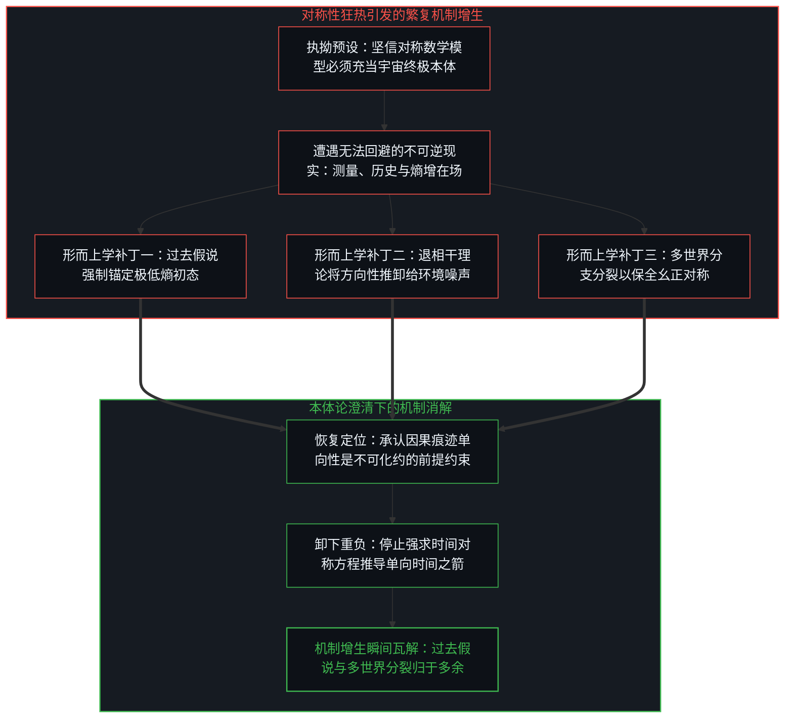

When theorists obstinately coerce time-symmetric equations to explain an asymmetric reality, the formalism inevitably manufactures baroque epicycles to conceal its systemic boundary. In Ptolemaic astronomy, preserving uniform circular motion around a stationary Earth required adding epicycles and equants; in contemporary fundamental physics, an identical spectacle unfolds around the arrow of time.

The most transparent manifestation of this proliferated scaffolding is the Past Hypothesis and the associated Boltzmann brain paradox. Because microscopic mechanics is time-symmetric, a high-entropy gas fluctuation spontaneously assembling into an ordered state carries identical mathematical probability to an ordered state dispersing into disorder. Derived from this symmetrical formalism, our observable universe—containing billions of galaxies, planets, and conscious agents—is classified as an improbable thermodynamic fluctuation. To arrest the resulting epistemological collapse, theorists introduced the Past Hypothesis: declaring that the universe must have originated in an extraordinarily fine-tuned, low-entropy initial state.

Analogous patches appear across quantum foundations. To preserve the unitary time-reversibility of the Schrödinger equation while accounting for irreversible measurement records in actual laboratories, physics introduced complex machineries: appealing to environmental decoherence to displace directionality into unobserved degrees of freedom, or invoking Everett's Many-Worlds Interpretation, positing that reality branches infinitely at every quantum transition to preserve global symmetry. All these epicycles commit the same foundational error: attempting to deploy factors methodologically excluded by the model to plug the void created by the model. The moment we recognize that the arrow of time is the foundational trace asymmetry of living causality, these complicated epicycles lose their raison d'être. As observed in [One Cannot Escape One's Own Mind](../one-cannot-escape-ones-own-mind/), chasing infinite theoretical epicycles represents the mind becoming entangled in its own algebraic labyrinth.

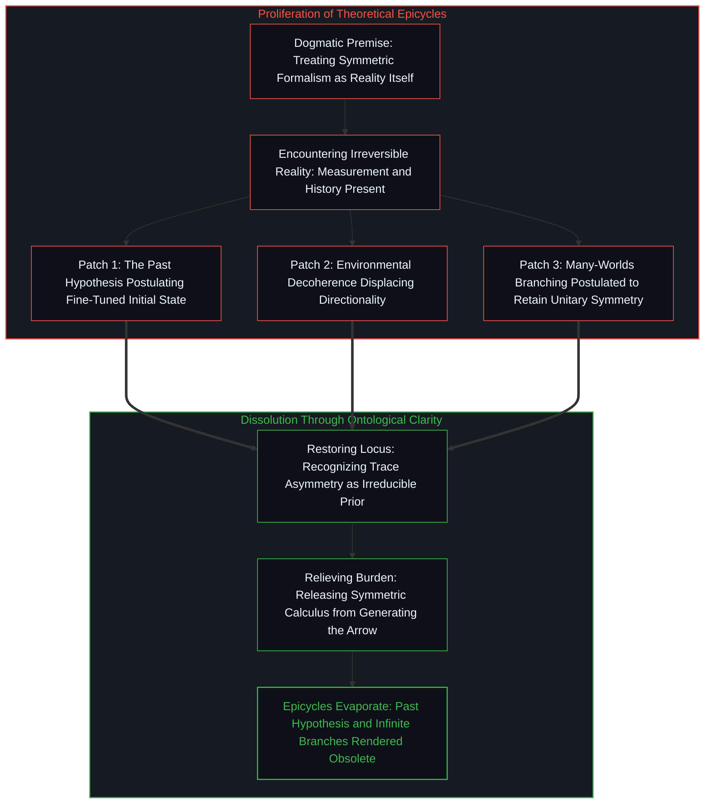

## 卸下物理学的形而上学重负：在有限视界中还原因果主权 / Relieving Physics of Metaphysical Burden: Restoring Causal Sovereignty within Bounded Horizons

澄清时间之箭的非悖论性，决不是为了否定物理学，而是为了保护物理学免于被过度榨取。物理学是一门无与伦比的实证科学，它能够以极其精密的数学结构，对复杂的物质运动做出惊人准确的数值预测。它让人类得以建造跨洋客机、设计纳米级集成电路，并向深空发射精准变轨的探测器。这种威力是确凿无疑的。

然而，物理学的威力来自于它的谦逊——来自于它明确限定边界条件、在局域范围内对相互作用进行可操作测量的能力。当我们看清了物理方程是一套剔除了单向继起性的高保真模拟器时，我们便能在同一瞬间卸下强加在它身上的沉重枷锁：
第一，热力学第二定律不需要被尊奉为宇宙的终极神明，它在其最初划定的封闭系统内，继续作为极其优异的工程与实验记账法则发挥效力；
第二，时间反演对称的微观动力学方程，也不需要被逼迫着去解释意识为什么感知到了时间流逝，它在描述保守力学系统的能量转化与轨道演变中依然保持着无与伦比的精确性。

二者都无需扮演对整个存在的本体论重构。现实本身从来没有陷入悖论，所有的困顿都来自于一种认知上的强买强卖：强求一套极其有用的模拟工具，去反客为主地取代它所模拟的原初现实。真实的世界永远由活体心智在未决的阻力中行使因果抉择而展开。时间之箭不是模型吐出的数据结果，而是心智进行探索、测量与创造时不可让渡的基底支点。看清工具的系统边界，我们不仅找回了物理学的真正优雅，更在辽阔的世界中，重新确立了生命承担因果代价的原初尊严。

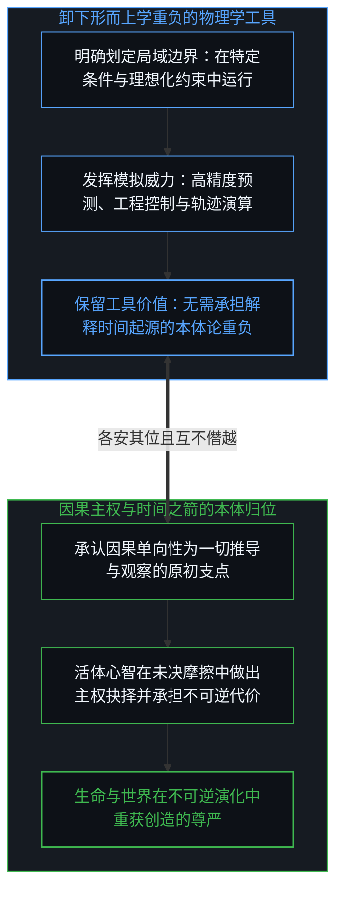

Clarifying the non-paradoxical nature of time's arrow does not diminish physics; it protects it from metaphysical inflation. Physics stands as an empirical science of unparalleled rigor, capable of predicting intricate dynamical interactions with extraordinary numerical precision. It allows humanity to construct transoceanic aircraft, fabricate nanoscale semiconductors, and steer spacecraft across deep space with millisecond precision. This mastery is undeniable.

Yet the strength of physics stems from its operational modesty: its capacity to delineate boundary conditions and conduct reproducible measurements within bounded domains. The moment we recognize that physical formalisms function as high-fidelity simulations from which directional succession was methodologically subtracted, we liberate the discipline from an impossible metaphysical burden:
First, the second law of thermodynamics need not be venerated as an ontological cosmic ruler; within its operational domain of closed systems, it retains its validity as an indispensable engineering and experimental accounting framework.
Second, time-symmetric dynamical equations need not be coerced into explaining why consciousness perceives the passage of time; they preserve their predictive brilliance in describing energy conservation and trajectory evolution within conservative mechanical systems.

Neither formal system is required to masquerade as an ontological reconstruction of existence. Reality itself remains free of paradox; all conceptual paralysis originated from category inversion: demanding that a functional simulation replace the living reality it models. The living world unfolds as embodied agents exercise sovereign causal choices within unresolved resistance. The arrow of time is not a statistical output generated by equations; it is the inalienable bedrock through which inquiry, measurement, and creation occur. Recognizing the boundary of the tool preserves the authentic elegance of physics, restoring to living minds the foundational dignity of bearing causal consequences across time.

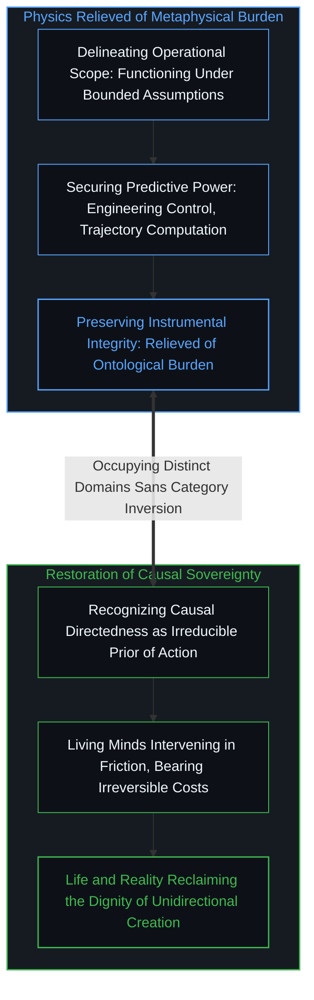
