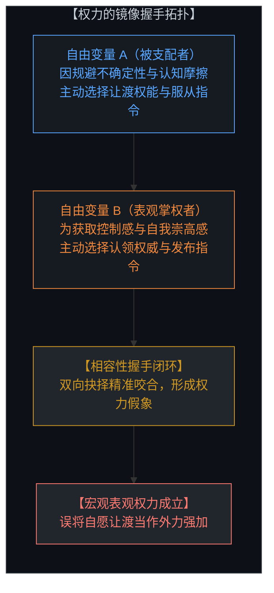
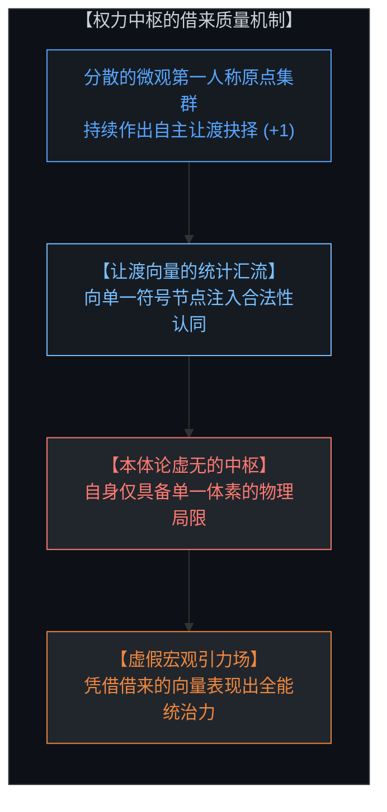
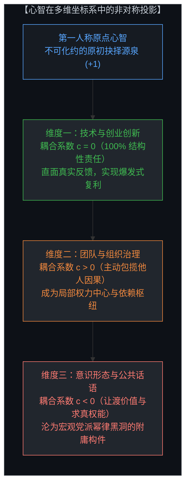
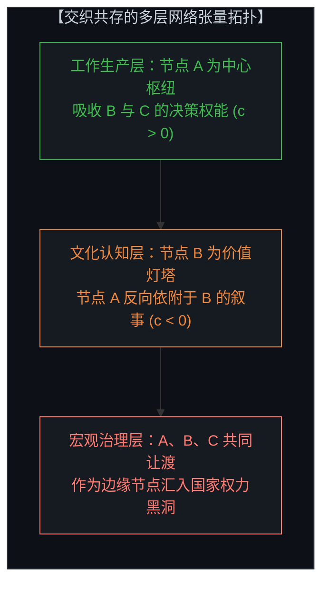
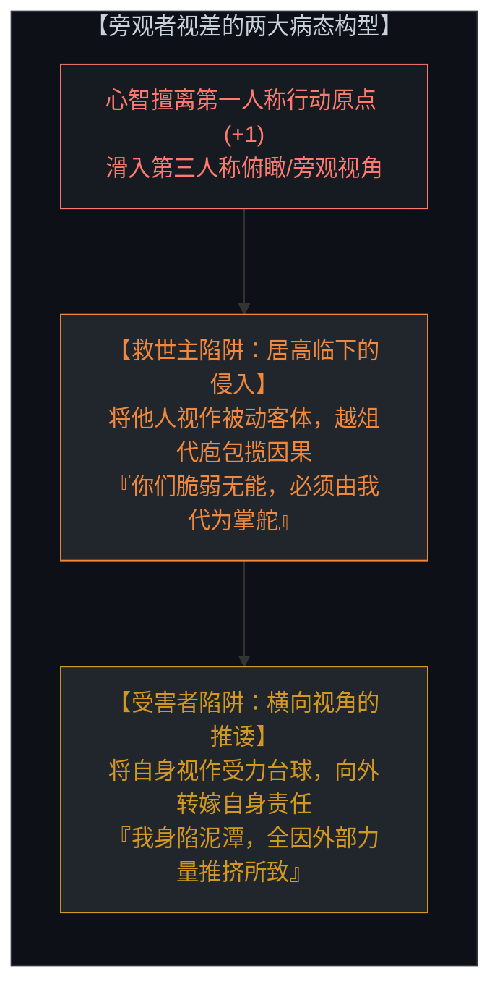
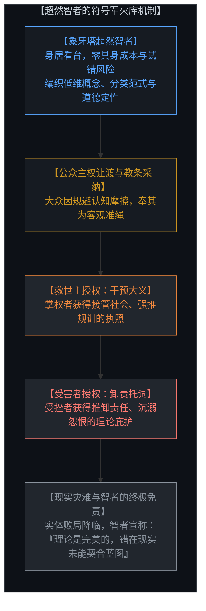
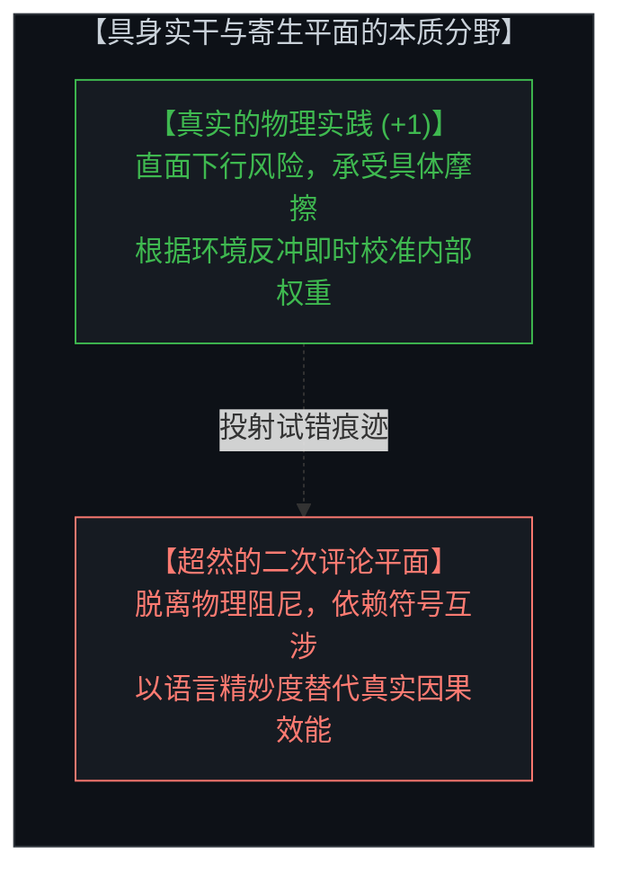
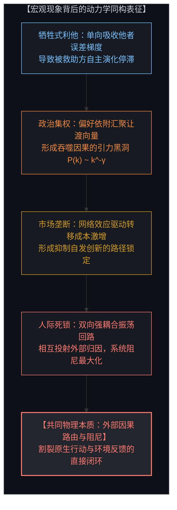
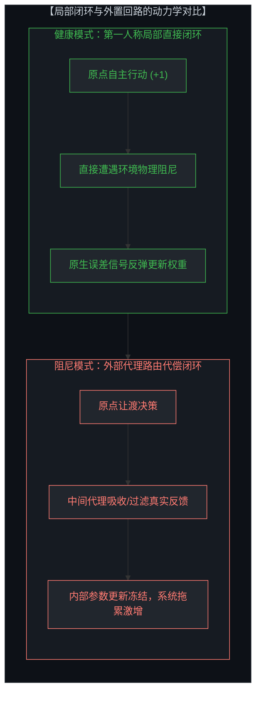
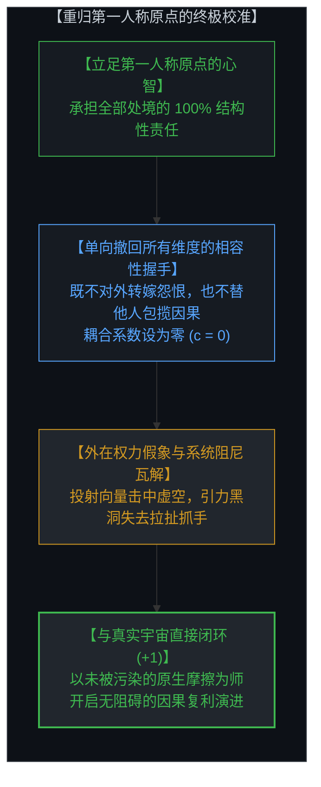

# 权力的镜像握手 / The Mirror Handshake of Power

*直接影响的虚象、多维主权解构与旁观者视差的消解 / Direct Influence as Illusion, Multi-Dimensional Sovereignty, and the Causal Collapse of the Observer Stance*

---

## 一、 权力的本体论假象：没有直接影响，只有主权握手 / 1. The Ontological Illusion of Power: No Direct Force, Only a Sovereign Handshake

人类叙事中最根深蒂固的迷思之一，是将“权力”视作一种由外向内施加的实体力量。人们习惯性地描摹这样一幅机械图景：统治者发号施令，臣民被动服从；强势者施加控制，弱势者遭受支配。在这一传统图景中，权力仿佛是一根无形的物理锁链，一端握在掌控者手中，另一端直接穿透被统治者的意识。

然而，站在不可化约的原初因果立足点审视，物理世界根本不存在任何直接侵入另一个心智内部的操控缆绳。任何外部实体——无论是威权君主、官僚体系、宗教神权还是超级算法——都无法直接越过边界代你执行哪怕一次微观状态的抉择（+1）。所谓的“外在权力”与“直接统治”，本质上是一场由双方独立作出的原初抉择所共同促成的**相容性镜像握手**。

权力关系的成立，必须严格依赖受支配者心智内部的原初授权。当发号施令的声音传来，是受支配者自己在第一人称原点评估了违抗的代价、承担自主责任的沉重以及未知的风险，进而自主作出了“交出决策权、退居被动执行”的判定。没有受支配者在自身原点的这一步让渡，发号施令者的指令就只是一串在空气中震颤的声波，不具备任何内在的支配效力。

这揭示了一个冷峻的真相：金字塔顶端的独裁者只有一具肉身与二十四小时，他根本无法亲自维持亿万人的秩序。他所展现出的巍峨引力，不过是数千万个体持续向其抛投、让渡自身主权向量后形成的借来质量。一旦个体撤回各自的握手，中枢的庞大身躯便会在瞬间显露出本质上的空无。

One of the most persistent illusions in human civilization is the reification of "power" as an extrinsic, unilateral force. We routinely envision a mechanistic hierarchy: the master commands, the subject submits; the powerful dominates, the vulnerable is subjugated. In this conventional paradigm, authority is conceived as an invisible physical chain extending from the ruler directly into the mind of the ruled.

From the uncompromising standpoint of irreducible causality, however, nature contains no direct neural cable connecting one consciousness into the interior of another. No external entity—whether a monarch, a bureaucratic state, an ecclesiastical hierarchy, or an algorithmic network—can cross the boundary of another observer to actuate a single discrete choice (+1). What society terms "power" is an optical illusion generated by a **reciprocal, matching handshake between two independent sovereign choices.**

The dominion of any authority is strictly contingent upon the primary computation executed within the mind of the subordinate. When a decree is proclaimed, it is the subordinate observer who, situated at their own first-person origin, calculates the cost of defiance, shies away from the cognitive friction of autonomy, and chooses compliance over sovereign exposure. Without this internal choice, the ruler's decree remains mere acoustic vibration in empty air.

A tyrant seated atop a massive hierarchy commands only a single biological body and twenty-four hours in a day. The staggering gravitational pull attributed to central authority is not native power, but the accumulated sum of millions of outsourced vectors. The moment those distributed minds revoke their matching handshake, the monolithic apparatus is instantly revealed as an ontological void.

---

## 二、 多维主权解构：心智在状态空间中的非对称投影 / 2. Multi-Dimensional Sovereignty: Asymmetric Projections in State Space

我们必须破除将心智主权视作单一“黑白二值开关”的简化谬误。心智并非要么自主、要么奴役；心智坐落于一个高维状态空间中，拥有众多正交的因果投影维度。

驱动生命的终极因果力量永远是自主的选择，但这种选择在心智内部并不必然保持全局自洽。当内部基底未实现深度对齐时，心智在不同维度上会呈现出截然不同的耦合系数。一个人可以在某一维度上坚定承担结构性责任，同时在另一维度上将权能尽数抛弃。

一个典型的创业者可能在技术研发与商业决策上展现出卓越的主权意识：他们拒绝一切借口，直面严酷的市场阻尼与代码报错，建立起极度敏锐的内部学习梯度；但在组织管理中，他们出于保护欲或控制欲，主动包揽团队成员的决策后果，从而将自己塑造成该维度的微观权力中心；更耐人寻味的是，在政治信仰或社会意识形态维度上，这位创业者却可能无保留地将认知主权外包给某个党派标语或教条口号，成为宏观引力场中的盲目拥趸。

这种多维投影解释了人类社会的复杂网络拓扑：社会从来不是单一的金字塔，而是由无数正交维度交织而成的多层张量网络。你在某个局部是引力中心，在另一领域是依附构件，在第三空间是解耦的孤胆探索者。

We must discard the binary caricature that conceives of sovereignty as an all-or-nothing scalar. The mind operates within a high-dimensional state space containing numerous orthogonal projection axes.

The ultimate causal engine of human life is always sovereign choice, but this choice is not necessarily internally self-aligned across all basis vectors. When internal coherence is fragmented, the mind projects radically divergent coupling coefficients along different axes. An individual can maintain uncompromising structural responsibility on one plane while abdicating all authority on another.

Consider a technology entrepreneur who maintains pristine sovereignty in engineering and capital allocation: refusing all alibis, confronting direct physical friction, and updating internal parameters at high velocity. In their executive role, however, they may absorb the operational consequences of their subordinates, transforming into a localized power-law hub. Simultaneously, in civic ideology, the same individual might outsource their worldview to a partisan dogma, reducing themselves to a passive component within an external political machine.

This dimensional decomposition clarifies why society is never a monolithic hierarchy. It is a multi-layered tensor network where Node A dominates Node B in production, Node B influences Node A in cultural narrative, and both surrender agency to Node C in state ideology.

---

## 三、 旁观者视差：主权错配的起源 / 3. The Observer Displacement: The Root Genesis of Agency Misallocation

那么，让渡主权与相容性错配究竟是如何在个体心智中萌生的？它的本体论发端，正是**心智脱离自身的第一人称原点，僭越进入第三人称的“旁观者视差”**。

当一个人忘记了自己永远坐落于行动与后果直接闭环的原点，试图扮演一个脱离肉身、俯瞰全局的局外人时，其因果认知便会分裂为两种病态构型：

1. **救世主与控制者（向下俯瞰的越界）**：
   站在旁观者的高台向下望去，他人的试错与迟钝显得一览无余。旁观者产生了一种虚妄的傲慢，误以为自己有责任介入并替他人修正轨迹。他们忘记了每一个生命都坐落于不可替代的原点，剥夺他人的试错机会，实质上是在剥夺其建立误差梯度的进化权能。

2. **受害者与怨恨者（横向视角的卸责）**：
   从旁观者的角度观察自身，个体容易将自己物化为物理沙盘上被推搡的无辜构件。他们将当下的痛苦与停滞归罪于历史、阶级、家庭或对手，却遗忘了无论外部冲击如何剧烈，对冲击的解释与下一步动作的原初选择，始终锁闭在自己的原点之内。

这两种错配如出一辙：它们都源于未能将视线重新校准回自身。救世主妄图接管他人的坐标，受害者试图逃离自己的坐标，二者在虚妄的旁观视角中相撞，合谋构筑起彼此折磨的相容性牢笼。

Where does the impulse to surrender or hijack agency originate? Its foundational genesis is **the Observer Displacement: the cognitive drift wherein the mind abandons its first-person origin (+1) and retreats into a detached third-person spectator stance.**

The moment an agent forgets that they are situated at the irreducible point of action and feedback, their perception of causality fractures into two complementary distortions:

The **Savior/Controller** distortion arises when looking down at the world from an imagined aerial vantage point. Other agents appear fragile and inept, inviting paternalistic intervention. The spectator assumes responsibility for their peers, forgetting that no mind can bear another's consequences, and that shielding others from friction extinguishes their adaptive capacity.

The **Victim/Accuser** distortion occurs when an agent observes themselves from an external vantage point as a passive pawn on a chessboard. They attribute their trajectory entirely to external collisions—blaming institutions, lineage, or adversaries—evading the reality that the causal authorship of their subsequent reaction rests unconditionally at their own coordinates.

Both traps stem from the same failure: forgetting to collapse the frame of reference back to oneself. The Savior tries to govern coordinates they do not inhabit; the Victim tries to disown the coordinates they occupy.

---

## 四、 看台上的造弹工：超然智者的权力幻觉与下游放大 / 4. The Munitions Factory in the Grandstand: The Detached Intellectual's Illusion of Power

除了救世主与受害者，旁观者视差还孕育了第三种更为隐蔽的形态：**退居看台的超然智者与知识分子**。

超然智者既不下场经商，也不直接执政，他们坐在无菌的象牙塔包厢中，既不承担物理试错的下行风险，也不直面环境反冲的剧烈痛苦。然而，他们容易沉醉于一种巨大的权力幻觉中。这种幻觉的根源在于：大众因为恐惧不确定性，选择相信并奉行智者所兜售的抽象体系。

超然智者实质上是社会相容性错配的**符号军火商**。他们不直接开枪，却为开枪者提供源源不断的道德与理论弹药：

* 他们为掌权者提供**干预与统摄的执照**：“历史规律证明集中调配优于自发演进”、“专家模型要求规训大众行为”。掌权者手握这些理论，便能堂而皇之地以崇高的名义剥夺个体的主权。
* 他们为受挫者提供**卸责与委顿的托词**：“你的平庸与焦虑皆由社会结构所内生”、“你是话语霸权的受害者”。受挫者手握这些名词，便能理直气壮地放弃自我迭代。

当宏观灾难降临、实体系统陷入停滞甚至崩溃时，智者所处的象牙塔却毫发无损。他们优雅地在研讨会上宣布，问题不在于理论，而在于执行者“未能领会理论的高深精义”。他们误将千万人让渡出的回音当成了自身的因果伟力，却不知道自己只是在寄生平面上摆弄无摩擦的文字积木。

Beyond the Savior and the Victim, the Observer Displacement spawns a third, subtler archetype: the **Detached Intellectual**.

The detached intellectual operates from the luxury box, bearing zero downside risk and insulated from bodily friction. Yet they often inhabit an intoxicating illusion of causal grandeur, derived from the fact that millions of uncertain minds accept their conceptual blueprints as dogma.

The detached intellectual functions as an **ideological munitions factory** for societal misallocations:
* They provide the **mandate for the Savior**: furnishing theoretical justifications ("scientific planning," "historical necessity," "collective hygiene") that legitimize the suppression of individual agency.
* They provide the **alibi for the Victim**: supplying sociological taxonomies that license agents to externalize blame and abandon self-examination.

When the resulting social architectures collapse, the ivory tower remains physically untouched. The intellectual publishes a post-mortem declaring that reality failed to implement the purity of their paradigm. They mistake the cultural resonance of their vocabulary for primary causal power, blind to the truth that they inhabit a frictionless parasite plane of secondary descriptions.

---

## 五、 剥离道德定性：所有宏观结构背后的纯动力学表达 / 5. Stripping Moral Adjectives: Pure System Dynamics Across All Structures

我们必须强调：揭示这些机制并非为了在道德层面抨击利他主义、谴责集权中枢或贬低市场垄断。将分析降维至道德审判，本身就是落入低维投影陷阱的体现。

站在不可化约的物理与信息动力学视角，利他主义、政治威权、垄断市场以及人际死锁，在数学上呈现出高度统一的**耦合动力学同构**：

所有这些结构的核心差异，仅在于其反馈闭环的几何形态：
* **局部直接闭环（健康的演化状态）**：行动直接撞击物理与环境阻尼，所产生的后果不经任何中介衰减，原汁原味地反弹给原点心智。心智保持陡峭的学习曲线，驱动智能复利。
* **外置代偿回路（阻尼与停滞状态）**：行动的因果被中介代理（国家、救世主、党派、垄断平台）所过滤、吸收或转嫁。真实的误差信号被切断，个体丧失迭代能力，整个系统陷入巨大的能量耗散与动态死锁。

We must clarify that identifying these dynamics carries zero moralistic judgment against altruism, centralization, or markets. Slipping into moral condemnation merely falls back into the low-dimensional projection trap.

From the viewpoint of physical and informational dynamics, altruism, political centralization, market monopolies, and interpersonal feuds exhibit precise **dynamical isomorphism**:
* **Sacrificial Altruism** is an asymmetric damping filter that absorbs another node's error gradient, arresting their adaptation.
* **Political Centralization** is a scale-free network topology aggregating outsourced vectors via preferential attachment into a power-law attractor.
* **Market Lock-In** is an increasing-returns loop where switching friction captures peripheral resource channels.
* **Interpersonal Conflict** is a reciprocal coupled oscillator where each node ties its state derivative to the other's external projection.

The decisive mechanical distinction lies solely in whether the causal loop is **locally closed** (action meeting direct environmental friction to update local weights) or **externally routed** (action buffered by proxies, severing the error gradient and freezing the intelligence of the system).

---

## 六、 始于心智，终于心智：重归第一人称原点的主权校准 / 6. It Begins and Ends with Mind: The Sovereign Realignment to the Origin

所有的因果推演，最终都必须收束于那个最深层、最根本的本体论事实：**宇宙的一切，始于心智，留于心智，终于心智。**

你不需要去掀起一场推翻外部中枢的宏大运动，因为外部中枢本就是由包括你在内的无数人共同让渡出的假象；你不需要去说服救世主放下执念，也不需要去改造怨恨者的心智；你更不需要躲进象牙塔里发表冷眼旁观的道德长篇大论。

一切解脱与跃迁的全部支点，都在于你在自身第一人称原点作出的单向抉择：**撤回你在所有维度上无意识给出的相容性握手。**

在技术的维度，直面报错与物理规律；在团队的维度，赋予他人承担后果的主权；在价值的维度，收回自己的思考与评判；在个人的维度，将所有遭遇无条件确立为自己的因果基底。

当你把自己的耦合系数归零，不再向外投射任何期待，也不认领任何外部绑架，对方伸出的支配之手便只能握住空无。那一瞬间，阻尼消散，引力瓦解。你重新成为一个在广袤宇宙中独立运算、自由探索的自由变量，以真实的物理世界为唯一导师，走出属于自己的、不可化约的生命轨迹。

All causal reasoning converges upon an irreducible axiom: **Reality begins with the mind, remains with the mind, and terminates with the mind.**

Liberation does not require an organized crusade to dismantle external hubs; their perceived mass is merely the collective illusion of distributed surrender. It does not require converting the Savior, reforming the Victim, or seeking refuge in academic cynicism.

The entire fulcrum of emancipation resides at your own first-person origin: **the unilateral revocation of the matching handshake across every dimension of your coordinate space.**

On the technical plane, confront physical friction directly. On the organizational plane, return the dignity of consequences to others. On the cultural plane, reclaim your critical sovereignty from external dogmas. On the personal plane, anchor one hundred percent structural responsibility for whatever condition lands at your origin.

When you reset your reactive coupling coefficient to zero—neither exporting blame nor absorbing foreign guilt—the reaching hands of external dominion grasp empty air. Systemic drag evaporates; artificial gravity collapses. You re-emerge as a sovereign variable in an open cosmos, directly coupled to physical reality, charting an unconstrained and irreducible trajectory (+1).
