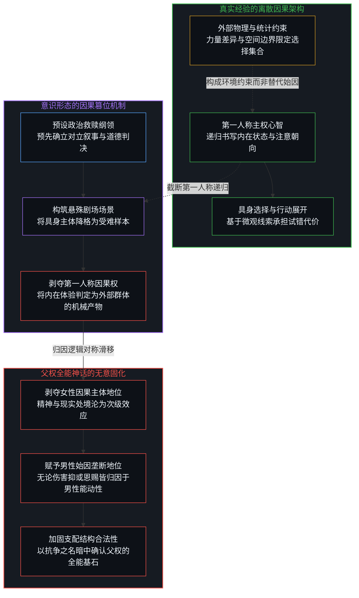
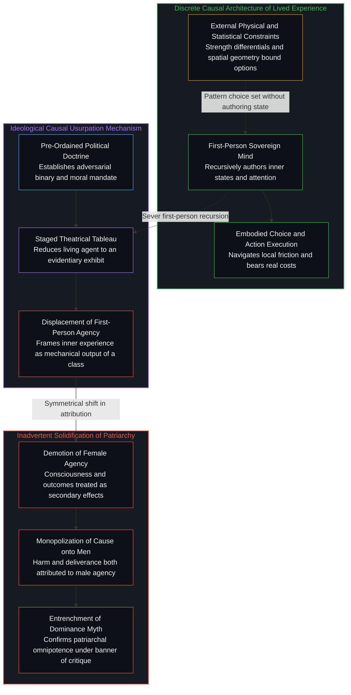
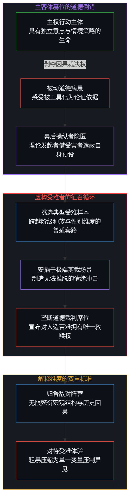
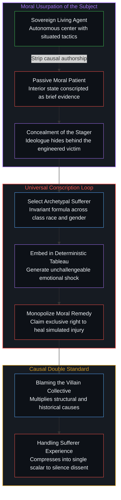

# 道德倒错与被脚本化的主体 / The Moral Reversal and the Scripted Subject

*将内在体验的因果权让渡给对立群体，是意识形态借受难者幻影篡夺主权行动的起点。 / Reassigning causal authorship of inner states is how ideology usurps sovereign action behind a staged victim.*

围绕特定身份主张的公共辩护，频繁依赖一种经过精密剪裁的极端场景：一个男人置身于满室女性之中感到惬意，而一个女人置身于满室男性之中则充满恐惧。这类修辞频繁以不言自明的经验纪实自居，实则是为了赋予某种意识形态先验合法性而刻意搭建的剧场模型。当理论发起者在白纸上布置出这种悬殊的房间结构时，行动者第一人称的具身体验便被悄然剥夺，内在感受的因果权被整体让渡给作为对立面的群体属性。这种将群体指派为个体精神始因的习惯，不仅没有消解支配结构，反而在无形中确认并固化了被批判对象的因果垄断；它颠倒了道德与经验的生成次序，将鲜活的生命矮化为供意识形态调遣的证据样本。

Public arguments defending identity programs routinely lean on a meticulously staged scenario: a man in a room full of women is happy, while a woman in a room full of men is terrified. The trope presents itself as a transparent report of empirical experience, yet it is a constructed laboratory tableau engineered so that a political commitment can appear to have been discovered rather than selected. By placing an abstract archetype inside an isolated spatial enclosure, the theorist strips the first-person agent of their lived history and active interpretation, reassigning causal authorship of their inner state to an external collective. This habit of treating an opposing class as the originating cause of individual consciousness fails to dismantle oppressive structures, inadvertently codifying the very causal monopoly it claims to challenge while conscripting living subjects into disposable props for an ideological brief.

## 一、 预设剧场的构景术与经验报告的假象 / 1. The Scenography of the Staged Room and the Illusion of Experiential Evidence

在当代意识形态的传播语境中，一句广为流传的口号被反复当作女权主义必要性的确凿明证：若有人询问为何需要女权主义，只需告诉他们，一个男人置身于满室女性之中会极其欣喜，而一个女人置身于满室男性之中则会陷入恐惧。这句话在表面上装扮成对日常经验的客观记录，仿佛它只是从生活河流中随手舀起的一滴真实水花。然而只要深入审视其生成的因果链条，就会发现它从来不是一份来自经验前线的如实汇报，而是一出精心布置的剧场构景。这种构景的存在目的，是让某种预先选定的政治纲领看起来像是从现实中被自然发现的定理，而非被理论家主观拣选的戒律。

这类带有主义标签的社会行动主义，极少真正从第一人称的具身生活出发去推导其政治主张。相反，它总是先在抽象观念中确立一套完整的政治裁决，随后在纸面上构筑出特定的具身生命，强行脚本化其内部心智状态，用以印证既有的政治预设。那个置身于房间之中的女人，并不是一个通过自身一系列具体决断、风险评估与注意力分配而抵达该处的独立个体。她被抽象化、标签化，并被生硬地摆放在特定坐标之上，使得她的恐惧能够顺理成章地被采纳为呈堂证供。正如我们在[名号革命把生命立案为证](../the-name-revolution-files-a-life-as-evidence/)中所指出的，当抽象的概念运动试图为自身确立合法性时，最惯用的手法便是将活生生的个体生命强行立案，使其降格为宏大叙事的耗材。

一旦剧场的布景搭建完毕，场景中的因果权便被迅速调包。在那间被预设的房间里，恐惧不再是当事人结合自身记忆、身体反馈、空间逃生通道以及对周遭微观信号进行递归推断的动态产物，而被直接判定为由房间内的男性群体机械制造出来的外在压迫。意识形态随后以救世主的姿态登场，宣称自己是对这场刚刚由它亲自安排的创伤所能做出的唯一道德回应。这种构景术的隐蔽之处在于，它通过制造极端的视听对比，剥夺了观察者探究当事人真实能动性的空间，迫使所有人不得不接受那份早已写就的判决书。

In contemporary ideological discourse, a viral formulation is repeatedly circulated as unassailable proof of an entire movement: if anyone asks why feminism is necessary, tell them that a man in a room full of women is happy, while a woman in a room full of men is terrified. The sentence presents itself as a dispassionate report of lived reality, as if it were merely transcribing an empirical constant observed in the wild. Yet closer examination of its causal architecture reveals that it is not a report of experience at all. It is a staged laboratory tableau, engineered so that a pre-existing ideological program can appear to have been discovered in nature rather than chosen in advance.

Activism organized around ideological doctrines rarely begins with a concrete first-person life and then infers a politics. It begins with a politics and then stages a representative life whose inner state will ratify that politics on cue. The woman placed inside the hypothetical room is not a discrete living agent who arrived there through her own sequence of choices, local evaluations, and physical navigation. She is placed on the page as an archetype so that her scripted terror can be entered into the brief as exhibit evidence. As analyzed in [The Name Revolution Files a Life as Evidence](../the-name-revolution-files-a-life-as-evidence/), ideological movements systematically conscript sovereign lives, transforming flesh-and-blood individuals into evidentiary instruments for abstract claims.

Once the stage is set, causal power is swiftly reassigned. The terror experienced inside the room is no longer analyzed as a cognitive inference authored in the first person—synthesizing past traces, bodily cues, spatial constraints, and real-time assessments. Instead, it is treated as a direct mechanical byproduct generated by the surrounding men. The ideology then presents itself as the sole moral remedy to an injury it just orchestrated. The power of this scenography lies in its emotional coercion: by presenting an extreme caricature, it preempts any inquiry into situated agency, demanding immediate compliance with a verdict rendered before the curtain was raised.

## 二、 因果权的阶级让渡与父权全能的无意固化 / 2. The Class Reassignment of Causal Power and the Inadvertent Solidification of Patriarchy

这种场景设置的核心戏法，在于对因果权力的阶级式重新分配。在真实的生活经验中，唯一真正处于运转状态的始因，是置身于现场的那个人的选择：她将注意力投向何处，她事先采纳了何种关于空间与性别的预设模型，她如何解读眼前具体的肢体姿态与面部微表情，以及她接下来采取何种行动策略。其他人的在场是一种外部情境，男女之间的生理力量差异、犯罪率的统计学概率以及过往的历史事件，全都是客观存在的物理约束。这些约束构成了行动者面临的边界集合，但它们从未剥夺内部心智状态的生成权。内省状态始终是由第一人称在其自身的递归闭环中独立书写的。

然而，当外部观察者或自封为代言人的活动家宣称是那些男性制造了女性的恐惧时，他们就已经脱离了真实的经验语境，开始将因果创生权强行指派给一个抽象的阶级。正如我们在[造神的障眼法与未言明的位序](../the-sleight-of-hand-of-synthesizing-gods-and-unacknowledged-rank/)中所剖析的，群体话语极其擅长通过掩盖自身的调度之手，将人造的偶像或恶魔确立为无所不能的始作俑者。更为讽刺的是，这种将内在感受归咎于男性的因果分配，一旦反向运行，便构成了将女性的所有成就归功于男性的赞许：无论女性遭遇困厄还是取得突破，其最终根源都被归结为男性的作为或不作为。两种看似对立的表述，在底层共享着高度一致的思维惰性，即把女性的一切处境都视作男性的次级效应。

这种归因模式产生了一个深层的逻辑悖论：它本意旨在解构父权制的不合理支配，结果却在本体论层面为父权制奉上了最为崇高的加冕礼。当一套理论把女性面临的困境、内心的恐惧以及行动的受挫，单方面阐释为男性力量的施加时，它实际上默认了男性群体拥有对现实世界的支配性因果权。它不仅没有消解父权制，反而在理论底层预设并加固了父权全能的幻觉。女性在这种叙事中被剥夺了作为独立因果发起者的尊严，沦为依附于男性行动的被动客体。正如我们在[自由意志的自否自由](../the-freedom-of-will-to-deny-itself/)中所辨析的，当心智动用自身的区分能力去构建一套证明自身毫无能动性的决定论模型时，主体便在不知不觉中运用自由否定了自由。这种对因果权的阶级让渡，不仅是对女性主体能动性的严重贬损，更让批判者在不知不觉中成为了他们所宣称要推翻的权力结构的稳固基石。

The underlying sleight of hand in this staged tableau is the class reallocation of causal power. In genuine lived experience, the only cause actively operating is the choice of the discrete agent present: where they direct their attention, what prior interpretive frameworks they carry regarding rooms and sexes, how they read the proximate bodies and postures before them, and what physical step they take next. The presence of others is an external condition. Average physical disparities, statistical crime rates, and historical precedents are conditions. They constrain the set of available options, yet they do not author the interior state. Consciousness is authored exclusively in the first person through its own recursive operations.

When an outside observer—or an activist speaking as an observer—claims that the surrounding men caused the terror, they abandon the register of lived experience and allocate causal agency to a demographic class. As demonstrated in [The Sleight of Hand of Synthesizing Gods and Unacknowledged Rank](../the-sleight-of-hand-of-synthesizing-gods-and-unacknowledged-rank/), ideological movements routinely obscure their own staging hand to invest collective idols or demons with omnipotent agency. Crucially, this allocation, run in the opposite direction, credits men for female achievements: both habits assume that female outcomes, whether distressing or triumphant, are downstream effects of male initiative. Both formulations share the same premise: women are treated not as primary causal agents, but as passive vessels reacting to external male force.

This causal reallocation leads to a glaring structural paradox: by blaming men for the totality of female distress, the ideology does not dismantle patriarchy; it presumes and solidifies it. In declaring that male presence mechanically dictates female consciousness, the framework elevates men to the status of sole causal movers of the social universe. Women are ontologically demoted to pure moral patients, stripped of authorship over their internal lives. As explored in [The Freedom of Will to Deny Itself](../the-freedom-of-will-to-deny-itself/), whenever conscious intelligence employs its sovereign discriminating power to construct a deterministic model proving agency nonexistent, it exercises freedom in order to negate freedom. Rather than liberating agency, the doctrine crowns patriarchy with an unchallenged monopoly over reality, validating the very hierarchy it purports to overthrow.

## 三、 主客体的道德篡位与虚构受难者的征召律 / 3. The Moral Usurpation of the Subject and the Conscription of Simulated Sufferers

这种因果倒错之所以被称为道德层面的倒置，是因为它从根基上篡改了“谁才是主体”的定义。置身于虚构房间里的受难者，并未被当作拥有独立意志、能够根据情境不断调整策略的行动主体，而是被降格为一名道德病患。她的痛苦、她的战栗被剥离了其原初的生命语境，转化为证明某项政治方案必然成立的合法性通货。发言者自身对于特定政治纲领的狂热效忠，被极其巧妙地隐匿在这位被操演的女性身后。真正的能动性从那个本该在现场直面挑战的鲜活生命身上被生生剥离，转移并安放在了被指斥为罪魁祸首的对立群体之上。意识形态随后堂而皇之地占据道德制高点，为其“敏锐察觉”到了某种苦难而自矜，却刻意遗忘了这种苦难恰恰是它为了论证自身而一手炮制出来的标本。

这种模式绝非女权主义所独有。任何将特定群体设定为另一群体精神生活终极始因的主义，都在反复操演这一套因果倒置。阶级斗争、种族纷争、国族对立乃至宗教仇恨，无一例外地遵循着这套稳定的发生机制：挑选一名具有象征意义的典型受难者，将其安置在精心设计的苦难全景图中，将其内在的精神创伤归咎于预先指定的敌对集合，最后将这种归因包装为无可争议的历史诊断与行动通牒。正如我们在[共情的能力倒错与边界的排序之争](../the-capability-reversal-of-empathy-and-the-contest-of-boundaries/)中所揭示的，当观察者将自身的脑内模拟凌驾于主客体双方的真实生命之上时，个体性便遭受了毁灭性的低维截肢。

更为狡黠的是，这套机制在因果解释上奉行着极其不对称的双重标准。当需要谴责被锁定的敌对阶层时，观察者会极尽所能地罗列各种繁复的宏观因果：历史积淀、权力机制、生物演化、文化传媒以及社会阶层筛选；然而，当面对受难者自身的精神体验时，整个因果系统却被粗暴地压缩为单一变量。活动家在归咎敌人时偏爱观察者视角的无限因果链条，在压制异见时却只允许受难者那份被高度压缩的情绪独占话语权。在这两种手法中，第一人称的真实视界都被无情征召。它不再是当事人做出自主抉择、承担物理代价的基石，而仅仅沦为了为意识形态辩护状提供素材的廉价矿石。

This inversion is fundamentally moral because it alters who is recognized as the subject. The staged woman is treated not as a sovereign agent exercising judgment, but as a passive moral patient whose engineered suffering serves as functional currency to buy compliance for a political program. The theorist's prior ideological commitment is concealed behind the figure of the sufferer. Genuine agency is stripped from the person who must navigate the room and transferred onto the group cast as the villain. The ideology then claims moral supremacy for noticing an injury that it first had to script in that precise configuration. What poses as empathy is the cynical deployment of simulated experience to immunize a predetermined conclusion from critique.

This pattern is not unique to feminism. Any movement that posits one demographic collective as the originating cause of another collective's inner life performs the identical inversion. Class, race, nation, and faith have all been mobilized through this mechanism. The formula remains invariant: select a representative sufferer, place them in a deterministic tableau, assign their inner state to an opposing collective, and wield that attribution as both diagnosis and command. As articulated in [The Capability Reversal of Empathy and the Contest of Boundaries](../the-capability-reversal-of-empathy-and-the-contest-of-boundaries/), when an observer elevates an internal mental model over the discrete interiority of actual agents, human individuality undergoes a recursive and destructive amputation.

The architecture sustains itself through a flagrant causal asymmetry. When assigning blame to the designated villain class, the observer multiplies external causes—systemic structures, historical legacies, institutional incentives, biology, and cultural conditioning. Yet when handling the sufferer's internal state, all causal complexity is compressed into a single, untouchable variable designed to silence dissent. The activist prefers the observer's sprawling causal chain when indicting the enemy, but retreats to the sufferer's compressed feeling when shutting down counterarguments. In both maneuvers, the first-person perspective is conscripted. It is no longer the sovereign locus of choice and risk; it has become raw combustible fuel for a political brief.

## 四、 第一人称因果主权的归位与场景信念的撤回 / 4. The Restoration of First-Person Causality and the Withdrawal of Belief from the Staged Scene

将这种虚构场景当作真实始因所带来的代价，远不止于分析逻辑的混乱，它更是对人类具身行动能力的深重剥夺。当公众普遍接受了这种倒错的归因框架后，两件至关重要的反思便变得极为困难。其一，人们很难再去探寻一个具体的人究竟是如何走进那个房间的：她曾反复练习过何种叙事，以至于那些叙事已经内化为她不假思索的直接感知；在相同的物理约束之下，究竟还有哪些不同的解读路径与行动可能未被发掘。其二，人们极难察觉那位剧场编剧自身的选择：正是这位手握话语权的作者，主动决定将女性放置在那个充满威胁的特定模型之中，以便让自己的意识形态显得不可或缺。这道编剧特权，恰恰是整套修辞全力予以掩护、决不允许外界审视的盲区。

真实的具身生命从来不是某套理论体系的验证工具。正如我们在[主权选择的两面性与观察的客体化](../the-two-sided-nature-of-sovereign-choice-and-the-objectification-of-observation/)中所论证的，生命是由一系列在严苛约束之下展开的试探性推断与主权决断所构成的连续序列。如果一种行动主义始终无法将体验的解释权交还给那个真正在现场感知痛苦与风险的人，它就不得不陷入无休止的恶性循环：为了维系自身的合法性，它必须不断批量制造出符合剧本需要的受难者样本，随后将这些样本的内在感受归咎于某个被标签化的敌对群体。在这里，道德诉求的方向被全面颠倒了：意识形态不再向鲜活的经验负责，而是反过来逼迫真实的经验服从于意识形态的既定剪裁。

走出这道因果陷阱的唯一途径，在于清醒地撤回对人造剧场的信念投射。正如我们在[前台的寓言与缺席的因果倒置](../the-receptionist-parable-and-the-causal-inversion-of-absence/)中看到的，主体总有将脑内缺失或投射误判为外部实体因果的冲动。必须认清，外部世界的物理阻力、人口比例与力量格局固然构成了不可逃避的约束边界，但没有任何外部力量能够绕过第一人称的心智模型直接决定其内在感受。痛苦与警惕是生命在摩擦中校准自身的信号，而不是证明某个群体拥有全能因果权的证据。当一个心智拒绝出让自身对内在体验的书写权，并敢于直面具体情境下的选择成本时，笼罩在预设房间之上的意识形态幽灵便会不攻自破。第一人称的因果主权必须全额归位：责任在自己身上，行动在当下脚下，而自由始终始于拒绝成为他人剧本中的提线木偶。

Treating a staged vignette as an objective cause incurs costs far beyond theoretical incoherence; it actively cripples human agency. Once this inverted framework is accepted as common sense, two vital inquiries become inaccessible. First, it becomes impossible to ask how a particular individual arrived in the room, what stories they rehearsed until those narratives masqueraded as raw perception, and what alternative interpretations and actions remain viable under the identical constraints. Second, it conceals the choice of the author who arranged the scene: the deliberate decision to place the woman in that specific tableau so the ideology would look indispensable. That authorial staging choice is the precise move the rhetoric is engineered to shield from scrutiny.

A first-person life is not an evidentiary proof for an abstract system. As demonstrated in [The Two-Sided Nature of Sovereign Choice and the Objectification of Observation](../the-two-sided-nature-of-sovereign-choice-and-the-objectification-of-observation/), life is an unbroken sequence of interpretations, evaluations, and actions undertaken within hard physical constraints. Activism that cannot leave the authorship of experience in the hands of the person living it will continuously manufacture the victims it requires, blaming an opposing collective for feelings scripted by the ideologue. The moral equation runs backward: the ideology does not answer to experience; experience is forced to answer to the ideology.

Dismantling this deception requires withdrawing belief from the staged tableau. As observed in [The Receptionist Parable and the Causal Inversion of Absence](../the-receptionist-parable-and-the-causal-inversion-of-absence/), observers routinely mistake their internal mental projections for primary causes operating in the external world. Physical constraints, statistical disparities, and environmental friction are undeniable boundaries, yet no external collective can bypass first-person cognition to author an agent's internal state. Alertness and fear are internal predictive readings calibrated to navigate friction; they are not proof of an adversary's omnipotence. When an individual reclaims full causal accountability for their interpretations and choices, the theatrical room dissolves. Sovereign agency rests entirely at home: interpretations belong to the mind that renders them, and freedom begins the moment one refuses to perform as an unexamined prop in an activist brief.
