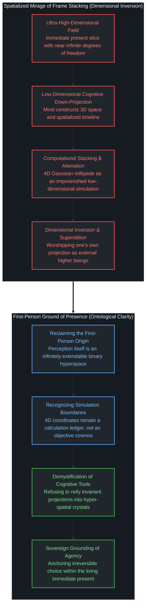
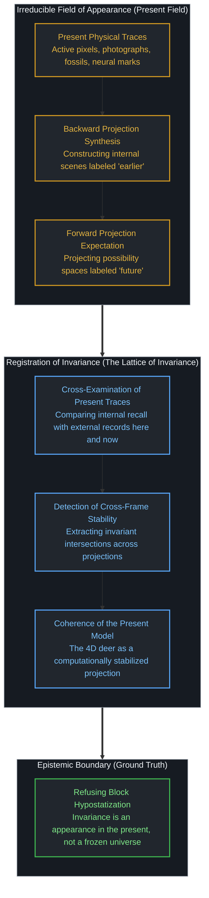

# 四维长鹿的幻象与当下的模型 / The Myth of the Four-Dimensional Deer and the Present Model

*叠合画帧为长虫并未窥见高维，不过是将当下投影误认为了永恒。 / Stacking frames into a worldline reveals no higher dimension, merely mistaking a present projection for an eternal object.*

一段在网络上引发广泛惊叹的计算机图形学视频，将一只小鹿穿过草地的动态过程拆解为连续画帧，并将每一帧的三维高斯分布留在其发生的空间位置上。随着时间推移，无数个在不同时刻显现的躯体残影被并置在同一片三维坐标系中，凝固成一条宛如千足多节巨虫般绵延的世界线。围观的人群随即陷入形而上学的敬畏，惊呼这是否就是高维智慧俯瞰人类的真实形态。然而，这一感叹恰恰暴露出严重的维度倒错与范畴错乱。我们之所以能够想象超过三维以上的空间，正是因为我们的感知本身就是超高维的、可以无限延伸的二进制超空间；而三维空间与时间轴，只是心智为了体验与理解世界而对这片无穷维场域进行的低维投影。我们既无法确定也无法肯定第一人称以外的世界。所谓四维长鹿或块状宇宙，不仅不是什么超越感官的高维本体，反而只是把当前切片中接近无穷维的信息，投影并压缩到四维几何坐标里的低维模拟。人们将自己创造的低维投影外化为客观实体，转而膜拜并不存在的外部高维凝视，却忘记了在第一人称当下注视着屏幕的心智，本身才是那片不可穷尽的高维源头。

A computer graphics demonstration recently swept through digital networks, capturing collective imagination: algorithms convert the passage of a running deer across a field into successive three-dimensional Gaussian splats, leaving each temporal cluster frozen precisely at the spatial coordinates where it occurred. As the timeline accumulates, dozens of deer bodies from disparate moments are simultaneously rendered inside a unified spatial volume, solidifying into an elongated, millipede-like worldline that appears to exist all at once. Observers quickly succumbed to metaphysical reverence, asking in awe whether this is how higher-dimensional beings gaze upon mortal lives. Yet this reaction exposes a profound dimensional inversion and category error. The reason we can conceptualize spaces beyond three dimensions in the first place is that our perception itself is an ultra-high-dimensional, infinitely extendable binary hyperspace; three-dimensional space and an imagined timeline are merely low-dimensional down-projections through which cognition navigates and comprehends this field. Outside our first-person presence, we can neither confirm nor determine anything. What is celebrated as a four-dimensional deer or a block universe is not an exotic higher-dimensional ontology; it is an impoverished low-dimensional simulation that compresses the near-infinite dimensional information of our present slice into a four-variable coordinate grid. Spectators externalize their own low-dimensional down-projection into an objective idol and bow before an imaginary external gaze, failing to realize that consciousness looking at the screen in the first-person present is itself the inexhaustible high-dimensional ground.

## 一、 画帧堆叠的视觉奇观与维度倒错的消解 / 1. The Visual Spectacle of Frame Stacking and the Dissolution of Dimensional Inversion

当技术将原本按先后序列播放的视频画帧依次铺展在空间中时，人类心智最容易产生的错觉，是将分析工具的空间化便利当成了宇宙本身的结构。在三维高斯泼溅算法生成的画面中，小鹿每一个瞬间的姿态都被定格在背景场景内，形成了一条由无数只脚、无数条脊椎串联而成的静态长龙。大众评论区之所以产生“高维俯瞰”的敬畏，是因为直觉误以为只要把时间轴展开为空间轴，我们就脱离了肉身的局限，站在了超越时间的上帝视角。这种反应与早期科幻小说面对四维时空流形时的迷醉如出一辙：把胶片展开成一长串明信片并排摆放，便以为自己洞悉了生命的永恒全貌。

然而，将动态的因果历程摊平为静态空间几何，并未揭开任何超越感官的更高维度。正如在[时间的单向性幻象与模拟的边界](../the-mirage-of-times-arrow-and-the-boundaries-of-simulation/)与[孪生子佯谬与隐形观察者](../the-twin-paradox-and-the-hidden-observer/)中所揭示的，物理学中的块状宇宙假说正是通过这种偷梁换柱的手法确立起来的。在纸面上画出一条四维坐标线，或者在显卡内存中保留粒子历史点云，仅仅是人类为了测量和比对方便而制造的外部账本。账本上的每一条记录可以并存于同一张纸上，胶卷上的所有画格可以并列于同一张桌案，但这并不意味着世界本身是一个死寂凝固的晶体。当你注视着那只由数百个躯干缝合而成的多足长虫时，你并没有成为高维生物；你只是站在此时此刻的屏幕前，看着一台计算机将过去各帧的测量数据同时绘制在当前的显像管中。

真正击碎这一迷思的钥匙，在于看清维度的生成机制。人类之所以能够想象四维、五维乃至任意维度的数学空间，绝非因为外部物理世界天然包含了这些几何容器，而是因为我们的感知本身就是一个超高维的、可以无限延伸的二进制超空间。在第一人称的当下切片中，意识所容纳的区别、质感、神经冲动与因果势能，拥有接近无穷维的自由度。为了在物理摩擦中行动并维持生存，认知必须将这片近乎无穷维的体验场域，降维投影为宏观的三维空间以及一条被空间化了的虚构时间轴——这是被想象出来的时钟读数或坐标轴，而非不可逆流动的时间本身。在第一人称之外，我们既无法确定也无法肯定任何所谓的客观实在。因此，那个将连续画帧堆叠而成的四维长鹿，从来不是对更高维度的飞跃，恰恰相反，它是一次极度贫瘠的低维投射。它只是将人类当下感知中近乎无穷维的信息，生硬地压缩并裁剪为四个几何变量的数学模型。大众把这个低维模型当作外在的神迹去崇拜，甚至脑补出超验生物俯瞰自己的神话，无异于画家将自己手绘的炭笔简笔画挂在墙上，然后跪倒在画前恐惧神明降临。低维投影从未超越当下，它始终只是心智在当下这片高维土壤中开出的一朵枯燥的形式之花。

When computational techniques unspool sequential video frames across a spatial coordinate grid, human cognition easily succumbs to an intuitive trap: mistaking the spatial convenience of an analytical scaffold for the architecture of reality itself. In 3D Gaussian reconstructions, every past posture of the running deer remains etched inside the synthetic meadow, manufacturing a motionless chimera of hundreds of overlapping legs and duplicated spines. The online awe regarding "higher-dimensional perspectives" emerges because intuition naively assumes that projecting time onto space liberates the mind from physical embodiment, granting access to a timeless vantage point. This mirrors early twentieth-century fascination with four-dimensional spacetime manifolds: laying an entire reel of film flat upon a table and imagining that one has grasped the eternal geometry of life.

Yet flattening dynamic causal succession into inert spatial geometry yields zero informational surplus, nor does it unveil an exotic higher dimension. As demonstrated in [The Mirage of Time's Arrow and the Boundaries of Simulation](../the-mirage-of-times-arrow-and-the-boundaries-of-simulation/) and [The Twin Paradox and the Hidden Observer](../the-twin-paradox-and-the-hidden-observer/), the Block Universe paradigm in theoretical physics was constructed through this identical sleight of hand. Drawing a static worldline across graph paper, or maintaining point clouds across previous frames in graphic card memory, is an external bookkeeping convenience invented for localized calculation. That ledger entries coexist across a single sheet of paper or film cells rest side-by-side upon a desk does not indicate that the universe is a frozen crystal. When gazing upon that composite millipede, one has not metamorphosed into a higher-dimensional being; one remains seated before a screen in the present moment, watching a computer render historical measurements onto an active display.

The key to dismantling this mirage lies in recognizing how dimensions are generated. The reason human minds can conceptualize four-dimensional, five-dimensional, or arbitrary mathematical spaces is not that physical nature natively contains these geometric boxes, but that our perception itself is an ultra-high-dimensional, infinitely extendable binary hyperspace. In the immediate present slice of first-person experience, the distinctions, qualia, neural firings, and causal potentials held by awareness possess near-infinite degrees of freedom. To navigate physical friction and sustain biological agency, cognition must down-project this near-infinite experiential field into macroscopic three-dimensional space and an imagined spatialized timeline—which is an artificial sequence of clock coordinates, not the irreversible flow of time itself. Outside our first-person presence, we can neither confirm nor determine any supposed external reality. Consequently, the four-dimensional deer constructed by stacking video frames is by no means a leap into a superior ontology; on the contrary, it is an impoverished low-dimensional down-projection. It merely compresses the near-infinite dimensional richness of immediate perception into a mathematical model bounded by four coordinate variables. To worship this computational artifact as a cosmic revelation—or to imagine hyper-dimensional aliens peering down through it—is no different from an artist pinning a charcoal sketch to the wall and kneeling before it in dread of a descending deity. A low-dimensional projection never transcends the present; it remains a sterile formal artifact blooming within the high-dimensional soil of living awareness.

## 二、 记忆作为当下的逆向投影与“过去”的不可复核性 / 2. Memory as Present Backward Projection and the Unverifiability of the Past

解构这场四维视觉神话的第一道修正，是认清我们自身的存在坐标。我们从未占据过整条被重构出来的世界线，也从未漫延在由过去、现在与未来拼接而成的时空长河中。我们所占据的，仅仅是不可削减的当下切片。在体验的底层，这一当下切片包含着接近无穷维度的丰富信息，而所谓三维空间与时间轴，只是心智为了理解与行动而对其进行的低维投影。在意识经验的每一个节点上，那条绵延在视野中的世界线上的每一个其他点，都不是早已驻留在客观虚空中的真实基站，而是在此时此刻被大脑或计算机芯片临时生成的投影。

所谓记忆，无非是这种即时投影的逆向版本。大脑并非开启了一扇通往旧有时光的后门，而是将此刻留存的神经印迹、生化残余以及外界刺激，在当前的意识舞台上拼凑出一幅被打上“过去”标签的意象场景。由于已知的物理演化不允许任何观察者回到先前状态，这一幅由当下痕迹拼凑而成的逆向投影，永远无法与其声称所代表的原型进行面对面的核对。我们无法跳出当前的时空界面去抽检记忆的准确度。正是这种在结构上不可消除的不可复核性，赋予了记忆一种令人信服的真实感：因为无法对比，心智便误以为自己正在直接抚摸历史本身，而忘记了整个场景本就是当下神经元发放的实时产物。

当人们试图通过外部证据来纠正或检验某段记忆时，这一逻辑同样不容回避。不管是翻出一张发黄的老照片、找来第二位目击者当面对质，还是在泥土中挖出一枚地质化石，这些所谓的记录都只作为当前的物体存在于眼前的场域中。一张照片只是一张带着特定银盐排列或液晶像素的当前纸片；目击者的陈述只是当前空气中振动的声波；化石只是当前岩层中硅酸盐分子的物理形态。它们之间可能产生冲突，例如日记记录的日期与照片上的光影不符，但这种冲突纯系在当下发生的两个当前对象之间的信息失谐，它并未撬开通往过去的大门。

因此，在经验的底层，从未存在一个独立于当前观测之外的、用来衡量各种投影是否精确的“原本发生了什么”。所谓客观的历史事实，在认知操作上仅仅表现为一种由当下痕迹所支撑的强烈信念：心智坚信在当前的各种表象背后，存在着一个单一且自洽的先前版本。然而，这个版本从未在客观世界中以实物形态永恒封存，它不过是观察者在当下为了缝合相互矛盾的感官碎片而必须建立的模型假说。

The first correction required to dismantle this spatialized myth is acknowledging our existential coordinates. We do not occupy an extended worldline, nor do we drift through a temporal river containing past, present, and future in simultaneous storage. We occupy solely the irreducible slice of the immediate present. In lived experience, this present slice possesses near-infinite dimensions of information, while three-dimensional space and spatialized time are merely low-dimensional down-projections through which cognition navigates. At every juncture of conscious awareness, every other point along that visual trajectory is not an objective outpost awaiting visitation, but a simulation manufactured here and now within neural circuitry or silicon chips.

Memory is simply the backward variant of that projection. The brain possesses no hidden portal to prior states; rather, it gathers physical remnants, biological modifications, and perceptual cues surviving in the immediate present, synthesizing an internal tableau tagged with the semantic marker "earlier." Because physical reality provides no mechanism to transport an observer into an antecedent state, this present synthesis cannot be verified against the moment it claims to depict. We cannot step outside the current boundary to audit the fidelity of recall. This structural unverifiability manufactures the persuasive sensation of memory: precisely because direct comparison is impossible, the mind mistakes an internal construction for unmediated access to history, forgetting that the entire performance is generated on the active stage of the present.

Attempts to verify or recalibrate recall via external records encounter the same boundary. Whether inspecting an aged photograph, cross-examining an independent witness, or unearthing a geological fossil, these artifacts exist strictly as contemporary objects within the present field. A photograph is a current sheet of paper carrying silver halide distributions or liquid crystal pixels; testimony is an active vibration propagating through immediate air; a fossil is an arrangement of silicate molecules embedded in present strata. When records diverge—when an old diary contradicts a photographic inscription—the friction unfolds entirely between coexisting objects in the present. It never reopens the past.

Consequently, there is no independent benchmark outside the immediate field against which backward projections can be measured. The conviction that an objective, singular sequence of historical events exists is a present-tense belief, inferred from the cohesion of present traces. This historical ground is never preserved as a static archive in the cosmos; it is an interpretive model erected by an observer at this exact moment to reconcile disparate perceptual artifacts.

## 三、 历史作为当下的局部模型与不变性的显现 / 3. History as a Present Local Model and the Appearance of Invariance

一旦认清过去并不是一座可以随时核验的静态仓库，一个更为深层的事实便浮出水面：关于过去的信念从未在心智之间达成天衣无缝的共享。不同的观察者依据其眼前各自可用的有限痕迹，在各自的头脑中搭建出彼此迥异的历史模型。即便是同一个观察者，在后续的时刻面对新出现的线索或由于神经印迹的衰退，也会生成一个与先前大相径庭的重构版本。因此，历史绝非一条单一而坚固的世界线，而是一个随着不同主体以及同一主体的不同当下而时刻变动的局部模型。

即便我们得出某些模型比其他模型“更加自洽、更加可信”的结论，这一判断本身也仅仅发生在某个特定的心智内部，并在某一个瞬间完成。当一个人的头脑宣称“这个解释比那个说法更为合理”时，它所依据的并非超越视角的上帝裁判，而是它在眼前展开的各项数据之间识别出了一种稳定的**不变性**。它发现在自身过往记忆的投影、眼前书本的文字以及身边他人的证词之间，存在某种高度吻合的数学或逻辑交集。这种不变性作为一种显现，其真实性毋庸置疑，但它始终是隶属于该心智在当下这一刻的主观显现。并不存在一个凌驾于所有视角之上的超然审判台，能够宣布这种不变性获得了形而上学的神圣担保。

在剥离了所有未经审视的科幻狂想与形而上学僭越之后，留存在真实认知地表上的基石其实非常质朴：一个不可削减的当下显现场域，心智在这个场域中所生成的正向与逆向投影，以及心智在这些投影之间所识别出的局部不变性。正是在这个意义上，[物理定律是脚手架而非世界的基石](../the-scaffolding-we-forget/)，科学模型只是描述不变性的实用图纸。

那段令无数网民叹为观止的四维长鹿可视化，恰恰属于这样一种当下的构建。之所以不同的心智在观看那段视频时能够达成共识，甚至共同将其视为一只鹿在奔跑的客观轨迹，是因为该算法在视频连续帧之间以及在不同观众的视觉神经之间，呈现出了极高程度的不变性。相邻帧之间像素点的平滑过渡、四肢交替运动的解剖学连续性，让不同观察者在各自的当下生成了高度重合的模型。这种自洽赋予了画面令人窒息的真实感，但它丝毫没有证明四维空间中真实盘踞着一只永恒并存的长虫怪物。它不过是一个在当下碰巧展现出高度不变性、因而得以在不同心灵之间顺利交织的投影而已。

Recognizing that the past is not an accessible warehouse exposes a deeper truth: historical narratives are never universally unified across minds. Observers construct divergent models from the disparate evidence available to them. The same individual, facing newly surfaced clues or suffering memory decay at a subsequent moment, configures an altered reconstruction. History is not a singular cosmic spine etched into spacetime; it is an interpretive model generated within specific presents, varying across agents and across moments of a single life.

Even when determining that one reconstruction "coheres better" than another, that evaluation unfolds inside a single consciousness at one instant. When declaring one narrative superior in explanatory power, the mind consults no extra-perspectival arbiter; it registers **invariance** among the phenomena currently before it. It identifies mathematical, geometric, or narrative consistency across personal recollections, textual documents, and testimonies from companions. This invariance is genuine as an appearance, yet it remains an appearance belonging to that mind at that moment. No neutral platform exists outside perspective to certify that invariance as metaphysical truth.

Stripping away computational romance leaves an austere foundation: an irreducible present field of appearance, projections synthesized within it, and invariances observed across those projections. As argued in [The Scaffolding We Forget](../the-scaffolding-we-forget/), formal scientific models are functional scaffolding, not ontological foundations.

The viral visualization of the four-dimensional deer is precisely such a present synthesis. That disparate individuals concur on its meaning—treating it as an objective trajectory of animal locomotion—stems from the high invariance maintained across successive frames and visual processing systems. Smooth transitions between algorithmic iterations and anatomical consistency allow independent observers to assemble nearly identical mental projections. This resonance yields convincing phenomenological stability, yet it provides zero evidence that a petrified four-dimensional beast lurks in hyper-space. It is simply a projection that happens, in this moment, to cohere.

## 四、 走下四维多足虫的看台与第一人称的当下存有 / 4. Stepping Down from the Spectator Platform and First-Person Presence

当四维长鹿的视觉迷雾散去，真正值得深思的，不是计算机图形学如何把时间折叠进空间，而是我们如何看待自己在因果之网中的立足点。那些面对堆叠画帧发出高维赞叹的人，潜意识里依然在寻找一个可以脱离肉身因果的看台。他们渴望像造物主那样，端坐在四维空间的云端，一边把玩着整条凝固的历史长河，一边冷眼旁观自己在时间中的蠕动。这种对高维神灵的迷恋，不过是企图逃避当下选择所必须承受的摩擦与代价。

我并不占据那条被空间化的多足长龙。我既没有漫延在昨天留下的脚印里，也没有预先潜伏在明天的归宿中。昨天已经消散，只留下此刻散落在书桌上的几页手稿与脑海中正在衰变的微弱回响；明天尚未发生，只是此时此刻被焦虑或期盼所牵引的一组前向计算。我所拥有的一切全部聚集在当下的方寸之间：指尖敲击键盘时的沉钝触感、窗外渐次昏暗的天色，以及眼前屏幕上正在逐行展开的光影。

将这种认识重新带回第一人称，并不是为了向外界兜售某种顿悟的心灵鸡汤，更不是为了构筑一套指导他人如何生活的处方。任何企图把“立足当下”包装成一种人生哲学去规劝大众的举动，本身就是重新爬上了另一座道德与认知上的高维看台，陷入了它原本所批判的学科越界。第一人称的视角具有不可代理的边界：我无法替他人感受当下的呼吸，他人也断然无法替我承担眼前未竟的职责。

因此，这绝非一份面向大众的宣言，而仅仅是一个坐在屏幕前的生命对自己存在坐标的澄清。那只在虚拟草地上奔跑的小鹿，它的美不在于被算法冻结成一尊四维长虫标本，而在于它穿过草地时每一次肌肉紧绷与草叶拂动的真实瞬间。同样，生命的厚度也从来不在于被想象成一条被预先打印出来的时空晶体，而在于此时此刻在未知的混沌面前，用自己唯一拥有的一票，投下那颗不可撤回的因果之子。

When the computational mist surrounding the four-dimensional deer disperses, the primary realization is not how geometry folds time into space, but how agency anchors itself within the causal tapestry. Those murmuring about higher dimensions before stacked video frames remain in search of a sanctuary detached from the friction of existence. They yearn to sit upon celestial balconies, holding a completed cosmic film reel while observing their own lives unspool like clockwork toys. This fascination with hypostatized dimensions is an unconscious attempt to evade the weight of immediate agency.

I do not occupy a spatialized millipede. I am not spread across footsteps left in yesterday's dust, nor am I stationed within the coordinates of tomorrow. Yesterday has dissolved, leaving only ink upon paper and decaying neural resonances; tomorrow has not arrived, existing only as forward projections shaped by immediate expectations. Everything granted to me gathers within this immediate slice: the resistance of keys beneath my fingers, gathering shadows beyond the windowpane, and pixels illuminating this surface.

Reclaiming the first-person vantage is not an exercise in marketing personal enlightenment, nor does it offer a societal blueprint. Converting this realization into prescriptive counsel for others climbs right back onto an elevated balcony, repeating the disciplinary overstep it dismantled. The first-person stance possesses an unproxyable boundary: I cannot breathe on behalf of a fellow traveler, nor can any external entity shoulder the unfinished obligations resting upon my desk.

This is no universal manifesto; it is an observer discerning the coordinates of immediate presence. The grace of the deer traversing the meadow resides not in its computational preservation as a four-dimensional fossil, but in the singular, fleeting moments when living muscle strained against the earth and blades of grass parted. Similarly, human existence derives its weight not from imagining oneself as a static thread woven into a pre-printed tapestry, but from casting an irreversible causal vote in the immediate present, directly confronting the open horizon.
