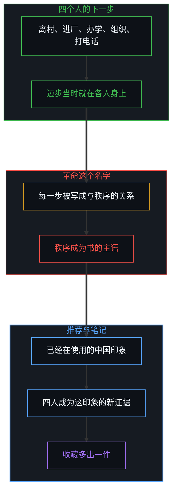
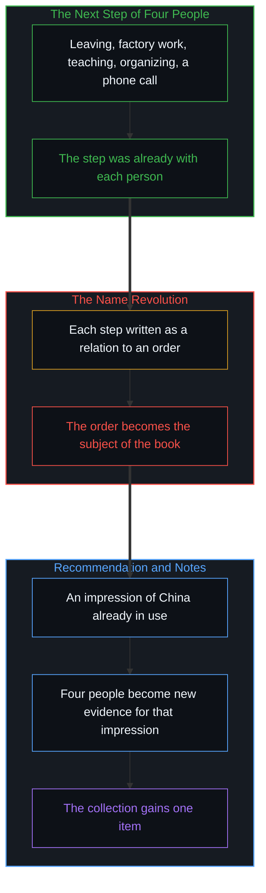

# 革命之名把生活收成证据 / The Name Revolution Files a Life as Evidence

*选择被称作革命，秩序便是主语，读者收藏的是旧印象的新证据。 / A choice named revolution takes the order as subject, and the reader files evidence of an old impression.*

杨缘的书跟随 Leiya、Sam、June 与 Siyue 多年，记下离村、进厂、办学、组织，以及 Siyue 在村支书进京开会时打去的那通电话。私人革命这个书名，连同副题里的中国新社会秩序，把这些步骤排进同一种关系。Derek Sivers 的推荐句把这本书叫做一本很好的中国书。他的公开笔记从一代内卷写起，第一行让一套安排去吞吃努力，后面是高考、户口折分、六千万留守儿童。四段生活由此进入一份已经在使用的中国印象，收藏里多出一件。

Yuan Yang's book follows Leiya, Sam, June, and Siyue for years: leaving a village, factory work, teaching, organizing, and the call Siyue places to a village party secretary while he is in Beijing for the Two Sessions. The title Private Revolutions, with its subtitle about China's new social order, lines those steps up on one relation. Derek Sivers' recommendation calls it a very good China book. His public notes open on Generation Involution, give an arrangement the grammar of a subject that absorbs effort, and continue through the gaokao, hukou point deductions, and sixty million left-behind children. Four lives enter an impression of China already in use, and the collection gains one item.

## 迈步当时就在 / The Step Was Already There

公开记录里的路径各自可指认。Leiya 十几岁进入工厂，后来办起托育和工人互助。Sam 从一次工伤访谈走进劳工组织。June 的母亲死在矿山传送带上，她是村里读到高中和大学的那一个。Siyue 的父母在深圳做生意，她后来做英语教育；村支书到北京参加两会时，她打电话问候行程和家人，提起自己在央视工作，没有提起母亲的建房许可，许可在支书回乡时已经备好。

每一步的原因在迈出它的人那里。那通问候是一个人在使用自己当时有的通道。进厂、办学、组织，以及书页以外继续过自己日子的人，是同一种迈步。四人比同龄里的大多数更会动、更会说，选择本身已经偏向推开约束的人。社会现象是许多此类迈步留下的可读痕迹。痕迹留在读数里。下一次迈步仍在迈出的人那里。

In the public record the paths can be pointed to one by one. Leiya enters factory work in her mid-teens and later builds childcare and support for workers. Sam moves from an interview with an injured worker into labor organizing. June's mother is killed on a mine conveyor, and June is the one from her village who reaches high school and university. Siyue's parents build a business in Shenzhen, and she later works in English education. While the village party secretary is in Beijing for the Two Sessions she calls, asks about the trip and the family, mentions her work at CCTV, and does not mention her mother's building permit. The permit is ready when he returns.

The cause of each step sits with the person who takes it. The greeting is one person using a channel she has. Factory work, a school, organizing, and the days continued by people outside the pages are the same kind of step. The four are more mobile and more articulate than most of their cohort, so the selection already leans toward people who push against constraints. Social phenomena are the readable residue of many such steps. The residue stays in the record. The next step stays with whoever takes it.

## 革命把秩序写成主语 / Revolution Writes the Order as the Subject

私人把尺度收到四个人。革命把每一步写成与一套秩序的关系：面对它，推开它，在它里面争出一条路。副题把关系说完：四个女人面对中国的新社会秩序。秩序成为这本书的主语。四个人成为这主语的私人面孔。

户口、留守儿童、工厂的不稳定、行动的风险，是这主语所用的舞台。舞台留在原处，革命才有所面对。书名完成的肯定就在这个位置：被写成面对对象的那些现象，正是叙事赖以成立的坐标。坐标也是书架上已有的那一格，所以「一本很好的中国书」这句推荐能够说出口。[社会化与做自己的坐标](../ge-ren-xuan-ze-she-hui-hua-yu-zuo-zi-ji-de-zhen-zheng-zuo-biao/) 里的对抗式互补，是反抗与刚性安排互相补位。这里互补由名字提前装上。生活被称作革命，秩序就已经是它面对的东西。[解放的话术始于对囚禁的定义](../liberation-rhetoric-begins-by-defining-captivity/) 是相邻的一面：要谈解放，先把对方持为尚未自由。革命这个类型要成立，先把秩序持为生活正在面对的东西。[主权、信念与规制结构的生成](../sovereignty-belief-and-regulatory-structures/) 标明主权并没有交进结构。革命的说法把迈步讲成从秩序那里取回什么。取回的讲法需要一个存放过它的地方。那个地方就是被这个名字肯定下来的秩序。

Private sets the scale at four people. Revolution writes each step as a relation to an order: facing it, pushing it, making a path inside it. The subtitle finishes the relation. Four women face China's new social order. The order becomes the grammatical subject of the book. The four become the private faces of that subject.

Hukou, left-behind children, factory precarity, and activist risk are the stage that subject uses. With the stage left where it is, a revolution has something to face. The affirmation the title performs sits in that place. The phenomena written as what the lives face are the coordinates the narrative requires in order to be that narrative. The coordinates are also the shelf already kept, which is why the recommendation "a very good China book" can be said. [The coordinate of socialization and being oneself](../ge-ren-xuan-ze-she-hui-hua-yu-zuo-zi-ji-de-zhen-zheng-zuo-biao/) names oppositional complementarity: resistance and a rigid arrangement occupy one another. Here the name installs that complementarity in advance. Once the life is called revolution, the order is already what it faces. [Liberation rhetoric begins by defining captivity](../liberation-rhetoric-begins-by-defining-captivity/) is the adjacent face: talk of freeing holds the other as not yet free. The genre revolution holds an order as what the life is facing. [Sovereignty, belief, and the generation of regulatory structures](../sovereignty-belief-and-regulatory-structures/) marks that sovereignty had not been placed inside the structure. Revolution-talk speaks of the step as taking something back from the order. Talk of taking-back needs a place where it was kept. That place is the order this name affirms.

## 推荐把四人收进旧印象 / The Recommendation Files Four People into an Old Impression

Sivers 的笔记页把这本书放进他的读书记录。开篇术语是一代内卷：一套安排吞进越来越多的努力，回报越来越少。后面是下海、寄宿、坏孩子与好孩子、精英大学的窄门、土豪这个带土的词、鸡娃、一句央视如何让建房许可备好、留守儿童的比例、左右在中国政治话语里的对调、科技公司里十八个月一跳、疫情里回乡的工人被留在当地、中考把人分进普高与职校、深圳户口让孩子免去大约五分之一的折分、政治气候的转向、增长放缓之后阶层再次变硬。

人在笔记里出现，是给术语当载体。Siyue 的电话说明怎样才算一个重要的人。宿舍同学填上考试机器里的坏孩子位置。笔记记下的是这次阅读实际完成的归类。四段生活被压到同一种关系上，关系的名字是中国。推荐句说出书的种类。收藏增加这一件。印象仍是阅读之前那一份。生动来自细节。细节加在旧坐标上。坐标不用重画。

Sivers' notes page places the book among his reading records. The opening term is Generation Involution: an arrangement that takes in ever more effort and returns ever less. After it come diving into the sea, boarding school, bad kids and good kids, the narrow gate of elite universities, the earthy word for new money, chicken-blood tutoring, how the words CCTV leave a building permit ready, the proportion of left-behind children, the swap of left and right in Chinese political talk, eighteen months in a technology job, workers who went home for the pandemic and were kept there, the high-school exam splitting people into academic and vocational tracks, a Shenzhen household registration sparing a child a deduction of about a fifth of the points, the turn of political weather, and class hardening once growth slows.

A person appears in the notes as the carrier of a term. Siyue's call shows what counts as being someone important. The dorm-mates fill the bad-kid place in the exam machine. What the notes record is the classification the reading actually performs. Four lives are pressed onto one relation, and the name of the relation is China. The recommendation sentence states the kind of book. The collection gains this item. The impression remains the one from before the reading. Vividness comes from detail. Detail is added on the old coordinates. The coordinates do not have to be redrawn.

## 见证继续同一种迈步 / Witnessing Continues the Same Kind of Step

读完近旁的下一步是推荐，是做笔记，是把印象用得更顺手。这一步与那通电话同一种：一个人使用自己当时有的通道。这边的通道是书架，是一份已经持有的中国图景，是一句可以转给别人的评语。革命这个名字不问这一步。它把要问的生活放在页面另一边，放在中国，放在四个被写成私人面孔的人身上。见证的位置因此站得住。位置站着的时候，读者留在阅读之前的地方。

电话仍是电话。笔记仍是笔记。四个人仍是四个人。名字把它们收成证据时，秩序是主语。把它们读回迈步时，主语回到迈出那一步的人，包括迈出推荐这一步的人。

The next step near at hand after reading is to recommend, to take notes, to use the impression more smoothly. That step is the same kind as the phone call: a person using a channel then available. On this side the channel is a shelf, a picture of China already held, a sentence that can be passed on. The name revolution does not ask about this step. It places the lives to be asked about on the other side of the page, in China, in four people written as private faces. The witness position holds. While it holds, the reader stays at the place occupied before the reading.

The call remains a call. The notes remain notes. The four remain four people. While the name files them as evidence, the order is the subject. While they are read back as steps, the subject returns to the person who took the step, including the person who took the step of recommending.
