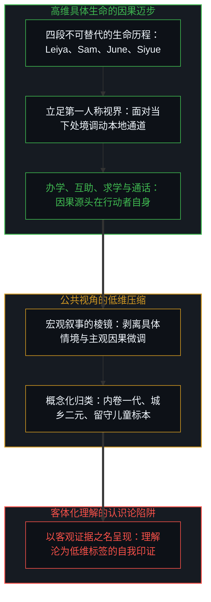
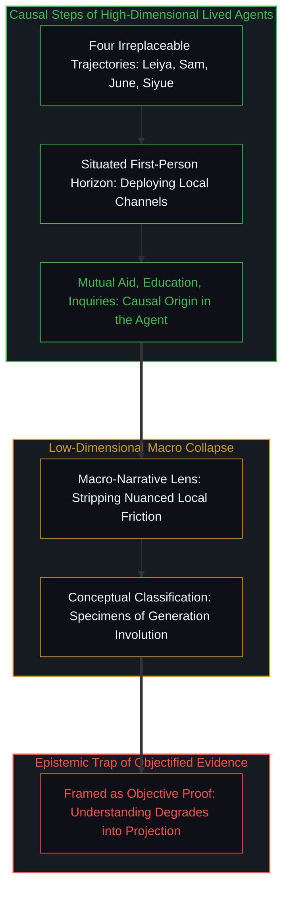
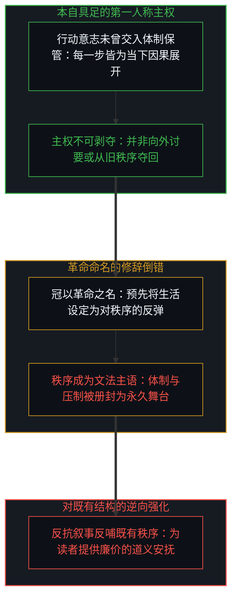
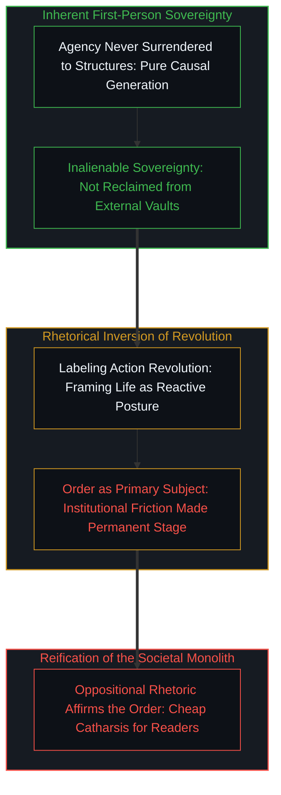
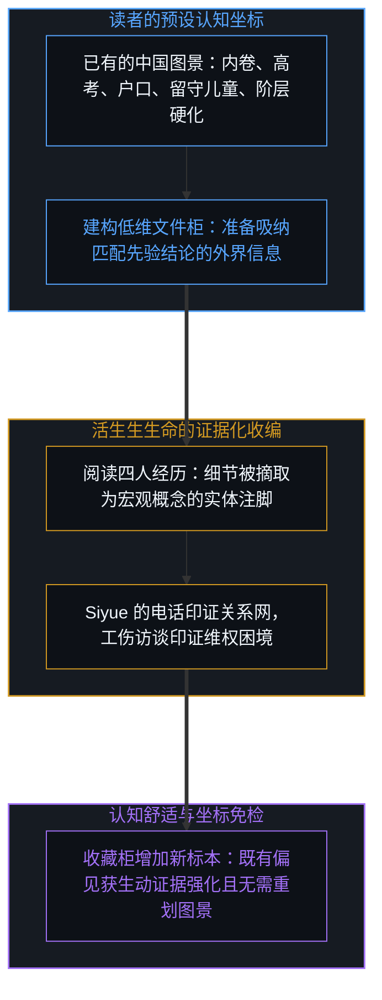
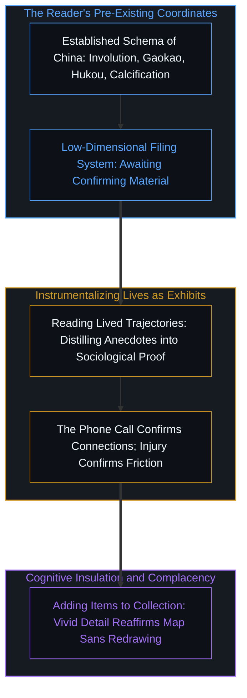
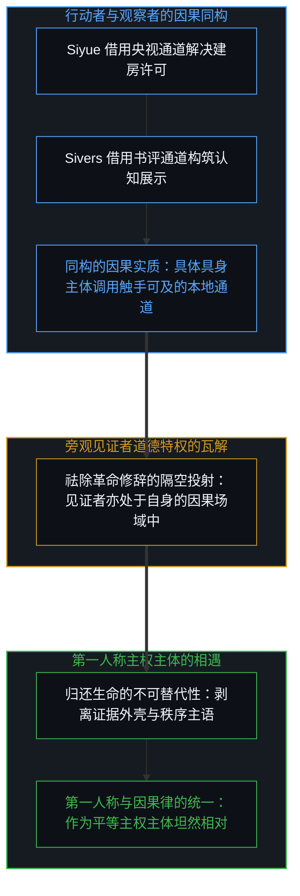
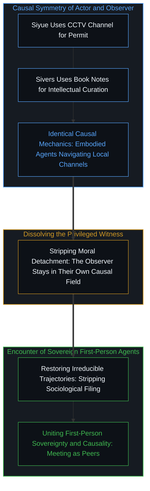

# 革命之名把生活收成证据 / The Name Revolution Files a Life as Evidence

*选择被称作革命，秩序便是主语，读者收藏的是旧印象的新证据。 / A choice named revolution takes the order as subject, and the reader files evidence of an old impression.*

杨缘的著作长年追踪 Leiya、Sam、June 与 Siyue 四位中国女性的真实经历，细致记录下她们离开乡村、进厂务工、创办托育、参与劳工互助，以及 Siyue 在村支书进京开会时打去的那通问候电话。《私人革命》这一书名及其副题“中国新社会秩序下的成长”，将四段高维而不可替代的具身历程，规整地折叠进一套预设的对抗坐标之中。随后，知名写作者与创业者 Derek Sivers 在其阅读笔记中将此书誉为“一本极好的中国之书”，其笔记开篇径直将“一代内卷”确立为吞噬一切个体努力的抽象怪物，顺次列举高考、户口折分与数千万留守儿童。四条鲜活的生命轨迹就此被剥离了其自身的因果生成，被整齐地归档进一份早已定型的公众认知图景之中，读者的收藏架上随之又增添了一件用作佐证的陈列品。

Yuan Yang's book meticulously follows four Chinese women—Leiya, Sam, June, and Siyue—over the course of years, documenting their departures from rural villages, assembly line labor, founding of worker childcare centers, labor advocacy, and the phone call Siyue placed to her village party secretary during his trip to Beijing. Yet the book's title, *Private Revolutions*, along with its subtitle framing four women facing China's new social order, folds these high-dimensional, irreplaceable lived trajectories into an oppositional schema. Soon after, author Derek Sivers praised it on his public reading site as "a very good China book," opening his notes with "Generation Involution" as a voracious macro-mechanism that swallows human effort, followed by a catalogue of gaokao rankings, hukou point deductions, and left-behind children. Four singular lives are thereby stripped of their internal causal generation and filed neatly into an existing mental archive of China, adding one more evidentiary exhibit to the armchair reader's collection.

## 公共视角的低维坍缩：四段具体生命如何被压缩为“一代人的标本” / The Public Low-Dimensional Collapse: How Four Specific Lives Were Compressed into a Generational Specimen

在公共记录的展开中，书中所呈现的生命轨迹各自清晰可辨。Leiya 十几岁进入沿海代工厂，在流水线的严苛节拍中摸索出生存间隙，随后尝试创办流动工人的互助组织与社区托育服务；Sam 从一次深入工伤工人的走访中受到触动，逐步介入劳工维权与社会支持网络；June 的母亲在矿山传输带的意外事故中丧生，沉重的创伤化为求学动力，使她成为村里极少数考入高中与大学的孩子；Siyue 的父母早年在深圳商海打拼，她成年后从事英语教育，当老家的村支书赴京参加两会期间，她拨通了一通长途，嘘寒问暖间得体地提及自己在央视的供职背景，对母亲多年悬而未决的宅基地建房许可只字不提，而当支书回乡之际，那份许可早已妥善备齐。

这四位行动者迈出的每一步，其因果动量无一例外地生发于其自身的第一人称视界。无论是那通恰到好处的问候，还是创办学堂、投身互助，抑或是书页之外千千万万普通人在柴米油盐中的坚韧穿行，皆是具身个体在特定处境下调用自身所拥有的本地通道所做出的因果决断。四位主人公比同龄人更具行动力与表达欲，书籍的选材天然偏向了那些敢于主动推开限制的拓荒者。然而，任何社会现象都不过是海量个体在此类因果摩擦中留下的可观测痕迹。正如在[心智作为向量与坐标系](../the-mind-as-vector-and-coordinate-system/)中所阐明，每一个活生生的主体都拥有极高维度的因果状态空间。可是，一旦宏观视角的认知框架介入，这种丰富的动态历程便被瞬间坍缩：具体的生命不再是不可替代的主权主体，而是被压制为佐证社会阶层固化与内卷困局的一组组冷酷样本。将活生生的个体降格为客观证据，看似是为了理解，实则是一场低维的认知遮蔽。

Across the narrative record, the paths of these four women remain vivid and distinct. Leiya enters coastal assembly lines in her mid-teens, gradually carves out spaces of dignity amidst relentless shifts, and eventually creates worker childcare initiatives and grassroots mutual aid networks. Sam is catalyzed by an interview with an injured laborer, stepping into worker rights advocacy and grassroots community support. June endures the sudden death of her mother in a coal mine conveyor accident, carrying that grief through academic discipline to become the rare youth from her village to reach university. Siyue, whose parents established a commercial foothold in Shenzhen, works in English education; when her village party secretary travels to Beijing for the national legislative sessions, she calls to inquire about his itinerary and family, tactfully mentioning her professional ties to CCTV while uttering not a single word about her mother's stalled residential building permit—which is waiting approved the moment he returns.

The causal impetus of every step taken by these women originated strictly within their own first-person horizon. The courteous inquiry was a situated agent navigating her immediate environment using the channels directly available to her. Establishing a daycare, organizing support circles, or quietly carrying on with life outside the pages of any book are all causal generations of the exact same kind. The four women selected were undeniably more articulate and proactive than many of their contemporaries, meaning the journalistic sample was already tilted toward agents who vigorously push against local constraints. Social phenomena are merely the aggregated historical residue of countless such individual steps. As articulated in [The Mind as Vector and Coordinate System](../the-mind-as-vector-and-coordinate-system/), every living subject navigates an inherently high-dimensional state space. Yet once a macro-sociological lens takes over, that rich causal generation collapses into a flat projection: unique human beings cease to be unrepeatable agents and are compressed into sociological exhibits illustrating institutional friction. To present living souls as objective evidence under the banner of understanding is merely to project an external taxonomy across them.

## “革命”的修辞陷阱：主权的本自具足与对秩序的反向合法化 / The Rhetorical Trap of "Revolution": Inherent Sovereignty vs. The Reification of Order

《私人革命》这一书名完成了一种奇特的认识论倒错。“私人”一词将观察的焦距收束在四位具体的女性身上，赋予文本以细腻动人的具身质感；然而，“革命”一词却在暗中重新改写了她们每一步的性质，将原本自立的因果行动，全部重构为针对某种外在庞然大物的反抗与纠缠。副题“面对中国的新社会秩序”则直白地完成了这一赋权：它将“秩序”册封为全书真正意义上的文法主语，而四位具体的女性，则沦为了这尊宏大主语在人世间的微观面具与具象投射。

为了让“革命”的修辞得以成立，户籍壁垒、留守困境、车间盘剥与行动风险就必须被牢牢锚定在舞台的正中央。正是在这一节点上，反抗叙事完成了对其批判对象的隐秘合法化：被书写为反抗对象的体制与现象，恰恰成为了这套叙事得以成立的不可或缺的基准坐标。正如在[个人选择、社会化与做自己的真正坐标](../ge-ren-xuan-ze-she-hui-hua-yu-zuo-zi-ji-de-zhen-zheng-zuo-biao/)中所剖析的对抗式互补，反抗极易在无形中赋予刚性结构以至高无上的实体地位。主权并非某种曾被制度夺走并锁在深柜中、有待后来者破门夺回的战利品；正如在[主权、信念与规制结构的生成](../sovereignty-belief-and-regulatory-structures/)中所指出，个体的具身主权从不曾移交进任何体制的掌管之中。在[解放的话术始于对囚禁的定义](../liberation-rhetoric-begins-by-defining-captivity/)中，我们看到任何以解放自居的话语，首要步骤皆是将对方预设为深陷锁链的客体。将生活的迈步命名为革命，表面上是在赞颂个体的英勇，实质上却在文法上承认了秩序的先在性与支配权。这种修辞迎合了出版市场的对抗戏剧偏好，它为远方的读者提供了廉价的道义安慰，却让身处其中的具身自主性再度被宏大词汇所遮蔽。

The title *Private Revolutions* performs an insidious epistemological inversion. The modifier "private" narrows the lens to four distinct women, granting the narrative intimate emotional resonance; yet the noun "revolution" retrofits their sovereign causal choices into a reactive posture against a monolithic external entity. The subtitle, *Four Women Facing China's New Social Order*, cements this grammatical inversion: the "Order" is crowned as the primary subject of the book, while the four women are reduced to its personal expressions and localized battlegrounds.

For the rhetorical machinery of "revolution" to function, institutional hurdles—hukou divisions, left-behind children, factory precarity, and administrative friction—must remain permanently fixed as the unmoving center of the stage. It is here that oppositional narrative performs a covert legitimization of the very structures it purports to expose: the institutional monolith is enshrined as the indispensable coordinate system without which the heroic drama collapses. As analyzed in [The Coordinate of Socialization and Being Oneself](../ge-ren-xuan-ze-she-hui-hua-yu-zuo-zi-ji-de-zhen-zheng-zuo-biao/), reactive resistance and rigid arrangements lock together in mutual affirmation. Sovereignty is not a physical token once surrendered to an institutional vault that must be heroically recaptured; as shown in [Sovereignty, Belief, and the Generation of Regulatory Structures](../sovereignty-belief-and-regulatory-structures/), first-person agency is never alienated into systemic custody. Furthermore, as explored in [Liberation Rhetoric Begins by Defining Captivity](../liberation-rhetoric-begins-by-defining-captivity/), any discourse of liberation must first postulate absolute confinement. To baptize everyday human agency as "revolution" appears to celebrate courage, but grammatically it affirms the primacy and ontological supremacy of the regime. This framing packages complex human lives into a marketable morality tale, soothing the conscience of comfortable distant readers while erasing the genuine, unmediated sovereignty of the agents involved.

## 读者的收藏柜：Derek Sivers 笔记与预设印象的证据化 / The Reader's Filing Cabinet: Derek Sivers' Notes and the Instrumentalization of Evidence

在 Derek Sivers 的公开读书笔记中，这种低维坍缩与证据化收编展现得尤为清晰。Sivers 将这本书归类为“一本极好的中国之书”，其摘要条目开宗明义地提出了“内卷一代”这一流行概念，将其描绘为一个吞噬无尽心血却回馈寥寥的闭环结构。在随后的笔记中，他如数家珍地罗列着一系列异域概念：下海经商、寄宿体制、好孩子与坏孩子的二元区隔、应试竞技的狭窄关卡、“土豪”一词的词源变迁、“鸡娃”培训的狂热、一通提及央视的电话如何让建房批文迎刃而解、数千万留守儿童的沉重比例、中国政治语境中左右派系的语义对调、大厂程序员十八个月一跳的浮躁流动、中考五五分流的分水岭、以及拥有深圳户口如何为孩子免去高考近五分之一的严苛扣分。

在这份详尽的备忘清单中，活生生的人退化为抽象社会学术语的装配零件。Siyue 那通饱含处世智慧的电话，被提炼为“权力运作机制”的生动佐证；宿舍里挑灯夜战的同窗，被填入了“考试流水线合格品与次品”的既定方格。这份笔记极为诚实地记录下了一场典型的“证据化阅读”：四段不可复制的生命遭到了高压折叠，被强行收拢进一个名为“中国现实”的固定容器中。推荐语标明了这本读物在认知货架上的分类归属，读者的精神收藏库中由此多了一枚精巧的标本。阅读前所持有的那份概念地图非但没有因为接触真实的人而发生重构，反而因这些生动细节的填充而变得更加坚不可摧。细节越是饱满，原有的低维认知框架便越是免于接受反思。当理解被偷换为收集客观证据，读者便无需重划自己的认知边界。

In Derek Sivers' published reading notes, this low-dimensional flattening and instrumentalization of human experience appears with striking clarity. Having declared the text "a very good China book," his distilled summary opens immediately with "Generation Involution," framing it as an impersonal machine that swallows compounding human exertion while yielding dwindling returns. What follows is an inventory of sociological phenomena: diving into the sea of private business, boarding school routines, the binary segregation of good versus bad students, the bottleneck of elite university entrance exams, the peasant roots of "tuhao" wealth, the frenzy of "chicken-blood" intensive tutoring, how dropping the name CCTV expedites a residential permit, the scale of tens of millions of left-behind children, the ideological inversion of left and right, tech workers jumping firms every eighteen months, the vocational tracking of high-school exams, and how a Shenzhen residency registration spares a student severe point penalties.

Throughout these itemized notes, individual human beings appear solely as instrumental carriers for abstract terminology. Siyue's nuanced phone call is converted into a neat case study of informal patronage; adolescent dorm-mates are slotted into the predetermined categories of exam machine casualties. Sivers' notes document the actual cognitive operation performed by such reading: four unrepeatable human lives are pressed flat into a single relation, and the name of that relation is an exoticized "China." The recommendation sentence certifies the genre. The reader's cognitive repository gains one more museum specimen. The mental schema held before cracking open the spine remains pristine and untroubled; vivid narrative details are simply pasted onto old axes. Because the details fit so comfortably into pre-existing slots, the reader is never challenged to redraw their cognitive boundaries. When understanding is equated with filing evidence, genuine encounter is replaced by cognitive bookkeeping.

## 破除叙事共谋：重归第一人称因果主权与真正的主体相遇 / Rupturing the Narrative Collusion: Returning to First-Person Causal Sovereignty

倘若撕下“革命”与“见证”的修辞华服，审视行动者与观察者各自的因果链条，便会发现两者的实质并无二致。Siyue 在两会期间致电老家支书，是身处具体因果网络中的具身主体，在调用触手可及的社会资源以化解家庭面临的阻滞；而远方的读者在阅读后整理笔记、撰写摘要并向受众推荐，同样是一个具身主体在调用其拥有的文化资本与网络平台，以维系自身的审美品味与认知展示。这两种迈步在因果机制上是全然同构的：每个人皆立足于自身的第一人称视界，在具体的物理与社会张力中探寻当下的通道。然而，“私人革命”的叙事机制却人为制造了一种道德上的不对称：它将大洋彼岸的行动者塑造成苦难与抗争的悲壮奇观，同时将此岸的读者安放在安全、无涉且享有道德优越感的见证席上。

这种见证机制使得读者无需承担任何切身的因果摩擦，便能通过远方生命的反抗戏剧获得廉价的心灵抚慰，进而心安理得地停留在原有的舒适区中。正如在[外部归因是个人进步的障碍](../wai-bu-gui-yin-ge-ren-jin-bu-de-zhang-ai/)与[开放即一致](../openness-is-consistency/)中所揭示的，唯有停止将他人作为支撑自身偏见的素材，真正的主体性相遇才有可能发生。那通长途问候依然是一通问候，那篇读书笔记依然是一篇读书笔记，四位女性依然是四个不可替代的具身生命。当被赋予的“革命”标签被剥离，秩序便不再是凌驾一切的主语，生活亦不再是谁的低维证据。因果的主权重新归还给迈出步伐的每一个人——包括每一位在书页前审视自己当下生活的读者。

When the inflated vocabulary of "revolution" and "witnessing" is stripped away, an undeniable causal symmetry between the observed and the observer becomes apparent. When Siyue places her calculated call to the village secretary during the national legislative sessions, she is an embodied agent navigating an intricate social web, activating the local channels at her disposal to dissolve a material impasse for her family. When an armchair reader subsequently summarizes her life, publishes distilled notes, and issues a book recommendation, he is likewise an embodied agent mobilizing his cultural capital and digital channels to curate his intellectual standing. The two actions possess identical causal mechanics: each is an embodied person navigating local friction using available tools from their first-person horizon. Yet the genre of "private revolutions" fabricates a moral asymmetry, turning the distant actors into an exoticized spectacle of resilience while seating the reader in the insulated box of an enlightened spectator.

This spectator posture provides vicarious moral catharsis without demanding an ounce of causal skin in the game, granting the reader permission to remain comfortably entrenched in their pre-existing world. As demonstrated in [External Attribution is an Obstacle to Personal Progress](../wai-bu-gui-yin-ge-ren-jin-bu-de-zhang-ai/) and [Openness is Consistency](../openness-is-consistency/), authentic encounter between sovereign minds can only begin when we cease using the lived experiences of others as corroborating evidence for our preconceived conclusions. The phone call remains a phone call. The reading notes remain notes. The four women remain four sovereign, living beings. Once the label of "revolution" is removed, the social order ceases to dominate as the universal subject, and human lives cease to be exhibits in someone else's ideological showroom. Causal sovereignty returns to whoever takes the next step—including the reader who now stands before their own immediate life.

