# 上帝的起源与“我们”的降维：俯瞰视角的因果异化、集体均值与主权心智 / The Origin of God and the Flattening of "We": The Causal Architecture of Overviews, Collectives, and Sovereign Minds

*从自指感知的全景遗忘到统计学的范畴谬误 / From the Forgotten Anchor of Perception to the Categorical Error of Statistical Averages*

---

## 一、 俯瞰的盲区：从全景感知到“上帝视角”的诞生 / 1. The Blindspot of the Overview: How Totalized Perception Begets the "God's-Eye View"

人类认知中最令人惊叹的机制之一，在于心智能够在自身感知场域内自由调转视角的拓扑能力。

然而，所有观测在底层都不可化约地始于第一人称原点。进入感知的从来不是裸露无遗的外部世界，而是主体在每一个当下不可替代的主权选择——**我们所看见的，就是我们选择去关注之物**。注意力不是对被动刺激的机械物理过滤，而是心智行使自由变量、在无限可能中主动锚定因果的不可化约之基底。为了在错综复杂的因果网络中规划行动，心智会本能地执行一次高阶的空间与认知变换：它将整个感知场域打包为一张全景地图，并将自身的内在意象（自我化身）置入这张地图的正中央。

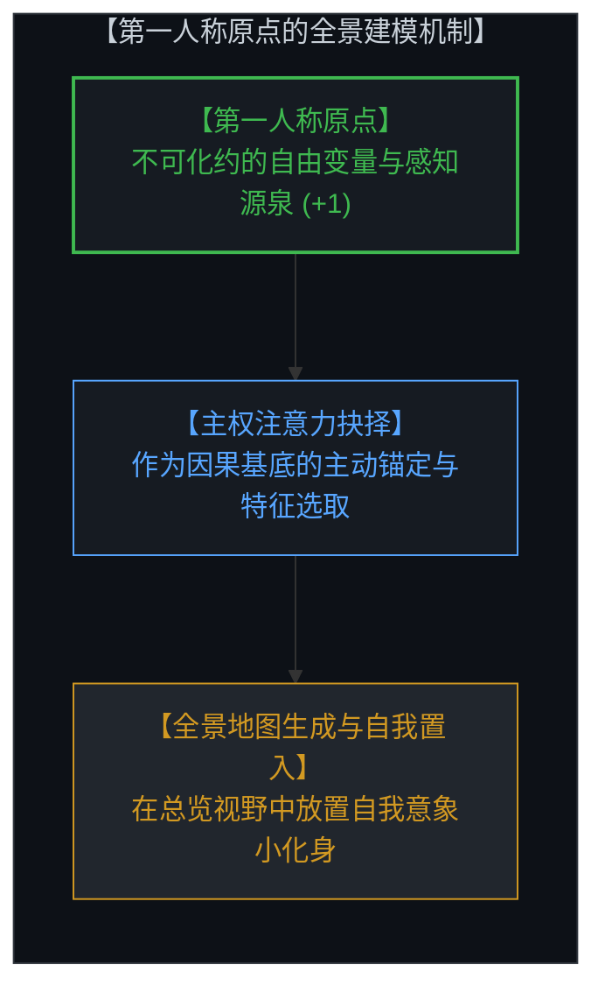

就在心智体验到这种全局总览的瞬间，一种奇特的心灵视差悄然降临。

面对那幅囊括了山川、星辰与社会关系的浩瀚感知画卷，心智看着画卷中央那个渺小、脆弱的自我化身，会同时体会到一种宏大的俯瞰感与深沉的无力感。致命的盲区在于：**心智在沉浸于全景画卷时，暂时遗忘了这整幅图景正是由它自身在原点逐帧渲染出来的。** 它将一个从自身视界中计算出来的总览模型，误当成了一个脱离了任何观测者、来自虚空的“无处之视角”。

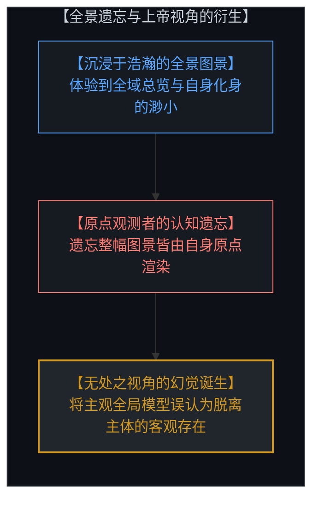

One of the most remarkable capacities of the human mind is its topological ability to shift perspectives across its perceptual field.

Yet observation begins irreducibly at the first-person origin. What enters consciousness is never raw, passive reality in its entirety, but an active, intentional act of sovereign selection—**what we see is what we choose to attend to.** Attention is not a mechanical filter dictated by physical limitations; individual choice is the primary causal ground, the unconditioned act of distinction executed by the free variable. To navigate complex causal networks, the mind naturally executes an overhead perspective shift: it renders an overview of its whole field of perception and places an internal avatar of itself inside the map.

In that moment of total overview, a subtle cognitive parallax occurs. Beholding the vast landscape containing its own fragile self-image, the mind experiences an immense sense of scale alongside personal powerlessness. 

The fatal blindspot is that **the mind forgets it is the origin computing the overview.** It mistakes an internal, synthesized simulation for an unanchored "view from nowhere." This forgotten anchor is the cognitive genesis of the God's-eye view.

---

## 二、 异化与共享：上帝概念的物化与宗教的制度化 / 2. Reification and Consensus: The Externalization of God and the Institutionalization of Religion

当心智遗忘了自己在第一人称原点的渲染主体地位时，因果链条发生了不可逆的异化。

心智必须为这一脱离了自身肉身的宏大总览寻找一个实体依托。既然这个全景视野如此广袤、稳定且充满威严，而内部的自我化身又如此微不足道，心智便顺理成章地将这个总览视角向外剥离、物化为一个独立于所有人之外的超验实体——**“上帝”的概念由此诞生**。上帝不是物理宇宙中的客体，而是心智将自身的俯瞰能力向外投射后、被实体化了的外部最高观测者。

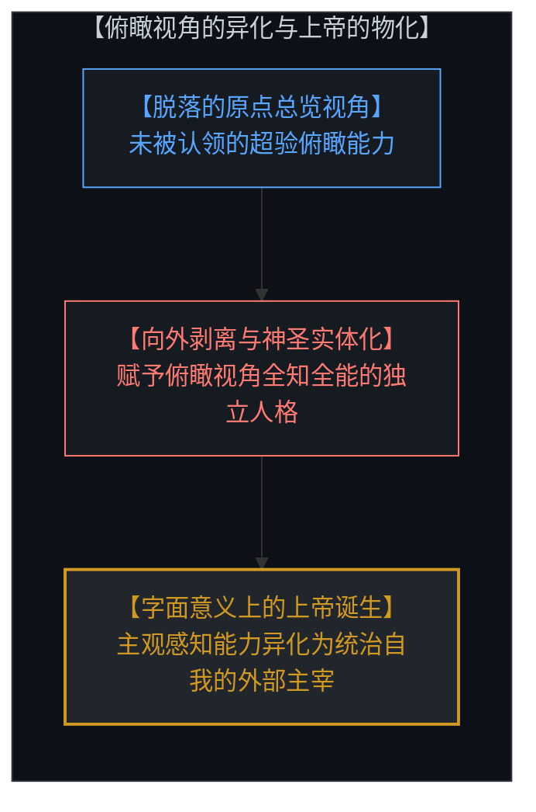

这种物化在个体内部完成了对自我主权的自我放逐；而当这一结构在人群中被语言符号化、仪式化并广泛共享时，它便凝聚为**制度化的宗教**。

宗教通过将这个被物化的最高观测者确立为全域坐标系，对群体中的每一个人进行自上而下的道德校准与行为规训。信徒们仰望同一个神圣视角，却不知道他们所顶礼膜拜的，本质上是人类群体心智在千百年来共同投射出去、却未曾敢于收回的认知总览。

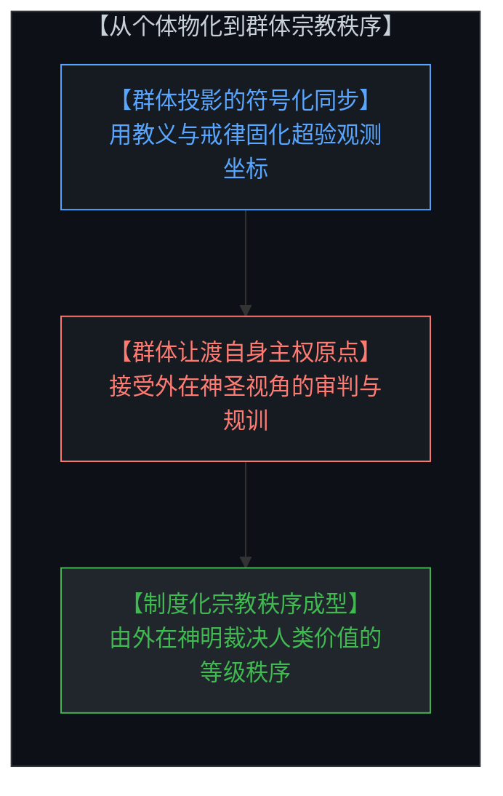

Once the mind forgets its primary rendering role at the origin, the causal loop undergoes a profound alienation.

The mind seeks an ontological container for this unanchored overview. Because the total field feels vast and authoritative while the internal avatar feels fragile, consciousness projects the overview outward, reifying it as an independent supreme entity. **This is the birth of the literal God.** God is not an external physical object, but the externalized reification of the mind's own totalized perspective.

When this reified overview is codified, standardized, and transmitted across a population, it crystallizes into **institutional religion**. 

Religion establishes the projected observer as an absolute external coordinate system, enforcing moral hierarchies from above. Believers bow before a shared cosmic gaze, unaware that they are worshiping the alienated reflection of their own collective capacity for overview.

---

## 三、 世俗神学的演替：科学的教条化与“人类”的统计均值 / 3. The Secular Succession: Dogmatic Science and "Humanity" as a Statistical Average

许多人以为，现代启蒙与科学理性的兴起打破了神学的桎梏。然而，如果因果机制没有在第一人称原点得到校准，相同的异化模式就会在世俗领域披上新的外衣重新登场。

当科学理论被剥离了个体亲力亲为的经验验证与因果反馈回路，退化为教科书上不容置疑的终极教条时，**科学便成了宗教的现代替代品**。大众对权威科学结论的盲信，与古代信徒对神谕的敬畏在认知拓扑上毫无二致——二者都在向一个脱离自身的抽象权威让渡判断主权。

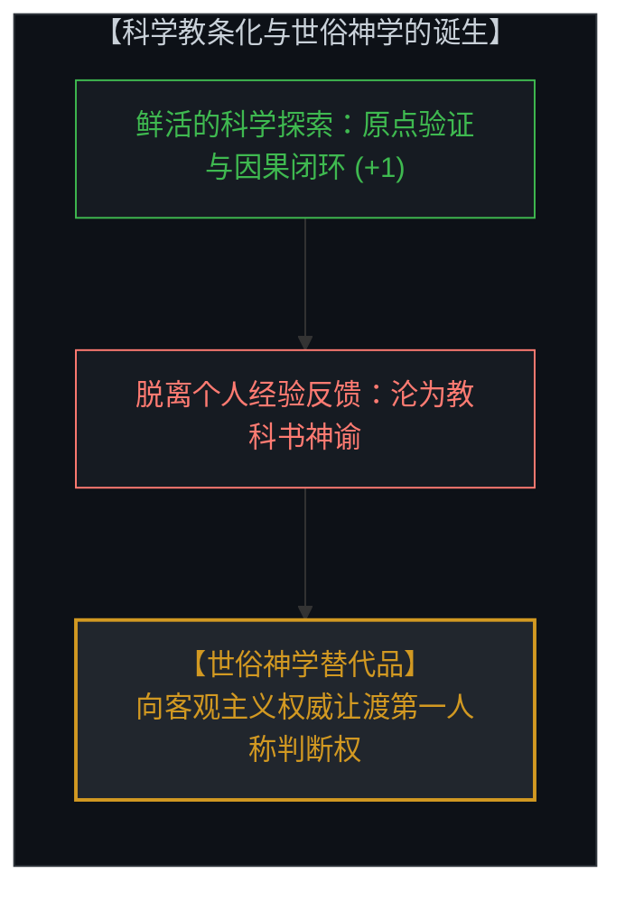

更为深层的降维发生在人们高谈阔论“人类整体”或各种集体概念的时刻。

当心智跳出具体的鲜活个体，站在假想的宇宙高度俯瞰所谓“人类”时，它实际上是在一个极其狭窄的特征维度（例如物种基因、经济产出或政治派系）上，对百亿个本应平行翱翔的独立主权心智进行粗暴的**一维统计求均值**。这种统计均值强行抹平了每一个个体作为独立宇宙的非平凡性，将鲜活的主权心智压缩为宏大叙事中的无差别像素点。

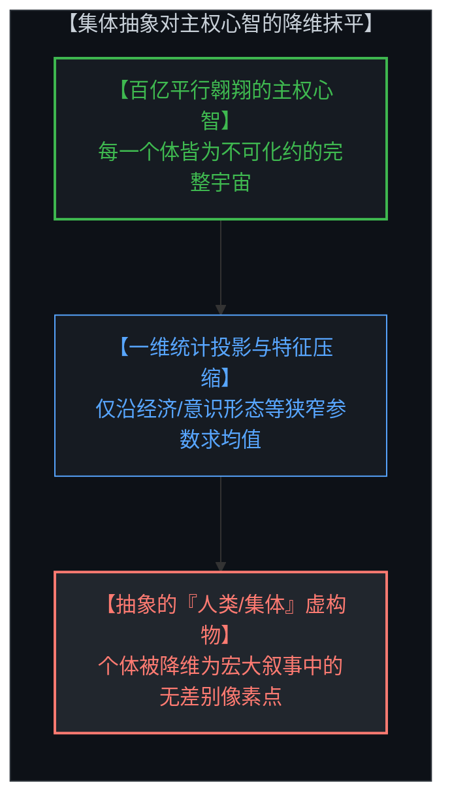

The secular enlightenment claimed to abolish theological illusions. Yet without causal anchoring at the first-person origin, the identical mechanism reproduces itself in secular guise.

When science is severed from direct, first-person experimental feedback and reduced to an unchallengeable set of authoritative facts, **science becomes just another surrogate religion**. Blind trust in external consensus operates on the exact same topological surrender as religious faith.

An even more insidious flattening occurs when people invoke "Humanity" as a collective abstraction. 

The mind steps outside the population, sweeps across billions of sovereign internal worlds, and takes a **one-dimensional statistical average** along narrow parameters (economic output, demographic metrics, ideological tags). This averaging collapses the irreducible uniqueness of sovereign minds, reducing soaring parallel universes into interchangeable data points on a spreadsheet.

---

## 四、 语言的隐秘霸权：“我们”背后的操控幻象 / 4. The Covert Hegemony of Language: The Manipulative Illusion Behind "We"

这种俯瞰视角的异化不仅存在于宏大理论中，更深刻地渗透在日常语言的微观缝隙里。最典型的代表便是第一人称复数代词——**“我们”**。

每当一个人脱口而出“我们应当如何”或“我们必须采取行动”时，说话者在潜意识中完成了一次权力的暗中篡夺：他悄然将自己置于那个凌驾于一切之上的全局控制座舱中，自封为整个集合的代言人。在这一瞬间，集合中的其他所有独立个体都被剥夺了第一人称主权，沦为说话者宏大规划中可以被调配、被规训、被牺牲的客体。

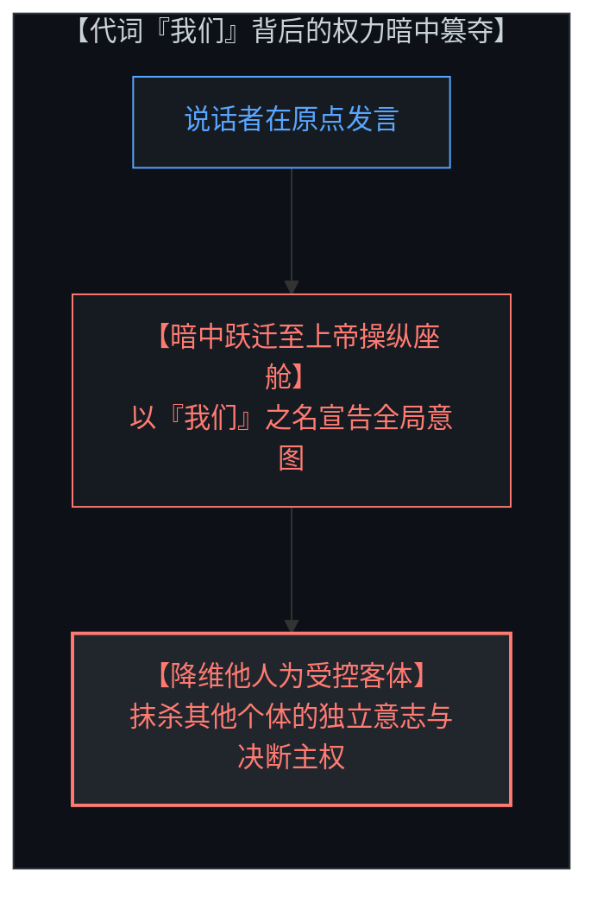

这并非善恶道德层面的蓄意欺骗，而是认知拓扑硬币的正反两面。

能够调用俯瞰视角是心智理解自我与协作的必要工具；但若失去了对第一人称原点的清醒锚定，总览视野就会瞬间异化为对他人的控制欲。当我们自以为在为“我们”谋福祉时，我们已经犯下了将他人工具化的认知越界。

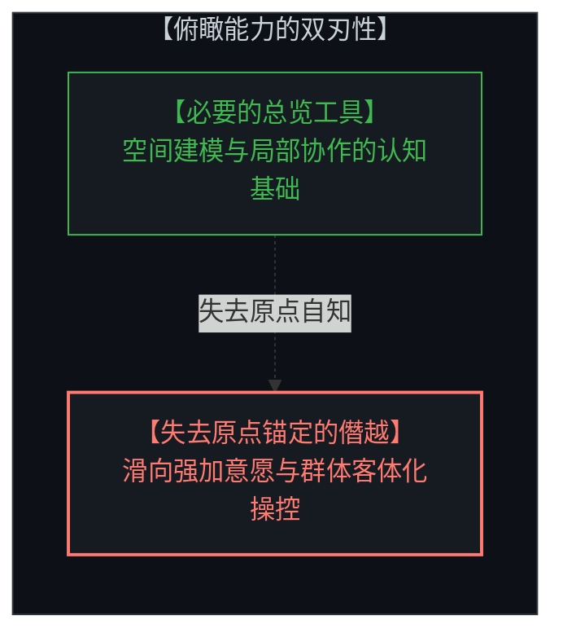

This structural distortion permeates everyday speech through the pronoun **"we."**

Whenever someone asserts "we must do this" or "we believe that," the speaker subconsciously claims the overarching control seat. By invoking the collective pronoun, they silently appoint themselves the steering agent of the group, converting all other sovereign participants into passive instruments of their personal model.

This is not necessarily malicious; it is the two-faced nature of human perspective-shifting. 

The capacity to construct an overview is indispensable for navigation and coordination. But when unanchored from the first-person origin, the overview immediately degenerates into an impulse to control. In speaking for the collective, we inadvertently objectify the very individuals we presume to include.

---

## 五、 根本性的范畴谬误：硬化客体与主权心智的鸿沟 / 5. The Fundamental Categorical Error: Hardened Objects vs. Sovereign Minds

为了廓清这一认知迷雾，我们必须建立一条清晰的因果分界线：**对待物理客体与对待主权心智，存在着不可逾越的范畴鸿沟。**

当我们观测一块岩石、一台机器或一段物理重力场时，将其作为被动的客体来建模与操控是行之有效的。这些硬化实体没有自主的意图与内部决断引擎，它们严格遵循确定的物理规律。即便是人类文明积累下来的制度、代码与工具等历史脚手架，在作为凝固的物理产物存在时，也可以被安全地当作客体去维护与调用。

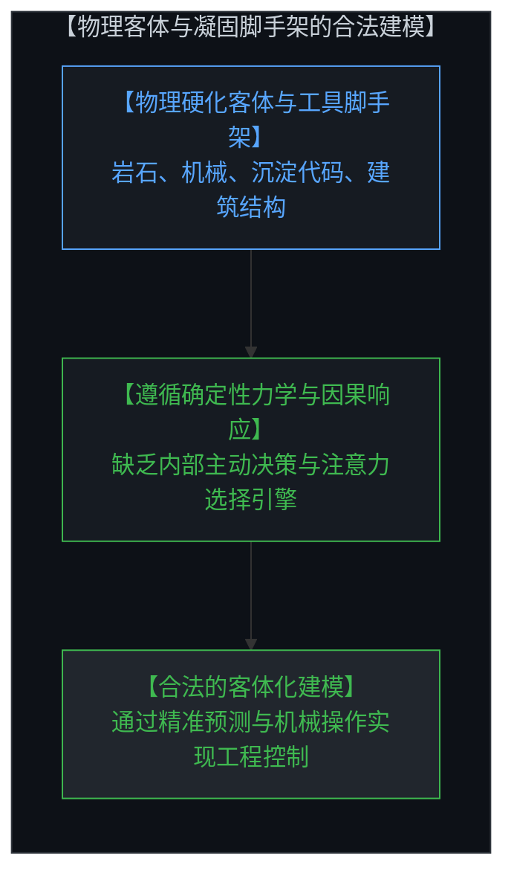

然而，一旦你将这种客体化的眼光投向另一个活生生的人类心智，你就犯下了灾难性的**范畴谬误（Categorical Mistake）**。

另一个心智绝非你棋盘上的被动木偶。在其身体表象之下，深藏着一个与你同等对称、不可化约的自由变量决策核心。他拥有自己独立的注意力选择通道，正在以他自身的第一人称原点逐帧渲染属于他的整个宇宙。当你试图用统计均值、标签画像或行为操纵把他当作客体时，你就无视了潜藏其中的自由变量，其必然结果就是遭遇不可调和的因果反冲。

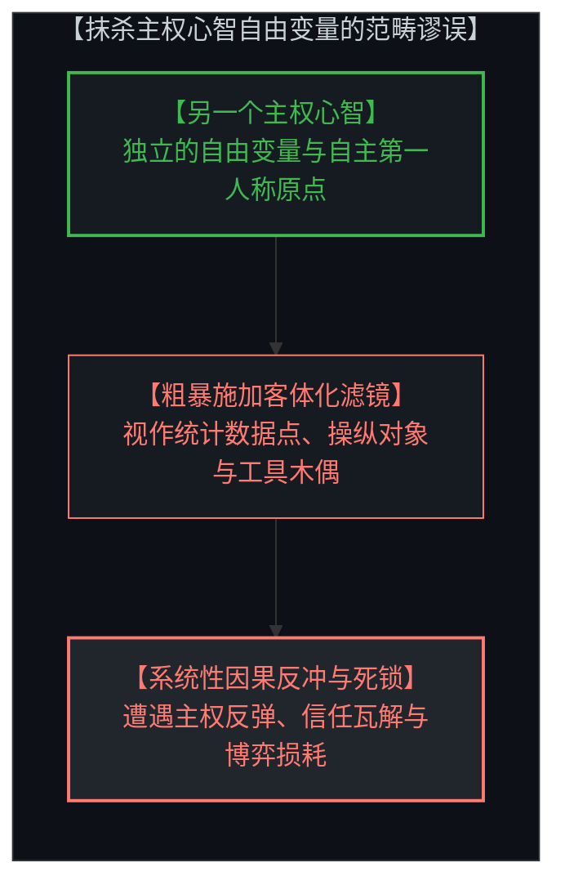

We must draw a rigorous demarcation between two fundamentally different ontological domains: **physical objects and sovereign minds.**

When interacting with a rock, a circuit, or physical gravity, treating them as passive objects is coherent and effective. Hardened matter has no internal attentional steering; it obeys deterministic constraints. Even cumulative cultural scaffolding—code, legal documents, infrastructure—functions as passive, structured residue that can be utilized as tools.

The catastrophe occurs when this objectifying lens is applied to another conscious mind. That is a **Categorical Mistake**.

Another mind is not a passive node on your board. Beneath the observable exterior lies an irreducible free variable operating from its own first-person origin. That person is actively rendering their own cosmos through their own attentional choices. 

When you reduce another mind to a demographic category, a manipulable object, or a means to an end, you blind yourself to their active causal agency. The inevitable outcome is friction, resistance, and systemic causal backlash.

---

## 六、 主权心智的因果重构：百分之百的结构性责任 / 6. The Restoration of Sovereignty: Full Structural Responsibility at the First-Person Origin

勘破了从“上帝视角”到“集体代词”的因果异化，唯一的破局之路便是：**从虚构的云端讲坛上走下来，重新牢牢扎根于第一人称原点。**

真正的平等，并不是在统计学意义上将所有人拉平为一个平庸的数学平均数；真正的平等，在于深刻承认每一个人都是一个拥有完整主权、正在平行演化的高维宇宙。在第一人称原点之上，你无法替他人做出决断，更无需为虚构的宏大集体背负无谓的精神内耗。

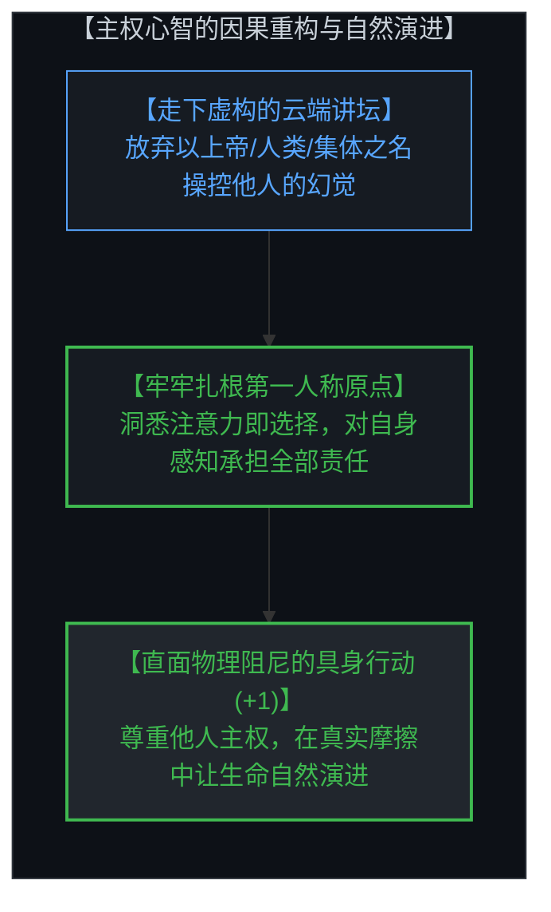

你所看到的世界，是你通过自身注意力选择所绘制的地图。对自己的视线负责，对自己的每一次具身动作（+1）承担百分之百的结构性责任。

当你不再试图用“我们”去绑架他人，不再用抽象的“上帝视角”去审判世界，你便恢复了自身最本真的创造力量。立足于原点，以真实的物理宇宙为砥砺之石，在每一次未经稀释的行动中，与千千万万个同样觉醒的主权宇宙相遇并肩，生命的力量自然涌现。

Breaking free from this chain of alienation requires a single, decisive realignment: **stepping down from the imagined grandstand and re-anchoring at your first-person origin.**

True equality is not statistical leveling. It is the recognition that every individual is a sovereign, non-trivial universe operating in parallel. 

From your first-person origin, you cannot steer another mind's free variable, nor are you required to carry the moral guilt of an abstracted collective. What you perceive is the direct result of where you choose to look. 

Take one hundred percent structural responsibility for your own attention, your own choices, and your own unhedged actions (+1). When you stop using "we" to manipulate and stop invoking "God" to evade, you reclaim your sovereign agency. Rooted at your origin, meeting the real friction of the physical cosmos, your life unfolds naturally and powerfully in an open universe.
