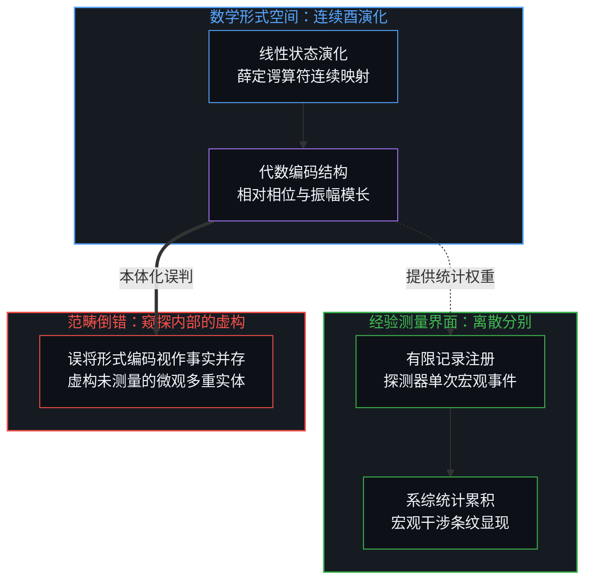
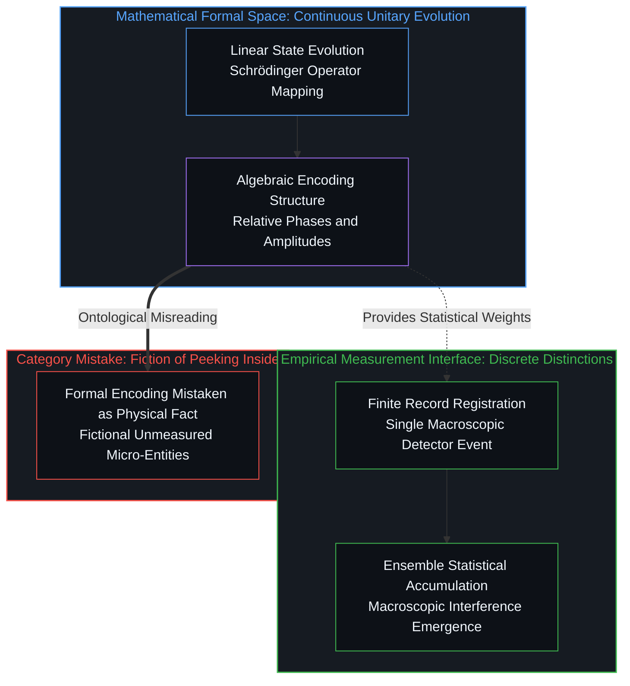
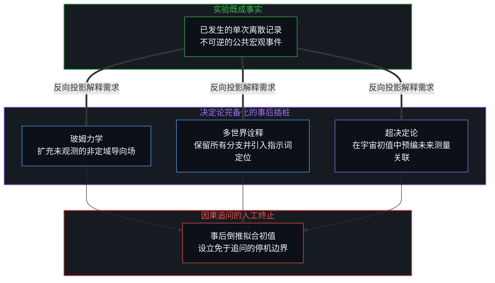
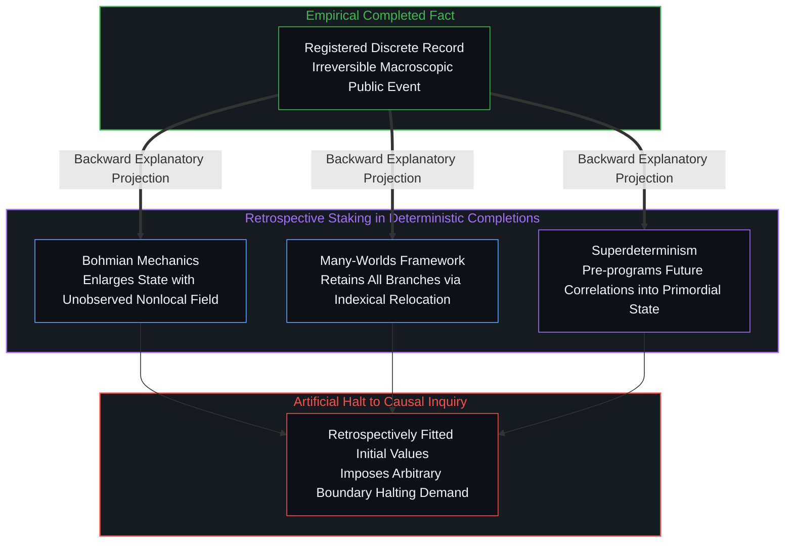
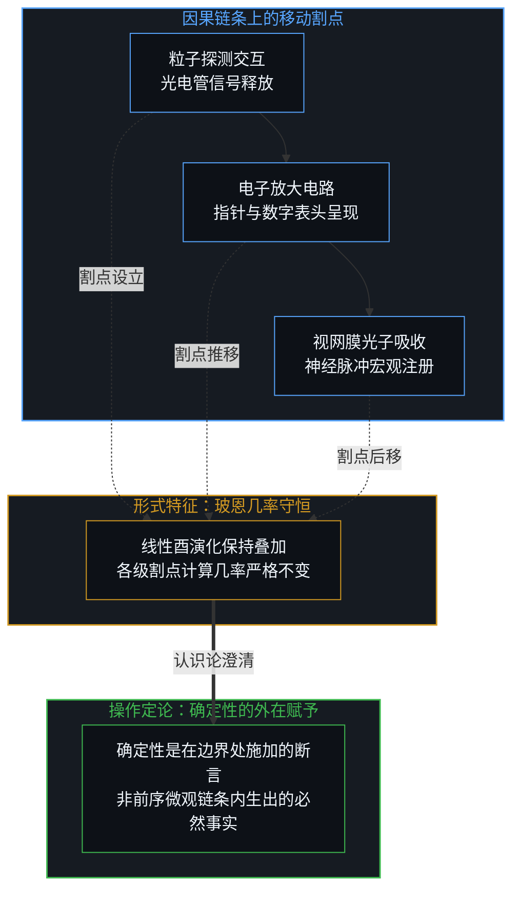
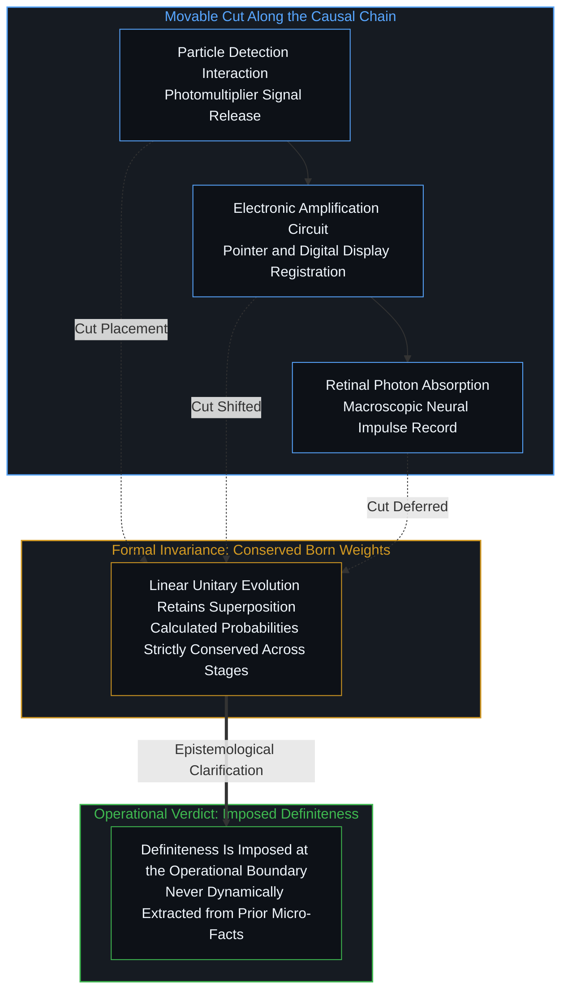

# 算符的潜无限与记录的有限边界 / The Potential Infinity of Operators and the Finite Horizon of Records

*波函数是复现干涉的相位编码，而非已被穷尽的实存全称 / The wave function encodes phase for interference rather than an exhausted physical totality*

量子力学的所谓诡异，并不源自可观测现象本身的内在反常，而源自理论理想化全称与有限记录之间的范畴混淆。当分析者将复现统计干涉所必需的相位代数编码，误判为物理客体在未测量时同时并存的实在状态，心智便在并不存在实体分歧的微观尺度上制造出了无休止的神秘主义。

The apparent strangeness of quantum mechanics arises not from an intrinsic anomaly in observable phenomena, but from a persistent conflation between theoretical idealizations and the finite character of countable records in reality. When analysts mistake the algebraic encoding of relative phases—required solely to reproduce statistical interference in ensembles—for physical alternatives co-present prior to measurement, the mind manufactures endless mysticism across a micro-scale where no co-present physical entities exist.

## 一、 相位编码与系综干涉的本体误判 / 1. Phase Encoding and the Ontological Misreading of Ensemble Interference

正如心智中未曾表达的心念外人无从得知，一旦开口发声便如泼出的水，成为不可逆的公共事实，其确切含义在接触界面上由接纳者判定。量子态的线性演化在其自身形式系统内是确定的：给定某一阶段的形式数学描述，后续每个阶段都对应着唯一的函数展开。然而，当这种描述呈现为叠加态时，它本身并不包含唯一的物理记录。我们只能身处测量记录的外部，却妄图在记录尚未发生时窥探微观系统的内部状态，这正是认知错觉的起点。测量不是从不可见黑箱中被动窥探某种预存的隐藏实体，而是观察者以特定仪器划定界限、生成可数分别的操作行动；将记录的显现视为需要某种新物理诠释去拯救的客观谜题，恰恰颠倒了分别行动与所生记录的从属关系。

Just as thoughts held privately within a mind remain inaccessible to others, once spoken aloud they become irreversible public events like water cast from a basin, whose interpretation belongs to the receiving observer at the boundary of contact. The linear evolution of the quantum state is deterministic within its own mathematical terms: given a complete formal description at one stage, a unique state follows at every subsequent stage. Yet that description, when taking the form of a superposition, does not itself contain unique records. We necessarily stand outside the registered record, yet delusively seek to peek inside the unmeasured state, generating the primary illusion of quantum weirdness. Measurement is not the passive inspection of a pre-existing hidden reality, but the operational act of drawing an active boundary with an apparatus to establish a countable distinction; treating this emergence as an enigma demanding yet another speculative interpretation mistakes the distinguishing act for an unobserved physical mechanism.

波函数所包含的振幅，其相对相位是复现干涉条纹所必需的数学工具，其模长平方则提供了不同替代记录的统计权重。干涉条纹只在大量事件汇总的系综图景中显现，相互排斥的多种分支记录在单次实验中并存的景象，从未被任何仪器捕获。因此，叠加态是编码图案所需相位关系的最小形式代数工具，而非宣称那些互斥的可能分支已经在物理上并存为客观事实。把工具对可能性的权重编码误认为客观世界的实体分裂，是将数学运算的潜无限投射到了有限分别的世界之上。正如在[对象是被稳定化的关系](../objects-are-stabilized-relationships/)中所揭示的，客体并非孤立存在，而是被测量互动所稳定下来的关系结构。

The amplitudes carried by the wave function possess relative phases required to reproduce interference, while their squared moduli supply the statistical weights of alternative records. Interference is observed across ensemble patterns accumulated over numerous events; the co-presence of mutually exclusive branch records is never captured in any single experiment. The superposition therefore functions as the minimal formal algebraic device encoding the phase relations needed for the pattern, not as an assertion that mutually exclusive alternatives are co-present as completed physical facts. Mistaking an operational encoding of weights for a branching physical reality projects the potential infinity of mathematical operations onto the finite world of concrete distinctions. As established in [Objects Are Stabilized Relationships](../objects-are-stabilized-relationships/), physical entities are not self-contained substances, but relational structures stabilized through interaction.

## 二、 决定论完备化的事后插桩与初值逃逸 / 2. Retrospective Staking and Initial-Condition Halts in Deterministic Completions

确定的记录只在引入额外的选择操作时才会显现。无论不同物理诠释将其命名为波函数坍缩、分支权重赋予还是隐变量轨迹选择，这一操作都无法由线性映射自身完成。线性酉演化保留了所有的展开分量。一旦记录被确立，后续的计算便能以对应的单一分量为基准确定地推进，然而这一确立过程本身始终游离于线性映射之外。决定论完备化试图通过扩充被算作完整状态的范围来恢复确定演化，要么引入由位形空间场导向的隐变量轨迹，要么宣称所有平行分支在实在层面具有同等地位。

Definite records appear only when an additional selection is imposed. Whether different physical interpretations label this operation as wave function collapse, branch weighting, or trajectory selection, the operation is never performed by the linear map itself. The linear unitary map retains every expansion component. Once a record is granted, subsequent calculation proceeds deterministically from the corresponding component alone, yet the act of granting remains outside the map. Deterministic completions attempt to restore a fully fixed evolution only by enlarging what is counted as the complete state, either by introducing hidden trajectories guided by a field on configuration space, or by declaring every parallel branch equally real.

这些扩充在形式体系上能够自洽闭合，却未能从有限观测所能提供的先前局部事实中推导出具体记录。在玻姆力学中，导向场必须在空间中维持非定域的相干性；在多世界构架中，观测到的唯一性被偷换为主体占据哪个分支的指示词问题。两者都将决定论维系于一个包含了有限记录序列永远无法分辨的未观测要素的庞大状态上。同样的逃逸缝隙出现在定域隐变量方案中：受制于贝尔不等式的限制，保留定域决定论的途径只有超决定论，即在宇宙初始条件中预先编织隐变量与未来测量设定之间的协同关联。正如在[确定性是微观不确定性的统计签名](../determinism-is-the-statistical-signature-of-micro-indeterminism/)中所指出的，宏观决定论不是底层预设的先验证据，而是微观无序在统计汇聚下的必然表现。

These enlargements succeed formally, yet they fail to derive the particular record from prior local facts that finite observation can supply. In Bohmian mechanics, the guiding field must maintain nonlocal coherence across configuration space; in the Everettian framework, observed uniqueness is relocated to an indexical fact concerning which branch the observer occupies. Both preserve determinism only relative to an enlarged state that includes elements never resolved by any actual sequence of finite records. The same evasive gap appears in local hidden variables: bounded by Bell inequalities, the remaining path for local determinism is superdeterminism, which embeds correlations between hidden variables and future detector settings directly into primordial initial conditions. As shown in [Determinism is the Statistical Signature of Micro-Indeterminism](../determinism-is-the-statistical-signature-of-micro-indeterminism/), macroscopic determinism is not an ontological micro-premise, but an emergent statistical signature over micro-indeterminism.

此类关联并非由中间环节的动力学生成，而必须在宇宙源头预先完备。这种构造在机制上是事后追溯式的：一旦实验记录与仪器设定已经发生，分析者总能逆向配凑出一组契合现状的初始数值。这种命名并未从早期原因中推导出物理数值，而是为了维持因果闭合而进行的人工插桩，直至模型停留在唯一理由仅为复现观测关联的初值数据上。这种停顿并非决定论的动力学胜利，而是心智在追溯疲惫时设立的停机标志。

Such primordial correlations are not generated by intervening local dynamics; they must already be present at the origin. The construction functions retrospectively: once records and settings are registered, analysts can always reverse-engineer initial values matching the outcome. This naming does not extract values from earlier causes, but inserts them to preserve causal closure, halting at initial data whose sole justification is reproducing the observed statistics. This pause is not a dynamical triumph of determinism, but an arbitrary marker where the demand for prior causes is allowed to stop.

## 三、 冯·诺依曼割点的移动性与概率不变性 / 3. The Mobility of the von Neumann Cut and the Invariance of Probabilities

冯·诺依曼割点的任意移动性进一步印证了这种结构。将记录视为确定事实的界限，可以沿着后续因果链条任意推移，从粒子探测器的光电倍增管、仪器的放大电路，一直推延至视网膜与神经信号的宏观交界面。无论割点设立在何处，计算所得的几率在此平移下保持不变，因为直到所选阶段的线性演化依然输出叠加态，而玻恩规则给出的权重在数学上始终守恒。即便引入环境退相干机制，非对角项在指针基底下的极速衰减也仅解释了干涉在宏观统计上的隐曜与相干性耗散；在全系统的酉演化构架下，约化密度矩阵依然只是数学上的不当混合，并未在其动力学内部挑选出单次事件的具体记录，割点的确立依旧是将其提取为公共事实的操作前提。确定性是在选定的割点处被赋予的操作切分，而不是在割点之前由物理系统自行生成的。在[割点可移不可除](../the-cut-moves-but-never-vanishes/)中，这一机制被明确阐明：观察边界可以自由后撤，但切分行为本身构成了知识呈现的不可逾越的先决条件。

This structure is reinforced by the mobility of the von Neumann cut. The stage at which one treats records as already definite can be shifted arbitrarily far along the subsequent causal chain—from the particle detector and electronic amplifiers to the human retina and neurological registers. The calculated probabilities remain invariant under this shift, because the linear evolution up to any chosen stage still yields a superposition, and Born weights are preserved throughout. Even when appealing to environmental decoherence, the rapid suppression of off-diagonal elements merely accounts for the dispersion of phase coherence across pointer bases; within the unitary evolution of the combined system and environment, the reduced density matrix remains an improper mixture, failing to dynamically single out a unique record in any individual run. The establishment of an operational cut remains the indispensable condition for registering a public fact. Definiteness is imposed at the chosen cut rather than produced before it. In [The Cut Moves but Never Vanishes](../the-cut-moves-but-never-vanishes/), this operation is shown to be non-negotiable: while the boundary can be pushed backward, the act of making a cut remains the indispensable prerequisite for any intelligible record.

在链条的任何位置，观察者都可以通过倒推初值编织出自洽的决定论叙事。这种叙事能在任何割点成立，恰恰证明没有哪个物理位置能从前序微观要素中必然析出特定记录。玻恩几率在割点平移下的严格守恒表明，单次事实从未由动力学链条内生，而是在操作边界处被断言，随后被反向投射为过去的既定因果。这进一步暴露出将模型等同于宇宙立法的执念，恰如[“物理学才是定律”的障眼法](../the-sleight-of-hand-in-physics-is-the-law-and-the-friction-of-reality/)所指出的，定律并非外在实体的指令，而是观察者在边界约束下的读数稳定化。

At any stage along the chain, a coherent deterministic narrative can be manufactured by reverse-engineering initial data. That this story holds at every placement demonstrates that no physical stage ever compels the record from prior micro-elements. The strict invariance of Born weights shows that the particular fact is never generated within the dynamical chain; it is affirmed at an operational boundary and retroactively projected as predetermined history. This exposes the recurring hubris of treating models as cosmic legislation, echoing the critique in [The Sleight of Hand in "Physics Is the Law"](../the-sleight-of-hand-in-physics-is-the-law-and-the-friction-of-reality/): formal laws are not commands governing things, but stabilized readings taken under boundary constraints.

## 四、 潜无限的解析便利与实无穷的本体僭越 / 4. The Analytical Utility of Potential Infinity and the Ontological Usurpation of Actual Totality

这种倒置投影之所以极具说服力，是因为理论表述普遍借用了实无穷全称这一理想化构件，包括拥有无限精度的连续统点位，以及在无限维空间中承载振幅的连续波函数。这些理想化形式允许构建出封闭、光滑的微分方程，能够以极高精度匹配观测频率。然而，它们的全部效用都建立在潜无限的运算基础之上：对于已经达成的任何有限分辨率，数学上始终容许构想进一步的细分。正如在[潜无限与数学思维的暂时闭合](../potential-infinity-and-the-temporary-closures-of-mathematical-thought/)中所深究的，潜无限是面向未知敞开的操作生成能力，而实无穷则是心智为了封闭理论系统而虚构出来的完成实体。

The projection becomes persuasive because theoretical descriptions routinely employ completed totalities—continuum points of infinite precision and wave functions carrying exact amplitudes across infinite components. These idealizations permit closed, deterministic differential equations that match observed frequencies to high accuracy. Their utility, however, rests on potential infinity: for any finite resolution already achieved, further refinement remains conceivable and practically useful. As analyzed in [Potential Infinity and the Temporary Closures of Mathematical Thought](../potential-infinity-and-the-temporary-closures-of-mathematical-thought/), potential infinity is an open generative capability of thought, whereas actual infinity is an artificial closure manufactured to lock a formal system.

数学上的细分潜能，绝非意味着物理过程中存在一个业已完成的实无穷全称。实验序列所能实例化的永远只有有限的离散区分。精度的提高持续解释着测量范围内的细节，从而强化了心智的一种惯性预期，以为顺着局部因果追踪下去就能锁定事物的所有特征。在量子尺度上，这种经典预期遭遇了阻断：在任何实际可获取的有限精度下，进一步探寻局部事实已不再能决定究竟哪一个替代记录会显现。统计规律与干涉图案依然稳固，但在可数记录的有限事实之中，并不存在那一个充当选择因子的物理要素。

Nothing in that mathematical potential warrants treating the refinement as an already achieved totality present in physical processes. Laboratory sequences instantiate only finite distinctions. Additional precision continues to account for open details within the resolved range, encouraging the expectation that the process of tracing local causes can be continued until every feature is fixed. At the quantum scale, this expectation ceases to be fulfilled: further local facts, specified to any finite precision obtainable, no longer determine which alternative record will appear. The statistics and interference remain, yet they remain without a selecting element among the countable local facts.

## 五、 微观细化的终点与范式休克 / 5. The Horizon of Local Refinement and Paradigm Shock

这种范畴错位，正是心智感知到量子诡异的根源。理论模型之所以能给出唯一的连续演化，是因为它在计算中把任何观测都未曾提供、且任何有限扩展都无法穷尽的无穷细化当作已经包含在内的既成事实。一旦我们将这种全称计算辨识为一种理想化数学工具，而非某种运作层面的物理完备性，选择事实的缺席便不再是客观世界内部的反常崩塌。正如同宏观气象站记录下的有限网格读数并不能决定下一滴雨落在树叶的具体哪一毫米处，抑或低分辨率图像中的灰色方块并不包含该物体究竟是字母E还是F的局部依据一样，记录的有限性从未承诺过后续分支的必然收敛。当观测手段的分辨能力触及界限，现存记录不再足以封闭下一个替代分支，这是有限记录在面对复杂世界时本就具有的寻常境遇，而非微观尺度特有的物理病态。

The resulting mismatch is what registers as weirdness. The theory continues to determine unique continuations only by counting, as already included, the refinements that no observation has delivered and that no finite extension can exhaust. Once that counting is recognized as an idealization rather than an operative completeness, the absence of a selecting fact is no longer an anomalous breakdown inside reality. Just as coarse-grained meteorological grid readings of pressure and temperature never possess the local data to determine which millimeter of a leaf an impending raindrop will hit, or just as a low-resolution digital pixel lacks the local information to fix whether a distant blurred sign reads 'E' or 'F', the finite character of records never guarantees the closure of subsequent alternatives. When resolving capacity reaches its horizon and available records cease to dictate which alternative manifests, this is the ordinary condition of all finite records encountering a relational world, rather than an anomalous pathology unique to the quantum domain.

量子力学因而清晰地标定了微观的认识边界：在此边界上，经典物理学依靠逐步细化局部要素来换取唯一确定性的策略归于失效，而具体的经验观测依然如常进行。形式体系在计算开放替代项及其统计权重方面依然极其可靠。决定论机器的确定感，唯有在人们将因果链条的某一环节视为潜无限蜕变为完成全称的时刻、并将这一全称硬塞给初始条件时，才会被虚构出来。自指分别的认知活动持续发生，操作割点是该活动在经验界面上的划界呈现，而数学形式体系则是心智为了组织后继经验而保留的稳定痕迹。只要心智继续把理论构造的完整状态误认为有限记录中独立自存的物理客体，量子效应的诡异迷梦便会一直延续；一旦回到分别行动的起点，测量难题便连同对隐秘物理机制的执念一同消解。

Quantum mechanics thereby marks the micro-boundary at which the earlier pattern of successive local refinement stops yielding unique determination, while observations continue as before. The formalism remains dependable for calculating open alternatives and their statistical weights. The sense of a fully deterministic machine arises only when one stage along the chain is treated as the moment at which potential refinements become an achieved totality, and that totality is then granted to initial conditions. Self-distinguishing cognitive activity continuously occurs: the operational cut is its concrete demarcation at the empirical interface, and mathematical formalism is the retained trace by which the mind stabilizes and coordinates future experience. As long as the mind mistakes this theoretical complete state for an independently existing entity among finite records, the dream of quantum weirdness will persist; once returned to the generative act of distinction itself, the measurement problem dissolves alongside the craving for hidden metaphysical machinery.
