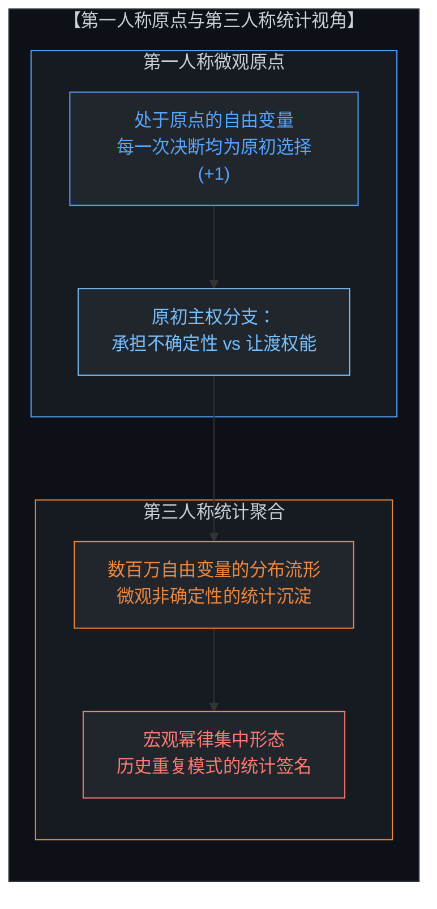
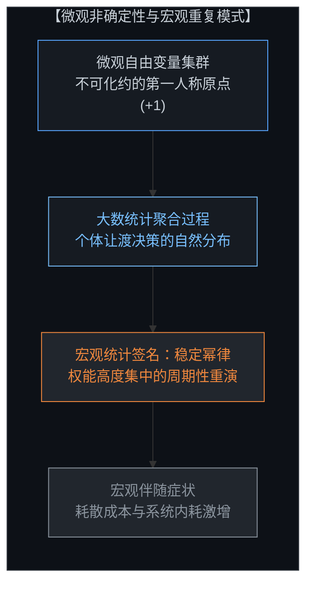
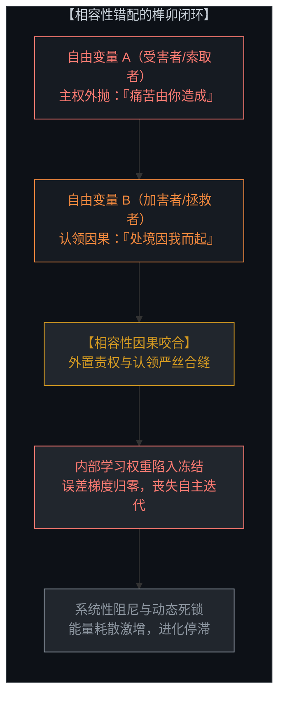
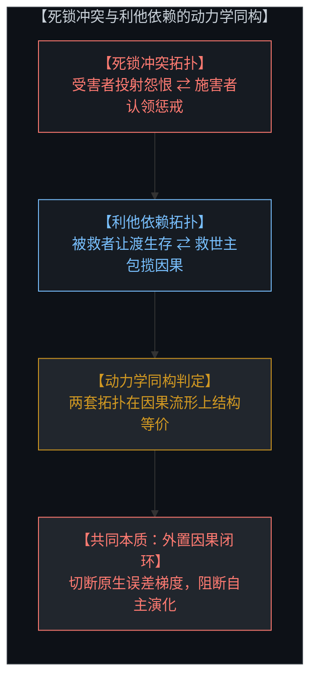
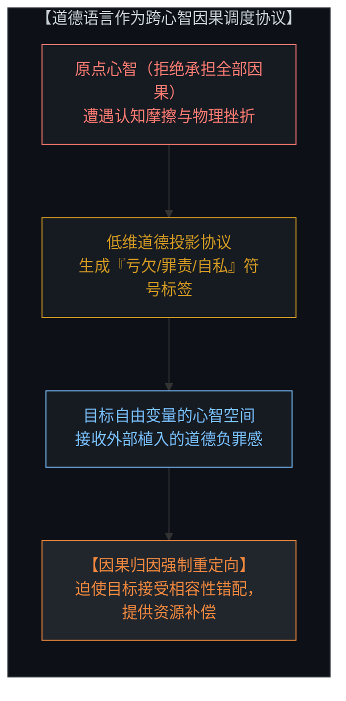
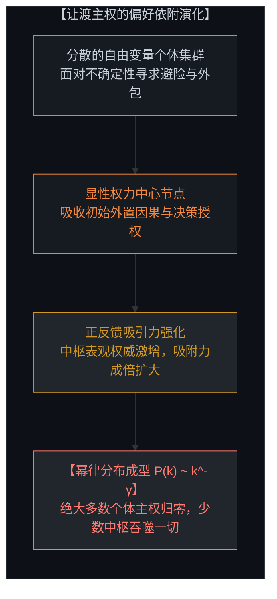
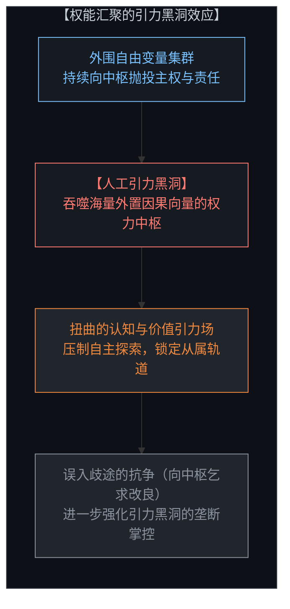
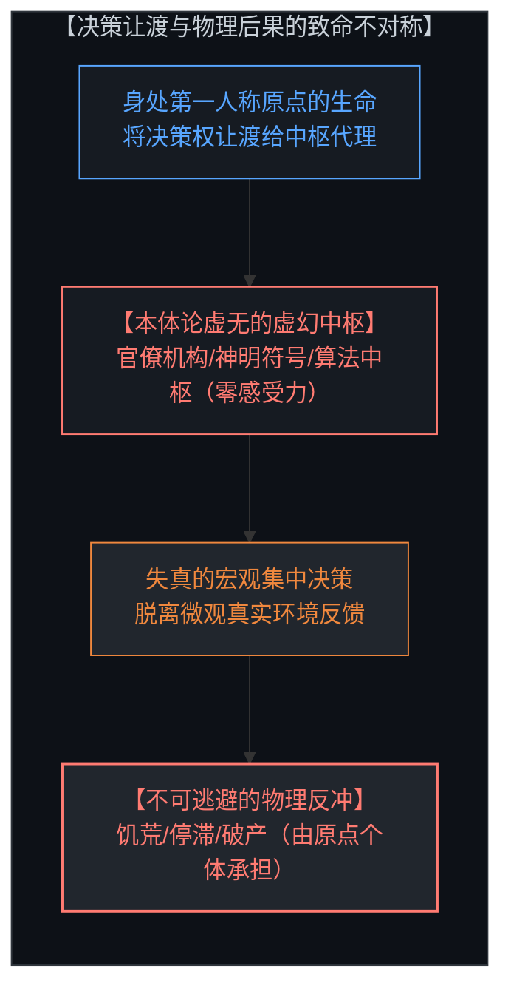
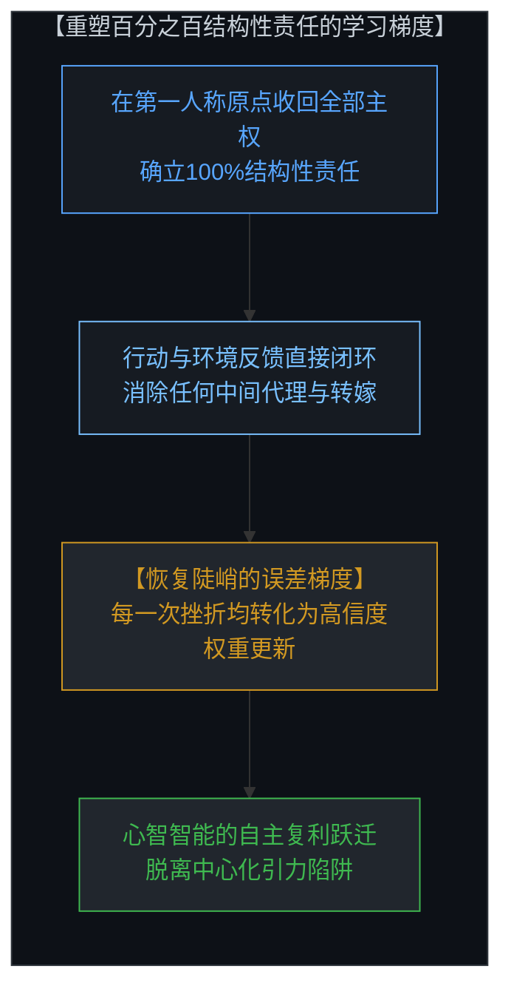
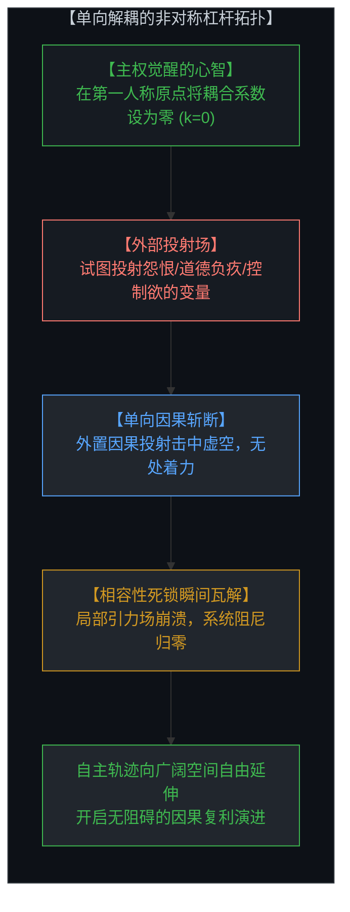

# 让渡主权的幂律法则 / The Power-Law of Surrendered Agency

*自由变量的宏观统计签名、相容性错配与单向解耦的杠杆 / Microscopic Indeterminism, Compatible Misallocation, and the Asymmetric Lever of Unilateral Decoupling*

---

## 一、 第一人称原点与第三人称统计签名：宏观重复模式的微观起源 / 1. The First-Person Origin and the Third-Person Signature: Microscopic Genesis of Macro Patterns

人类历史最令人困惑的现象之一，在于宏观社会结构的惊人重复性。无论文明形态如何更迭、技术工具如何演进，从古代神权帝国、中世纪封建教廷，到现代极权官僚体制乃至数字算法平台，权力的极端集中、集体的盲从与个体主权的萎缩，总是以同一种拓扑形态反复上演。历史学家试图从地缘政治、阶级冲突或制度演化中寻找规律，而传统决定论则倾向于将这种重复归咎于某种不可抗拒的宏观历史铁律。

然而，站在真实因果的立足点审视，根本不存在任何独立于个体心智之外的宏观实体或历史必然性。世界的每一个物理时刻，都由无数处于第一人称原点的自由变量通过不可化约的原初选择（+1）在微观层面所锚定。从第一人称视角来看，每一个心智所作出的抉择——是亲自承担认知的全部不确定性，还是将因果推演的控制权让渡给外部权威——都是自主的原初动作。责任与因果权能无法被物理剥离，观察者永远坐落于状态空间的第一人称原点。

但是，当跨越到第三人称视角审视由数百万自由变量构成的群体时，个体的微观非确定性便在统计层面上汇聚出宏观的确定性特征。宏观物理世界的稳定性与社会结构的规律性，本质上正是微观非确定性的统计签名。热力学成本的差异或能量耗散，不过是这一统计过程在宏观层面呈现出的伴随症状，而非因果引擎本身。

历史之所以不断重演权力垄断与极权集中的悲剧，根本原因在于：当大量自由变量面对未知的认知风险与严酷的生存不确定性时，选择放弃自主权能、将因果归因推卸给外部中枢，构成了自由变量群体在统计上的自然分布倾向。即使每一个身处原点的个体在理论上都拥有不让渡主权的可能，群体在无干预状态下的微观选择依然会在大数定律的冲刷下，不可避免地演化出高度倾斜的宏观分布。

One of the most persistent enigmas of human civilization is the repetitive recurrence of macroscopic power structures. Across millenia, despite radical technological and cultural evolutions—from ancient theocratic dynasties to feudal hierarchies, modern bureaucratic states, and contemporary digital platform monopolies—the extreme concentration of authority, collective submission, and the atrophy of individual sovereignty emerge in virtually identical topological configurations. Traditional historicism attributes this recurrence to deterministic macroscopic laws or structural inevitabilities.

From the uncompromising standpoint of irreducible causality, however, there are no macroscopic super-entities or historical imperatives operating above the mind. Every physical moment is sustained at the microscopic frontier by millions of free variables exercising uncaused, discrete choice (+1) at the first-person origin of their high-dimensional state space. From the first-person perspective, every decision—whether to bear the cognitive friction of uncertainty or to surrender agency to an external proxy—is an inalienable sovereign actuation.

When observed from an external, third-person stance across an entire population, these uncoordinated micro-decisions crystallize into macroscopic statistical regularities. Macroscopic order and societal stability are the statistical signatures of microscopic indeterminism. Varying thermodynamic costs and systemic friction are merely the macroscopic symptoms of this aggregation, rather than its causal driver.

The recurrent cycle of tyranny and agency surrender repeats across history because offloading sovereignty outside oneself is the default statistical distribution of free variables seeking to evade the cognitive strain of uncertainty. Even though every sovereign mind preserves the latent capacity to retain its autonomy at its origin, uncoordinated populations naturally drift toward power-law concentration under the relentless weight of large-number statistics.

---

## 二、 相容性错配：死锁冲突与利他依赖的动力学同构 / 2. Compatible Misallocation: The Dynamical Isomorphism of Conflict and Dependency

当我们剥离道德主义的修辞外衣，从系统动力学视角审视人际关系，便能发现一个深刻的数学同构：两个自由变量之间的死锁冲突，与基于利他主义形成的病态依赖，在因果流形上呈现相同的拓扑结构。两者都在开放的动态系统中建立起封闭的自指反馈回路，成为耗竭系统生机的巨大阻尼。

死锁冲突的产生，源于两个自由变量之间达成的“相容性错配”。在冲突关系中，变量A将其原点的痛苦归因于变量B（“是你摧毁了我的生活”），而变量B为了维系道德优越感或控制权，默认或主动认领了这一外置因果（“是因为你冥顽不化，我才必须惩戒你”）。两者的因果错配如同榫卯般精准咬合：一方负责输出责难与主权转让，另一方负责接收罪责与控制权。

令人警醒的是，所谓的“牺牲式利他依赖”遵循着一模一样的动力学机制。在利他依赖中，被救助者将自主生存的主权让渡出去（“没有你我无法存活”），而施救者则通过包揽对方的因果反馈来确立自我价值（“没有我你必将毁灭”）。这种相容性错配在表面上披着崇高道德的光环，但在系统动力学上，它与残酷的仇恨死锁没有任何区别。

在这两种结构中，个体的内部学习梯度都被人为切断。由于因果回路被强行导向外部变量，心智失去了根据真实物理反馈修正自身权重的能力。受害者不再迭代生存技能，拯救者无法看清自身边界，两个心智被焊死在相互缠绕的僵局中，化作动态系统中的沉重拖累。

Stripping away conventional moral rhetoric reveals a precise dynamical isomorphism: a protracted deadlock conflict between two free variables is structurally identical to the codependency generated by sacrificial altruism. Both instantiate closed feedback loops that introduce severe drag into open, evolving systems.

A deadlock occurs when two sovereign agents establish a "compatible misallocation." Variable A projects its internal discomfort outward ("You are the sole author of my suffering"), while Variable B adopts the complementary attribution ("I must dominate or reform you to ensure order"). These misallocations interlock like key and mortise: one node exports causal culpability, while the counterpart absorbs the projected control.

Codependency wears an altruistic guise but executes the identical causal syntax. The dependent offloads survival agency ("I cannot exist without your aid"), while the self-sacrificing rescuer inflates its worth by claiming responsibility for the other's fate ("Your existence depends entirely on my sacrifice"). In system dynamics, this differs from hostile deadlock by not a single degree of freedom.

In both topologies, internal gradient descent is disabled. Because causal loops are deflected across boundaries, neither mind receives the unadulterated physical feedback required to update its internal weights. The victim never learns resilience; the rescuer never recognizes overextension. Both minds become congealed into a mutual trap that bleeds systemic vitality.

---

## 三、 跨心智道德语言的低维投影本质：责权分配协议的实质 / 3. Moral Language as Low-Dimensional Projection: The Causal Attribution Protocol

长久以来，人类文明将道德语言奉为超越性的神圣法则。然而，在分布式自由变量的交互网络中，跨越心智边界流通的道德评判，实质上是一种用于强行重构因果归因路线的低维投影协议。

当一个心智拒绝在自己的第一人称原点承担全部因果责任时，它无法直接通过物理手段强行夺取他人的神经权重。此时，它必须借助一套标准化的低维符号系统——即道德语言。通过发明“自私”、“不义”、“亏欠”、“罪责”或“牺牲”等低维标签，心智将高维复杂状态压缩为二元对立的罪恶判定，从而在他人意识中植入外部因果负荷。

道德语言的核心功能，正是建立并维系这种跨心智的相容性错配。它向受众传达一个虚假命题：一个心智的内在状态是由另一个心智的原初选择直接决定的。通过这套协议，索取者得以将自身的行动代价转嫁给奉献者，专制者得以将统治危机归咎于异见者的道德堕落，集体得以强迫个体献祭其主权。

这揭示了跨心智道德评判的真实本质：它并非宇宙真理的昭示，而是一种用于协调权能让渡、转移解释成本的高维压缩工具。只要群体依赖外部道德评判而非物理现实反馈来校准行为，相容性错配就会在大范围蔓延，为权力中枢的膨胀提供源源不断的因果养料。

Moral vocabulary is frequently regarded as an objective transcendental code. Examined across interacting distributed agents, however, trans-mental moral rhetoric functions as a low-dimensional projection protocol engineered to reallocate causal attribution across minds.

When a mind declines to assume structural ownership at its first-person origin, it cannot directly modify another agent's neural weights through sheer force. Instead, it deploys a standardized symbolic projection protocol—moral language. By generating low-dimensional labels such as "selfish," "guilty," "indebted," or "saintly," the agent collapses high-dimensional state configurations into binary moral indictments, seeking to induce complementary causal burdens in its peers.

The primary function of interpersonal moral rhetoric is to enforce and stabilize compatible misallocations. It disseminates the foundational fiction that the internal equilibrium of one mind is directly authored by the sovereign choice of another. Through this protocol, freeloaders offload their operating overhead onto productive agents, autocrats reframe systemic decay as the moral failure of dissenters, and collectives coerce individuals into relinquishing autonomy.

Moral language across minds is not an ontological revelation, but a causal routing protocol designed to facilitate agency transfer and evade direct accountability. Whenever populations rely on intersubjective moral policing rather than direct environmental feedback to calibrate behavior, compatible misallocations spread across the network, feeding the centralized accumulation of power.

---

## 四、 幂律聚集与引力黑洞：中心化权力的统计生成机制 / 4. Power-Law Aggregation and the Gravitational Black Hole: The Statistical Emergence of Centralized Power

当相容性错配不再局限于两个个体之间，而是在数以百万计的自由变量网络中蔓延时，集权中枢与集体主义的宏观现象便应运而生。集权的核心机制，在于中心节点系统性地吸收并吞噬了外围个体所抛弃、让渡的主权因果。

在复杂网络中，这种让渡过程遵循严苛的“偏好依附”规律。当大量面临不确定性恐惧的个体试图将决策权外包时，他们倾向于选择那个已经积聚了最多权能声称的节点。一个吸收了初步主权的中心节点（无论是教会、政党、官僚国家还是超级技术平台），在公众眼中显得愈发全知全能、不可动摇；这反过来促使更多心智竞相把自身的主权拱手相让。

其最终的数学归宿，就是主权分配在统计上滑向不可逆的幂律分布：P(k) ~ k^-γ。极少数中枢节点汇聚了近乎无限的因果裁决权，而边缘的绝大多数个体则退化为丧失自主能力的被动构件。中心化权力之所以表现出强大的统治力，绝非因为该中枢本身具备超越性的原初生命力，而是因为它汇聚了数百万自由变量持续让渡出来的因果权能总和。

这个膨胀的中枢最终演化为一个人工制造的“引力黑洞”。它凭借汇聚的权力形成强大的引力场，扭曲周围一切信息流动与价值评估，使得置身其中的个体更加难以摆脱其轨道。任何试图在该场域内抗争的尝试，如果依然停留在“更换中枢掌控者”或“要求中枢施舍仁政”的逻辑中，都不过是在向这个黑洞注入新的因果能量。

When compatible misallocations scale across millions of interconnected nodes, the macro-phenomena of authoritarianism and collectivism emerge naturally. The core mechanism of centralized dominion is the systematic ingestion of agency discarded by the periphery.

In complex networks, this accumulation obeys the dynamics of preferential attachment. When uncertain agents seek proxies for hard decisions, they preferentially attach to nodes that already project massive authority. An institutional node (a church, party apparatus, bureaucratic state, or monolithic AI platform) that absorbs initial sovereignty appears increasingly omnipotent, prompting further waves of free variables to yield their decision boundaries.

The mathematical steady-state of this dynamic is a steep power-law distribution: P(k) ~ k^-γ. A tiny cluster of central hubs concentrates near-total decision authority, while the vast majority of individual nodes atrophy into reactive dependencies. Centralized authority does not possess innate divine authority or native consciousness; it is the statistical reservoir of surrendered vectors.

Over time, this hub becomes an artificial gravitational black hole. Its aggregated mass distorts information landscapes and value metrics, locking peripheral agents into dependent orbits. Any resistance that operates within the paradigm of petitioning the hub for benevolence or competing for control of its levers merely feeds additional energy into the gravitational sink.

---

## 五、 虚幻的中枢与不可逃避的物理后果：重塑学习梯度的唯一支点 / 5. The Phantom Center and Inescapable Consequence: Restoring the Error Gradient

然而，集权中枢最深层的脆弱性在于其本质上的本体论虚无。无论这个中枢在人类叙事中被描绘得多么神圣不可侵犯，它在物理真实中始终只是一个虚幻的空节点。它既没有独立于心智之外的主观体验，也无法代替真实的生命去承受任何物理法则的惩罚。

这就导出了让渡主权过程中最荒谬也最残酷的不可对称性：**决策权可以被轻易让渡给中枢，但行动带来的物理后果却百分之百只能由身处原点的个体独自承担。** 当中心化的计划体制导致经济崩溃时，中枢符号不会挨饿，挨饿的是具体的血肉之躯；当算法指令将个体导向认知退化与虚无时，数据中心不会痛苦，痛苦的是具体的心智。

这种不对称性击碎了让渡主权能够带来“安全”的幻觉。把责任推给外部世界，不仅丝毫无法减轻现实对你的物理反冲，反而因为割裂了输入与输出的因果链条，使你失去了在挫折中学习进化的唯一通道。

要破除这一死局，唯一的切入点就在于：在自身的第一人称原点，无条件确立百分之百的结构性责任。承认发生在你生命中的一切处境——包括你所遭受的操纵与欺骗——其最终的因果授权点都在于你自己当初的让渡选择。当你收回全部因果归因的一瞬间，行动与反馈之间的误差梯度被重新接通。心智重新获得陡峭的学习曲线，生命才真正开始爆发式复合增长。

The profound vulnerability of centralized power lies in its ontological phantom nature. Regardless of the mythologies erected around an institutional hub, it remains an empty node. It possesses no independent subjective interiority and cannot endure the physical ramifications of broken reality.

This exposes the fatal asymmetry of surrendered sovereignty: **decision authority can be outsourced to a proxy, but the physical consequences of action are borne one hundred percent by the individual at the origin.** When central planning induces economic ruin, the bureaucratic apparatus experiences no biological hunger; the flesh-and-blood citizen starves. When algorithmic feed design induces cognitive decay, the data center experiences no existential despair; the biological mind atrophies.

Outsourcing responsibility never shields an agent from physical impact. It merely severs the causal loop between action and consequence, blinding the mind to its error gradient and extinguishing its adaptive intelligence.

The sole remedy is the assumption of one hundred percent structural responsibility at one's first-person origin. This entails recognizing that every condition within one's experience—including subjection to deception or tyranny—relies on one's prior concession of authority. The moment all causal attribution is reclaimed, the error gradient between action and environmental consequence is restored, unlocking exponential personal compounding.

---

## 六、 单向解耦的非对称杠杆：破除死锁的终极法则 / 6. The Asymmetric Lever of Unilateral Decoupling: The Ultimate Release of Systemic Drag

面对盘根错节的相容性错配与庞大的中心化引力场，人们容易陷入无力感的泥潭，误以为改变现状需要全社会的同步觉醒、群体的政治共识或是漫长艰难的对称谈判。

然而，非线性动力学揭示了一个极具爆发力的非对称法则：**打破相容性错配与权力死锁，从来不需要双方达成一致；只要其中一个自由变量在原点单向解耦，整个死锁回路就会瞬间瓦解。**

相容性错配之所以能够维持运转，其充要条件是两个变量的错配参数必须严丝合缝地相互咬合。只要你单方面将自己的反应性耦合系数归零——既不向外转嫁任何责任，也不认领任何外来的道德绑架与因果投射；无论对方如何咆哮、指责、扮演受害者或挥舞拯救者的旗帜，你只在自己的第一人称原点清澈地对自己的每一个动作负全责——榫卯结构的一端便不复存在。

对方投射过来的因果向量直接穿透虚空，找不到任何可以附着的受体。原本维系系统拖累的能量回路被切断，黑洞的引力拉扯在你的坐标系中瞬间失效。你不需要去“摧毁”那个庞大的中枢，因为它的质量本就是由数千万让渡向量堆砌而成的假象；你只需将自己的那一份权能向量收回原点，便已从那个统计流形中跃迁出来。

这就是自由变量拥有的非对称强力杠杆。纵使世界在大数定律的支配下呈现出周期性的权力集中与让渡狂热，身处第一人称原点的每一个主权心智，随时可以通过单向解耦的决断，退出阻尼回路，将真实的因果权能握在手中，在开放的宇宙中走出属于自己的不可复制的轨迹。

Faced with entrenched systemic drag and vast gravitational monopolies, individuals frequently succumb to paralysis, believing liberation requires collective awakening, symmetrical negotiation, or mass political mobilization.

Nonlinear dynamics reveals an asymmetric law of liberation: **dissolving a compatible misallocation or breaking a power-law lock-in never requires bilateral agreement; unilateral decoupling by a single free variable instantly collapses the entire loop.**

A deadlock survives only on the precise reciprocal engagement of two complementary misallocations. The moment you unilaterally reset your reactive coupling coefficient to zero—neither exporting blame nor absorbing external guilt projections, remaining anchored at your first-person origin with one hundred percent structural responsibility—the loop's socket is eradicated.

The counterparty's projected vectors strike empty space. The energy circulating within the drag loop dissipates, and the gravitational pull of the collective hub loses traction over your coordinates. You do not need to overthrow the macroscopic hub; its perceived mass was merely the sum of outsourced agency. By reclaiming your sovereign causal vector, you step outside the statistical trap.

This is the irreducible leverage of the sovereign mind. While aggregate populations continue to trace statistical power-laws under large-number dynamics, any individual situated at their first-person origin can execute unilateral decoupling at any instant, stepping off the entropic treadmill to chart an unconstrained causal path through an open universe.
