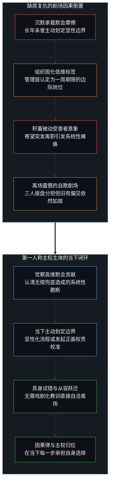
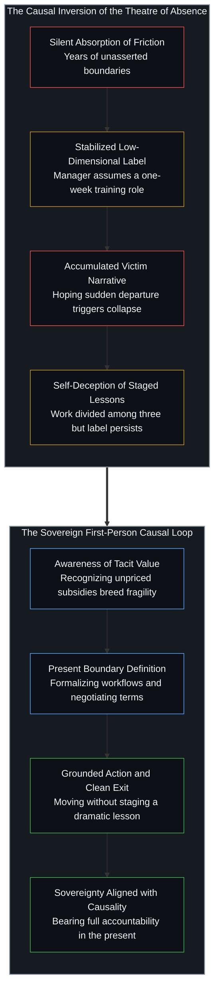

# 前台的寓言与缺席的因果倒置 / The Receptionist Parable and the Causal Inversion of Absence

*借离去后的混乱证明价值，是将十一年沉默维持的接口推诿于他人。 / Staging worth through post-departure chaos inverts causality, projecting a decade of silent compliance onto others.*

社交网络上长久流传着一个引发广泛共鸣的职场故事：一位在前台工作了十一年的老员工提出离职，主管甚至没有抬头多看一眼，冷淡地表示任何人都可以在一周内学会接听电话。该员工默默整理好包含联系人、排期表与大量例外处理规则的交接文档并悄然离去；然而她走之后，整座办公室随即在无数未曾成文的默会知识前陷入停滞与慌乱。公司最终不得不将她原本的职责拆分给三个人共同承担，她在新去处获得了体面的职级认可，而旧主管多年后依然在公开场合将其贬称为“那个接电话的人”。这则叙事之所以经久不衰，是因为它精准触动了人们代入无名奉献者的集体心理，读者渴望借由缺席引发的震荡来反向确证自身的隐性价值，然而这种解读在因果逻辑上恰恰本末倒置。

A workplace narrative circulates endlessly across digital networks, striking a powerful chord of collective identification: after eleven years of service, a receptionist hands in her notice, only for her manager to dismiss the departure without looking up, declaring that anyone can be trained to answer phones in a week. She compiles a meticulous handover dossier detailing contacts, scheduling quirks, and administrative exceptions before stepping away; yet once she is gone, the entire office stumbles over reservoirs of tacit knowledge that never made it onto paper. The organization eventually divides her former responsibilities among three individuals, she secures a far superior title elsewhere, while her former manager stubbornly persists in referring to her as the person who answered phones. This tale spreads because it invites easy sympathy with the unseen contributor, prompting readers to imagine that their own silent labor will be similarly validated through downstream collapse, yet that reading gets the underlying causality backwards.

## 一、 缺席的剧场与受害者叙事的双重安慰 / 1. The Theatre of Absence and the Dual Consolation of the Victim Narrative

剖析大众对这则寓言的狂热沉迷，必须看清其背后廉价的情绪代偿机制。受众在阅读此类情节时，极易迅速将自我投射为那位任劳任怨却受尽漠视的主人公。这种投射提供了一种零成本的双重心理慰藉：一方面，受众在心智中享受到一种不可或缺的隐秘全能感，仿佛整个庞大体系的运转全赖自己一肩挑起；另一方面，他们又借由主管的粗暴定性坐实了自身受尽辜负的道德优势。将离职后的混乱视为自身重要性的证明，实际上是在脑海中搭建了一座单向度的复仇剧场。在这出剧场里，主体无需在此时此刻付出任何真实的博弈代价，仅凭退场与缺席，就能在想象中完成对傲慢系统的反戈一击。

然而，寄望于离开后的混乱来倒逼外部认可，是一种极其脆弱的认知滞后。一个对自身价值拥有自洽确认的主权心智，并不会依靠十一年压抑的沉默来换取一出充满戏剧张力的离场大戏。他们不需要通过让旧办公室陷入瘫痪来证明自己的不可替代，当环境的反馈与自身的承载产生结构性脱节时，主权者的第一反应是直接校准或者抽身离去。将系统瘫痪幻想为隐性贡献的迟到显形，不过是那些长年回避正面博弈的人在事后为自己炮制的自欺安慰。正如我们在[“普通人视角”的解释陷阱](../the-explanatory-trap-of-the-ordinary-perspective/)中所辨明的，大众叙事热衷于将个体的退缩与沉默包装为悲壮的隐忍，借由集体合谋的受害者叙事来回避真实的行动责任。大多数团队在经历短暂的震荡之后，都会通过分工重组与冗余补偿逐步恢复秩序。离职带来的长期困扰，多半只是同事们对旧有协作惯性的情感依赖，而非系统在物理层面上丧失了继续运转的可能。

Dissecting the collective fascination with this parable requires exposing the cheap emotional compensation operating beneath it. Readers examining such anecdotes swiftly project themselves into the figure of the diligent yet unappreciated contributor. This identification yields an effortless dual consolation: on one hand, the ego luxuriates in a private fantasy of indispensability, imagining the entire institutional apparatus leans upon its invisible shoulder; on the other hand, the manager's crude dismissal cements a righteous moral superiority of being perpetually wronged. Viewing post-departure turmoil as ultimate vindication stages a one-dimensional theatre of revenge in the mind. Within this theatre, the agent incurs zero real-time bargaining costs, expecting mere withdrawal and absence to deliver a crushing blow against an arrogant system.

Counting on the shock after departure to force retrospective recognition is a fragile form of cognitive lag. Sovereign minds confident in their operational value do not endure eleven years of suppressed silence merely to orchestrate a dramatic exit. They feel no compulsion to paralyze an office to demonstrate their worth; when systemic feedback diverges irreconcilably from their actual contribution, sovereign agents renegotiate immediately or depart without theatrical delay. Imagining that administrative chaos retroactively illuminates invisible labor is a consoling rationalization for those who evaded confrontation while still present. As illuminated in [The Explanatory Trap of the Ordinary Perspective](../the-explanatory-trap-of-the-ordinary-perspective/), popular narratives routinely romanticize passivity and silence as tragic endurance, using collective victimhood to duck the friction of direct agency. Following a brief period of surprise, most organizations adapt through reallocation and structural redundancy. Prolonged disruption reflects emotional attachment to familiar habits rather than an existential inability to function without the departed individual.

## 二、 沉默的接口与组织低维投影的形成 / 2. The Silent Interface and the Stabilization of Low-Dimensional Projections

如果顺着时间的因果链条向源头追溯，真正确立了这套失衡契约的始作俑者，恰恰是那位明知自身真实贡献却选择维持了十一年沉默的员工本人。组织作为一个需要控制信息处理开销的宏观耗散系统，必然依靠高度压缩的低维标签与标准化接口来维持运转。在管理者的认知带宽中，岗位描述与职级分类本就是为了抹去个体的高维复杂度而设立的实用工具。当一个人在长达十一年的时间跨度里，持续以“前台”的名义承接海量的默会协调、人际润滑与突发例外，却从未在显性契约中为这部分高维摩擦索求边界重构时，她向外部系统呈现的客观接口就固定为了“一周即可培训上手的前台”。

主管在离职时刻所展现出的冷漠与轻视，并非一次突如其来的认知失明，而是他在漫长的十一年里顺应对方所主动维系的交互界面所形成的必然模型。正如我们在[任务的代理与后果的不可让渡](../the-delegation-of-the-task-and-the-inalienability-of-consequences/)与[知识问题与代理的幻觉](../the-knowledge-problem-and-the-illusion-of-delegation/)中所揭示的，默会知识之所以难以代理，是因为它深深嵌入在具体行动者的具身经验之中；然而，若行动者将这种不可替代的默会负担作为无偿赠予的暗中补贴，外部系统便会毫无愧色地将这种补贴视为理所应当的均质背景。外部组织始终是在被动接受个体所划定的交互界面。你在十一年间默许了什么样的低维投影，系统就会以什么样的低维标签向你结算反馈。若自己主动放弃了在每一个当下重新划定边界的权利，转而指责外部观察者未能看穿表象之下的深厚奉献，这无疑是将自身第一人称的因果责任推诿于他人的认知视界。

Tracing the causal sequence to its inception reveals that the architect of this degraded arrangement was the employee who possessed full awareness of her actual workload yet chose silence for eleven years. An organization functions as a macroscopic dissipative system that must economize cognitive bandwidth, depending unavoidably on compressed low-dimensional labels and standardized interfaces. For administrative managers, job descriptions and wage classifications serve as practical instruments designed precisely to discard individual complexity. When an individual spends over a decade absorbing vast volumes of tacit coordination, schedule arbitration, and edge-case resolution under the formal title of receptionist without asserting explicit boundaries, the operational interface presented to the enterprise stabilizes firmly as a trivial position trainable within seven days.

The manager's callous dismissal upon her resignation was not an unexpected epistemic collapse; it was the inevitable model formed by interacting with the exact interface the employee sustained. As explored in [The Delegation of the Task and the Inalienability of Consequences](../the-delegation-of-the-task-and-the-inalienability-of-consequences/) and [The Knowledge Problem and the Illusion of Delegation](../the-knowledge-problem-and-the-illusion-of-delegation/), tacit competence resists formal delegation because it remains embedded in lived, situated practice. Yet when an actor provides this irreplaceable friction absorption as an unpriced, silent subsidy, the surrounding system treats that subsidy as an invariant background condition. Organizations accept the operational terms individuals allow to stand. The low-dimensional projection an agent tolerates across eleven years dictates the low-dimensional compensation returned by the structure. Surrendering the agency to redraw boundaries while blaming external observers for failing to intuit unstated labor projects personal first-person causality outward.

## 三、 离场震慑的自欺与组织自适应的迟钝性 / 3. The Self-Deception of Staged Lessons and Organizational Adaptation

以为自己的离去能够对旧系统施加持久的精神震慑，是观察者在自我意象滞后中所产生的认知错觉。在故事的后半段，虽然公司不得不调动三个人来分担原有的工作，但那位前任主管在多年后依然固执地将她称为“那个接电话的人”。这一细节极具讽刺意味，却极为真实地揭示了不同心智之间因果认知的不可穿透性。行动者在心智内部构建的壮烈离场，在对方的世界模型中可能只是一次需要填补的局部流程中断。对方的大脑从未建立起将“三个人接盘”与“前任不可替代”直接挂钩的认知突触，外部观察者依然会将混乱归因于交接文档的不完整、新人的生疏，或是行政流程的技术瑕疵。

跨越主体界面的因果认知无法强行灌输。你在离场时即便留下一份写满规则的厚重文件，也不会自动换来对方灵魂深处的悔悟与认同。正如在[心智无法逃离自身](../one-cannot-escape-ones-own-mind/)与[契约的因果倒置](../the-causal-inversion-of-partnership/)中所阐明的，将自我确证的希望寄托在他人评价的逆转之上，实质上是将自身的存在原点拱手让渡给了外部投射。组织作为一个非人格化的自适应网络，其要务始终是在摩擦中自我缝合与继续前行。旧员工的离开固然制造了局部的摩擦阻力，但系统很快便会以增加人力、重构审批、甚至容忍效率下滑为代价，将这个缺口抚平并继续运作。等待迟到的道歉或期待旧主的追悔，只是将生命宝贵的认知算力虚掷在对往昔镜像的徒劳凝视之中。

Believing that one's departure will inflict a lasting psychological lesson upon an institutional structure is an optical illusion born of Image lag. In the resolution of the parable, even after the company distributes her duties across three employees, the former manager continues to designate her as the person who answered phones. This detail is piercing in its irony, exposing the structural impermeability separating distinct minds. The dramatic departure an employee crafts within internal consciousness registers within the manager's model merely as a temporary operational hiccup requiring administrative triage. The manager's neural architecture generates no spontaneous link connecting three replacements to an admission of personal blindness; external observers routinely attribute the scramble to incomplete handover files, junior incompetence, or flawed procedures.

Causal interpretations cannot be injected across sovereign boundaries. Leaving a thick handover binder filled with exceptions does not summon contrition from an employer. As demonstrated in [One Cannot Escape One's Own Mind](../one-cannot-escape-ones-own-mind/) and [The Causal Inversion of Partnership](../the-causal-inversion-of-partnership/), anchoring self-worth to the eventual re-evaluation of external parties abdicates one's existential origin to third-person projections. An organization operates as an impersonal adaptive network whose imperative is absorbing friction and forging ahead. A departure unquestionably induces local turbulence, but the collective system swiftly patches the breach through added headcount, revised workflows, or accepted performance dips. Waiting for tardy apologies or fantasizing about an office longing for one's return squanders sovereign cognitive capacity on a frozen mirror.

## 四、 主权行动的当下性与边界的主动划定 / 4. The Immediacy of Sovereign Action and the Active Drawing of Boundaries

打破这种缺席神话的唯一路径，是将因果的锚点重新收回第一人称的当下切片。在十一年漫长的岁月里，改变处境的通道从未关闭过一天。行动者既可以在日常工作中主动将隐性的默会流程显性化，将处理例外的无形经验固化为可评估的制度资产；也可以据此要求重新核定岗位权责，索取匹配高维贡献的薪酬与头衔；更可以在察觉到体制迟钝与估值扭曲时，从容迈出脚步，前往已经具备共鸣与合理定价的新天地。显形价值的路径成百上千，但这位员工在十一年间一条都没有选择。这种漫长的停滞并不是别无选择的悲剧，而是心智行使其主权自由去选择“不作选择”所必然承受的因果沉淀。

正如我们在[抉择本身并不沉重](../choice-itself-has-no-inherent-weight/)中所剖析的，真实的行动并不需要等待一次性全盘翻盘的终极奇迹，而是始于当下每一次微小边界的主动确立。真正的个体主权，表现为随时在真实的摩擦中给出清晰的界线：什么是我的职责，什么是超出边界的无偿兜底；如果系统拒绝承认高维价值，我便收回这部分溢出的注意力，或者清醒地结清账目抽身离场。这种离场不是为了给谁上一堂震撼教育课，不是为了等待后任将事情搞砸来反衬自己的英明，而是为了让生命自身与真实的因果闭环重新对齐。当你不再依赖缺席后的混乱来求索价值的证明时，你的存在便在每一个从容落下的脚步中获得了坚实的自洽。

Dismantling the myth of absence requires reclaiming the causal anchor in the immediate slice of the present. Across eleven years, pathways to alter the equation were never closed. The contributor possessed continuous opportunities to articulate tacit workflows into visible institutional capital, codify informal exception handling, demand revised job specifications commensurate with real output, or depart for an environment that already reflected appropriate valuation. Countless routes exist to make value explicit, yet she selected none of them for more than a decade. That prolonged paralysis was not a tragedy of nonexistent alternatives; it was the empirical residue of sovereign consciousness exercising its freedom to choose non-action.

As analyzed in [Choice Itself Has No Inherent Weight](../choice-itself-has-no-inherent-weight/), authentic agency does not wait for a theatrical reckoning; it proceeds through the deliberate drawing of boundaries in the immediate present. Individual sovereignty asserts unambiguous demarcations amid lived friction: defining what constitutes formal duty, refusing unpriced subsidies that mask institutional defects, and withdrawing surplus attention or departing cleanly when recognition is denied. Such departure does not aim to stage an instructional drama or await successor failures to validate past stewardship; it simply restores alignment between action and consequence. When an agent ceases relying on post-departure chaos to certify personal value, life regains quiet coherence with every stride taken on its own ground.
