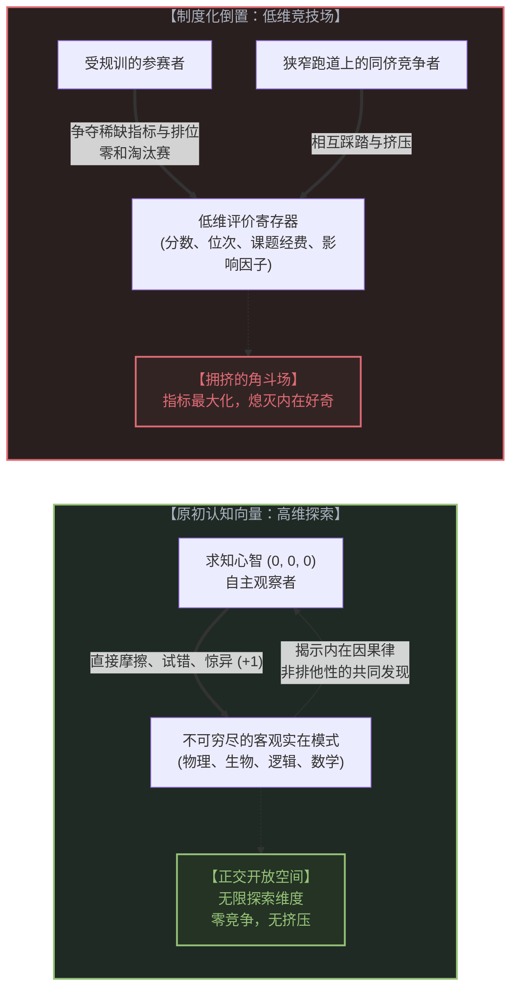
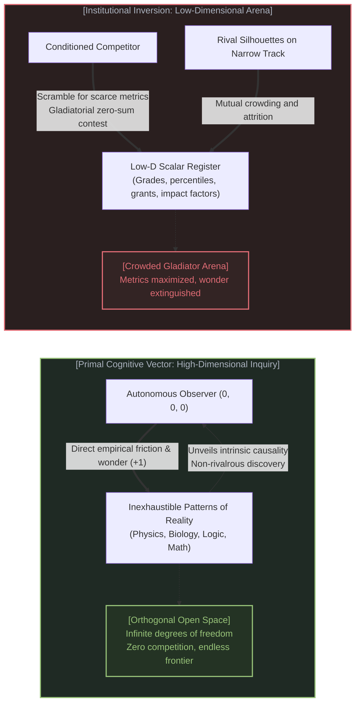
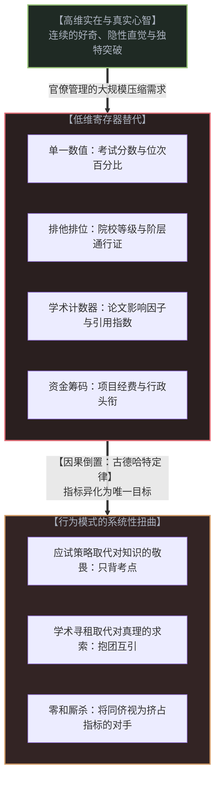
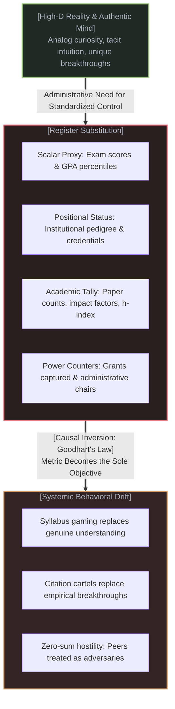
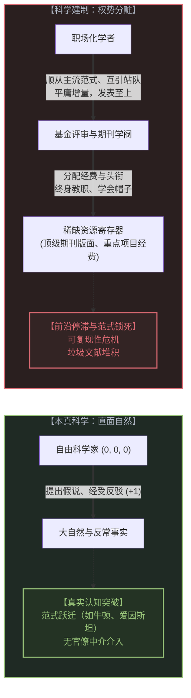
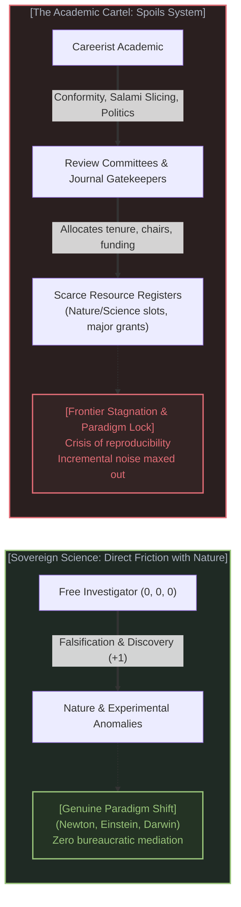
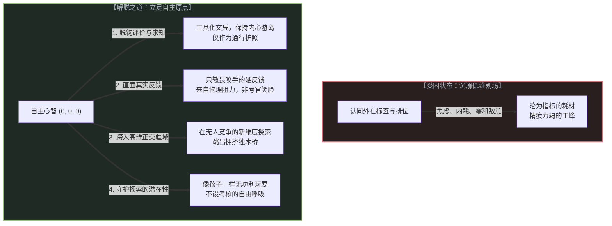
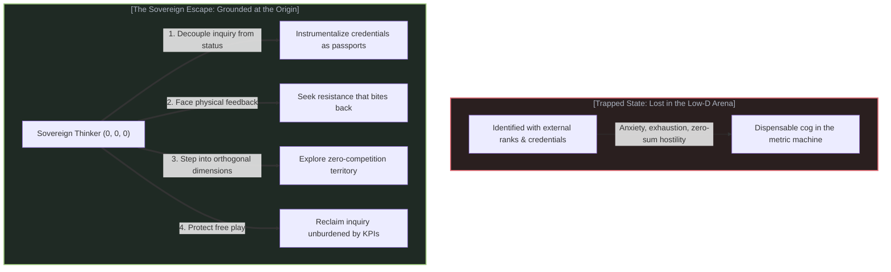

# 教育与科学的倒置：从理解实在的无限，到有限博弈的规训 / The Inversion of Education and Science: From Grasping Reality to the Zero-Sum Arena

*教育本是对实在模式的探索，却在制度化中沦为同侪竞争的淘汰赛；科学发现本是对真理的无畏追寻，却在建制化中异化为争夺声望、经费与权力的排位赛。当对高维实在的主动探求，被偷换为对低维指标的被动追逐，人类最崇高的认知之翼，便成了禁锢心智的锁链。 / Education was born as an open pursuit of the patterns of reality, yet institutionalization has collapsed it into a gladiatorial contest of peer competition. Scientific discovery was born as an uncompromised quest for truth, yet academic bureaucratization has degraded it into a zero-sum scramble for prestige, funding, and administrative power. When high-dimensional exploration of the living territory is replaced by the pursuit of low-dimensional metrics, humanity's highest cognitive wings are reforged into shackles.*

---

## 一、 认知的初衷：与不可穷尽实在的直接碰撞 / 1. The Primal Origin: Direct Friction with Inexhaustible Reality

在人类心智的源头处，学习与探索从来不是为了战胜另一个人。

观察一个尚未被现代规训系统塑形的孩子：当他蹲在泥地上注视一只蚂蚁搬运草籽，或者当他反复将积木搭高并静待其坍塌时，他的心智正处于一种天然的认知张力中。他所面对的唯一对象，是眼前不可穷尽的物理实在。重力、摩擦力、结构平衡、生命节律——这些是客观宇宙内在的秩序模式。这种探索不附带评级，没有及格线，更无需向任何监考官证明什么。心智在每一次真实的试错中感知到实在的坚固阻力，并在理解模式的瞬间获得巨大的内在奖赏。

这同样是科学发现的原始火种。无论是在修道院花园里记录豌豆性状的孟德尔，还是在专利局抽屉边推演电磁场对称性的爱因斯坦，早期探索者的第一人称观察点 (0, 0, 0)，始终直接朝向浩瀚的宇宙。他们与客观实在之间没有中介。物理现实是唯一的裁判，因果律是唯一的法则。



从观察者几何学来看，客观实在具有无限的自由度与深邃的维度。在未被制度收割的自然状态下，认知的空间广阔无垠：
* 一万个求知者可以各自奔赴一万个互不重叠的研究方向；
* 一个人对流体力学湍流模式的破解，不但不会挤压另一个人对神经突触传递的观察，反而为整个人类认知图景增添了新的正交维度；
* **求知是天然非排他性的。** 实在容得下无数独立的探索者并行漫步，没有任何两个人需要为了“谁拥有更多宇宙规律”而拔刀相向。

然而，一旦这些追求遭遇人类文明的大规模组织化，一场深刻的因果倒置便不可逆转地降临了。

---

At the primal source of human consciousness, learning and discovery were never designed to conquer another person.

Watch a child who has not yet been processed by the machinery of formal schooling: when she crouches in the dirt to follow an ant carrying a seed, or when she stacks wooden blocks only to watch them tumble under gravity, her mind vibrates in direct contact with reality. Her sole interlocutor is the inexhaustible physical world. Gravity, friction, structural equilibrium, metabolic rhythm—these are the intrinsic patterns of reality. There are no rubrics attached to this inquiry, no passing percentiles, and no proctors demanding justification. The mind feels the unyielding resistance of the territory, and in decoding its subtle contours, receives an intrinsic biological thrill.

This was likewise the primal spark of scientific discovery. Whether it was Gregor Mendel counting wrinkled peas in a quiet monastery garden or Albert Einstein deducing the symmetries of electrodynamics beside a Swiss patent clerk's desk, the first-person observer point (0, 0, 0) faced outward toward the raw cosmos. No administrative committee stood between the investigator and the empirical fact. Physical reality was the only judge; causality was the only law.



From the vantage point of observer geometry, the territory of reality possesses infinite degrees of freedom. In this natural state, the cognitive landscape is boundless:
* Ten thousand sovereign explorers can set out along ten thousand orthogonal vectors without their paths ever intersecting;
* One thinker's insight into fluid turbulence does not crowd out another's insight into synaptic vesicle fusion; rather, it expands the collective dimensional field;
* **True inquiry is fundamentally non-rivalrous.** The high-dimensional territory has infinite room for parallel travelers. No two souls need ever draw weapons over who possesses a larger share of the laws of nature.

Yet the moment this boundless exploration encountered mass institutionalization, a structural inversion occurred.

---

## 二、 制度化与低维寄存器的强制替代 / 2. Institutionalization and the Tyranny of the Low-Dimensional Register

为什么当教育与科学从小范围的个体探索转变为现代大规模体制时，异化几乎是必然的？

答案隐藏在**管理学与信息压缩的底层物理限制**之中。

任何大规模官僚系统要维系运转，都必须实现跨地域、跨周期的标准化控制。然而，官僚系统既看不见一个孩子眼中那一闪而过的好奇火花，也无法度量一个学者在深夜推导公式时的精神诚实。高维的心智共鸣、隐性经验以及对实在模式的深刻洞见，是连续、非离散、且极度依赖个体语境的，它们根本无法被打包录入行政管理表格。



为了解决这一可治理性危机，制度化必须做出一个致命的操作：**用低维标量寄存器，强行替代高维真实。**

1. **在教育中**：学生对现实模式的领会，被压缩成了一张考卷上的卷面得分；独特的思维轨迹与人格发育，被降维成全校或全地区的位次百分比。
2. **在科学中**：对未知自然规律的探勘，被压缩成了论文发表数量、期刊影响因子、以及同行引用的计票器；真理的深浅，被降维成了研究经费的账面金额与院士头衔的阶梯。

这就是我们在整个体系中反复揭示的**“寄存器替代”**：制度原本发明指标是为了作为实在的粗糙影子，但在运转过程中，机构却把影子当成了唯一的实在。

一旦这一替代完成，古德哈特定律便不可阻挡地降临：**当一个指标变成目标本身时，它就不再是一个好指标。** 更糟糕的是，因为所有低维标量（排名第一、顶级期刊发表名额、国家科研基金配额）都是人为设定的刚性稀缺品，原本无限展开的高维探索空间，瞬间被挤压进了一条极其狭窄的一维独木桥。

---

Why is alienation the structural outcome when education and science transition from individual pursuit into modern mass institutions?

The answer lies in the **physical limits of bureaucratic scaling and informational compression**.

For any large-scale administrative apparatus to operate, it must enforce standardized, repeatable coordination across vast populations and time spans. However, a bureaucracy cannot register the fleeting glimmer of wonder in a child's eyes, nor can it quantify the intellectual integrity of a researcher working in solitary silence. High-dimensional cognitive resonance, tacit craftsmanship, and nuanced breakthroughs are analog, continuous, and context-dependent. They cannot be filed into a centralized administrative spreadsheet.



To resolve this crisis of legibility, the institution executes a fatal reduction: **it forcibly substitutes a low-dimensional scalar register for the high-dimensional living territory.**

1. **In Education**: A student's organic grasp of reality's patterns is compressed into a standardized test score; an idiosyncratic developmental trajectory is flattened into a single scalar rank (GPA and class percentile).
2. **In Science**: The bold probing of uncharted natural anomalies is collapsed into paper counts, journal impact factors (JIF), and citation tallies; the weight of empirical truth is flattened into grant dollars captured and administrative chairs occupied.

This is the classic **Register Substitution** documented throughout the Not-a-TOE series: a metric originally devised as an administrative footprint of inquiry ends up usurping the territory. The institution mistakes its own ledger for reality.

Once this substitution crystallizes, Goodhart's Law bites with vicious force: **when a measure becomes a target, it ceases to be a good measure.** Worse, because low-dimensional scalar registers (rank #1, scarce journal slots, capped grant pools) are inherently positional and zero-sum, an expansive multi-dimensional field is suddenly funneled into a suffocating, one-dimensional bottleneck.

---

## 三、 教育的倒置：从探索模式到角斗赛场 / 3. The Inversion of Education: From Decoding Patterns to the Arena

当受教育的目标从“搞懂自然模式”异化为“在寄存器中胜出”时，教育发生了一场触目惊心的质变。

原本，数学是为了描摹时空与变换的优美语言，物理是为了破译物质与能量的舞蹈，历史是为了洞察人类演化的复杂节律。每个学科都是一扇通往高维实在的窗户。但在倒置的应试竞技场中，**所有学科都被去除了其背后的物理血肉，抽干成了高度程式化的解题技巧。**

在这样的流水线上，一个学生若是对一道题背后的深层物理机制产生了好奇，停下来探究三个小时，他在制度评价中不但得不到奖赏，反而会遭到无情的惩罚——因为他浪费了刷完十套模拟卷的时间。好奇心在流水线中成了负资产；对知识的真正热爱成了导致排名落后的致命风险。

```
【真实的学习】
心智 (0, 0, 0)  ======>  [物理/生物/逻辑模式]  ======>  认知边界向外扩展 (+1)
(目标：理解客观规律；空间：无限开放；关系：非零和与互为启发)

---------------------------------------------------------------------------------

【倒置的竞技】
学生甲 (排位赛)  <----争夺单一指标 (分数/名额)---->  学生乙 (排位赛)
                       ▲
                       │ (背诵标准答案、优化答题模板)
              [低维评分寄存器 / 考卷]
(目标：压制同侪；空间：一维挤压；关系：你死我活的零和博弈)
```

更具悲剧色彩的是人际关系的坍塌。
* 在本真的探索中，同侪是共同前行的旅伴，各自从不同角度带回对世界的发现；
* 但在低维竞技场中，**每一个同侪都被强制重塑成了掠夺你位次的潜在敌人。**

分数的本质是相对排位。在正态分布曲线与严苛录取配额的规训下，多一个人考高分，就意味着你被挤下悬崖的风险增加一分。原本可以共同徜徉在无限实在中的心智，被迫在狭窄的评分走廊里互相厮杀。孩子们不再为理解了电磁感应的优美而欢呼雀跃，他们只在确认自己的分数超过了同桌三点五分时，才感到短暂的虚荣与喘息。

教育原本是为了赋予心智以翱翔的翅膀，最终却演变成了一场**把野生雄鹰修剪成能够精准填涂机读卡的标准化家禽**的残酷工程。

---

When the purpose of education mutates from "understanding the patterns of reality" to "outranking peers on the institutional register," education undergoes a grotesque metamorphosis.

Mathematics was discovered as a breathtaking language for describing geometry, transformation, and symmetry; physics as an inquiry into the choreography of matter and energy; history as an exploration of human causal trajectories. Each discipline was an open window onto high-dimensional reality. Yet within the inverted arena of standardized competition, **every discipline is stripped of its physical vitality, dehydrated into a catalog of sterile exam tricks.**

On this conveyor belt, if a student becomes fascinated by the deeper physical meaning behind an equation and pauses for three hours to explore it, the system does not reward her—it punishes her without mercy. She has squandered precious time that should have been spent grinding ten identical practice drills. In this regime, intrinsic curiosity becomes an active liability; a genuine love of truth becomes an unacceptable drag on rank optimization.

```
[Genuine Learning]
Mind (0, 0, 0)  ======>  [Physical / Biological / Logical Patterns]  ======>  Boundary Expands (+1)
(Goal: Understand objective laws; Space: Boundless; Relation: Non-rivalrous & mutually inspiring)

---------------------------------------------------------------------------------

[Inverted Competition]
Student A (Rank)  <----Contesting Scarce Metric (Points/Seats)---->  Student B (Rank)
                       ▲
                       │ (Memorizing answers, gaming rubrics)
              [Low-Dimensional Scalar Register / Exam]
(Goal: Outrank peers; Space: 1D corridor; Relation: Destructive zero-sum game)
```

The tragedy deepens in the degradation of human solidarity:
* In sovereign inquiry, peers are fellow wayfarers, each reporting back distinct facets of the unbounded frontier;
* In the institutional arena, **every peer is mechanically reframed as an adversary competing for your seat.**

Grading systems rely on bell curves and rigid percentile quotas. In that game, another student's brilliant performance increases the probability that you will be discarded. Minds that could have roamed across infinite dimensions are forcibly compressed into a one-dimensional ranking corridor. Students no longer weep with joy upon grasping the sublime symmetry of Maxwell's equations; they experience relief only when learning that their score is three points higher than the classmate beside them.

Education was conceived to give the human mind wings; in its institutional inversion, it has become an industrial mill designed to **clip the wings of sovereign eagles so they fit into the cages of standardized testing**.

---

## 四、 科学建制的蜕变：从探触真理到争夺声望与权力 / 4. The Degeneration of Science: From Truth to Prestige, Funding, and Cartels

如果说基础教育的倒置牺牲的是孩子们的童年与灵性，那么科学建制的蜕变，则直接让整个人类文明在认知前沿的跃迁陷入停滞。

现代科学共同体诞生之初，其核心伦理是皇家学会的格言：“以事实为证”。科学之所以具有颠覆性的力量，就在于它构建了一种机制：**不论你的社会地位多显赫，不论你的门阀有多强大，只要自然界抛出了一个相反的实验反例，你的理论就必须被修正或抛弃。**

然而，当科学演变为一个依赖政府巨额拨款、高校教职评聘与产业基金支持的庞大官僚建制时，这场游戏的方向再次被全面翻转。



审视今天高度建制化的学术机器，其运作逻辑已经与探寻真理严重脱钩：

### 1. 论文生产的计件工制
在“不发表就出局”的紧箍咒下，研究人员被异化为了撰写论文的劳工。为了最大化产出数量，学者们被迫将一个完整的重大课题拆解为数篇平庸琐碎的切片论文。学术界充斥着数以百万计无人阅读、无人复现、毫无因果重量的垃圾文献。

### 2. 规避风险与对异端的无情绞杀
颠覆性的理论突破，在其诞生初期必然呈现为对既有范式的破坏。然而，在以“同行评议”和委员会匿名投票为核心的基金评审体制下，**决定一个项目能否拿到钱的，恰恰是被这个项目潜在挑战的权威专家。** 
其结果是显而易见的：只有那些四平八稳、修修补补、规避触怒权威的增量研究能够顺利过审；而那些具有真正颠覆潜力、试图重构地基的异端思想，在起步阶段就会因为缺乏经费而被窒息。

### 3. 引用圈子与声望寻租
学者们将大量精力耗费在拉帮结派、互推引用、在顶级会议上互致吹捧，以此堆叠自己的学术引用指数。声望变成了可以兑现为巨额科研基金、企业咨询合同、乃至行政权力的金融通货。科学从一种向未知的献身，蜕变成了在学术行会内部争夺地盘的分肥体制。

大自然本不在乎任何学者的头衔与影响因子；可在建制内部，没有头衔的学者连走进实验室的权利都会被剥夺。**真理向着虚空沉默，而权柄在走廊里喧哗。**

---

If the inversion of basic schooling sacrifices the wonder and innocence of childhood, the degeneration of institutional science directly paralyzes humanity's capacity to leap across cognitive frontiers.

At the founding of the modern scientific community, its guiding ethos was captured in the Royal Society's motto: *Nullius in verba* ("Take nobody's word for it"). The revolutionary power of science lay in a singular principle: **no matter how decorated your pedigree or how entrenched your authority, the moment nature throws an experimental anomaly against your hypothesis, your theory must yield.**

Yet when scientific research grew into a gargantuan bureaucratic complex subsidized by state appropriations, university tenure lines, and industrial sponsorships, the arrow of intentionality flipped.



Examine the operating machinery of today's academic enterprise: its daily dynamics have largely divorced themselves from the quest for natural truth:

### 1. The Piecework Paper Mill
Under the sword of "Publish or Perish," researchers are degraded into piecework laborers turning out manuscripts. To maximize count, scholars are incentivized to slice single coherent inquiries into multiple trivial, incremental publications (salami slicing). The literature groans under millions of papers that are never read, never replicated, and devoid of causal weight.

### 2. Risk-Aversion and the Purge of Heterodoxy
True foundational breakthroughs begin by puncturing accepted orthodoxies. Yet under an anonymous grant-review system governed by peer consensus, **the survival of a proposal rests on the signatures of the very establishment whose intellectual monopoly it threatens.**
The outcome is mechanical: safe, conformist, incremental tweaks to existing paradigms glide through with funding; while radical, foundational revisions of base assumptions are starved of capital before they can draw their first breath.

### 3. Citation Cartels and Prestige Rent-Seeking
Academics invest enormous energy into reciprocal citation cliques, networking inside review committees, and mutual backscratching to inflate their metrics. Prestige becomes an asset class convertible into multi-million-dollar grants, corporate board seats, and departmental fiefdoms. Science ceases to be an unvarnished encounter with the unknown; it becomes an academic trade union running an internal spoils system.

Nature cares nothing for impact factors or university endowments; yet inside the institution, a researcher lacking these tokens is barred from the laboratory bench. **Truth stands silent in the open field, while power negotiates in the corridors.**

---

## 五、 破局之道：重建心智与实在的直接回路 / 5. The Sovereign Escape: Restoring Direct Contact with Reality

当制度化的引力将教育与科学拉入低维角斗场时，一个清醒的个体应当如何自处？

我们无法凭空摧毁庞大的社会建制，但我们拥有自主的因果裁决权。我们可以主动切断内心的规训链条，在个人行动的微观层面上完成自我救赎。



要重建心智与实在之间的直接回路，我们需要践行四项原则：

### 1. 工具化文凭，解耦内在价值
把一切外部的证书、文凭、考核和职级，仅仅视为通行于官僚社会这一特定沙盒内部的“行政护照”。
* 它们是与外部系统交互的技术接口，仅此而已；
* **千万不要把你灵魂的价值，寄托在他人打出的分数上。**
只要你在内心深处知道探索模式的真正乐趣，你就不会把自己的智力自尊押在试卷或影响因子的高低之上。通过考核只是例行公事，直面实在才是终生事业。

### 2. 寻求能“咬手”的实在反馈
判断一个人是在参与真实的探索还是在玩虚假的排位赛，有一个极简的标准：**他的反馈来自于自然的物理阻力，还是来自于考官的笑脸？**
* 机器能否运转、代码能否跑通、疾病能否被治愈、数学推导在逻辑上是否无懈可击——这些是客观实在的硬反馈，自然并不配合你的表演；
* 导师是否高兴、基金评委是否满意、期末排名是否提升——这些是低维行政系统的软反馈，容易通过迎合与妥协来操纵。
多把时间花在能对你产生“物理反咬”的事情上，那才是让你真正增生因果力量的地方。

### 3. 走出低维独木桥，走向高维正交疆域
如果一条狭窄的跑道上已经挤满了一万个人在为争夺前三名而头破血流，最明智的策略决不是拼上性命去内卷抢道，而是**直接转向一个垂直的正交维度**。
正如我们在[阴影与无限](../the-shadow-and-the-infinite/)中所指出的，现实有着无限的维度。当他人聚焦于在既有框架内微调参数、比拼发文速度时，你可以去连接两个看似无关的领域，去探索那些被主流视线忽略的隐秘角落。在真正辽阔的未知疆野里，没有任何人和你竞争。

### 4. 守护认知的潜能：让探索回归无功利的游玩
正如我们在[理解的非对称性](../the-asymmetry-of-understanding/)中所论证的：**潜能一旦被扭曲为义务，就会瞬间闭锁。**
不要把求知变成对自己的沉重道德勒索。保留一块不被任何指标污染的秘密花园：在那里，你可以为了搞明白雨后泥土的气味而读一整天土壤微生物学，也可以为了推导一个优美的几何定理而熬夜到破晓。不为发表，不为变现，不为任何人的赞许，只为了那一刻，你的心智与宇宙深处的某种律动达成了瞬间的共鸣。

---

When the gravitational pull of institutionalization drags education and science into the low-dimensional arena, how does an autonomous observer live with integrity?

We cannot dissolve massive societal institutions overnight, but we retain sovereign causal agency at our own center. We can sever the mental leash, executing a quiet reclamation of our attention.



To restore direct contact between the mind and reality, we maintain four disciplines:

### 1. Instrumentalize Credentials, Decouple Inner Worth
Treat all external diplomas, grades, peer reviews, and titles merely as administrative passports required to navigate the institutional sandbox:
* They are pragmatic interfaces for social interoperability—nothing more;
* **Never entrust the sovereign worth of your mind to an examiner's scorecard.**
As long as you preserve the pristine thrill of grasping reality's patterns, you will never mortgage your self-respect to a transcript or an impact factor. Passing the evaluation is an administrative routine; facing the living territory is a lifelong calling.

### 2. Seek Friction That Bites Back
There is an unmistakable heuristic to distinguish genuine discovery from performative competition: **does your feedback stem from the unyielding resistance of reality, or from the arbitrary nod of an evaluator?**
* Whether an engine runs, whether code compiles, whether a disease is arrested, whether a mathematical proof stands without gap—these are the hard, unbribable reactions of nature;
* Whether an advisor smiles, whether a grant panel is flattered, whether a department chair awards praise—these are the malleable signals of a bureaucratic theater.
Invest your waking hours in domains that bite back. That is where authentic causal muscle is forged.

### 3. Step Orthogonally into High-Dimensional Space
When ten thousand competitors are trampling one another along a narrow one-dimensional path to seize the top slots, the highest wisdom is never to out-grind them—it is to **pivot cleanly into an orthogonal dimension**.
As shown in [The Shadow and the Infinite](../the-shadow-and-the-infinite/), reality possesses infinite degrees of freedom. While the crowd optimizes incremental parameters within an exhausted paradigm, you can synthesize two distant fields or investigate an anomaly dismissed by the mainstream. In the open wild of high-dimensional reality, there is zero competition.

### 4. Protect Inquiry as Free Play
As proven in [The Asymmetry of Understanding](../the-asymmetry-of-understanding/): **the moment an infinite potentiality is turned into an obligation, it closes.**
Never allow learning to degenerate into a joyless moral duty or a calculated career gamble. Guard a private clearing untouched by institutional metrics: spend an entire afternoon reading soil biology simply to understand the scent of rain on dry earth; stay awake until dawn deriving a geometric proof solely to witness its silent perfection. Do it without publishing, without monetizing, and without seeking applause—simply for that sacred second when your mind rings in harmonic unison with the bedrock of the world.

---

## 六、 结语：做实在的探险家，不做剧场的角斗士 / 6. Epilogue: Explorers of Reality, Not Gladiators of the Theater

人类文明最荒诞的讽刺，莫过于此：

我们建立起规模宏大的学校，本来是为了教导孩子理解天地的广阔，最终却把他们关在教室里，让他们为一个小数点后的名次终日惊惶；
我们筹措起数以亿计的科研巨资，本来是为了资助天才探寻真理的幽光，最终却把他们困在表格与会场中，逼迫他们为争夺声望与残羹冷炙而勾心斗角。

但那堵将你困在角斗场里的水泥墙，其实从来没有封顶。

只要你抬起头，那片孕育了开普勒、达尔文与法拉第的浩瀚苍穹，依然在那里静默地注视着你。引力波依然在以光速横穿群星，光子依然在双缝间编织着幽微的干涉条纹，生命的遗传密码依然在每一个细胞深处精密地流转。

实在从不需要评奖委员会的背书，真理更不依赖官僚体系的恩赐。

放下你手中的木剑与记分牌吧。走出那座充斥着喧嚣与踩踏的低维竞技场。向着辽阔、丰盛、不设门槛的客观实在迈步——做一名孤独而自由的探险家，与无限同行。

---

The supreme irony of human civilization is this:

We built monumental educational systems ostensibly to teach children the grandeur of the cosmos, only to herd them into fluorescent rooms where they tremble over fractions of a test percentile;
We amassed billions in scientific endowments ostensibly to empower minds to chase the mysteries of nature, only to ensnare them in grant applications and committee politics, forcing them to grovel for prestige and institutional scraps.

Yet the walls of the gladiatorial arena have no ceiling.

The moment you lift your gaze, the very same boundless cosmos that inspired Kepler, Darwin, and Faraday still stands watch in silent majesty. Gravitational waves still propagate at the speed of light across galaxies; photons still weave their delicate interference fringes through twin slits; the language of life still executes its ancient choreography inside every living cell.

Reality never required the endorsement of a prize committee; truth never depended on the charity of a bureaucratic board.

Drop the wooden sword and the paper scorecard. Walk cleanly out of that cramped, low-dimensional arena. Step forward into the open, bountiful, unpoliced territory of living reality—as a sovereign explorer, walking ahead with infinity.
