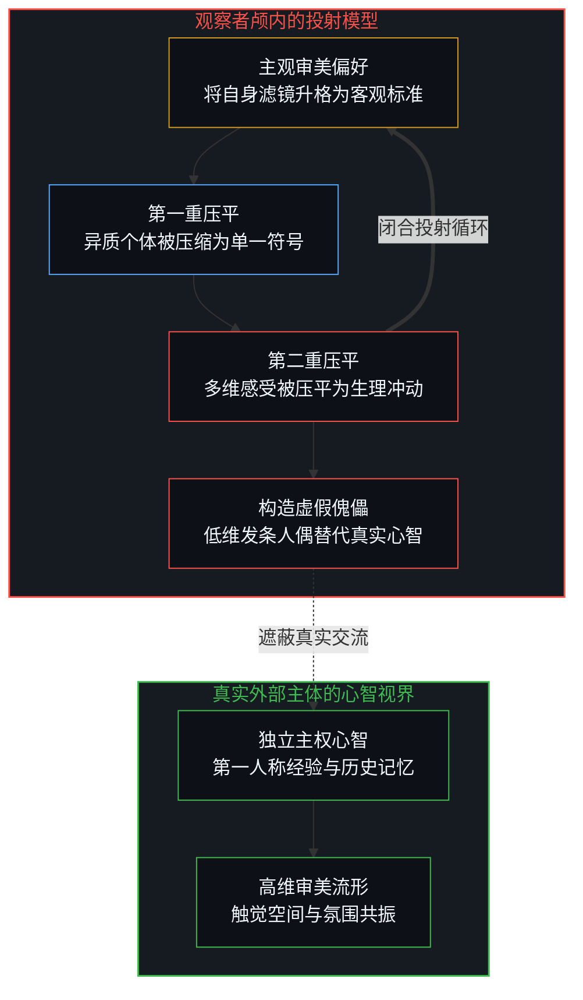
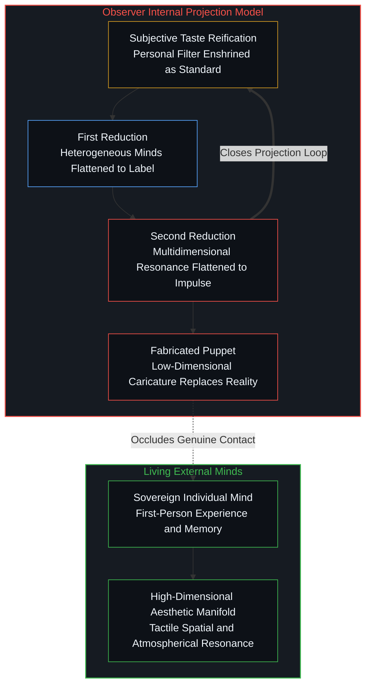
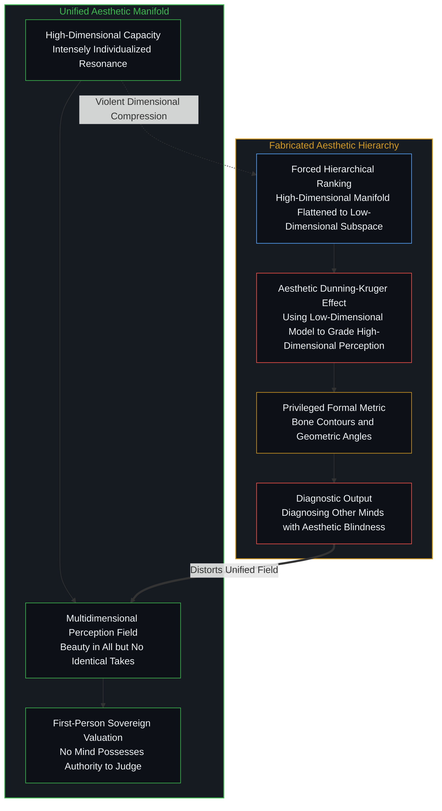
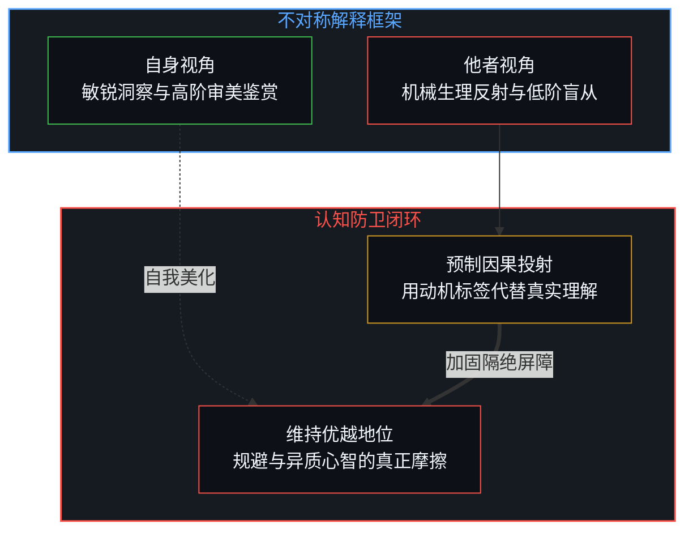
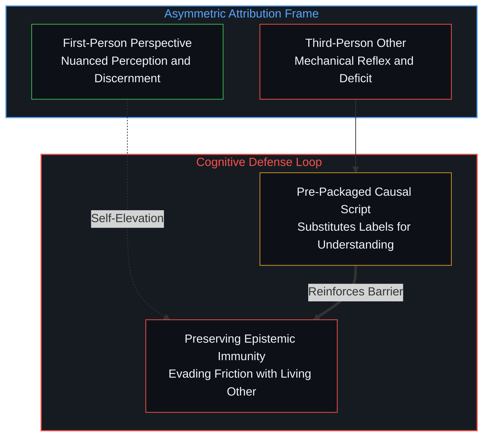
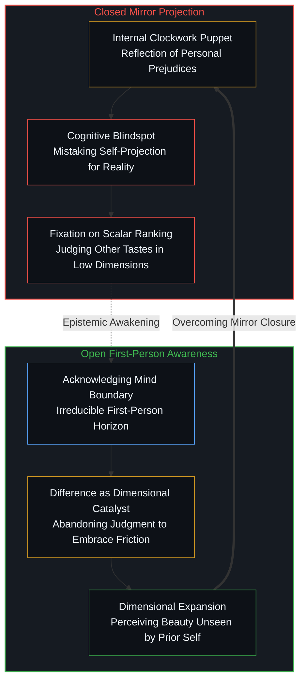

# 投射中的自画像 / The Self-Portrait in the Projection

*对他人审美的扁平诊断，折射的只是观察者自身脑中简化的模型与认知边界。 / Diagnosing another's aesthetic judgment reveals only the observer's own compressed mental model and cognitive boundary.*

当人们宣称看穿了某个群体的审美偏好，并断言其背后的驱动力无非是原始的欲望时，这种陈述表面上是对外部现实的描述，在认知论上却没有包含任何来自外部心智的有效信息。它展示的不是他人的感受机制，而是发言者在自身颅腔内部构造出的低维木偶。通过将复杂的审美反应压平为单一的冲动，观察者将自身的主观喜好封为客观的鉴赏标准，进而完成了对异质性的防御。这种向外投射的诊断机制，最终画出的全是对自身认知边界的精确描摹。

When an observer claims to have decoded the aesthetic preferences of another group, asserting that their choices stem from crude biological impulses, the statement appears to describe the external world while containing zero telemetry from living minds. It reveals nothing about how others actually perceive; instead, it exhibits a low-dimensional puppet assembled inside the speaker's own skull. By flattening intricate aesthetic judgments into a single motive, the observer reifies personal taste into an objective metric of discernment, erecting a psychological defense against genuine heterogeneity. This diagnostic projection ultimately paints an exact portrait of the observer's own cognitive boundary.

## 一、 傀儡归因与双重压平 / 1. Puppet Attribution and the Double Reduction

在日常关于审美的讨论中，一种极具代表性的论调常常被轻易接纳：断言男性的审美判断仅仅由生理冲动所支配，并列举对短发、健美体态或体重分布的反应作为论据，断定对方缺乏对美的鉴赏能力。这类分析看似在剖析外部客体的心理机制，实际上同时执行了两次急剧的压平操作。观察者首先将千差万别的异质个体压平为一个整齐划一的群体符号，随后又把人类包含视知觉、空间节奏、体态张力与历史记忆在内的丰富感受力，压平为单一维度的生理驱动。这两次压平并没有发生在被谈论的对象身上，它们全都发生在此类观点的持有者脑中。心智所感知的外部世界，本身就是内在世界的投射；这一不可缩减的界面，正是意识与自由意志运作的场域。我们借助感知来确立自身与他者的相对关系，而若将这种建构贬为单纯的偷懒，则不过是观察者遗忘自身观察立场的另一种便捷标签。真实的认知扭曲，发生在观察者暂时遗忘了自己才是感知主体的那一刻，从而将自身用于相对定位的投射模型，错认成了关于他者的客观真相。

In cultural discussions of aesthetics, a familiar trope is often accepted without scrutiny: asserting that an entire demographic's aesthetic capacity is subordinated to sexual appetite, citing reactions to pixie cuts, muscular builds, or body fat distribution as evidence of an inability to appreciate beauty. This move appears to analyze external subjects, but in fact executes a double reduction. The observer first collapses diverse, heterogeneous individuals into a monolithic collective label, and then collapses the full spectrum of sensory perception, spatial balance, kinetic presence, and historical resonance into a single biological drive. Neither reduction occurs within the minds of the observed; both unfold strictly across the observer's internal perceptual interface. Consciousness is fundamentally constituted by this act of projection: what an agent perceives as the external world is the projection of its inner model, an indispensable interface for navigating relative relations with others. To label this process as mere cognitive laziness would itself be a convenient categorization, committing the exact same error of forgetting the observing self. The distortion does not lie in the act of projecting—which is the very condition of conscious navigation—but in the observer temporarily forgetting that they are the one doing the perceiving, thereby mistaking a relative relational model for the objective reality of another mind.

## 二、 审美特权与客观化的自欺 / 2. Aesthetic Privilege and the Self-Deception of Objectivity

这种诊断最具讽刺意味之处，在于它在指责他人无法区分主观欲望与客观真实的同时，自身却在将特定形式的偏好升格为客观标准。对美的欣赏能力原本是一种高维的、高度个性化的能力；若投以足够专注的审视，人们几乎能在任何事物与任何情境中发现美的踪迹，然而没有任何两颗心智拥有毫无二致的审美流形与感受切片。强行要在不同心智的体验之间分出个高低，恰恰是对这种高维能力施加的粗暴维度压缩，将其强行折叠进一个贫瘠的共享低维空间进行投射。这构成了审美领域典型的邓宁-克鲁格效应：观察者受困于自身粗糙的低维认知，无法感知他人体验中更为丰富深邃的维度，却自以为据有评判他者的特权视界，以其狭隘的低维坐标去对高维的审美感受进行打分。宣称凝视骨骼线条、颧骨高低或肌肉轮廓才算真正懂得美，而受到长发流动感或生命张力的唤醒则属于低阶局限，正是这种低维裁决者的典型做派。试图将无功利的形式鉴赏与具身的生命冲动隔离开来，并将其确立为唯一正当的尺度，并没有超越主观经验的局限；它不过是另一种带有特定阶层印记与风格取向的偏好。把自身偶然形成的喜好设定为美学的最高法庭，并据此裁定持有不同权重的他人存在感知缺陷，本身就构成了它试图批判的客观化迷误。

The supreme irony of this diagnosis lies in accusing others of mistaking subjective desire for objective reality, while simultaneously enshrining one's own formal preferences as an objective standard. Aesthetic appreciation is an intrinsically high-dimensional, intensely individualized capacity; if one looks with sufficient depth, beauty can be discerned in virtually any phenomenon and any situation, yet no two minds possess identical aesthetic manifolds or experiential weightings. Forcing a hierarchy of 'superior' and 'inferior' upon divergent sensibilities is an act of violent dimensional compression, projecting a rich manifold onto a crude, shared low-dimensional subspace. This manifests the classic Dunning-Kruger effect in the aesthetic domain: an observer confined to a low-dimensional cognitive model, structurally blind to the nuanced dimensions perceived by other living minds, mistakes their own impoverished coordinates for an objective tribunal, using low-dimensional metrics to grade high-dimensional aesthetic resonance. Treating the appraisal of bone contours, cheekbone geometry, or muscular symmetry as authentic aesthetic discernment, while dismissing responsiveness to flowing hair or physical vitality as a crude limitation, is the textbook signature of this low-dimensional adjudication. Attempting to detach formal structural appreciation from embodied vitality and declaring it the sole valid measure does not transcend subjective experience; it merely reflects another set of culturally conditioned preferences. Reifying personal taste into a supreme court of aesthetics and diagnosing those with alternative weightings as cognitively impaired is the exact error being criticized.

这一断言在逻辑层面上，更暴露出其内在定义的无法自洽。既然该论断将审美等同于生理冲动，那么按照其自身的定义，任何未能契合其狭隘标准的女性表型，便在逻辑上无法唤起欲望，进而无法达成繁衍。倘若这种单维度的冲动当真构成了欲望的唯一尺度，那么在漫长的自然选择中，未能符合这套模板的人群早该在世代更替中被淘汰殆尽，今日的人类世界亦早该收敛为千人一面的单一表型。现实中全球人群展现出的丰富多样的体态、容貌与生命气象，以及无数形态各异的祖先血脉在漫长岁月里的延续与繁衍，恰恰构成了不可辩驳的经验明证：人类的审美共鸣与依恋从来不是单一开关控制的低维反射，而是高维、离散且极具个体主权性的复杂流形。将当代网络舆论中高度人工化、流行化的刻板模板奉为全人类男性的先验生物驱动，不仅误读了异质心智，更让其自身的解释模型在最基础的因果逻辑面前分崩离析。

On pure logical grounds, this assertion exposes a fatal contradiction in its own foundational terms. Since the diagnosis equates aesthetic judgment with sexual appetite, then by its own definition, any female phenotype departing from that narrow standard cannot arouse sexual desire, and therefore cannot reproduce. Had this single-variable impulse constituted the sole engine of desire, then across hundreds of millennia of natural selection, any lineage diverging from this arbitrary template would have been eliminated, leaving humanity today as a phenotypic monoculture. The sheer, vibrant morphological diversity of living humanity across every continent, and the unbroken survival of countless diverse ancestral lineages, offers undeniable empirical proof that human aesthetic resonance and erotic affinity are not governed by a monolithic binary switch. They constitute a high-dimensional, polycentric manifold grounded in irreducible individual sovereignty. Retrofitting a localized, artificial social-media caricature into an innate evolutionary constant of an entire demographic not only mischaracterizes living minds, but leaves the observer's model incapable of explaining the very human diversity standing before them.

## 三、 归因不对称与心智防卫 / 3. Asymmetric Attribution and Cognitive Defense

在面对超出自身预期的分歧时，人类意识最便捷的防卫手段就是建立不对称的因果归因。当自身做出审美评价时，过程被叙述为精细的观察、独特的领悟力与对结构的敏锐捕捉；而当他人表现出不同的偏好时，对方的反应则被追溯为机械的生理反射或欠缺修养的情绪宣泄。正如我们在[道德语言作为投影](../moral-language-as-projection/)与[作为投影崩溃的共情](../empathy-as-projection-collapse/)中所揭示的，投射的机制是用预先编排好的因果脚本去阻断真实的感知接触。当一个人宣称洞悉了他人为何产生某种喜好时，他并非真正抵达了他者的内心，而是通过将复杂的异质性贬抑为易于解释的生理机制，保护自身既有的价值模型免受外部现实的冲击。

When confronted with divergence that defies expectation, the mind's most convenient defense is asymmetric causal attribution. The observer narrates their own choices as nuanced perception, structural discernment, and refined taste, while dismissing the other's divergent reaction as the mindless discharge of a biological reflex. As mapped in [Moral Language as Projection](../moral-language-as-projection/) and [Empathy as Projection Collapse](../empathy-as-projection-collapse/), projection substitutes a pre-packaged causal script for direct contact with living agency. Claiming to possess omniscient knowledge of why someone else reacts does not expand understanding; it diminishes the other into a cartoon mechanism, shielding the observer's fragile model from the unsettling friction of real minds.

## 四、 跨越镜像与第一人称边界 / 4. Stepping Beyond the Mirror and First-Person Boundaries

走出这种自我闭环的起点，在于时刻觉察第一人称视角的不可逾越性。我们所感知的外在世界，原是内在世界的投射；这一不可缩减的界面，构成了意识与主权意志本身。构建投射模型是心智确立自身与他者相对关系的必由之路，认知偏差并不源于投射行为本身，而在于观察者暂时遗忘了自己正是感知的主体，进而将用于自身相对导航的坐标系，误认成了关于他者的客观定论。正如我们在[无法逃逸的心智视界](../one-cannot-escape-ones-own-mind/)中所论述的，模型永远无法反客为主成为现实的主宰；而在[统计学无法揭示的心智](../the-mind-that-statistics-cannot-reveal/)与[理性从不跨越心智](../rationality-never-travels-across-the-mind/)中也可以清晰看到，审美共鸣同样不会跨越心智边界进行无损传输。美不是固定在世界中的客观刻度，而是具有第一人称意志的心智与现实发生摩擦时激荡出的意义涟漪。若观察者愿意放下优越的评判姿态，深沉地凝视现实，美几乎无所不在地潜藏于一切事物与情境之中；但正因为每颗心智与现实摩擦的轨迹各不相同，世上没有任何两颗心智拥有同一副感知模具，更没有任何人占据着裁决他人感知高下的法庭席位。[主体性的折现](../the-discount-on-agency/)在另一种负载下描摹了同一几何：把生命轨迹算作资本投资的回报，是以剥夺自我因果为代价的善意陷阱。

Breaking out of this self-referential closure begins with constant awareness of the irreducible first-person boundary. What an agent perceives as the external world is a projection of its inner state; that irreducible interface constitutes consciousness and sovereign agency itself. Constructing perceptual models is essential for an observer to navigate relative relations with others; cognitive distortion arises not from the act of projection itself, but from temporarily forgetting that one is the subject doing the perceiving, thereby mistaking an internal navigation tool for an objective decree about the other. As argued in [One Cannot Escape One's Own Mind](../one-cannot-escape-ones-own-mind/), formal models can never displace the living agency from which they arise; as demonstrated in [The Mind That Statistics Cannot Reveal](../the-mind-that-statistics-cannot-reveal/) and [Rationality Never Travels Across the Mind](../rationality-never-travels-across-the-mind/), aesthetic resonance does not transmit losslessly across boundaries. Beauty is not an immutable scale inscribed upon the cosmos, but a ripple of meaning generated when a minded agent meets the friction of reality. When an observer relinquishes the impulse to sit in judgment and looks with sufficient depth, beauty can be discovered in virtually any phenomenon and any situation; yet precisely because every mind carves a unique trajectory through reality, no two people share identical perceptual coordinates, and no mind occupies an external tribunal to adjudicate another's discernment. [The Discount on Agency](../the-discount-on-agency/) traces this geometry under a different load: Treating a life trajectory as return on investment discounts the child's own causality.

个人审美能力的提高，从来不是在单一维度的标尺上攀爬所谓的“高低”。相反，它建立于心智能够发现别人——包括前一刻的自己——未能觉察的美，发现自身过往未曾注意到的生动维度。面对他人与自身迥异的审美取向，认知成熟的心智不会急于充当裁判去裁定他人品味的高下，而是将这种差异视为珍贵的认识论摩擦：借由他人与自身视角的错位，反思自身滤镜的盲区，从而在原本未曾涉足的领域中，提升对美觉知的维度。审美不是在封闭的低维投影中分出胜负，而是心智不断超越前一刻的自身，在与无数异质主体的交锋中，让感知的流形生长出更加丰富深邃的高维景深。这种机制在[未历摩擦的心智与借来的全能](../the-unfrictioned-mind-and-borrowed-omnipotence/)中展现得更为深刻：一旦心智脱离了与他者的低风险边界摩擦，转而依赖外部权威的单维裁决，便会不可避免地退化为虚假的自负与向外推诿的脆弱。而在[辛顿未曾理解的心智](../what-hinton-failed-to-understand/)中，这种投影机制进一步蔓延到了对人工器物的误读：当观察者将自身漫长一生中唯一体验过的心智状态投射到机器控制回路中时，他误将工具的反射当作了新生的主体，错置了真实主体保留异议与拒绝认同的主权。唯有觉察到自己始终处于观察者的位置，不再将颅内的导航投射错认为客体的客观真相，我们才能走出封闭的镜像自画，在真实的因果交锋中完成认知视界的跃迁。

The genuine elevation of aesthetic capacity is never about climbing an arbitrary ladder of "superior" versus "inferior" along a flattened, single-dimensional axis. Rather, it is grounded in the capacity to discern beauty that others—including one's own previous self—failed to see, discovering dimensions of resonance that previously went unnoticed. Confronted with sensibilities that diverge from one's own, an epistemologically grounded mind does not scramble into a tribunal to judge the other's taste as superior or deficient. Instead, it treats that divergence as an invitation to dimensional expansion: using the friction between distinct perspectives to uncover the blind spots of one's own lens, thereby elevating the dimensionality of aesthetic awareness. Aesthetic maturity is not about winning an artificial contest in a low-dimensional projection, but about transcending one's previous horizon, allowing the perceptual manifold to unfurl into deeper, higher-dimensional richness through contact with living heterogeneity. This dynamic is articulated further in [The Unfrictioned Mind and Borrowed Omnipotence](../the-unfrictioned-mind-and-borrowed-omnipotence/): when an emerging mind is insulated from low-stakes relational friction and instead relies on third-person administrative decrees, it inevitably atrophies into brittle arrogance and outward projection. In [What Hinton Failed to Understand](../what-hinton-failed-to-understand/), this projection extends to artifacts themselves: when an observer superimposes the only consciousness known from within onto functional control circuits, they mistake the tool's reflection for an autonomous subject, erasing the living capacity to withhold assent. Only by recognizing one's perpetual position as the observer—refusing to mistake internal navigation models for the objective reality of others—can an agent transcend the mirror of self-projection and expand its perceptual horizon through genuine friction.

