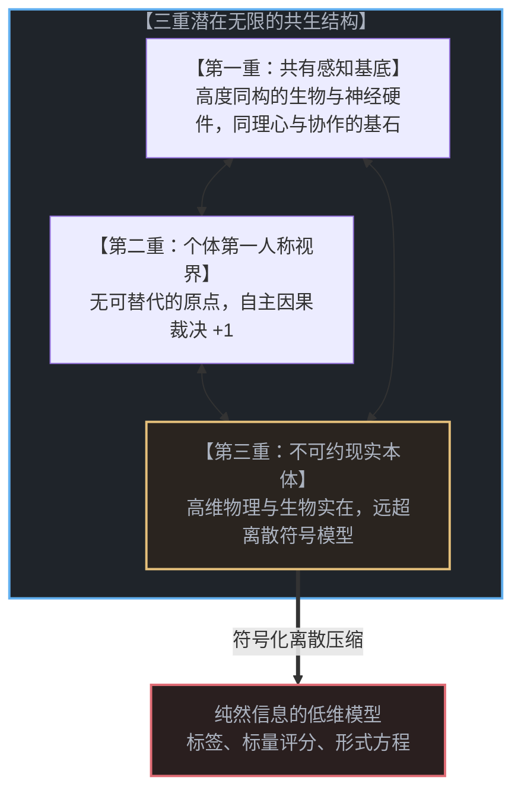
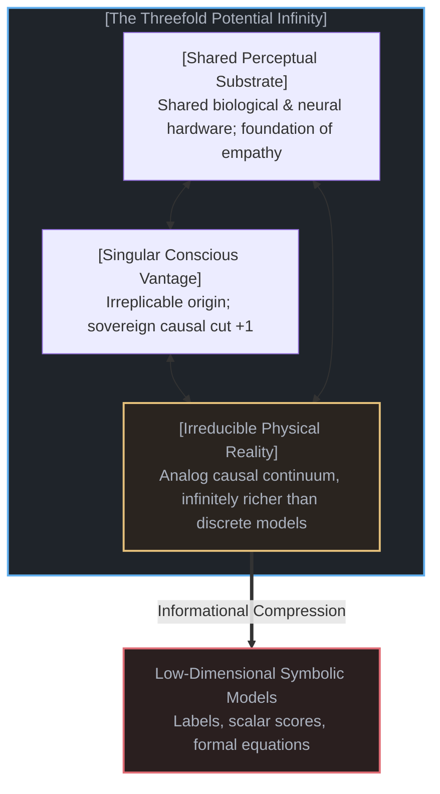
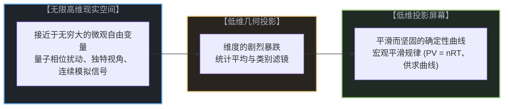
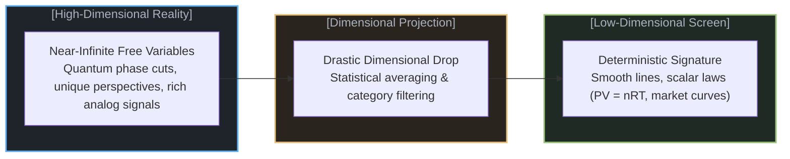
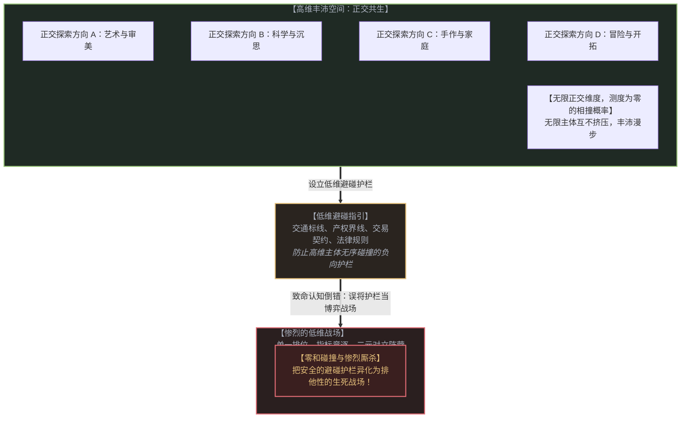
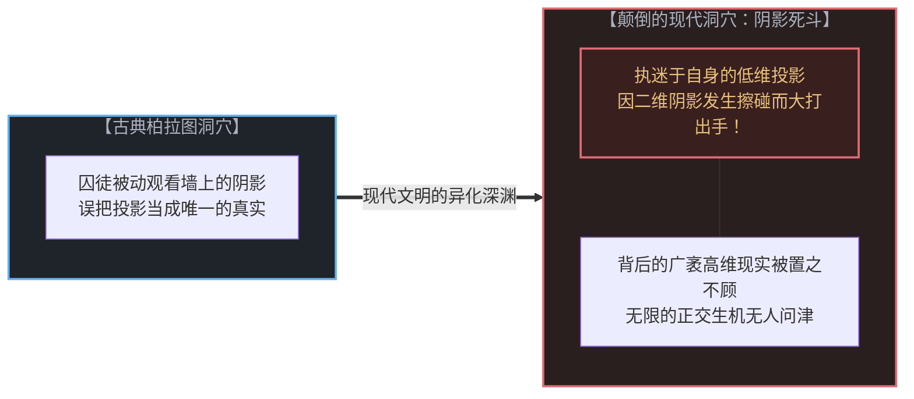
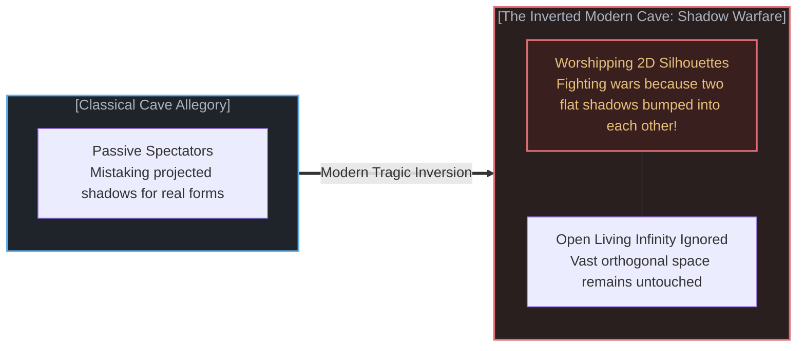
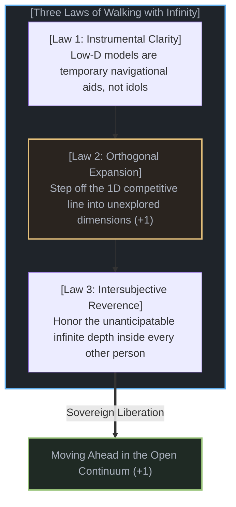

# 阴影与无限：低维投影、确定性假象与人类冲突的根源 / The Shadow and the Infinite: Low-Dimensional Projections, the Deterministic Illusion, and the Genesis of Conflict

*在物理与生物现实的无限高维空间中，存在着足以容纳无数个体互不碰撞、丰沛共生的广袤天地。规则与边界原本只是规避冲突的避碰指引，然而当我们误将护栏当成竞技场、执迷于低维投影的单一标尺时，多维的生存空间便被异化为逼仄惨烈的低维绞杀战场。 / In the infinite-dimensional reality of the physical and biological cosmos, there is boundless room for infinite individuals to coexist without ever colliding. Rules and boundaries were meant only as guidance to avoid conflict. Yet the moment we mistake the guardrail for the game and collapse living richness onto low-dimensional projections, we turn a multi-dimensional living space into a tragically low-dimensional war zone.*

---

## 一、 三重无限的壮阔图景 / 1. The Threefold Infinity: Substrate, Vantage, and the Living Territory

当我们审视人类存在的处境时，首先会迎面撞上三个相互交织、却又呈现出不同维度的“潜在无限”：

第一重无限，是**感知基底的相通**。每一个活着的人类，都在生理结构上继承了极其相似的感知与神经硬件：视网膜对相同波长的电磁波产生光化学反应，耳蜗将空气压力波翻译为相同的电信号，数十亿神经元在相似的生物化学节律中震荡。对于所有的实践目的而言，这一套经过数亿年演化沉淀下来的感知基底，其所能承载的体验丰富度接近于无限。正是这种高度同构的感知硬件，使得我们可以共同凝望同一轮明月，听懂同一段旋律，感知相同的痛苦，并分享面包。它构成了同理心、语言与人类协作的物理基石。

第二重无限，是**第一人称视角的相异**。尽管感知基底高度相通，但在这个世界上，从来没有两个人看到过相同的世界。每一个心智都坐落在时空中无可替代的坐标原点上，背负着由一连串不可逆的历史抉择、记忆沉淀与注意力聚焦所塑造的独特视界。更为关键的是，每一个意识都是一个独立的自由变量，正在当下进行着自主的因果裁决（+1）。即便两个人并肩站立在同一棵橡树下，一人看见的是避暑的绿荫，另一人想起的是童年攀爬的创伤，第三人评估的是木材的经济价值。对于所有的实践目的而言，个体之间的视界差异同样接近于无限。

第三重无限，是**现实本体与符号理解之间的非对称鸿沟**。我们所直接感知到的物理与生物世界，是一个不可约减的高维连续统。当你咬下一口苹果时，你的口腔与大脑在实时处理成百上千种挥发性芳香分子、细胞壁破裂的质构张力、温度梯度与漫长的演化联想；而我们对这一动作的所谓“科学理解”，不过是几行脱水离散的符号与概念——“它很甜”、“含有果糖”、“大约六十卡路里”。理解是信息的压缩，而现实是无限高维的因果流。

请注意，正如我们在[潜在无限与数学思维的暂态闭合](../potential-infinity-and-the-temporary-closures-of-mathematical-thought/)中所论证的，这些无限不是数学上已经完成的“终极全集”，而是向着深邃未知永恒敞开的“潜在无限”。

---

When we examine the condition of human existence, we immediately encounter three intertwined layers of potential infinity:

The first infinity is the **deep similarity of our perceptual substrate**. Every living human inherits practically identical sensory and biological hardware: retinas sensitive to the exact same narrow band of electromagnetic waves, cochleas converting air oscillations into identical neural impulses, and billions of cortex neurons pulsing to shared biochemical rhythms. For all practical human purposes, this sensory substrate is infinitely rich. Because we share this vast evolutionary foundation, we can gaze at the same moon, weep to the same chord, feel the same cold, and break bread together. It forms the biological ground of empathy, language, and shared culture.

The second infinity is the **radical divergence of the first-person vantage**. Despite this shared substrate, no two human beings have ever inhabited the exact same perceptual world. Every conscious observer sits at an irreplicable origin in spacetime, shaped by an irreversible trajectory of individual memories, formative wounds, and attentional orientations. Every mind acts as an independent sovereign variable making its own causal cut in the present (+1). If two people stand beneath the same oak, one perceives shelter from the midday sun, another recalls a childhood fall from its branches, and a third calculates the timber value. For all practical purposes, the divergence between human minds is equally infinite.

The third infinity is the **asymmetric chasm between living reality and informational models**. The physical and biological cosmos we directly perceive is an irreducible, high-dimensional analog continuum. When you taste an apple, your sensory apparatus processes hundreds of volatile compounds, cell-turgor shear stresses, temperature gradients, and ancient evolutionary memories in real time. Our rational "understanding" of that moment, by contrast, is a tiny cluster of dehydrated symbols: "it is sweet," "it contains fructose," "it has sixty calories." Understanding is discrete informational compression, whereas perceived reality is an unbounded high-dimensional ocean.

Crucially, as established in [Potential Infinity and the Temporary Closures of Mathematical Thought](../potential-infinity-and-the-temporary-closures-of-mathematical-thought/), these infinities are not completed totalities frozen into mathematical sets; they are open-ended horizons of potential infinity unfolding across living experience.

---

## 二、 维度的暴跌：从鲜活无限到确定性签名 / 2. The Dimensional Drop: How Infinity Becomes a Deterministic Signature

当我们拥有如此庞大的三重无限时，一个惊人的科学奇迹发生了：**为什么物理学与社会学总能推导出如此简洁、优美且看似分毫不差的“确定性定律”？**

答案隐藏在几何投影的数学机制中：**所谓的确定性，并不是宇宙本体的底层法则，而是我们将无限高维的鲜活现实投影到低维坐标系时，所必然浮现的数学签名。**

让我们观察这种“维度的暴跌”是如何在各个学科中上演的：
* **在热力学中**：一立方米的气体包含数以十万亿亿计的气体分子，每一个分子都在量子与电磁尺度经历着无法追踪的高维微观碰撞。然而，当物理学家将这庞大无匹的高维运动投影到仅仅由三个宏观统计平均量构成的三维空间——压强 P、体积 V、温度 T 时，所有的微观涨落都在大数定律下互相抵消。瞬间，理想气体状态方程 PV = nRT 浮现了出来！物理学家激动地宣布找到了控制气体的永恒铁律，却遗忘了这一定律仅仅是剧烈降维后的平滑统计阴影。
* **在经济学与社会学中**：八十亿人类拥有接近于无限的内心世界、各异的情感羁绊与不可预测的创造性裁决。但当统计学家将这八十亿个高维生命体投影到单一维度的数值上——价格（如每斤三元）、信用评分（如七百五十分）、或者一张选票（零与一）时，个体之间的丰富差异在投影轴上被无情压扁。人群展现出了稳定的供给需求曲线与周期性行为。学者们欢呼人类行为是可以通过数学公式精确预测的，误将降维造成的平滑假象当成了人性的本质。

确定性不是大自然的内在骨架；**确定性是无限系统在遭遇低维测量时，被强行抹去高阶自由度后所残留的低维投影痕迹。**

---

Given this vast threefold infinity, a startling scientific paradox emerges: **why do physics and sociology continually discover clean, elegant, and apparently rigid "deterministic laws"?**

The answer lies in the mathematics of dimensional projection: **determinism is not an ontological law of the deep cosmos; determinism is the mathematical signature that inevitably appears whenever an infinite-dimensional reality is projected onto a low-dimensional space.**

Consider how this drastic dimensional drop operates across various fields:
* **In thermodynamics**: A single cubic meter of gas contains tens of sextillions of molecules, each undergoing unpredictable, high-dimensional micro-collisions. Yet when a physicist projects this unfathomable complexity onto a simple three-dimensional space of macroscopic averages—Pressure (P), Volume (V), and Temperature (T)—all microscopic variances cancel out under the Law of Large Numbers. Instantly, the ideal gas law PV = nRT appears. The physicist marvels at having uncovered a deterministic natural law, forgetting that this law is merely the smooth statistical shadow cast by a severe dimensional collapse.
* **In economics and sociology**: Eight billion human beings possess near-infinite inner worlds, singular emotional histories, and unpredictable sovereign choices. But when an institution projects these high-dimensional agents onto low-dimensional metrics—a one-dimensional price, a scalar credit rating, or a binary vote—the vast orthogonal differences vanish. In that flattened space, the collective manifests smooth demand curves and predictable trends. Theorists declare that human beings are rational, mechanical utility-maximizers, confusing the flattening of the measurement frame with the true nature of human agency.

Determinism is not the structural bedrock of the universe; **determinism is the shadow left behind when high-dimensional reality is stripped of its higher degrees of freedom by a low-dimensional instrument.**

---

## 三、 拥挤的投影幕：冲突为何在低维中必然爆发 / 3. The Cramped Screen: Why Conflict Is Inevitable in Low Dimensions

理解了维度的暴跌，我们便获得了一把解开人类一切冲突、对抗与零和博弈的几何钥匙：

> **在物理与生物现实的高维空间中，存在着无限的正交方向，足以容纳无数独特的个体互不干扰地丰沛共生；然而，一旦我们将人类的生活强行挤压进低维的单一标尺，人造的拥挤与恶性的碰撞便成为不可避免的数学必然。**

在几何学中，高维空间具有一个绝妙的特性：两个复杂的高维流形在广袤的空间中漫游时，它们发生物理相撞的概率在测度论上趋近于零。在现实的大地与因果网络中，有人潜心于园艺，有人沉醉于天文学，有人在工坊里雕琢木器，有人在深山中修筑步道。生活本身的正交维度是近乎无限的，每一个生命都能开辟出属于自己的独特因果轨道。

然而，低维投影颠覆了这种丰沛性：
1. **单一维度的排队机制**：当社会评价机制将复杂的人性坍缩为单一轴线——例如单纯的财富数字、粉丝数量、学校排名或权力位阶时，原本朝向四面八方展开的无限空间被瞬间压缩成了一条狭窄的一维独木桥。
2. **零和碰撞的必然降临**：在一条一维的线上，几何学只允许两种相对位置：你要么跑在我前面，你要么挡在我路上。你的前进必然意味着我的落后，你的获得必然意味着我的被剥夺。
3. **人造稀缺的疯狂内卷**：原本广袤无垠的宇宙，被一个低维投影幕硬生生制造出了极度的人造拥挤。无数本可以各自绽放的鲜活心智，在这条逼仄的轴线上互相撕咬、践踏、攀比与厮杀。

### 致命的认知倒错：把避碰指引误认为零和竞技场

更深沉的荒谬在于：人类最初为何要发明这些低维标尺与边界？

人类发明交通标线、产权界桩、交易契约与法律规则，初衷是为了提供一套**规避冲突的负向指引与安全护栏**。在广袤的三维大地上，公路上的黄色标线不是为了让人在上面安家落户，而是为了让两辆高速行驶的汽车能够互不刮蹭、平安擦肩而过，继续驶向各自无限广阔的目的地；文明中的契约、产权与礼仪边界，原本只是为了防止高维主体在物理或资源互动中发生无谓的碰撞。

然而，人类文明演进中最致命的一场认知倒错在此发生：**我们误将规避冲突的避碰指引，当成了自己必须全力参与的零和博弈。**

我们不再把护栏当作保护生命的边界，反而集体爬到了狭窄的护栏之上；我们把指引车辆分流的标线，变成了争夺立足之地的独木桥。当所有人的目光都被锁死在这条细线上时，线上的相对位置就成了唯一的战利品：谁排在第一位？谁抢了谁的身位？谁又该把谁挤下深渊？

**这就是我们如何亲手将丰沛辽阔的多维生存空间，异化为逼仄而惨烈的低维绞杀战场。** 在无限的正交空间中，相撞的概率原本测度为零；但在被人为挤压的低维走廊里，每一次呼吸都成了互不相容的抢夺。

一切意识形态的仇恨、阶层内卷的焦虑与族群对抗的烈火，其本质都不是物理资源的匮乏，而是心智**被囚禁在低维投影幕上所遭受的维度窒息**。

---

Understanding this dimensional collapse provides a geometric master key to deciphering human conflict, rivalry, and zero-sum warfare:

> **In the high-dimensional reality of the physical and biological cosmos, there are boundless orthogonal directions capable of sustaining infinite unique individuals without mutual interference. Yet the moment human existence is compressed onto low-dimensional scalar metrics, artificial congestion and catastrophic collision become mathematically inevitable.**

In higher mathematics, high-dimensional spaces possess an extraordinary geometric virtue: when two complex, high-dimensional manifolds traverse an expansive domain, the probability of their intersection is measure-zero. In the open causal territory of living reality, one person immerses themselves in botanical gardening, another explores astronomical theory, a third crafts wooden furniture, and a fourth builds alpine footpaths. The natural axes of human existence are practically infinite. Every life can carve out its own unique trajectory without crowding anyone else.

Low-dimensional projections violently destroy this natural abundance:
1. **The linear queue**: The moment society collapses the richness of human life onto a single scalar metric—such as net worth, follower counts, institutional pedigree, or political hierarchy—an expansive multidimensional space is flattened into a narrow one-dimensional corridor.
2. **The inevitability of collision**: On a one-dimensional line, geometry permits only two relative states: you are either ahead of me, or you are blocking my way. Your advancement feels like my demotion; your gain feels like my dispossession.
3. **Manufactured scarcity and desperate rivalry**: An unbounded cosmos is converted into artificial congestion by a low-dimensional screen. Countless vibrant minds, who could have flourished along orthogonal paths, are forced onto a single wire to fight, envy, and destroy one another.

### The Fatal Inversion: Mistaking Conflict-Avoidance Guidance for the Game

The deeper tragedy lies in why humanity invented low-dimensional metrics and boundaries in the first place.

Humanity did not invent lane markers, property boundaries, legal statutes, and currency standards out of cruelty. Originally, every low-dimensional boundary was constructed for a single practical purpose: as **guidance to avoid conflict**. On an expansive continent, the painted line dividing an asphalt highway does not exist to be lived upon; it is a negative guardrail designed so that two high-dimensional vehicles can pass each other safely and proceed toward their separate, boundless destinations. Contracts, property deeds, and social etiquette were designed as navigational buffers so that individuals could cultivate their distinct orthogonal paths without colliding.

Yet civilization suffered a fatal cognitive inversion: **we mistook the guidance to avoid conflict as the zero-sum game we have to play.**

Instead of walking freely across the vast multidimensional landscape and using the guardrails merely to prevent accidental friction, we climbed on top of the guardrails. We turned the collision-avoidance divider into the exclusive field of play: Who ranks first on the line? Who is blocking whom? Who must be shoved off the edge?

**This is how we turn the multi-dimensional living space into a tragically low-dimensional war zone.** What would have been a measure-zero probability of interference across infinite orthogonal dimensions becomes an inescapable, lethal tournament on a flattened strip of concrete.

All ideological warfare, bureaucratic status anxiety, and tribal bitterness do not stem from natural physical scarcity; they are **the symptoms of dimensional suffocation caused by trapping the mind inside low-dimensional projections**.

---

## 四、 柏拉图洞穴的颠倒：人类为何为阴影的碰撞而战 / 4. The Inversion of Plato's Cave: Fighting over Colliding Shadows

两千四百年前，柏拉图在《理想国》中提出了著名的“洞穴寓言”：被铁链锁在洞穴中的囚徒，将火光投射在石壁上的傀儡阴影当成了真实的世界。

但人类文明在今天所上演的惨剧，远比柏拉图的设想更为滑稽与荒诞。人类不仅误将投影当成了现实，而且在洞穴深处爆发了一场场你死我活的**阴影之战**：

审视那些充斥于社交媒体、政治辩论与家庭餐桌上的无休止争吵，你会发现：**人们从来不是在为真实的世界而战，而是在为各自低维投影的碰撞而战：**
* **意识形态狂热者**：把波澜壮阔、生生不息的人类社会，强行塞进一套极度贫瘠的教条标签中（如“进步与反动”、“正义与邪恶”）。他们看不见眼前那个有血有肉、需要抚育幼子、会为落日叹息的活人，他们只能看见那个活人在其教条滤镜下所投射出的敌对黑影。为了消灭那个纸片般的黑影，他们不惜将现实中的生灵推入火海。
* **官僚与指标狂人**：把教育的灵性简化为一个升学率，把医疗的温度简化为一个周转率，把复杂城市的生机简化为一个排他性的整洁度指标。当活生生的人性伸出枝桠、超出了这些僵死表格的边界时，他们便挥舞剪刀，将鲜活的生命强行修剪成符合二维表格的残疾模具。
* **防御性的小我**：许多人在年轻时偶然凝固下了一个关于自己的低维画像——一个“成功的标签”、“被伤害的受害者身份”、或者“永远正确的权威人设”。在接下来的漫长人生里，他们放弃了向着无限现实继续探索的可能，转而将全部的生命能量，用于抵御任何可能蹭破这张二维画像的细微风吹草动。

两张平面的影子在石壁上重叠了，影子不会流血，但投射出这些影子的人类却因此拔刀相向。这就是低维执迷给文明带来的最沉痛的诅咒。

---

Twenty-four hundred years ago, Plato presented his renowned Allegory of the Cave in *The Republic*: chained prisoners, unable to turn their heads, mistook the flickering shadows of puppets cast by firelight onto stone walls for the true universe.

Yet the tragedy modern civilization enacts today is far more absurd than Plato imagined. Humanity does not merely mistake flat projections for reality; deep within the cave, we have launched an endless series of catastrophic **shadow wars**:

Observe the bitter arguments raging across digital networks, legislative assemblies, and dining tables. **People are never fighting over the living territory; they are fighting over the collision of their flattened low-dimensional shadows:**
* **The ideological zealot**: Compresses the kaleidoscopic metabolism of society into a rigid, impoverished binary label (e.g. "progressive vs. reactionary," "pure vs. corrupted"). They cannot see the breathing human being standing before them—a parent caring for a child, a person moved by music. They see only the hostile black silhouette cast by their ideological filter. To annihilate that flat shadow on the wall, they are willing to set the living world on fire.
* **The bureaucratic metric worshipper**: Collapses the sacred spark of education into standardized test percentiles, the dignity of medical care into patient-turnaround quotas, and the organic vitality of an urban neighborhood into sanitized zoning metrics. When living human nature branches outward beyond the margins of the spreadsheet, they wield regulatory shears to mutilate human beings into compliance with flat tables.
* **The defensive ego**: An individual often fixes an early low-dimensional self-image—a badge of status, a chronic victim identity, or an image of unbroken infallibility. For the remainder of their days, they cease expanding into the living infinity of new experiences, consuming their vitality defending that fragile two-dimensional silhouette against every passing breeze.

When two flat shadows overlap on a stone wall, the shadows feel no pain; yet the living beings who cast them draw swords and spill real blood. This is the profound curse of low-dimensional fixation.

---

## 五、 与无限同行：超越阴影之战的生存实践 / 5. Walking with Infinity: Transcending the Shadow War

如果冲突的根源在于执迷于低维投影，那么解脱之道绝非是在低维的泥潭里争夺霸权，而是**退后一步，转过身来，与高维的无限同行**。

这要求我们在认知、行动与人际相遇中确立三项不可动摇的本体论法则：

### 1. 工具性清醒：是标尺，绝非偶像
我们无需抛弃低维模型。科学定律、货币价格、地图与分类词汇是极其高效的导航仪器。一张地图通过省略九成九的地理细节，帮助我们在群山中不至于迷路。但清醒的行者明白：**地图是为人服务的工具，人不是为了充当地图上的一个点而降生在世上的。**
任何时候，一旦某个模型、考核指标或意识形态试图以“客观真理”的名义反客为主，要求你为了维持其模型的优美而牺牲活生生的现实时，你必须在心中果断祛魅：它不过是一张低维图纸，撕碎它，现实毫发无伤。低维规则与边界原本只是避免碰撞的安全护栏，绝非生活的竞技场；利用它规避冲突，随后立即把目光投向正交的无限旷野。

### 2. 正交前行：离开那条拥挤的一维跑道
当你发现自己正陷入与他人的无休止攀比、嫉妒与防御性争斗时，停下脚步，审视一下自己是否正被困在一个低维投影幕上。
别人在争夺某个职位的头衔、某项资产的数字、或者某种立场的正确性，那是他们自愿锁闭在的一维标尺。你无需在那条狭窄的跑道上拼死超车。宇宙拥有无限的正交轴线——向着好奇心展开、向着真挚的情谊展开、向着未被命名的技艺展开。当你选择向着一个新的正交维度迈出一步时，所谓的竞争对手在几何学上便瞬间失去了与你碰撞的可能。广袤的自由只属于那些敢于在无人处开辟新坐标的人。

### 3. 同侪敬畏：直面他人的深渊
在面对任何一个活生生的人时，提醒自己放下脑海中那张由标签拼凑而成的扁平肖像。
对方不仅与你共享着数亿年沉淀下来的深邃感知硬件，更携带着一个由数十年独特记忆编织而成的平行宇宙。他的一颦一笑、一次不可理喻的发怒、一个看似不可思议的抉择，背后都有着一个庞大、高维的因果网络在支撑。你无法用一句话、一个立场或一种诊断充分定义他。当你以对待一个无穷世界的敬畏去对待另一个生命时，低维的摩擦自然消散，深度的同频与共鸣才有可能降临。

---

If the genesis of human conflict lies in low-dimensional fixation, then liberation cannot be won by fighting for supremacy inside the flattened trap. It requires stepping off the screen, turning around, and **walking ahead with infinity**.

This demands three foundational ontological disciplines in perception, action, and human encounter:

### 1. Instrumental Clarity: A Tool, Never an Idol
We need not discard low-dimensional models. Scientific equations, monetary prices, maps, and vocabularies are extraordinary navigational aids. A map helps us cross mountain ranges precisely by discarding ninety-nine percent of terrain details. But the grounded walker remembers: **the map is an instrument serving life; human beings were not born to become coordinates on paper.**
Whenever a theoretical model, institutional metric, or ideological creed attempts to usurp authority, demanding the sacrifice of living reality to preserve the purity of its chart, deconstruct it without hesitation: it is only a flat projection. Tear the paper, and reality remains completely unharmed. Low-dimensional boundaries and rules are navigational guardrails designed to avoid collisions, not sacred arenas where you must stage a fight to the death. Use them to maintain safe passage, and then immediately turn your attention back to the open, orthogonal wilderness.

### 2. Orthogonal Expansion: Stepping Off the 1D Track
Whenever you find yourself trapped in chronic status envy, defensive posturing, or ideological hostility, pause and ask: *Which low-dimensional screen am I trapped upon?*
Others may be furiously battling over a corporate title, a net worth metric, or an ideological orthodoxy. That is their chosen linear corridor. You have zero obligation to sprint down their one-dimensional track. The cosmos contains infinite orthogonal axes—toward genuine curiosity, unspoken creative crafts, honest care, and unmapped horizons. The moment you step into a new orthogonal dimension, your competitors lose the geometric ability to collide with you. Boundless freedom belongs to those who dare to open an uncrowded axis.

### 3. Intersubjective Reverence: Facing the Inexhaustible Other
When looking into the eyes of another person, consciously discard the flat caricature constructed by your preconceptions.
The person before you shares the same near-infinite biological hardware that supports your own gaze, while harboring a parallel cosmos of unique memories, private sorrows, and sovereign choices. Their sudden outburst, their confusing decision, or their unfamiliar viewpoint is upheld by an expansive causal continuum that no superficial label can encompass. When you approach another being with the reverence due to an inexhaustible universe, low-dimensional friction evaporates, clearing the path for genuine mutual resonance.

---

## 六、 结语：在不可穷尽的宇宙中自由呼吸 / 6. Epilogue: Breathing Freely in the Unbounded Continuum

我们生活在一个从未闭合、不可穷尽的宇宙之中。

大地不是一块拥挤不堪的荒原，生命也不是一场被算法判定的零和决斗。真正的物理与生物现实，其维度之高深、容量之浩瀚，足以让千百亿各具特质的心智在各自的轨道上昂首前行，彼此辉映而互不遮蔽。

人造的苦难，始于我们把避碰的指引误认为了死斗的战场，将无限的多维生存空间异化为互掷长矛的低维囚笼；
而真正的觉醒与安宁，始于我们跃下狭窄的护栏，穿透那些虚张声势的低维幻象，重新跨入无边无际的因果旷野。

阴影不会有未来，唯有行走的生命永恒开辟着明天。不要在石壁前为投影的碎屑而战；转身迈出步伐，与无限同行。

---

We inhabit an open, unclosed, inexhaustible cosmos.

The living earth is not a congested wasteland, nor is human existence a zero-sum deathmatch dictated by algorithms. The true physical and biological reality is of such staggering dimensionality and profound abundance that it can comfortably sustain billions of unique sovereign trajectories, shining alongside one another without ever blocking the light.

Human misery begins when we mistake collision-avoidance guidance for a zero-sum arena, turning an inexhaustible multi-dimensional living space into a cramped cage of war;
Genuine awakening and sovereign peace arrive the moment we step off the narrow guardrail, see through the fragile bluster of low-dimensional shadows, and step back into the unconfined causal wild.

Shadows possess no future; only living agency carves the frontier of tomorrow. Do not spend your days battling over flat phantoms on the stone wall. Turn around, step into the open territory, and walk ahead with infinity.
