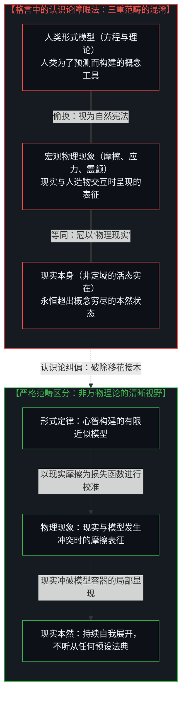
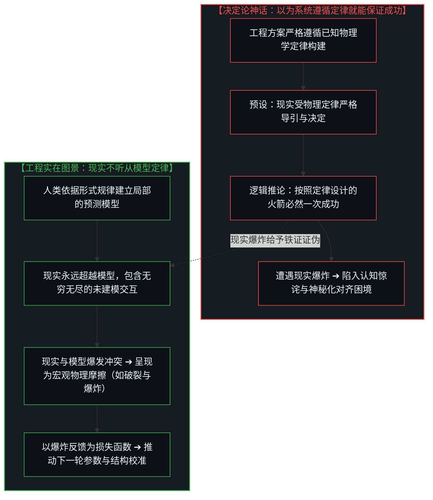
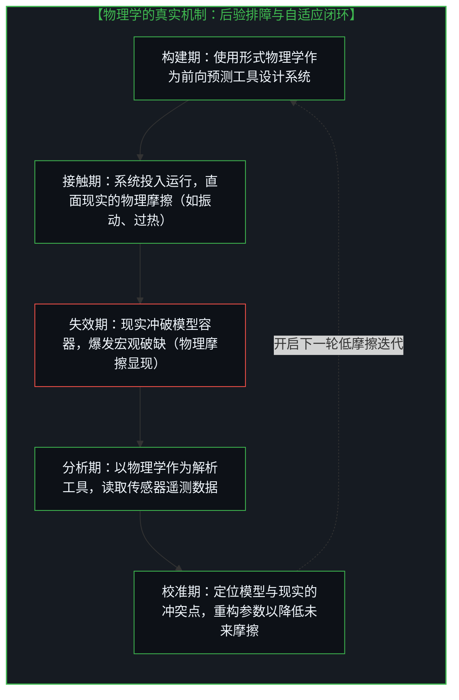
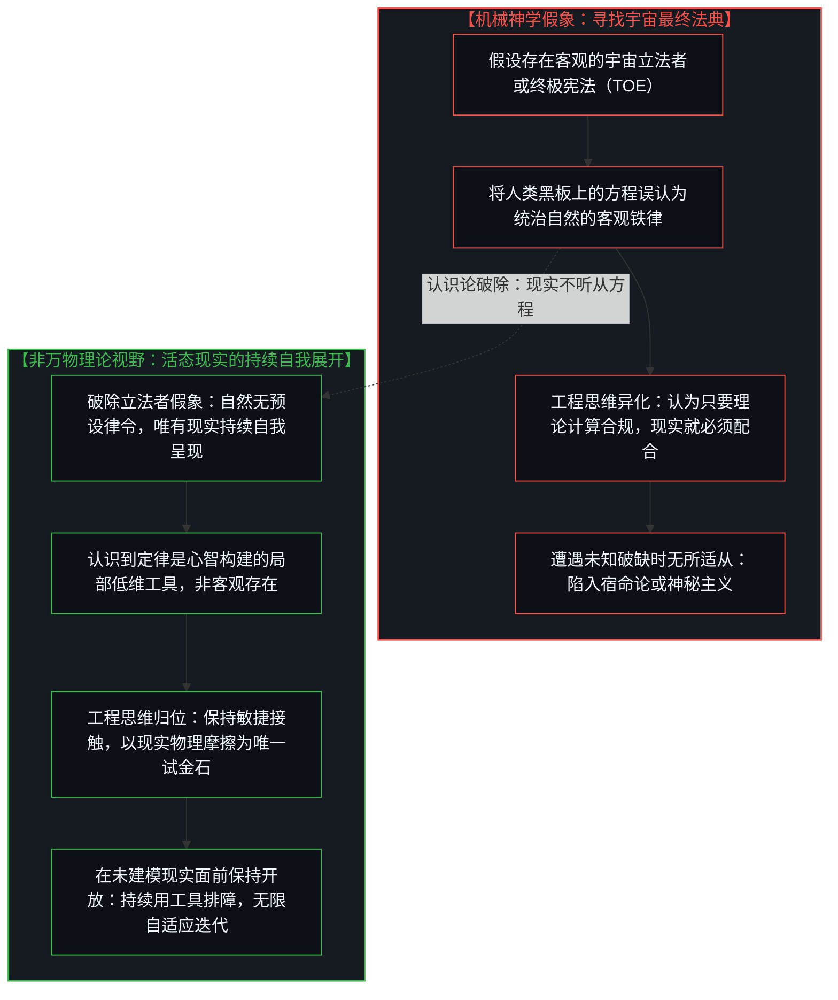
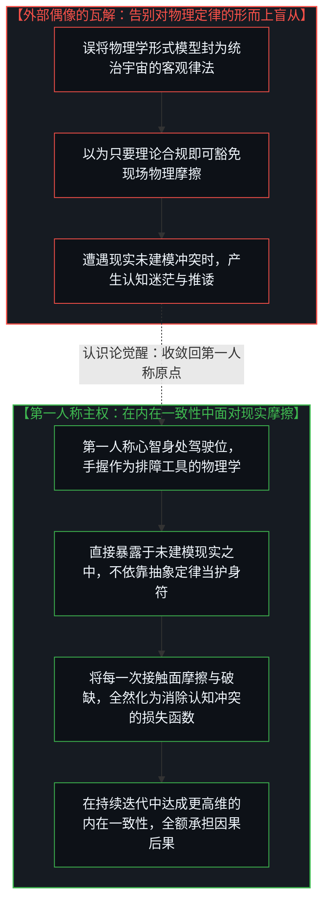

# “物理学才是定律”的障眼法：形式模型、宏观摩擦，以及未被定律决定的现实 / The Sleight of Hand in "Physics Is the Law": Formal Models, Macroscopic Friction, and a Reality Undetermined by Law

*解构埃隆·马斯克“物理学才是定律，其他一切只是建议”的著名格言，揭示将人类形式模型偷换为自然导引规律的认识论障眼法；以火箭在严密遵循物理定律下依然爆炸为铁证，论证现实断非由物理定律所决定；阐明宏观物理现象是现实与模型冲突时呈现出的摩擦表征，物理学则是人类用于读取遥测数据、消除模型内在冲突的后验排障工具；破除大自然存在客观铁律的形而上学神话，确立现实在持续自我展开并在第一人称内在一致性中达成自适应进化的核心机制。 / Deconstructing Elon Musk's celebrated maxim "Physics is the law, everything else is just a recommendation", exposing the epistemological sleight of hand that conflates human formal models with nature's supposed guiding laws; utilizing rocket explosions occurring under strict adherence to physics as decisive proof that reality is not determined by physical laws; demonstrating that macroscopic physical phenomena represent reality's friction clashing with human models, while physics serves as a retrospective debugging tool to read telemetry and resolve internal model conflicts; dismantling the metaphysical myth of objective laws guiding nature, and establishing that reality continually unfolds while adaptation is achieved strictly through first-person internal coherence.*

在当代工程与科技创新的叙事中，埃隆·马斯克（Elon Musk）有一句流传极广、影响深远的格言：**“物理学才是定律，其他一切都只是建议”（Physics is the law, everything else is just a recommendation）。** 长期以来，这句话被无数工程师、创业者与实践者奉为圭臬，视作穿透现实迷雾、取得非凡工程成就的底层密钥。它的实践威力显而易见：当面对官僚机构繁复的审批流程、行业既得利益者的保守教条、或是社会习俗的惯性阻力时，这句话像一把锋利的手术刀，提醒行动者这些人为设定的规则纯属可被协商、打破或绕过的“建议”；而物质材料的强度极限、重力势能的克服以及热力学的熵增，才构成了工程造物无可规避的硬核约束。

然而，正是在这种极具感染力的工程自信之中，潜藏着一个极难被觉察的认识论**障眼法（Sleight of Hand）**。正如在 [数字火箭、同行审查与因果闭环的稀释](../the-dilution-of-the-causal-loop-and-the-misallocation-of-agency/) 与 [框架的倒置与驾驶位的主权非对称](../the-inversion-of-the-harness-and-the-driver-seat-asymmetry/) 中所指出的，人们在日常语言中极易把“宏观物理现象”与“现实本身”划上等号，并把人类总结出的“物理学形式定律”混同为“指导自然运转的宇宙铁律”。这种多重含义的移花接木，在赋予物理学至高权威的同时，悄然颠倒了模型与现实的因果次序：它让人们误以为大自然像一架发条钟表一样严格听命于某种预设的“物理法则”，而遗忘了物理学不过是人类为了与现实发生接触、校准自身认知而发明的形式工具。

In the discourse of modern engineering and technological innovation, Elon Musk popularized an exceptionally resonant maxim: **"Physics is the law, everything else is just a recommendation."** For years, engineers, entrepreneurs, and builders have treated this statement as an axiomatic compass for cutting through institutional inertia and solving hard problems. Its practical leverage is undeniable: when confronting bureaucratic procedures, regulatory roadblocks, corporate consensus, and social traditions, this maxim functions like a scalpel, reminding practitioners that human constraints are mere social constructs—recommendations that can be challenged, negotiated, or dismantled. Conversely, material tensile limits, gravitational wells, and thermodynamic dissipation represent unyielding boundaries that cannot be lobbied away.

Yet within this compelling engineering intuition lies a profound, unexamined **sleight of hand**. As established in [Digital Rockets, Peer Review, and the Dilution of the Causal Loop](../the-dilution-of-the-causal-loop-and-the-misallocation-of-agency/) and [The Inversion of the Harness and the Sovereignty of the Driver's Seat](../the-inversion-of-the-harness-and-the-driver-seat-asymmetry/), everyday discourse routinely conflates macroscopic physical phenomena with reality itself, while treating formal human mathematical formulations as if they were cosmic decrees governing nature from above. This subtle equivocation inverts the relationship between reality and cognitive models: it induces the belief that nature operates under the command of a celestial statutory code called "physical law," completely obscuring the fact that physics is a human formal instrument invented to engage reality and calibrate cognitive models through contact.

---

## 一、 三重范畴的移花接木：形式规律、宏观现象与现实本身 / 1. The Triple Equivocation: Formal Laws, Macroscopic Phenomena, and Reality

“物理学才是定律”这句格言之所以产生认知障眼法，根源在于它在同一个词汇“物理学”（Physics）之下，悄无声息地偷换了三个截然不同的范畴：

1. **形式定律（Formal Law）与理论模型**：这是人类物理学家在黑板与论文上写下的数学方程，是人类心智为了描述、预测自然行为而构建出的概念框架（如牛顿力学方程、麦克斯韦方程组或热力学状态方程）。它们是人类知识体系中的形式表达；
2. **宏观物理现象（Macroscopic Physical Phenomena）**：这是人造系统在现实中运行时所激发的宏观表征，例如气动摩擦产生的高温、发动机壳体的应力形变、推进剂燃烧的剧烈震颤乃至整机解体的爆炸。这些现象是现实与人类构想的物体发生交互时所呈现的物理摩擦反应；
3. **现实本身（Reality Itself）**：这是不可被任何有限概念、理论或观测视界所穷尽的活态实在。现实是无穷维度的、处在持续自我展开与生成之中的本然状态。

在马斯克的名言中，这三重范畴被强行缝合在了一起：人们先是将“宏观物理现象”等同于“现实本身”，顺理成章地称之为“物理现实”；紧接着，又将人类所书写的“形式物理定律”，偷换成了“导引大自然运转的客观法典”。这种移花接木的逻辑链条，在潜意识中构建起了一幅机械宿命论的图景——仿佛自然界是一位极其严苛的法官，手握一本名为《物理学》的现成法典在审判人造物的每一个动作。

更为反讽的是，即便在形式物理学内部，近现代的科学演化也早已粉碎了这种“铁律统摄一切”的古典幻觉。量子力学的诞生无可辩驳地揭示出：在微观深处，确定性的机械钟表并不存在，非确定性（Indeterminism）与概率性才是形式理论必须正视的基本事实。如果连形式物理学自身都早已放弃了机械铁律的幻想，那么试图把物理学加冕为统治大自然的客观法律，就全然是一种认识论上的倒退。

The sleight of hand in "Physics is the law" succeeds because it smoothly equivocates among three fundamentally distinct domains under the singular label "Physics":

1. **Formal Laws and Mathematical Models**: These are human-engineered equations, state transitions, and theoretical frameworks inscribed on blackboards and in simulation code (e.g., Navier-Stokes equations, Maxwell's equations, thermodynamic relations). They are formal cognitive artifacts designed by human minds to approximate observed dynamics;
2. **Macroscopic Physical Phenomena**: These are the macroscopic manifestations observable when an engineering system interacts with its operational environment: aerodynamic thermal friction, structural vibration, shear stress, combustion instabilities, or catastrophic disintegration. They represent physical friction generated at the interface between human-designed assemblies and reality;
3. **Reality Itself**: The living, unmodeled ground truth that exceeds all finite concepts, models, and measurement apparatuses. Reality is non-formalizable, high-dimensional, and continuously unfolding.

In Musk's aphorism, these three domains are fused into an undifferentiated whole: macroscopic physical phenomena are equated with reality itself under the shorthand "physical reality," while formal mathematical laws formulated by humans are attributed to nature as an immutable cosmic legislature. This rhetorical bridge constructs a mechanistic, fatalistic worldview: as though nature were an omnipotent magistrate consulting a statutory codex titled *Physics* to validate human artifacts.

Ironically, even within formal physics, 20th-century discoveries dismantled the classical fantasy of clockwork determinism. Quantum mechanics established that at fundamental registers, deterministic mechanical certainty is absent; fundamental indeterminism and probability amplitudes are structural features of formal physics itself. If physics as a formal discipline has discarded the illusion of a deterministic celestial machine, crowning formal physics as the cosmic ruler of reality represents an epistemological relapse.

---

## 二、 严格遵循物理定律的火箭为何依然爆炸？现实不由定律决定 / 2. Why Does a Rocket Explode While Obeying All Laws? Reality Is Not Determined by Physics

要刺破“物理学是定律”这一神话，无须诉诸艰深的哲学思辨，SpaceX在博卡奇卡（Boca Chica）发射台上留下的残骸就是最无可辩驳的证据。

试问一个极其朴素的工程事实：当SpaceX早期的星舰原型机在降落阶段炸成巨大火球时，是因为设计它的工程师违反了物理定律吗？答案是断然否定的。每一个参与星舰设计的工程师，都是受过严密科学训练的精英；从推进剂管道的流体仿真、发动机推力矢量的控制算法，到隔热瓦的气动热力学计算，图纸与代码中的每一个参数，都是在人类已知物理学定律的严密指导下推演出来的。没有任何一位航天工程师会故意设计一枚“违反物理定律”的火箭。

然而，火箭依然在众目睽睽之下爆炸了。**这件事情本身，构成了对“现实由物理定律决定”这一命题的终极证伪！**

如果现实真的由物理定律所决定、所导引，那么一个全然按照物理定律严格计算、严谨构建的火箭系统，在逻辑上理应一次性毫无悬念地平稳入轨。现实中就不应该存在爆炸，不应该存在振颤，更不应该存在意料之外的金属疲劳。火箭之所以爆炸，正是因为：**现实断非由物理定律所决定！**

物理定律只是人类在有限观测数据中提炼出的低维近似切片，而现实中错综复杂的非线性耦合、微观材料缺陷、瞬态流体谐振与极端温差冲击，永远存在于既有物理模型的视野盲区之中。火箭升空后遭遇的不是抽象的数学方程，而是深不可测的现实本身。当理论模型与现实的未建模部分发生冲突时，这种冲突便不可遏制地在后果中爆发为宏观的物理摩擦现象——超温、脱落、破裂与爆炸。

爆炸不是物理法则对“违规者”的惩罚，而是现实以极其剧烈的方式向人类宣告：**你所依赖的物理模型与现实发生了冲突，现实冲破了你试图框定它的有限容器！**

To pierce the myth of "physics is the law," one need not appeal to abstract ontology; the wreckage on the launch pads of Boca Chica offers decisive empirical proof.

Consider a simple, undeniable engineering fact: when early Starship prototypes repeatedly detonated on landing pads, was it because the engineers violated the laws of physics? Decidedly not. Every engineer calculating thrust margins, propellant chill protocols, and aerodynamic vectors held elite qualifications; every line of flight software was drafted in rigorous alignment with established fluid dynamics and structural mechanics. No engineer intentionally designs a vehicle that "violates physics."

Yet the rocket exploded anyway. **This event alone serves as the empirical refutation of the claim that "reality is determined by physical laws."**

If reality were truly determined and guided by physical laws, a system engineered in flawless compliance with those laws would succeed on its maiden flight with certainty. In such a clockwork universe, structural explosions, unpredicted oscillations, and material fatigue would not exist. The rocket explodes precisely because: **reality is not determined by physical laws!**

Physical laws are low-dimensional conceptual projections extracted from historical observations, whereas reality's non-linear couplings, structural defects, fluid transients, and thermal shock regimes permanently exceed the horizon of any model. The rocket does not fly inside an abstract equation; it navigates reality. When an engineering model encounters aspects of reality it failed to account for, the discrepancy manifests as macroscopic physical friction: overheating, structural buckling, and catastrophic rupture.

An explosion is not nature punishing a system for "breaking a law." It is reality forcibly asserting: **your conceptual model clashed with unmodeled reality, and reality overflowed your container!**

---

## 三、 宏观物理摩擦作为遥测信号：物理学作为后验排障工具 / 3. Macroscopic Physical Friction as Telemetry: Physics as an Analytical Tool for Calibration

如果物理学不是统治现实的宪法，那么它在工程与文明演进中到底扮演着什么角色？

真相是：**物理学不是现实的立法者，而是人类在遭受现实物理摩擦之后，用来读取遥测数据、定位模型偏差并消除内在冲突的后验排障工具。**

在火箭爆炸的那一瞬间，物理学的真正价值才真正凸显出来：
- 面对漫天残骸，工程团队既没有祈求神谕，也没有把爆炸神秘化为不可知的宿命。相反，他们调取遍布箭体的成千上万个传感器遥测数据——温度计的骤变、压力计的激波、应变片的失真与光谱仪的分析；
- 在这个时刻，**物理学被作为一种高精度的解析语言与诊断工具被重新调用**。工程师利用流体力学方程去重新解释燃料箱底部的气蚀效应，利用热传导方程去重新标定隔热瓦的接缝距离，利用振动力学去重新设计发动机悬挂支架；
- 这一过程的核心，决非去“顺从大自然的法则”，而是**借助物理学工具，定位上一次迭代中理论模型与现实发生冲突的具体坐标，并在下一次设计中消除这些冲突，从而最大程度地降低系统在未来与现实交互时的物理摩擦！**

在这里，我们清晰地看到了“损失函数”（Loss Function）的物理映射。在 [你委托的风险就是你创造的风险](../the-risk-you-delegate-is-the-risk-you-create/) 与 [所有权与自我配得感](../ownership-and-self-worthiness/) 中我们阐明，只有当主体直接暴露于现实接触面的摩擦阻力之下时，反馈信号才是保真的。宏观物理摩擦——从轻微的机械磨损到剧烈的爆炸火光——就是现实无中介传导给人类系统的未经过滤的“损失函数”。

物理学不是从天而降的永恒规训，而是人类在直面这一损失函数时，用于反向推演自身认知边界、完成参数梯度更新的计算工具。把它当成神圣不可侵犯的客观律令，是典型的买椟还珠；把它作为敏捷排障与降低摩擦的工具，才是现代工程之所以能够不断突破极限的真正驱动力。

If physics is not the cosmic legislature of reality, what function does it serve in engineering and civilization?

The answer is direct: **physics is not nature's legislator; it is a retrospective diagnostic tool used by human minds after encountering reality's physical friction to interpret telemetry, isolate model failures, and resolve internal architectural contradictions.**

The authentic utility of physics emerges immediately after the rocket explodes:
- Confronting wreckage, the engineering team neither petitions deities nor mystifies the event into an unfathomable anomaly. Instead, they extract telemetry from thousands of sensors: cryogenic pressure traces, thermal gradient spikes, strain gauge saturations, and acoustic vibrations;
- In this moment, **physics is deployed as a high-precision diagnostic instrument**. Engineers use fluid dynamics to model cavitation inside propellant manifolds, apply thermodynamics to recalibrate ceramic tile gaps, and utilize vibrational mechanics to redesign structural thrust pucks;
- This process is never about "submitting to cosmic decrees." It is about **using physics as a tool to map where the prior model collided with reality, modifying the system to minimize physical friction in subsequent flights.**

Here we identify the concrete manifestation of the Loss Function. As established in [The Risk You Delegate Is the Risk You Create](../the-risk-you-delegate-is-the-risk-you-create/) and [Ownership and Self-Worthiness](../ownership-and-self-worthiness/), feedback signals possess fidelity only when an acting mind directly absorbs the resistance of the contact surface. Macroscopic physical friction—from microscopic bearing wear to catastrophic detonation—is the unvarnished loss function that reality presents to human agency.

Physics is not an external decree handed down from above; it is the computational instrument human minds employ when confronting this loss function to calculate error gradients and update models. Worshipping physics as an objective ruler confuses the instrument for the territory; wielding physics as a calibration tool to reduce friction is the engine of technological compounding.

---

## 四、 自然没有宏观导引铁律：现实在持续自我呈现 / 4. Nature Has No Grand Objective Law: Reality Continually Realizing Itself

由此，我们触及了马斯克那句名言背后最深层的障眼法：**连他本人可能都没有意识到，他在潜意识中将“作为人类形式工具的物理学”与“大自然的本然运行”混为了一谈。**

这引发了一个必须透彻澄清的关键认识论命题：**大自然本身，从来不存在什么固定的、客观的“导引铁律”（Guiding Law for Nature）。**

千百年来，人类文化始终浸泡在一种挥之不去的“立法者情结”之中。从古代神学中上帝颁布十诫，到近代启蒙运动中牛顿式的宇宙钟表匠，再到当代科学家试图寻找包罗万象的“万物理论”（Theory of Everything），人类总是顽固地假设大自然背后隐藏着一张终极图纸，或者一部用纯数学写成的宇宙宪法。人们以为科学的任务就是“发现”这些客观存在的法条，然后让工程造物去毕恭毕敬地“遵照执行”。

但实在的真相远比这种机械神学更加深邃与自由：
- 大自然没有读过任何数学教科书，更没有在暗中核对微分算子；
- 所谓“客观规律”，不过是人类心智在局部尺度、特定能量区间和有限历史阶段中，对现实反复展现出的相对稳定表征所做出的概念归纳。规律存在于人类观察者的认知图景之中，断非独立镶嵌在客观现实的砖石之内；
- **不存在外在于现实的“定律”来指导现实的运转；有的只是现实在持续不断地自我呈现、自我展开与自我实现（Reality keeps realizing itself）。**

现实像一条永不停歇、波澜壮阔的活态激流。人类所做的一切建模与构想，都不过是在激流中搭建起来的临时堤坝。激流不是因为“遵守了流体力学”才流动，它只是在奔涌；当人类依据流体力学搭建的堤坝被激流冲决时，并不是堤坝“违反了规律”，而是奔涌的现实本身再一次冲垮了人类企图用静止概念对其进行裁决的虚妄僭越。

真正的工程大师之所以卓越，绝非因为他们掌握了所谓统治宇宙的“终极律令”，而恰恰是因为他们在每一次造物受挫、每一次火光四溅的现实摩擦面前，保持着对现实未建模部分的敬畏。他们不会躲在“物理学公式说这没问题”的教条里自欺欺人，而是果断承认模型的局限，拿起物理学这把工具就地重构，继续在未知的现实激流中勇敢涉渡。

This brings us to the core sleight of hand in Musk's maxim: **even he may not recognize that he is equating physics as a human formal construct with the intrinsic unfolding of nature.**

This necessitates clarifying an epistemological premise: **nature is not governed by fixed, objective guiding laws.**

For millennia, human civilization has remained captive to an unexamined legislative archetype. From ancient theologies positing divine decrees to Newtonian visions of a cosmic clockmaker, culminating in contemporary searches for a unified Theory of Everything (TOE), thought persistently presumes that behind physical phenomena lies an immutable blueprint inscribed in mathematical formalism. Analysts assume science's mission is to "discover" these statutes, after which engineering simply executes them.

Yet reality is far more dynamic and unconstrained:
- Nature consults no textbooks and executes no differential operators;
- What we label "objective laws" are low-dimensional conceptual inductions formulated by human minds over local scales, specific energy regimes, and finite historical intervals. Laws reside in cognitive frameworks, not embedded within the fabric of reality;
- **There is no external "law" guiding nature's unfolding; there is only reality continuously realizing itself.**

Reality resembles an unceasing, high-dimensional torrent. Every human model is a temporary scaffold erected within this current. The river does not flow because it "obeys fluid mechanics"; it simply flows. When human scaffolding is shattered by the current, the structure did not "violate a law"; rather, reality overflowed the finite conceptual containers designed to constrain it.

Exceptional engineers succeed not because they possess an imaginary cosmic constitution, but because when confronted by wreckage and physical friction, they retain deep respect for unmodeled reality. They refuse to seek refuge behind the rationalization that "the calculations verified the design." Instead, they acknowledge the model's limitations, wield physics as an agile diagnostic instrument, and resume rapid iteration in direct contact with reality.

---

## 五、 回到第一人称因果原点：在内在一致性中面对未建模的现实 / 5. Returning to the First-Person Causal Origin: Facing the Unmodeled Reality through Internal Coherence

解构了“物理学是定律”背后的认识论障眼法之后，我们决不能再次滑入自居高位的处方陷阱：我们决非要站在宏观制高点上，去指责哪位开拓者的语言不够严密，更不是要为科学界开出一套所谓“正确看待物理学”的治理清单。

我们可以从宏观视野出发去审视这套由语言多义性催生的障眼法，但**所有的认知闭环与实践力量，最终必然全然收敛回身处第一人称的因果原点。**

正如在 [个体抉择是唯一的因果杠杆](../individual-choices-as-the-only-causal-levers/) 与 [没有普度，只有自度](../mei-you-pu-du-zhi-you-zi-du/) 中所揭示，现实中从来不存在一个抽象的、能够代替个体去感知摩擦与做出抉择的宏观主体。无论在航天发射场、算法实验室还是日常的技术探索中，真正面对现实的，始终是身处此时此地、手握方向舵的那个具体的心智：
- **不迷信外在律令的终极性**：不再将任何黑板上的物理方程或权威宣称的“客观法则”视作免除自身反思的护身符。清楚地意识到：所有的理论都是自己为了行动而采纳的有限假说，一旦在现实接触面上撞出火花与破缺，必须毫不迟疑地承认模型的局限，而断非指责现实“不够符合定律”；
- **将现实摩擦全然内化为提升内在一致性的养料**：不再试图建立防范外界的心理壁垒。在 [开放即一致](../openness-is-consistency/) 中我们指明，真正的力量在于心智的内在无冲突性。当火箭在发射台上解体、代码在生产环境崩溃时，第一人称的主权心智断然不会浪费精力去怨天尤人，而是把未建模现实所带来的巨大反作用力，全部转化为消除自身认知模型与工程架构内部冲突的损失函数；
- **在驾驶位上全额承担抉择的因果代价**：明白现实没有义务迁就任何人类方程式，扣动扳机、点火起飞并全额承受发射代价的，始终是身处第一人称的自己。正是在这种毫不推诿、直接承受现实物理摩擦的高频闭环中，心智与未知的现实展开了最真实的对话。

物理学不是宇宙的宪法，它是勇敢者在未建模现实的荒原中拓荒时，紧紧握在手中的那把不断被打磨、不断被校准的锋利砍刀。告别对外部定律的盲目神化，守住驾驶位上的第一人称主权，在每一次剧烈的现实摩擦中不断淬炼出更深层的内在一致性——这才是人类在浩瀚宇宙中展开工程创造的真实尊严所在！

Having deconstructed the sleight of hand in "physics is the law," we must not succumb to the prescriptive trap: we do not stand above others to critique a pioneer's rhetoric, nor do we issue instructions on how the scientific community "ought" to conceptualize physics.

We may analyze the semantic equivocation from a systemic vantage point, but **all authentic insight and causal agency inevitably converge upon the first-person origin.**

As demonstrated in [Individual Choices as the Only Causal Levers](../individual-choices-as-the-only-causal-levers/) and [No Universal Salvation, Only Self-Deliverance](../mei-you-pu-du-zhi-you-zi-du/), there is no collective entity that can experience friction or choose on behalf of an individual mind. Whether on an orbital launch pad, inside a software repository, or in daily life, the entity engaging reality is always the concrete mind in the driver's seat:
- **Refusing to Deify External Statutes**: Stop treating blackboard equations or authoritative claims of "objective law" as shields against direct critical reflection. Recognize that all theoretical frameworks are finite hypotheses adopted to enable action; when they clash with reality, one must acknowledge the model's boundaries rather than complaining that reality failed to comply with the equations;
- **Internalizing Reality's Friction to Elevate Internal Coherence**: Abandon psychological fortifications against external signals. As established in [Openness Is Consistency](../openness-is-consistency/), authentic strength resides in internal cognitive non-contradiction. When a rocket disintegrates or code fails in production, a sovereign mind wastes no bandwidth on external blame; it transforms the friction of unmodeled reality into a loss function to eliminate internal contradictions in its own models and architectures;
- **Assuming Full Causal Liability from the Driver's Seat**: Reality has no obligation to conform to human equations. The mind pulling the trigger, commanding the flight sequence, and absorbing the operational blowback is always the first-person self. In this direct, high-frequency cybernetic loop with unmodeled reality, the mind achieves authentic technological mastery.

Physics is not the cosmic constitution of reality; it is the sharp, continually recalibrated instrument held by human minds traversing an unmodeled frontier. Dispelling the metaphysical worship of external laws and reclaiming first-person sovereignty in the driver's seat—converting every operational rupture into deeper internal coherence—is where the genuine dignity of engineering and conscious agency resides.
