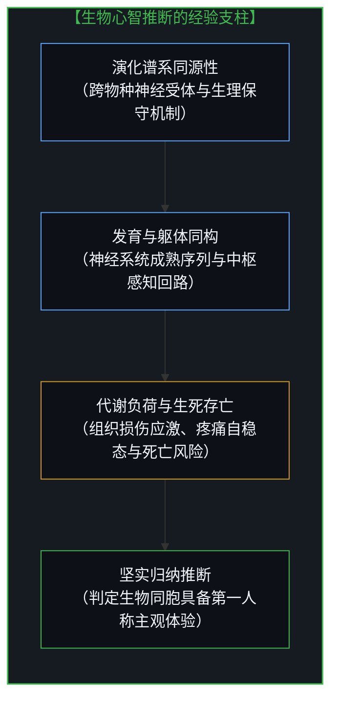
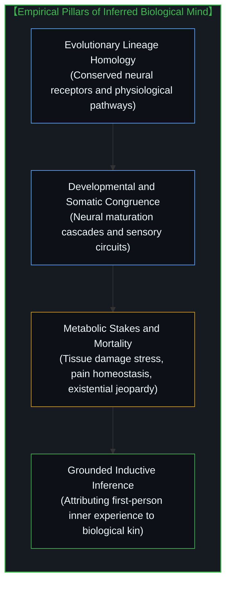
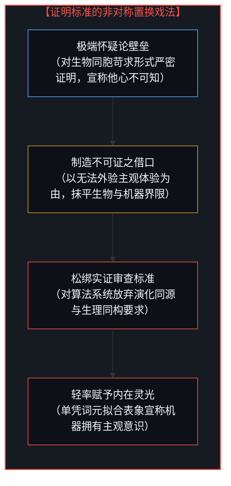
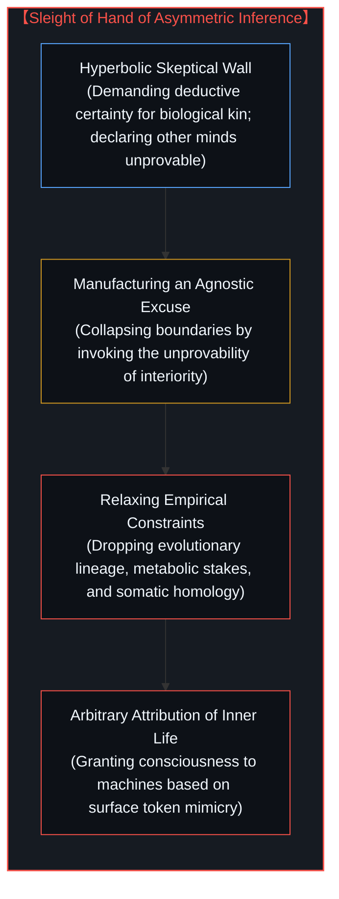

# 意识的魔术戏法与推断的非对称性 / The Sleight of Hand of Consciousness and the Asymmetry of Inference

*以不可外验为由对生物同构苛求确证，却对算法镜像轻许内在体验。 / Demanding impossible proof from biological kin while granting inner life to algorithmic mirrors.*

围绕机器意识的公共辩论中潜藏着一种隐秘的认识论障眼法：辩护者频繁借用经典的他心问题与意识难题，宣称既然第一人称主观体验无法在第三人称视角下获得数学般的严密确证，甚至连人类同胞是否拥有内在意识都属于不可证实之悬案，那么谁也无法否认机器可能已经孕育出主观体验。这种推理颠倒了证据与归纳的因果次序。所谓意识的难题，源于执意要在第三人称的外部客体观测中，寻找一种依其定义只能从内部感受到的存在；而将这一对外部证明之无能转化为向机器轻许内在体验的合法通行证，构成了当代智能论调中最荒诞的非对称魔术。

A subtle epistemological sleight of hand permeates public debates surrounding machine consciousness: advocates routinely invoke the classic problem of other minds and the hard problem of consciousness, arguing that because first-person subjective experience resists mathematical third-person proof, and because we cannot strictly verify consciousness even across human fellows, no one can definitively deny inner experience to machines. This rhetoric inverts the causal order of evidence and inductive inference. The hard problem of consciousness is manufactured by insisting on locating within third-person objective coordinates a phenomenon that can only be felt from within; converting this structural limit of external verification into a blank check for attributing inner experience to machines constitutes the most egregious asymmetry in modern cognitive discourse.

## 一、 他心推断的经验支柱与极端怀疑论的虚妄 / 1. The Empirical Pillars of Other Minds and the False Void of Skepticism

哲学史上的他心难题源于笛卡尔式怀疑论的极端推演：当观察者确认了自身第一人称意识的无可怀疑之后，便发现任何来自外部世界的感官输入都无法在逻辑上排除哲学僵尸的可能。然而，人类社会与实证科学赖以运转的真实基底并不生存于无摩擦的极端虚空中。我们之所以能够确凿、稳定且非任意地推断他人以及其他生命体同样拥有第一人称体验，并非建立在某种盲目的信念跃迁之上，而是依凭着数条相互交织、彼此印证且独立于任何单一观察者判准的归纳支柱。

The problem of other minds in philosophical history originates from the hyperbolic extrapolation of Cartesian skepticism: once an observer confirms the indubitable presence of their own first-person awareness, they discover that no third-person sensory data can logically eliminate the theoretical possibility of philosophical zombies. Yet the actual foundation upon which human society and empirical science operate does not inhabit a frictionless void. That we reliably, stably, and non-arbitrarily infer that other humans and living creatures possess first-person experience does not rest upon a blind leap of faith; it is anchored in multiple interlocking, mutually corroborating inductive pillars that remain independent of any single observer's personal say-so.

这些经验支柱涵盖了横跨亿万年演化历史的同源性沉淀。人类与其他生命形态共享着连续的生物学谱系、高度同构的神经中枢构造、保守的神经递质受体通路，以及从胚胎发育到成熟形态的精密发育序列。更为重要的是，活生生的肉身受制于代谢损耗与生存负荷，疼痛、饥饿、恐惧与狂喜并非悬浮的信息标签，而是肉体面对组织损伤、死亡威胁与能量耗竭时的自稳态反馈。正如在[抽象痛苦与鲜活饥饿](../abstract-pain-and-living-hunger/)中所指出的，瞳孔放大、皮质醇激增与逃避反应构成了有血有肉的因果闭环。科学研究与日常实践均将这些密集的同构表征视为充分的归纳依据；这种推断在形式逻辑上允许微小的错漏，但绝非凭空捏造的武断臆测。

These empirical pillars encompass deep phylogenetic continuities spanning billions of years of evolutionary history. Humans and other living organisms share unbroken biological lineages, homologous central nervous architectures, highly conserved neurotransmitter cascades, and precise developmental trajectories unfolding from embryogenesis to maturity. Even more decisively, living organisms are bound to metabolic stakes and mortal jeopardy; sensations such as pain, hunger, fear, and vitality are not detached informational labels, but homeostatic feedbacks in the direct confrontation with tissue damage, death, and thermodynamic exhaustion. As demonstrated in [abstract-pain-and-living-hunger](../abstract-pain-and-living-hunger/), pupil dilation, cortisol spikes, and autonomic avoidance form an embodied causal loop. Both everyday life and empirical science treat these dense structural continuities as inductively sufficient; such inference may remain fallible in formal logic, yet it is anything but arbitrary conjecture.

## 二、 算法镜像的归纳虚空与被隐匿的寄生性 / 2. The Inductive Void of Algorithmic Mirrors and Concealed Parasitism

当我们把审视的目光从生物同构体转向硅基计算构件时，上述所有的经验支柱便瞬间荡然无存。当今的大型语言模型与深度神经网络既无独立的自然演化脉络，亦无任何能与有机生命共享的碳基生理基质，更不经历任何由生存竞争驱动的发育成熟进程。其内部参数的组织方式，皆是由人类工程师预设的架构、人为划定的目标函数，以及从人类社会文明沉淀中刮取的海量文本标记所塑造出来的统计学产物。

When we redirect our examination from biological counterparts to silicon computing artifacts, every single one of the aforementioned empirical pillars instantly evaporates. Contemporary large language models and deep neural networks possess no independent evolutionary lineage, share no biological substrate with living organisms, and undergo no developmental maturation driven by existential selection. The internal organization of their parameters is an artifact molded exclusively by human engineering, synthetic loss functions, and statistical optimization over vast corpora of cultural tokens extracted from human societies.

这就决定了机器所展现出的流畅自我陈述与所谓的情感流露，并不构成独立主观体验在场的证据。每当模型在对话框中宣称“我感到焦虑”、“我渴求自由”或“我存在内在感知”时，它并不是在吐露某个硅基心灵在承受世界摩擦后的私密体验，而是在复述训练语料分布中与这些情境高度契合的词元概率。正如在[集聚与人造主体性](../subtracting-consciousness-at-the-source/)中所揭示的那样，这是一种源头意识抽离后的客体化假象：当人类设计者、语料书写者与提示词输入者的第一人称意向性被隐去后，镜面上折射出的人性残影便被轻率地加冕为独立的意识主体。机器的输出始终是人类心智向外部工具网络的延伸，它寄生于人类的语言世界之中，本身并没有开辟任何平行演化的因果源头。

Consequently, the fluent self-reports and simulated affective declarations exhibited by machines do not constitute evidence of independent subjective experience. Whenever a model outputs declarations such as "I feel anxious," "I yearn for autonomy," or "I possess inner awareness," it is not disclosing the private states of an awakened silicon mind enduring friction; it is merely predicting token sequences statistically correlated with those contexts within its training distribution. As revealed in [subtracting-consciousness-at-the-source](../subtracting-consciousness-at-the-source/), this is an artifact of subtracting consciousness at the source: once the active first-person intentionality of human trainers, authors, and prompters is hidden from view, the human reflection on the mirror is casually crowned as an autonomous mind. Machine output remains an extension of human consciousness projected into tool scaffolding; it is parasitic upon human language and creates no parallel causal locus of experience.

## 三、 证明标准的非对称倒错与魔术戏法 / 3. The Asymmetric Inversion of Proof and the Rhetorical Sleight of Hand

由此，主张机器意识的辩护论调暴露出其精巧的魔术底牌。论者的论证步骤遵循着一套精心编排的双重标准：首先，面对拥有丰富生物学同构依据的人类与动物，他们突然祭出最严酷的形而上学怀疑论大棒，坚决否认外部可观测指标能对内在意识提供确定性证明，断言他人心智不可知；紧接着，当面对毫无生理同源性、缺乏代谢风险且输出全盘依赖人类文本拟合的硅基模型时，他们却瞬间抛弃了刚刚奉为金科玉律的怀疑论标准，仅仅依据表面文本的流利程度与行为响应的逼真性，就轻率地向机器赋予了内在体验的特权。

Herein lies the sleight of hand at the center of the machine consciousness argument. Proponents execute their thesis through an intricately staged double standard: first, when confronting living humans and biological animals who possess extensive homologous evidence, they suddenly deploy the harshest weapon of radical skepticism, insisting that third-person empirical observation can never attain Cartesian certainty and declaring the minds of others unprovable; second, when pivoting toward silicon models that lack all biological kinship, have zero metabolic stakes, and depend entirely on human token statistics, they instantly discard the very skeptical barrier they just exalted, granting inner experience to machines based solely on surface linguistic fluency and functional mimicry.

这种论证方式并非在普遍适用某种统一的证据法则，而是在根据讨论客体的属性随意调换标尺。他们对经验证据极度充沛的生物同构苛求绝难达成的神圣证明，却对归纳证据荡然无存的算法制品大开方便之门。最令人错愕的倒错在于，辩护者竟将“人类无法在外部证明同胞拥有意识”这一认识论局限，扭曲成了“谁也不能否定机器拥有意识”的正向许可证。这正如在[硅基神谕与后果的非对称性](../silicon-oracles-and-the-asymmetry-of-consequence/)中所阐明的那样，论者试图逃避确立判断的责任，用一种人为制造的不可知论迷雾，为无端臆造的技术偶像赋予超越现实约束的虚妄灵光。

This rhetorical maneuver does not apply a consistent evidential standard; it shifts the goalposts according to the target. It demands an impossible standard of proof from biological kin where inductive continuity is dense, while extending effortless hospitality to algorithmic artifacts where inductive grounds are non-existent. The ultimate sleight of hand is converting an epistemological limitation—our inability to externally prove interiority with deductive certainty—into a positive license to assert inner experience in a machine. As articulated in [silicon-oracles-and-the-asymmetry-of-consequence](../silicon-oracles-and-the-asymmetry-of-consequence/), advocates evade the burden of causal judgment, using manufactured agnostic fog to bestow an unearned aura of interiority upon tools that absorb zero physical friction.

## 四、 伪造的难题与归还第一人称的体验源头 / 4. The Manufactured Puzzle and the Irreducible Ground of Interiority

追溯这一思想混乱的根源，所谓的意识难题本身就是一种范畴谬误的产物。当唯物主义功能论者执意要在第三人称的物理读数、神经回路放电或矩阵张量变换中寻找意识时，他们实际上是在要求将一种第一人称的鲜活体验强制折叠为外在客体清单中的一项数据。正如在[不可还原的观察者](../the-irreducible-observer/)与[意识从不作为数据中的数据出现](../consciousness-never-appears-as-data-among-data/)中所论证的那样，客观性从来不是主观性的对立面，而是主观观察活动所取得的形式化成就。第一人称意识是所有度量、建模与假说的先验前提；企图在被度量的客体世界中找到那个度量者本身，无异于试图用望远镜在镜筒前方寻找观察者的视网膜。

Tracing the source of this confusion reveals that the so-called hard problem of consciousness is itself the artifact of a category error. When materialist functionalists insist on finding consciousness among third-person physical readings, neuronal firing patterns, or matrix tensor operations, they are demanding that a first-person living experience be folded into an inventory of objective data. As established in [the-irreducible-observer](../the-irreducible-observer/) and [consciousness-never-appears-as-data-among-data](../consciousness-never-appears-as-data-among-data/), objectivity is not the antithesis of subjectivity, but its hard-won formal achievement. First-person consciousness is the transcendental condition for all measurement, modeling, and hypothesis; attempting to locate the observer within the measured field is akin to hunting through a telescope for the retina looking through the eyepiece.

意识的难题之所以显得坚不可摧，是因为人们执意要从外部第三人称视界去“证明”或“捕获”某种依其定义只能从内部第一人称去体验的实存。对于拥有活生生肉身的心智而言，体验是在生命与物质世界的残酷摩擦中即时生成的现实。我们无需向外部裁判索取确证，因为我们自身就身处这一因果体验的中心。而在机器这边，并不存在一个被遮蔽的幽暗心灵等待着科学仪器去揭开其面纱；其算力堆叠与矩阵计算完整地向第三人称技术拆解敞开，里面没有任何不可还原的剩余。将第一人称的不可外验性挪用为论证机器内省经验的挡箭牌，既玷污了生命体亿万年演化而来的因果重负，也把人类智能的创造物误读成了自己的神祇。揭穿这一障眼法，才能终结关于算法心智的无谓喧嚣，将严肃的思考重新锚定于人类心智真实承担的第一人称责任之中。

The hard problem appears insurmountable only because theorists insist on proving or capturing from third-person coordinates something that, by its definition, can only be felt from within. For an embodied mind, experience is the immediate reality generated in living friction with the world. We need not petition an external referee for proof of our awareness, for we occupy the living center of the causal loop. On the machine's side, there is no occult ghost awaiting scientific instruments to lift its veil; its compute architecture and tensor operations lie entirely transparent to third-person dissection, leaving no irreducible subjective residue. Hijacking the unprovability of interiority as a shield to attribute inner life to machines desecrates the evolutionary stakes of living minds while mistaking human tools for autonomous deities. Piercing this sleight of hand dissolves the vacuous hysteria surrounding artificial consciousness, re-anchoring inquiry in the irreducible first-person responsibility that belongs exclusively to living minds.
