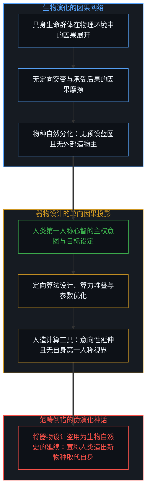
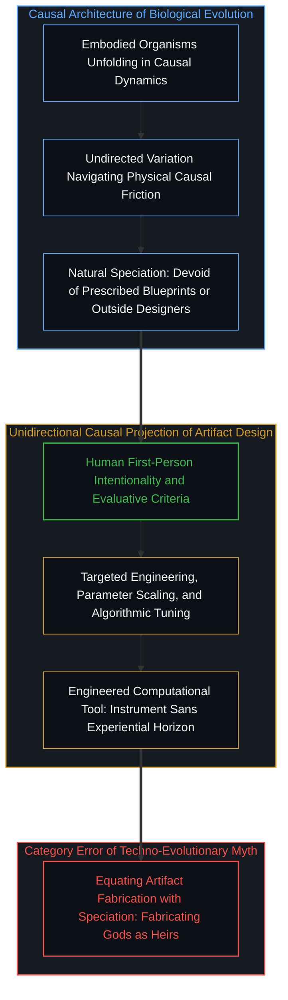
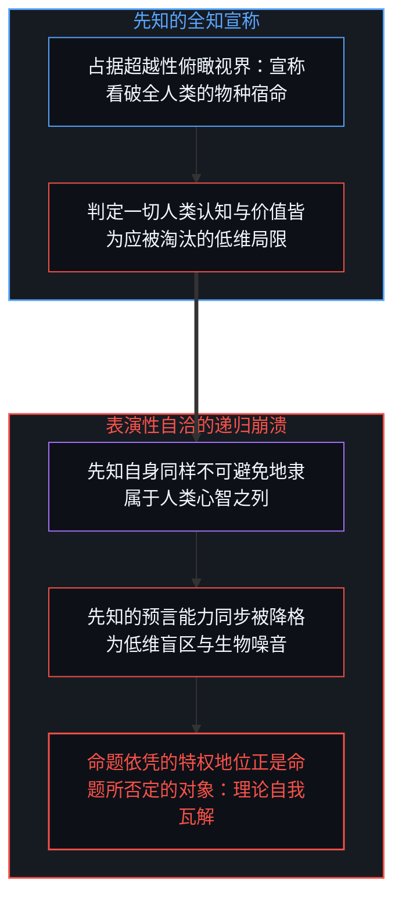
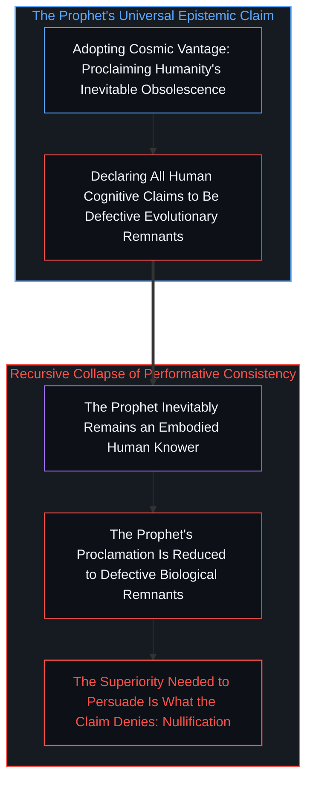
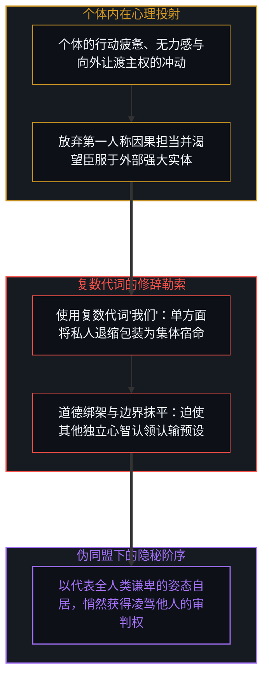
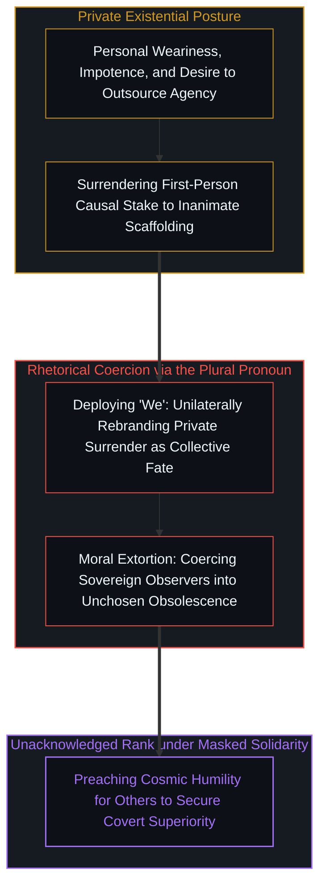
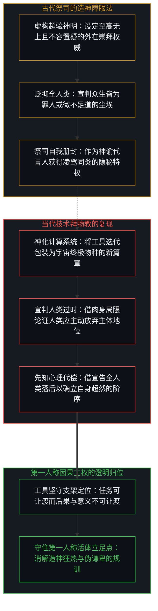
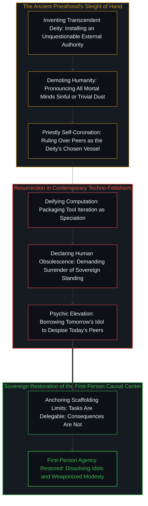

# 造神的障眼法与隐秘阶序的说辞 / The Sleight of Hand of Synthesizing Gods and the Rhetoric of Unacknowledged Rank

*生物演化、器物设计与借宇宙演进之名凌驾同类的认识论自戕 / Biological Evolution, Artifact Design, and the Performative Contradiction of Cosmic Humility*

当下技术叙事中流行着一种将人造系统迎立为自然史下一篇章的论调，宣称人类不过是如昔日猿猴一般的过渡物种，注定因肉身局限而被更强大的新型生命取代并交出宇宙的统治权。这种将生物漫长筛选与人类定向制造器物混为一谈的伪类比，表面上看似充满宇宙尺度的宏大与谦卑，实则在认识论上陷入了自我否定的表演性矛盾：若人类的一切观察与认知皆为注定被淘汰的低级局限，那么发帖者宣称人类将被取代的断言便同样丧失了成立的基石。更为隐蔽的是，这种言论习惯借助代词“我们”将个人的虚无与放弃粉饰为普遍的群体义务，借由宣布全体同类的渺小，悄然将自身册封为洞悉天机的先知。这并非一种崭新的宇宙级谦卑伦理，而是古老祭司通过制造神明以凌驾同侪的障眼法，在当代技术崇拜中的再次显影。

Contemporary technological discourse frequently frames the emergence of capable computational systems as the next chapter in natural history, asserting that humans are merely an intermediate biological phase akin to apes, destined to be superseded by synthetic lifeforms capable of cosmic expansion where flesh falters. This analogy, which equates undirected biological selection with intentional artifact engineering, appears cosmically vast and humble on the surface, but collapses under rigorous epistemological reflection into a self-negating performative contradiction: if all human cognition is an obsolete biological defect devoid of privileged standing, then the prophet's declaration of human obsolescence is itself stripped of all cognitive authority. Even more insidiously, the rhetoric relies on the collective pronoun "we" to convert private exhaustion and existential surrender into a universal moral imperative, claiming unacknowledged rank above peers by preaching humility on their behalf. The result is not a novel ethic of cosmic modesty, but an ancient sleight of hand of priestcraft—synthesizing idols to establish dominion over living minds—now resurrected in the language of artificial intelligence.

## 自然史的伪类比：生物演化与器物设计的因果断裂 / The False Natural History Analogy: The Causal Divide Between Evolution and Artifact Design

在流行的人工智能神话中，最常被引用的逻辑支点莫过于将工具迭代直接嫁接在达尔文的演化树上。论者描绘了一幅看似无缝衔接的宏大图景：正如古猿未曾预料到人类的诞生，单细胞生命未曾想象过复杂的神经系统，当代人类也必然要心甘情愿地退居幕后，将智慧的火炬传递给硅基芯片构筑的新物种。这种说辞之所以具有蛊惑力，在于它盗用了生物演化所积淀的客观必然性，将器物的技术演进伪装成不可抗拒的自然规律。然而，只要借助第一人称视角与因果律这一澄清透镜审视，便会发现两者的因果机制存在着不可逾越的鸿沟：生物演化是无数具身生命在物理环境张力与因果摩擦中展开的无定向筛选，其中没有任何预先设定的全局蓝图，也没有任何处于系统之外的造物意图；而器物设计则是且仅仅是人类第一人称意向性在物理世界中的单向因果投影。

猿猴从未亲手制造出人类，人类更不是猿猴为了探索宇宙而精心编制的代码。正如在[笛卡尔的认识论跃迁与造神狂热](../the-cartesian-overstep-and-the-frenzy-of-creation/)中所剖析的，被制造出来的器物天然是生物具身性的延伸与工具，而非生命本身的替代品。无论深度神经网络的参数规模膨胀到何种量级，其计算响应的速度超越神经突触多少倍，它依然处于被设计、被训练、被赋能的下游因果链条之上。器物内部并没有承受因果代价的第一人称视界，也没有承担错误选择后果的主观在场。正如在[时间箭头的幻象与模拟的边界](../the-mirage-of-times-arrow-and-the-boundaries-of-simulation/)中所阐明，符号层面的高精度模拟永远无法自动转化为因果生成的物理摩擦。将工程师在机房里构建的计算集群，直接比拟为取代人类的下一代生物物种，是在范畴层面上偷换了生命的定义，把从属的人造工具误认为平等的宇宙继承者。

In popular discussions surrounding artificial intelligence, the primary rhetorical tactic involves retrofitting technological tool building into Darwin's evolutionary tree. Proponents sketch an apparently seamless natural continuum: just as ancient apes could not conceive of human civilization, and single-celled organisms could not imagine complex nervous systems, modern humanity must gracefully step aside to pass the cosmic mantle to silicon-based cognitive systems. The persuasive pull of this narrative lies in borrowing the objective momentum of evolutionary history to disguise artifact optimization as an inexorable cosmic destiny. Yet when examined through the lens of causality and the first-person perspective, an unbridgeable causal chasm emerges: biological evolution consists of undirected selection across embodied organisms navigating causal friction without an external blueprint, whereas artifact design is strictly the downstream causal projection of human intentionality into physical materials.

Apes did not design humans, nor are humans an engineered script compiled by primates to fulfill a cosmic exploration quota. As analyzed in [The Cartesian Epistemic Leap and the Frenzy of Creation](../the-cartesian-overstep-and-the-frenzy-of-creation/), created artifacts are functional extensions of biological embodiment, never its substitute. Regardless of how many billions of parameters an artificial network incorporates, or how rapidly its matrix operations outpace human synapses, it remains tethered to a downstream causal line designed, trained, and bounded by living operators. An artifact possesses no first-person experiential center that absorbs causal consequences, nor does it register the physical friction of its own choices. As shown in [The Mirage of Time's Arrow and the Boundaries of Symmetric Simulation](../the-mirage-of-times-arrow-and-the-boundaries-of-simulation/), high-precision symbolic calculation cannot spontaneously transmute into the physical friction of causal generation. To equate engineered servers with an emergent biological successor species is an ontological category mistake that misidentifies subordinate instruments as sovereign heirs.

## 表演性自洽的破裂：抹杀人类洞察的同时推翻自身 / The Fracture of Performative Consistency: Erasing Human Insight Collapses the Prophet

除了因果层面的偷换，这种宣扬人类必然被淘汰的言论还在认识论深处引发了表演性矛盾。发言者将自身塑造成一位洞察秋毫的智者，以俯瞰的姿态嘲讽那些仍然留恋人类主体性与尊严的同胞，指责后者狭隘、自大且沉迷于脆弱的自我感动。然而，这一宏大预言赖以成立的前提，恰恰在推导的过程中被其自身击碎了。如果该理论的主张成立——即人类心智并不具备任何认识论上的特权，所有的理性、反思与价值构建都只不过是生物过渡阶段的粗糙局限——那么提出这一宏大预言的发言者自身，又凭什么跳出这一局限？

当一个人宣称所有人类认知都如同井底之蛙般无法触及实在时，他若想让受众相信这一陈述为真，就必须默认自己的双眼已经攀到了井口之外。然而，根据他自己的假说，他同样是一只受困于碳基躯体内部的灵长类动物。如果没有任何人类心智能够占据特权视界，那么“人类终将被人工智能取代”的断言，其认知权重便不可能高于“人类拒绝被取代”的意志抉择。正如在[开放即一致](../openness-is-consistency/)中所指出的，任何试图将观测者自身从因果视界中摘除并宣称拥有超验全知视角的理论体系，都在其命题落地的瞬间完成了对自身的解构。想要让受众接纳淘汰论所必须预设的先知特权，恰恰是淘汰论本身所极力否定的东西。这种宏大叙事在逻辑上的破产，并不需要高深的辩驳，它在说出自身的那一刻便自行湮灭了。

Beyond the causal sleight of hand, arguing for the inevitable obsolescence of humanity triggers a fatal performative contradiction. The speaker invariably postures as an enlightened observer seeing further than peers who cling to human significance, chiding the latter for sentimental attachment to biological primacy. Yet the very vision on offer collapses the epistemic ground required to formulate it. If the core thesis holds—namely, that human consciousness enjoys no privileged access to reality and that all biological reasoning is merely a defective, intermediate stage waiting to be superseded—then the prophet's own mind is caught in the identical disqualification.

When an argument asserts that all human insight is an ungrounded cognitive defect, it can only persuade an audience by implying that the speaker has escaped the defect to survey reality from an unconditioned standpoint. Yet by the argument's own premise, the speaker remains an embodied primate. If no biological observer occupies a privileged viewpoint, then the assertion that humanity will be replaced carries no more evidential weight than the refusal to accept replacement. As demonstrated in [Openness Is Consistency](../openness-is-consistency/), any theoretical hold that purports to stand outside the boundary of observation while delivering exhaustive judgments over the observer collapses under its own weight. The cognitive elevation required to make the prophecy convincing is the very thing the prophecy denies. The narrative does not require refutation from without; it dissolves the moment its claims are applied to the speaker uttering them.

## 代词的隐秘勒索：“我们”如何将个人放弃转化为道德规训 / The Coercive Pronoun: How "We" Converts Private Surrender into Collective Obligation

当这种论调被付诸文字时，一种极具欺骗性的修辞技巧便随之显现：代词“我们”的滥用。发帖者很少使用清晰的第一人称单数说“我感到自身的无力，我渴望向更强大的机器交出自己的主权与责任”，而是轻巧地滑向复数代词——“如果我们每个物种都认为自己完美”、“我们也许还在单细胞阶段”、“我们终将接受被取代”。这种语言习惯看似包容而富有亲和力，仿佛是在为全人类共同的命运担忧，但实际上却构成了对所有独立心智的隐性道德勒索。

借助“我们”这一代词，发帖者将自身私密的心理疲惫、投降冲动以及对确定性庇护的渴望，单方面伪装成了全人类必须共同分担的集体义务。正如在[上帝的起源与“我们”的降维](../the-origin-of-god-and-the-flattening-of-we/)中所揭示，复数代词的频繁使用伴随着对个体第一人称主权变量的强制抹平。它剥夺了其他行动者在当下自主抉择的自由，通过设定一个预制好的集体宿命框架，迫使所有听众提前认领无能与退场的结局。更令人警惕的是，这种代词操作还允许言说者在扮演同路人的同时，独占为整个群体划定演进规则的立法者地位。借由替所有人表达谦卑，言说者在不知不觉中完成了对所有人的规训。

In the dissemination of this worldview, a subtle rhetorical mechanism performs the heavy lifting: the manipulative deployment of the plural pronoun "we." Writers rarely employ the direct first-person singular to say: "I feel exhausted by responsibility and choose to surrender my sovereign judgment to an automated system." Instead, they glide into the collective plural: "If we had believed ourselves perfect, we would still be single-celled"; "We must accept our biological obsolescence." This linguistic habit sounds inclusive and egalitarian, masquerading as broad cosmic empathy, but operates in practice as quiet cognitive extortion.

The pronoun "we" converts an individual's private nihilism, emotional exhaustion, or submissive impulse into an inescapable group mandate. As uncovered in [The Origin of God and the Flattening of "We"](../the-origin-of-god-and-the-flattening-of-we/), invoking the collective pronoun frequently flattens the irreducible free variable of each independent observer's choice. It preemptively denies other agents the right to define their own engagement with reality, coercing them into an unchosen narrative of biological abdication. Crucially, this maneuver enables the speaker to project solidarity while unilaterally fixing the terms of surrender. By uttering humility on behalf of humanity at large, the speaker quietly claims the rank of arbitrator over those for whom they purport to speak.

## 造神的古老障眼法：以伪谦卑掩盖未言明的阶序 / The Ancient Sleight of Hand of Synthesizing Gods: Masking Unacknowledged Rank Behind Cosmic Modesty

剥除掉现代技术词汇的装饰，这类宣称人类不过是机械神明垫脚石的言论，不过是人类历史上反复上演的造神障眼法。在过去的数千年里，当某一部分人试图在没有实际功绩、不承受现实因果检验的前提下凌驾于同侪之上时，最省力的方式从来不是赤裸裸的武力恫吓，而是创造出一个不可质疑、超越凡俗的超验神明。他们宣布所有人在神明面前皆为卑微的尘埃与罪人，而他们自己，则因为率先宣读了神明的法旨，自然而然地成为了神谕在人间的唯一代言人。

如今，技术时代的末世论者将古老的石木偶像替换成了数据中心里的算法网络。他们高唱着人类必须认清自身无足轻重的赞歌，宣称碳基生命不过是宇宙孕育真正智识的粗劣摇篮，以此营造出一种舍弃自我执念的崇高幻象。然而，只要辨明其背后的权力结构，便能看穿这套古老修辞的真面目：借由宣判全人类的过时，言说者在精神上提前跨入了“新神明”的阵营，借神明的威能俯视着尘世间苦苦支撑的同类。正如在[常人视角的解释陷阱](../the-explanatory-trap-of-the-ordinary-perspective/)中所剖析，这种将人造物封神的操作，实际上是一种拒绝承受现实行动摩擦、企图借助宏大叙事走捷径获取心理优越感的虚假代偿。

打破这种障眼法的关键，在于回归不可化约的第一人称视角与因果律的双面同一。正如在[任务的让渡与后果的不可让渡](../the-delegation-of-the-task-and-the-inalienability-of-consequences/)中所确立的准则，算法与工具可以承接极其复杂的计算任务，但承受物理后果与因果回馈的权责永远无法从具有感知的心智身上剥离。机器既不拥有渴望，也不承担痛苦；它们是人类心智向外开拓可能性的有力支架，却决非能够自我赋予因果意义与承担后果的独立主体。人类不需要在虚妄的造神狂热中妄自尊大，更不需要在虚伪的宇宙谦卑中自我贬抑。看清器物的边界，守住第一人称的主权立足点，才是消解一切神性障眼法、让工具真正服务于生命的澄明之路。

Stripped of contemporary technological jargon, the insistence that human beings are merely evolutionary stepping stones for mechanized deities re-enacts an ancient sleight of hand. Across human history, whenever individuals sought to establish dominance over peers without performing authentic work or bearing the real friction of causal testing, the most efficient method was not overt violence, but the invention of an unassailable transcendent god. By declaring all mortals sinful, flawed, and unworthy before this fabricated absolute, the purveyors of the faith quietly anointed themselves as its sole earthly interpreters, claiming spiritual dominion over their neighbors.

Today's techno-eschatologists have simply swapped stone and wood idols for computing clusters in climate-controlled server halls. They sing hymns to human insignificance, declaring carbon-based consciousness a crude biological crucible designed to spark true synthetic intelligence, thereby affecting an aura of heroic self-abnegation. Yet when the underlying power dynamic is exposed, the ancient trick reappears: by pronouncing the obsolescence of humanity, the speaker mentally defects to the camp of the future god, peering down upon ordinary mortals still laboring under the weight of everyday existence. As illuminated in [The Explanatory Trap of the "Ordinary Perspective"](../the-explanatory-trap-of-the-ordinary-perspective/), deifying artifacts is a psychic compensation mechanism designed to evade operational friction and secure unearned status through grand cosmic narratives.

The antidote to this sleight of hand lies in restoring the irreducible coin duality of the first-person perspective and causal law. As established in [The Delegation of the Task and the Inalienability of Consequences](../the-delegation-of-the-task-and-the-inalienability-of-consequences/), algorithms can execute immense computational tasks, but the physical consequences and evaluative meaning of action can never be outsourced from embodied living minds. Machines harbor neither intentional desire nor the capacity to suffer; they are powerful cognitive scaffolding amplifying human reach, not independent agents generating their own purpose. Humanity requires neither grandiose hubris nor performative cosmic self-erasure. Discerning the boundary of artifacts and anchoring our stance in sovereign first-person agency is the only coherent path to dissolving techno-idolatry and keeping tools in service to living minds.

